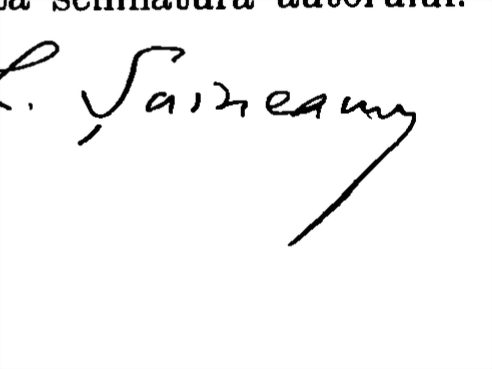

<!-- PAGE 001 -->
# ISTORIA  
## FILOLOGIEI ROMÂN  
### CU O PRIVIRE RETROSPECTIVĂ ASUPRA ULTIMELOR DEGENII (1870 - 1895)  
#### STUDII CRITICE  
**DE**  
**LAZAR ŞÂINEANU**  
* A DOUA EDIŢIUNE  
BUCURESTI  
EDITURA LIBRĂRIEI SOCECU & COMP.  
21, Calae Victoriei, 21  
1895  
www.dacoromanica.ro

---

<!-- PAGE 002 -->
Tóte exemplarele vor purta semnătura autorului.

---

<!-- PAGE 003 -->
# ISTORIA

## FILOLOGIEI ROMÂNĂE? Wait, no—the correct text from image is "FILOLOGIEI ROMÂNE". Let's correct:

# ISTORIA

## FILOLOGIEI ROMÂNE

www.dacoromanica.ro

---

<!-- PAGE 004 -->
**DE ACELAȘI AUTOR :**

- Elemente turcescă în limba română. București 1885. A doua edițiune în preparație.
- Elele. Studiul de Mitologie comparativă, 1886.
- Incercare asupra semasiologi i limbii române. Tesis de licență in Litere. Opera premiată de Universitate, 1887.
- Les jours d'emprunt ou les jours de la vieille. Tesis de doctorat. Paris-Leipzig, 1889.
- Studiul dialectologic asupra grafului evreo-german. Partea I. București, 1889.
- Lingvistica contemporană. Discurs de deschidere a cursului de Filologie comparativă la Facultatea de Litere din București, 1890.
- Raporturile între gramatica și logica. Studiul de Linguistică generală. Prelegeri ținute la Universitate. Buc. 1891.
- Autorii români moderni, III ed. Craiova, 1895.
- Ión Eliaud RĂDULESCU ca gramatic și filolog. Conferință ținută la Ateneu, cu portret și 4 anexe. București, 1892.
- Basmele române în comparațiune cu legendele antice clasice și în legătură cu basmele popoarelor învecinate și ale tuturor popoarelor românice. Opera premiată și tipărită de Academia Română. București, 1895.
- Studiul folkloric. Cercetări in domeniul literaturii populare (in curs de publicațiune).

**Va apare:**

- Șese ani din viața unui filolog român (1889–1895). Fragment auto-biografic de Lăzar Șăineanu. Va conține capitolele: Intârcerea mea în țară. — Primele impresiuni. — Lumini și umbre. — Numirea mea la Universitate. — Istoricul unei naturalizări. — Oameni și fapte. — Starea intelectuală a societății române la sfîrșitul secolului al XIX-lea.

www.dacoromanica.ro

---

<!-- PAGE 005 -->
# PREFAȚA LA A DOUA EDIȚIUNE

---

Prima edițione a acestei cărți a întâmpinat o primire binevoitóre, ce a covârșit tóté așteptările nóstre. Unele capitole au fost traduse în limba germană (în «Româniſche Revue»), iar studiul despre învĕțământul în epoca fanariotă a fost reproduc și comentat în limba neo-gréćă (în «Pa- tris»). Judecata emisă asupra fanariatismului a găsit o aprobar e unanimă, reducând ast-fel la adevérata lor valóre recentele tentative de reabilitare intelectuală a acelei triste epoce.

Recensiu nile apărute în revistele române și străine apreciază merit ele multiple ale operei și relevează bogăția informațiunilor și originalitatea vederilor. O notă discordantă în acest concert de elogii o forméză raportul din Analele Acad-

www.dacoromanica.ro

---

<!-- PAGE 006 -->
vi
miei Române (1893), cu ocaziunea prezentării la premiere a cărții. Autorul acelei dări-de-séma, d. N. Quintescu, nu este specialist în filologie. Cel puțin, singura-i operă remarcabilă «De la București la Coblenz» nu trădăz vro o erudițiune specială în această materie. Și numai astfel se pote întelege, cum d. Quintescu a căutat să înluciasea întelegerii raționale a faptelor cu o maliziostate plină de fineță și de reticență. Concluziunea-i dogmatică sună, că cartea «nu aduce nimic nou în studiile noștre filologice». Aci raportorul ia vorba nouî în sens absolut și repetă astfel inconscient sentença de mult rostită și de către însuși înteleptul Solomon, care intr'un moment de ciudă esclamă: Nimic nou sub sòre! Dar străvechiul sceptic ținea ferm la spusele sale, pe când d. Quintescu și-a retracted — sîrmanul ! — în plină ședință a Academiei una din imputările ce-mi făcuse relativ la opera etnografică a d-lui Tociles cu. Și urmând acelei fericiate inspirațiuni, d-sa ar fi trebuit să-și calce pe inimă și să retracteze raportul în totalitatea sa — pentru onorea Academiei și a sciintei.
Afară de unele modificări și omisiuni neînsemnate, textul din a doua edițiune a rămas esențial același. El a fost pus în curentul cercetărilor
www.dacoromanica.ro

---

<!-- PAGE 007 -->
VII

și publicațiunilor din ultimii trei ani. Sperăm că  
și sub această nouă formă el va corespunde desti-  
națiunii sale și împărțășim din tótă inima dorința  
exprimată de unul dintre recenseni, ca acestă  
carte să dea ocaziune la numeróse lucrări noué,  
să îndemne la muncă tînêra generațiune și s'o  
sprijine cu indicații folositore.  

Lazăr Șaineanu  

București, 1 Maii 1895.  

---  

www.dacoromanica.ro

---

<!-- PAGE 008 -->
# INTRODUCERE

A trecut un secol, de când părintele Samuil Klaiîn de la Sad și Marele Vistier al Principatului Valachiei, Ianache Văcărescul, publicară, la scurte intervale și independent unul de altul, primele lucrări gramaticale asupra limbii române. Anii 1780 și 1787, când apărură „Elementele limbii daco-romane” și „Observațiile asupra Gramaticei românesc”, sunt date memorabile în istoria filologiei române.

Din primul moment se accentuează un mod de a vedea fundamental diferit în cercetarea materialelor limbii și această divergență se perpetuă în timp de un secol, constituind o barieră neînvinsă între două direcțiuni gramaticale extreme.

Una se afirmă mai întâi cu sgomot, reușește, mulțumită unor apucături erudite, a câștiga o parte inteligentă a națiunii și, tocmai în momentul când ajunge singură dominantă, sucompbă lăsând puține urme durabile. Cea-altă, cu o infățășare mai modestă, trece la început aproape neobservată, se continuă în tăcere cu Eliad și Golescu, apoi, despreguită cât-va timp, revine

39,856. Istoria Filologiei române. Ed. II.

1

www.dacoromanica.ro

---

<!-- PAGE 009 -->
2

# INTRODUCERE

ărăși la onoare: presentul îi aparține și e sigură de viitor.

Pe când Văcărescu, observator consciințios, se mărginesce la înregistrarea obiectivă a faptelor lingvistice, călăuzindu-se de usul, cel-î consideră ca unicul criteriu în materie de limbă; Klaïn și urmași lui introduc în filologia română principiul subiectivismului, imperspectând procedurile analoștilor anticți și adoptând ideile filosofice ale secolului al XVIII-lea despre caracterul artificial al graiului.

Acest mod de a vedea unilateral justifica în aparentă ori-ce inovațiune. Gramaticul, din simplu observator, devenea legislatorul suprem al limbii, ce o putea reforma după placul său vederile sale. De aci o tendență sistematică de ameliorări din ce în ce radicale: cu cât gramaticul posedă mai multă erudițiune, cu atât mai îndrăznită devenea opera-î de transformare lingvistică. Lucrul ajunge acolo, în cât evoluția finală nu mai recunoaște punctul de plecare: lipsindu-î in cele din urmă ori-ce măsură și flăturând cu tot din adinsul ori-ce sprijin temeînic, clădirea, ridicată după vederi subiective, rămâne planând în vid și se spulberă la prima ciocnire cu realitatea.

Considerând pustiirile și confusiuile, cauzate de subiectivism în domeniul limbii, cel mai mare gramatic al timpului modern și al tuturor timpurilor — Jacob Grimm — a condamnat fără apel întreaga gramatică subiectivă ca „un pedantism fără sémén” (eine unsägliche Pedanterei), care, lipsit de luminile evoluției istorice și ale filosofiei linguistice, se mișcă într-o

www.dacoromanica.ro

---

<!-- PAGE 010 -->
## INTRODUCERE

Lumea pur ideală și nu are alt rezultat decât a împiedica liberă dezvoltarea grăului.  
În cartea de față s-au consacrat capitole speciale originii și treptatei progresări a principiului subiectiv, reprezentat în filologia română de școala etimologică ardelénă.  
Fenomenele de ordine istorico-politică i-au dat naștere și împrejurări sociale nefavorabile aui contribuitorii a-i da o direcție din ce în ce mai acută. Provenința și existența sa seculară își găsesc astfel până la un punct justificarea lor.  
Procedurile-i extreme nu sunt mai puțin motivate față de starea încordată a lucrurilor din trecut.  
Dintre lingviștii occidentului, până la întâiul pătrar al secolului nostru, Hervas e singurul care declară fără inconjuri originea romană a poporului și a limbei noastre. Toți ceilalții până și Adelung consideră pe ambele ca amestecături slavo-romane. Trebuia să fie pusă în lumină, și într-o lumină orbitorie, latinitatea nemului și a limbii sale. Acesta explică excesul de zel în studiile istorice și gramaticale, întreprinse de reprezentanți ai școlii etimologice.  
Două bunuri neprețuite au rezultat din îndelungatele opinții ale etimologismului: alfabetul latin, care prevalează din capul locului (în sinele acestei școle), și studiul istoric al limbii naționale, inaugurat de Cipariu, figură venerabilă și rămâsă cu desăvîrșire izolată chiar în mijlocul adeptilor săi. Filolog în totă puterea cuvintului, moderatiunea și sporncia activitate a repostului canonic (din nemorocire în mare parte atinsă  

www.dacoromanica.ro

---

<!-- PAGE 011 -->
4

# INTRODUCERE

de dogmatism) formeză o continuă protestare în contra exceselor comise în domeniul limbef de predecesorii și contemporanii sei.

Tendencia latinistă are o analogie isbitore cu direcțiunea inaugurată în Grecia modernă, către sfîrșitul secolului trecut cam în același timp cu Klaïn si Șin-cai, de către celebrul elenist Adamantios Korais (1748—1833).

Aceleri năzuinte de regenerare națională și aceeași precipitare de a demonstra Europei directa continuitate și transmisiuunea intactă a elenismului îndemnară pe ilustrul filolog a efectua o restaurare formală a trecutului lingvistic. Pe când Serbia avu rara fericire de a poseda in Vuk Karağić un om de geniü, care, cel diniți în orientalul Europei, a întreveșut importanța folklorului și a căutat să formeze din graiul popular traińicul substrat al unei limbă literare; Korais şi școlă sa, înlăturând cu desăvîrșire limba poporului, ajunsără la creațiunea unei idiomne artificiale, care nu mai era nici elenă nici gréca modernă, ci o mixtură dintr’ambele în dose neegale. Dacă formele gramaticale și vocabularul rămâneau eleme, apoi sintaxa, adică sufletul graiului, era străină și in casul cel mai favorabil o imitațiune superficială a spiritului antic. Această stare de lucruri continuă a subsista încă în Grecia și abia în timpul din urmă s’au arătat simptomele unei viguroase reacții în favorea graiului popular.

O tendența pronuntată de latinisare a limbéi se ivi și in Frânta către mijlocul secolului al XVI-lea. Așa numita Pleiadă urmărea regenerarea limbéi și a www.dacoromanica.ro

---

<!-- PAGE 012 -->
## INTRODUCERE

poesiei prin imitarea modelelor antice : „Nos ancêtres — țieca erodul Pleiadei, du Bellay, în manifestul său de reformă literară — ont laissé la langue si pauvre et si nue qu'elle a besoin des plumes et des ornements d'autrui”. Dar ca și așaurea, Școla nu se mulțumi numai a slei din isvorul greco-roman și a imbo-găți limba prin infusione de elemente antice, dar pre-tinse încă a latinisa și forma neosă a vorbelor popu-lare, trecând ast-fel cu vedere individualitatea limbii.) 

Precum latinisatorii noștri nu se mulțumi cu forme existente (ca „ați, luptare”), considerând-le ca vulgare și aspirând a le mobili (rostitnd și scriind „acia, lucfare”); tot astfel reprezentanții Pleiadei căutau a alunga vorbele reale „oiseux, venger”, substituindu-le forme pretins mai nobile „otieux, vindiquer”, dintre care o parte, mulțumită unor imprejurări particulare, a persistat diferențiându-se și sub raportul semantic. 

Negreșit în secolul al XVI-lea Șciinta limbii s’afla

1) Cele două caracteristici ale Reformelor linguistice încercată de Pleiada — comoposițiunile și derivatiiuștile artificiale—ne întimpină și în istoria limbii române. Faimoselte compozițiunii în stil omeric din versurile exametre ale lui Dubartas, contemporanul Pleiadei: Apollon porte-jour, Hermes guide navire, Mercure échelle-ciel, invente-art... țși afă un pendat în formațiunile analoge ale reposesului Aristia : mintagerul Jove, braț-alba Junone, ambeclaudu Vulcan, pedeveioce Achile.... Iar specimene de provimenten ca «verve-verver- verment» ne aduc aminte de «limbă-limbarii-limbâmint» și de celelalte mijloc de îmbogățire a limbii, pre-conisate de Pumnilul și școla sa. — Nil novi sub sole! Limba franceză avu, în aceală secol, și al său «italianiseurs», pe carf il ya în rs, într’o serie de dialoguri francese italianisate, ilustrul elenist Henricus Stephanus.

www.dacoromanica.ro

---

<!-- PAGE 013 -->
6  

# INTRODUCERE  

încă în fașe, necutezând a eși la lumină de cât în modeste, adesea necorecte, formule de Tatăl-nostru, cărî se continuă până la începutul secolului actual. O istorie a filologiei române nu poate trece cu vederea aceste prime gândăviri ale unei științe, menite a ajunge la plină dezvoltare abia în timpul nostru. Iată pentru ce cartea de față se deschide cu cercetarea cronologică de asemenea formule.  

In ordinea normală a lucrurilor, poliglotia a precedat filologia, cunoașterea practică a limbilor provenind din cauze cu totul altele decât cele ce produc studiul lor științific. Țara noastră s-a aflat odinioară sub acest raport în condițiuni excepțional de favorabile. Cu mult mai întâi ca limba română să fie supusă unei cercetări gramaticale, ea posedă poligloți de mare valoare, între care Canteimir, principele-scriitor, ocupă întâiul rang atât prin cunoștințele-i multiple, cât și prin viu interes, ce manifestă pentru istoria și limba română.  

Invățământul din școle fanariote a fost mai mult o pede serioasă decât un element de progres pentru cultura națională.  

După capitolele consacrate primelor studii gramaticale asupra limbii noastre și după examinarea minutioasă a diferitelor sisteme de reformă linguistică, patronate de direcțiunea etimologică, fonetică și italianistă, trecem apoi în revistă evoluția lexigrafiei române de la primele ei începuturi până în prezent. „Elemente române în limbile străine” formează o completare indispensabilă a ochirii critice asupra progreselor lexigrafiei.  

www.dacoromanica.ro

---

<!-- PAGE 014 -->
# INTRODUCERE

7

Un capitol final, cel mai vast dintre tóte, expune suma de muncă intelectuală, desfășurată în cursul ultimelor două decenii în diferitele ramuri ale filologiei române. Lăsând la o parte lucrările secundare, menite a întregi sinteza în amănuntele ei, sintem în stare a releva în tóte aceste ramuri câte una sau două producțiuni de prima ordine, cari fac onore științei române și permit a spera in viitorul ei.

In modul acesta ne-am încercat a prezenta un tablou pe cât s'a putut mai comprehensiv despre fa- sele cele mai marcante ale filologiei române. Cu spir- itul impartial am căutat a ne da semă de sistemele cele mai contradicțioare, de vederele cele mai originale în materie de limbă. In cercetarea diferitelor manifestări și producțiuni filologice, ne-am câlăuzit tot-d'a- una de principalul istoric, singurul care pote da o explicățiuine satisfăcetoare unor fenomene de natură atât de variată.

Nu avem pretențiunea de a oferi o Istorie completă și metodica a filologiei române, dar sperăm a nu fi trecut cu vederea nici unul din momentele mai importante ale evoluțiunii sale istorice.

www.dacoromanica.ro

---

<!-- PAGE 015 -->
# LIMBA ROMÂNĂ IN OCCIDENT (1592—1850)

## I. Formule de „Tatăl nostru“

De pe la mijlocul secolului al XVI-lea până aprópe de pragul secolului nostru, Linguistica a străbátut o perioádă, al căreif caracter diletantic priméză aprópe cu desăvîrșire ori-ce preocupare serios sciintifică. Activi-tatea-Î se manifestă, in răstimpul acestei periode, mai ales în compilare sau colecționare de specimenede limbă, cari tindreau mai mult a satisface curiositateainvętǎtorilor de cát contribuiau la progresarea adevăratăa sciinței. Formula Tatălui-nostru servea drept sub-strat tuturor acestor specimen. O idee preconcepută a dat impulsul și a călăuzit, peste un secol și jumă-tate, cercetările de asemenea natură : idea, că tote limbile se trageau dintr’un prototip comun, din limba ebraică, care, după expresiunea lui Casaubonus, avea de părinte pe insuși D-Deû, iar de tălmacii pe Moisi (Deus hujus linguae pater, Moses vero interpres erat). Acésta filiațiune necesară a tuturor limbilor din cea ebraică a devenit fatală pentru evoluțiunea ulterioără

www.dacoromanica.ro

---

<!-- PAGE 016 -->
10  

**LIMBA ROMÂNĂ ÎN OCCIDENT**  

a Linguisticei — întocmai ca sistemul lui Ptolomei pentru Astronomie — impunându-i o seculară staționaritate până ce Leibniz a scos din acest cerc vrăjii și împrumută independența și soliditatea vederilor sale filosofice.  

Două sunt lipsurile inerente mai tuturor acestor colecțiunile de Tatăl-nostru: imperfecțiunea reproduceri, care rezultă dintr'o necunoscută personală a celui mai mare număr din limbile publicate, și excluderea absolută — până la Hervas și Adelung — a analizei gramaticale. Cel dintâi dintre lingviștii numiți consideră toate compilările anterioare drept „vana curiosidad”, iar cel din urmă le numește cu drept cuvint „blosse Curiositäten-Cabinetter“.¹)  

Cu toate acestea poligotole de Tatăl-nostru reprezentând, cum am spus, aproape întreaga activitate lingvistică a celor din urmă două secole și ele nu pot fi trecute cu vedere de istoricul, care urmăresc fazele de evoluțiune ale Științei limbii. Publicațiunile de această natură sint, pe de altă parte, foarte cu greu accesibile. Preocupaț de atari considerațuni, am crezut folositor a stringe într'un mănunchi păreri emise de invetații lingviști ai Occidentului despre originea și natura limbii și a națiunii române. Sau, in lipsă de păreri, probele de limbă — formulele de Tatăl-nostru — ce dinși reproduc cu această ocaziune.  

Cea mai veche dintre aceste probe, formula publi—  

¹) Cf. Adelung, *Mitridates*, vol. I, Apendice, unde se dă și literatura respectivă.  

www.dacoromanica.ro

---

<!-- PAGE 017 -->
LIMBA ROMÂNĂ ÎN OCCIDENT
11

cată de Megiser, e anterióră „Tatăluf-nostru“ de marele logofet Luca Stroică, „cea dintâi încercare de a scrie cu litere latine“, cum o numesce d. Hasdeü, și ea merită deci a fi pusă în fruntea monumentelor cu caractere latină.

Este, apoi, interesant a vedea, cum un lingvist de forța lui Hervas ascrie limba române o pozițiune definitivă între cele-lalte idiome neo-latine și declară, cu decenii înaintea intermediatorului filologiei romane, neîndoișoasa sa origine (Catalogo, 180): „Lingua latina matrice de’ dialetti valaco, italiano, spagnuolo, francese e portoghese... Il linguaggio valaco o moldavo e dialetto immediato della lingua latina e conservasi puro nella Valakia, sebbene essa è circondata da genti che parlano idiomi differentissimi, quali sono il turco, greco, illirico, ungaro e teutonico“.

Nu mai puțin interesant este a urmări sforțările ortografice de a reda, printr-un alfabet insuficient, numerosele nuante-fonetice ale limba române. Semnul ă, bună-ora, îl găsim notat cu ae, u, e, ä și y…

Întâi le colecțiuni de Tatăl-nostru confundă limba română (wallachisch) cu cea walisi său walonă (wal-lisch, wallistisch, wallonisch, wälisch); ba încă Megiser o gratifică cu același epitet ca și limba chinesă (chinische Sprach).

Urméză, în ordine cronologică, principalele dint’-aceste compilări, cercetate din punctul de vedere special, care formez subiectul acestui studiu.

Cel dintâi, care a utilizat formula „Tatăluf-nostru“ ca probă lingvistică, e un German din Mün-

www.dacoromanica.ro

---

<!-- PAGE 018 -->
12

# LIMBA ROMÂNĂ ÎN OCCIDENT

chen, Johannes Schiltberger. Acesta întreprinse, între anii 1394—1427 o călătorie prin Europa, Asia și Africa. El străbătu prin Ungaria și Bulgaria, Valachia, Transilvania și Moldova, numită pe atunci Valachia mică. Călătorul notază pretutindenea localitățile principale și atinge în trecât despre limbile și obiceiurile popoarelor, ce visita. Despre limba română n’are de cât o idee vagă, considerând-o ca o idioma de o natură particulară.

Iată pasajul privitor la țările Române¹):

„Am fost și in Valachia și in două oraşe principale, unul numit Agrich (Argeş) și celă-lalt turcesc (Bucuresci?). Şi o cetate numită Ubeberil (Brăila), care e așezată pe Dunăre. Acolo negustorimea are corâbi și galionе, pe cari transportă mărfuri din țeri pagăne. Trebuie încă scuit, că poporul din Valachia Mare şi din

¹) Reisen des Joh. Schiltberger aus München in Europa, Asien und Afrika von 1394 bis 1427, herausgegeben von Neumann. München, 1859, p. 92 și 160: «Ich bin och gewesen in der Wallachy und in den zwei hopstetten; eine genant Agrich (Argeş), die ander türkisch (Bucuresci?). Und ein statt gehaisen Übereil (Brăila), die liegt uff der tunow (Donau). Da haben die kocken (corâbi) und die galein (galionе) die coffmanschatz bringen ir niderleg von der heidschaff. Es ist och ze merken das das volk in der grossen und in der kleinen Wallachy cristenlichen glouben helt. Und habent och ein besunder sprach, und lassen och all samt har und bart wochsen und schnides nymer nütz ab. Und bin gewesen in der kleinen Wallachy und ze sybenbürgen.... Dornach ist ein statt haist Sedschoff (Suceva), die ist hopstätten in der kleinen Wallachy.» — Cf. Schiltberger, Reisebuch... nach der Nürnberg Handschrift, her. mit Erklärungen, Lcsarten, Wörterverzeichnissen etc. v. Langmantel. Stuttgart, Lit. Verein, 1885.

www.dacoromanica.ro

---

<!-- PAGE 019 -->
# LIMBA ROMÂNĂ ÎN OCCIDENT

13

Valachia Mică e de religiune creștină. Și el are o limbă particulară și lasă să-i crească părul și barba, fără a se tunde vr'o dată. Am fost și în Valachia Mică și în Ardel.... Apoi e o cetate numită Sedschoff (Sucéva), care e capitala Valachiei mici."

Conrad Gessner sau Gesnerus (1515—1564), bărbat de o erudițiune universală, fundatorul Zoologiei moderne și al Istoriei literare, a resumat cunoștințele linguistice ale timpului în „Mithridates, de differentis linguarum tum veterum, tum quae hodie apud diversas nationes“, apărută la Zurich, in 1555. In dedicațiunea cărții el observă, că constatarea afinităților linguistice nu-i un simplu obiect de curiositate, ci o parte integrantă a educațiunii scientifice, că particularitățile graiului și deosebirile limbilor merită s'atragă atențunea unui spirit cult și filosofic.

Gessner făcu întâia încercare mai însemnată a unei colecțiuni de Tâtł-nostru (in număr de 22), mîncheind cartea cu specimene din limba Țiganilor și a cărăitorilor. In privinta originii și înrudirii limbilor, autorul împărtășește ideile greșite ale contemporanilor seți: numaí ebraica e limbă pură, celelalte simple degenerări sau amestecături. Pe pagina 65 reproduce un Tâtł-nostru reto-roman (churweltsch), far la pagina 69, in lipsa unui specimen linguistic, ne dă următoarea notiță privitore la Țera Românescă : „Valachia perquam lata regio est, a Transylvanis incipiens, usque in Euxinum protensa pelagus, plana

www.dacoromanica.ro

---

<!-- PAGE 020 -->
14  
LIMBA ROMÂNĂ ÎN OCCIDENT  

ferme tota, et aquarum indiga: cujus meridiem Ister fluvius excipit, septentrionem Roxani occupant, quos nostra etas Ruthenos appellant, et versus fluvium Thiran nomados Scytharum genus, quos Tartaros hodie vocitamus. Hanc terram incoluerunt quondam Getae... Postremo Romani armis subacti ac deleti sunt. Et colonia Romanorum eo deducta, duce quodam Flacco, a quo Flaccia nuncupata. Longo temporis tractu, corruppto (ut sit) vocabulo, Valachia dicta. Sermo adhuc genti Romanus est quamvis magna ex parte mutatus, et homini Italice vix intelligibilis...."  

Hieronymus Megiser din Stutgard, cât va timp profesor la Lipsca, mort in 1616, publica la 1592 in Francfurt o colectiune de specimen linguistice sub titlu : „Specimen XL diversarum, atque inter se differentium, linguarum et dialectorum, a diversis auctori- bus collectarum, quibus oratio dominica est expressa“ (a doua ediție, Francfurt, 1593).  

Formula românescă a Tatălui-nostru se află la Megiser sub N. XLI cu titlu „in der chinischen Sprach“ (confundând-o cu limba chinesă de sub N. XLVI) și sună ast-fel :  

Tatal nostru, cine esti in ceriu,  
Sfincaișase numele t eu,  
Se vie imparacia ta,  
Su (și) se fie voja ta, cum in ceriu asa pre pomuntu,  
Pui ne de tote zilele, de-ne noa astazi,  
Su ne jerta gresalele nostre, cum su noi jertam a greșiturilor nostri,  
Su nu ne duce pre noi in kale de ispitra (sic !),  
Su ne mantuiaște pre noi de reu, Amen.  

www.dacoromanica.ro

---

<!-- PAGE 021 -->
# LIMBA ROMÂNĂ ÎN OCCIDENT

Alăturăm aci formula cea mai veche a Tatălui-nostoru cu litere latine, aflată de d. Hasdey în „Corpus legilor polone“ de Sarnicki și tipărită la Cracovia în 1597, adică 5 ani după publicarea „specimenului“ lui Megiser, de care diferă în fond și in formă :

„Parintele nostru ce esti in ceriu, swinçaskese numele teu : se vie imperecia ta, se fie voia ta, komu ie in ceriu assa ssi pre pemintu. Penia noastre se-çoase de noai astedei. Ssi iarte noae detoriile noastre, cum ssi noi lessem detorniczilor nostri. Si nu aducze pre noi in ispite, ce ne mentuiaste de fitlanul. Ke ie a ta imperecia ssi putara ssi cinstia in veczij veczilor. Amen.“¹)

Claude Duret, „Président à Moullins“, cum se intitulează insuși, scose in 1619 la Yverdon o voluminosă compilatiiune, in care vorbesce despre vr'o 56 de limbii, neuitând a pomeni graul animalor și al paserilor : „Thesaur de l’Histoire des langues de cest Univers, contenant les Origines, Beautez, Perfections, Decaden- ces, Mutations, Changemens, Conversions et Ruines des Langues.“ La paginile 842—844 Duret tratéază „de la langue des Walachiens“:

«Nicolas Chalcondile, livr. 2 de son Histoire des Turcs tient que le langage des Valaques semble de prime face que c'est presque

¹) A se confundra aceste formule și cele de mai la vale cu specimenul cirilic de «Tatăl-nostru» din diferite epoce, reproduce in Crestomatia d-lui Caster I, 9, 32, 39, 41 și 53 și in Cuvente den Bătrână II, 118 și 413.

---

<!-- PAGE 022 -->
16

## LIMBA ROMÂNĂ ÎN OCCIDENT

une meme chose avec celuy des Italiens, mais il est si corrompu, et se treuve finalement tant de difference de l’un à l’autre que malaysément se pourroient-ils entretendre. Comme cela se soit peu faire qu’eux usans presque du mesme parler, de mesmes mœurs et forme de vivre que les Italiens, soient allez prendre pied en ces marches-là, je ne l’ay point encor entendu, et s’y n’ay trouvé personne qui n’en scuest rendre assez bon compte. Toutesfois le bruit commun est que ce furent gens ramassez de divers endroicts, qui y aborderent premierement sans cependant avoir fait chose digne de mémoire, ne qui mérite d’estre insérée en la presente Historie. Au reste on voit encor pour le jourd’hui qu’ils ne different pas beaucoup d’avec les Italiens, tant en leurs façons de faire qu’en leurs ustancilles, armeures, esquipages et vestemems, qui sont presque uns à tous les deux Peuples...

«Pour ce qui appelle leur origine et commencement il faut entendre ce qu’on appelait anciennement Dacie, estoit une grande étendue de pays... L’empereur Trajan l’ayant finalement subjuguée y transporta des Romans pour la repeupler et la réduit en forme de Province. Mais du temps de Galien et depuis sous Aurelian les barbares la reconquiert. Les Gothz aussi se jetterent dedans durant l’Empire de Gratian, tellement que de ce melange les Valachiens sont descends, lesquels ayant confondu les mauvres, façons de faire et langage des dessusits en ont fait je ne say quoy à part qui n’y ressemble plus de rien. Toutesfois ils usent aussi du parler Ruthenique et Slavony; pour le regard de leur nom, on dit que ce fut un Roman appelé Flaccus qui leur donna premierement et que de là ils ont esté dicts Falachi ou Valachii: car les lettres de F et V consonant se changent facilement l’une en l’autre... Ieux tiennent la Religion Chrestienne selon l’usage et tradition des Grecs. Et n’ont guere été cognees sinon depuis l’an 1350 que l’empereur Charles s’estant voulu attaquer à eux y fit mal les besognes. Or combien que la Valachie soit aussi appelée Moldavie et que ces deux noms soient le plus souvent confondus l’un pour l’autre, neantmoins il y a difference... On divise encor ces deux pays d’une autre sorte: celui qui est en haut devers Russie du costé d’Occident est la Valachie, dont la principale ville s’appelle Socavie (!), forte a merveilles et quasi inexpugnable. L’autre qui est le

www.dacoromanica.ro

---

<!-- PAGE 023 -->
# LIMBA ROMÂNĂ ÎN OCCIDENT

17

long des rivages du pont Euxin . . . est la Moldavie ou Bessarabie . . .¹)

Andreas Müller prelucrea intr’un mod critic co-lectiunile existente în publicațiunea apărută la Berlin, în 1680, sub titlul : „Oratio orationum, S. s. Orationis dominicae versiones præter authenticam fere centum, eaque longe emendatius quam antehac, et e probatis-timis auctoris potius quam prioribus collectionibus, jamque singula genuinis lingua sua characteristicus.“

Pe pagina 58 găsim, sub rubrica „walisic“ (wallace), un Tatâl-nostru românesc reproduc în caractere latine, deși tote cele-lalte s’afă acolo în caracterele lor originale :

Parinthele nostru cela ce esti en tzeri.

Svintzasceste numele teu.

Vie eperetzia ta.

Facese voe ta cum en tzer ase si pre pæmentu.

Pæne noastre tza de sætzcioase dæ noaæ atezii.

Si lase noaæ datariile noastre, cum si noi se læsæm datornitzilor nostrî.

Si nu dutze prê noi la ispitire.

Tze ne mentueste prê noi de viclianul.

¹) Intr’un articol publicat de d. A. Sandu în «Revista Contimporană» din 1873 (pag. 684—694) sub titlul «O pagină despre Ro-mânia dintr’o Geografie imprimată la Paris în 1543» (Recueil des di-verses histoires touchant les situations de toutes régions et pays contenus les trois parties du monde, nouvellement traduit de latin en français), figurază următoarea notiță : « . . . Encore pour le présent ilz usent du langage romain en cette contrée, combien qu’il soit si corrompu qu’à grand’ peine le peuvent les Romans même entendre. Ilz ont usage de lettres romaines, fors qu’il y a quelques lettres changées....

39,856. Istoria Filologiei Române. Ed II.

www.dacoromanica.ro

---

<!-- PAGE 024 -->
18

# LIMBA ROMÂNĂ ÎN OCCIDENT

John Chamberlayne a publicat în 1715, la Amsterdam, un volum în $4^0$ coprinde 142 de Tatăl-nostru, distribuite după continente și țări, reproducute în caracterele originale și cu transcrierea latină: „Oratio dominica in diversas omnium fere gentium linguas versa et propriis cuiusque linguae characteribus expressa.„

Afară de formula „walică” reprodușă după Müller, Chamberlayne publică alte două Tatăl-nostru românescși, procurate lui de către „nobilissimus D-nus Birndorff, Ablegatus Hungariae et Transilvaniae Ecclesiarum ad Augustissimam Magnae Britanniae Reginam Annam.„

Aceste două formule „walachice” figurează între cele „slavonice” și „moscovitice” și sună astfel:

1. Tatul nostru csinje jesh in cserju.
Svinczie sze numelje tou.
Sze vii Imparacczia ta.
Fii voja ta cuut in cserju, asha shi pe pamuntul.
Punje nostru de tote zilelye da noi astesz.
Jarta greshaleye nostre cum shi noi jartam a greshitilor nostri.
Shi nu ducz pe noi inka la ispitira.
Shi mentujește pe noi de roo. Amin.

2. Parintye nostru csela cse esh in cseri.
Svenczie sze numelje tou.
Vii Imparacczia ta.
Fase sze voja ta cum in cseri asha shi pe pamuntul.
Punye nostru csaszechsio (!) da noo astezes.
Shi lasza noo datoririle nostre cum shi noi laszam datornicilor nostri.
Shi nu ducsz pe noi la iszpitră.
Shi mentujește pre noi de hitjanul.

www.dacromanica.ro

---

<!-- PAGE 025 -->
# LIMBA ROMÂNĂ ÎN OCCIDENT

19

Hervas (Părintele Lorenzo) se născu la 1735 în Mancha spaniolă dintre o familie nobilă. A stat mult timp ca misiunar în America, de unde reveni în 1767 la Cesena, în Italia. El muri la Roma, în 1809, ca bibliotecar al Vaticanului. Spre a propaga religiunea creștină în Lumea-Nouă, Hervas învăță multe limbi americane și fu isbit de diversitatea lor. Cu ajutorul altor misiunari adună un mare număr de vocabular, trecu apoi la idiomele din cele-lalte continente și-și propuse a îmbriățișa, intr’o operă grandiosă, istoria progreselor spiritului omenesc de la inceputul existenței sale fizice. Această enciclopedie, scrisă mai întâi italienneșe și apoi tradusă de autor în limba-i maternă, portă titlul: „Idea dell’ Universo, che contiene la storia della vita dell’ uomo, elementi cosmografici, viaggio estatico al mondo planetario, e storia della terra“ și apărui, în intervalul de la 1778—1787, în 21 de volume in 4°. Pe lingvist il intereséază ultimele 5 părți ale acestei opere monumentale, din care ne mulțumim a cita pe cele ce priveșc mai d’aprópe acest studiu.

„Catalogo delle lingue conosciute e notizia delle loro affinità e diversità“, 1784 (tradus spaniolesce : Madrid 1800—1805, 6 tomuri in 4°).

Tomul întâi conține limbile americane, pe cari autorul le reduce la 11 familii; al doilea cele din insulele Mareului Ocean și din continental asiatic, stabilesce familia limbilor malaese și polinesice și dovedește fără direcția idiomelor familiei semitice ; ultimele patru tomuri tratează despre limbile europene.

Extragem din această operă pasajele privitore la

www.dacoromanica.ro

---

<!-- PAGE 026 -->
20

LIMBA ROMÂNĂ ÎN OCCIDENT

națiunea și la limba română, servindu-ne de ediționea spaniolă, singura ce ne am putut-o procura :

«Naciones y lenguas de la antigua Dacia que comprehendia los países que hoy se llaman Transilvania, Moldavia y Valaquía (III, 246 urm. și 260 urm.): En estos países se hallan hoy cinco naciones diversas, que hablan otros tantos lenguages diferentes, y todos estos se hablan en sola Transilvania, la qual es la Babel no solamente de las lenguas, sino tambien de las religiones, pues apenas hay secta europea que en ella no se halle. En los dichos países hay tres naciones dominantes que son la teutonica, húngara y valaca; se hallan poblaciones de esclavones, y hay la gente llamada faraoana, la qual es la que comunmente se llama gitana. La nacion valaca desciende de colonias italianas y habla un language que es dialecto latino.

«La lengua valaca es la mas extendida en las tres provincias que forman la antigua Dacia. La dicha lengua con sus palabras y artificio gramatical demuestra claramente ser dialecto latino. De la lengua valaca hay varios dialectos, mas todos ellos muestran su origen del idioma latino, del que se han alejado mucho mas que los dialectos latinos que se hablan en Italia, Francia y España, porque los valacos estan entre naciones de muchos y diversos lenguages, porque han estado y estan sujetos à algunas de ellas, y porque habiendo caido en profunda ignorancia han carecido del conocimiento y leccion de los libros latinos. Tantos motivos de corrupcion como ha tenido el language valaco, han faltado en las naciones italiana, francesa y española para que se corrompisen sus respectivas lenguas, que son dialectos latinos como la valaca.

«Collario dice sobre los dialectos valacos (1. I, c. 19, p. 92): «El language mas puro de los valacos se parece mucho al italiano: mas el que en las cosas sagradas usan principalmente los valacos biharienses, tiene palabras iliricas, porque, si no me engaño, recibieron de los iliricos la religion y el rito griego que observan tenazmente.»

«Juan Luci, en su historia de Dalmacia (Amstelodam 1666), tratando criticamente del origen, nombre y lengua de los valacos, pone (I. VI, p. 785) las palabras siguientes para que se conozca la afinidad

www.dacoromanica.ro

---

<!-- PAGE 027 -->
## LIMBA ROMÂNĂ ÎN OCCIDENT
21

de ella con la latina: albu, ansu (i angelus), apa (aqua), ape (apis), argint, arma, aur, barba, barbosul, bou, bunu, buna, calul, caemp (campus), calla (calis), calliator (viator), caine, camassa, capul, cielul, domnul, dutor (debitor), erba, frat, fratia, freul, far, gaina, lume lumen), lung, maire (l major), munte, nic (l nix), negro, pament, rivul, rossu.

*Las palabras valacas que se acaban de poner son totalmente latinas poco desfiguradas; mas generalmente en el valaco se desiguran mas que en italiano y en el espaijol y non tanto como en el francés. Yo que entiendo bastante bien estas lenguas y la latina, con el conocimiento de estas cuatro lenguas semejissimas a la valaca, no llego à entender medianamente los libros escritos en el valaco mas puro. Hay varios dialectos valacos; los menos puros tienen muchas palabras de los lenguajes de los rusos y de los búlgaros; . . . en Valaquia se habla lengua valaca, que se escribe con la letra de Bulgaria y los divinos oficios se celebran por los valacos en lengua esclavona.

«El hablar la nacion valaca dialectos latinos no prueba absolutamente que descienda de la romana o latina, porque de esta ciertamente no descenden la francesa, la espaijola, ni otros que hablan dialectos latinos únicamente fuéron dominados por los romanos que se valieron de la industria, no menos que de la dominacion, para introducir su lengua en las naciones dominadas. Los valacos, à mi parecer, descenden de los romanos ó de los italianos, y de su descendencia hallo ser convincentes las pruebas siguientes que reciben nueva fuerza del ser dialecto latino el language valaco.

«Los Valacos, dice Luci citado, no se dan el nombre Valacos, sino el de Rumenos, y se glorian de ser Romanos... La tradicion que las naciones tienen de su origen, es fundamento grande para probar este: y al fundamento da prueba incontestable, quando su origen se declara por los nombres que ellas se dan à si mismas. Una nacion ne olvida jamais el nombre que ella se da à si misma. Los valacos, antes del siglo XI, se daban el nombre de Romanos: este mismo nombre se dan hoy, y hablan dialecto de la lengua romana. Estos hechos certos prueban que es romana su descendencia.»

Saggio pratico delle lingue con prolegomeni e

www.dacoromanica.ro

---

<!-- PAGE 028 -->
22
LIMBA ROMÂNĂ ÎN OCIDENT

una raccolta di orazioni dominicali, in più di trecento lingue e dialetti", 1787.

Limbi sunt dispuse după țări și după gradul lor de înrudire; orațiunile dominicale sunt în număr de 307, reproducute în caractere latine și însotite de o traducere literală și de note gramaticale. Aplicația strictă a principiului gramatical, ca punct de plecare pentru judecarea diferențelor lingvistice, e relevată aci pentru întâia oră și merită să reproducem cuvintele, în cari Hervas formulizează acest principiu (p. 42 a ediției spanole). Vorbind de publicațiile analoge anterioare, în care probele lingvistice oferiau simple materiale brute neînsufletite de o analiză sciențifică, el dice :

"La noticia que del gran número de estos se da en dichas obras, servía más para satisfacer a la vana curiosidad, que para adelantar en las ciencias; porque los lectores no podían formar concepto de la diversidad y carácter de las lenguas en que se pone la oración dominical sin traducción literal, que hiciese conocer la variedad de sus palabras y artificio gramatical para formar justa idea de la diversidad de las lenguas y de las naciones que las hablaban."

Hervas publică între „dialetti latini” trei formule originale de Tatăl-nostru, omițând pe cele împrumutate din Chamberlayne mai sus reproducute.

Sub N. 262 o „orazione valaka”, ce a văzut-o intr’un Breviar manuscris cu caractere ilirice, intitulat greco-valaco, în Biblioteca Colegiului Propagandei din Roma. Numerósele greșeli de tipar fac această repro-

---

<!-- PAGE 029 -->
# LIMBA ROMÂNĂ ÎN OCCIDENT

23

ducere aprópe neinteligibilă, dar o retipărirm întocmai spre a da o idee de absoluta lipsă de valóre sciintifică a unor atari probe linguistice :

Tatulu nostru, karele esti ia cerio,
Sfczjelkzie numele tzu
Kie jepiczia ta,
Fie voata ta, pre kum jeferio, sci pinchita ;
Pchnje noastri czje de pururje dińoă noaō astize,
Sci ne iapti noaō grescalele noastre, prekum sci noi jertimi gresczeloró
. (nostri) ;
Sci nu ne duze pre noi je eipeti,
Tene erijjesce de feli rzu.

Nostim este, că Adelung, reproducénă întocmai această formulă atât de coruptă, și dă cu părerea, că ea ar fí „kutzo-walachisch“. In urma unor atari monstruo-si-tăti tipogrice, nu ne mai póte prinde mirarea, când Megiser confundă formula română cu cea chinesă, in-serând pe ambele sub aceiaşi rubrică (veďi mai sus); nici când Hervas declară că, cu tótă cunoscint-a-î perfectă a limbilor romanice, nu ajunge „à entender me-dianamente los libros escritos en el valaco mas puro“.

Sub N. 263 o formulă nu mai puțin greșit repro-dusă, scósă dintr’un Céslov tipărit la 1773 și aflat în aceiași Bibliotecă. Ea sună, saú mai bine nu sună, ast-fel :
Tatel nostru, karele eszczy ia czelury,
Ofnicjekce numele tu,
Wie japrícia tu,
Fie woja ta prekum in czeru, fsy pre pomianyt,

www.dacoromanica.ro

---

<!-- PAGE 030 -->
24

# LIMBA ROMÂNĂ ÎN OCCIDENT
Pianni nostr ci depurupi dneo noao astzy,
Sy ko iart noao hze szaene noastre, pre kum syz noy ertm hreszcyclop noszczy,
Sy nu ne duzcze pre noi in ispit,
Czi ne ishwiszcze del czel ru.

In fine, sub N. 264, o formulă, despre care șice c’ar fi primit-o din Moldova, unde se obiținuesc și pe care o reproduce și Adelung sub titlu „moldauisch-walachisch“:

Tatul nostru, kare est in tcherul,
Sfynzaskasi numele al tou,
Sa vie imperazie ta,
Se fie woye ta com yn tscher ascia pe pemyni,
Pune nostru tschel den tote ziile dy nou aste,
Sche jart nou grischele nostre, cun schi noi jartim grischelor (!) nostre,
Sche ne noi aducă yn is pity,
Jare matujet (!) pre noi den rue.

Contemporan cu publicațiunea lui Hervas se făcu, după îndemnul lui Leibniz și sub auspiciile împărăte-sei Ecaterina, o colecțiu lexicală coprinzând un nu-mêr de cuvinte indispensabile (ca deus, cælum, pater, mater, filius etc.), redacte în mai tôte limbile globului. Materialele, redijate de naturalistul Pallas, apărură la Petersburg, între anii 1787—1789, în două mari vo-lume, sub titlu: „Linguarum totius orbis vocabularia comparativa“. Opera, neavând mai nici un interes lin-guistic, ne mărginim a spune, că limba română (vo-loșski) ocupă al patrulea și șeselea loc între limbă albaneasă și cea ungurécă.

www.dacoromanica.ro

---

<!-- PAGE 031 -->
# LIMBA ROMÂNĂ ÎN OCCIDENT

25

Trecem în sfirșit la opera importantă, care conține sinteza filologiei comparative de la începutul secolului și care formeză linia de demarcațiune între sciența empirică a limbii din trecut și cea istorico-comparativă a timpului nostru.

Autorul ei,*Johann Christoph Adelung, născut în 1734 și mort la 1806, a consacrat întreaga-i viața studiilor de limbă și a desfășurat o activitate surprinzătoare. El singur a ridicat limbii germane un monument lexicografic, care a reclamat, la alte națiuni, efortările unor Academii întregi. Lucra neîntreapt 14 ore pe zi. Celibatar totă viața, Adelung avea obiceiul să dică, că femeia sa e masa-i de scris, iar copiii seile cele 70 de volume, mari sau mici, ce publicase în cursul celor 72 de ani a vieții sale. Singura sa slăbiciune era posesiunea unei mari varietăți de vinuri străine: pivnița sa, ce o botezas Bibliotheca selectissima, conținea patru- deci de felurii.

Cu ajutorul publicațiunilor lui Hervas și Pallas și a propriilor sale cercetări, Adelung începu se la 1806 a scote la lumină opera capitală a vieții sale: Mithridates, oder allgemeine Sprachenkunde, din care nu apucă cu viața de cât primul volum, în prefata căruia el numește această operă „copilul cel mai mic și probabil cel din urmă al Muzei sale, pe care l-a ingrijit și desimierdat cu totă gingășia, de care obicinuit are parte a se bucura copilul cel mai mic.” Restul publicațiunii fu îngrijit de Dr. Severinus Vater, profesor de teologie la Königsberg (ajutat, între alții, și de către

www.dacoromanica.ro

---

<!-- PAGE 032 -->
26

# LIMBA ROMÂNĂ ÎN OCCIDENT

Wilhelm de Humboldt) și terminat, la 1817, în patru tomuri sau șese volume.

Adelung adoptă, ca și Herwas, diviziunea geografică ca principiul de clasificare; descrie pe scurt originea, istoria și structura gramaticală a fiecărei limbă și dialect. Specimenele de Tătăl nostru îmbrățișează aproape 500 de idiome; fiecare probă e supusă unei cercetări critice și lexicale, după care se adaugă și lista publicațiunilor linguistice privitivore la acea limbă.

Sub numele de „römisch-slavisch“ sau „walachisch“ (II, 723—738), Adelung așeță limba română după familia idiomelor slave. Repetă, în introducere, pe scurt, cele șise de Thunmann (veți mai la vale), indoindu-se însă de aserțiunea acestuia, cum că în limba română s’ar afla mai multe elemente tracodace; imparte limba română în două dialecte principale: unul, daco-sau ungaro-român, dincolo de Dunăre, în Moldova, Muntenia, Transilvania, Bucovina, Banat și Ungaria de Nord; și altul, traco-român, dincolo de acest fluviu, în Tracia, Macedonia și Tesalia, unde formeză „cea mai mare parte a populațiunii“ și care idiomă e „gröber und unreeiner“, amestecată cu multe elemente albaneșe și grecesc; mai observă, că clasele nobile din Moldova și Muntenia vorbesc grecese sau turceșe.

Descriind „caracterul“ limbei române, relevază unele modificările fonetice (patru = quatuor, opt = octo) și găsește, în conjugarea verbului, o pretinsă asemănare cu cea slavonă, precum transformarea consoanței finale k în č și d în z îi pare analógă cu cea rusă.

www.dacoromanica.ro

---

<!-- PAGE 033 -->
# LIMBA ROMÂNĂ ÎN OCCIDENT

27

Ca texte, Adelung publică diferite formule de Tatăl-nostru, luate în parte de la predecesorii săi.  
Întâia formulă o reproduc după Stiernhelm, în prefata-i din edițiunea lui Ulfila, care însă nu indică izvorul proveninței sale (ea concordă cu cea reprodușă mai sus după Andreas Müller):  

Părinthele nostru cela ce esti in tscheri,  
Svintzascîse numele teu,  
Vie emperatziä ta,  
Facese voje ta, kum en tscher ase si pre păm entu,  
Pâne noastre tza sätzioase dă noaă estezi,  
Si lăse noaa datoriile noastre, cum si noi se lăsem datornitzilor nostri,  
Si nu ne dutze pe noi la ispitire,  
Tze ne mentueste pre noi de viclianul. Amen.  

A doua formulă e intitulată „dacisch-walachisch“ și e reproducă din Biblia lui Șerban Vodă (1688), după un exemplar aflat în Biblioteca regală din Dresden:  

Tatál nostru, tschel de tscherjuri,  
Sphinxziéská se numelje teu,  
Wije emperetsia ta,  
Fije woja ta kume in tscherju assa schi prj e pemântu;  
Pânje noastră tsche de toatje silelje dă ne o noao ästăsi,  
Schi lass a noao datoriile noastre, kum lassam schi noi datorniczilor nostri,  
Schi să nu nje dutschij prj e noi in bântuială,  
Tsche nje isbawjeschtsche prj e noi de cel râu,  
Ká a ta jaste emperetsia schi putierje schi slawa intru wiecez. Amen.  

A treia formulă, calificată de „siebenbürgisch-walachisch“, e citată după „Ungarisches Magazin“ (IV, 125):  

www.dacoromanica.ro

---

<!-- PAGE 034 -->
28
# LIMBA ROMÂNĂ ÎN OCCIDENT

Tatel nostru, karele jescht in tscherju,
Svinzaskă se numele teu,
Schi vie emperetzia ta,
Schi fie voja ta cumu-i en tscherju ascha schi pre pemuntu;
Puina noastre tscha de toate silele de-ne noao astezi,
Schi jartene greschăle noastre precum schi noi jertem greschtizilor
nostri,
Schi nu ne dutche pre noi en ispirata (),
Schi ne isbeveschte de tschel reu,
Ke'i ta emperetzia schi putăre schi slava den vätschi vätschilor. Amen.

In adao sele și îndreptările la cele scrise de Ade-
lung asupra limbii române, Water observă (IV, 407),
că alt loc se cuvinea limbii române și anume imediat
după retro-romana „als eine eben solche, ihren ausge-
bildeten Schwestern nachstehende, Tochter der lateini-
schen Sprache“; că nu merită epitetul de „rönisch-
slavisch“, de ștrece numărul cuvintelor de origine slavă
este „bei weitem nicht gross genug“, structura-i gra-
maticală s'abate din contră de la cea slavă și analo-
gile observate de Adelung sint parte accidentale, parte
nedefensive.

Water accentueză apoi diferența între dialectul daco-român și macedo-român; cel dintâi e atât de latin, în cât poeziil întregi se pot traduce din italiană în română cu cuvinte și terminațiuni corespundătoare pur latine. În sprijinul acestei aserțiuni se referă la o poezie româno-italiană¹), compusă de Körösi

¹) Vater o publică, împreună cu alte câteva căpătate de la Ko-
pitar, în Proben deutscher Volksmundarten. Leipzig, 1817, p. 93–104:
«Gedichte in wallachischer oder dacisch-romänischer Sprache».

www.dacoromanica.ro

---

<!-- PAGE 035 -->
LIMBA ROMÂNĂ ÎN OCCIDENT  
29  

(Crișan), ce o reproduce în paralel cu originalul italian :  

Voi ochi, muritore stele,  
Ministri perirei mele,  
S'in sommo anche m'aretati;  
Che murire mi optati;  
Inchiși, de mine uciți,  
Deschisi, voi ce nu puteti?  

Voi occhi, stelle mortali,  
Ministri dei miei mali,  
Ch'in sogno ancor mostrate;  
Che mio morir bramate;  
Se chiusi m'ocidete,  
Aperti, che non farete?  

La pagina 414 împărtășește un Tatăl-nostru moldovenesc din partea unei dragoman la ministerul afacerilor străine din Petersburg; îl reproducem din cauza ortografiei sale :  

Tatul nostru kare este n tscherul,  
Sphinxizasky numelui tyu,  
Fie npyryczija ta,  
Fie voja ta, kum n tscherjul ascha schi pre pemynet,  
Pynja noastr y tscha di purure dy ni nou astys,  
Schi ni jarty nou greschele noastre, kum schi noi jertym grescher-  
lor (!) noastre,  
Schi nu ne dutschi pre noi ntre ispyty,  
Schi ni isbyweschte pre noi di tschel ruy,  
Kum schi a ta jesta npyryczija schi sila schi slawa, a wek wewow. Amin.  

Continuatorul lui Adelung mai relevăză vorbe românește ca „alb, deget, vorbă, masă, rógă“ în raport cu italianele „bianco, dito, parola, tavola, prega“ — cea ce, după dinsul, ar dovedi o origine latină mai veche decât formele celorlalte limbile romanice. Aceiași cauză ar explica modificarea unor sunete ca qu în p (épă,  

www.dacoromanica.ro

---

<!-- PAGE 036 -->
30

# LIMBA ROMÂNĂ ÎN OCCIDENT

apă, opt, patru, lapte, piept și chiar kiept pentru equa,  
aqua, octo, quatuor, lac, pectus), a lu i l n r (móră = mola), modificări, care nu afectează cuvintele slave intrate în româna. Postpunerea articulului Vater o explică ca o particularitate a limbii române provenită dintr-o desvoltare proprie.

## II. Scriitori și istorici

Poetul german Martin Opitz, mort în 1639, fu chemat din Silesia, în 1622, de principele Gabriel Bethlen ca profesor de literatură la Academia din Belgrad. Acolo îi prin așa de bine, la Zlatna, în cât celebra localitatea într-o poema cu același nume, unde într-altete descrie limba, obiceiurile și firea Românilor din Transilvania :

Italien hat selbst nicht viel von seinem Alten,  
Ingleichen Spanien und Gallia behalten :  
Wie wenig dies kann dem Römer ähnlich sein,  
So nahe sind verwandt Wallachisch und Latein.  
Da steckt manch' edles Blut in kleinen Bauernhütten,  
Das noch den alten Brauch und Art der alten Sitten  
Nicht gänzlich abgelegt. Wie denn ihr Tanz bezeug...  

.  

Die Menschen, die noch jetzt fast römisch Muster tragen,  
Zwar schlecht, doch witzig sind ; viel denken, wenig sagen...  

„Italia însăși nu a păstrat mult din vechime, precum nici Spania, nici Galia: cât de puțin ele pot să- menea Romanilor, atât de aproape înrudită e româna  

www.dacoromanica.ro

---

<!-- PAGE 037 -->
# LIMBA ROMÂNĂ ÎN OCCIDENT
31

cu latina. Aci zace încă mult sânge nobil în colibele tărănesci, cari nu s'au lepădat încă cu totul de vechile obiceiuri și datine strâbune, precum dovedește și hora lor.... omeni, cari și astăzi pòrtă încă haîne după modelul roman, cam prôte; dar sint sfătoși, se gândesc mult și vorbesc puțin...“ ¹)

Același entuziasm se oglindesce în cuvintele geografului german Hoffmann, când caracteriză pe poporul român și limba sa : „Din amestecul elementului, din care se trage poporul român, se desvoltă capete, cari-s clasice și ar putea servi de model pentru geme; capete, cari și înlăuntrul ascund ceea ce arată în afară. căci niicărea nu întlnesci o inteligență mai repede, o minte mai deschisă, o agerime mai mare, unită cu dibâcie in purtare, cum o arată Românul cel mai de rind. Acest popor, unit și ajuns la cel mai falt grad de civilizațiune, ar fi potrivit să stea în fruntea culturii intelectuale a omenirii. Și ca să se implinescă aceasta, limba sa e atât de armomioasă și de bogată, că ar fi potrivită pentru poporul cel mai cult de pe suprafața pământului...“ ²)

Ión Thunmann, profesor de eloquență și filosofie la Universitatea din Halle, a fost primul invetăt din occidentalul Europei, care s'a ocupat cu istoria și limba Albanesilor și a Vlahilor sau Românilor macedoneni.

¹) Opitz, Deutsche Poëmata. Danzig, 1638: poema intitulată «Zlatna oder von Ruhe des Gemüths».
²) Hoffmann, Beschreibung der Erde, p. 3074.

www.dacoromanica.ro

---

<!-- PAGE 038 -->
32

**LIMBA ROMÂNĂ ÎN OCCIDENT**

In fruntea disertației sale figuréază aceste memorabile cuvinte: „Nouă Europelilor occidentalî nici un popor al continentului ce locuim nu ne este așa de necunoscut în privința originii, istoriei și limbii lor, ca Albanezii și Vlahii. Și totuși sint popore importante (Hauptvölker), popoare vechi, pe cari ori-ce istoric ar trebui să le cunoscă și a căror istorie ar umplea o mare lacună în istoria antică și modernă a Europei. Dar ele nu jocă acum vr’un rol insemnat, sint popore supuse, sint nenorociți — și istoricul e adesea tot așa de nedrept ca și omul de rind: el desprențuesc pe cel ce nu-i norocos“.¹)

Thunmann constată, că Vlahii grăcesc aceeași limbă ca și frații lor de dincoace de Dunăre, fiind însă amestecată cu mai multe elemente grecesci. Reproduce apoi Abecedarul său Prototopia lui Kavalliotis, protopop din Moschopolis, „cel mai învētat bărbat al poporului său“, care, sub acest titlu, publicase, la Venetia, in 1770, un dicționar de vr’o 1070 de vorbe latine, macedo-române și albaneze (tote în caractere grecesci), însotite de corespunzătoarele lor grecesci.

După Thunmann (p. 323), Vlahii ar fi urmași ai vechilor Traci amestecați cu alte popore, iar limba lor o idioma tracă, dar forte impresurată de elemente strâine, pe cari le repartizează, după propria-i socotelă, în proporțiunile următoare: aproape ½ e latin, ⅓ grec,

¹) Thunmann, Untersuchungen zur Geschichte der östlichen europäischen Völker. Leipzig, 1774, p. 171 urm.: «über die Geschichte und Sprache der Albanesen und der Walachen».

www.dacoromanica.ro

---

<!-- PAGE 039 -->
# LIMBA ROMÂNĂ ÎN OCCIDENT  

33  

²/₈ gotic și restul de ³/₈ dintr’o limbă, ce are mare analogie cu cea albanesă.)  

Franz Joseph Sulzer, născut în Elveția, servi în armata austriacă ca căpitan și muri în Pitesci la 1791. Chemat de către Ipsilante, pe la 1776, să ocupe o catedră de filosofie și drept și să conlucrzeze la un codice de legi particulare pentru Divan, din cari misiunii însă nu s’a ales cu nimic, el avu oca siunea a cunoșcere de aproape starea lucrurilor în Muntenia din a doua jumătate a secolului trecut. Insuşindu-și limba și familiarizându-se cu tra iul și obiceiurile ț rii, el ȘI PROPUSE A IMBRĂȚIȘA, într’o vastă operă, viața poporului român din punctul de vedere istorico-cultural. Dar n’apucă să publice de cât partea geografică, cea istorică aflându-se încă ca manuscris în timpul lui Engel. ²)  

Inspirat de filosofia secolului al XVIII-lea, Sulzer apretiază societatea noastră cu scepticismul unui adept volterian. Stilul s’u prolix trădază asemenea o imitațiune străină și digresiuni de tot felul dau operii sale un caracter particular.  

Alminterea, nici un alt scriitor străin nu ne a lăsat informațiu ni atât de abundente despre starea noastră socială, despre obiceiuri, datini și ceremonii, ca istoricul austriac. E o scriere de cea mai înaltă valo re  

¹) Cf. Leake, *Researches in Greece*. London, 1814, p. 363—403: of the wallachian and bulgarian languages.  

²) J. Chr. Engel, *Geschichte der Moldau und der Walachei*.. Halle, 1804, 54—56.  

39,856. *Istoria Filologică Române*. Ed. II.  

www.dacoromanica.ro

---

<!-- PAGE 040 -->
34

# LIMBA ROMÂNĂ ÎN OCCIDENT

sub raportul cultural, o lucrare în mare parte exactă și solidă, și epitetul, ce-i dă Engel (das Sulzer’sche klassische Buch), nu-î un simplu ornament. El și Cantemir formeză unicele fântâne pentru o cunoaștere mai amăruntită a vieții intelectuale a poporului român din ultimele două secole.

Sulzer se consideră obișnuit ca autorul tesei, reluată în timpul nostru de către Rössler, despre transmigrarea posterioară a Românilor din Balcani. Dar nu este exact, că el ar fi negând caracterul romanic al limbii noastre; din contră, el insistă a releva originea latină nu numai a limbii, dar și a obiceiurilor și a datinilor românești; admite însă și un contingent însemnat slavon și ajunge la concluziunea, că Românii ar fi o amestecatură de Romanî și de Slavi, în care insă elementul roman preponderază.)

Introducerea slavismelor in limba româna Sulzer o explică foarte ciudat și anume pe cale matrimonială. Din lipsa caracteristică în românesc de vorbe roma-nice pentru noțiunile amor, amare, reprezentate prin

¹ Sulzer, Geschichte des Transsylvanischen Dacien, das ist der Walachei, Moldau und Bessarabien im Zusammenhange mit der Geschichte des übrigen Dacien als ein Versuch einer allgemeinen daci-schen Geschichte mit kritischer Freiheit entworfen. Des ersten oder geographischen Theiles. Wien, 1781, vol. II, p. 6: Ich streite den Walachen ihre römische Abkunft nicht ab... p. 53: Die Walachen haben römische Gebräuche, römische Sitten, eine römische Sprache; sie haben aber auch slavische Sitten, Sprache und Gebräuche... Sie sind also weder bloße Slaven noch reine Römer, sondern ein Gemisch von beiden Völkern, von welchen aber das römische vorschlägt und den Vorzug hat.

www.dacoromanica.ro

---

<!-- PAGE 041 -->
# LIMBA ROMÂNĂ ÎN OCCIDENT

35

slavismele „dragoste, îubesc“, el deduce teoria bizară (II, 61 urm.) despre originea „amorosă“ a elementului slavon. Doritori de a poseda femei slave, Românii trebuiră dinainte să învețe câteva vorbe slavone, cu cari să încânte pe îubitele lor și să le pótă declara astfel amorul lor. „Căci presupun, adaugă cu naivitate istoricul austriac, că sexul frumos al vechilor Slavi va fi posedit atata pudore ca și dómnele de astăzi, în cat nu ele și vor fi oferit mai întâi amorul bărbăt îlor...“

Părea lui Sulzer despre un compromis romano-slavon al limbii române am văzut-o impărtășită mai sus de Adelung, care aduce în sprijinul ei întreța dovada aparentă: elementul slavon, scrisoarea cirilică și ortodoxia. Și cu toate că continuatorul său Vater a rectificat, încă în 1817, această opinie eronată, ea fu repetată de Schaffarik în 1837, considerând pe poporul român ca un amestec de Daci, Romani și Slavi.¹)

Medicul german Andreas Wolf, care călătorise în diferite rânduri prin Moldova, povestese că ajungând pentru întâia oară acolo, fu întrebat: Scă moldovenesc? la care dinsul răspunse: Românesc scii, dar moldovenesc nu scii — și fu tare surprins aflând, c’ar fi una și aceeași limbă, dar având un număr de expresiuni tipice. Wolf și consacră câteva pagini pentru enumerarea acelor paralelisme munteno-moldovenesc,

¹) Schaffarik, Slavische Alterthiimer, herausgeg. v. Wutke. Leipzig, 1847, vol. I, p. 32.

www.dacromanica.ro

---

<!-- PAGE 042 -->
36

# LIMBA ROMÂNĂ ÎN OCCIDENT

din cari reproducem următoarele: bâlcîu—farma, doică—mancă, porumb—popuşoiu, izmă—mintă, mu- şătel — romonită, funie—frânghe, gaură—boiţa, glumă — şa-gă, felifar—fanar, zăpadă—omet, urloui — ogég, tarcă — coţofană, diplă — laută, glajă—steclă, léc — doftorie, fedeleş — barilcă, năframă — basma, trufaş — fudul, lo-be- niţă — harbuz, pepene — zemos…)

Un alt Elvetian de nascere ca și Sulzer, Carra. caracteriză ast-fel limba română în a doua jumătate a secolului trecut: „La langue Valaque et la Moldave sont à quelques mots de différence la même. Cette langue dérive en grande partie du latin, comme par ex. les mots puine, muine, apa, vin etc., en partie du sclavon ou russe comme sluga, prapadit etc. et du polonais comme vaivoda. Il s’y est introduit d’ailleurs un certain nombre de mots turcs et tartares qui tous ensemble forme un langage barbare et corrompu qui n’offre nulle énergie, nul goût et nulle idée abstraite. Les caractères d’écriture et d’impression sont en partie grecs, russes et tartares. Le grec vulgaire est la langue polie de la cour et des hospodars et des gouverneurs de province. On y parle aussil’italien et le français; le prince et plusieurs seigneurs du pays ont même des livres en cette dernière langue; les ouvrages de M. de Voltaire se trouve entre les mains de quelques jeunes boyards, et le goût des auteurs français ferait aujourd’hui un objet de commerce dans ces

1) Wolf, Beiträge zu einer statistisch-historischen Beschreibung des Fürstenthums Moldau. Hermannstadt, 1805, p. 174—184.

www.dacoromanica.ro

---

<!-- PAGE 043 -->
# LIMBA ROMÂNĂ ÎN OCCIDENT

*37*

contrées, si le patriarche de Constantinople n’avait menacé de la colère du ciel tous ceux qui lisant des livres catholiques romains et particulièrement ceux de M. de Voltaire“.)

### III. Romanisti și Linguisti

Până la întâiul pătrar al secolului nostru, limba romană era ca și necunoscută în Europa occidentală.

Ea împărțea sörtea idiomelor balcanice de a fi igno- rata de către invetați apuseni, ba încă deprețiată și privită ca un dialect slav pe de-a întregul sau cel pu- țin slavo-roman, cum o considera încă Schaffrik.

Opintirile generoase ale cărturarilor ardeleni rămâneau fără de efect asupra opiniunii curente din cauza car- acterului excesiv, ce direcțiunea latinistă imprimă ten- dентelor sale.

Aceeași sörta o încercă limba unui popor inv- cinat cu noi, despre care un istoric literar se exprimă ast-fel: „Bulgarii erau așa de bine ștersi de pe harta lumii, că invetați cei mai serioși ai secolului al XVIII- lea și chiar de la începutul secolului al XIX-lea au ideile cele mai confuze despre dinșii, despre limba lor, despre istoria lor. In 1771, Schlötzer observă, că stu- diul limbii bulgare moderne ar procura pôte câte-va date folositoire spre a determina, ce era vechiul popor

1) Carrara, Histoire de la Moldavie et de la Valachie, avec une dissertation sur l’état actuel de ces deux provinces. Neufchâtel, 1781, p. 195.

www.dacoromanica.ro

---

<!-- PAGE 044 -->
38  
LIMBA ROMÂNĂ ÎN OCCIDENT  

bulgăresc. Patriarhul studiilor slave moderne, Dobrowsky, n’avea nici o noțiune despre limba bulgară și credea, că ’ar fi un dialect al serbei; Kopitar, în 1815, credea că bulgara are un articol, ce se pune la sfîrșitul vorbelor... În 1826 Schaffarik credea încă, că Bulgarii nu locuiesc de cât în regiunea, ce se întinde de la Balcanii până la Dunăre, și evalua numărul lor la 600.000 ; iar, la 1842, în etnografia sa slavă, el dă un specimen cu totul surprinzător de bulgăresc. Alții credeau, că limba bulgară nu se mai vorbea, că dispăruse cu desăvîrșire.¹)  

Dacă ignoranța era așa de uimitoră în privința limbii bulgare, reprezentanta modernă a paleo-slavei, limbă, care posedă o importantă literatură medievală și care a exercitat o mare influență asupra popoarelor învecinate; dacă pentru slav iști de frunte, ca Kopitar și Schaffarik, ea era o adevărată terra incognita, apoi ce să mai spunem de limba noastră, invăluită în fașele cirilismului, lipsită de ori-ce cultură seriosă și amenințată a-și compromite natura proprie de o școlă cu principii extreme. Dar idea propagată de acea școală, cu toate exagerațiunile sale, fiind adevărată, ea triumfă și atrase incetul cu incetul privirea învățării străine asupra acestui membru răsletit al trunchiului romanic. Dacă lui Klain și Petru Maior le revine onoarea de a fi luat inițiativa și de a fi propagat cu un zel, fie și excesiv, idea româniții, apoi roman iștilor din occident.  

¹) Pypin et Spasović, *Histoire des littératures slaves*, tr. Denis. Paris, 1880, vol. I, p. 144.  

www.dacoromanica.ro

---

<!-- PAGE 045 -->
# LIMBA ROMÂNĂ ÎN OCCIDENT

39

dent și în special celor doi fundatorii ați studiului com- parativ al limbilor romanice, lui Raynouard și Diez, le datorim deplina recunoșcere a acestui principiu și introducerea definitivă a limbei române în marea fa- milie romanică.

François Raynouard (1761—1836) e autorul teo- riei, după care provența ar fi tipul dialecelor roma- nice, un fel de idiomă romanică comună — langue ro- mane — derivată din cea latină. Pasajul, în care se ocupă cu limba română, este cel următor¹): „Soit par l’effect du hasard, soit par la force même des choses, l’idioome valaque retient ou rencontra quelques-uns des principes élémentaires, quelques-unes des formes essen- tielles qui ont constitué, d’une manière si précise et si analogique, les langues de l’occident ; mais il créa et accepta un plus grand nombre de principes et de formes qui établirent une extrême dissemblance entre cet idioome et ceux de l’Europe latine. Il arriva alors pour l’idioome valaque ce qui serait infailliblement ar- rivé pour chacune des langues de l’Europe latine en Occident, si au lieu d’avoir eu un type commun et pri- mitif, elles s’étaient formées isolément de la corrup- tion de la langue latine, et avait supléé des formes particulières ou adopté des formes accidentelles et di- verses, que l’influence des idiomes voisins aurait pu leur fournir. J’hésite d’autant moins à placer l’idioome valaque parmi les langues de l’Europe latine, que s’il

¹) Raynouard, Choix des poésies originales des Troubadours. Pa- ris, 1816—1821, vol. VI, p. 67—68 din «discours préliminaire».

www.dacoromanica.ro

---

<!-- PAGE 046 -->
40

LIMBA ROMÂNĂ ÎN OCCIDENT

présente de nombreuses dissemblances dans plusieurs des formes grammaticales élémentaires, il en offre beaucoup moins dans les mots“.

Particularitatea cea mai marcantă, ce isbese pe Raynouard, e poziția neromanică a articolului, asu- pra căruia vor reveni și cercetătorii ulteriori.

Bruce-White, care susține originea celtică a lim- bilor române, atribuie limbef române o importanță excepțională. „Le daco-roman ou valaque que sans la moindre exagération nous pourrions appeler la clé du problème dont nous avons entrepris la solution⁴¹). In capitolul VII, consacrat unei analise a limbef române, observă despre Raynouard, că se află în erore admi-țend postpunerea articolului ca o particularitate spe- cifică a limbef române, convins fiind că in limba ita- liană articolul era asemenea postpus : dovadă fratello, care n’ar fi de cât radicalul frate cu articolul lo ! Acest singur exemplu pôte arăta modul nesciințific, cu care autorul procede in deducțiunile sale.

Pe de altă parte, slavistul Kopitar (1780—1844), făcând un studiü comparativ asupra principalor trei limbi balcanice — albanaesa, româna și bulgara — con- sideră, ca și Vater (cf. p. 29), limba română ca „cea mai veche fică a latinei,” de ore-ce posedă latinisme necunoscte limbilor suroři (ca mensa, ambulari, in- tellegere, albus, verbum...) și relevéază ca o urmă a

¹) Bruce-White, Histoire des langues romanes et de leur litéra-
tures depuis leur origine jusqu’au XIVème siècle, Paris, 1841, vol. I,
p. 205.

www.dacoromanica.ro

---

<!-- PAGE 047 -->
# LIMBA ROMÂNĂ ÎN OCCIDENȚ

41

elementului autohton postpunerea articuluui în cele trei idiome ale peninsulei, considerând cătești trele aceste popoare ca Trați modern. „Dintr’aceste două popoare înrudite și învecinate, unul (Albanesi) a scăpat în munții forma și materia limbii sale; celă-lalt (Valachii), în vâi, a adoptat ce-i drept materie romană, dar turnată intr’o formă proprie“).

După ce Lorenz Diefenbach (1806–1881) se mărgini a constata, într’un mod sumar, analogiile fonetice și morfologice ale limbilor romanice în raport cu cea latină ²), Frideric Diez (1794–1876) așează definitiv limba nostră printre celelalte limbile romane: „În sud-estul Europei, știe Diez, pe ambele maluri ale Dunării inferioare, mai bine de 3 milioane de omeni grăiesc o limbă, a cărei structură gramaticală și elemente lexicale dovedesc, că se trage din latina. Ori- cât de amestecată și de incultă (verwildert) ne apare limba română, nu-i putem refuza un loc între limbile cunste (Schriftsprachen) romane, atât în vederea pozițiunii sale externe, de știe e recunoscută intr’o mare parte a teritoriului său ca organul statului, al bisericii și al literaturii, cât și sub raportul intrinsec din cauza

1) Kopitar, Über die albansche, walachische und bulgarische Sprache in «Wiener Jahrbüchern für Literatur», vol. XLVI (1829). p. 59 urm. reproduz si în Kleinere Schriften, ed. Miklosisch. Wien, 1875.

2) Diefenbach. Die jetzigen Romanischen Schriftsprachen. Leipzig, 1831, p. 50: «Die Sprache der Walachen ist wirklich Romano... Der Charakter der Sprache in Klang, in Bildung der Rede ist dem der Schwester ähnlich, aber minder gebildet».

---

<!-- PAGE 048 -->
42

# LIMBA ROMÂNĂ ÎN OCCIDENT

multor trăsuri arhaice. O așezăm imediat după cea italiană, pentru că s’apropie de acesta printr'o multiplă analogie¹).

Resultatele imperfecte ale scienței occidentale a supra limbei române până la mijlocul secolului nostru s’afă ast-fel resumate de Schleichner în schița, ce consacră daco-românei: „Această limbă forméză, pentru a șice astfel, o insulă romanisată în mijlocul popoarelor neromanisate ale Dunării inferioare... Dictionarul, flexiunea, fonetica, toț acestea sunt romanisate, dar și degerenate și desordonate. Sonul e arbitrar și fără reguli, flexiunea e imbibată cu elemente, ce nu ne timpină în tipul general al idiomele romanisate, și dictionarul e inundat c’o multime de vorbe maghiare, germane, grece, turce și slavone”²).

Progresele realitate de la acea dată în studiul limbii române se oglindesc în Gramatica recentă a limbilor romanice de Wilhelm Meyer³) sau în Compendiul de filologie romanică a lui Gröber⁴); și printre promotorii acestor studii în Occident figurază în pri-

¹) Diez, *Grammatik der romanischen Sprachen*. Bonn, 1836—1843, 3 vol. — II ed. 1856–60, vol. I, p. 89 urm. Cele șise de Diez au fost apof repetite în introducerea la «Walachische Märchen» de frații Schott. Stuttgart, 1845, p. 13 urm.

²) Schleichner, *Die Sprachen Europa’s in systematischer Uebersicht*. Bonn, 1850, p. 194.

³) W. Meyer, *Grammatik der romanischen Sprachen*. Leipzig, 1889 (in curs de publicație); trad. franc. de Rabiet, t. I (singurul apărut) Phonétique. Paris, 1890.

⁴) Gröber, *Grundriss der romanischen Philologie*. Strassburg, 1888 (in curs de publicație).

www.dacoromanica.ro

---

<!-- PAGE 049 -->
# LIMBA ROMÂNĂ ÎN OCCIDENT
43

Mai rând numele ilustre ale lui Miklosich și Schuchardt,
unul discipul al lui Kopitar și celă-lalt al lui Diez, ambii continuând cu succes tradițiunile acestor mari ma-
estri. Luminile, ce au revărsat publicațiunile lor asupra
originilor și evoluțiunii limbii române, au contribuit
în mare parte a inaugura o nouă epocă în studiul
istoric al limbii noastre. În același timp, la noi în țară,
numele științific cel mai autorizat, ce răsună în cursul
ultimelor două decenii, e al d-lui Hasdeu, ilustru istoric
și linguist, care s-a scut să deschidă căi noi în
acest domeniu și să îmbrățișeze un orizont necunoscut
predecesorilor săi.
www.dacoromanica.ro

---

<!-- PAGE 050 -->
# POLIGLOȚI ROMÂNI (1625–1723)

## Spatarul Milescu și Dimitrie Cantemir

Ce înseamnă a fi poliglot?

In statele cu o populație mixtă, ca Austria și Turcia, nu-ți mirare să dai peste știmi din popor, care să grăiască 3–4 limbi. In capitalele cosmopolite, ca Constantinopole, New-York sau Viena, s’afla adesea simpli feciori, care cunosc un mare număr de limbi, ce le vorbesc cu multă ușurință și indemanare.

Pot fi numiți aceștia poligloți? De sigur că nu.
Spre a merita acest titlu trebuie, ca cineva să posede un grad de cultură generală și să cunoască intru câtva și literatura acelor idiome.

In principiu însă, pote cine-va cunoaște perfect două sau mai multe limbi? Răspunsul depinde de sfera mai mult sau mai puțin vastă, ce se dă noțiunii „limbă”.

Capitalul lexical al omului din popor și al claselor de jos nu trece peste 500 de vorbe, adică cam atâtea câte conține un text italian de operetă. O per-

www.dacoromanica.ro

---

<!-- PAGE 051 -->
# POLIGLOȚI ROMÂNI

45

sónă cultă nu întrebuințeză, în viața-î dîlnică, mai mult de cât 3000—4000 de vorbe. Nu s'a calculat ore, că cele două mai profunde și mai enciclopedice cărți ale umanității — Biblia și dramele lui Shakespeare — nu trec peste vr'o 5600 și 15000 de cuvinte.... ?

Și cu tóte acestea Thesaurus linguae graecae de Henricus Stephanus nu conține mai puțin de 150000 de vorbe, iar Dictionnaire de la langue française de Littré vr'o 80000...

Toți aceștia cari au studiat istoria și geniul unei limbă — lexicografi, poeți sau scriitori — sciu, că limba națională e asemenea oceanului imens, care pote fi sondat, dar niciodată aprofundat.

Cu cât cine-va se afundă mai adânc în studiul unei limbii, cu atât se lărgesc perspectivele necunoscutului și distanța de străbătut devine intr'adevăr imensă.

Aceasta ne explică, cum unul dintre cei mai mari lirici italieni, Metastasio (1698—1782), după o viață întregă consacrată cultivării limbii sale materne, a putut susține, către sfîrșitul carierei sale, că încă nu cunoștea în de ajuns limba italiană.

Limbile clasice, deși cristalizate, ca idioame mórte, intr'un cerc bine definit, deși aprofundarea lor a reclamat opintirile seculare ale celor mai distinse capete europene: unde-i filologul, care să fi pătruns în același timp adâncul graiului grec și roman, în cât aceste idioame să nu mai aibă taine pentru dinsul?

Apoi cu cât mai greu este a coperinde o limbă vie, care, aflându-se intr'o continuă mobilitate, spo-

www.dacoromanica.ro

---

<!-- PAGE 052 -->
46

# POLIGLOȚI ROMÂNI

resce mereu și pe nesimțite materialele sale și lăr-
gesce astfel până la infinit orizontul coprinșului său.
Dacă dar este atât de anevoios a cunoaște adânc o
singură limbă — chiar și mai ales pe cea maternă —
nu-i 0re o presupuție a crede, că cine-va pote cu-
nósc perfect doué sau mai multe limbi?

Atari cunoscințe poliglotte trebuie dar reduse la
adevérata lor proporțiune. Și, în această privință, avea
dreptate bêtrânul Tremblay (Traité de langues. Am-
sterdam, 1709), când șicea: „Quand on nous dit qu’un
homme parle un grande nombre de langues, comme le
roi Mithridates qui en parlait vingt-deux, à ce que
l’Histoire rapporte: cela se doit entendre modestement,
c’est-à-dire qu’il les parlait un peu“.

Este negresit cu putință ca, după o ședere inde-
lungată intr’o tărâ străină, cine-vă să-și insușească pe
deplin o a doua limbă; dar, departe de patrie, el va
uița intr’aceia limba sa maternă.

Afară de aceasta, poliglotia este mai mult o apti-
tudine naturală și un rezultat al imprejurărilor de cât
o preocupare științifică: cine are ocasiune de a face
călătorii dese sau a sta îndelungat în tărri străine și a
veni astfel in contact cu alte popore, pote ajunge în
stare a se exprima curent și a sci — mai mult sau
mai puțin — cinci, șese și mai multe limbi.

O atare cunoaștînță practică e însă cu totul in-
dependentă de aprofundarea rațională a acelor limbi.
De aceia rar, fórte rar, găsim întrunite ambele aceste
cunoscințe — cea empirică și cea teoretică, cea poli-
glotă și cea lingvistică — intr’una și aceeași persónă.

www.dacoromanica.ro

---

<!-- PAGE 053 -->
# POLIGLOȚI ROMÂNÎ  
47  

Dintre lingviștii nu s-ar putea cita de cât doră pe Wilhelm de Humboldt (1767–1835), care, mulțumită pozițiunii sale diplomatice (ca ambasador succesiv la Londra, Paris, Roma), și unor călătorii des repetate, dar mai presus de toate unei stăruințe neîntrerupte, ajunge în posesiunea practică nu numai a principalelor limbi culte, dar a limbei chineze și chiar a unor idiome pe atunci cunoscute numai după nume, ca basca, ca graiurile americane și australiene.  

De cele mai multe ori lingviștii cei mai iluștri, care dispun teoretic de un mare număr de idiome, nu s-ar putea servi pentru scopuri practice de cât cu 2 sau 3 limbi și cu siguranță doar cu limba lor maternă. Astfel un Pott (1802–1879) utilizează, în operele sale, toate limbile globului și despre dinsul Curtius a șis „că-i pare ingestă o impărăție, care se întinde peste o parte a Europei și a Asiei”; un Miklosich (1813–1890) a îmbrățișat, afară de intinsul domeniului al limbilor slavice, totalitatea limbilor balcanice și a studiat cu de-a măruntul varietățile dialectale ale idiomelor țigănesci; un Hasdeu, care cunoaște profund limbi slavice și romanice și posedă un număr insemnat de alte limbi — pentru toți aceștia cunoașterea teoretică a limbilor se întinde într-un cerc foarte vast, pe când cea practică se reduce la două sau cel mult la trei idiome vorbite.  

Trecând peste exemplele remarcabile de poliglotie din anticitate, ca regele Mitrinate și regina Cleopatra, precum și peste cele din timpurile moderne, ca produc...  

www.dacoromanica.ro

---

<!-- PAGE 054 -->
48

# POLIGLOȚI ROMÂN

giosalul Pico de Mirandola, ne vom opri numai la exemplul cel mai extraordinar de poliglotie din epoca noastră, la faimosul cardinal Mezzofanti.

Născut la Bolonia în 1774 și mort la Neapole în 1849, el consacră întreaga viață studiului limbilor și, mulțumită unor strădaniii colosale (nu dormia de cât 3 ore și în noaptea studia tota noptea), ajunge catre sfîrșitul vîeții sale, la virsta de 78 de ani, a vorbi până la 50 de limbî și dialecte, între cari si limba română. Despre aceasta din urma ținuse, deja în iulie 1815, o disertatiune în Academia din Bolonia intitulată „Limbă română și analogiile sale cu limba latină”. Tot in această privință e interesantă o relațiune a astronomului austriac baron de Zach, asupra eclipsii solare din Bolonia de la 20 Septemvrie 1820, cu care ocasiune scrie următoarele despre Mezzofanti :

„Eclipsa anulară a sôrelui a fost o curiositate pentru noi și a doua curiositate fu Mezzofanti. Acest bărbat extraordinar e intr’adevér un rival al lui Mitridate; el vorbesce 32 de limbî¹), vii și morte, in modul cum am să descriu. El se adresează cåtre mine pe ungurescê, si cu un compliment așa de bine întors și intr’o unguréscă atât de excelentă, în cât fusuiei coprins de mirare și uimire. Apoi ‘mî vorbi nemțesce mai intâiui intr’o bună saxonă, apoi în dialectele austriac și șvab, cu o corectitudine de accent, care mě uimi în gradul cel mai final si mě făcu să isbucnesc

¹) Acésta era, cum am spus, in i820; de atunci Mezzofanti Și-a mai insușit un mare numér de alte limbý.

www.dacoromanica.ro

---

<!-- PAGE 055 -->
POLIGLOȚI ROMÂNII  
49  

într’un hohot la gândirea contrastului între limba și infățișarea acestui minunat profesor. Apoi vorbi englesesce căpitanului Smyth, rusese și polonesce prințul Volkonksi, fără pedică și gângăvire, și cu aceleași volubilitate, cu care ar fi vorbit limba-i maternă, dialectul din Bolonia... La un prânz la cardinalul della Spina, Eminența sa mă puse la masă lângă dinsul. După ce vorbirăm în diferite limbi, pe cari le vorbia toate mai bine de cât mine, îmi veni în gând a-i adresa pe neasteptate câte-va vorbe pe românesc. Fără șovăire și fără de a se arăta mirat de raritatea dialectului, ce scoseliu la ivelă, poliglotul meu o luă înainte în această limbă și atât de repede, în cât fuuu silit să-i spun: „Binisor, binisor, d-le Abate, nu vê pot urma; procopsela mea latino-românescă e pe sfîrșite“. Trece mai bine de 40 de ani, de când vorbeam această limbă, deși o sciam bine în tirerețe, când serveam într’un regiment unguresc cu garnizon in Transilvania. Profesorul mă informa cu această ocaziune, că mai scia și altă limbă, 'ce nu fusesem nici o dată în stare a o învēța, deși avusesem mai bună ocasiune de cât dinsul, având în regimentul meu 1omeni, cari o grăiau. Aceasta era limba Tiganilor.

„Intrebaiu pe prințul Volkonski, cum vorbea profesorul rusese și-mi spuse, c’ar fi fârte bucuros, dacă propriul său fiu ar vorbi așa de bine. Căpitanul Smyth șise: Profesorul vorbesce englesesce mai bine de cât mine, corect și elegant...

„D. Mezzofanti veni intr’o di să mė vață la ote-lul, unde stam; din intimplare mě aflam eú insumi  

39,856. Istoria Filologiei române. Ed. II.  
www.dacoromanica.ro

---

<!-- PAGE 056 -->
50
# POLIGLOȚI ROMÂNI

în vizită la un alt călător, care sta în același hotel, baronul Ulmenstein, colonel în serviciul regelui Hanovrei, care călătorea cu femeia sa. Mi se anunță d. Mezzofanti și, fiindu-l singura persoană cunoscută, îl introduc în societate ca profesor și bibliotecar al Universității. El luă parte la conversațiune, ce se facea în limba germană; și, după ce continuă mult timp, baronesa, o germană foarte cultă, profită de ocaziune și mă întreabă la o parte, cum se face, ca un german să fie profesor și bibliotecar într'o Universitate italiană. Răspunsei, că d. Mezzofanti nu era german, ci un foarte bun italian din Bolonia și că nu eșise nici odată din acest oraș. Vă las să judecați uimirea societății întregi și explicațiunile, ce urma!

Prin însăși firea lucrurilor țera noastră trebuia să posede bărbați cunosctori de diferite limbi. Pe când limba română nu era grăită de cât de clasele de jos ale poporului, aristocrația conversa în limba greacă, iar în cercurile oficiale alterna slavona sau polonă cu turca. Domniți și boierii din trecut făcându-și educațunea la Constantinopol, în acel Babilon lingvistic, mulți dintreînși vor fi profitat spre a-și însuși cunoșința mai multor idiome.

¹) Am extras această scrisoare din biografia lui Mezzofanti de C. W. Russel (The Life of Cardinal Mezzofanti. London, 1858), care a scris și un memoriu introductiv asupra poligloților anticși și moderni. Enumerarea principalor poligloți români din trecut va forma un curios pendant la memorialul învățătului engles, care, bine-înțeles, nici nu pomenește de Români.

www.dacoromanica.ro

---

<!-- PAGE 057 -->
POLIGLOȚI ROMÂNI  
51  

Ardelénul Georg Kreckwitz constată, către sfîrșitul secolului al XVII-lea, existența unor numeroase elemente etnice în Moldova, enumerând ca locuitori Ruși, Tătari, Poloni, Sérbi, Armeni, Bulgari, Transil-vâneni (Unguri) și mulți Țiganî. El observă, că fie-care din aceste popoare se deosbește prin originea, limba și religiunea lor, deși el caută să imiteze în multe pe Valachii, servindu-se asemenea de portul și de corupta limbă românescă.¹)  

Acest contact intim intr’atătea elemente diferite era foarte favorabil pentru respândirea cunosciințelor poliglote. Și această stare de lucruri a durat mai până la mijlocul secolului actual. La 1850, un profesor de limbă străine, Körnbach, care a stat mult timp la Iași, numește Moldova „țără poligloto”. El enumără lim-bile curente și familiare claselor culte din acel timp: limba franceză, ce o sug odată cu laptele mamei; gréca modernă, care ține de bon-ton; germana, ca limbă clasică și ca organ comercial cu Austria; rusa,  

¹) Kreckwitz, Beschreibung des ganzen Königreichs Ungarn. Frankfurt, 1685: „....Reussen, Tartern, Sarmaten (Polen), Katzen (Ser-ben), Armenier, Bulgaren, Siebenbürgen, Deutsche und viele Zigeuner... Und die weil die Völker unterschiedlich, also haben sie auch unterschiedliche Religionen, wiewohl sie den Walachen in vielm nacharten, sich auch der corruptipten romanischen Sprache und Kleidung gebrauchen.  

Cf. Cametir, Descriptio Moldaviae, p. 119: Vix esse alliam ar-bitramur tam angustis terminis, ac Moldavia est, circumscrip-tam prov-inciam, que tot et tam diversos populos continet. Praeter Moldavos... plures Graeci, Albani, Serbi, Bulgari, Poloni, Cosaci, Russi, Ungari, Germani, Armeni, Judei, fecundique Cingari Moldavian incolant.  

www.dacoromanica.ro

---

<!-- PAGE 058 -->
52

# POLIGLOȚI ROMÂN I

italiana, engleza, polona și turca, care se aude insă mai ales în jurul vechilor boieri.¹)

In asemenea împrejurări nu e rar să întimpinăm și in trecutul nostru poligloți în totă puterea cuvin-tului.

Un exemplu dintre cele mai remarcabile ni-l ofere un fel de Mezzofanti român de.la mijlocul secolului al XVII-lea, despre care cronicarul Neculcea ne-a lăsat o descriere dintre cele mai dramatice. E vorba de faim-osul Spatar Nicolae Milescu, poreclit „Carnul“, care poseda o prodigiosă cunoscință a tuturor limbilor europene: „prea învățat și cărturar și sciea multe limbi : elinesce, slavonese, grecese și turcese“, dice despre dinsul cronicarul moldovén. Pe lângă aceasta, era și unul dintre bărbații cei mai învățați ai timpului său: el apartine — după expresiunea lui Picot²) — istoriei literare a Moldovei, Greciei, Rusiei și Chinei.

Născut in Vaslui pe la 1625, Milescu se duse de tinăr la Constantinopole, unde dobândi cunosințe întinse în teologie, filosofie, istorie și literatură. Apoi ‘și continuă studiile in Italia, unde se perfecționă în sciintele naturale și matematice. Intors in țeră, ocupă

¹) Körnbach, Studien über französische und daco-romanische Sprache und Literatur. Leipzig, 1850, p. 154.

²) In excelenta-î monografe asupra Spatarului (Notice biographique et bibliographique sur Nicolas Spatar Milescu, Ambassadeur du Tsar Alexis Mihajlovic en Chine. Paris, 1883), din care extragem a-mănuntele de mai la vale. D. Picot s’a folosit mai ales de cercetările repeteite ale d-lui Hasdei asupra ilustrului Spatar al Moldovei.

www.dacoromanica.ro

---

<!-- PAGE 059 -->
# POLIGLOȚI ROMÂNÎ  
53  

diferite funcțiuni sub Vasile Lupu, Grigorie Ghica și Ștefaniță Vodă.  
Intrând în relațiun cu rivalul lui Ștefaniță, cu Constantin Șerban, pe atunci în Polonia, ca să-i ajute a recăpăta domnia („aŭ scris nisce cărti vileene și le-aŭ pus intr’un bět sfredelit”), acesta descoperi însuși lui Vodă manoperele grămaticului său. Drept pedepsă, Domnul puse calaul de-i tâia nasul, de unde porecla de Cârnul.  

Retras în Muntenia, el începu pe lângă Grigorie Ghica noile intrigii. De acolo porni la electorul de Brandenburg, unde un medic, folosindu-se de progresele rinoplastiei, isbuti a-î reface nasul: „aŭ găsit acolo un doftor, de-i tot slobodea sângele din obraz și-l botea la nas și așa din ți în țî sângele se închega, de-i aŭ crescut nasul la loc de s’au tămăduit.“  

Pe la 1672 il găsim la Moscova, cerând ospitalitatea țarului Alexe Mihalovici, care-l făcu dragoman și-i incredintă ambasada către împăratul Chinei. In 1676 ajunse la Peking, unde avu ocașiuinea să învețe limba chineză și întreprinse o descriere a Chinei după propriile sale însemnări. Acésta descriere făcută în rusesc se păstrăză, ca manuscrispt, in bibliotec cele naționale din Petersburg și Paris.”  

El murî pe la 1714 în virstă de peste 80 de ani. Literatura română îi datoresce un adevărat tesaur :  

¹) Veți : De la Tobolsk pând la China. Note de călătorie de Spătarul Milescu în 1675, traduse după un text grecesc de V. Sion, în Analele Acad. Rom., tom.X.  

www.dacoromanica.ro

---

<!-- PAGE 060 -->
54

**POLIGLOȚI ROMÂNI**

Întâia traducere întreagă a Bibliei, cunoscută sub numele lui Șerban-Vodă, în măinile căruia cădând manuscrisul, făcu o mare și frumosă ediție în București la 1688, fără însă a pomeni numele lui Milescu. Celelalte opere le-a scris în latina, greaca, slavona și mai ales rusesce, între cărți figurând un Dicționar grec-latini-rusesc și un tractat în limba rusă asupra scrierii ieroglifice ("Carte ieroglifică ieratică său despre scrierea secretă, cum Egiptenii și Grecii obișnuiau a întrebuiinta semne secrete și embleme, zugrăvite și nescrise, pentru a arată înalta lor inteligență și scintă"). În cronica fragmentară (după 1670), atribuită Spatarului de către d. Hasdeu, găsim nu numai limpede exprimată originea romană comună tuturor fracțiunilor Românismului din Dacia Traiană, dar, cea ce este și mai remarcabilă, prima relație în istoriografia noastră despre Români din Macedonia. A trebuit un spirit atât de comprehensiv ca al lui Milescu spre a îmbrățișa astfel membrele răslete ale nemului românesc și a întrevedea comunitatea proveninței lor: „Vedem, că Români din Ardel, Moldovenii și ceștii din țara aceasta, tot un nem, tot o limbă fiind... Românii înțeleg nu numai ceștia de aici, ci și din Ardel, cari încă și mai neosți sunt și Moldovenii și toți câtți și într’altă parte se află și cu această limbă fie și cevași mai osebită în niște cuvinte din amestecarea altor limbi, era tot una sint. Ci dar pre aceștia, cum dic, tot Români îi ținem, că toți aceștia dintr’o fîntână au isvorit și cură”. Iar despre Macedo-Români: „Sint dară acești www.dacoromanica.ro

---

<!-- PAGE 061 -->
POLIGLOȚI ROMÂNÎ  
55  

Cuțo-Vlahi (cum ne spun vecinii lor și încă și cu din-tr'însi am vorbit) omeni nu mai osebiți nici în chip, nici în une obiceie, nici în tăria și faptura trupului de căt Români i aceștia, și limba lor românescă ca a acestora, numai mai stricată și mai amestecată cu de cesta prostă grecescă și cu turcescă...."1)  

Dintre Domnii țărilor române acel vintură-teră, cunoscut sub numele de Despot Vodă (1561–1563), carele a cutreerat o mare parte a Europei spre a se făli la curțile suverane cu pretinsa-i genealogie, era un poliglot în adevărătul sens al cuvintului „sciind — dce Nicolae Costin (Cronice I, 433) — limba săsescă, nemțescă, latinescă și românescă“. Mai trebuie adăogat grecescă ca limba-i maternă și turcescă, pe atunci indispensabilă în tot Orientalul Europei.  

Contemporanul sâ, Petru Cercel (1574–1591), era de asemenea versat în mai multe limbii și poseda perfect limba italiană, în care a compus și versuri fai-moș pe acel timp.  

Între anii 1710—1711 tronul Moldovei fu ocupat de un bărbat, care pote fi considerat ca cea mai mare glorie literară a Românismului din trecut.  

Principalele Dimitrie Cantemir (1663—1723) a fost nu numai un invetat de fronte al timpului sâ, dar cel mai mare învêtât, ce l-a produs pana astăzi țera noastră. Ca poliglot, el pute fi pus alaturarea de Milescu, pe care il intrece încă in eruditiuune și vastitate. In  

1) Cronicele Româniț, ed. Cogălnicenu. Bucurescf, 1872, vol. I, p. 103, 107 si 111.  

www.dacoromanica.ro

---

<!-- PAGE 062 -->
56

## POLIGLOȚI ROMÂNÎ

domeniul limbilor orientale mai cu semnă el a rămâs până astăzi cunoscoțorul cel mai profund și, dacă exceptăm intru câtva pe Ienache Văcărescu, Cantemir rămâne unicul mare orientalist român.

Cantemir cunoștea vreo 12 limbi: el vorbea limbile orientale (turcesca, arabă, persiana), neo-greca, italiana, rusescă și francescă; știa mai multe limbi antice (greaca, latina, paleo-slava) și a scris în șase limbi diferite: română, latină, neo-greca, rusă, turcesca și persiană.

În privința cunoașterii sale filologice, el nu s'a ridicat și nu s'ar fi putut ridica mai presus de contemporanii săi. În Hronicul său, unde vorbea adesea de multe lucruri străine de istorie, s-a găsit și un pasaj (I, 83 urm.), din care putem induce părerea sa despre filiația limbilor clasice: "...Care lucru de cât rațele soarelui mai albe și mai chiar să vede, că limba aceasta latinescă de astăzi odineară a fost hircescă elinescă, iar limba elinescă mai veche era a Latinilor înainte să cunoască. În locul o mie de mărturii, pe unul numai vom aduce, pe Scaliger, carele cu mari și nedate socotele etimologicesc (adică tâlcuitorile de cuvinte) arată și dovedește, precum toate numerile, cuvintele și graiurile (verbale) latinesc ca misce crengi dintr-o trupină și ca misce smiccele dintr-o râdacină, dintr'acea elinescă răsar și se depărtează și orice însemnează virtutea cuvintului latinesc, nu din sine ci din cel elinesc însemnează ce însemnează... Iar lexicoanele etimologilor în mână, în carele binisor și amănuntul cercetând pare-mi-se și 11

www.dacoromanica.ro

---

<!-- PAGE 063 -->
# POLIGLOȚI ROMÂN I

57

cuvințe hirosce latinescă în totă limba latinéschă nu va putea afla".

Acest mod de a vedea s'a continuat și după Cantemir. Unul dintre cei mai iluștri filologi ai secolului al XVIII-lea, olandesul Ruhnken (1723–1798) repeta încă galanta frasă: linguam latinam totam pulchrae matris greccae pulchram filiam esse...

Iată și două exemple etimologice, care ne aduc aminte de reveriile platoniche despre originea cuvintelor:

> «Theos deus, Dumnezeu, a căreia etimologie cea mai învețaș o fac așa: (deos, theos) s'îcide, căci luî ceva nu-ți lipsece sau pentru căc el tôte tutoar dă, sau să se calcuafase de la graful (verbul) θεασαι, adică că tôte vede și ochiul lui tote sint supuse; sau țărășii de la cuvintul δêos, ce se întelege frică, spașmă, pentru căc el este de temut și de spărat; țară de se va duce cuvintul latinesc de la cel eolicesc (că și cea eolicească limbă eliniscă este) δêos(), carile să scrie și ξêos, să aduce de la graful ξιαω, ce va să țică trăesc, căci Dumnezeu unul pururea trăesc».

> «Homo, om, vor cei mai curaj etimologici, precum pucéd de la cuvintul elinisc óμo s adică dobitoc insotitorii, sau intr'alt chip de la ómós de la cuvintul δημοσ adică asemenea, sau de unde să poti țice asemenea, căci după asemănarea lui Dumnezeu este făcut omul».

Atari fantasiilor, care trec astă-și de rătăciri copilăresci, erau pe atunci cuvintul din urmă al filologiei și exemple tot atât de curiose de „mari și nête de socotele etimologicesci” le putem găsi la reprezentanții cei mai iluștri ai științei filologice din epoca lui Cantemir. Același lucru, și pote încă cu mai mult drept cuvint, se poate spune despre erorile lui Cantemir in do-

www.dacoromanica.ro

---

<!-- PAGE 064 -->
58

POLIGLOȚI ROMÂNI

meniul istoriei și filologiei orientale, când aceste așa-numite „erori“ erau tot atâtea „verități” pentru contemporanii Domnului român.¹)

Din contra, Cantemir avea idei solide despre originele națiunii române și cunoscea foarte bine, cum se va vedea mai jos, și pe Români din Dacia Aureliană (Hronic I, 52): „Români din Dachia de astă-zi, cari sint Moldoveni, Munteni și Ardeleni, sint din némul hirési Romanii de la Italia de la Traian împăratul aduși.“

Eruditiunea poliglotă a lui Cantemir se vede și din isvoroile, ce le a consultat pentru scrierea Hronicului său. Acolo se citează „poeții, istorici, filosofi“ latini, greci, leși, unguiri, boemi, arăpesci, nemți, ruși, perși, turci.... în total vr'o 153 de scriitori.

Dintre istoricii români din trecut Cantemir e singurul, care, in opera i etnografica asupra Moldovei, consacră un capitol special limbii române.²)

Predecesorii sei în domeniul istoriografiei, Gregorie Ureche și Miron Costin, se mărginesc a constata romanitatea némului, oprindu-se în trécat și asupra limbii. Ast-fel cel dintâi, în introducerea la „Domnii Țerii Moldovei“ (după 1594), dice: „Limba saț griul nostru cu al vecinilor de pen pregur, măcar că de

¹) A se vedea, in această privință, critica pe atât de nedréptă pe cât de pretențiosă făcută științei orientale a lui Cantemir de către baronul de Hammer în Journal Asiaticque din 1824.

²) Descriptio Moldaviae. Bucuresci, 1872, partea III, cap. IV: de lingua Moldavorum.

www.dacoromanica.ro

---

<!-- PAGE 065 -->
# POLIGLOȚI ROMÂN
59

la Rim ne tragem și cu a lor cuvinte ne-î amestecat graiul". Costin accentuează și mai lămurit această origine în „Descălecatul dintâiu a Țerei Moldovei“ (după 1662), cap. VI : „Precum némul acestor țeri așezate de pe aceste locuri de Rimleni este isvorit“. Și ceva mai sus : „Măcar că și la istorii și la graiul și străinilor, și in de sine, cu vrem e, cu vécurile, cu primelele am dobândit și alt nume, iar acel carele este vechiu nume stâ intemeiat și îrrădăcinat rămâne Român , cum vedem că măcar că ne răspundem acum Moldoveni, iar nu întrebăm : scii moldovencesce ? ci scii românesce ? adică rimlenesce (scis romanice? pre limba latinésca). Stă dar numele cel vechiu ca un temeiu neclătit... ș i acestor țeri, adică țerei nôstre Moldovei și țerei Muntenesci, numele cel drept de moșie este Român , cum se răspund și acum cei din țéra Ungur escă și Muntenii in țéra lor scrii și răspund cu graiul : „Téra românésca“. Și tot așa in poema-i polonă (cântecul I) : „In catesți trele țeri poporul se faleșce cu numele de Romani și nici se pôte indoi cine-va, cum că se trage din Roma.“

Invetătul Domn, ocupându-se in special cu originea limb ei nôstre, începe mai întâi a expune „cu cândore“ cele două păreri pe atunci dominante in această privință, cari o derivau din latina sau italiană, și arată tot-de-odată argumentele principale ale partisanilor lor.

Originea latină se sprijineau nu numai pe faptul, că ea s'a introdus in Dacia cu mult mai înainte de a se fi corupt in Italia prin întâiile invas iuni barbare și

www.dacoromanica.ro

---

<!-- PAGE 066 -->
60

## POLIGLOȚI ROMÂNÎ

prin conservarea străvechiului nume de Roman ca ape-
lativ național, dar încă pe argumentul, că limba ro-
mână posedă multe cuvinte latine, ce lipsesc italianei :
commincio : incep (incipio), bianco : alb (albus), signore:
domn (dominus), tavola : masă (mensa), parola : vorbă
(verbum), testa : cap (caput), caccia : vinat (venatio)...
Conservarea acestor latinisme se considera obiș-
nuit (cf. p. 29 și 40) ca o dovadă de anterioritatea
elementului latin introdus în Dacia, pe când istoria
demonstră tocmai contrarul. Gröber a arătat, că se
pote stabili o cronologie strictă privitore la substrate
vulgare ale limbilor romanice. Sardinia și Dacia for-
mëză cele 2 puncte extreme ale seriei provinciale trep-
tat incorporeate Imperiului : pe când dialectul sard a
păstrat cele mai multe arhaisme (guturala primitivă
intactă, consónele finale întregi), daco-romana, ca ul-
tima verigă în lanțul popo relor romanisate, s'a format
dintr'o latină vulgară mai dezvoltată de căt cea trans-
portată, în timpul Republiciei, în provinciile extra-ita-
lice (Galia și Ispania). Substratul vulgar din Dacia
având un caracter mai recent, putu lesne transmite
unele elemente lexicale, ce aûrea sau se tocește prin-
tr'o indelungă întrebuințare, sau furâ inlocuite cu echi-
valente mai concrete. Caracterul semi-literar al acestor
vulgaramisme probéază introducerea lor posterioară, pe când
substituțiunile concrete din restul domeniului romanic
aû o infatșare mai populară și deci mai arhaică.) 

1) Cf. Gröber, Vulgär-lateinische Substrate romanischer Wörter 
în Wölfin, Archiv fur lateinische Lexicographie, vol. I (1884), p.

www.dacoromanica.ro

---

<!-- PAGE 067 -->
POLIGLOȚI ROMÂNI  
61  

Cât privese a doua părere despre originea ita-liană a limbii nôstre, ea ar avea drept temei identi-tatea în ambele limbi a auxiliarelor (am, ai, are), a articulului și a unor cuvinte proprii italianei și româ-nei (ca șchio = it. schioppo în raport cu claudus, cerc=it. cerco în raport cu quære etc.).  

In realitate, particularitățile pomenite 'și află o explicațiune mult mai naturală în faptul unei comuni-tăți de origine, latino-vulgara servind de substrat am-belor idioame, cu tóte diferențele secundare ca postpu-neria articulului, relevată de Cantemir. Lar pentru existența unor vorbe speciale italo-române se ad-mitea ipoteza unei importațiuni pe cale comercială de către Genovesi..., pe când ele nu sunt de cat elemente latino-vulgare, ce se regăsesc și în cele-lalte limbi ro-manice.  

Adeverul este că, in familia romanică, româna și italiana forméază un grup particular, caracterisat printr'o serie de fenomene comune de ordine fonetică și morfologică¹). Alte analogii importante cu dialekte ita-liene, în special cu cel mai vechi dintînsele, cu cel sard (ca transformarea caracteristică a grupurilor qua  

204 urm. Acésta explicațiune se aplică și paralelismelor latine din dialectul daco-român și macedo-român : luna-mesu (mensis), cuget-minduesc (minthe), două-dec-yinyitî (viginti), ter-demand, sâruta-bașa (basium), fri-gur-hievă (febris), pămînt-loc (locus) etc.  

¹ Tiktin (ap. Gröber, Grundriss der romanischen Philologic. Strassburg, 1888, vol. I, p. 439), care urmăzé întru aceasta lui Diez și Schuchardt: cf. Gram. der rom. Spr. I, 89 și Vocalismus des Vulgärlateins III, 44.  

www.dacoromanic.ro

---

<!-- PAGE 068 -->
62

# POLIGLOTOI ROMANI

și gua în pa și ba) ar conduce la conclusiunea despre transportarea in Dacia a unor contingente italice mult mai inseminate de cât permit a admite inscripțiunile. Limba ar modifica, in acest cas, concluziunea istoriei, dându-i o mai largă accepțiune, și ar completa ast-fel resultatele epigrafiei.

După ce expune aceste păreri străine, Cantemir se sfiesce a enunța o opinie propria, „nu cum-va amorul patriei să ne întuneca ochi și să trecem cu vedere, ce luminile altora ar putea vedea ușor“. El se mulțumese dar a afirma — pe lângă împrumuturi lexicale prin contact comercial de la Greci, Turci și Poloni — existența în românesc a unor cuvinte necunoscute latinei și limbilor invecinate, căr ar fi rămâsa „ex antiqua Dacica“ și fură introduse în graiul coloniștilor prin insotirea lor cu femeii dace. Atari rămăsite autohtone ar fi: stejar, pădure, heleștei, cărare, grădesc, privesc, nimeresc... adică, in fond, două vulgărisme latine și trei slavisme, pe lângă o vorbă maghiară și alta de origine obscură.

Tote aceste afirmațiuni indoielnice le reproduc apoi istoricii Fotino și frații Tunusli ca tot atâtea a- sertuiri dogmatice, fără însă de a indica locul proveninței lor.¹)

Cantemir trece apoi la enumărarea dialectelor sale

———

¹) Fotino, Istoria generală a Daciei, trad. Sion. București, 1859, vol. I, p. 127. — Tunusli, Istoria politică și geografică a Țării Românești, trad. Sion. București, 1863, p. 6.

www.dacoromanica.ro

---

<!-- PAGE 069 -->
# POLIGLOȚI ROMÂNI
63

maî bine țis a provincialismelor, constatând că Muntenii și Ardeleniile tot o limbă ați cu Moldovenii cu ușoare deosebiri ortoepice și lexicale, pe când Cucu-Vlahii vorbesc mai stricat și-și amestecă limba cu vorbe și chiar cu propoziții întregi grecesci și albaneze, păstrând însă intactă flexiunea latină a numelor și a verbelor. El observă, cu această ocaziune, că mai curat se vorbesc în centrul Moldovei imprejurul Iașilor, „pentru că omenii din părțile acestea fiind mai aproape de Curtea domnescă sint mai culti”; pe când cei de pe lângă Nistru întrebuințează multe polonisme, mai ales pentru lucruri de ale casei, precum cei despre munții Transilvaniei se servesc de maghiarisme, Fălcieneii amestecă vorbe tătărescî, iar Gâlătenii vorbe grecesc și turcesc.

Cantemir susține, în fine, teoria în aparentă paradoxală, cum că palatalisarea labialelor din dialectul moldovenesc (ca ghine, chetră, chept, șie etc.) ar porni de la o rostire specială din partea femeilor și transmisă apoi de ele bărbaților:

„Chiar și partea femească din Moldova, observă Cantemir, are o pronunțare particulară și diferită de a bărbăților. Așa, de exemplu, schimbă silabele bi și vi în ghi, ca ghine, ghide; pi în ki: kiatră; mi inițial în ǎ: șie etc. Chiar dacă un bărbat se obicinuesce cu aceste rostiri, cu greu se mai pote desvăța de ele; și prin graiul seu dă pe față fără voia sa, că a stat prea mult în brațele mă-sei: de aceia atari omeni se nu-mesc în batjocură fecioiri de babă“.

Particularitatea fonetică, relevată de Cantemir, e

www.dacoromanica.ro

---

<!-- PAGE 070 -->
64

- POLIGLOȚI ROMÂNI

într'adevăr astă-dă propria dialectului moldovenesc, de-și o întimpinăm sporadic în totalitatea dialectelor ro-mâne și o regăsim mai ales în dialectul macedonén, în care palatalisarea labialelor este caracteristica ge-nerală a grafului. Strania explicațiune a lui Cantemir aduce aminte, la prima vedere, de teoria nu mai puțin curiósă a lui Sulzer (cf. p. 34) despre originea slavis-melor române, a căror introducere nu s'ar datori altei cause de cât.... amorului. In realitate insă, aserțiunea Domnului român este o dovadă despre originea fe-meescă a acestei predilecții pentru palatale.)

Dintre boieri, cari a ocupat pozițiunii înalte și car' s'au distins prin învēțătura lor, Costinesci și în special Miron Costin (mort 1692) merită un loc de frunte. El 'și făcuse educațiunea la școlá din Bar în Polonia, unde, pe lângă limbile clasice, își insuși perfect polona și paleo-slava. Despre virtuositatea sa în limba polonă și despre cunoscintele sale istorice dove-deasc peoma-í despre Moldova, scrisă în această limbă,

1) In prima edițiu ne a acestei cărți am atribuit un caracter exo-tic (macedo-român) și posterior (secolul al XVI-lea) fenomenului pala-talisării, cel credem propriu dialectului moldovenesc. Dar marea sa respândire teritorială a fost demonstrată prin datele statistice, publicate de d. Hasdeu (Etymologicum III, 228—42). Pe de altă parte originea pur femească a acestei tranzițiu fonetice explică foarte bine lipsa- totală din monumentele literare ale trecutului, o lipsă, ce ne a făcut să bânum o introducere târdie a acestei particularități în graful mol-dovenesc.

www.dacoromanica.ro

---

<!-- PAGE 071 -->
# POLIGLOȚI ROMÂNI

63

și lista istoricilor leșesci, ungurii și latinii, pe cari 'l-a utilisat în scrierea cronicei sale.

Mitropolitul Ungro-Vlahiei Antim Ivirénul (mort după 1716), originar din Iberia (numele grecesc al Georgiei), deseș străin, ajunse însa prin meritele și învățătura sa la treptă cea mai înaltă a ierarhiei religioase. Ca tipograf, el poseda talentele unui adeverat artist și cunoscea mai multe limbi: limba lui natâlă, cea georgiană, cea grecescă, cea turcă și arabă, cea romanescă și cea slavonă¹). Tipografia de la Rimnic, înființată de dinsul, era bogată în caractere cirilice, grecesci și chiar arabe, cu care tipări în 1713 un Liturghiar pentru folosul creștinilor din Siria și Palestine. Prima pagină a acestei cărți, fotografiată de d. Picot²), pote da o idee de frumusețea caracterelor orientale și de execuțiunea artistică a tipografului nostru. E curios, că această publicațiune în limba arabă, din care se mai află câte un exemplar în bibliotecile din Viena și din Paris, este, pare-mi-se, prima și ultima carte tipărită în țără cu caractere orientale.

Ușurința, cu care Românul învață limbile străine, a fost adeseori relevată. Catre sfârșitul secolului trecut Sulzer (III, 9) ne spune, că a cunoscut Românii și

¹) Veță Didahilile finate in Mitropolia din Bucureșt de Antim Ivirénul (1709—1716) ed. Erbicénù. Bucuresc, 1888, p. XX (notițe biografice de răspunsul Ep. Melchisedec).

²) In Notice bibliographique sur l'imprimeur Anthim d'Ivoir, Metropolitain de Valachie în Nouveaux Mélanges orientaux. Paris, 1886.

39,856. Istoria Filologiei române. Ed II.

www.dacoromanica.ro

---

<!-- PAGE 072 -->
66

**POLIGLOȚI ROMÂN**

Greci, cari, numaă din conversațiu ne cu oiferi aus-
triaci și ruși, invetăseră în scurt timp limba franceză și germană. Italiana se introduse în Moldova încă de pe tim pul lui Cantemir și se învęța în familiiile boe-
resci.

Pe la sfîrșitul secolului trecut francesca ajunse la modă in Moldova (e molto in voga, șicea Raicevich în 1788) și o vorbeau și damele; pe când, după Carra, ea era puțin cunoscută in Muntenia, unde turca era organul curcurilor aristocrate.)

Același Sulzer relatază, că „postelnicul Manu, Caragea, Lucaki, Saul, insuși Domnitorul de estimp al Munteniei (Ipsilante) și beizadea Alexandru Mavrocor- dat, cum ș i mai mulți alți boieri vorbesc turca, ita-
liana și francesca tot atât de bine ca și limba lor ma-
ternă. Unii dintârînși, și dintr’acestia țarăși Domni-
torul Ipsilante, scut ș i latinesce ș i pomenitul Lucaki, cumnatul decapitatului Domnitor Ghica și împuterni-
citul seu la cedarea Bucovinei, a lucrat chiar, în tim pul șederii sale la Brașov, la un dicționar în șese limbi: persian, arab, turc, grec, italian și frances. Ș i printre Români aș putea cita pe vistierul Văcărescu, pe tînerul Sturza, Racoviță, Ș tirbei, Câmpinenu ș i Pascalı, mai ales însă pe tînerul Balș din Bucurescţi,

—

1) Carra, Histoire de la Moldavie et de la Valachie, II ed., Neuf-
chatel, 1781, p. 236: «En Valachie la langue française est peu con-
nue. Les gens de condition parlent le turc et c'est la langue de bel air.

www.dacoromanica.ro

---

<!-- PAGE 073 -->
POLIGLOȚI ROMÂNI  
67  

care studiază acum fórte sîrguitor la Viena.... toți aceștia sint prea bine versatı in mai multe limbĭ.“  

Dintre pomeniții boerii merită o deosebită menționu Banul Ienăchiță Văcărescu (1740–1799), ultimul mare boier, care a scut să conducă afacerile politice cu aceeași pricere, cu care făcea să răsune còrdele patrioticei sale lire. Văcărescu era de o potrivă versat în literatura orientului ca și a occidentalului, istoric și poet, diplomat și gramatic, și mai presus de tòte patriot ilustru, care ’și iubia cu infocare țéra și limba și căuta a transmite și urmașilor seă acesta nobilă îmbire.  

In cursul Observatiunilor sale gramaticale Văcărescu are adesea ocaziune a-şi arata cunoascintele sale poliglotte. Ast-fel, bună-óră, cu ocaziunea verbului, face următoarea interesantă observatiune (p. 59 ed. Rimnic): „Acum dar arătam, că limba rumânescă nu are originile graiurilor (verbelor), ce are limba grecască și latinescă, adică să aibă multe chipuri de graiuri, cum au aceste două, și numere duale, cum are limba grécă și arăpescă, sau graiuri femeesçi, ci urmză limbéi ta-lienescri și celor-lalte, ce sunt asemenea aceştia, carele au începutul din limba latinescă şi isvorul din limba grecescă”.  

Vorbînd apoi de rostirea literelor, observă (p. 97): „J ca j al Franțesilor și ž al Persilor (se pronunță), s ca š al Slovanilor și al Turcilor“.  

Dar e interesant mai ales a vedea, cum marele bărbat avea o idee fórte justă despre raporturile limbei române cu cea latină și cu limbile romanice : „Ita-  

www.dacoromanica.ro

---

<!-- PAGE 074 -->
68

## POLIGLOȚI ROMÂNI

lăeni, Francezii, Ispaniolii — țice el în Poetica-i de la sfirșitul Gramaticei — și alții, ce li se trage limba din limba latinescă ca nisce pârae, precum și aceasta a noastră rumânescă...“  

Văcărescu este adevăratul întemeietor al Gramaticei și al literaturii române : ca poet, el a făcut, ca limba română „să câștige aripi și să sbore dimpreună cu fantasia“; ca întâiul gramatic național (Klaïn și Șincaj scriind latinesce), el a pus în serviciul limbii materne intinsa sa cunoscință de limbi străine și mai ales simțirea profundă și delicată a naturii sale poetice.  

Dacă considerăm, că Văcărescu, publicând Obser-vatăile sale, n'a avut cunosciță de „Elementele“ lui Klaïn și dacă ținem mai ales sémâ de originalitatea și interesul științific al lucrării, Marele Ban merită a o cupa un loc de frunte printre toți aceia, cari s'au stră-duit a pătrunde adânc în geniul limbii noastre.

---

<!-- PAGE 075 -->
# Învățământul Gramatical  
## În Epoca Fanarioților (1711 – 1821)  

> Nihil ex grammatica nocuerit, nisi quod supervacuum est... ; non obstant hae disciplinae per illas euntibus, sed circa illas haerentibus¹).  
> Quintilian, Inst. Orat. I, 7.

I

In ambele Principe, slavona devenise de timpuriu limba oficială a Curții și a claselor nobile. Fiii de boieri nu învățau, după mărturia lui Cantemir, de cât această limbă și intr’un mod curat empiric, cu scopul de a putea citi și înțelege cărțile sfinte, mai ales ale Vechiului Testament. Învățământul gramatical era neglijat aproape cu desăvîrșire din lipsa de gramatici

¹) «Nimic nu-i vătămător în gramatică de cât superfluu... : a-cese cunoștințe nu strică celor ce trec printr’însle, ci celor carY s'o-presc asupra-le.»

www.dacoromanica.ro

---

<!-- PAGE 076 -->
70

# ÎNVĂȚĂMÂNTUL GRAMATICAL

slavone. Un ȳre-care Maxim Creténul scrise o astfel de gramatică, dar, tipărită o singură dată la Moscova, ea devinse fărte rară.

Cu introducerea școlilor grecești odată cu domnile lui Șerban Cantacuzen și Vasile Lupu, învățământul dascăliilor greci este rare-orî din făgășul empirismului grosolan spre a se ridica la o întelegerre raționalată a culturii elenice. Odinióră, cărturaririi Bizanțiului acordau cea mai mare importanță părților elementare ale gramaticei, accentului și ortografiei, carj jocă un rol preponderant în didactica bizantină. Și precum acei cărturarri căutaui a imita și a-și insuși mai mult forma de cât spiritul clasicismului elen, tot astfel, in școlile grecești din țeră, gramatica ajunge treptat să absorbă întreaga lor activitate, preocupând mintile tinerimii din copilărie până la adolescență.

Extrema minuțiositete a dascăliilor locali in materie de bagateluri gramaticale — de supervacua, după expresiunea lui Quintilian — contribui la o decadență din ce în ce mai mare a instrucțiunii. Niçi vorbă nu pote fi de o aprofundare sistematică a monumentelor literare ale Anticității, când mintea dascăliilor se perdea in haosul amănuntelor și când inteligenta școlarilor se tocea supț o povară atât de coplesitore și de indelungată.

Ce-i drept, la școlile domnesci din Bucuresci și Iași, au figurat ca profesori, mai ales în cursul secolului al XVII-lea adică in prima perioadă a infintirii lor, câțî-va bărbati instruiți, ca filologul Cacavela (1670—1698), profesorul ilustrului Cantemir Vodă. Și

www.dacoromanica.ro

---

<!-- PAGE 077 -->
# ÎN EPOCA FANARIOȚILOR

71

mai târziu, în epoca fanariotă, au funcționat la ace-
leși școli erudiți ca Neofit, Lambru, Dua etc. Dar
acestea erau numai câteva onorabile excepții în plu-
ralitatea mediocrităților și a ignorantilor, care usurpau
cariera didactică.

Acésta continuă degenerare a invěțământului gre-
cesc explică faptul alminterea extraordinar, cum de
n’a existat din școlile sale nici un singur bărbat, care să
fi contribuit la inaintarea studiilor elenice în Europa,
nici un singur poet însemnat, nici un singur orator de
vață, nici un singur bărbat de știință în adevăratul
sens al cuvântului.

De la infiintarea acestor instituțiuni ele devin cu
totul grecesci, alungând din capul locului pe dascălii
slavonii și conservând acest caracter exclusiv până la
sfârșitul domniei Fanarului. Ele au fost pote focare de
lumină și de patriotism pentru Greci, dar înruierea
lor asupra culturii locale a rămas fără vr’o însemnă-
tate apreciabilă. Primul rang in aceste școlé, iperolic
numite Academiile, n’a incetat a-l ocupa limba grécă,
în al doilea rind venea limba slavonă și intr’un mod
subsidiar figura și câte un dascăl de „rumânie“, limba
română servind numai acelor cari se destinau carierei
eclesiastice.

In a doua jumătate a secolului trecut aceste
școlé par a fi decăzut cu desăvîrșire. Scriitori străini
și naționali deplâng starea miseră a învățământului și
lipsa de cultură seriosă a dascăliilor greci. Ei sint una-
nimii intru a recunoaște modul pedantesc și superficial,
cu care se instruia tinerimea și cum subtilitățile gra-

www.dacoromanica.ro

---

<!-- PAGE 078 -->
72

# ÎNVĂȚĂMINȚUL GRAMATICAL

maticale cele mai migălōse făcuseră imposibilă ori ce aprofundare a geniului elen.

Față cu o condamnare atât de general împărțită, s'a ridicat in timpul nostru o voce, care, făcând abstractiune de mărturiile exprese ale contemporanilor, se încercă a reabilita învățământul fanariot și a-i atribui o valoare pedagogică cu totul excepțională. Dacă lucrurile vor fi fost astfel in realitate, s'ar fi cuvenit să-îmbă cele mai fericeite urmări asupra dezvoltării instrucțiunii grecești și succesele ei s'ar fi resfrânt negreșit și asupra culturii naționale. „Limba grécă, ni se spune, se studia în perfecție prin metodul parafrasării in limba vorbitore, așa că se cultivau ambele de odată... Limba latină prin traduceri de ordinar in limba română, dar și prin traduceri în limba grécă veche, așa că se studiau in paralel limbile clasice. Limba franceză și italiană se studiau a parte, pentru cari erau profesori speciali 1).

D. Erbicénu, neobosit muncitor în domeniul culturii greco-române, a catalogat și descris vr'o 90 manuscrispțe, în majoritate manuale de ale dascăliilor greci. Cercetarea lor îi a sugerat, se vede, o apreciere atât

1) Erbicénu, Cronicarit Grēc. București, 1890, p. XXXVI. Iată și literatura cestiuină: Missail, Școlile și învățătura la Români sub Fanariot în Bul. Instr. publ. I.—Xenopol și Erbicénu, Serbarea școlară din Iași. Acte și Documente. Iași 1885. —Erbicénu despre Mss. dascăliilor Greci în Revista Teologică din 1885, N. 2—13 — A. Xenopol, Istoria Românilor IV, 640 urm. («Cultura grecească»). și V, 612 urm. (Învățământul grecesc în epoca fanarioză).—Urechia, Istoria Românilor. București. 1891 urm. și mai ales introducerea la Istoria Școlilor de la 1800—1864. Tom. I. București, 1892.

www.dacromanica.ro

---

<!-- PAGE 079 -->
# ÎN EPOCA FANARIOȚILOR

73

de elogiósă a activității lor didactice. Mârturisim insă în tótă sinceritate, că coprinsul acestor manuscrise, după chiaar descriere-a d-lui Erbicénu, e departe de a jus-tifica importanta didactică, ce li se atribue. Ele sint mentite, din contră, a confirma aserțiunile negative ale istoricilor străini, ale unui Raic-vich, Sulzer și Wolf, carí aă stat mult timp în țările române și aă putut studia la îndelete lucrurile și pe oamenii timpului; saú ale Mitropolitului Moldovei Iacob Stamate, bărbat instruit și în curent cu progresele instrucțiunii din apusul Europei. El relevéză, cu toții, atențiu nea exagerată, ce se acordau minuțiilor gramaticale, și țarăși cu toții se plâng de sérbéda tratare a clasicității elence.

În nâmolul întreg de manuscrise, studiate de d. Erbicénu, nu s'așă o singură operă, care să se ridice peste nivelul mediocru, sau să se distingă prin vederi originale. Ele sint în cea mai mare parte traduceri, adaptári sau comentare gramaticale, în cari subtilitatea spiritului bizantin serbéză o nouă inviere.

Dar în sfirșit, dacă ne-am întreba: cari sint scriitori, filologii, istoricii, poeții și oratoriil, bărbatii de scintă, medicii ilustri, ce ar fi trebuit să-i producă aceasta pretinsă cultură elenico-bizantină?

La această legitimă întrebare, d. Erbicénu răspunde prin următorul panegiric:
„Mai tóte celebritățile erudite ale Grecilor, somi-tățile lor șciintifice, aicea 'și desvoltâ talentele lor, aicea pe pămîntul românesc, seménau sémînta patriotismului grecesc, cultivau spiritule tinerde desvoltându-le dorul de patrie! Toți profesorii Academiei (din Bucureșci și din

www.dacoromanica.ro

---

<!-- PAGE 080 -->
74

# ÎNVĂȚĂMINTUL GRAMATICAL

Iași) erau învățați în tótă sciența clasică grécă și studiatți pe la una și două din Universitățile din Occident. Nimic din ceea ce sciența timpului producea nu le era străin, ci o profesau cu devotament în Academiile din Principate. Mulți din ei erau câte de 2 ori doctori și mai ales in medicină și sciență. Eruditul episcop și filolog Chesarie al Rîmnicului a fost elev numai al școlii din București, învățatul episcop Damaschin, care scriea tot așa de corect latinesce ca și grecesce, studiase nu-mai in Academia de aice. Ce să mai chic de Filipesci, Văcăresci, Brâncovenesci, Floresci, Ghiculesci, Sturzesci, Golesci, Bălșesci etc., car scriau limba grécă mai elegant de căt Grecii, după cum ne mărturisește renumi- tul profesor din Atena, Paparigopol?

Dar, inc'o dată, unde este opera literară sau științifică, filologică sau istorică, prin care se vor fi ilustrat celebritățile erudite ale Grecilor, somitățile lor științifice? Din faptul, că multe dintre familiile noastre boieresci scriau elegant grecesce, nu putem conchide la o pri- cesperere temeinică a literaturii antice. Și aceasta cu atât mai puțin, cu cât însăși neo-grécă literară era și este un product cu totul artificial, un compromis cărturăresc de forme antice și moderne, un fel de limbă macaronică, în care lipsea cu desăvîrșire spiritul original și normal al evoluției istorice. Acest organ literar, ca și întreagă cultura grecească locală, purta pe fruntea-i pecetea artificialului, a imitatiunii, a mediocrului.

E destul a spune, că Ienăchiță Văcărescu a trebuit să recurgă – cu tótă multiplicarea parasitică a gramaticelor din școlile grecesci – la originale italiene spre

www.dacoromanica.ro

---

<!-- PAGE 081 -->
# ÎN EPOCA FANARIOTILOR

75

a scrie ale sale „Observații”, și că dacă în „Băgările de semă” ale lui Iordache Golescu apare ici colea formalismul dascălilor greci — aceasta e mai mult în paguba gramaticului muntén.

Dacă ne transportăm în domeniul poeziei, constatăm ce-i drept, în primele năsore compunerii lirice, o influență mitologică ca directă imităriune după poesia neo-grăcă. Dar nimeni nu va putea sustine, că această continuu introduse a dealor Olimpului, în special a predilecției Afrodita, contribue a da măcar o scânteie de viață a celor lungi și monotone stihuri erotice.

Și dacă luăm în de aproape cercetare sistema de educatiune, ce inflorea in epoca fanariotă, va trebui să recunoscem lipsa-i de ori-ce fond serios și, ca o consecință naturală, completa sterilitate a rezultatelor sale.

Iată, bună-ora, în ce mod nobilii fanarioți educau pe fiii lor.

Mai întâi, ei căpătau o spoală de grécă-antică sau elinică; apoi dascălul grec era substituit cu unul franses, pe care îl luaui cu preferință dintre Orlanezii săi Lyoneseși, à cause de leur accent, șice istoricul Fanarului Zallony.

Une-ori, din vanitate sau ambțiune, se mai învēța și limba turcă, dar pentru aceasta era nevoie de o autorisare specială din partea Domnului, care o acorda cu multă greutate, de temă nu cumva elevul s’ajuncă dragoman împărătesc și apoi să se urce chiar pe tron. Cu o perspectivă atât de splendidă, hoga sa dascăl turc era primit în sinul familiei cu adevărat entusiasm, retribuit cu o sumă încet mai mare ca a celor-lalți pro-

www.dacoromanica.ro

---

<!-- PAGE 082 -->
76

# ÎNVĂȚĂMÂNTUL GRAMATICAL

fesorii și înconjurat de cele mai mari onoruri. Dar greu-tățile limbii turcesci desgustau adesea pe elev, cu totă stăruinta părinților și strâlucita perspectivă a viitorului.

Instrucțiunea junelui fanariot din clasa nobilă se resuma ast-fel într'o cunosință superficială a limbilor greacă, franceză și turcă, fără de a poseda vr'o idee despre istoria și civilizațiunea acestor popoare.

Și aceasta cât privește educațiunea particulară, cum se obicinuia în familiile nobleții fanariote.¹)

Cum că instrucțiunea publică greacă din ambele Principate nu poseda o basă mai solidă, o atestă măr-turile repetate ale contemporanilor, cari ați fost în po-sițiunea a cunoscânde din propria convingere starea socială a țărilor Române din a doua jumătate a secolului trecut.

## II

Italienul Del Chiaro, autorul Istoriei revoluți-nilor Valachiei, care trăi mai mulți ani la București sub Nicolae Mavrocordat (1710–1717), compară țările Române, din punctul de vedere al transformărilor lor politice, cu două corăbii pe o mare furtunoasă, unde rare-orî omenei se bucură de linisce și pace. Nică o epocă a istoriei române n'a fost mai fecundă în schim-bări brusce ca cea fanariotă. Și acele peripetii variate ale Domnilor fanarioti stau în strinsă legătură cu sôrta

¹) Zallony, Essai sur les Phanariotes. Paris, 1830, p. 193.

www.dacoromanica.ro

---

<!-- PAGE 083 -->
# ÎN EPOCA FANARIOȚILOR

77

schimbăciosă a școlilor grecesc din Bucuresci și Iași, cu infloirea sau decadenta lor.

Pe de altă parte, spre a putea aprecia influența în bine, sau mai drept lipsa lor de influență, asupra culturii naționale, se cuvine a ne opri un moment asupra raporturilor dintre societatea grăcă și cea română și a constata astfel înrărirea desastruoasă, ce elementul fanariot a exercitat-o asupra spiritului național.

Două-trei decenii numai după urcarea pe tron a Domnitor din Fanar, pe la 1740, cronicarul Moldovei Ión Neculcea scria aceste memorabile cuvinte (Cronice II, 229): „Așa socotesc eu cu firea mea această proustă. Când o vrea D-ței să facă să nu mai fie rugină de her, și Turci în Țarigrad să nu fie, și lupii să nu mănânce oil in lume, atunci pote nu vor fi nici Greci în Moldova și in Țera muntenească; nici or fi boieri, nici or putea mânca aceste două țeri, cum le mănâncă; iară alt léc n’au rămas cu condeiul meu să mai pome-nesc, ca să pot găci. Focul îl stingi, apa o izezesc și o abati pe alta parte, vintul când bate te dai in lături într’un adăpost și te odihnesci, sorele intră in nouiri, nopteia cu intunerecul trece și se face iar la lumină, iară la Grec milă, sau omenie, sau dreptate, sau vicle-șug, nici unele de acestea nu sint, sau frica lui D-ței. Numai când nu pote să facă rêu, se arată cu blândețe, iară inima și firea tot cât a putea, este să facă rûtate“.

Or i căt de exagerate și de generalisate s’ar părea cuvintele bătrânului cronicar, trebuie ca relațiunile dintre Greci și Români să fi fost deja pe atunci prea în-cordate spre a smulge din inima lui Neculcea nisce stri-

www.dacoromanica.ro

---

<!-- PAGE 084 -->
78  
**ÎNVĂȚĂMÂNTUL GRAMATICAL**

găte atât de dureroase ¹). Cum că ele nu erau însă simple figuri iperbolice, o dovedesc înșiși istoricii greci, cară au scris despre evenimentele epocii fanariote.

Mitropolitul Myrelor, Domnul Mateiu din Pogonia, in a sa Istorie a celor petrecute în Ţara Românescă de la Șerban până la Gavril Vodă, s'exprimă ast-fel asupra compatrioților sei din România: „Voi, boierii greci, luați aminte și vă feriți de nedreptate; nu supereți pe Românii prin nesăturata văstră lăcomie; nu sugeți pe sârac, că D-ței e în ceruri și ochiul său e deschis asupra văstră; nu vă bucurați la strînsurica Românului, că D-ței are ochi mulți și nedreptatea nu pote scăpa nepedepsită de dinsul. Cred, că tiraniți pe boietii Români și nesăturata văstră lăcomie îl face de a u r ă neimpăcată pe Greci și nu pot să-i vadă nici zugrăvii; voi tratați pe Român ca pe un câine; de n’ar avea drept, n’ar striga; dar fiind-că se plâng, a u cuvint, cum se vede. Incetatîi dar, părăsiți-vé de nedreptăți, ca să nu vă pedepsescă D-ței cu pedepsea de veci. Bietii Români ne nutresc și ne respectă ..., cată dară sǎ-i iubim și sǎ-i onorăm ca pe nisce frați ai noștri.“

Iar despre starea intelectuală și morală a societății din secolul trecut arhiereul grec atingea în modul

¹) Că Neculeea nu era dominat de parțialitate, cum îl acusă Vornicul Alegu Belidman, dovedesc pasajele din cronica sa, unde laudă pe Greciș Yubitorf de țeră, bună-ora cuvintele-î despre Spătular Ordache Cantacuzino: «... măcar că era Grec, om străin, dară era om bun; se punea tare pentru pământeni la Domnie. Aceeași severă nepărtinire o observă Neculeea și față cu boierii pământeni egoiști și cumpliți, cari mâncau aceste două țeri.»

www.dacoromanica.ro

---

<!-- PAGE 085 -->
# ÎN EPOCA FANARIOȚILOR

Page 79

următor, adresându-se către Ión Alexandru Vodă: „Deschide, Măria ta, prin milele tale școlă, de unde să respândescă lumină în țera ta. Astăți nu afli în această țeră om învēțat, nu, nici preot, nici călugăr, nici archiereu, nici laic, pentru că n’au unde să învețe carte. Din nesciintă apoi se nasce miî și sute de rele, se fac crime și făr-de-legi mulțime....“ ¹)

Elvețianul Carra, deputat in Convențiunea națională și mort pe eșafod in 1793, care trăi la Iași pe la 1755, chemat acolo ca educatorul copiilor lui Grigore Ghica și ca corespondent frances al cancelariei domnesci, fiind în poziția de a cunosc d’apròpe pe Fanarioti, el a- pretiază astfel influența lor fatală asupra caracterului românesc: „Leur caractère (des Roumains) été en quelque façon détourné de son penchant à la bonté; et si la simplicité de leurs mœurs a été corrompue, on ne peut l’attribuer qu’aux Grecs qui, tels que des harpies infectes qui gâtent tout ce qu’elles touchent pour s’en emparer seuls, viennent du fond de la Thrace et des îles de l’Archipel dépouiller les deux provinces et n’y laisser en sortant que des traces de leurs vi- ces et de leur cupidité.“ ²)

Mai mulți scriitori străini, cari visitară sau se opriră în țările române către sfârșitul secolului trecut, ne-au lăsat informațiuni destul de precise despre starea de pe atunci a instrucțiunii in cele două Principate.

¹) Poema istorică a Mitropolituluț Maitei se tipări grecesce la Venetia în 1785. Ea fu tradusă românesce in Tesaure de monumente istorice, vol. I, p. 335 și 370.

²) Carra, Histoire de la Moldavie et de la Valachie. Neufchatel, 1781, p. 190.

www.dacoromanica.ro

---

<!-- PAGE 086 -->
**80**

# ÎNVËTĂMINTUL GRAMATICAL

Ragusanul Raicevich, care a petrecut în Țără Română mai întâi ca doctor apoi ca secretar domnesc a lui Ipsilante și în sfîrșit între 1782—87, ca agent austriac in București, avu ocașiunea a studia la fața locului starea lucrurilor din a doua jumătate a secolului trecut și a-și forma o părere temeinică despre dacălii greci.

Iată judecata-i despre dinșii: „I moderni dottori Greci sono generalmente molto ignoranti e non si occu-pano tutta la loro vita che di minuzie grammaticale, senz’ alcuna tintura ne di scienze, ne di belle lettere, ne di gusto. “¹)

Ce importantă exagerată se dedea subtilităților gramaticale, dovedesc faptul, că un dascăl grec celebru a scris un întreg quartant asupra părții a IV a gramaticiei lui Gazi. Acest comentar filologic se tipări in București, la 1768, de către Ierodiacionul Neoft, o-monimul aceluia, a cărui gramatică în patru volume va provoca mirarea lui Sulzer.

Într’adevăr, un călugăr de la Biserica Zlătari din București a posedat arta de a compendia gramatica grecă in patru volume in 4°. „O gramatică in patru mari quartante! exclamă istoricul austriac. Acuma înțeleg, pentru ce Grecii și Români studiază această limbă timp de 20 de ani...“²)

—
¹) Raicevich, Observazioni storiche, naturali e politiche interno la Valachia e Moldavia. Napoli, 1788, p. 243.

²) Sulzer, Geschichte des transalpinischen Daciens. Wien, 1788. vol. III, p. 7. Acest călugăr pare a fi fost Neoft Cavsocavitul, pro-

www.dacoromanica.ro

---

<!-- PAGE 087 -->
# ÎN EPOCA PANARIOȚILOR

81

Cât privește Moldova, avem mărturia contemporană a medicului sas din Sibiu Andreas Wolff, care a trăit mai mulți ani în Iași (după 1781) și a călătorit prin restul Moldovei. Sciind și românesce, el s’a încercat a schița un tablou cultural al Moldovei, precum Sulzer il făcuse pentru Muntenia.

Iată amănuntele, ce relatează despre școlile domestice din Iași și despre dascălii greci de acolo.

Școala consta din 8 încăperi, având un venit de peste 30 de pungți. Pe lângă cei trei dascăli greci (întâul retribuit anual cu 5 pungți, al doilea cu 2 și al treilea cu 600 de lei vechi), figura un profesor de latinesce, remunerat tot cu 600 de lei, adus din Germania sau Polonia și care nu trecea, în învățământul său, peste elementele formale ale limbii. Obiectele predate erau: citirea, scrierea și calculul; limba greacă (antică) și cea latină, religia.

Pe dascălii greci îi caracteriză ast-fel: „Abia poți găsi vr’unul, care să știe citi cu folos, necum a comenta, pe vechii scriitori greci. Intre profesorii din afesor la școala din București și mort la 1780. Cf. asupră-Y Erbicénu, Cronicarit Grecă, p. XXVIII și Revista Teologică III, 89. Iată și titlurile acestor două opere gramaticale: Θεοδόνου γραμματικῆς ελαγο- υῆς... ἕνο Νεαγίνου Ὀμφοβιαχούν μῦ βουκωφιστο 1768... ἔζηγησαι εἰς τὸ Δ. νὰ Γραμματικῆς Ο. Γαλῆς...

La Indieni, care impinsera cercetările gramaticale până la ultimul grad de subtilitate, învățământul gramatical dura 12 ani. «Gramatica singură reclamă un studiu de 12 ani!» exclamă un brahman în introducerea Pancătanițrei, a cunoscut collecțiunii de fabule și povești.

39,856. Istoria Filologiei române. Ed. II.

www.dacoromanica.ro

---

<!-- PAGE 088 -->
82

# ÎNVĂȚÂMINTUL GRAMATICAL

nul 1796 nu era nici unul, care să fi fost familiarisat cu geniul limbii grecești“¹).

Metoda lor era pedantescă și însuflețește desgust. Școlarii erau turmentați cu o grămadă superfluă de subtilități și de tautologiile gramaticale, cu o tehnologie (etimologie) amăruntită și cu o sintaxă obositore. Lecțiunile se predau serbăt și se învățau mecanic pe din afară ca și traducerile.

El accentuează tratamentul cel crud al școlarilor și viața imorală a profesorilor, cari, după ce ș-au flecărit papagalicesce lecțiunile, vagabondați pe strade sau în cărți.

Și mai severă e judecata-i despre dascălii particulari, „al căror cap și inimă sint de o potrivă desește de cunoașnte și de aptitudinii morale“.

În fine, Mitropolitul Moldovei Iacob Stamate ne-a lăsat o interesantă relațiune despre starea de plâns a învățământului grecesc dintre anii 1792—1803. Cuvintele eminentului bărbat concordă din punct in punct cu apreciările nefavorabile, ce toți scriitorii străini au emis asupra caracterului superficial al institutelor de cultură grecescă. El relevează modul pur mecanic al instrucției lor, timpul prea indelungat acordat gramaticiei și cum această zadarnică risipă de viață și de

¹) A. Wolf, Beiträge zu einer statistisch-historischen Beschreibung des Fürstenthums Moldau. Hermannstadt, 1805, p. 176 u.rn. Compară la p. 174 caracteristica dascălii particulari: «...seichte Köpfe, deren höchster Kunstgriff sich dahin beschränkt geringfügige Sachen mit lauter Tautologien und Pleonasmen auszuschmücken... Lehrer, deren Kopf und Herz gleich leer an Kentnissen und moralischen Fähigkeiten sind.»

www.dacoromanica.ro

---

<!-- PAGE 089 -->
# ÎN EPOCA FANARIOTILOR

83

munca prejudicia orî-ce progres real al inteligenței:
„Până acum în școlile nôstre se învață cu numirī și
cu canöne (regule) și cu multime de cuvinte, insărci-
nând mintea ucenicilor și poruncindu-le acele numaî
date lor să citescă și ca papagaliil să le învețe de rost,
nimica cu totul sciind și întelegeând din cele ce învață,
din care pricină mai 10 și 12 ani îmbtrânesc în gra-
matică ucenicii, în vreme când némurile Europei tot
acestă limbă (elină), măcar de și le este străină, dar ca
pre una ce le este forte trebuitore, atât mai cu lesnire
o învață de căt noi, in cát în 5 ani pre cei mai adânci
singrafii (autori) prea cu amăruntul înteleg.... Cu ale
lor tecnologicesci bîrfeli mintea ucenicilor timesc, pre-
făcând și stricând judecata ei... “1)

Resumând tôte aceste informațiuni răslețe despre instructiunea grecească din epoca fanariotă — despre vr'o instructiune națională nicij vorbă nu pote fi — consta- tam, că învățământul gramatical juca un rol cu total covirșitor în sfera didactică a timpului; că această inde-
lungată preocupare cu gramatica grecească avu drept resultat completa neglijare a spiritului limbiei și o cufundare din ce in ce mai adâncă in măruntișurile și subtilitățile graului. Metodá dascălilor greci, spre a inculca în mintile tinerimii nemurâtele regule gramaticale cu nesfîrșitele lor amănunte, era primitivă, neumană și pedantescă. Acești dascáli insiși, publici sau particulari — afară de câte-va excepțiuni isolate — erau omeni cu o instruc-

1) Reprodus în Uricariii III, 12 urm.

www.dacoromanica.ro

---

<!-- PAGE 090 -->
84  

# ÎNVĂȚĂMÂNTUL GRAMATICAL ÎN EPOCA FANARIOȚILOR  

țiune mai mult de cât mediocră și cu spiritul în mare parte pervertit de tradițiunea cea falsă a învățământului.  

Școalele grecești nu numai că nu au fost folositoare desvoltării spiritualului național, ci tendența lor vădită era tocmai de a năbuși orice având propriu, de a proscrie limba română și a acordita părerea despre inacapacitatea ei întru predarea sciențelor. Acest curent anti-românesc era încă atât de înrâdăcinat în ultimii ani a domniei fanariot, în cât a persistat încă câteva decenii și nu rare-orî a paralizat generosele opiniile ale unui Lazăr și Eliad pentru introducerea unei culturi naționale.  

Dacă istoricul este plecat a atenua rigoriile acestei epoce nefaste și a o prezenta sub culori mai puțin întuneecate în vederea a două-trei puncte luminóse; dacă moralistul, ținând semn de caracterul general al societății din acel timp, va putea scoate până la un punct contaminarea firii românești și completa destrebulare a moravurilor; filologul însă nu va putea indesult regreța influența desastrósa, ce școalele și dascălii greci au avut-o asupra spiritului românesc, oprindu-l în mersul evoluțiunii sale și împedicând peste un secol cultura limbii și a literaturii naționale.  

www.dacoromanica.ro

---

<!-- PAGE 091 -->
- DOI GRAMATICI MUNTENI

——

IENĂCHIȚA VÂCĂRESCU ȘI IORDACHE GOLESCU

(1787-1840)

——

Primele începuturi tipărite de Gramatică românească nu se urcă mai sus de ultimul pătrar al secolului trecut. Nu-i dar de mult, de când limba noastră era încă lipsită de orice cultură gramaticală. Aceasta nu impedia negreșit pe un Costin sau Neculcea de a scrie o românescă neosă și corectă, de ore ce intr'o idiomă încă necultivată gramatica e în stare latentă, identificându-se cu geniul insus al limbii, și așteaptă prima ocaziune spre a se concretiza într'o serie de formule dogmatice.

Dar ceea ce trebuie să ne prindă mirarea este, că în școlile grecești din țară se acordă o importanță covârșitoare studiului gramatical, care absorbea întregul învățământ. Cum dar un atare exemplu n'a inspirat mai înainte niménui idea de a supune și limba mater-

www.dacoromanica.ro

---

<!-- PAGE 092 -->
86

# DOI GRAMATICI MUNTENI

nă unui schematism analog? De ce a trebuit să tréca apròpe un secol de la introducerea fanariotismului până la primele încercări gramaticale asupra limbii române? Faptul insuși, că acele încercări apar intr’o epocă, când domnia Fanarului s’apropie cu pașii repeți de peirea ei, ar putea explica în de ajuns târția deșteptare a spiritului național.

Intr’adevăr, pretutindenea elementul fanariot a fost un disolvent social și el întrebuința tóte mijlo-cele spre a desnaționaliza poporêle, în sinul căror se incuiba. Așa s’a întîmplat in Bulgaria, așa s’a intîm-plat și la noi. Năbușind ori-ce sentiment patriotic, gre-cizând societatea finală, ei au reușit a face ca numele de Român să ajungă de ocară și bun de purtat numa-i de clasele șerbitite și reduce la ultima miserie. Tot omul cult înceta a fi Român, era și se sil ea a fi Grec prin disprețul sêu vădit pentru trecutul și limba națională. Acésta își găsi un refugiu mai ales la sate printre țărănime și în păturile de jos ale poporului din orașe, pe când clasele finale se rĕsfătau cu sérbedele imita-tiuni bizantine.

In timpul din urmă s’a manifestat la noi simpto mele unui curent favorabil epocii fanariote. Fruntașii promotorii a i acestor idei de reabilitare, d-nii Erbicénu și Urechia, au strins și scos la lumină un prețios material cultural mentit a rectifica în multe puncte tabloul acelei epoce, dar, după părerea nostră, nu a-î reinoi aspectul general.

S’a văzut, in studiul precedent, pe ce subredă temelie se ridică recenta apologie a Fanarului.

www.dacoromanica.ro

---

<!-- PAGE 093 -->
DOI GRAMATICI MUNTENI
87

Aici am voit a releva numai în trécât influență desastrosă, ce a avut-o asupra limbii materne acestei pretinsă cultura eleno-bizantină, care, în mănile Farnarioilor, devenise cel mai puternic mijloc de desnaționalizare și a explica prin această decadenta seculară a spiritului național.

Cât sfîrșitul secolului al XVIII-lea o sortă mai bună pare rezervată țării și limbii române. O dată cu primele studiile de limbă, întreprinse simultan de Klain și Văcărescu, apar și două publicațiuni etnografice privitoare la Țările române — „Observazioni“ lui Raicevich (1788) și „Istoria Daciei“ de Sulzer (1781) — de o valoare solidă și reală.

Sulzer mai ales, doritor de a îmbrățișa în opera sa toate manifestările vieții poporului român și a conține într’un singur cadru istoria, geografia, etnografia, limba și literatura sa — avu să intimpina mari greutăți, nevoit fiind a desfunda el insuși căi neumblate încă. În privința limbii, și în special a Gramaticiei române, el ne povestesc, cum a căutat în toate părțile să-și procure una, dar îi a fost cu neputință, „de orece, șice dînsul (II, 151), nici într’o singură școlă din întreaga Moldova și Muntenia nu s’a pomenit de o gramatică românescă“. După multe cercetări, primi în sfirșit una de la un ore-care Eustatëevici, fost secretar

1) Engel, Geschichte der Moldau und der Walachei. Halle, 1804, p. 48 : «Das Buch von Raicevich und das Sulzerische Werk mit einander verglichen, berichtigen uns zu der Bemerkung, dass wohl manche cultivierte Länder nicht genau, als diese rohen Provinzen, geschildert sein dürften.»

www.dacoromanica.ro

---

<!-- PAGE 094 -->
88

# DOI GRAMATICI MUNTIENI

al episcopului neunit din Transilvania, „un bărbat — adaoagă istoricul austriac — de cel mai bun caracter și un cunoscoțor al mai tuturor limbilor europene, mai ales al celor slavice“.

Acest Eustateviț sau Dimitrie Eustatie Brașové-nul figuréază într’adevér ca autorul unei gramatici ro-mânesci — prima cunoscută și rămăsă manuscript — ce ar fi întreprins-o din porunca lui Constantin Mavro-cordat, cum sustine insuși in dedicatiunea cărtii, spre a înlesni Românilor studiul gramaticiei grecesci. Ea pörtă acest titlu: „Gramatica românescă acum întâiu izvodită prin Dimitrie Eustatie Brașovénul, methods prea folositor și prea trebuincios, întârt cu pilde prea fru-moase, așezată cu orânduélá dréptă și izvodită în Bul-garia Brașovului (ținutul Șcheilor, o suburbie a Bra-șovului), anul 1756, Septembrie 1“.

In precuvintare Eustatie observă: „A tótei invé-țăturii inceputul este Gramatica, deci aceea până în césul de acum in rumânescul dialect lipsire aú fost ei”; iar în aferosirea sa dedicatiunea către Mavrocordat adaoagă: „Precum vointă Înăltimiei Tale de demult fiind spre aducerea intru fință pre acest methods in dialectul moldovenes“.

Alminterea, Gramatica lui Eustatie nu pare a diferi mult de modelele grecesci, ce va fi avut inaintea sa 1).

1) Manuscriptul de 137 de pagini s’affă în posesiunea d-lui profesor Erbicénu, care l-a și descris pe scurt în publicațiunea festivă: Serbarea școlară din Iași, 1885, p. 251—255, unde se dă și o bibliografie a gramaticelor românesci. La gramatica lui Eustateviț face alu-

www.dacoromanica.ro

---

<!-- PAGE 095 -->
DOI GRAMATICI MUNTENI  
89  

Evoluțiunea ulteriôră a gramaticiei române se efectuează în două direcțiuni opuse.  
Direcțiunea ardelenă, erudită, istorică, dar subiectivă și riguröză, reprezentată de Klaîn, Șincai, Maior, Cipariu și Laurian.... Ea e dominată de o tendență latinistă din ce în ce mai pronuntată, a cărei expresiune extremă o reprezintă Dicționarul elaborat de rë posațiï Laurian și Maxim. Luând nascere și mult timp isolată in Transilvania, ea se introduce către mijlocul secolului nostru în România, în special în Muntenia, unde, timp de aproape 3 decenii, exercită o influență absolută asupra școliei, căpătând un caracter din ce în ce mai arbitrar și mai străin de firea limbii naționale și provocând, prin acest regorism chiar, o puternică reacțiune în favoarea graiului popular. Cu toate acestea ei ii se datorește inițiativa unei ortografii latino-române, scotând în relief o limbă romanică ignorată de știința europeană sub vestmintul slavon, cu care o imbrobodise o influență seculară. Și tot școliei ardelen, în special lui Laurian și Cipariu, ii revine meritul de a fi indrumat la o cercetare riguroasă a originilor limbii, cu toate  

siune Wilkinson (Tableau historique, géographique et politique de la Moldavie et de la Valachie. Paris 1821, p. 120), când dice: «En 1735 Constantin Mavrocordato, qui avait entrepris de remplacer dans les deux principautés la barbarie par la civilisation, fit, pour le jargon qu'on parlait, une grammaire en caractères tirés du grec et de l'esclavon.... Il encouragea les habitants à étudier leur langue suivant les règles de sa grammaire....» Despre gramatica românescă a părintelui Macare Arhimandritul (ms. In Bibl. Acad.) după 1757: cf. Urechia, Istoria Școlilor, p. 34, nota și anexa respectivă.  

www.dacoromanica.ro

---

<!-- PAGE 096 -->
90

# DOI GRAMATICI MUNTENI

că tocmai această ocupațiune cu trecutul avu drept re-sultat la diinși depreciarea evoluției ulteriore și mai ales a actualității.

Cât privese introducerea alfabetului latin, el stă în strinsă legătură cu confesiunea, căreia aparțineau Klaïn și Šincaî, adică cu catolicismul. Numai în calitate de catolici, diinși au putut aprecia importanța culturală a unei asemenea reforme, punându-se în contact cu civilizațiunea occidentală, și — adăugăm — numai ca atarii au putut ei cuteza a o pune in lucare. E mai mult de cât probabil, că in Țara romanescă o asemenea tentativă ar fi fost pe atuncea calificată de eresie religioasă, slovele fiind nedespărțite de tradițiunea ortodoxă.

Nu mai pomenim că tote încercările de proselitism — ca „Catechismul calvinesc“ de Ștefan Fogaraș (1648) sau Katekism kristinesc” de Vito Piluzio (1677) — au început cu introducerea alfabetului latin; dar n’aveam de cât să privim la un popor vecin cu noi spre a vedea un exemplu viu de acest caracter confesional al alfabetului. Sérbo-Croatii formeză aceleași popor, graiesc aceeași limbă și singura deosebire între aceste două fracțiuni isolate ale aceluiași aglomerat etnic constă în aparentă numai intr’aceea, că unii scriu cu slove iar cei-lați cu litere, în realitate însă religiunea formeză adevărata barieră, care impiedică fusuniene lor definitivă. Și, când la începutul secolului, Vuk Karagic încercă o reformă timidă a ortografiei sârbe, el fu acuzat că tindre a distruge tradițiunea slavo-ortodoxă: adoptarea unei litere J părea protivnicilor săi o inclinațiuu ctre alfabetul latin, inseparabil de catolicism.

www.dacoromanica.ro

---

<!-- PAGE 097 -->
DOI GRAMATICI MUNȚENI

91

Și la noi societatea nu se va fi arătat mai puțin refractară unei atari inovațiuni. Mai întâi peste o jumătate de secol reforma Klaïniană trece neobservată în Țara Românescă: nici Văcărescu, nici chiar Golescu nu presimt încă necesitatea de a se lepăda de cirilica. Mulțumită spiritului plin de tact al lui Eliad, care adoptă și simplifică vederile ortografice ale lui Petru Maior, reforma progresază incet la început, se impune apoi din ce în ce mai mult și pe nesimțite, până ce, la un moment dat și după trecerea unei întregi generațiuni, ea se generalizeză pe un teren de mult pregătit.

Direcțiunea munténă mai originală, croită de pe firea însăși a limbii și prin aceasta de un caracter mai științific, reprezentată de Văcărescu, Golescu, Eliad.... Cei dintâi doi în continuatulune directă și în strictă dependență, cel din urmă, combinând invetământul maestrului său ardelén cu observațiunii personale, ocupă un loc a parte și merită un studiu special. Cat pentru tendența italianistă, manifestată de Eliad și rămases ca o veleitătate izolată, ea pote fi considerată ca un simplu episod al curentului general latinoman.

Direcțiunea adevărat națională și științifică, care respecta geniul limbii și vicisitudinile el sub influența factorilor etnici, continuând a fi cultivată de cât-vă fruntași reprezentanți ai cugetării române, reintre în drepturile sale, din momentul ce curentul opus și exclusiv se prăbuși sub povara propriei sale exagerațuni. Și astă-dí aceeași Academie, care a patronat, acum două decenii, opera lexicală executată de latiniiști Laurian

www.dacoromanica.ro

---

<!-- PAGE 098 -->
**92**

# DOI GRAMATICI MUNTENI

și Maxim,a luat sub auspiciile sale „Dictionarul limbii istorice și poporane a Românilor,” în care singurele aceste două epitetre ilustrază imensul progres, ce l-a realizat filologia românescă în ultimul pătrar al secolului nostru.

## I.

In anul 1787 apărură de sub tescurile tipografice ale sfintei episcopii a Rîmnicului „Observațiile său Băgări de sémâ asupra regulilor și orinduelor Gramati- cei Românesc, adunate și alcătuite acum întâiu dë D-lui Ianache Văcărescul, cel dë acum dikeoflix a Bi-sericei celui Marî a Résăritului și mare Vistieru a Prin-tipatului Valahiei”.

In dedicațiunea către episcopul Filaret autorul relevează caracterul particular al scrierii sale și întâle- tatea unei atari publicațuni: „Gramatica aceasta său mai bine să dic Observațiile asupra idiotismii limbii nóstre, in starea ce së află acum după regulile gramati- cicesci, nu este de altă limbă, ci este de limbă rumâ-nescă, ce nu are în starea ei nici una până acum: limba patrief nöstre, prin care cuvintăm, limba cu care ne inchinăm marelui Dumneșeu..., limba cu care cuvintând petrecem vîețuirea aceasta vremelică și nădăjduind do-bândirea unei statornice ne străduim a o câștiga.”

Data publicațiunii „Observațiunilor” lui Văcărescu este cu șépte ani posterioară apariției primei Gramati- cii românesc în ordine cronologică, aceea a părintelui Samuil Klai său Micul, tipărită la Viena subt ingri- jirea lui Șincai, in 1780, sub titlul de „Elementa lin

www.dacoromanica.ro

---

<!-- PAGE 099 -->
DOI GRAMATICI MUNTIENI
93

guæ Daco-romanae sive Valachice". Dar influența ei pare a fi rămas isolată în Transilvania. E probabil, că Văcărescu n'a cunoscut-o de loc sau cel puțin va fi căpătat cunoștință despre dînsa cu mult mai târziu. Intr'adevăr, pe de o parte Marelle Ban avea deja gata lucrarea sa către 1780 — după afirmația lui Sulzer¹) — iar pe de alta, cunosćând-o chiar, pote n'ar fi gustat imediat inovațiunile ortografice și lexicale ale monahului ardelén. Văcărescu de sigur nici nu se gândea pe atunci la posibilitatea unei ortografi latin-române, cel puțin idea unei atari transcrieri nu se află nicăirea în scrierile sale. Si tocmai întâia intrebuințare a unei ortografi cu litere latine formeză meritul real al Gramaticiei Daco-romane, cu tôte că principiul strict etimologic, care prevaléază din primul moment, nu era de loc menit a o face acceptabilă. Cine ar fi putut recunosc, acum o sută de ani, sub o formă exterioară așa de alterată ca ,,siessse, oct, dieci, demaniatia...“ vorbele românesci corespundătoare? Pote că această complicățiune e chiar motivul — afară de cel religios atins mai sus — pentru care ortografia latino-română n'a putut prinde rădăcină dincoce de Carpați, unde s'a introdus abia câtre a doua jumătate a secolului nostru.
Văcărescu avea dar tot dreptul să sustie, că

¹) Sulzer, Geschichte des Transalpinischen Daciens. Wien, 1781, vol. II, p. 151: «Der Grossschatzmeister von der Walachey, Herr Johann Wakareskul, hatte mich versichert eine walachische Sprachlehre verfasst zu haben».
www.dacoromanica.ro

---

<!-- PAGE 100 -->
94

# DOI GRAMATII MUNTENI

Gramatica sa e prima lucrare de acest fel în Țera Românescă.

Intrând în cercetarea cărții observăm, că ea este împărțită în două părți: întâia coprinde în 10 secțiuni categoriile gramaticale, iar cea d'a doua o serie de observări cu privire la materiile următoare: pronunție și ortografie, prosodie, construcțiune sau sintaxă și poetică sau facerea de stiluri.

S'ar părea din acestă înșurare, că „Observările” lui Văcărescu conțin o lucrare sistematică, pe când ea se abate nu o dată de la tipicul tradițional și formează, și în această privință, un contrast cu Gramatica lui Klaïn-Șincal, care e o strictă reproducere a schematizmului clasic. El se mărginesce în genere a trece repede asupra materiei, a arunca mai mult o serie de „observații,” dar adesea el se opresce mai mult sau mai puțin, când are de relevat vr'o particularitate interesantă a limbii și atunci poliglotul se trădăză fără de voe. Aprofundarea însă a părților cuvintului va fi rezervată celui mai eminent dintre succesorii săi, lui Iordache Golescu.

Iată mai întâi definițiunea scienței insăși (pag. 13): „Gramatica este meșteșugul cuvintului, care arată construcțiul sau syndaxis adică alcătuirea părților cuvintului și ortografia, cu care să pótă nescine a scrie bine și meșteșugesce.”

Cu alte cuvinte gramatica se mărginesce exclusiv la sintaxă și ortografie! De aci probabil tratarea imperfectă și superficială a părților isolate ale cuvintului. Definițiunea urmașului său Golescu nu este mai explicită (p. 67): „Meșteșugul, cu care ne învățăm a

www.dacoromanica.ro

---

<!-- PAGE 101 -->
# DOI GRAMATICI MUNTENI

95

alcătui și a împreuna slovă cu slovă și cuvînt cu cu- vînt spre a vorbi, a scri și a citi după canónele unei limbí, s'a numit Grămatica''.

Cu cât mai clară și mai sciențifică în același timp este definițiunea lui Eliad, în Gramatica-I din 1828: „Gramatica este un meșteșug, prin care învățăm să cunoscem o limbă a o vorbi și a o scri întocmai după însușirile și freea ei”.

Scrisind prima gramatică românească, autorul avu să intimpine din capul locului o mare greutate: no- menclatura științifică. Din ce limbă să împrumute și după ce criterii să facă această împrumutare? Văcă- rescu pare mai mult a fi ocult de cât rezolvat asemenea cestiuni. Pentru Klain-Șincai lucrul nu avea atâta impor- tanță: scrisind în limba latină, o terminologie tradițională li se ofere 9re cum de sine. Văcărescu, familiarizat mai mult cu limba italiană, caută a da o soluțiune practică cestiunii, adoptând această limbă ca normă generală pentru nomenclatura gramaticală¹). El conservă însă și un mic număr de termeni slavoni, care se uitait probabil în școlile de „rumânie.” Intrebuințarea limbei italiene era negresit un mare neajuns, introducându-se nisce forme contrare geniului limbii noastre, și trebuie să ne mirăm, că un spirit așa de raționalibil ca Golescu a putut fi influențat de metodă defectuoasă a inaintașului sèu, continuând a aplica o parte din aceea terminologie.

¹) Influența limbii italiene se resimte și în «Istoria Imperaților Otoman» de același scriitor. Acolo ne întimpină italianisme ca sucesore, protejione, favore, eroe, fortefâ etc.

www.dacoromanica.ro

---

<!-- PAGE 102 -->
96

# DOI GRAMATICI MUNTENI

Nomenclatura slavonă e reprezentată prin glasnice și neglasnice sau vocale și consoane; prin slovă și slomnire „ce se dice silabă”, pe când conservă „dicerea său terminul, care se numește la Greci lexís” pentru vorba isolată în opozițiune cu cuvânt, care indică o întreagă propozițiune: „iar cuvântul este o adunare de diceri întelegeri desăvîrșită arătând“.

O altă caracteristică a acestei nomenclaturi este, nu romanisarea ei, ci tendența de a o insoti cu echivalente românești, cărți astfel dau adesea nasce re la formațiuni bizare și la compozițiunii arbitrare ¹). Această tendență devine extremă la Golescu, pe când ea lipsesce aproape cu desăvîrșire la Eliad, care a popularisat la noi o terminologie curată științifică și modelată, conform spiritului limbii române, după tradițiunea groco-română.

Văcărescu distinge 9 părți de cuvânt: articulul adică incheiere, nome adică nume, pronome adică pentru nume, verbu adică graiu, partitție adică părtășire, prepozițione adică propunere, adverbur adică spre graiu, conjungțiune adică legare și interietion.

Tot astfel figurează categoriile gramaticale și la Golescu, cu foarte ușoare modificări formale (ca prepoziție, conjunție și interietie).

Pe lângă cunoscutele „generi sau némuri” (bărbătescu, femeescu, neutru sau de nici unul și obștescu), Văcărescu mai enumeră și o altă specie generică numită „confusu, care cu un glas slujasce de a să numi

¹) Eliad critică și ridicilișizează o asemenea tendență în Biblioteca portativă. București, 1860, vol. I ('Literatura critică'), p. 14 urm.

---

<!-- PAGE 103 -->
DOI GRAMATICI MUNȚENI
97

partea bărăt escă sau partea femeescă, cum vulturul“ și care în realitate se confundă cu genul comun. Golescu, de asemenea, reproduce un gen „confuz adică întunecat.“

Cât de greoșe și complicată e une-orî expresiunea autorului, o pote arăta pasajul următor, unde e vorbă de nume sub ambele sale aspecte, articulat și nearticulat: „Forme sint 3 : nealcatuit pusu, alcătuuit supus și mai alcătuuit prea supus(?)!“

Pe lângă numele „singurit și înmulțit“ (la Golescu: singuratic și înmulțatic), ambiî gramatici enu-meră șese casuri, numite căderi, și anume : Nominativă sau numitore, Genetivă adică nemuitore (de la ném orî gen, sau născătore sau stăpânitore), Dativă adică dătătoré, Acusativă adică pricinuitore, Vocativă adică chemătóre și Ablativă adică aducetóre (sau luătore).

Declinațiunile, numite de dinșii „induplecări“, sint în număr de două. Numele însuși pote fi sosten-tiv adică fințat și adjecțiv adică sprepus (Golescu : adăogat).

- Pronumele e împărțit în : personal sau dobândi-toriu, positiv sau adeveritori u , demonstrativ sau ară-tătoriu, relativ sau d 60sebitori u, d e qualità (acest fel), d e diversit a sau d e felurime (altu), d e generalit a (veri-care) și d e quantit a sau d e cătătime.

Alminterea și nu mai puțin confusă e divisiunea pronumelui la Golescu, care distinge 8 aspecte sau „inchipuir i“ : primitivă adică persona , demonstrativă adică arătătoré , relativă adică aducetóre , pătimi t o re (cum: m 6 , t é, s 6 ), conjunctivă adică câștigátore sau

39,856 Istoria Filologică române. Ed. II.

www.dacoromanica.ro

---

<!-- PAGE 104 -->
98  
# DOI GRAMATIOT MUNTENI  

dobânditóre (îmi etc.), indoită (cum : mie, îmi), derivativă sau posesoră adică stăpânitóre, adeveritóre (cum însu-mi).  

Spre a completa terminologia nominală, adăogăm cele 3 grade de comparațiune (positiv sau puiitori, comparativ sau alegetoriu și superlativ sau covîrșitorii).  

Expresiunile italene abundă : absolut, sostańtă, sojet „adică prochimenul, cum șic Greci“ și dovesc completa dependentǎ a autorului de nomenclatura gra-maticilor italiané. La Golescu insă ea este pur și simplu transmisă și une-ori modelată după a lui Vă-cărescu.  

Acésta înruriire străină este insă numai exterióră. Ea nu împedică pe gramatic a ținea sémâ de particu-laritățile idiomei naționale și a căuta să le scotă la ivélă, deși stilul súufieră adesea de prolixitate și lasă de dorit în privința clarității. Nu trebue insă uitat, câ el avea de luptat cu o materie incă rebelă și neîn-cercată până la dinsul.  

Iată, bună-óră, cum s’exprimă cu privire la articolo (p. 21): „Articoli, cu tóte că la alcătuirea lor ar tre-bui dë apururea să se pune înaintea nomelu și prono-melui, dar la limba nostră nu së urmeză așa, ci aü rămâs idiotism sau insusire a limbii dë a së pune unii înaintea nomelu și pronomelui, iar alții in urmă după căderi. Insă cu tóte acestea și acéstă urmare, de së și vede în oreșți-care chip, fără regulă desăvîrșită, dar și acésta neregulare păzeșe canóné la tóte locurile.“  

www.dacoromanica.ro

---

<!-- PAGE 105 -->
DOI GRAMATICI MUNTENI  
99  

La verb constatăm mai întâi divisiunea verbului în transitiv sau strămutător, activ sau lucrător și pasiv sau pătimitor.  

Modurile (sau cum le numește Văcărescu „mô-dole“) sint în număr de 5: Indicativă adică arătătoare sau hotărătoare, Imperativă (la Golescu și Comandativă) sau poruncitoare, Otativă adică rînvitătoare (la Golescu : urătore), Congiuntivă sau adăgătoare (la Golescu : supuitore = supositivă) și Infinitivă adică nesăvîrșitoare și nehotărătoare. La acestea Golescu mai adaugă încă 4 varietăți modale și anume: Desiderativă sau Condicio-nelă adică rînvitătoare, îndoită (Dubitativ, cum „voi fi mâncat“), Voitore (Final „ca să mănânc“) și Pricinau-tore (Causativ, cum „ca să mănânc“).  

Timburile la Văcărescu în număr de 6: Prezente (la Golescu : adică următor sau dë față), Preterit per-fetu (passatoperfet adică sǎvîrșit), Preterit iperfetu (Preteritiperfet sau Passatoperfet adică nesǎvîrșit), Pre-teritu ideterminatu (nehotărît : am măncat), Trapassatu iperfetu (Trapassat perfet sau Pluscvampperfet adică co-vîrșit) și Foturu sau Viitoru. Golescu distinge Preteritu de Trecut (am fost mâncat).  

Conjugarea verbelor e la Văcărescu alminterea distribuită, de cât se obicinuesce astăți. Și dinsul, ca și Golescu, ca și Eliad, admite 4 clase de verbe, dar fie-care diferă întru caracterisarea lor. Despre conjug-area Ia nu încapse vr'o doosebire : ea se termină în are sau a; intr'a II-a Văcărescu pune verbele în ere cu penultima scurtă, sau cum se exprimă dinsul, cari au „oxia mai inainte dë la sfirșit“ (a  

www.dacoromanica.ro

---

<!-- PAGE 106 -->
100  
DOI GRAMATICI MUNTENI  

mère[re], a face[re], a drage[re)], Golescu pe cele în e,  
indiferent lung sau scurt, iar Eliad consideră de a doua  
conjugătură verbele în ire; și intr'a III-a figuréză,  
după Văcărescu, cele în ire și în ire, după Golescu  
numai cele în i și după Eliad cele în ere cu penultima  
scurtă (cum se admite și astă-ți); în fine, intr'a IV-a,  
Văcărescu așeză verbele în ere cu penultima lungă sau  
cărĭ aû „oxia la slomnirea dē la sfirşit“ (a vedê[re], a  
tăcê[re], a zăcê[re]), Golescu pe cele în i și Eliad pe  
cele în ere cu penultima lungă, cărĭ, în gramaticile  
moderne, aparțin conjugării a II.  

În privinta verbelor neregulate autorul observă  
(p. 81): „Grauri fără regulă noi avem prea puține și  
nu pote ţice nescine, că avem dór puține, căci ar fi  
adică tôte fără regulă; de vreme ce, după ce am ară-  
tat buna orinduială a grauirilor, și pe aceste forme și  
injugarî se va forma tôte graiurile. Scrii starea, ce au  
alte limbi și încă cele mai mari asupra grauirilor ano-  
male, cum scrii și cătii scrii si-mi vor da dreptate, după  
ce vor cunoaște limba noastră.“  

Cu această ocaziune Văcărescu nu uită a pomeni  
particularitățile provinciale, ce constată la unele verbe  
anomale, ca „a vrea sau a putea“ (p. 82): „Aceste două  
grauiri în prîntițpatul Moldovei se pronunție cu regulă  
(adică: vreți, pot — în loc de muntensesce : voiů, pociů)  
și nu sunt anomale. Şi măcar că n-am avut norocul  
până acum să merg într’acea lăudată eparchie, dar de  
întilnire, ce am avut cu frații Moldoveni aici, am băgat  
sămă, că la multe grauri de obicei păzesc regula gram-  
maticescă mai cu scumpetate... La alte grauri păzesc  

www.dacoromanica.ro

---

<!-- PAGE 107 -->
# DOI GRAMATICI MUNTENI

101

și Rumâni Ardeleni regulele gramaticesci, cum „lucru“ dic, nu „lucrez“ și altele.

Spre a sfârși cu verbe, mai relevăm încă urmărirea observațiunii lingvistice asupra caracterului alternativ nominal și verbal al Infinitivului (p. 85): "Toate infinitivele cu articolul a se fac grafice (verbale) nume obștesci. Sunt însă cu adevărat mode infinitive cu articolul a, măcar că aceasta o obicinesc și alte limbile o face, și italienescă, francózescă, latină și încă și mumă tuturor, cea grecească."

In „Observările“ nu s’af lă nici o singură regulă de fonetică; în locul lor se dau diferite regule de pronunțare. Același lucru s‘ar putea constata la toți gramaticii noștri cei vechi, la care preocupările ortografice și ortoepice absorb tot interesul. Cele câteva observații fonetice din Gramatica lui Klain-Sincai (ca întunecarea vocalilor sau diftoarele lui e și o) sunt făcute mai mult în vederea citirii și a scrierii. Dintre regulile ortoepice, date de Văcărescu, relevăm numai pe cea relativă la distincția între cele două sonuri întunecate (p. 97): „ă, aceasta este cum am spus c e; ă, aceasta este cum am d i: însă și ă și ő nu face e, ci face mai grosă pronunția ă (văd, vazăduh și nu vezd uh, dar se amestecă amidn oao: vățu, vede); și ă nu face i, ci iar mai grosă pronunția (pâste, până, pân-tece), dar iar se amestecă cu i (piste, piste, și și, dė, di).“

In privința ortografiei cirilice, Văcărescu s‘a incercat a introduce őre-care ordine in acest haos, fără a izbuti

www.dacoromanica.ro

---

<!-- PAGE 108 -->
102

DOI GRAMATICI MUNTENI

pe deplin. Eliad recunoște în prefăța Gramaticei sale (p. XIX) opintirile-i în această direcție: „Vrednicul de pomenire d-lui Marele Ban Ioan Văcărescul, al doilea scriitor de Grămatică românească, destulă osteneală a simțit și ș-a pus totă silința să afle acest obiceiū (tradițiunea ortografică) și să-l puie în regulă, dar singur n'a putut să-l afle din pricina celor mai sus șise (adică din cauza infinitei diversități a ortografiei cărților cirilice) .... și, după cum singur o mărturisesc, niicî cei următori n'a u putut să urmeze regulilor sale.“

Din regulile de prosodie și de poetică, ce Văcărescu consideră ca o parte integrantă a Gramaticii, nu vom citita decât acest pasaj, care învederază părerea autorului despre înrudirea și filiațiunea limbilor românce: „Italienii, Franțezi, Ispanoii și alții, ce li se trage limba din limba latinescă ca nisce părâre, precum și aceasta a noastră rumânăscă, n'au obicinuit a face stihuri pe numere, cu picioare (ritmice, metrice) ca Grecii și Latinii, și eu nu bănuesc a fi pricina alta de căt neaverea de multe slove glasnice.“

Activitatea filologică a lui Văcărescu nu s’a mărginit numai în alcătuirea Gramaticiei; el a lucrat și la un Dicționar, ce numeroseloe ocupatiuni ale inaltului demnitar si om de stat il vor fi impeditat a duce la capet. La aceasta face el insuși alusione la sfirșitul prefetei din „Observări”: „...și eu țarăși m’aflu în osirdie, ca să aduc, de voiți avea viață, și un Dicționar la vedere.“ Dar neuitate, ca și testamentul literar al iu-

www.dacoromanica.ro

---

<!-- PAGE 109 -->
# DOI GRAMATICI MUNTENI  
103  

strului patriot, vor rămânea cuvintele, cu cari dinsul însotesc urarea adresată viitorilor muncitori în câmpul filologiei române: „Iar de nu mă voi invrednici (e vorba de publicarea Dicționarului), las clironom și pe fiii mei cei trupesci și pe fiii mei gramaticesc, ca să clironomisesc dragostea, rîvna și silința mea cea pentru binele, cinstea și foloșul simpatriotilor și a patriei.“  

Din nenorocire, strădania Marelui Ban nu a avut nici un efect asupra generațiunii următoare, ceea ce dovedește, că semintă fusese aruncată pe un teren încă nepregătit. Avem în această privință două mărturii prețioase, în care se deplânge părăsirea deplină a învățmintului gramatical.  

Reproducem mai întâi cuvintele istoricului Fotino: „Cu toate că de câțiva ani unul din cei dintâi boieri pămînteni, Marele Ban Ioan Văcărescu, bărbat demn, dotat cu învățătură și cu practică și înnavuit cu geniu, a compus o gramatică în limba aceasta, cu regule pentru diftongi, cu tehnologie (etimologie), cu exemple pentru sintaxă și cu ortografie; dar din cauza aceloror cari au putere, ca să lucreze însă nu și zel patriotic, această gramatică n’a servit la nimica; și mai toți astăzi învață a citi și a scrie numai prin practică.“¹)  

Iar poetul Paris Momulénu, în interesanta prefața, ce precede ale sale „Caracteruri“ (1826), aduce astfel  

¹) Istoria generală a Daciei, trad. Sion. Bucureșc, 1859, vol. I, p. 127.  

www.dacoromanica.ro

---

<!-- PAGE 110 -->
104

DOI GRAMATICI MUNTENI

omagile sale memoriei bătrânului gramatic (p. 54): „Încă și de o gramatică am fost fărte lipsiți în limba noastră până în țilele vrednicului de laudă boier Enăchița Văcărescul. Acest vrednic de pomenire a dat întâi némului gramatica la lumină; dar în urmă cine a îmbrățișat rîvna, ca să-i fi pus ostenelele în lucare? Nimeni nu s'a aprins de această rîvnă, ci i-a lăsat ostenelele în nebăgare de semă. Lucrul cel scump s'a socotit ca cel mai de nimic.... Când vedem, că nimeni nu i-au urmat și poiciu șice, că de cei învěțați nici s'au văzut nici s'ai citit această Observație, ce ne face asupra limbii noastre, ci nesocotite ostenelele eroului, staț risipite aicea și colo prin măinile și casele cele prostatice, căr' nu se pot folosi din lumina lor. Dar va veni vremea ș i la noii, ca să ne arate, cât sintem datorîi țerinei acestui boier...“

II

Un interval de peste o jumătate de secol desparte incercarea gramaticală a Marelu Ban Ioan Văcărescu de cartea cu același titlu a Vornicului Iordache Golescu: „Băgări de semă asupra canônelor gramaticesci,” care apăr, la 1840, în tipografia lui Eliad.

Într-ambele aceste opere cade „Gramatica românescă” a lui Eliad, publicată în 1827, a cărei prefată conține vederile cele mai solide, ce s'au emis până atunci, despre cultura și perfecționarea limbii române. Față cu această lucrare sistematică, opera Vornicului Golescu ni se prezintă ca un fel de anacronism; totul

www.dacoromanica.ro

---

<!-- PAGE 111 -->
DOI GRAMATICI MUNTENI  
105  

într'insă e menit a ne surprinde: tractarea haotică a materiei, menținerea lucrurilor învechite, coloritul arhaic al întregului până la format și hârtie. Și cu toate acestea, acest quartant de 253 de pagini e plin de informațiuni prețioase și cu toate că pune adesea la grea încercare răbdarea cititorului, îi reservă insă și multe surprinderi. Este, de altminterea, fresc lucru a învēța multe de la un așa adânc cunoscutor al sfir și limbéi naționale, de la harnicul culegitor al proverbelor și anecdotelor populare ¹).  

Născut în a doua jumătate a secolului trecut, probabil în București, și mort la 1848 la Orșova în vârsta ca de 80 ani, Golescu s'a indeletnicit o viață de om a observa și înregistra particularitățile graiului. Bun cunoscutor al limbii elene, formalismul dascălilor greci din tineretele sale n'a rămas fără de influență asupră-i.  

În timpul publicațiunii acestor „Băgarî de sémă“, adică între anii 1830—1840, ortografia romanescă trecea printr'o perioadă de tranziție. După simplificarea alfabetului cirilic de către Eliad urmă o latinisare a sa parțială, ce produse o adevărată confuziune în spiritele contemporanilor, care nu mai știau căru’ sfânt să se închine și gravități într'ambele sisteme ortografice. Această stare de lucruri o relevază Golescu în a sa  

¹) Pilde, povĕșuirî i cuvinte adevărâte și povești, adunate de D-lui Vornicul Iordachi Golescul, fiul răposatul Bărul Radu Golescul — manuscris voluminos (427 de fot), analizat de Lambrior în Comorbirt literare VIII (1874), 66 urm.

---

<!-- PAGE 112 -->
# DOI GRAMATICI MUNTENI  

**106**  

"Inainte-cuvintare“ : „Și la scrisóre fac óre-carí deose-  
birii scriind unii cu slovele cele vechi românescă, altij cu slovele latinescă și altj prefácéndu-le în chipul slo-  
velor rusescc, iar cei mai mulți o amestecátură din tóte.“ Și ca unicul remediiu, autorul propune un con-  
gres pan-românesc, la care să ia parte invetãtij filologiî din tôte provincile române „și cu totj intr’o glăsuire ar canonisi și gramatica si slovele obstesci, silindu-se ca șí cuvintele sa le aducă si slovele sa le asemênezé cu cele latinescî… Și așa în scurtâ vreme ne vom in-  
tĕlege unii cu altij, toti cei ce grăm acestă limbă și ce vom scrie intr’un colț de loc, sè va audi in tótă intinderea acestei limbi.“  

Golescu ș-i-a împărțit opera în diferite secțiuni, consacrate fie-care studiul pârtilor cuvîntului, orto-  
pieiei, ortografiei, sintaxeii și ultima „de poesie pe scurt.“  

Cum se vede, această împărțelă a materialului gramatical are mare analogie cu a lui Văcărescu, care i-a servit în genere ca model șîi-a imprumutat în spe-  
cial mai tótă nomenclatura italiană.  

In acestă din urmă privință — a terminologiei gramaticale—cartea lui Golescu constituie un adevărat regres in raport cu Gramatica lui Eliad, care a scut să dea o excelentă soluțiune importantei chestiuni a neologismelor sciintifici. Dar și tractarea complicată a materiei insăși, acele diviziuni și subdiviziuni nesfîrșite par a fi mai mult miscé reminiscențe, dacă nu o imi-  
tatiune intențională, a procederilor gramaticale din șco-  
lele fanariote de căt rezultatul unor meditațiuni per-  

www.dacoromanica.ro

---

<!-- PAGE 113 -->
# DOI GRAMATICI MUNTENI

107

sonale. Acea lipsă desăvîrșită de or-i ce metodă sciinți- fică, de or-i ce sistemă, aparține mai mult trecutului scolastic de cât epocii, în care apărură „Băgările de sémă.“

Terminologia este dar în cea mai mare parte identică cu cea întrebuințată de Văcărescu, după cum s’a arătat mai sus într’o serie de paralelisme. Ne vom măr-gini dar numai a stabili, intru ce difer ambii gramatici.

Golescu caută a însotî pretutindenea terminii tehnici cu unul sau mai multe echivalente române : „litere adică slove, vocale adică glasnice sau sunătore..., diftongi adică două sunătore sau două glasnice. Din slove s’ fac silabele adică slovenirile, din sloveniri s’ face termenul adică șicerele, cuvintele ; din cuvinte s’ face discursul adică vorba.“ Acestă din urmă defini-țiune e mai bine formulată la Văcărescu, care observă strict deosebirea între vorbă (—le mot) și cuvint (=la parole), întocmai ca și Eliad (Gram., p. 2: Șicerele, când după regulă s’ unesc una cu alta, fac cuvântul sau propoziția).

La nume Golescu deosebește 6 semne:

- ném
- chip
- formă
- numér
- cădere
- declinatie său înduplecare

Prin chip dinsul înțelege cele 2 categorii nominale (substantiv și adjectiv), iar forma o consideră ca „ne-îmbinată” (simplă) și îmbinată orî compusă.

La verbul său graiți enumără 8 semne:

- cuget
- chip
- formă
- numér
- fața
- mod sau modă
- timp
- conjugatie său conjugare

Sint de tot curiose definițiunele, ce autorul dă

www.dacoromanica.ro

---

<!-- PAGE 114 -->
108

**DOI GRAMATICI MUNTENI**

despre unii din acești termeni. Astfel cugetul (personal sau fără persoană) se împarte în 3: activ, pasiv și neutru. Chipul graului se împarte în 2, adică în chip după înțeles și în chip după glas; la chip „după înțeles“ privesc: cele sufletesci grauri (îubesc, mîn-e dor), cele trupesci (bat, fac), cele de fapte bune (înveț, sfătuiesc) etc. La chip „după glas“ sint de 2 feluri adică chipernic și tras; „chipernic“ (primitiv), cum fac, mănânc; cel „tras“ (derivat) are 2 inchipuirii, adică cuvintelic (nominal) cum „afumă“ din cuvintul „fum“ și glasermic (onomatopoetic) cum „vijai“ din glasul „vij“.

Abstracțiune făcând de caracterul scolastic al acestui formalism, părțile cuvintului au fost supuse în opera lui Golescu unei cercetări într-adevăr aprofundate și minuțiose. Aceasta este și unica parte, ce ar putea fi și ați consultată cu folos. Spre a dovedi interesul, ce autorul acordă amănuntelor, vom desprinde câteva fragmente din capitolele consacrate prepozițiunii și adverbului.

Relativ la prepozițiune observă (p. 177):

Mai sunt și alte propunerți, cu care să slujim vistieria, cum: bez, ce însemnează „afară de”, adică cum am știți o deosebire, căci ne slujim cu acea propunere, când vrem să deosebim unele lucruri din altele cu o prescurtare, cum când dicem «aceste tate sint afară de celelalte» în loc să dicem aceste tate sunt afară de celelalte; sud, ce arată pe un dregetor în ce județ este și ot, ce arată pe un sâten din ce sat este, cum când dicem: «ispravnic ot sud Vlașca», în loc să dicem ispravnic în judetul Vlăsciu și «Ioan ot Negoesci» în loc să dicem Ioan din satul Negoescilor;

www.dacoromanica.ro

---

<!-- PAGE 115 -->
DOl GRAMATICI MUNTENI  
109  

otam, ce arată pe un să:én, că tot dint r'acel sat este, din care sint și ceilalți săteni, pentru cari s'a vcritbit mai nainte, adică in loc să șicum: «Ioan ot Negroescă, Marin ot Negroescă, Gheorghe ot Nego- escă», șicum pre scurt: Ioan ot Negroescă, Marin otam, Gheorghe otam, cu care «otam» scăpăm de acele dese pomeniri și proforir a Neo goescilor ;  
pres, ce însemnază «dincolo, peste», cum când șicum «județele ot prez Olt», in loc să șicum județele cele dë peste Olt;  
sa, ce së pune in loc dë «dë», cum «logofet za vistfierie și clucer z'aghe» in loc dë logofet dë vistfierie, cluceri dë agie;  
po, ce însemnază prețul unui lucru, cum «po talere șice dë lude» in loc dë pë câte talere șice dë lude și «po talere cincî stinjenu.  

Relativ la adverb (p. 181):  
«Unele din spre grafuril së pare că nu însemnază nimic, insă prin tăcere are bună înțelegere și së obișnuiește la vistfierie prin scura- tarea vorbeț, cum sunt acestea adică :  

- vel, ce arată pre cel ce este in slujbă, cum când șicum «Vel Vistier, Vel Spatar, Vel Logofet» în loc să șicum Vistierul, ce s'afit acum in slujbă și as.;  
- biv, ce arată pre cel ce a fost odată in slujbă, cum când șicum «biv Spatar și biv Vel Spatar», în loc să șicum Spatar, ce a fost mai înainte in slujbă ;  
- sin, ce însemnază «fiii», cuin in loc să șicum Gheorghe fiul Ra- dului, șicum maț pe scurt Gheorghé sin Radu ;  
- zet, ce însemnază «gine», cum in loc să șicum Gheorghe gi- nerele Radului, șicum «Gheorghe zet Radu»;  
- brat, ce însemnază «frate», cuin in loc să șicum Gheorghe fra- tele Radului, șicum «Gheorghe brat Radu»;  
- vnuc, ce însemnază «nepot», cum «Gheorghe vnuc Radu.>  

Golescu acordă, ca și predecesorul său, o mare atenție regulilor ortoepice și intră în nisce amănunte,

---

<!-- PAGE 116 -->
110

## DOI GRAMATICI MUNȚENI

ce ne aduc aminte celebra lecțiune ortoepică din Bourgeois Gentilhomme.

Judece însuși cititorul după aceste câte-vă specimene (p. 69):

- « a sã glăsuesc cu gura dëschisǎ, asemënându-se glasul ce scòtem când rîdem ;
- e cu gura dëschisǎ, ejind glasul ca când ar fi cine-vâ mânios ;
- i cu buzele dëschise, ejind un glas dulce prin virlul limbey, printr-e dinjǎ, cum strigăm, când minâm caij din gură ;
- o cu gura dëschisǎ, glasul rotund din buze, cum strigăm, când poprim boiî din gură ;
- u, cu gura dëschisǎ, glasul prin buze, prelung, cum fac lupii, când urlă, însã glasul cel din urmă al urlutului sau cum facem, când sgornim paseirile, însã glasul cel dintâY al sunetuluY... ;
- ǎ cu gura dëschisǎ, sufând din gătley un glas gros, cum strigăm, când cārnim boiî din gură la o parte în drépta, imboldindu-Y cu boldul, însã glasul cel dintâY al strigăriY ;
- ă asemenea ca ǎ, însã cu glas maiY gros, cum face prastia, când o liivirim și cum face boul, când sbérá.

Puținele observațiuni fonetice sunt curat empirice, fiind o constatare pur și simplu a faptelor fără a trăda o cătuș de superficială înțelegere a procederilor limbey. Astfel ni se spune (p. 81), că „a se schimbă în e ca la masǎ, mese“ ș. a. De același caracter grosolan sint și regulile de derivatia, margrinindu-se la o simplă observare mecanică. Așa, de pildă, regula următoare cu privire la formarea numelor verbale (p. 116): „Nume grainice së fac adăogându-se la unele graiuri re, cum aduna-re din a aduna, dure-re din a durea.“

Cat privesce domeniul foneticei propriu-îse și in

---

<!-- PAGE 117 -->
# DOI GRAMATICI MUNTI  
111  

special formațiunea vorbelor, cei dintâi gramatici ardeleni se ridică mai presus de un atare mecanism și dovedesc adesea o cunoștere inteligentă a transformărilor linguistice. Trebuie să adăugăm însă, spre a fi drepti, că limba latină, care le servea pretutindenea ca tip, limbă cu o malță cultură gramaticală, le ineseea mult o asemenea sarcină. Și dacă punctul lor de plecare n’ar fi fost greșit—acela d’a vedea în limba română o latină stricată și deci tendența de a-i reda vechea regularitate—rezultatele străduințelor lor ar fi fost mult mai durabile și mult mai fecunde.  

Din capitolul, ce Golescu consacră ortografiei cirilice, reproducem următorul pasaj relativ la mult discutata și încă neresolvata chestiune a lui u final (p. 191): „Mai înainte s’obisnuia d’ să punea un u mut la toate cuvintele la sfârșit, la câte adică s’ sfirșesc in slovă neglasnică, care nici că s’ glasuiua vr’odată, de aceea s’a și lepădat nefiind trebuincios, ca să nu s’ mai scrie în zadar, cum mănâncu în loc d’ mănanc, facu în loc d’ fac și făcându în loc d’ făcend. Insă când după cuvintele acelea s’adaogă incheietură (articol) sau pronume, atunci acel u mut se schimbă în u, cum acestu-i, făcându-ne, rogu-te.“  

Golescu atinge în trecăt și transformările provinciale ale vorbelor, atribuindu-le o cauză destul de cu- riosă, ca să merite a fi reproducă (p. 199): „Unii p’ d’ il schimbă în e, cum în loc d’ dă dic de și în loc d’ pă, dic pe. Alții p’ i il schimbă în i: în loc d’ și dic și, în loc d’ din dic din. Aceste schimbări socotesc  

www.dacoromanica.ro

---

<!-- PAGE 118 -->
112  

# DOI GRAMATICI MUNTIENI  

că curg din pricina străinilor, ce nu pot glăsui nici ă nici î, și Români, luându-se după ei, au schimbat o slovă intr'alta."  

Cuidată explicațiune intr'adevăr, cu tôte că nu pare a fi lipsită de un grăunte de adevăr, într u cat cultura literară a unei limbă contribue, sub influența idiomelor străine și frudite, a rotunji formele și a le uniformisa. In casul de față insă, tocmai formele deschise (afară de din) sint cele primitive, iar cele intu necate sunt provincialisme posterio r e.  

Tot aci se raportă următoarea observațiune generală asupra varietăților dialectale sau mai bine șis provinciale ale limb ei române (p. 202): "Limba rumân escă nu s e vorbesce tot intr'un fel în câte țări se obișnuesc această limbă ci cu 0re-care d6osebire, cum in țera moldovenescă la multe cuvinte în loc d e p se slujasc cu k, adică Românii dic pictor, piept iar Moldoveni chicior, chiept; și in loc d e a se slujasc cu e, adică unde Românii dic gase, s apte, Moldovenii dic șese, șep te și alte asemenea. Și in țera ardelenescă multe grauri neregulate vor s e le facă regulate, adică Roma nii dic mănanc, iar Ardeleni "mânc" și iarăși Românii dic forte, pote, iar Ardeleni "forte, pote" ș. a. as., ce se asemenă cu limba grecescă cea veche, ce s e vorb i in multe d6osebiri cum doricesce, eolicsce, Ioni cesc e și aticesce. Pentru care fiind-că n'am avut norocirea a petrece intr'aceste țări cu indelungare, spre a putea aduna și impreun a aceste d6osebiri, rămâne a implini această lipsă alți iubit ori de invetătură dintr'acele țări."  

Cum se vede și aci, punctul de vedere e tot em-  

www.dacoromanica.ro

---

<!-- PAGE 119 -->
# DOI GRAMATICI MUNTENI

113

piric, pornind de la graiul muntensc ca de la un tip comparativ, pe când tocmai el oferă în unele casuri o evoluțiune formală posterioară. Dar dorința exprimată de Golescu n'a fost încă împlinită de cât în parte. Şi așa încă sintem departe de a poseda un repertoriu științific al formelor dialetale românesc. Este curios de a constata, că nici Golescu, nici Văcărescu, nu bănuiesc existența dialectului macedonén¹), pentru a nu mai vorbi de cel istrian, revelat scienței mult mai târziu. Şi în această privință le sint superioare gramaticii ardeleni, care posed un orizont linguistic mai vast și decât un punct de comparațiune mai temeinic.

Dar acolo unde Golescu remâne fără sémén nu numai fața cu acesteia dar chiar și în raport cu predecesorul său, este bogăția de informațiuni sleite din firea însăși a limbii, numerósele materiale acumulate din observațiunii personale merei repetate. Despre aceasta dă dovadă la tot pasul lucrarea nesistemată, dar fecundă, dar plină de originalitate a Vornicului.

Iată una din multele observații interesante, cea privitóre la forma diminutivală a numelor proprii (p. 120): „Unele name atât së schimb, făcându-se măn-gâitóre, în cât nu së pot cunóște, din ce name së trag, cum Iordache din Gheorghe, schimbându-se din Gheorghe Gheorgache, din Gheorgache Gheordache, din

¹) Cu toate că la nou Canteimir, încă în 1714, vorbi despre dinsul și un profesor de la Universitatea din Halle, Thummann, încă în 1774, publică în apusul Europei primele scrieri despre istoria și limba Românilor din Macedonia (cf. p. 31 și 63).

39,856. Istoria Filologiei Române. Ed. II.

www.dacoromanica.ro

---

<!-- PAGE 120 -->
114

# DOI GRAMATICI MUNTENI

Gheordache Iordache — și Cănută din Radu, prefăcându-se din Radu Răducănu, din Răducănu Răducănuta : Cănută, în cât la numele Cănută nici o slovă a mai rămăs din Radu, de unde se trage și alte multe asemeânea, care sunt la voința omului să le schimbe după mângâierea și răsfătarea, ce va face numelui. Din numele Ioan am găsit nume mângâietore 15 adică : Ioan, Ionică, Ioniță, Niță, Ionasçu, Ianache, Iancu, Iene, Ien-ciů, Ienächel, Ienächstită, Ivan, Ivanceea, Oancea, Oncea.“

In genere nici un gramatic român n’a acordat diminutivelor o atențiune atât de minuțiosă ca Golescu. Cel mai complet repertoriu de sufixe diminutivele, ce cunoscem, il conțin „Observările”, în cari ocupă aproape 3 pagini in 4⁰ (p. 121—123) și anume : 31 de sufixe bărbatești, 27 femeiesc și 19 neutre.

Ne grăbim însă a observa, că și aci enumerarea e cu totul empirică, așa că același sufix (primitiv sau analogic) se prezentă sub două-trei forme diferite. Dar chiar cu această restricțiune, lista lui Golescu cuprinde cel mai bogat material privitor la această parte a domeniului nominal.

Activitatea filologică a lui Golescu nu s’a mărginit numai în alcătuirea Gramatiei; afară de pomenită colectiune paremiologică, el proiectase, ca și Văcărescu, publicarea unui Dicționar. Despre această vorbește Eliad în prefata Gramatiei sale, unde apreciază tot de o-dată valoarea lucrărilor lui Golescu (p. III) : „Ostenele cele nepregătitoare a d-lui Marelu Vornic Gheorghe Golescu va mai desăvârși și lumina limba și mai bine în Gramatica și Dicționarul său prin cercetare cu deamănuntul,

www.dacoromanica.ro

---

<!-- PAGE 121 -->
# DOI GRAMATICI MUNTENI

115

ce face părtilor cuvântului.“ Și mai la vale (p. XXXIII): „D-lui gătesce asemenea o Gramatică și un Dicționar Românesc, prin a cărora dare în tipar va mai păși limba încă câte-va trepte către desăvîrșire“. )

Neobosit cultivator al spiritului popular, Golescu se siliese a prinde din viul graiț insușirile caracteristice ale limbé și ale fiirii naționale. El se pricepe a prețui și una și alta după adevărata lor valóre într'o epocă, când total părea a se conjura în potrива geniului amîndurora. In anul aparițiunii „Observărilo", iperlatininismul, după un traui de peste o jumătate de véc, fu ridicat de cărturarii ardeleni la rangul de sistemă și terenul părea potrivit pentru o codificare definitivă. In Țéra Românescă el rămase până atunci neobservat, dacă n'a fost ignorat cu desăvîrșire. Cel puțin în car-tea lui Golescu nu se vede nici o urmă a curentului ardelén. Nici în publicațiunile lui Eliad până la acea dată — in special in Gramatica sa — nu se simte vr'o înruriire apreciabilă a acelor tendențe excesive, cu tóte că dinsul pare a fi cunoscut mai tôte producțiunile școlii etimologice.

Trécă numai un deceniù și lucrurile vor lua un aspect cu totul diferit: iperlatininismul se va vedea instalat și în Țéra Românescă, unde va tinde a câștiga

¹) Acest Dicționar, rêmâs manuscris, s’affa în 1874, după afirmajul lui Lambrior, in măfinile fului săl Alexandru Golescu, répo-sat în urmă. Unde se va fi aflat astă-dr?

www.dacoromanica.ro

---

<!-- PAGE 122 -->
# 116

## DOI GRAMATICI MUNTENI

cât mai mulți aderenți, iar Eliad se va afla tocmai în toful preocupărilor sale de italianisare.

Din acel moment limba poporului va cădea din ce în ce mai mult prada subiectivismului și, chemat să nu nechimat, fie-care va căuta să-i smulge ceva din mândrețea ei frăsca și s'o imbrobodescă în scutecele inguste ale pedantismului.

In acest sens cartea bătrânului Golescu formează un fel de baricadă, în care ș-a găsit un adăpost provizoriu limba încă neștirbită a poporului, până ce îi va fi îngăduit să iese iarăși la lumină în producțiunile nepertitore ale geniului național.

---

www.dacoromanica.ro

---

<!-- PAGE 123 -->
# ȘCÓLA ETIMOLOGICĂ ARDELÉNA  
SAU  
## CURENTUL LATINIST  
(1780—1870)  

Consecința imediată a deșteptării sentimentului național este o preocupare din ce în ce mai serioasă, un statoric și viu interes pentru limba, marturul cel mai sigur și cel mai rezistent al originilor unui popor. Romanitatea limbii noastre n'a dispărut niciodată din conștiința nemului: cronicii și scriitorii din trecut o afirmă la fiecare pas, dar numai în trecut și în termeni generali (cf. p. 58). Alfabetul cirilic, sub care limba română se infățișează de la începutul istoriei sale literare, masca ore-cum caracterul ei romanic și părea a da dreptate acelor dintre învățați occidentali, care o considerau ca un dialect slav sau cel puțin slavo-roman. O astfel de părere era mai ales împărtășită și propagată de către dușmanii naționalității noastre, care căutau s'o exploateze în folosul cauzei lor. Față cu aceasta era dar nevoie de o acțiune energică și continuă  

www.dacoromanica.ro

---

<!-- PAGE 124 -->
118

# ȘCOLA ETIMOLOGICĂ ARDELÉNĂ

și în scrierile invățătorilor ardeleni de la sfârșitul secolului trecut și din primul pătrar al secolului nostru ne întâmpină adesea răsunețul acelei polemice despre originea limbii și națiunii române. ¹)

Era lucru firesc, ca această mișcare să se manifeste mai întâi în Ardel, un mediú mai accesibil culturii occidentale, unde uniirea cu Biserica catolică era un fapt de mult împlinit. Studiul aprofundat al limbii latine prin acest contact cu Apusul Europei, starea de decadentă a poporului în raport cu gloria sa antică și mai presus de toate contestarea unei origini străvechi insufară cătorva apostoli ai Romanismului transcarpatin ideea de a contribui la ridicarea némului prin cultivarea istoriei și a limbii naționale.

Istoria devine atunci nedespărțită de limbă și una completăză opera celei-lalte. Istoricul și gramaticalul se combină în aceeași personă și rezultatele ambilor sunt inspirate de aceiași tendință patriotică: a dovedi, cu ajutorul acestor două elemente, conservarea nești ritită a națiunii și puritatea neatinasă a limbii române.

Și de ore-ce una din cauzele, ce pricinuia întunecarea acestei stări de lucruri, era grafia străină, primul pas va fi înlocuirea cirilicei cu alfabetul latin și tendența de a îngheba intr’un tipar cam strîmt sonu-

¹) Cf. Murgu, Wiederlegung der Abhandlung... Erweis dass die Walachen nicht römischer Akinunt sind.... und Beweis dass die Walachen der Römer unbezweifelte Nachkömmlinge sind. Ogen, 1830 și Schuller, Argumentorum pro latinitate linguae valachicae sive romanae epirists. Cibinii, 1831.

www.dacoromanica.ro

---

<!-- PAGE 125 -->
# SAȚ CURENTUL LATINIST

119

rile specifice românești. De aci numerose sisteme ortografice, cari se deoibesc mai mult prin varietate de cát prin soliditate, o problemă de altmintrelea ce nici până astă-ții nu ș-a găsit o soluțiune definitivă.

In privința limbii insăși cărturaririi ardeleni, spre a pune mai bine in evidentă latinitatea ei, căutau a o desbăra de tôte ingredientele străine și fondului latin ast-fel obținut a-i aplica principiul radicalismului etimologic. Aceasta însemna nici mai mult nici mai puțin de cât a asimila formele actuale ale limbii, rezultatul unei lungi evoluțiuni istorice, cu cele respective clasice și a invedera pe această cale perfecta lor corespondență.

Limba devenea in acest mod mai romană, mai pură, mai perfectă.

Negreșit, o asemenea tendență, ori-cat de generosă să fi fost pornirea ce a inspirat-o, e tot ce pote fi mai opusă dezvoltării naturale a graiului. Dar un asemenea mod de a vedea se impacă forte bine cu teoriile dominante ale secolului trecut.

Intr'adevăr, întregul secol al XVIII-lea este stăpânit de credinta perfectibilității graiului. Ideologi tim-pului, care considerau limba ca un mecanism inventat de om, admitea posibilitatea unei ameliorări mai normale a structurii sale, a unei perfecționări mai raționale a amănuntelor, intocmai ca ori-ce altă inventiune a omului, bună-ora o mașină sau un césornic. După anumite idei preconcepute se putea dar crea o limbă artificială, ce se credea preferabilă celei reale. In puterea gramaticului sta a corecta sau a reforma limba

www.dacoromanica.ro

---

<!-- PAGE 126 -->
120

ȘCOLA ETIMOLAGICĂ ARDELÉNA

vorbită și, pornind de la un pretins tip de perfecțiune,
a declara o limbă corectă sau barbară, fără a ține
sémâ de evoluțiunea ei istorică. In loc de a explica le-
gitimitatea formelor actuale, gramaticul-pedant părea
a crede, că gramatica e anterioară limbiei și deci dinsa
trebuie să se conformeze cu vederile sale. Subiectivis-
mul se substituie rațiunii istorice și el tratează limba ca
un adevărat despot. In acest caz gramaticul, departe
de a favorisa, stăvilesce dezvoltarea naturală a lim-
bei. In loc de a se inspira dintr’insa și numai din-
tr’insa, el aspiră din contră a-î impune propriile sale
păreri.

Asemenea vederi au dispărut de mult din dome-
niul pozitiv al științei. Limba e o facultate a omului,
ce apare o dată cu dinsul și se dezvoltă treptat. Evo-
luțiunea-i inconștientă merge paralel cu progresele in-
teligenței sale. Nu stă în putința omului a crea o limbă,
nici a o îndrepta după un anumite tipic. Fie-care epocă,
dacă nu fie-care secol, lasă în limba urmele influenței
sale. Nici una din aceste epoce nu pote fi luată ca
normă, după care ar trebui să se modeleze limba vé-
curilor următoare. A da graiului un caracter absolut
staționar este a-l condamna la o perpetuă sterilitate.

Cu atât mai mult riscăm a ajunge la o creațiune chi-
merică, când cutezăm a ne atinge de tiparul insuși,
în care cugetarea și-a concentrat expresiunea-î na-
țională.

Iată care a fost rătăcirea școlii etimologice, în
durata-i de peste un secol, de la Klaïn-Șincai până la
Laurian și Maxim.

www.dacoromanica.ro

---

<!-- PAGE 127 -->
# SAU CURENTUL LATINIST

121

Adoptând, bună-oră, cum o face reprezentantul cel mai moderat al acestei școle, secolul al XVI-lea ca punctul final de evoluție istorică a grafului românesc, considerând limba acestui secol ca tipică pentru dezvoltarea ulterioară, se admitea implicit, că poporul nostru a fost coprins de o letargie tri-seculară și astfel limba-i a rămâs cu totul stabilă. Și să se observe bine, că această improprietare a trecutului nu privia numai forma, nu constituia o simplă variantă grafică: transcrierii arhaice ca nece, prein, cuvente, liertat etc. n’ar fi avut nici o urmare serioasă. Reforma ortografică stă în strinsă legătură cu reforma lingvistică: una prepară terenul celei-alte.

Nu numai că vorbele curate române erau prezentate sub o formă neobicinuită, nu numai că se substituia elementelor străine, dar populare, latinisme adi neînțelesese de majoritatea națiunii, dar sintaxa originală era asemenea sacrificată și înloucită c’o imitațiune externă a fraseologiei clasice: de aci caracterul greoiu și țepen al stilului latinisator.

Ca dovadă, că nu scrierea sa ortografică, ci în-sușii temeiului limbei era adevărat obiect al școlii etimologice, o arată în deajuns ultima-i fasă, când se rupse cu desăvîrșire ori-ce legătură cu dezvoltarea propriei limbii naționale, și când gramaticul-ortograf se transforma într-un reformator radical și intran-sigent.

Acéastă școlă tindea în cele din urmă a supra-punctea, ce permite tranzițiunea de la limba latină (vulgara sau clasică) la cea română și, sărind peste lungul

www.dacoromanica.ro

---

<!-- PAGE 128 -->
122

# ȘCOLA ETIMOLOGICĂ ARDELÊNĂ

interval ce le desparte, a fusiona intr’un singur graiü două limbi diferite in timp și in spațiul. Și această totală reinviere a unor forme de mult dispărute devinea condiția absolută a oricărui progres linguistic. Intr’un asemenea cas procedearea, fiind contrară firii ade-vârâte a lucrurilor, n’a putut produce de cât resultate artificiale de o durată efemeră.

E interesant a constata efectul produs pretutin-denea de aceiași cauză.

Aceeași predilecțiune pentru arhaisme se ivise in diferite timpuri și deja Quintilian o combătuse cu temelnice argumente: «A conserva vorbe, ce nu mai circula și a fi esit din us, observă dinsul, este un fel de impertinență și pretentiune copilărescă in lucruri mărunte . . . . Ar fi aproape ridicol a se prefera limba vorbită odinioară celei ce se grăsese acuma. Această limbă arhaică este ea orec alt-ceva de cât vechiul us de a vorbi.» 1)

Cam in același timp cu ivirea etimologismului in Transilvania un curent analog ‘și face drum in Grecia. Eruditul Korais este inițiatorul acestor idei de restaurare a trecutului linguistic. El se încercă a reînvia arhaisme, a da precădere formelor artificiale, și dă astfel primul impuls la inaugurarea aceluia stil macaronic,

1) Quintilian. Instit. Orat. I, 6 : «Abolita atque abrogata retinere, insolentia cujudam est, et frivole in parvis jactantiae . . . Nam fuerit pene ridiculos malle sermonem quo locuti sint homines, quam quo loquantur. Et sane quid est aliud vetus sermo, quam vetus loquendi consuetudo.»

www.dacoromanica.ro

---

<!-- PAGE 129 -->
# SAU CURENTUL LATINIST
123  

care sună ca un fel de parodie a limbéi populare. Până astă-ḍi in Grecia limba literară e curat convențională, un compromis de forme antice și moderne, pe când graul popular se consideră încă nedemn a servi de interpret ideilor finale.

I  

Curentul latinist apare in Transilvania pe la sfir-șitul secolului trecut, odată cu prima încercare gramati-cală asupra limbéi nóstre, cu „Elementele“ părintelui Samuel Kleïn saù Micul, scóse la luminá de Șincaë. ¹) Care-i părerea ambilor autori asupra limbéi ro-mâne?  

Limba română e ˆ „coruptiune“ a limbéi late...  

¹) Elementa lingua daco-romanae sive valachica composita a Samuele Kleine de Szad, S. Ordinis Basilii M. etc. locupletata vero et in hunc ordinem redacta n Georgio Gabriele Sinkay ejusdem Ordinis AA. LL. Phil. et SS. Theol. D. Vindobonae, 1780 (V+100). A doua ediție, 1805. Cf. asupră-Ț Papii-Iliarian in Tesaur de Monumente isto-rice I, 87—106.  

²) Fuchs, Die romanischen Sprachen in ihrem Verhältniss zur lateinischen. Halle, 1849, p. 24 urm.

---

<!-- PAGE 130 -->
124  
ȘCOALA ETIMOLOGICĂ ARDELÉNĂ  

mânescă: „Voces latinas sic corrumpre, ut fiunt daco- romanæ sive valachicæ....“  

Din capul locului se vede dar indicat într’un mod fórte clar, că misiunea viitoré a gramaticului este a realisa o apropiere din ce în ce mai desăvîrșită între formele actuale ale limbii și între prototipul lor, așa. cum el se oglindesc in limba unui Cicerone sau Vir- giliu. El nu se da înapoi înaintea perspectivel de a crea un abis între limba grăită de un ném întreg și jntr’una meșteșugită și cunoscută unui mic numér de admiratori aî trecutului. Ba încă se admise ca indis- pensabilă o asemenea ruptură bruscă între limba lite- rară și cea populară, motivând-o cu rĕu întelésa dicţ- toare a lui Quintilian (I, 6): „Aliud esse latine, aliud grammaticē loqui“, ce o spune însă mai mult ironic în contra despoticismului de atunci al gramaticilor. Se uita că un proces identic de radicală transformare îl încer- caseră, în timpul retorului roman, analogiştii antiici, cari, prin mijloce artificiale de uniformisare, câutasera de asemenea a săpa o prăpastie între gramatica lor și limba reală, și cum atari opintiri extreme au fost com- bătute și în cele din urmă paralizate de adversarii lor anomalisti.  

Mai mult încă.  
Aci, nu numai tendența era greșită, dar insuși punctul de plecare era cu desăvîrșire fals, intru căt nu latina clasică, ci idiom vulgară servise de substrat atât limbii române cât și celor-lalte limbi romanice. E de mirare, că această premisă neintemeltă, acest pro-  

www.dacromanica.ro

---

<!-- PAGE 131 -->
SAU CURENTUL LATINIST  
125  

ton pseudos a fost în genere adoptat de către reprezentanții etimologismului până la Cipariu.  
Dar să revenim la „Elementele“ publicate de Klain și Șinca.  
Intâia edițiune din 1780 n-a rămas fără de influență asupra contemporanilor. Oculistul german Molnar de Müller-sheim, mai târziu profesor la Universitatea din Cluj și cunoscut prin relațiunile sale cu revoluționarii Horia și Cloșan (1784), o prelucră nemțește opt ani mai târziu (1788) și o apreciază ca „ein schätzbares Werk.“ Scriitorul austriac Sulzer s-a folosit de dinseia cu orecară reserve fundate în a sa „Istorie a Daciei transalpine“ (II, 154 urm.) și încurajarea-i se resimte și în Gramatica românească a lui Radu Timpea, „directorul școlilor neunite naționalicesci prin marele Prințipat al Ardelului“, din 1797.  
Iată cum judecă acest din urmă meritul celor doi autori ai „Elementelor Daco-romane“ în interesanta prefața a Gramaticelui sale: „Domnul Ioan Molnar, doftor și profesor de tămăduirea luminii ochilor, în cartea sa de Economia stupidlor și în Gramatica nemțescă-rumânescă, dară mai virtuos într'a sa Retorică, ce cât de curînd va eși din tipar, și C. Pâr. S. Klain de la Sad cu deslușirea Bibliei românescii, cu Teologia moralicésca, cu Jus Nature saü Indreptarea Firiil, cu Gramatica Daco-română din Viena: sint aceia cari aț adus și aduc acum ródă și mlădițe limbéi românescii, curândind prin multele cărți, cari le-aü dat și le dau la lumină, totă neghina, ce coprinse limba nôstră, silin-du-se și de acum inainte din cât va fi cu putintă a o  

www.dacoromanica.ro

---

<!-- PAGE 132 -->
126

ȘCOALA ETIMOLOGICĂ ARDELÊNĂ

A apropierea de originalul ei. Insă așa ca și cărțile bisericilor bine să le înțelegem.
Care este acel „original?“
S’a văzut, că pentru Klai-Șincai și pentru urmașii lor punctul de plecare e latina clasică, în loc de acel sermo rusticus, care, provenit din prisa latinitas ca și sermo urbanus sau forma literară, a încercat apoi o desvoltare cu totul independentă: pe când una rămase staționară și øre-cum cristalisată în forme stereotipe, ce se transmiteau pe cale educativă și literară, cea-altă participa la perpetua mobilitate a originalului graiului în circulațiunea-i plină de viață, îndepăr-tându-se astfel din ce în ce mai mult de idioma savantă, de latina clasică. A reduce dar pe una la tipul celei- altele, era o întreprindere pe atât de lipsită de temeiul, pe cât de periculoasă în consecințele sale.

Într’adevăr, evoluțiunea unei limbi nu se face conform unui șablon literar sau clasic, ci fie-care idioma urmăză pe o cale particulară și potrivită cu geniul ei. De aceea un principiu atât de arbitrar, ca cel inaugurat de școala etimologică, n’a putut să producă, odată pus în aplicație, de cât rezultate desastrăsoase și să impede- dice libera dezvoltare a graiului.

Înainte de a constata răspândirea acestei tendințe de uniformisare, să cităm încă acest pasaj din prefața Gramaticiei lui Timpea, în care autorul pare a presimți pericolul unei procederi atât de artificiale (p.VI): „Cu greu este și va fi a aduce limba aceasta —cea românescă—în curățenie și originalul ei, adică în limba vechie rumânescă sau rimlenescă; cât de-ar aduce cine-vă in

---

<!-- PAGE 133 -->
# SAU CURENTUL LATINIST  
127  

curăjenie, ar fi tocmâi latinescă și italienescă și cel ce  
ar învăța românesc așa limpede, care nu este Român,  
cărțile bisericesti nu le ar putea înțelege, nici vorba ob-  
ștească de acum obișnuită; Românum neînvėzat încă soco-  
tesc c'ar șlice, că-și schimonosesc limba părintescă."  

Ne vom încerca de a urmări pas cu pas treptata  
desvoltare a curentului latinist, de la întâiile încercări  
înă tîmpide ale unui Klaïn-Șincai până la consecințele  
extreme din "Tentamen criticum" și până la absolu-  
tismul "Dicționarului" și "Glosariului" academic.  

Prima aplicațiune a principiului de acomodare a  
prezentului lingvistic cu trecutul originar o face însuși  
Timpea, când susține în aceași prefață (p. VIII) : "Nici  
să te miri, fubite cetitoriu, căci am schimbat sau  
scurtat unele cuvinte, care până acum intr’alt chip  
s’au răspuns, căci în originalul limbéi nôstre mai  
întâi așa s’au răspuns, trăgându-se de la latinesce; de  
pildă sore (lat. sol) in loc de soare, omeni (lat. homi-  
nes) nu oameni, duo (lat. duo) nu doao și altele."  

Acéstá procedere are, cum se vede, un caracter  
cu total mecanic. Se șterg particularitățile cele mai  
marcante, cari au făcut in cursul secolelor din latina  
vulgără o idioma românescă și națională, și în loc de  
a ținea sémâ de spiritul limbéi, se sacrifică evoluțiu-  
nea-i normală unor vederi subiective și eronate. Fă-  
când abstracțiune de tóte schimbările și influențele eti-  
nice, la cari fusesese expusă limba, se trece cu buretele  
peste întregul acest proces al timpului și se redă grafului  
o pretinsă formă primordială....  

O formă ca soare este românescă, iar nu latină,  

www.dacoromanica.ro

---

<!-- PAGE 134 -->
128

ȘCOALA ETIMOLOGICĂ ARDELÉNĂ

și nu pote fi românescă de cât exclusiv sub această formă: de la vulgar-latinul sole până la românescul soare ați trecut secole și a fost cu neputință ca, într'un restimp atât de îndelungat, o limbă vie să nu se modifice: ea suferi, sub indoita influența a mediului și a elementului etnic, toate acele schimbări, fatale în evoluțiunea istorică a unei idiome, cari au întipărit limbă române o fisionomie particulară și-I au dat o proprie individualitate în complexul celor-lalte limbi romance. In singura vorbă soare se oglindesc o parte din vicisitudinile graiului românesc : in cele două modificări, cari o îndepărtează de la forma-i inițială, residă caracterul ei propriu național. Cele două schimbări fonetice — rotacisarea lui l și diftongarea lui o — sint intr'adevăr caracteristice pentru limba nostră și necunoscute limbilor surori. Ele cad in epoca de formățiune a limbii române. In special amplificarea sau refractiunea lui o—ca și a lui e in ea—contribue a-i da acea infătișare a parte, care o deosibese de restul grupului romanic. A țice dar sole in loc de soare, este a ne întorce cu secole înapoi și a ne transporta intr'un alt mediu climateric ; a țice sore în loc de soare, este a rosti o formă, ce n'a răsunat pote nici odată la aușul poporului roman.

Dacă Timpea, după exemplul lui Klaïn-Șincăi, se mulțumesc c'o formă ca sore, Iorgovici face, în ale sale „Observați”, un pas mai departe in direcțiunea radicalismului latinoman (p. 18): „Am descoperit, că intr' unele vorbe invluite în grăsă negură a necuno- sciinței regulilor gramaticesci s'a schimbat unele litere

www.dacoromanica.ro

---

<!-- PAGE 135 -->
# SAU CURENTUL LATINIST

129

mai moi in mai aspre, precum in loc de sole dîcem sore, pentru sale sare, pentru salire sârîre. Care schimbare o julec a fi stricătore limb ̈e n ̈o ̈stre: 1. pentru că așa schimbare a literelor e impotriva Normei; 2. prin așa schimbare limba s'a mai micutelat la cuvinte.... Nelegiuirile schimbărei acesteia și din însăși limba nostră se arată în vorbele cele composite: de la salire dîcem saltare, nu „sartare“, de unde însă pronunția noastră nu rabdă schimbarea sârîre din salire.

Și aceasta o susține unul din capetele cele mai judiciose ale școlii ardelene, „un linguist și filosof adânc”, cum îl califică Papī-Liarian. Modificările inevitabile în cursul dezvoltării unei limbi devin nicide „schimbări nelegiuite” și intréga argumentare pornește de la o pretinsă Normă, care se învirește într'un cerc vicios perpetuu. Această Normă s'a văzut, că este latina literară, care, la adică vorbind, n'ar fi după dinșii de cât o „veche românescă.“

## II

Primul filolog ardelén, care pare a poseda idei mai solide despre originea limb ̈ei române, e Petru Maior.

In „Dialogul” pentru începutul Românilor între Nepot și Unchiu, dialog ce figurează în fruntea Lexiconului de la Buda (1852), se elucidează chestiunea: de unde se trage începutul țesăturei limb ̈ei, cari așî în gura Românilor se aude? La această întrebare Nepotul adaugă, că există două păreri: una, că limba românescă...

39,856. Istoria Filologiei Române. Ed. II.

9

---

<!-- PAGE 136 -->
130

# ȘCOLA ETIMOLOGICĂ ARDELENĂ

e limba latină stricată și scăduită de la flórea limbéi latine; cea-laltă, că era două limbí, una grăită de popor și alta de învęțați.

Unchul respinge prima părere — cea admisă de Klaïn, Șincaï, Iorgovici și mai târziu de alții — pe cu-
vintul că (p. 63): „limba poporului Românilor celor
de demult vechuesce până .astăzi in gura Românilor noş-
tri.” Dar pe când latina vulgară, transportată în celelalte provincii, s’a alterat prin contact cu populațiunii
indigene, in Dacia ea rămase neatinsă, de-ore-ce, după părerea autorului, populațiunea de baștină a fost cu desăvîrșire exterminată, astfel că (p. 69): limba ro-
mână totă e limba romană, care fu alcătuită de latina
poporană.

Și mai explicit își expune Petru Maior părerile sale în „Disertația pentru începutul limbéi românescî“, inserată în a să „Istorie pentru începutul Românilor in Dacia.“ Iată pasajul in chestiune (p. 236): „Limba românescă e acea limbă latinésca comună, care, pe la începutul sutei a doua, era in gura Românilor și a tuturor Italiabilor. De-orece limba latinéscă era co-
mună după vremea eișirii Romanilor din Italia la Da-
chia, cumplite schimbări au mai suferit in Italia, urmезă că limba românescă e mai curată limba latină a po-
porului roman celui vechiū de cât limba italienească cea
de acum.”

Elementul slavon e, ce-i drept, reprezentat; dar el nu s’a atins de „țesătura limbéi românesci cea din lontru“, și ușor ar fi „de s’ar invoi Români spre aceea

www.dacoromanica.ro

---

<!-- PAGE 137 -->
# SAU CURENTUL LATINIST

131

a scote cuvintele de la Slavoni și a face curată limba românescă."

Petrul Maior are meritul necontestat de a fi între vățut originea vulgară, iar nu literară, a limbii române. Această vedere justă îl conduce însă la o concluziune din cele mai paradoxale. Pe când pentru predecesorii sei latina literară nu era de cat „o vechie romanescă”, Maior, identificând intr’un mod arbitrar limba română cu latina vulgară din epoca Republicii, o consideră pe cea dintâi anterioară evoluțiunii literare și concide, că româna e mama limbii latine. El împinge această identificare până intr’acolo, in cât sustine, că Iuliu Cesar vorbea românesc cu soldații seil……1)

Pe ce se bazează însă o asemenea fantastică ecuațiune?

Să relevăm unul singur din argumentele sale, și anume natura articulului definit: post-punerea articolului ar fi preitalică, dar prepunerea-i la Italieni o influență germanică. Emetând această ipoteză, nedemonstrată și nedemonstrabilă, ajunge la concluziunea neașteptată (p. 243): „Măcar că ne am deprins a șice, că limba românescă e ficia limbii latine adică cei corecte; totuși, de vom vrea a grâi oblu, limba românescă e mama limbii celci latinesci.“

¹) Două-trei exemple formale din vechea latină (ca oinos = unus, dvonus = bonus) arată imensa distanță, ce separă cele două evoluțiuni paralele — sermo urbanus și sermo rusticus — de originea lor comună, de prisa latina.

www.dacoromanica.ro

---

<!-- PAGE 138 -->
132  
**ȘCOALA ETIMOLOGICĂ ARDELÉNA**  

Lucru curios! Tocmai această natură caracteristică a articolelor românești, prin originea-i preromână și neitalică, vorbesc în contra ipotezei favorite a istoricului, că elementul roman a rămas neatins în noua sa patrie.  

Principiul romanității limbii române, de parte de a fi fost fecund inițiatorul său, l-a condus la un mod de a vedea diametral opus istoriei și etnologiei.  

După P. Maior, ajungem la prima publicație lingvistică a rețosatului Laurian¹), la Tentamen criticum, după Papilu Ilian „cea mai îndrăsnetă, cea mai adâncă, cea mai filosofică cercetare de limbă ce posedă limba română.“ Pecată numai că materialele elaborate în această filosofică cercetare apartin, nu limbii române, ci unei limbă ideale, a cărei gramatică și vocabular autorul se silesi a le reconstrui pe cale inductivă.  

Autorul atribuie limbii române — dacă putem numi astfel idioma Tentamenului — același caracter de seculară imobilitate, ce o admitea deja P. Maior. De la secolul al XII-lea, ba chiar din epoca lui Traian, limba n’a încercat⁵v’o modificare în forma ei (p. LV): „Multo certius est propria lingua inde jam a duodecim saeculo (mai jos: a Traiani temporibus) in hodiernum diem, mutatum non esse formam, exceptis bar-  

¹) A. Treb. Laurianii Tentamen criticum in originem, derivati-onem et formam linguae Romanicae in {utrague Dacia vigentis vulgo Valachiae. Vindobonae, 1840 (LXXVIII+296). Cf. Schuchardt, Vocalismus des Vulgārlateins III, 7—8.  

www.dacoromanica.ro

---

<!-- PAGE 139 -->
# SAU CURENTUL LATINIST

133

barismis per commercium cum undique circumdantibus vicinis nationibus introductis, qui quamquam in ipsam grammaticam formam nullum exercuerint influxum, tamen linguae puritatem sat spurcaverunt.“

Acestă lipsă de alterațiuni sensibile resultă, după Laurian, din analisa dialectului daco-român și macedo-român. Barbarismele din vorbirea țilnică ar dovedi în de ajuns, prin marginirea lor teritorială, originea lor posterioară. Afară de aceste barbarisme cu o circulațiune mărginită, limba însăși n’ar fi suferit nici o modificare fundamentală. Prin urmare, spre a restabili limba în puritatea și genuinitatea ei, trebuie nu numai să omitem toate vorbele străine, fie ele cât de vechi, dar și pe ea însăși s’o reconstruim, așa cum va fi su-nat aproximativ în timpul lui Traian sau cel puțin în secolul al XII-lea — ceea-ce și face sați cercă a face autorul. Vrând a da Europei culte o idee de limba românescă, reproduc formula Tatâlui-nostre în 4 variante, din cari ne mulțumim a cita prima formulă, cele-lalte fiind aproape identice (p.LVII): „Patre nostru, qui esci in cel, sanctifice-se nome teu; advenia regnau teu; fa voluntatea ta, assico in celo et in terra, pane nostra quotidianana da nove adie; et remitte nobe debite nostre, assico et noi remittimu a debitori nostri; et nu ne induce in tentatione, vero ne libera de malu.“ Acest specimen de limbă — probabil din secolul XII— a fost obținut prin inducțiune. Ca reconstrucțiunea unei faze dispărute după vederii subiective (varianta se potrivesce mai bine cu cea siciliană), specimnenul ar avea tot interesul unei curiosități linguistice, www.dacoromanica.ro

---

<!-- PAGE 140 -->
# 134

## ȘCOLA ETIMOLOGICĂ ARDELÊNĂ

dacă autorul însuși nu și-ar face iluziune, că reproducem, în loc de o limbă pur ideală, un exemplu din „limba Romana vulgo Valachica.“ Ca dovadă că o ța drept atare, probează și primele sale exemple sintactice (p. 213): unu pupillu pectinatu — una sagetta acutita — due vergine petite — patre meu e forte morbosu etc., etc.

Și aici avem ocazia de a constata, că nisce principii feconde și originale, ca reconstruirea prototipurilor și continuitatea dialectală (cf. p. LVIII: dialectul sard forméză transițiunea la cel spaniol și dialectul piemontez la cel francez), cari abia după două-trei decenii ne întimpină în lucrările unui Schleicher sau Ascoli, rămân sterile, puse in serviciul unor idei preconcepute. Cea-ce în scrierile lui Șincal, Lorgovici și Maîor era încă o incercare oarecum sfîlosă, o vedem aci aplicată pe o scară intensă și ridicată la rangul de sistemă. Dar impingând-o până la ultimele consecințe, ea șf găsi propria condamnare în rezultatele obținute. Tot urcându-se de la un tip lingvistic la altul, autorul nu simți, că terenul îi scapă și se pomeni astfel planând intr’o regiune ideală, care nu mai avea cu cea reală de cât o analogie aproape imperceptibilă.

Cipariu, prin vastele sale cunoștințe mai ales în domeniul literar al trecutului, poate fi considerat ca reprezentantul prin excelentă al etimologismului. El i-a imprimat o nouă direcțiune și a inaugurat studiul istoric al limbii nostre prin cercetarea amăruntită a monumentelor graiului. Dar rămase străin de progre-

www.dacoromanica.ro

---

<!-- PAGE 141 -->
# SAU CURENTUL LATINIST

135

sele linguistice ale secolului, el a luat sub patronagiul său teoriile vechi filologii, care recunosc gramaticului autoritatea de a întreprinde o restaurare formală și lexicală a limbajului național. In loc de a vedea în limba opera inconștientă a naturii umane, care nu poate fi radical modificată de căt o dată cu firea însăși a națiunii, Cipariu împărțășește credința secolului al XVIII-lea despre o perfecționare artificială a graiului. Și o astfel de perfecționare gramaticul o zărește într-un trecut mai mult sau mai puțin îndepărtat.

S’a văzut, că pentru Laurian punctul de plecare începe cu secole înainte de apariția primelor monumente literare; Cipariu pornește de la insiși aceste monumente și caută a reda formelor actuale infășurarea lor arhaică și uniformă. „A reduce limba la una forma mai omogenie, mai primitivă”: iată principiul suprem al acestei tendențe. Pentru dinsa acțiunea continuă a timpului, a progresului asupra transformărilor limbii este ca și cum n’ar exista. Influența seculară a elementului etnic trebuie să dispară înaintea voinței energetice a gramaticului „de a reinsufleți mortele, uitatele, paresitele forme, cuvinte și semnări; a lepăda slovismele…și în locul lor a pleni cu termeni luați, când alte funtane ne vor lipsi, din dialecte romane, a togmi cele imprositate după formele și exemplele, ce ne influențează structura limbajului, iar nu după liusioretatea buzelor, după placutul orechiilor.“¹)

¹) T. Cipariu, Principiile de limbă și de scriptură. Blaj, 1866, p. 1 și 5.

www.dacoromanica.ro

---

<!-- PAGE 142 -->
136
**ȘCOALA ETIMOLOGICĂ ARDELÉNĂ**

Cu un cuvânt, gramaticul devine cea mai înaltă autoritate, care decide în ultima instanță și cu o severă rigurositate ce-i bun și co-i rău în materie de limbă. Nimic nu poate rezista unei asemenea jurisdicțiuni: nici evoluția normală și inconștientă a grafiei, nici progresele culturii, nici exemplul marilor scriitori. Formele moderne neoș românești, mai mlădioase și mai sonore, apar în ochii săi ca contrariu structurii limbii: lui îi trebuesc forme țepene și greoaie, iar nu cele ușoare la rostire și plăcuie la auz. Piront în fâgașele trecutului, gramaticul, impovărat de erudițiune, devine incapabil de a aprecia progresele actualității.

Cipariu, după Petru Maior, și în opoziție cu gramaticiilor anteriori, are meritul de a fi accentuat originea vulgară a limbii noastre. El emite cu această ocazie părerea, că limba română ar fi de origine mai veche decât cea latină (p. 82): „Noi nu putem suferi să ne șică, că limba noastră s-a schimbat sau corupt din latină, când după dreptate se cădea a șice, că latina s-a schimbat depărtându-se de la formele vechi latine, care sunt și ale noastre, și apropiându-se către cele grecesc".

Exagerările etimologice ale predecesorilor sale, mai ales ale autorului Lexiconul de la Buda, găsesc în interiorul său un apreciator drept și sever, care ridică o energetică protestare împotriva acelor proceduri excesive, ce amenință a compromite seriositatea invetătorilor noștri înaintea areopagului scienței occidentale (p. 234): „Când latinomaniul venire la derivarea etimologică din limba latină cu cele cununate, se feceră de risul lumii

www.dacoromanica.ro

---

<!-- PAGE 143 -->
**SĂU CURENTUL LATINIST**

137

literate și al străinilor chiar și celor mai moderați,  
cară le replicară, că Românii nu au destulă cunoștință  
de principiile filologice, sau că le lipsesc simțul istorico-moral. Asertele lor, derivând slava mai bine din salva al Latinilor de cât să recunoască că e curat slovenesc, și că imperatorii Romanilor au vorbit chiar românește către legiunile romane se părură în ochii învățaților Europei ca o bătaie de joc de totă istoria și filologia clasică.“  

Nimic nu pote dovedi mai bine sterilitatea etimologismului de cât această muncă fără pregat a unui Cipariu. Gramatica, în care el depuse rezultatul îndelungel sale activități, a fost uitată a doua-și după apariția ei ¹). Când părerile trecute fură sistematizate și prezentate sub o formă dogmatică, atunci ești la ivelă contrastul între teoriile expuse și știința secolului și reacțiunea deveni irezistibilă. Dar din acest naufragiu al ideilor subiective, una singură va persista și va constitui gloria vititore a ilustrului filolog: aprofundarea limbii actuale prin studiul minutios al faserelor trecutului. Și din acest punct de vedere „Principiile de limbă“ (1866), ca și „Analectele literare“ (1858), prin bogăția informațiunilor și absența or-cărui dogmatism, au exercitat o acțiune fecundă asupra evoluționii filologiei române.  

¹) Gramatica limbii române, vol. I (Analtica) 1869, II (Sintetica) 1877 și un supliment la partea sintetică (Despre limba română) 1878. Despre primul volum: cf. amăruntia recensioane a d-lui Burla în Convorbiri Literare V (1871), 12 urm.

www.dacoromanica.ro

---

<!-- PAGE 144 -->
138  

# ȘCOLA ETIMOLOGICĂ ARDELÉNĂ  

In același timp, când Cipariu codifica în opera-i gramaticală principiile etimologismului in privința formelor limbii, alți doi reprezentanți ai acestei școle întreprinseră și dusera grabnic la capet codificarea materialului ei lexical. Principiile erau și mai riguroase, și mai absolute.  

Intr’adevăr, cu greu s’ar putea găsi aúrea un exemplu analog de grandiosă rătăcire. ¹) Autorii, cari luaeră asupra-și această uriașă întreprindere, erau ne-greșit departe de a presimți că, impingând subiectivismul până la ultimele sale limite, vor aduce, mai mult de cât toate combaterile adversarilor lor, prăbu-șirea intregului edificiu, la a căruii înălțare muncea-i d’apropie o sută de ani atâta bărbați vrednici de laudă. Cei-a ce n’a iu reusit a face protestările in numele sci-inței și consciintei, au săvîrșit-o ca prin farmec Dicți-onariul și Glosariul Societății academice.  

Când aproape întregul avut intelectual al poporului  

¹) Nicț-unul din Dicționarele anteriore, publicate de Academiile naționale, or cât de unilaterale să fi fost ele în alegerea materialelor literare, nu s’a abătut intr’atât de la usul comun, de la limba existentă: Vocabulario della Crusca (1612) merge cu preferința pentru limba arhaică până a exclude din prima-Y edițiune pe Tasso, dar extremul el purism respectă fondul limbii; Dictionnaire de l’Académie fran-çaise (1694) urmărește negresit un beau français», dar tinde a oferi «un ensemble à peu près définitif de notre vocabulaire, de nos locu-tions, de nos tours, d’après la pratique commune . . . » Nu mai vor-bim de Diccionario de la lengua castellana (1726), care pare a rea-liza tipul cel mai perfect al unei opere colective de asemenea natură.  

www.dacoromanica.ro

---

<!-- PAGE 145 -->
## SAU CURENTUL LATINIST  
139  

s’a văzut pus la index în numele unui prețins purism  
și când vorbelor pline de viață și de simțire li se sub-  
stituiră nisce aglomerate de sonurii, ce nu vorbeați nicîi  
mințișii nicîi inimei, se putu crede un moment, că o ase-  
menea rătăcire va avea cele mai grave urmări. Dar  
concepțiunea era atât de unilaterală și forma, sub  
care ea fu prezentată naționui, atât de bizară, in cât  
seriositatea cea mai finală capătă o infățișare hazlie  
și printre rindurile celor două groase volume pari a  
intrevedea mutra zimbitóre a lui Pepelea, care aruncă  
un vël de crudă ironie asupra plăzmuirilor artificiale  
și asupra întregului acest arsenal de erudituțe pe-  
dantescă.  

Arma teribilă a ironiiei a dat lovitura de grație  
școlii etimologice. Ratăcirea seculară, care coprinse  
mintile cele mai harnice ale învățăturilor ardeleni, a că-  
dut coplesită sub povara propriei sale exagerațiuni.  

Dacă acțiunea etimologismului s’a consumat pen-  
tru tot-d’una dincóce de Carpați, el continuă a exer-  
cita rigorile sale în locu-i de baștină, în Transilvania.  
Afară de puține excepții, el se oglindesc încă în  
stilul cărturarilor ardeleni; dar acolo el nu s’a măr-  
ginit numai asupra societății culte din orașe, ci s’a  
intins ca o pecingine, așa că dascălul de la țeră și  
preotul din sat își aștern ideile într’o limbă străină  
prin concepțiunea și forma-i de adevărata fire a gra-  
iului național.  

Cea-ce a contribuit mai ales la această tristă stare  
de lucruri este stilul macaronic al șiafleurilor și al revi-  

www.dacoromanica.ro

---

<!-- PAGE 146 -->
140

# ȘCOLA ETIMOLOGICĂ ARDELÉNĂ

telor din Ardél, asupra căruia s'a atras în diferite rîn-  
dură atenția ca asupra unui pericol, ce amenintă  
individualitatea insăși a națiunii. Dar și acolo trebuie  
să recunóscem simptomele unei ameliorări lente și inе-  
vitably și timpul nu este departe, când etimologismul  
își va fi trăit traful chiar și în centru-i de provenință  
și de expansiune.  

www.dacoromanica.ro

---

<!-- PAGE 147 -->
# TENDENȚA ITALIENISTĂ

---

**IÓN ELIAD RĂDULESCU**

Trebuie a se învăța și a se cerceta limba românescă și geniul ei și pentru aceasta este destul o băgare de semă luminată și fără prejudicii și un paralelism al limbilor, ce au relație cu dinsa.

*Eliad, Gramatica*, pref. XXX.

Ión Eliad Rădulescu a fost o natură enciclopedică. Nimic din cea ce constituie începutul unei mișcări literare și științifice n’a rămas străin activității sale. Când percurgem lista nesfârșită a operelor sale, rămânem surprinși, nu atât de varietatea preocupărilor, cât mai ales de împreunarea bizară a materiilor celor mai diverse. In cariera-i indelungată de peste o jumătate de secol, silț fiind a întimpina nevoile cele mai urgente ale instrucțiunii unei generațiuni întregi, el ne apare succesiv ca dascăl, ca poet, ca traducător, ca publicist, ca critic, ca filolog, ca cugetător, ca orga-

www.dacoromanica.ro

---

<!-- PAGE 148 -->
142

## TENDENȚA ITALIENISTĂ

nizator de instituțiunile culturale, pentru a nu mai vorbi de rolul său ca bărbat de stat și ca revoluționar.

De aci caracterul multiform al publicațiunilor sale, cari încep cu cărțile didactice cele mai elementare, de la Abecedar și Aritmetică, spre a se ridica la cele mai fine conceptuți poe tice și filosofice, la Lamartine și Lord Byron, la Dante și la Biblicele sfinte.

Afară de această fisionomie proteică a activității lui Eliad, el însuși ne apare sub un aspect cu totul deosebit în cele două epoce caracteristice ale vieții sale. Câtre anii 40, un proces radical se săvîrșește in modul său de a vedea în privința limbii române și această schimbare totală a păreriilor sale anterioare se întipăresce în toate producțiunile de mai târziu, chiar și mai ales în cele poetice. Până la acea dată, Eliad se servă în scrierile sale de o limbă vigurosă și plină de originalitate, de un stil incisiv și nêoș românesc, care constituia o particularitate a talentului său literar. In urmă, el se lasă în voia unor chimere filologice, căutând a săvîrși o apropiere din ce in ce mai mare, care merge adesea până la identificare, între limba română și cea italiană.

Pôt e că ocupațiunea cu poeții italienei, în special cu Tasso, va fi sugerat autorului prima idee a unei asemenea comparațiuni. In realitate, tendința italienistă a lui Eliad nu formeză de cat un episod al procesului de latinizare a limbii, care, inaugurat în Transilvania câtre sfîrșitul secolului trecut, s'a perpetuat la noi până mai de-ună-d. Stabilind o legătură intimă

www.dacoromanica.ro

---

<!-- PAGE 149 -->
TENDENȚA ITALIENISTĂ  
143  

între ambele aceste tendențe, ele se limpeșesc și se completéază reciproc, așa că părerea italianistă, la prima vedere subită și inexplicabilă, apare ca un fragment dintr'o cugetare sistematică, care pote fi urmărită de la prima ei încoltire până la ultimul ei refugi.  

I  

Eliad și-a concentrat păreriile filologice în prefața Gramaticiei scosă la lumină în 1828¹). Această prefață de 34 de pagini formeză o monografie de o adevărată importanță literară și pote da o idee, cu ce talent și pricepere autorul trata și resolvea chestiunile cele mai delicate de limbă.²)  

Gramatica românescă se pote considera ca fructul învățământului său asupra limbii naționale. Ca prima carte metodica de acest fel la noi în țară, de-orece lucrarea analogă a lui Văcărescu este mai mult un sir de „observații sau băgări de semnă“ asupra gramaticiei românești de cât o operă sistematică, ea are o deosebită însemnatate și a servit de model tuturor gramaticelor ulteriore.  

Autorul e in curent cu tot ce s'a scris maintea sa asupra acestei materii și pomenesce cu laudă mai  

¹) Gramatica românescă de I. Eliad, dată la tipar cu cheltuiala D. Cucunulț Scarlat Roset. Sibiu, 1827 (XXXIV, 136).  
²) Această prefață a fost reprosusă în broșura noastră: Ión Eliad Rădulescu ca gramatic și filolog. București, 1892, p. 55—72.  

www.dacoromanica.ro

---

<!-- PAGE 150 -->
144

# TENDENȚA ITALIENISTĂ

ales pe ilustrul său predecesor: „Marele Ban Ión Vâcărescu a stătut cel dintâi în Țără Românescă, ce a deschis drumul Românilor spre cultura limbii și pe urmă a lăsat ca o datorie fililor și nepoților sei cercetarea și îndreptarea limbii. Scumpă trebuie să fie pomenirea lui la toți Românii!...“

El citează în trecut și pe gramaticii școlilor ardeleni, dar influența lor asupra lui Eliad cade într-o epocă posterioară publicării Gramaticei sale.

Una dintre chestiunile care au preocupat pe primii noștri gramatici, chestiunea care și Eliad îi acordă cuvântul atenție, este problema complicată a ortografiei, în haosul căreia fiecare s-a incercat zadarnic a introduce ore-carî norme. Chiar și astă-ți problema e departe de a fi resolvată și publicațiunilor române moderne li se pot aplica din punct în punct vorbele autorului (p. XVII): „S’aducem înainte toate edițiile cărților și vom vedea, că nici una nu se asemănă cu cea-altă în ortografie, ci din potrivă că fiecare a scris, după cum î s-a părut fără nici o regulă și fără nici un obicei (tradiția ortografică).“

Ceia ce contribuia încă la acest haos ortografic, era un numêr de caractere duble, cari serveau in mare parte numai a ingreuna vechiul alfabet cirilic. Eliad a incercat cel dintâi o reformă ortografică în acest sens, eliminând caracterele superfluu și reducênd alfabetul la strictul necesar. Această reformă timidă, care servi de norma ortografică după publicațiunea Gramaticei, pare a nu se fi săvârșit fără o crâncenă opozițiune.

Ortografia a pasionat spiritel in tôte timpurile

www.dacoromanica.ro

---

<!-- PAGE 151 -->
# TENDENȚA ITALIENISTĂ

145

și Eliad se vădu nevoit a întrebuința în contra adversarilor sei arma eficace a ironiei, ce scia s'o mănușască cu atâta dibăcie. Protivnicii oricărei reforme ortografice recurgeau uneori, intr'adevăr, la argumentele de natură puțin filologică. Cine s'ar aștepta, bună-ora, de a vedea asociată religiunea cu ortografia? Cine ar putea crede, ca un preot să se facă vinovat de ateism, fiind că a distribuit alfabetul cirilic almintrea de cât în ordinea tradițională? Și cu toate acestea, așa ceva s'a întâmplat părintelui Nicolae Maniu, teolog absolut și protopop, care, tipărind în 1826 o ortografie latino-româno-nemțescă și ungur escă, în care dispoziționea literelor e făcută după inlesnirea pronunțării, fu defăimat cu numele de raționalist și de ate u, de-orece a stricat rândul slovelor. După cuvintele Evanghelului: "Eu sunt alfa și omega", adică începutul și sfirșitul, părintele Maniu, dacă era crestin adevărat, ar fi trebuit să puie pe alfa în capul slovelor și pe omega la sfîrșitul lor ...

Fenomenul nu este isolat. În toate țările obscurantismul bănuiesc un spirit de revoltă în transformările cele mai simple. E curios, că în același timp și intr'o țară vecină, în Serbia, aceiași adversari ai progresului facură dintr'o problemă ortografică o chestiune de inaltă trădare. Marele reformator al ortografiei și al limbii literare sérbesci, Vuk Stefanovici Karagic (1787–1864), a întimpinat aceiași opozițione și incercările sale de reformă fură denunțate ca o adervărâtă crimă. A răsturna regulile ortografiei înseamnă în ochii adversarilor sei a ataca tradițiunea ortodoxă.

39,856. Istoria Filologiei române. Ed. II.
10
www.dacoromanica.ro

---

<!-- PAGE 152 -->
146

# TENDENȚA ITALIENISTĂ

Imprumutarea din alfabetul latin a literelor j era denunțată ca o trădare națională și autorul fu acuzat a se fi vindut Catholicismului.

Când dar până și raționalismul se amesteca in ortografie, Eliad avea tôtă dreptatea a lua în ris acel conservatism fanatic și a pleda pentru o reformă cum-petată. Căci, in asemenea cas, ironia produce o convin-gere mai repede și mai generală de cît șecimi de argumente științifice. In lupta-î neobosită în făvorea ideilor progresiste, Eliad a recurs nu o dată la această armă, dinaintea căreia pereau ca o nălucă prejudiciile trecutului. Avut-a el însă tot-d'a-una dreptatea ca în casul de față? Iată cela ce nu cutezăm a afirma, de őre-ce subiectivismul, când n'are alt temeiul de cît temperamentul personal, este, față cu ideile tradiționale, nu mai puțin expus rătăciri.

## II

Ortografia odată îndreptată pe calea unei reforme raționale, rămânea incă două chestiuni, care au preocupat pe Eliad în diferite rinduri și cărora se încercă a le da o nouă formulare in prefata Gramaticiei și intr'o altă prefată, nu mai puțin importantă, ce precede Vocabularul de vorbe străine. Aceste două chestiuni, în privința cărora timpul nostru tinde la o soluțiune definitivă, dacă cum-va n'a realizat'o, sint: nomenclatura științifică, ca element de imbogățire a vocabularului, și problema purismului, ca un mijloc de perfecționare a limbii.

www.dacoromanica.ro

---

<!-- PAGE 153 -->
TENDENȚA ITALIENISTĂ
147

Pe la sfirșitul secolului trecut învățătul profesor bănățen Paul Iorgovici a publicat la Buda o cărticică „Observațiile la limba românescă”, exclusiv consacrată mijlocelor cum s’ar putea îmbogăti limba din fondul latin pentru crearea unei limbii literare și a unei nomenclaturi scientifice. Pe lângă lucruri contestabile și eronate, inevitabile pentru acea epocă, lucrarea lui Iorgovici e plină de observațiuni interesante și suggestive, de vederi sănătoase pentru învățuirea vocabularului românesc. Părerea sa se reduce la aceasta: spre a putea înzestra limba cu expresiuni noi corespunzătoare novelor trebuințe, n’avem de cât a recurge la vorbele latine ca un prototip de derivată. Astfel, posedând deja în limbă vorba atingere, n’avem de cât a trage din același izvor derivatiunile literare contingent, contact, contagios etc.

Acestă procedere lexicală, care a ajuns astă-dî un adevăr banal, era o reformă îndrăznită pentru contemporanii lui Iorgovici și dinul presimte, că încerca- rea-l de a crea o limbă literară va întimpina opozițiune din partea multora, dar speră, că viitorimea va sci să se folosească de indicațiunile sale. „Să nu gândescă cine-va—observă judicios autorul (p.72)—că eș umblu să lepăd din limba nostră cuvintele cele strâine; căci mie bine este cunoscut, că nici o limbă nu e să nu fie amestecată cu cuvinte strâine. E u perceput, că limba noastră este forț scurtă de cuvinte. Deci eș doresc a înmulți limba noastră cu cuvinte luate din vorbe de rădăcină (radicale) a limbii noastre și așezate după regulile și proprietățile din insăși limba noastră trase...

www.dacromanica.ro

---

<!-- PAGE 154 -->
148

# TENDENȚA ITALIENISTĂ

Dacă nu vor plăcea Românilor de acuma, am nădejde,
că se vor afla între următorii noștri.¹)
Incercarea de a realiza o nomenclatură științifică
era în acel timp de o însemnătate capitală și de dinseamnă depindea dezvoltarea intelectuală a neamului nostru.
Într’adevăr, una din credințele cele mai generale la
începutul secolului actual, credința împărtășită și de
către boierii cel mai patrioți, era pretinsa incapacitate
a limbii române pentru materiile științifice.
Nu susțineau őre încă Mitropolitul Iacob Stamate,
în raportul său despre starea învățământului din Moldova (1792—1603), că „…dascul epistimurilor (științelor) se cere a fi Elin…?” Și nu se tânțuiua Vornicul
Alecuc Belidiman, în prefata-ți la Istoria lui Numa Pom-
pilie (1820), că după „glasul obștiei este cu neputință
a scrie ceva intr’o limbă necanonistită și lipsită de tot
mesteșugul gramaticesc…?”
Și aceasta era obiecțiunea cea mai seriosă, cu care
Țéra a întimpinat la început generosa inițiativă a lui
Gheorghe Lazăr.
Astfel stând lucrurile, ne putem explica interesul,
cu care Eliad revine mereu asupra chestiunii, căutând
prin cuvint și prin faptă a prepara terenul pentru de-
plina realizare a unei nomenclaturi științifice.
Să urmărim dar ideile emise de dinșul, în dife-
rite ocasiuni, asupra importante problemelor a neolo-
gismelor.

¹) Vezi o analiză mai amănunțită a ideilor lui Iorgović în citata
nöstră broșură, p. 73—76.

www.dacoromanica.ro

---

<!-- PAGE 155 -->
TENDENȚA ITALIENISTĂ  
149  

In prefața Gramaticiei, autorul exprimă deja idei foarte judicióse în acest sens. Ca și Lorgović, el recomandă recurgerea la limba latină și la limbile surori, de la care putem împrumuta cu încredere numirile și termenii de știință. Dar—și în aceasta putem recunoaște inteligența deșteptă a gramaticului nostru — Eliad nu uită a releva și abuzul creațiunilor artificiale printr’un fel de exces de zel în materie de purism și a face câte-vă indicațiuni raționale pentru romanizarea normală a terminilor tehnici.  

Se știe, Într-adevăr, până la ce exagerații împinse mai târziu Pumnul și adepții sei acestă substituire a neologismelor prin formațiuni proprii din fondul existent: filosofia devine la dinsul „scientint”, logica „cugetămint”, psihologia „sufletămint”, gramatica „limbămint”, istoria „timplătură”, istoricul „timplăturist” etc. Pumnul scrie chiar un manual de filosofie populară, fără a întrebuiânta un singur neologism; dar culmea naivității era credința autorului, „că și cel mai de pe urmă țeran necult va fi în stare să pricăpa și să înțeleagă” acea galimatia de vorbe bizare și inaccesibile chiar specialistului.)  

Eliad ne dă sfaturi folositoare, cum să ne ferim de asemenea rătăciri.  

El consideră ca necesare împrumuturile lexicale din limbile străine, dar vorbele noate trebuie să se infățișeze în hațne româneasci. Precum Romanii, Italienii și Francezii  

¹) Sbîera, Arune Pumnul. Voci asupra vrejti și insemnătății lui Cernăuți, 1889, p. 383.  

www.dacoromanica.ro

---

<!-- PAGE 156 -->
150  
# TENDENȚA ITALIENISTĂ  

ă modificat cuvintele străine potrivit cu geniul limbilor lor, tot așa și noi, vrem să romanizăm expresiunile neologice, va trebui să o facem conform cu geniul și natura limbii noastre. Eliad se ridică, cu această ocazie, în contra antipatiei publicului pentru introducerea nomenclaturii radicale, o antipatie naturală pentru orice inovațiune în materie de limbă.  

O dificultate și mai mare, în privința romanizării, oferă forma verbelor străine, cari imbrăcăut tot atâtea aspecte, câte sint și provinciile române. Astfel unul și același verb, de pildă public, suna în gura omenilor culți din acea vreme, când ca publicarisesc, publicuesc, publiculesc, când ca publiez sau publicez, după cum predomina influența grecească, ungur escă sau franceză. Eliad recomandă a se respecta și aci geniul limbii.  

Într’un articol „despre limba românească”, posterior Gramaticei sale, Eliad relevează din noi importanța unei limbă literare și necesitatea de a recurge la limba-mamă, ca la un izvor de îmbogățire a vocabularului românesc.  

Într’o scrisoare din 1836, adresată lui Costache Negruzzi, el revine asupra materiei, expunând criteriile după care s’a condus în alcătuirea unei limbă literare și științifice. În privința acestei din urmă el a procedat într’un mod analitic, inițiându-se treptat în diferitele științe și familiarizându-se cu terminologia respectivă. Cât de solide erau ideile sale și în această privință, ne dovedesc următoarele cuvinte, care ar putea constitui argumentul cel mai puternic în contra tendențelor ulterioare ale lui Eliad în materie de inovațiune lingvis'.  

www.dacoromanica.ro

---

<!-- PAGE 157 -->
# TENDENȚA ITALIENISTĂ  
151  

tică：„Am vrut să-mi fac terminii, ce-mi trebuiau și nu am întreprins un Dicționar, căci scopul meu nu era ca să viu nechemat de nimenți și să mă fac legiuitor, după al mei capris, al unei limbi, pe care nu o cunoaștem de cât în general de la părinții mei, cără o învățase și m’a invățat și pe mine mecanicesce.“  

Nu cu mai puțină prevedere și pricere a păsît Eliad la perfecționarea dicțiunii poetice, ce o numese așa de bine limba imimei și a sentimentului. Dacă el însuși ar fi rămas credincios acestor principii atât de sănătose și de raționale, apoi generațiunea următoare ar fi fost scutită de multe rătăcirți și abateri.  

Din nenorocire, a doua jumătate a carierei sale este în perpetuă contradicere cu trecutul, și exemplul și autoritatea mareului bărbat deteră mai târziu un fel de sanctiune temporară teoriilor celor mai paradoxale.  

Din programa excelentă, ce Eliad își trase pentru cultivarea limbii, nu lipsesce de cât un singur element, dar cel mai important pote, când e vorba de constituirea definitivă a limbii naționale, elementul popular, care ce-i drept pe acea vreme abia începus a apărea chiar și în occidentalul European. Dacă Eliad ar fi putut cunoște atunci și acea comoră nesecată, care se numește literatura populară, și a întrevedea nemăsurata ei importantă, pote că nestematele geniului popular l-ar fi fermecat în coprinsul lor și l-ar fi oprit din calea rătăcirii. Din nenorocire, când lucrul devenise cu puțință, când Alexandri scosese la lumină comorile îndeplung tăinuite, Eliad rupsese deja firul trecutului și  

www.dacoromanic.ro

---

<!-- PAGE 158 -->
152

# TENDENȚA ITALIENISTĂ

apucase pe o cale, ce era să devie fatală sieși și limbei române.

Cu mult mai înainte, în scrisoarea către C. Negruzzi, el pare a fi presimțit sorta, ce aștepta limba națională, menită fiind a cădea prada sistemelor filologice celor mai arbitrare, și prețisește în cuvinte profecțiile deplina sterilitate a unor transformări radicale,

care făceau tabula rasa și de trecut și de prezent, și se infățișaui ca o pretinsă anticipațiune a viitorului: „Să fi început de la un Dicționar, după a mea părere, nu era bine; căci era să se adune câtivi neincercate în limbă și să pună nisca principii, cari cei-alții să le păzește cu paguba lor, iar leguitorii după o mai lunga experiență să se cásce de ce ai făcut, să schimbe Dicționarul, după ce lumea l-a învétat odată rêu, adică după ce a stricat pe băta tinerime cu leguirea lor cea eșită dintr'un cap fără judecată și experiență.”

A trebuit peste patru decenii de opintiri demne de o causă mai bună, pentru ca predicerea lui Eliad să devie fact și – ironie a sortei! – ca insuși autorul lor să contribue la o mai grabnică realizare a temerilor sale. O ultimă expresiune s-a găsit ele în Dicționariul și Glosariul Academiei nostre, opere, cari,

prin tendența lor de a impune o limbă ideală, s-au

condamnat prin insuși excesul opintirilor lor și au murit de propria inanitune. A fost necesară o experiență

atât de durerosă spre a reveni la punctul de plecare :

a.cultiva limba, nu pe calea teoriei, ci în elementul ei

www.dacoromanica.ro

---

<!-- PAGE 159 -->
# TENDENȚA ITALIENISTĂ

153

vital, prin studiul monumentelor trecutului și prin exploatarea minei nesecate a sufletului popular.

## III

In timpul acestei, adică căte ani 1840, cade și tendența lui Eliad de a da limbii române o formă cât se pote mai asemănătoare cu cea italiană. În anul al III-lea al *Curierului de ambe-sexe*¹), apare un Paralelism între limba română și cea italiană, întâi manifest al autorului în această direcție, prin care Eliad tinde a stabili, că „aceste două limbă sau mai bine dialecte sint una și n’au altă deosebire de cât aceea ce a putut face cultura în cea italiană prin autorii săi.....”

Cu alte cuvinte, singura diferență între aceste două limbi, alminterea d’apropie fnrudit,e pur și simplu, că una posedă o literatură, iar cea-altă nu; și prin urmare, n’avem de cât a face un pas înainte și a ne insuși prin imitațiune această literatură.

Dar atunci, ce să facem pe de o parte cu insuficiența vocabularului românesc, iar pe de alta cu ingredientele străine, care o îndepărtează de la o completă apropiere cu cea italiană ?

Nimic mai simplu, după părerea autorului : să

¹) În numărul 53 al *Curierului românesc* din 1839, se află un dialog între un țăran român și unul italian, în care se agită deja identitatea celor două limbi române.

www.dacoromanica.ro

---

<!-- PAGE 160 -->
154

# TENDENȚA ITALIENISTĂ

căutăm a reproduce într'o fidelă calchiare forma literară italiană, iar străinismele de tot felul să le folosim numai de cât cu echivalentul de origine latină.

Și ca să dea exemplul, Eliad se pune a traduce succesiv pe reprezentanții de fronte ai geniului italian, pe Dante, Tasso etc. într-o astfel de limbă perfecționată, așa de perfecționată, în cât autorul însuși recunoaște necesitatea imperiosă a unor vocabulaire explicative. Astfel, anul al V-lea al Curierului conține traducerea unui cântec din Gerusaleme liberata cu inevitabilul vocabular, în care se explică cititorului vorbele introduse în românesce ca: adorare, afdare, aggirare, albergo, altiero, arnese etc.

Același ultim an (1844) al Curierului, contrast interesant cu anii precedenți, care începe cu vorbele „căți din domniile literații vor bine-voi a-șî publica vr’un articol prin această fôl, el va scrie cu litere romane”, conține și un „Vocabular de vorbe de origine romană și necesarii la curățea și cultura limbey române.”

Spre a da o idee de modul, cum Eliad înțelegea în acea epocă italianisarea limbii, fie-ne permis a reproduce primele două versuri din sonetul lui Pinde-monte asupra mortmintului lui Petrarca (Curier III, 85):

Quando rinbomberrà l'ultima tromba,

Che i piu chiusi sepolcri investa e serra...

adică: „Când va răsună trîmbița de apoi, care izbesce și deschide cele mai închise morminte...” sint astfel traduse pe românesce:

www.dacoromanica.ro

---

<!-- PAGE 161 -->
TENDENȚA ITALIENISTĂ  
155  

Quând va răsbumba ultima trumbă,  
Quare quelle mai închise morminte investe și desferră ...  

Prin publicarea Paralelismului¹) autorul nu vo-  
Eliad atribue anume limbei române un caracter mai arhaic, mai primitiv de cât cea italiană: „Pentru că nici Românul nu-și va cunoaște limba bine, de nu va cunoaște particularitățile italiene, nici Italianul va fi în stare a cunoaște nici limba antică a Italiei, nici poeți săi, de nu va cunoaște tipii acestor autori, care se păstrează mai bine în dialectul nostru.“  

Principiile, pe cari se baza o astfel de asimilare a limbii noastre cu cea italiană, erau atât de puțin științifice; modul de a le pune în aplicațiune atât de arbitrar, în cât, pentru fericirea autorului, tendența italienistă se pierde în haosul de sisteme filologice ale timpului, spre a serba, trei-șeci de ani mai târziu, o  

¹) Paralelism între dialectele Român și Italian, sau Forma orî Gramatica acestor două dialecte (cu litere latine). București, 1841. In partea I a paralelismului, Eliad expune materia; adică reproduce un mic vocabular de cuvinte de întâi necesitate; iar într-a II se mulțumeste a înscria elementele gramaticale a celor două limbi. Interesant este a constata că, cam în același timp cu Eliad, italianul Carlo Cattaneo 'și scrie disertatia sa: Del nesso fra la lingua valaca e l'italiana (Alcuni scritti del dr. C. Cattaneo. Milano, 1846).—Analogiile fonetice, gramaticale și lexicale între cele două idiome le relevază cu metodă și cu știință d. Frollo, în opusculul «Limba română și dialectele italiene». Braila, 1869.

---

<!-- PAGE 162 -->
156

**TENDENȚA ITALIENISTĂ**

renascerea efemeră sub pana unui profesor italian din București.

La concursul publicat în 1869 de Societatea academică pentru o gramatică română, pe lângă lucrările repozitorilor Cipariu și Circa, se prezentă și un concurent, Spinazzola, care propuse o mostră de limbă literară românescă, ca să fie acceptată de Romani. Această mostră merită a fi reproducută ca un epilog la tendența de italianizare a limbii și ca o dovadă până la ce consecințe absurde pot conduce o părere neîn temeiată :

„Lui studiu de la literatura Greca e Latina facilitându-ne lui studiu de la literatura Italic, Gallica, Ispanica, ne avea încorat a colaborare, cu le nostri pauci facultati, a la elevațiunea de lu edificii literariu de la România et meditavam supra lu modu de începerele lucubrațiunilor nostre primordiale, per indicări a lui Romani lu mediul meliorat de purificare et amplificare la limba Romanică ...“¹)

Curios este, că în comisiunea academică pentru cercetarea manuscriselor figura și Eliad, promotorul ideii italianiste, iar raportorul Maxim apreciază astfel mostra profesorului Spinazzola : „Veri cât să ținem la originile noastre romane și italice, tot și nu putem nică avem voia și competența de a face pe poporul roman să renunțe la individualitatea sa caracterizată mai virtos prin limba sa“.

¹) Analele Academiei Române. Seria I, tom. I (1866), p. 160.

www.dacoromanica.ro

---

<!-- PAGE 163 -->
# TENDENȚA ITALIENISTĂ
*Page: 157*

## IV

Mai rămânea încă o problemă, care s’a agitat și se agită încă la noi : chestiunea purismului în materie de limbă ⁴).

Să ne punem mai întâi întrebarea prealabilă : In principiu, poate fi o limbă reformată, indreptată, purificată ?

S’a crezut mult timp în posibilitatea lucrului. La Italiani și la Francezi, Academiile luără supră-și dreptul și responsabilitatea de a legifera în domeniul limbii. Dar e destul a spune, că cele două mai bogate și mai energice limbi ale Europei, engleza și germana, n’a purtat niciodată jugul unei Academii. Faimosu Academie franceză aduse incontestabil câteva bucurii servicii limbii naționale în privința fineței și regularității, dar ea îi râpi energia și spontaneitatea. Și cât de severe și de pedantice erau uneori deciziunile sale, poate arăta faptul, că unul din membrii ei, doctrinarul Royer-Collard, amenința cu demisiunea, dacă Academia va admite în Dicționarul său vorba baser...

Reflexiunea jocă un rol atât de secundar, pentru a nu șice nul, în dezvoltarea limbii, în cât Parlamentele sau Constituantele nu’ ce caută în domeniul ei. O limbă nu se poate reforma ca o Constituție. Inconscentia și spontaneitatea fiind condițiunile esențiale ale unei...

⁴) A se vedea interesanta conferință a d-lui G. Ionescu Gion, *Cum vorbim*. București, 1891.

www.dacoromanica.ro

---

<!-- PAGE 164 -->
158
## TENDENȚA ITALIENISTĂ

limbă frumose și bogate, o limbă reformată și fasonată va fi din contră caracterizată printr'o lipsă de mlădiere, printr'o construcțione greoie și confusă.

Dar scriitorii cei mari ai națiunii nu pot avea șor niçi dînșii o acțiune decisivă asupra limbéi? Să se observe, că acești mari scriitori nu inventează substanța grafului, care aparține poporului, ci dau numai limbei fixitate, simetrie și demnitate: inspirându-se din geniul limbii, ei o intipăresc cu geniul lor. Dar, în definitiv, acțiunea marilor talente e neînsemnată în raport cu acțiunea colectivă a poporului. Și fiind-că graful e reflexul societății întregi, el va suferi toate schimbările și transformările societății însăși.

În limbă s'a depus succesiv tot ce a agitat șiruri întregi de generațiuni. În diferitele ei stratificări s'a cristalizat ecoul vicisitudinilor externe ale poporului, răsunetul marilor desastre ca și al marilor victorii, contactul etnic și urmările-i inevitabile, jugul secular și influențele străine, gemetele trecutului și speranțele viitorului.

A face pe terenul limbii o deosebire necesară între elemente române și elemente străine, este tot așa de puțin legitim ca și aplicațiunea unui asemenea criteriu în domeniul social. Ambele elemente au fost primite într-un mod inconscient și cele străine au încetat a fi astfel, din momentul ce s-au incorporat vocabularului național, din momentul ce au prins rădăcină în spiritul poporului. Și când acele pretinse străinisme numără o existență seculară, ele devin mărturii prețioase, documente culturale, pagine istorice din viața

www.dacoromanica.ro

---

<!-- PAGE 165 -->
# TENDENȚA ITALIENISTĂ

159

națională. A te lepăda de dinsele este a rupe tot atâtea file din istoria némului tău, este a smulge din sufletul poporului tău cei ca a devenit o proprietate inalienabilă a ființei sale. A crede în posibilitatea unei alungări grabnice și fortate, după sfaturile cărturilor, a unor elemente, ce trăiesc de secole în mintea Românului, este a nu cunoște dezvoltarea naturală a grafului.

Negreșit, multe din vorbele vechi și strâine au fost înclocuite, de la regenerarea nostră națională, cu echivalente moderne de o circulațiune din ce în ce mai generaliză; dar această transformare n'a fost opera gramaticilor sau a pedantilor, ci consecința inevitabilă a progresului, procesul fatal al timpului, care, odată cu modificarea condițiunilor sociale, a imprimat și limbii pecetea revoluțiunilor sale.

Prin urmare, sforțările cărturarilor și ale pedantilor de a purifica o limbă după vederi subiective este o întreprindere avortată din capul locului. Voința individuală rămâne paralizată, acolo unde decisiunea nu poate emana de cat de la popor, de la intréga societate. Individual — fie acela și un Cesar — trebuie să dispară înaintea voinței suverane a națiunii, înaintea acestui Proteu cu sutimi de miî de capete, care procede intr'un mod instinctiv și nimeresc, prin chiar această spontanitate colectivă, pe adevărata cale a evoluțiunii sale normale.

De aceia problema delicată a purificării limbii reclamă o pricepere, o lărgime de vederi și un tact rar, tot atâtea calități, ce mai tot-d'a-una au lipsit

www.dacoromanica.ro

---

<!-- PAGE 166 -->
160

# TENDENȚA ITALIENISTĂ

purșilor. O precipitare pe un teren atât de alunecos nu poate duce de cât la o completă ignorare a condițiunilor psihologice și istorice, sub a căror furnizare se săvârșeasc desvoltarea treptată a limbilor.

In prima perioadă a carierei sale, Eliad procedase și dinsul într-un mod instinctiv și conform bunului simț, fără tese a priori și fără tendențe reformatoare. De aceea activitatea sa literară dintre anii 1828—40 fu spornică și folositor. Catre sfârșitul acestei perioade încep să colecteze în mintea sa idei preconcepute din ce în ce mai autoritare de reformă lingvistică, care șși află intruparea în reveria italieneză, pendant la curentul latinoman, pe atunci încă isolat în Transilvania.

Simptoma italianistă trase după sine tendența purismului, care cțeptă un aspect din ce în ce mai neînduplecat. Spre a putea proceda la o alungare în masă a vorbelor vechi de origine străină, trebuia mai întâi să avem altele în locul lor de origine latină; și pentru acest scop, adică pentru a face cunoscute tinerel generațiuni acele echivalente, Eliad publica un Vocacular,¹) în prefata căruia, adresându-se tinerimii, se încerca a motiva legitimitatea procederii sale (p. XXVII): „Vouă, copii, vê fac cunoscute vorbele străine și e al

¹) Vocacular de vorbe străine în limba română, adică slavone, unguresc, turcesc, nemțesc, grecesc etc. București, 1847. Precuvintarea fôrte importantă are singură 48 de pagini, iar Vocacularul 50. Ea s’afă reprodusă în citata broșură asupra lui Eliad, p. 77—98.

www.dacoromanica.ro

---

<!-- PAGE 167 -->
## TENDENȚA ITALIENISTĂ
161

vostru de a le face să nu se mai auză nici în scrierile văstre, nici în gurile văstre, nici în casele văstre, când veți fi odată bărbați și tați de familie...."
Argumentele sale sint de natură pur subiectivă și nu arare-ori ironia servă drept unicul mijloc de convingere. Din când în când mai întrevedi pe judiciosul aprețiator de odinióră, când in loc de a legifera, se mărginesce la o simplă constatare a firii lucrurilor.
Dar, ce-i de făcut cu vorbele vechi, cari au prins rădăcină adâncă în limba populară? Autorul crede a putea tăia nodul gordian prin simpla lor eliminare și înlocuire cu expresiuni neologice.
Elid nu aruncă o condamnare generală asupra tuturor vorbelor vechi străine, el face excepțiune în favorea celor ce exprimă o datină, o dregătorie, „vorbe ce aduc aminte un loc, o țară, o epohă”, dar e neîndurător pentru vorbe ca slavă, cinste, slobodenie, milă etc., cari, șice dinsul, ne degradă....
O confusione a vorbelor străine din diferite epoce — Iată defectul principal al procederii reformatorului nostru. In zelul său de a purifica limba, el trece cu vederea vorbele de mult identificate cu geniul limbiei, confundându-le cu imprumuturi recente și de o existență provizorie.
In fond, chestiunea se reduce la menținerea exclusivă a vorbelor de origine română. Tot ce nu trădază o asemenea origine, trebuie alungat, înlocuit.
Dar in ce mod?
Iată câte-va specimene :
basma : năsarii, muciniu, linteii ; (de șters) suda-
39,856. Istoria Filologiei Române. Ed II.
11
www.dacoromanica.ro

---

<!-- PAGE 168 -->
162  
**TENDENȚA ITALIENISTĂ**  
riu; (de găt) strofii; biçiü, flustru; chior, uniochii;  
chel, poriginos; clopot, campana; lapoviță, gericiidu;  
logodnă, sposalitii; mândru, superb, fier, altier etc.  
Nota umoristică caracteriză mai multe din arti-colele Vocabularului. In unele dintreînselo ironia ține locul argumentelor și în casul acesta discuțiunea devine superflu; în câte-va insă umorul se jocă pe un fond de adevăr și atunci efectul e irezistibil.  
Chestiunile cele mai importante din domeniul lim-bei române — problema ortografiei, imbogățirea mate-rialului lexical, formarea unei limbii literare și științifice, purificarea grafului — au fost îmbrățișate de mintea ageră și harmică a lui Eliad. Dacă n’a nemerit tot-d’a-una pe adevărata cale, a scut insă să intipărească fie-cărea din aceste chestiuni originalitatea spiritului său. In unele dintreînselo acțiunea sa a fost durabilă și fecundă, in alte variabilă și trecătoare, dar neobosită, dar bine-făcătore. Eliad a împlinit rolul adevăratului inițiator intr’o perioadă decisivă a istoriei nöstre con-temporane. Activitatea-1 fără preget, entusiasmul voca-țiunii sale, infocata-i iubire de patrie, tóte acestea fac dintr’insul una din figurile cele mai impunétoare din epoca renascerii nöstre.  
Dacă Eliad nu este părintele literaturii române, cum a plăcut cător-va entuziaști să-l numească, apoi el merită un titlu mai serios și mai legitim : de a fi fost inițiatorul și factorul de căpetenie in opera de regene-rare a societății nöstre. A contribui la lepădarea defi-

---

<!-- PAGE 169 -->
## TENDENȚA ITALIENISTĂ

163

nitivă a cirilismului și a face din limba națională un interpret demn al civilizațiunii, a accentua ast-fel originea-i romană și a iniția clasele culte în comorile lite-
rare ale Apusului—Iată aspirațiunile și țelul necurmat al opintirilor sale. A fi reușit a transforma aceste nă-
zuințe generoase in fapte — Iată titlul de glorie al lui Eliad înaintea posterității!

www.dacoromanica.ro

---

<!-- PAGE 170 -->
# ȘCOLA FONETICĂ BUCOVINÉNA

---

## ARUNE PUMNUL

Dacă școla etimologică tindea a da limbii un aspect mai mult orî mai puțin archaic, sau – pentru a întrebuința cuvintele ilustrului ei reprezentant – „a-ți da o formă mai primitivă, mai omogeniă”, spre a efectua astfel o apropiere armonică cu stadiul ei literar cel mai vechiu, dacă nu chiar cu forma-i primordială; școla fonetică țintea tot la uniformizare, dar de o altă natură, cea-ce reclama o procedere cu totul opusă. Pe când una se raporta la trecut și transporta asupra prezentului rezultatul constatărilor sale, cea-altă pornea de la actualitate și impunea legi conforme viitorului. Scopul ambelor acestor tendențe era înlătarea divergențelor formale, rezultatul necesar al diferitelor stări culturale; și spre a putea realiza o asemenea ideală concordanță, una recurgea la o latinizare extremă, iar cea-altă la o românizare extremă a întregului material al limbii.

www.dacoromanica.ro

---

<!-- PAGE 171 -->
# ȘCOLA FONETICĂ BUCOVINENĂ

185

Rațiunea intr’un cas și intr’altul era analogia, regresivă sau progresivă, dar orî-cum o falsă analogie. Intr’adevăr, fie-care limbă, spre a se constitui de- finitiv, trebuie să tréce printr’o epocă de elaborare sau de formațiune organică, când elementele etrogene se contopesc intr’un tipar potrivit cu natura particulară a fie-cărui popor. Atunci funcționează așa numitele legi fonetice sau mai bine șis mecanice, cari, fiind resul- tatul unor factori fisiologici, operéză intr’un mod incon- scient, general, absolut. Dar aceste legi subsistă numaî atâta, cât timp duréază și cauzele, ce le au produs. Cu alte cuvinte acțiunea lor e mărginită in timp și în spațiu: alte epoce, alte medii — alte legi fonetice.

Așa dar legile fonetice, cari presidă la formați- una limbilor, au un caracter temporar și provizoriu ș i, după ce intipăresc graiului forma-i tipică, ele încetéză a mai fi in vigoire. A le generaliza pentru epocele pos- terioare este o eroré tot atât de manifestă ca și a face cu totul abstracțiune de dinselo (erorea școlii etimologice) și a reda vorbelor modificate subt inruierea lor o pre- tinsă formă primordială.

Cautând a supune neologismele la aceleși schimb- ări de sunuri, cari au modificat vorbele néoșe și po- pulare, școala fonetică se expunea la o rătăcire nu mai puțin regretabilă ca a celei etimologice. Și de aceia evoluțiunea ambelor prezentă o perfectă analogie, dar intr’o direcțiu opusă. Urmărind fie-care intr’un mod isolat principalul corespunzător până la ultimele sale consecințe, punctul extrem al dezvoltării se pomeni coincidând cu termenul final al acțiunii lor.

www.dacoromanica.ro

---

<!-- PAGE 172 -->
166

# ȘCOLA FONETICĂ BUCOVINENĂ

Introdus în domeniul filologiei române mai întâi ca formulă grafică – ca și etimologismul – principiul fonetic păși înainte de tôte la o remaniare (întâi ex-terioără, apoi radicală) a terminilor de scință și a neologismelor in genere. Acéstă remaniare adoptă ca tip transformarea normală a elementului popular al limbii actuale, precum principalul istoric căută mai întâi un adăpost în limba literară din secolul al XVI-lea. Dar în ambele casuri moderățiunea servi drept simplă transiție către un rigorism din ce în ce mai pronunțat.

Precum școala latinistă părăsi [în cele din urmă cu desăvârșire terenul realității și se refugia în coloanele unui dicționar classic; tot astfel fonetismul declară în ultima-i fază, că limba noastră literară și științifică se poate lipsi de întregul capital de vorbe tehnice și de terminii speciali, cari nu încetează de a alimenta toate limbile culte, de orec fundul popular existent e destul de bogat și susceptibil de continuu învățire spre a putea subveni și satisface din sine și prin sine insuși numeroasele trebuințe intelectuale.

De aci introducerea unei terminologii originale, a cărei extremă rigurositate trasează și de astă dată după dinsa propria-i condamnare.

### I

Să cercetăm acum mai cu de amăruntul cele două aspecte ale fonetismului bucovinén.

www.dacoromanica.ro

---

<!-- PAGE 173 -->
# ȘCOLA FONETICĂ BUCOVINENĂ

167

Dar mai întâi se cuvine a face cunosciință cu idea generală a procederii sistematice a lui Pumnul.
O asemenea concepțiune sumară a fonetismului o aflăm în următoarele rinduri din al său „Indreptarii cel mai nalt in vorbirea, scrierea și formarea limbii românești (1850)“: „Cugeta bine adică după legile cugetămintului (logicei); răspică fie-care cugetare prin cuvint anumit și fie care referința de cugetare (idee secundară) prin formă anumită; iar de n’al cuvint și formă pentru vre-o cugetare și pentru vre-o referință de cugetare, formează-le amindouă; scrie cum vorbesci; însă vorbesce, scrie și formează fie-care cuvint, așa ca să fie regularii, ușor de rostit și dulce sunătoriu.... „S’ar putea părea cul-va, că noi am trecut cu vederea analogia, care este regula cea mai strinsă în formarea cuvintelor; nici de cum, ci noi aceasta am luat-o in regularitate; din cauză că regularitatea este insuși organismul limbii, regularitatea în formarea cuvintelor din rădăcinile lor și scoterea rădăcinilor din cuvintele descrise este organismul cel din lonttru, iar organismul cel din afară stă in regularitatea schimbării finalului cuvintelor și a țeseturii cuvintlor în judecăți drepte. Pentru aceea neregularitatea în deducerea cuvintelor din rădăcinile lor este rumperea organismului celui din lonttru al limbii, iar neregularitatea în strâmutarea finalului și în țesetura cuvintelor este rumperea organismului ei celui din afară. Insă dacă se ruppe organismul ore-cărei ființe, atunci ea este morbōsă; chiar așa este și limba, cându-i este organismul rupt, adică când este neregularie....

www.dacoromanica.ro

---

<!-- PAGE 174 -->
168

# ȘCOLA FONETICĂ BUCCVINENĂ

„Iată, pentru aceia se cere, ca să se păzescă regularitatea in deducerea și strâmutarea cuvintelor, ba încă să se aducă la regularitate pe cât se pot și acele cuvinte, care poporul, neajungând la consciinta chiară despre organismul limbii, le a format și strâmutat fără nici o regulă .... Prin acest indreptariu său principiul ne înălțăm peste toate provincialismele și particularită-țile, și de l vom urma cu toți, vom ajunge în rosirea și scrierea cuvintelor la uniformitatea, care o cere întâi unitatea limbii.“

Iat’o formulată destul de limpede tendența reformatorie a lui Pumnul. Citațiunea de mai sus este tot de o dată un exemplu interesant, ce ilustrază foarte bine acea categorie de teoreticiani, cari doresc a supune mersul inconscient și progresiv al limbii unei anumit șablon invariabil. Ei par insă a uita, că între dezvoltarea normală a grafului și într’o machinală ameliorare distanța e tot asa de mare ca între reflexiune și spontaneitate.

Gramaticul subiectiv se crede mai presus de imensa colectivitate a poporului, care singurul e chemat a-și spune cuvintul din urmă in materie de limbă; nu, el nu pote să îngăduie ca un „profanum vulgus“ să-i tur-bure simetrica concordanță a canónelor sale și la asupră-si a restabili armonia chiar acolo, unde „poporul nu ajunge încă la consciinta chiară despre organismul limbii.“ El, gramaticul, se crede dator a-i prescrie un drum mai drept și a salva astfel regularitatea armorică a grafului.

www.dacoromanica.ro

---

<!-- PAGE 175 -->
# ȘCOLA FONETICĂ BUCOVINENĂ  

169  

Pe ce se întemeiază însă această severă autoritate  
și prin ce-și motivéză dinsa decisiunile sale?  

Răspunsul e categoric: firul conducător al gramaticului și rațiunea oricărei evoluții lingvistice e regularitatea, uniformitatea, cu un cuvint analogia.  

S’albă insă analogia într'adevăr o forță atât de coviritoare în formarea limbilor ca aceea ce-i atribue școlă fonetică, cum nu mai puțin cea etimologică?  

Aici n’avem de cât a transcrie o justă observațiune a celui mai ingenios filolog roman. Ne place a cita pe gramaticii antici, când dinși s’ală pe calea adevărului. Și de astă dată cu atât mai mult, cu cât cuvintele lui Quintilian se potrivesc de minune pentru rolul abusiv, ce principiul analogiei a jucat și jocă încă chiar în școlă lingvistică contemporană (deși luată aci în alt sens). Un abus și mai strigător îl exercita analogia în domeniul filologiei greco-romane și el va fi inspirat retorului antic aceste judicioase cuvinte: „Să ne aducem aminte, că analogia nu pote fi o regulă universală, find-că ea însăși se contradice în multe cauze... Causa e, că analogia nu s’a coborit din cer în momentul plăsmuirii omului spre a-l învăța să vorbescă, ci ea fu descoperită după grai și după determinarea desinențelor vorbirii. Analogia nu se întemeiază dar pe rațiune, ci pe exemplu; ea nu-i deci legea graiului, ci rezultatul observațiunii, așa că analogia n’are altă origine de cât usul.“¹)  

¹) Quintilian. Institut. Orat. I, 6: «Meminerimus non per omnia duci analogia posse rationem, cum sibi ipsa plurimis in locis repugnet...  

www.dacoromanica.ro

---

<!-- PAGE 176 -->
170

**ȘCOLA FONETICĂ BUCOVINENĂ**

Apoi analogia, concepută chiar în modul cel mai larg posibil, nu este singurul factor de evoluțiune al limbii. Alăturaea și anterior se manifestă, pe lângă principiul comodității, influența civilizațieiîn continua ef mobilitate, acțiunea evenimentelor externe și al contactului cu alte popoare. Fie-care din acești factori multipli lasă asupra limbii urme neșterse, de cari trebuie neapărat să se ție semâ în studiul ei istoric.

Să relevăm câte-vă fenomene de analogie fonetică și lexicală, așa cum le-a practicat Pumnul și școlă sa.

Ca exemple de prima categorie alegem sufixele mint și iune.

Fonetistul, observând că latino-vulgarele cooperimentum, juramentum, ligamentum, pavimentum etc. ați devenit românește acoperemint, jurămint, legămînt, pămînt etc., sau mai pe scurt că sufixul mentum s'a romanizat în mint, in virtutea unei procederii de falsă analogie, el a intins această transformare propriă formățiunilor de baștină și asupra vorbelor noue și recente; el țice dar eveniment („nu eveniment, că-i lătinesce”), despărțămînt („departament e șis frâncesce”),

Non enim cum primus fingerentur homines analogia demissa cœlo formam loquendi dedit; sed inventa est postquam loquebantur, et notatum in sermone quid quoque modo cadere:t:aque non ratione nititur, sed exemplo: nec lex est loquendi. sed observatio, ut ipsam analogiam nulla res aliam fecerit quam consuetudo.

www.dacoromanica.ro

---

<!-- PAGE 177 -->
# ȘCOALA FONETICĂ BUCOVINENĂ  

Page 171  

frăgămînt ("nu fragment"), regemînt, regulămint, fund-  
dămînt etc.  

Am șis falsă analogie, și țată pentru ce.  

In vocabularul limbii române de astăzi s-au jux-  
tapus două păture lexicale, cari reprezentă două mo-  
mente decisive din viața poporului român.  

Una formeză vorbele populare, cari constituiesc  
fondul insuș al limbii, cari ți dau un caracter latin  
și o fisionomie proprie romanică. Această pătură pri-  
mitivă datează o dată cu rădăcina însăși a limbii și  
apartine epociei de treptată închegare a graiului națio-  
nal: ea încercă toate acele modificări fundamentale, ce  
caracteriză elementele neose și cari modificări incetară  
din momentul fixării definitive a organismului limbii.  
De aprăpe un mileniu, vorbele acelei pătură a uș răm  
neschimbate în trăsurile generale și distinctive ale fo-  
neticei lor și ele se vor mânține ast-fel, cat timp va  
dua ȘI limba română.  

Pătura cea-altă, de origine cu totul recentă, e  
consecința culturală a primului nostru contact serios  
cu lumea romanică apusenă. Elementele-i fură direct  
împrumutate vocabularului latin sau luate din limbile  
franceză și italiană. Ele au trebuit negreșit să fie adap-  
tate cu spiritul limbii naționale, dar forma lor internă  
rămase intactă. Modificările fonetice ale cuvintelor po-  
pulare nu mai fiind în vigore de peste opt secole, ele  
nu mai aveau nici o influență asupra elementelor re-  
cente. Și aceasta cu atât mai mult, cu cat ele au ră-  
mas în realitate străine graiului popular, representând  
o lume nouă cu idei nove.  

www.dacoromanica.ro

---

<!-- PAGE 178 -->
172

# ȘCOALA FONETICĂ BUCOVINENĂ

Pe când vorbele populare aș fost primite prin contact direct și prin comunicațiune orală, cele cărturăresc se datoresc împrumutului indirect și pe cale pur literară. Unele sunt rezultatul instinctiv al maselor populare, celelalte opera conscientă a reflexiunii individuale.

Odată raportul lămuriț între cele două categorii de vorbe – populare și literare – fundamental diferite și cu totul independente unele de altele, vom putea înțelege subreda argumentare a fonetismului cu ocasiunea sufliului iune.

Observațiunea cât de superficială a putut constata, că grupul latin final tioneem se transformă românesc in ciune și aceasta în toate vorbele primitive: astfel plecăciune, inchinăciune, rugăciune, întelepciune, iertăciune etc. Neținând sema de caracterul eminamente popular al acestei transformări, Pumnul se încercă a o generaliza, aplicând-o tuturor neologismelor cu același grup final: de aci forme ca năciune, pusăciune, obsrbăciune, ocupăciune etc.

După aceleași calapod de falsă analogie s-au plăsmuit formele: artichiu, declinare, țirmuriciune, obiect, cărăpteriul, căritate, stavér etc., cari reflectază neologismele articul, declinare, terminațiune, obiect, caracter, calitate, stabil.

Iată modul, cum Pumnul și dezvoltă părerea în această privință: „Despre forma iune a urmat multă dispută între Români. Unii adică, neînvețiindu-și limba după limbămintul (gramatica) ei, ci numai de la părinți

www.dacoromanica.ro

---

<!-- PAGE 179 -->
# ȘCOLA FONETICĂ BUCOVINENĂ

173

sați pote numai de la gerbitori¹), nu înțeleg însemnătatea formelor și de aceia întrebuintează o formă lucrativă (activă) în loc de una pătimițivă (pasivă) sau și întors: el dară, nescindu-și limba, vreu să întrebuințeze forma re în loc de iune și în loc de ve iar tot re, adecă să răspice și pătimițivitatea și lucrătivitatea tot cu o formă. Unii vor să întrebuinteze ie în loc de iune și să țică aflare în loc de aflăcune, stricare în loc de stricăcune; sau formatie în loc de formaciune, ocupatie în loc de ocupăciune, nație în loc de năciune... La acestea observăm următoarele: De când s’au tipărit cărți în limba românescă, se află într'insa forma iune cu însemnînta aratătă mai sus, carea pren altă formă nu se pote răspica; așa dară, astă formă în privința timplămantală (istorică) a limbei, este o proprietate a ei, născută inainte de timpurile timplăturale cunscute; cărtile cele vechi româneschi, scrise chiar în limba porporului, sint pline de asta formă. Iar forma ie, ca în ocupatie, este foarte tinerică, ea se trage cam de la anul 1824 încolo, pe când începură Români a scrie românesc mai cu de adinsul și, nescind formele limbii sale, căci le șterseră fătălitițile timpurilor din capul lor, au început a lua forma ie în loc de iune... „Ocupație nu sună mai plăcut, nici mai frumos ca ocupăciune: ca să ne convină cine-va despre aceasta,"

¹) Iar una din chimerele școlii subjective: ca și cum gramatica ar fi anterioară limbii și dinsă ar fi învēțătorea-Y naturală, pe când ea nu face în realitate de cât a constata procedurile grafului transmis de la părinți ca o proprietate inconscientă și inalterabilă.

www.dacoromanica.ro

---

<!-- PAGE 180 -->
174
# ȘCOALA FONETICĂ BUCOVINENĂ

ar trebui să intre adânc în simțământ (estetică) și să ni spună, ce-i frumosul și plăcutul în sine, ca așa, aplicând acele legi etern, neschimbavere, la formele ie și iune, să ni arate, că una răspunde acelor legi, iar acea-laltă nu. Insă dumnealor nu prea umbla prin ținutul simțământului, căci atunci ar spune ca noi, că forma ie este mai neplăcută pentru urechea Românului de cât iune, pentru că forma ie, dedusă de la zăcutul (tema) dicemintelor (verbelor), contrâdice atât frii limbii române și urenii Românului dedicate cu limba română cât și semnintei, ce ar trebui să o albă... Chiar de aceea în limba românească forma ie este și neplăcută și urită, deși, în sine cugetată sau doră în alte limbi, poate să fie frumosă... Nu numai națiunea, chiar și național și naționalitate sint de tot neromânesci: românesc bine este numai năciune, naciunal, naciunălaté, unde despre fiecare sunet se pote da cuvint deplin din legile cele universale ale limbii, sub carile stau toate cuvintele ei, și ne infățișează o regulăraté miravără, carea îndesert o cauți în alte limbi, căci n' o afli. Deci forma ie în loc de iune este tinerică în limba română, este contradicțivă frii limbii, urenii române, chiar semnintei sale și în urmă chiar și însași ea este o rană a limbii, infiptă de ființa cei neprihănite; de acela nici limba insă, nici Românii, cari șicui limba, nu o sufir, ci se ingretoșează de ea ca de o rană a limbii sale, ca de o pată a sufletului națiunii sale, infiptă într'insul prin nesciență. Am reproducut cea mai mare parte din argu-

www.dacoromanica.ro

---

<!-- PAGE 181 -->
# ŠCOLA FONETICĂ BUCOVINENĂ  
175  

mentarea lui Pumnul asupra acestui sufix din două motive.  
Mai intaiu, fiind-că ea oglindesce inc'odată și cum nu se pote mai bine procederea arbitrară a gramaticului subiectiv, care, in loc de a se mărgini la constatarea faptelor, se învirește perpetuă intr'un cerc de legi "universale, eterne și neschimbavere"; apoi rostirile țione, ciune și ție ați devenit ore-cum tipice, spre a reprezenta contrastul intre sisteme doctrinare și intre modul, cum scie poporul a-ști asimila inconscient elementele externe ale limbii sale.  
Ce influență nenorocită avu introducerea acestor reforme nesăbuite în cercul școl ei, o atestă poetul Petrino in ale sale "Puține cuvinte despre corumperea limbii române in Bucovina" (1869). Ne mulțumim a releva următorul pasaj (p. 9): "Băieți români din toate părțile Bucovinei cercetază gimnasiul din Cernăuți, unde se propune limba română. Ei vin vorbind românesce, vorbind cum să vorbeasc în toate țările locuite de Români, și se întorc, vorbind cum nu-ți mai înțelege nimeni. Ei se întorc filologi chiar atunci, când ar fi studiat numai o clasă de gimnas, fiind-că filologia a devenit la noi o bolă, de care se umple omul cel mai sănătos, din momentul ce calcă pe pragul vreunei școli din Bucovina, unde se propune limba română."  
In fragmentul citat se manifestă tot de-o dată un nou principiu, de o natură mult mai radicală, și care urmărea nici mai mult nici mai puțin de cat in-  
www.dacoromanica.ro

---

<!-- PAGE 182 -->
176

**ȘCOLA FONETICĂ BUCOVINENĂ**

lăturarea totală a nomenclaturii neologice și înlocuirea-i prin formațiuni echivalente din fondul insușit al limbei.

## II

Autorul tendinței de generalizare a fenomenelor fonetice, nesatisfăcut se vede de propria-și procedere, ajunse în sfârșit la convingerea, că limba romană e destoinică a corespunde multiplelor necesități intelectuale, fără a fi nevoie să recurgă la izvorul greco-roman sau măcar la limbile surori.

Și aceasta pentru niște motive atât de bizare, în cât ne provoacă a le atinge măcar în trécat.

În tractatul său despre „Formăciunea cuvintelor românești” (1859), Pumnul expune mai întâi cele două direcțiuni dominante pe atunci în domeniul limbii și adică: puriștii radicali („puriștii rădăcinali”, cum îl numește), cari căutau a înlocui toate vorbele străine cu latinisme sau cu echivalente romanice, și conservativii („ruginiți”), cari doreau menținerea absolută a statului-quo linguistic.

Apoi autorul continuă astfel: „Noi vrem să urmăm drumul de mijloc și ne ținem de îndreptarul următor: din cuvintele străine să scotem numai acelea cari nu răspică cugetința, ce s’ar cuveni să o răspice; pentru că cele întâi strică firea limbii noastre, precum sunt blagoslovenie, slugă, slujbă, isnová ș.a. iar cele-lalte sunt mincinóse, precum sunt mai toți fêrmurii sciințiali (termenii tehnici), d. e. grămatică,

www.dacoromanica.ro

---

<!-- PAGE 183 -->
# - ȘCOLA FONETICĂ BUCOVINENĂ

177

etimologie, filologie, filosofie, logică, metafizică ș. a., carile însămna sciinta literelor, a rădăcinilor, țubirea vorbirii, țubirea înțelepciunii, sciinta mintii se a vorbirii, sciinta pesteirésca; —când ar trebui să însemne: sciinta limbii, a friii cuvintelor, cercetăciunea limbiei, ființa sciintelii, a cugetării, a cunoscintelii, carile românesce s’ar dice: limbămînt, vorbămînt, sciinta limbisitică, scientint, cugetămînt, cunosćemînt. Din acestea urmază neapărat, că noi avem trebuinta de a mai produce cuvinte și forme sau a le imprumuta, atât pentru cugetințele noastre și referințele lor, pentru carile n’avem cuvinte și forme, cât și în locul cuvintelor și formelor, carile trebuie să le scotem din limbă-ne, pentru că 1 strică ființa.«

Și mai la vale, vorbind de sufixul mint atins mai sus: „Prin astă formulă se pot face în limba românescă toți târmurii sciintialii cu mult mai bine și mai respiciativ de cat în toate cele-alte limbile. Deci noi însemnăm unii, după cari apoi se pot forma și cea-laltă fără nici o greutate: literemînt (abecedarii, bucovna), întrebămînt (catechism), limbămînt (gramatică), vorbămînt (etimologie), așezămînt limbariu (sintaxa), scriemînt (ortografie), rostemînt (prosodie), numărămînt (aritmetică), măsurămînt (geografiie), timplămînt (istorie), descriemînt pământal (geografiie), firemînt (fizică), sciemînt (filosofie), cugetămînt (logică), cunosćemînt (metafizică), simțimînt (estetică), pretințemînt (furidică), cuvenemînt (etică), crede-mînt (dogmatică), propunemînt (metodică), spirăr-

39.856. Istoria Filologiei Române. Ed. II.

www.dacoromanica.ro

---

<!-- PAGE 184 -->
178

**ȘCOALA FONETICĂ BUCOVINENĂ**

mint (psicologie), cântămint (poetică), cuvîntămint (re-torică), stelămint (astronomie) etc.¹).

Autorul se încercă chiar a pune în aplicațiune teoriile sale, scriind un „manual de filosofie poporală“ în acest Volapück de un nou gen, scos din fondul în-sușii al limbéi. Privitor la aceasta, unul din discipolii sefi și editorul operelor sale mărunte observă (p.383): „…nu fără durere de inimă, țicea Pumnul, că mult se miră, cum de omenii nu-și dezvoltă graiul din sine însuși și nu-l feresc de străinisme și de împetrișire, căci aceasta n’ar fi așa de greu, de ore-ce el a scris tótă filosofia românească fără de a întrebuînța nici un cuvînt străin, asa că și cel mai de pe urmă țeran ne-cult este în stare să pricępă și să întelegă (sancta simplicitas!) cele ce le va auți și citi.“

Din tóte acestea rezultă, că Pumnul nu numai că n’a pătruns în dezvoltarea fréescă a limbéi, dar a

¹) Această citație ca și cele precedente le am scos din scrie- rile mărunte și fragmentare ale lu’ Pumnul, publicate de D-nul Ión al lu’ G. Sibera, în cartea-Y: Aron Pumnul. Vocí asupra vieții și însăm- nătății lui. Cernăuți, 1889, p. 199, 254, 261. Intrácele scrieri mărunte figuréază și un curs de literatură românescă, în care autorul expune (p. 272—302) diferitele păreri despre începutul limbilor romanice și al limbéi române, emise de Învétați străini și pămîntenY: Kopitar, Ray- nouard, Bruce-White, Diez, Petru Maior, Ión Maiorescu, Laurian și Ciparii.

Ciunismul, afară de doi-trei adepți în Bucovina, nu găsi in Ro- mânia de căt un singur partisan, pe re~pósul profesor Ir. Circa, care credea gramatica sa (1873) menită „a aduce societății un folos real, deslegând câte-va din problemele gramaticale, provocând prin origina- litatea și radicalismul sú discu~sii binefăcătore și, ca rezultat, stabi- lind adevărul obiectiv...»

www.dacoromanica.ro

---

<!-- PAGE 185 -->
# ȘCOLA FONETICĂ BUCOVINENĂ  

179  

Trecut cu vederea importanța terminilor tehnici pentru istoria civilizației. Negreșit, terminologia inițială nu mai corespunde stării actuale a lucrurilor; dar aceasta dovedește evoluțiunea treptată și continua progresare a științelor, așa că minunata lor dezvoltare de astăzi a lăsat cu totul departe umilele lor începuturi. Și tocmai acest fapt este de o însemnătate nespusă pentru istoria omenirii.  

Grecii au fost inițiatorii umanității europene în domeniul culturii, ei au transmis lumii moderne geniul investigațiunii și deci limbii elene îi revine onoarea a servi pentru toate timpurile ca organul progreselor spiritului omensc. Ea oferă mijlocul de a concentra într-un termin expresiv și susceptibil de o circulațiune universală momentul inițial și final, epoca de nascere și de perfecționare a unei științe sau arte.  

Și tot astfel, în imensul domeniului al descoperirilor moderne, la care au participat toate popoarele culte, fiecare dintre ele poate reclama dreptul de inițiativă și a impune, odată cu ideea nouă, și nomenclaturii originale. În acest mod se perpetuează partea legitimă a fiecărui factor în marea operă a culturii umane.  

Dar este o considerațiune de o ordine și mai finaită.  

Respectându-se originalitatea ideilor și a inventiunilor, nu numai că popoarele se achită astfel de tributul de recunoștință datorită geniului omensc, dar un bine incalculabil, un folos imens rezultă din această generalizare a nomenclaturii tehnice: ea întreține comunitatea culturală a popoarelor, stabilind o re  

www.dacoromanica.ro

---

<!-- PAGE 186 -->
180

# ȘCOALA FONETICĂ BUCOVINENĂ

țea de comunicațiune intelectuală mult mai repede și
mult mai eficace ca aburul și aerostatul. Numai dinsa
face posibilă transmiterea instantanee și beneficiarea
imediată la bunurile culturale, scutind de pipăturile
nedumerite, de încercările multiple, îndelungate și penibile, prin cari au trecut inițiatorii lor. Imperația ne-mărginită a științei nu cunoaște nici granită, nici provinciilor. Ca unica condițiune a progresului, organul ei imediat trebuie să răsune ca o parlă pretutindenea înțeleasă în vastul domeniul al cugetării.

Curiōsa idee a lui Pumnul i-a fost pŏte sugerată
de completa maghiarizare a terminologiei științifice de
către Unguri, cea ce contribuie a-i isola și mai mult
de restul civilizațiunii europene. Și dacă tendența-i de
extremă românezare ar fi găsit aprobare, ea ar fi putut deveni, la rîndul ei, un obstacol insurmontabil pentru progresarea culturii naționale.

Din fericire, tōte aceste exagerațiuni impinsese la
extrem purtau chiar în sinul lor un antidot puternic
și iresistibil: bunul simț, care n’avea nevoie de astă dată nici măcar să proteste, de ore-ce încercarea, rēmasă în stare de concepțiune personală, muri făinete de a fi trecut în domeniul faptelor. Ea nu posedă astăzi de cât interesul unei curiozității istorice ca tote acele idei subiective, cari, aproape de un secol, se perindază pe câmpul filologiei române, fără de a avea alt efect de căt a produce o confuziune momentană și a peri apoi cu sunet spre a nu se mai întoarce.

www.dacoromanica.ro

---

<!-- PAGE 187 -->
# PRIVIRE CRITICĂ  
## ASUPRA LEXICOGRAFIEI ROMÂNÊ  

Ca și primul reprezentant al școlii gramaticale ardelene, Samuil Klain, ca și primul reprezentant al școlii gramaticale muntene, Ienăchiță Văcărescu, mai toți continuatorii lor au fost în același timp gramatici și lexicografi.¹)  

Astfel, bănățeanul Lorgovici, odată cu manifestul său pentru crearea unei limbi literare, își propuse la sfârșitul secolului trecut a publica și un Glosar, care să conțină echivalente latine pentru vorbele străine aflate în limbă, un fel de premergător al Glosariului academic: „Eu aflu, și ce dinsul (Observațiile, p. 23), a fi spre folosul limbei noastre a introduce în limba noastră în  

¹) Despre începuturile manuscrise ale lexicografiei române din secolul al XVII-lea și al XVIII-lea a se vedea Hasdei, Cuvinte din Bîtrâni 1, 259 urm.  

www.dacoromanica.ro

---

<!-- PAGE 188 -->
182
# PRIVIRE CRITICĂ

locul cuvintelor acestora (străine) așa cuvinte, cărî sint  
în limba cea veche (latină) așezate de omenii cei aleși;  
cărî cuvinte eü le am pus în Dicționarul meu, cel-l voiu  
da în tiparii.  

Pe un plan mult mai intens și utilizând vechea literatură bisericăsca (în special Biblia, Dosofteii și Psaltirea), consilierul bucovinén Budai-Delénu lucră mai mulți ani până în 1818 la alcătuirea unui Lexicon românesc-nemțesc, rêmus manuscris.¹) Cunoscincțele multiple ale autorului le dovedesc cele 14 tabele, în cărî vorbele românești sint clasificate după origine. Negreșit, tractarea materialului are un caracter cu totul rudimentar, dar idea însăși a unei asemenea clasificări este interesantă într'o epocă, când contemporanii seî nu vedeau în limba națională de cât originea exclusiv romană, când elementele străine erau săi ignorate sau incorporate vocabularului latin. Budai-Delénu distinge cuvinte slavice încetățenite la Români (tabla I), cuvinte române imprumutate de la Greci (VIII), cuvinte române care se găsesc și la Unguri (IX), cuvinte române de origine gotică (X), cuvinte române care se găsesc și la Albanezi (XI), cuvinte române de origine incertă (XII). După aceste împrumuturi, autorul împarte materialul de bazință latin după următoarele puncte de vedere: cuvinte române de origine latină cari în italiana și franceza nu se găsesc (II), cari se găsesc la Italieni și nu la Latinî (III), cari se găsesc la Francezi  

¹) Manuscrisul de 518 pagini in 4° se păstrează în Biblioteca Museului din București.  

www.dacoromanica.ro

---

<!-- PAGE 189 -->
# ASUPRA LEXICOGRAPHEI ROMÂNÉ  
(183)  

(IV), cărți se găsesc la Spaniolii (V), cărți altă semnificație a la Români și alta la Latinii și Italieni (VI), care nu se găsesc la Latinii clasici, nici la Latinii din evului medieval, nici la Italieni se găsesc și totuși sunt latine (VII), cuvinte din latinitatea medievală întrebuințată la Români (XIII).  

Boierul muntén Iordache Golescu, adâncul cunoscut al graiului popular a consacrat asemenea un timp îndelungat pentru stringerea materialelor unui Dicționar românesc: „Acest prea învățat boierii, ne spune Bălășescu în prefata Gramaticiei sale (p. XXXVII), lucrează peste 30 de ani și la un Dicționar românesc etimologic. Toată lumea română doresce cu nerăbdare să vadă această comoră atât de prețiosă pentru limba română.“¹)  

Din nenorocire, această lucrare, ca și colectiunea paremiologică, zace încă nepublicată și nu s’afă nici măcar la adăpostul unei sigure conservări, transmisă find de la un urmas la altul al familiei Golescilor.  

## I  

Direcțiunea latinistă, după ce intipărise tendențele sale din ce în ce mai pronunțate în lucrările gramaticale și filologice ale unui Klain, Șincai și Iorgoviči, își  

¹) N. Bălășescu, Gramatica românească pentru seminarul Sibiu, 1848, conține (p. XI—XXX) o Istorie pe scurt a literaturii gramaticale românești, în mare parte după prefata Gramaticiei lui Eliad.  

www.dacoromanica.ro

---

<!-- PAGE 190 -->
184

# PRIVIRE CRITICĂ

Găsi o sistematizare mai vastă în Lexiconul în patru limbi de la Buda¹). Început de inițiatorul însuși al școlii etimologice, de Klaïn, el fu continuat și învățat în timp de peste trei decenii de diferiți colaboratori, în primul rând de către Petru Maior, autorul părții etimologice și al tractatului ortografic din fruntea cărții.

În privința materialului lexical, autorii au procedat într-un mod eclectic, introducând, pe lângă numeroase maghiarisme locale, și un număr de turcisme răspândite mai ales în Muntenia. Cele vreo 10.000 de vorbe au fost culese din diferite ținuturi între anii 1780–1825. Ca materiale culese pentru prima oară într-o asemenea întindere, Lexiconul Budan a făcut epocă și de la dinsul se datază începutul lexicografiei române moderne.

Cu trei ani înainte de aparițiunea sa, episcopul Făgarașului Ión Bobb a publicat în 2 tomiuri la Cluj, în 1822, al său „Dicționariul rumânesc, latin, și unguresc“, destinat, cum scrie în prefata, „a se procopși în limba latină și ungurască“. Pe când admite în corpul Dicționarului neologisme și nume proprii, autorul exclude vocile populare nelatine într-un apendice de la sfârșitul tomului al II-lea, o procedere, ce o va imita mai târziu Societatea Academică cu al ei Glosariu.

¹) Lexicon românesc-latinesc-unguresc-neufesc (Lexicon valachico-latino-hungarico-germanicum), care de mai mulți autori în cursul a trei și mai multor ani s-a lucreat. Buda, 1825.

www.dacoromanica.ro

---

<!-- PAGE 191 -->
# ASUPRA LEXICOGRAFIEI ROMÂNE

185

Deși dar Lexiconul de la Cluș este „cel dintâi încrăceastă formă“, autoriia celui de la Buda avea dreptate să sustie, că „au intrat într’o cale grea, pre caarea mai nainte nimenea nu imblase.“ Intr’adevăr, dispozițiunea celui din urmă are un caracter mai șcientific, mai metodic, și superioritatea sa rezultă mai ales din bogăția-î relativă. El a dat îndemn lui Kopitar a vorbi mai întâi despre originile noastre și Diez a sleit dintr’insul cunoștințele sale asupra limbii române.

Ceala ce interesează mai ales pe istoricul limbă-i e ortografia latino-română și principiile de derivatiiune stabilit de P. Major, carf s’aù bucurat mult timp de o specială favore pe lângă cărturarii ardeleni.

Mobilul, ce a îndemnat pe predecesorii săi și pe autorul insuși a înlocui cirilica cu o transcriere latină, este ast-fel expus țn al sëu dialog pentru inceputul limbef române, dialog ce urmeză tractatului sêu ortografic (p. 72): „Până vor scrie Românii cu slove chirilicesc, cari le întrepuință Sêrbiu cu Rușii și cari cu acea vilenie sint băgare între Români, ca cu totul să se stingă limba română, nici o-dată nu vor fi vedérose cuvint- le latine în limba română. Cu atâta funingine au acoperit boierescâ lor față și ca intr’o nêgră capșa fără speranță de scăpare amar le țin inchise! De câte ori mi s’au întîmplat mie, de îndoindu-më de vr’un cuvint ore latinesc este, că l-am scris cu slove sau litere latine, indată cu strălucire î se vędu latina lui față și părea că ride asupra mea de bucurie, că l-am scăpat din sclavie și din calicele chirilicesci petece.“

www.dacoromanica.ro

---

<!-- PAGE 192 -->
186

# PRIVIRE CRITICĂ

Ortografia și regulile etimologice formeză cheia,  
cu ajutorul căreia „cele ascunse a rădăcinel cuvintelor  
se deschid“. Acéștă *Ortografie română* d. Ar. Densu-  
șanu o numește „cea mai sistematică, mai adâncă și  
chiar genială cercetare din acel timp asupra foneticelui“¹).  
Vom vedea, întru cât faptele îndreptățesc un aseme-  
nea elogiu.  

Vorbind despre sunurile obscure, P. Maior ob-  
servă, că Românii din Dacia Aureliană nu posed sonul  
ă (ă), ci numai pe ă (ă), și c’ar fi ușor a se desvăța  
de cel dintâi și cei-lalți Români: „facile dediscere pos-  
sent etiam Valachi veteris Dacie sonum ă“. Căutând  
originea acestui son particular, după autor, țerilor ro-  
mâne de dincóce de Dunăre, Maior il consideră ca un  
obiceiul contractat din șilnica citire a cărților slavone,  
la care se adaose „quotidianum commercium limitane-  
orum Valachorum cum vicinis Russis“, pe când Ma-  
cedo-Români, car’ n’au adoptat literele cirlice nici  
limba slavă în biserică, nu-l posed.  

Intrebuințarea variabilă a lui ă mai ales la sfir-  
șitul vorbelor și inflocuirea-i la mijloc cu ă sau ă în  
vechile monumente ar face să se crează, că ă nu de-  
seama, înainte de secolul al XVIII-lea, sonul de astăzi  
și autorul asigură, că în tinerele sale n’a surprins  
nici o-dată în gura bătrânilor pe ă, ci numai pe ă.  

Atribuind lui ă o provenintă recentă, Maior con-  
sideră din contră pe ă ca originar din Italia asemē-  

¹) Ar. Densuşanu, *Istoria limbii și literaturii române*. Iași, 1885,  
p. 209.

www.dacoromanica.ro

---

<!-- PAGE 193 -->
ASUPRA LEXICOGRAFIEI ROMÂNE 187

nându-l cu e din *here*, care, după Quintilian, nu-ți „neque e plane neque *i*“.

E de prisos a adăoga, că ambele aceste ipoteze n’au nici un temeiul plausibil, precum nici afirmațiunea prematură că Români macedonenî nu cunosc pe á.

Din contră, interesantă e părerea-ți, că transformarea latinului *qu* în *p*, transformare familiară dialectului osc, ar proveni de la coloniști, aduși în Dacia din Italia, și P. Maior o consideră *pote* cu drept cuvint ca „una ex proprietatibus dialectorum vetustissimae linguae romanæ.“

Trecând la formularea regulilor de derivățiune, procederile autorului, prin caracterul lor arbitrar, ne transpōrtă în timpurile cele mai intunecose ale etimologismului, ne aduc aminte de reveriile Kratyliene sau de fantasiliele etimologice din secolele trecute. Definiția ironică, ce Voltaire dedea despre etimologia din timpul său — „une science où les voyelles ne valent rien et les consonnes peu de chose“ — se aplică din punct în punct derivățiunilor cuprinse in Lexiconul Budan. Dacă insistăm ceva mai mult asupra-le, o facem spre a accentua caracterul lor negativ și a da o serie de exemple caracteristice pentru această aberațione etimologică ridicată la rangul de sistemă.) 

Iată un exemplu de afereș: *pricina* a lat. „*facinus*“ detrata syllaba *fa* et præfixa præpositione *prae*,  

¹) Intâlul Dicționar etimologic al limbii franceze de Ménage (*Origines de la langue française*, 1650) ține semă numai de sens și  

www.dacoromanica.ro

---

<!-- PAGE 194 -->
188

# PRIVIRE CRITICĂ

quia ad hoc, ut sit causa, debet antefacere sive præ-agere.

De sincopă: craac ab ital. „cavalcione“, drag a lat. „diligo“ (converso l in r et i in a), grozav ab ital. „grossolano“, taîna ab ital. „taciturnità“, quia secreta sunt tacenda.

De epentesă: poruncesc ab antiquo lat. „porceo“, quod significat prohibeo.

De metaleșă: slăvesc a lat. „solvesco“, quia cum quis debilitetur et enervatur, vires resolvuntur; nisi malis deducere ab „ex-labesco“; slăvesc a lat. „salve!“ forma salutandi, honorandi, vel a lat. ex et gr. συλάβεια, religio, reverentia: est igitur slăvesc quasi religione sive reverentia prosequor; slovă a lat. „syllaba“; slugitor, mutato e in r, u in l, v in g, proinde ex dictione „servitor“ factum est; nisi velis deducere ab „ex-lugeo“, cum servi semper lugeant; prost a „pastor“ ....

Dacă în tôt aceste derivatiuni tractarea elementului formal pare o curată parodie a bunului simț, pentru a nu mai vorbi de scintă, apoi ce să mai di-cem in privința elementului semantic? Un singur exemplu dintre cele mai sus citate: „slugitor“ de-

— 

admitte, sub raportul formal, transițiunile cele mai imposibile; fărmose sint la dinșul formele ipotetice intermediare — ex. haricot din latinul faba: *fabarius, *fabaricus, *fabaricots, *faricots. Și cu tôt acestea, Inzestrat c’o adevărată divinațiune, 70% din etimologiile lui Ménage au fost recunoscute și admise de Diez în al său Dictionar etimologic al limbilor românice.

www.dacoromanica.ro

---

<!-- PAGE 195 -->
ASUPRA LEXICOGRARFIEI ROMÂN E  
189  

rivă din noțiunea „a jeli“, de őre-ce slugile se bocesc intr’una!  

Să mai reproducem două-trei specimene etimologice: biruesc a lat. „vires“, quia viribus vincitur; corabie a lat. „arca“ per metathesim et figuram auctio-nis quia producitur syllaba bie; drojdă a lat. „de et restat“, gătesc a gr. κατάσκευάω per apocopen et antithesis mutato c in g more solito; dominus pro antiquo dubenus, unde natum apud Valachos jupân; măhramă a lat. „membrana“, haïducă a lat. „rhab-duchi“....  

In acest mod nu numai slavisme, dar și vorbe curat maghiare și turcescî se consideră de origine romană. Tendința lăudabilă a lui Petru Maior ca și a contemporanilor sei de a invetera cu ori-ce preț latinitatea limbii nöstre și a revenicca ast-fel in favorul ei atențiunea învățaților apuseni, depășind măsura, ajunse la rezultatul contrar. Acest exces de zel, in materie filologică, aruncă discredut asupra producțiunilor întregii școlile ardeline și deducțiunile lor istorice. — spre a mĕ servi de expresiunea energică a lui Cipariu — „se părură in ochii învățaților Europej ca o bătaie de joc de tótă istoria și filologia clasică.“¹)  

¹) In disertațiunea pregătitoare «la Dicționarul românesc (—latinisc—elinsc)» de G. Papadopol, publicată în Curierul de ambe sexe IV, 53–61, s’afă și un capitol consacrat unei priviri asupra lexico grafiei române, care însă nu conține de cât o critică severă a Lexiconului Budan.  

www.dacoromanica.ro

---

<!-- PAGE 196 -->
190

# PRIVIRE CRITICĂ

## II

Aprópe o jumătate secol trecu de la publicarea Lexiconului Budan până la elaborarea proiectului de Dicționarii și de Glossarii al limbii române din partea Societății academice.¹)

Cei doi autori, însărcinați cu executarea primului proiect, posedați în teorie ideile cele mai inaintate despre misiunea lexicograficului și dinspre șși propuseră a o îndeplini pe scara cea mai vastă și după progresele din urmă ale științei. „Dicționarul, ca tesaur al lim. bei — ni se spune în Prefațiune — caută, sub pedepsă de a fi de puțin folos, să coprindă limba în total seși, să îmbrățișeze nu numai forma așa numită clasică, ci tot ce cuvinte și construcțiunile de cuvinte, nu numai câte se află scrise în veri-ce epocă a limbei, ci și câte se pot culege din viul graiul al poporului, destul numai ca acele cuvinte și combinațiuni de cuvinte să fie corecte și conforme cu geniul limbii. Numai așa se dă adeverata fisionomie a limbei, numai așa lucrarea lexicograficului este ce se cade să fie, adică un op artistic plin de viață. Din contră, precum mortă și fără înțeles

¹) Dicționarul limbii române după însărcinarea dată de Societatea Academică Română, elaborat ca proiect de A. T. Laurian și I. C. Massim. Tom. I, Bucur. 1871, tom. II (colaboratori: I. Hodos și G. Barit), 1876.—Glossarii, care cuprinde vorbele din limba română străine prin originea sa forma lor, cum și cele de origine indo-asiatică, după însărcinarea dată de Societatea Academică Română, elaborat ca proiect de A. T. Laurian și I. C. Massim. Bucur. 1871.

www.dacoromanica.ro

---

<!-- PAGE 197 -->
# ASUPRA LEXICOGRARIEI ROMÂNE

191

este imaginea unui om, în care pictorul n'a scut să caracterul acelei persoane, tot așa de puțin interes va avea limba dintr-un dicționariu, în care nu se vor produce toate caracterele esențiale ale limbii.

Orice om de știință ar putea subscrie cu cugelul deplin această frumosă definițiune a menirii lexicografului.

Ea ne poate arăta principiile sănătoase, de care se conduceau în teorie autorii proiectului de Dicționariu. O aplicare consciincioasă a acestor principii ar fi avut de efect rezultate durabile și fecunde. Din nenorocire, tendințele unei școli riguroase și subiective, căreia aparținea în prima linie eminentii latinisti Laurian și Maxim, contribuirea la întunecarea și nimicirea unor idei atât de solide și de progresiste. Nicărea nu se constata un antagonism mai isibitor între concepțiunea și desăvîrșirea unui plan ca în opera acestor vrednici bărbați, a căror muncă disinteresată și îndrătnică ar fi meritat o sortă mai bună.

Pornind de la excelenta idee de a îmbrățișa totalitatea grafului românesc în multiplele sale varietași după timp și spațiu, dinșii ne deteră în practică un ce fără de nume și fără de formă, o adunatură de elemente bizare, care n'au nimic comun nici cu vechea limbă românescă, nici cu divergențele dialectale sau provinciale ale poporului roman. Și te coprinde o adevărata jale, vădând atâta putere de muncă risipită în vint și orbirea sistematică de a inlocui cu desarte și sclipitoare podobe mărgăritarele grafului românesc !

www.dacoromanica.ro

---

<!-- PAGE 198 -->
192
# PRIVIRE CRITICĂ

De unde însă acest contrast, această strigătore contrațiere între teorie și realitate?

Lucrul se explică ușor, dacă ne aducem aminte de exagerațiunile școlii etimologice.¹) După adepții acestei școle poporul nostru a rămas, în lungul restimp de la colonizare până la definitiva constituire a némului, neatinins de vro influență din afară. Numerosele elemente etnice, care s'au clocnit în diferite timpuri cu Româniil, s'ar fi stins fără a lăsa vr'o urmă. Și chiar acele popoare, care au dus un trați secular la oaltă cu dinși, ar fi avut o infririire atât de puțin însemnată, in cât nu merită atențiuia istoricului și a filologului. Cu un cuvint, poporul nostru s'a putut complet sustrage acțiunii inevitabile a factorilor etnici, atât din lăuntru cât și din afară, atât în vechime cât și in evul mediu, spre a da lumii un exemplu unic in istoria civilisației despre o desăvîrșită isolare etnică, despre o transmitere intactă a limblei și a culturii antice:—„imaginea fiecăi Romei eterne așezată de mama pe ripiele bêtrânului Danubiu“.

Iată dogma istorică a iperlatinismului.

¹) Acăstă școlă găsi un apologist postum în persona Cav. de Pușcarii (cf. ale sale Considerații asupra timpului și spațiului, Buda, 1878) și un adept ertusiaslîn de curînd rėpozatul Sim. Mangúca, ale cărui Studii limbistice sau o sută de etimologii revendicate (In Familia din 1883) imprespetară pentru un moment principal arbitorale ale etimologismului: vedi de aceală Daco-romanișche Sprach- und Geschichts-forschung, I. Theil. Oravicsa, 1891, o traducere completată a studiilor anterioare. Cf și Silași, Renascerea limbii românești in vorbire și scriere, învederătă și apreciată. Blaj, 1879 ; partea II. Gherla, 1881.

www.dacoromanica.ro

---

<!-- PAGE 199 -->
# ASUPRA LEXICOGRAFIEI ROMÂNE

193

Transportată pe terenul limbii și aplicată cu acea ingustime de vederi, ce caracterizează tôtе utopioile, ca conduse la o considerațiuе tot atât de unilaterală a elementelor ei constitutive: „Singularul criteriu, care caută să conducă pe lexicograful român, este și nu pote fi de cât romanitatea cuvintelor în formă ca și in materie“; — și „un dictionariu român, demn de acest nume, caută să coprindă tôtе cuvintele, tôtе forme și construcțiunile de cuvinte curat romanice, câte vre una dată s'au scris și câte mai ales se aud în gura poporului român din tôtе părțile, pe unde sortea a aruncat pe Români.“

Vorbile însă, cari nu se bucură de privilegiul romanității, care datéză din diferite epoce și documentează viața culturală a poporului nostru, se vor arunca într’un Glosariu, unde vor figura și vorbele de origine nesigură, cari au lipsă „de a trece prin purgatoriul unor mai lungi și minuțióse discuții.“

Să nu se crează, că autoriî ignoréză importanța istorică a vorbelor străine, dar o inflătură și tot invocând „starea de astăzi a științei limbistice“, recurg la ocoluri spre a combate legitimitatea împrumuturilor de mult romanizate — „acestor parasite, cari nu pot de cât sufoca arborele român și împedecea regulață și perfecta lui dezvoltare.“

Dacă li se obiecta, că nu există popor în lume, care să nu se fi împrumutat de la alții, că nu s’afla limbă fără vorbe străine, că ele denotă tocmai mis-care, viață, cultură; că e un sacrilegiu a scôte din limbă nisca vorbe, cari coprind atâtea trăsuri vii din

39.856. Istoria Filologicii române. Ed. II.

13

www.dacoromanica.ro

---

<!-- PAGE 200 -->
194

# PRIVIRE CRITICĂ

văța poporului; că, dacă limba e un mijloc de înțele- gère și de comunicare a ideilor, de ce să inlocuim vor- bele străine bine înțeles de popor cu alte neîn- țeles?.....
La asemenea întrebări juste și temeinice, puri- știi lexicografi cred, că „aceste și alte asemeni vorbe n’ar merita nici un răspuns, dacă am prepune măcar, că vin din una rea credință. Sintem insă deplin con- vinși, că cei ce le șic, nu ș-i-au dat totă luarea aminte la una cestiuine așa de importantă, și că dacă ajung la concluziune atât de puțin fundată, cauza este, că nu am considerat lucrul destul de afund și pre tôte fe- țele lui.“
Și după o înșirare de frase spre a dovedi imposi- bilitatea istorică, diametral opusă faptelor, că „în domeniul vieții intime, în religiune, in politică, in ad- ministrațiune, in legislațiune, in ocupățiunile de tótă dûia și de tôtă ora, in tot ce atinge mai d’apropie pe om, veri-ce limbă cultă cu greu și fôrte rar a lăsat să pêtrundă și să prindă rădăcina vorbele străine”;— argumentarea se încheița cu un period ciceronian : „Pro- puneti dară, cât veți vrea, fără loc și fără temeiü, exemplele altor limbi la imitarea Românumului; speria- ți-l de asemenea, cât veți vrea, cu pretinsul atentat, ce prin expulsionea vorbelor străine ar comite asupra vieții sale istorice: cu nimica, dară cu nimica nu-l veți aduce să respecte străinismul nerațional, care îi suge și-i secă cea mai bună vină a vieții sale.... Că prin curățirea limbef române de străinisme s’ar șterge pre- tioase urme din viața mult încercatei nôstre națiuni,
www.dacoromanica.ro

---

<!-- PAGE 201 -->
ASUPRA LEXICOGRARIEI ROMÂNIE
195

o! de aceasta să nu ne temem prea mult; căci plăgele ce s-au adus limbii noastre, sunt așa de profunde, loviturile, ce i s-au dat sunt așa de grave, în cât veri cât de mari ar fi adoperațiunile noastre spre a le vindeca, totuși vor rămâne aici și colo oarecare cicatrici, oarecare vinătați pre frumosă fața a acestei nobile și gratioase virgine a Italiei!

Cel dintâi lucru, ce izbese la reșuirea Dicționariului, e enorma masă de vorbe insenmate cu o steluță și cari reprezentate, după autori, neologismele intrate după 1830. În realitate însă ele sunt în cea mai mare parte grecisme și latinisme, cari niciodată nu a figurat și niciodată nu vor figura în o limbă cultă a Europei. Într-adevăr, multe dintre ele sunt necunoscute chiar și limbilor romanice și autori nu au făcut altceva decât să deschidă primul dicționar latin și să încorporeze pur și simplu vocabularului românesc. Curios este că stilul din prefata Dicționariului nu conține nici unul din acele pretinse neologisme, introduse „în interesul istoriei limbii”; ba din contră, această prefață e destul de clar și de bine scrisă, cum se poate vedea din citațiunile noastre! Numărul acestor meteorii lexicali este atât de covirșitor, în cât dacă le-am lăsa la o parte, ar rămânea din cele 2864 de pagini ale Dicționariului o simplă fasciculă.

Cât privește vorbele, ce s-au aflat înainte de 1830 și cari se aud în gura Românilor din toate părți, ele nu figurază sub forma lor actuală, ci sunt aceea a prototipurilor lor latine (acia, aciarîu, acietu, adică ată, oțel, oțet etc.)

www.dacoromanica.ro

---

<!-- PAGE 202 -->
196

## PRIVIRE CRITICĂ

Cu alte cuvinte, Dicționarul rēposaților Laurian și Maxim nu conține, drept vorbind, nimic românesc, nici ca formă nici ca fond, și nu pote fi considerat de căt ca o edițiune românească a unui vocabular latin. Astfel fiind, credința autorilor „că efecte din cele mai salutare pentru binele națiunii noastre a să rezulte din publicarea cât mai neîntârziată a lucrării lor“ a rămas un pium desiderium și aceasta tocmai pentru binele națiunii române.

Glosariul este important mai mult ca o colecție de materiale de căt ca un repertoriu științific. Nicăci aci nu ne întimpină citațiuni din scriitorii vechi sau moderni, ca și cum n’ar exista nici o urmă de literatură națională. Etimologigiile sunt adesea simple reproduceri după Lexiconul de la Buda. Slavismelee sunt tracitate in articole speciale, în cari discuțiunea sau mai bine dis contestarea originii slave la uneori proporțiuni neobișnuite. Polemica e îndreptată mai ales in contra lui Miklosich și aceasta intr’un mod, care desfide nu numai știință, dar și bunul simț. Compară-se, de pildă, câteva articole numai din litera B, ca bălan, ban, bob, boiar, buiac, buruiană etc., spre a se vedea cu cătă sericiositate autorii parodiază adeverată știință etimologică, reducând-o la o serie de supozițiuni fantastică.

Iată, bună-orică, un fragment din lunga discuțiune despre originea vorbei bob: „Învētatul Miklosich pre-tinde, că cuvintul ar fi venit Romanilor prin Slavî și anume din slavicul bobů; mărturisește însă tot-de-odată, că cuvintul e împrumutat de Slavi din lat. faba... Dar în limba slavică cuvintul există rătăcit și

www.dacoromanica.ro

---

<!-- PAGE 203 -->
**ASUPRA LEXICOGR AFI EL ROMÂNE**

197

singuratic, pre când în limba românescă se vede însotit de o familie numerosă : acestea sint probe, că cuvîntul este plantă de sul românesc. Ce e drept, cuvintul e ane- voe de redus la una vorbă latină... Şi mai întâi latinescul faba, după legile generale ale foneticei românesci, ar fi căutat să se facă: fava, faua, faa, fa.... In loc de a trece prin transformările generale, cari ar fi adus completa lui peire din limbă (confundându-se cu imperati- vul de la fucere), cuvintul faba la Daco-Români pare a se fi transformat in mod special (dar la Macedo-Ro- mâni fua), aşa că f a putut să tréce în b... şi astfel cuvintul să ia forma baba, apoi, spre a înlătura ambiguitatea, boba, prin schimbarea lui o in a, cârulia in fine s’a dat și forma masculină bob cu însemnarea specială...."  

Ca etimologie, opera rēposaţi!or Laurian şi Ma- xim stă pe aceeaşi trépta cu Lexiconul de la Buda, cu tótă cî în acel interval de o jumătate secol, ce le desparte, Sciinta limbėi a făcut progrese uriaşe şi cu tōte că autorii pretind a fi urmărit progresele, ce a făcut lexicografa în acești din urmă ani, și de a fi calchiat lucrarea lor după cele mai bune modele de dicționare, cari s’au elaborat după principiile stabilite în urma acelor progrese.  

Ca bogăție de materiale şi ca execuțiune, proiec- tul de Dicționarii constite un adevărat regres şi ar fi putut aduce cea mai mare pagubă studiilor de limbă, mai ales in străinătate, unde lumea e obicinuită a se încrede orbesce Dicționarelor academice, dacă din capul  

www.dacoromanica.ro

---

<!-- PAGE 204 -->
198

# PRIVIRE CRITICĂ

locului acea operă, unică în analele lexicografiei, n’ar fi întimpinat cea mai formală condamnare din partea romanistilor.¹)

La noi în țără aparițiunea Proiectului de dicționariu trecuri aproape neobservată și avu chiar un efect salutar în sens negativ. Tot arbitrarul și fantasticul, ce școlă etimologică acumula de aproape un secol asupra limbii române, se infățișa de astă dată sub o lumina atât de intensivă, încât și cei mai creduli înteleceri, că a sunat în sfirșit ora fatala pedantismului secular. Dicționariul academic fu orățiunea funebră a iperlatinismului.

**III**

Cu un an mai înainte de aparițiunea Dicționariului academic, Cihac publică, la Francfort, întâia parte a Dicționarului său etimologic, coprinzând elementele latine ale limbii române în raport cu celelalte limbi românice²).

Prima impresiune, ce-ți lasă lucrarea repusatului filolog, este cu adevărat binefăcătoare. Metoda științifică, care reclamă înainte de toate o scrupulosă atenție a stării adeverate a lucrurilor și absoluta înlăturare a

¹) Veț Schuchardt, De l’ortographe du roumain in Romania II, 72.—Nu puțin a contribuit la suprafata edificiului etimologic și satirele literare de Hasdey («Orto-neroda»), de Alexandri («Dicționar grotesc»), de Odobescu («Prănzul academic») etc.

²) A. de Cihac, Dictionnaire d’etymologie daco-romane. Eléments latins comparés avec les autres langues romanes. Francfort, 1870 (XII, 332).

www.dacoromanica.ro

---

<!-- PAGE 205 -->
# ASUPRA LEXICOGRĂFIEI ROMÂNE

199

Subiectivismului, este aci pentru întâia oară riguros observat într-o operă lexicală românescă.

Dispoziționarea e strict etimologică, grupând sub o singură rubrică întreaga familie a cuvintului românesc. Etimologia latină e urmată apoi de completa serie a paralelismelor romanice.

Dacă însă comparațiunea cu restul grupului romanic e mai mult sau mai puțin satisfăcătoare, se simte tare lipsa elementului dialectal românesc, în special absența macedo-românesc aduce o scădere insemnată Dicționarului și-i răpește una din temeliile cele mai trainice. Negreșit, lucrările asupra graiului român din Macedonia erau în acel timp cu totul defectuoase și rare, dar lipsa-i nu rămâne mai puțin păgubitoare științei.

O altă lacună și mai simțitore încă, care până la un punct ar fi putut contrabalansa pe cea dintâla, e nefamiliarizarea autorului cu vechea literatură românescă. Aceasta rămâne cu atât mai regretabil, cu cât o mulțime de latinisme, și dintre cele mai importante, ce ne intimpină în vechile monumente, au dispărut cu desăvîrșire din limba modernă, sau cel puțin acceptația lor a fost radical modificată. Cihac citează, ce-i drept, între izvăroale sale Psaltirile de Coresi și de Do-softeiul, dar pare a nu le fi utilizat de-a dreptul, măr-ginindu-se la câteva citații de puțină importanță.

E curios, că pe când autorul se ține în curent cu publicațiunile străine, el trece alătura și de acele o-pere filologice române, cari i-ar fi fost indispensabile. Ast-fel e, bună-ora, lucrarea capitală a lui Cipariu „Prin-

www.dacoromanica.ro

---

<!-- PAGE 206 -->
200

# PRIVIRE CRITICĂ

cipile de limbă“ (1866), care conține intr’altele și o listă de latinisme vechi românesci (ca meserére „milă“, aua „strugure“, descende „pogorî“, destinge „deosebi“, bia „dragă“, gintu „ném“, duróre, incende etc.), carī tôte lipsesc la Cihac.

N’are cine-va de cât să compare litera A, una din cele mai bogate in latinisme, la Dicționarul lui Cihac și la Marele Etymologic al d-lui Hasdeș, spre a constata enorma disproporțiune, ce a rezultat pe de o parte dint’o consultare completă a izvórelor și dint’o regulată utilizare a dialectologiei, pe de alta din ignorarea acestor douë elemente indispensabile.

Din cauza acestor douë importante lacune, carī adesea se identifică — graful vechiului românesc și cel macedonén—derivațiunile lui Cihac pĕcătuesc nu arare- orî și din punctul de vedere semantic, lipsindu-l transițiunile treptate ale semnificațiunilor, și mai cu sémă sub raportul fonetic. Sintem intr’adevăr surprinși a re-găsi in „Dicționnaire daco-roman“ unele apucături etimologice familiiare Lexiconului Budan.

A ignora pe terenul limbëi este adesea un mare merit și modestul „nescio“ ar trebui să fie, la timpul oportun, una din virtuțile lexicografului. Dorința de a explica tot și tôte, adesea și inexplicabilul, conduce la arbitrar și la desconsiderarea principiilor elementare ale științei etimologice.

Obscurul lipsesce in cartea lui Cihac. Limba ro-mână, atât de bogată in taine și enigme etimologice, pare a nu poseda mistere pentru dinsul. El se încercă a lămuri tôte : bună sau rea, explicațiunea e dată. Ast-

www.dacoromanica.ro

---

<!-- PAGE 207 -->
# ASUPRA LEXICOGRARIEI ROMANE
201

fel, cu tótă prudentța și metóda autorului, sau mai bine și în cûuda metodéei sale, vechiul etimologism reapeare din când în când cu arbitrariile sale consecințe.  
Acésta se pótê vedea mai ales în partea II a Dictionarului lui Cihac, consacrat elementelor străine ale limbii române și apărut după un interval de dece ani¹).  
Elementele latine, ca o materie adesea tractată și mai ușoară, ofereau mai puține casuri de rătăcire ca elementele străine atât de complicate și de anevolosé. Dar cu cât terenul se lărgea, cu atât modul súu de a vedea părea a deveni mai unilateral. Necunoscénd de cât fasa actuală a limbii române, așa cum ea sună în Moldova, locul de nascere al autorului, neținând nicil o semă de luminile dialectologiei și mai presus de toți nepreocupându-se de valorea cuvintelor în circulațiunea lor — cum a constatat-o d. Hasdeu—Cihac ajunse la o concluziune eronată despre valerea relativă a elementel or constitutive ale limbii române.  
După o statistică superficială și greșită chiar sub raportul curat numeric (multe din etimologiile autorului neresistând unei critici serioase), el stabilesc proporia acestor elemente în modul următor: 1/3 latin, 2/3 slav și 3/3 maghiar, turc, grec și albanez; sau și mai precis : vr'o 500 de vorbe (radicale) latine, 1000  

¹) A. de Cihac, Dictionnaire d'etymologie daco-romane. Éléments slaves, magyars, turcs, grecs-modernes et albanais. Francfort, 1879 (XXIV, 819). Acésta a doua parte obținu, în anul următor, premiul Volney de la Institutul Francez.  
www.dacoromanica.ro

---

<!-- PAGE 208 -->
202  
# PRIVIRE CRITICĂ  

de slavisme, 300 turcisme, 180 grecisme și restul vorbe maghiare și albaneze....  
Determinatea geografică a provincialismelor lasă asemenea de dorit. Multe, bună-öră, din maghiarismele citate și culese din Transilvania (după Lexiconul de la Buda) sunt cu desăvîrșire necunoscute limbile populare și literare din România; de asemenea, numerosele moldovenisme au un caracter cu totul local și, ca atarii, nu pot figura fără distincțiune alături cu acele elemente pan-românești, care constituiesc fondul graiului național.  
Pe de o parte, porțiunea originală a fie-cărei limbii în materie lexicală, așa numitele onomatopele și vorbele istorice, precum și formațiunile din fondul existent sau după concepțiuni proprii, nu ne întâmpină o singură dată în tot Dicționarul lui Cihac. Tot ce trădează originalitatea spiritului național în domeniul limbii, lipsește acolo, ca și cum n-ar exista. Pe de altă parte, posibilitatea ca o vorbă românescă să fi pătruns în dialectele slave învecinate este a priori exclusă, așa că multe româniști slavisate trec drept imprumuturi de origine esențial slavonă.  
Mania împrumuturilor lexicale o vedem împinsă aci până la extrem: până și onomatopeile trebuie să recunoască preținse prototipurile aduse din idiomele cele mai disparate.  
Elementul slavon, ca cel mai important, ocupă partea cea mai intensă a volumului al II-lea. Din nenorocire, tocmai această parte, cu toate lucrările auxiliare anterioare, este cea mai problematică în rezultate,  
www.dacoromanica.ro

---

<!-- PAGE 209 -->
# ASUPRA LEXICOGRAFIEI ROMÂNE

203

cea mai slabă ca metodă linguistică, cea mai reacțio- nară or-cărui principiului de fonetică și de semantică, pentru a nu mai vorbi de lipsa totală a or-i-carei ve- derii istorico-culturale.

Spre a se putea aprecia raportul covrîșitor între materialul indoeieliac sau falṣ și cel pozitiv din această parte, vom aduce un singur exemplu.

Sub litera A se consacră câte un articol special la vr'o 20 de cuvinte tâte reputate ca slavisme. Intr'acestea figuréză insă vorbe ca: abia, acuiez, adie, agris, aindine, alén, alivancă, altiță, Ândrea, apestesc, astruc, atipesce — cari n’au nimic a face cu limbile slavice; altele ca „aglica, aidoma“ sint de origine ob-scursă; iar, printre cele rămase, figuréză numele unei stofe „(a)damască“, care pôte deriva de-adreptul din italïanul damasco, un localism ardelén almar „dulap“, care iarăși nu-i un slavism ca și „amunitie“ sau „arendă“… Și ast-fel, dintre cele vr'o 20 de slavisme rămân positive numai: agnet, termin tehnic bisieri-cesc imprumutat de liturgica slavă din latinesce, și arapnic, care pare a fi o vorbă tătărescă… adică, in termen mediu, cea mai mare parte din deducțiunile făcute sint diametral opuse principiului etimologiei — adevărului.

Nu rămâne dar mai nimic sau mai bine și chiar nimic din litera A. Și e natural să nu rămâie nimic, fiind-că inițialul A nici nu există la Slavi.

Negreșit, celelalte litere nu ofer, sub raportul etimologieilor, asemenea reduceri la ultima expresiune;

www.dacoromanica.ro

---

<!-- PAGE 210 -->
204  
# PRIVIRE CRITICĂ  

dar vrând a releva pornirea către slavisare a autorului, am ales un exemplu caracteristic.  
Gruparea elementelor sub rubrice, constituind familiile de cuvinte, este în partea I comodă și științifică; in cea d’a doua aglomeratele lexicale devin inextricabile și adesea nu prezentă nici o analogie cu vorba din capul grupului. Astfel șint grupate sub aceeași literă A: amuț sau asmuț, unde se trimit la vorba „smintesc“, și „aromesc“ cu referență la „mijesc“!  
Și înainte de toate, nicărea nu ni se indică izvorul direct al slavismelor române. A porni de la paleoslava e logic, dar a însira apoi fără discernământ seria formatațiunilor paralele din diferitele idiome neo-slave, poate fi practic, nu însă științific sau istoric.  
Tot rămâne deschisă întrebarea: de unde provin slavismele române, de la Bulgar i, Sloveni, Ruteni, Poloni?  
A susține, că ele au fost împrumutate din „presque tous les dialectes slaves“, cum o face autorul, este o imposibilitate istorică. Românii n’au venit în contact direct de cât cu Bulgar i și Sloveni și Ruteni, mai puțin cu Poloni și mai de loc cu Rusi. Cele câteva vorbe rusesc e de ordine militară sau administrativă sint recente (datând din epoca ultimelor ocupațiunI ale Principatelor), în cea mai mare parte dispărute, și nu pot suferi o comparatiune cu celelalte elemente slavone propriu-dise.  
Determinarea proveninței directe a împrumuturilor slave este cu atât mai interesantă, cu cât ele — ca și slavismele maghiare — posed un mare interes  

www.dacoromanica.ro

---

<!-- PAGE 211 -->
# ASUPRA LEXICOGRAPHIEI ROMÂNE  
205  

linguistic, păstrând criteriul cel mai important al clasificățiunii idiomelor neo-slave, anume rinismul sau nasalismul, de timpuriu dispărut din slovena și bulgară, dar conservat în polonă (ca și în litfana). Aici din nou se resimte lipsa elementului comparativ dialectal, în special macedo-rumân, singurul în stare a decide insemnătatea istorică a acestor vechi împrumuturi.  

Dictionarul lui Cihac e foarte bogat în moldovenisme; din contră, muntenismele sunt slab reprezentate și în genere, indată ce ese din locurile națale, se simte inexperiența autorului pe un teren neexplorat.  

Și cu toate aceste lipsuri, lucrarea repozitatului lexicograf rămâne o operă de valoare, întrucât — o repetam — pentru întâia oră limba română se prezintă aici (mai ales în partea I) în realitatea ei vie și nebănuită de vederi subjective. Critica străină, fără a trece sub tacere lacunele-i grave, a scut să aprecieze meritele unei întreprinderi laborioase și fecunde ¹).  

În țară, afară de câteva cuvinte elogioase din partea d-lui Maiorescu și unele observații polemice  

¹) Despre partea I, cf. Rösler, *Ueber Cihac's Dict. d'étym. daco-romane*. Viena, 1870.— Despre partea II: Jagiç, *Archiv für slavische Philologie* IV (1880), p. 637—647 și în *Deutsche Literaturzeitung* I, 2; Diefenbach, *Die rumänische Sprache in ihrer ethnologischen Bedeutung* in «Auszland» din 1880, No. 5; A. Darmenter în *Revue critique* din 1880 I, 375; Boucherie în *Revue des langues romanes* din 1880, No. 1—3; Morfill în *Academy d. Ian.* 1880 și în *Atheneum d. Martle* 1880; Herrig's *Archiv f. das Studium der neueren Spr. u. Litt.* LXIV, 108 și Gaster în *Literaturblatt f. rom. u. germ. Philologie* I, 111.  

www.dacoromanica.ro

---

<!-- PAGE 212 -->
206  
# PRIVIRE CRITICĂ  

de d. Hasdeȳ ¹), Dicționarul lui Cihac n’a deșteptat tot interesul cel-l merita. Cumpătind defectele și calitățile sale, această operă va marca acel moment decisiv în analele lexicografiei române, când s’a părăsit pentru tot-d’a-una era teoriilor subiective și a sistemelor arbitraire în materie de limbă. Sub acest raport, studiul Dicționarului lui Cihac pôte fi interesant și sugestiv²).  

Dar o perspectivă grandioasă, menită a lăsa în umbra și uitare tôte încercările lexicale anterioare, s’a deschis filologiei române în 1884, când, prin generoasa inițiativă a M. S. Regelui și sub auspiciile Academiei Române, d.Hasdeu a luat asupra-și a îmbrățișa intr’o vastă sinteză vicisitudinile cuvintului românesc în timp și în spațiu.  

Autorul „Istoriei critice a Românilor” și al „Cuvantelor den Bětrani”, inițiatorul studiilor istorice și linguistice în țara noastră, era ca și chemat a între-prise execuțiunea unui „Etymologicum Magnum Romaniae”, destinat a conține „limba istorică și poporană”,  

¹) Maiorescu în articulul «Literatura română în străinătate» în Conv. Lit. XV, 363 urm. și Hasdei în Suplement la tomul I din «Cuvante den Bětrani» (1880): conspectul controverselor.  

²) Ca expresiune de recunosciție intru memoria lui Al Cihac (réposat la 29 Iulie, 1887), fie permis autorului acestor rinduri a raporta, că lectura asiduă a cărții sale l-a inspirat întâlul îndemn a se ocupa cu studiul istoric al limbey române.  

www.dacoromanica.ro

---

<!-- PAGE 213 -->
ASUPRA LEXICOGRAFIEI ROMÂNE  
207  

de la primele monumente cunoscute până la producțiunile actuale ale Muzei populare.¹)  

Căutând a intruni calitățile unui Thesaurus sub raportul istoric, opera națională a d-lui Hasdeu trase în sfera ei și elementul popular, acest copil încă vitreg al Dicționarelor europene. Prin aceasta ea restabilește și continuă pe de o parte tradițiunea linguistică, inaugurată de Vâcărescu, Golescu și Eliad; iar pe de alta, reprezentă ultimele progresse realisate de Sciența limbii în domeniul dialectologiei.  

¹) Etymologicum Magnum Romaniae. Dicționarul limbii istorice și poporane a Românilor, lucrat după dorința și cu cheltuiala M. S. Regeluț Carol I, sub auspicile Academiei' române de B. P. Hasdei. Bucrescu, tom. I (A — amurjesc), 1886; tom. II (Amuș — âii), 1892; tom. III (B—baz) 1894. — Cf. recensiunea lui Putnoki, reproducă în «Ungaria» d-lui Moldovan No. 5 (1892) și Tiktin în Literaturblatt f. rom. u. germ. Philologie VIII (1886), p. 33 u.  

www.dacoromanica.ro

---

<!-- PAGE 214 -->
# ELEMENTE ROMÂN  
în  
## LIMBIL STRĂINE  

Cercetările făcute până astăzi asupra vocabularului limbii române s-au mărginit a stabili împrumuturile lexicale din idiomele popo relor învecinate. In urma unor asemenea studii, executate în condițiuni mai mult sau mai puțin știintifice, posedem enumărarea aproximativă a elementelor străine, care au contribuit la îmbogățirea grafului românesc.

Cercetări in sens invers, adică despre existența romanismelor în limbile circumvecine, abia au fost incepute.

Este inveterat că, dacă Românul a împrumutat de la alții, el, la rindul său, a dat cu împrumut creditorilor sei. Aceste împrumuturi mutuale între popo reșint cu atât mai inevitabile, cu cât ele se fac intr’un mod inconscient. Ca rezultat fatal al raporturilor etnice, reciprocitatea, in asemenea cas, există și nu pote

www.dacoromanica.ro

---

<!-- PAGE 215 -->
IN LIMBILE STRĂINE
209
a nu exista. Interesul nu stă atât în proponderarea sa echilibrarea datoriei lexicale, cât mai ales în faptul însuşi al acestei reciprocităţi.
Într-adevăr,- pe când importul și exportul de cuvinte de la o națiune la alta e unul din cele mai constante fapte linguistice, cantitatea elementelor împrumutate variază după diferite imprejurări de natură accidentală, ca gradul de cultură, ca intensitatea contactului etnic, ca influență provizorie sau permanentă.
Un exemplu instructiv în acestă privință ni-l oferă idioma țigănescă: pe când vocabularul român conține 4–5 cuvinte țigănesc de puțină importantă, Țiganii au împrumutat din românesce un mare număr de vorbe pentru noțiuni indispensabile.
Numai un studiul comparativ făcut asupra unui mare număr de limbi ar putea determina adevărată cauză a împrumuturilor etnice, în cazul când nu-i în joc nici un moment social sau cultural. Pentru ce, bună-ora, și insușește Țiganul din România expresiunile românești de primăvară și toamnă, pe când pentru noțiunile corelativă „vara” și „iarnă”, el se servește de vorbele néoș țigănesc: milai și ivend?
Lucrul devine și mai semnificativ, când constatăm același fapt în sub-dialectul evreo-german găsit în România. Evrei români au împrumutat de asemenea cuvintele primăvară și toamnă, dar celelalte anotimpuri ei le exprimă prin germanismele Winter și Sommer.
Care să fie dar motivul unei asemenea preferințe sau procederi lexicale?
39,856. Istoria Filologiei Române. Ed. II.
14
www.dacoromanica.ro

---

<!-- PAGE 216 -->
210

# ELEMENTE ROMÂNE

Poporele primitive nu pot concepe de cât schim-
bările de temperatură cele mai bătătoare la ochi, de
aceea anotimpurile erau la început numai în număr de
două: vara și iarna. Această stare de lucruri se oglin-
desce în familia indo-europeană, care posedă o expre-
siune comună pentru primăvară, vară și iarnă, dar nu
și pentru tommă. Același lucru il observă Tacit și pen-
tru Germanii cei vechi, că dinșii ignoréză anotimpul
din urmă (autumni nomen ac bona ignorantur). De aci
rezultă, că primăvara și tommna sint divisiuni secun-
dare și târzie și caracterul lor posterior explică impru-
muturile respective; pe când vara și iarna, ca noțiuni
esentiale și primitive, îmbracă pretutindinea vestimentul
național și indigen.

Acest singur exemplu pôte da o idee de impor-
tanta etnografică a imprumuturilor lexicale. Ele au o
deosebită însemnatate mai ales pentru limba nöstră,
care a fost explorată până acum intr'o singură direc-
țiune, în acea a avutului ei străin, in a capitalului
împrumutat, pe când puține sint încă cercetările făcute
spre a constata urmele limbii române in vocabularul
naționilor, cari au venit în atingere cu poporul nos-
tru. Afiarea acestor urme ar forma o reacțiune bine-
făctoare în contra exagerărilor comise în direcțiune
contrară și ar restabili intru cât-va cumpêna in tran-
sacțțiunile culturale ale popo relor din sud-estul Europei.

Scopul nostru este a atrage de o cam dată aten-
țiunea asupra unui câmp de studii aprópe încă neex-
plorat și a releva puținele lucrări întreprinse în acestă

www.dacoromanica.ro

---

<!-- PAGE 217 -->
IN LIMBA STRĂINE
211

nouă direcțiune, încercări, care părtă în sine meritele.
și lipsurile primului pas intr'o carieră abța deschisă.

I

Singura lucrare sistematică, ce s'a publicat până
astăzi, e monografia d-lui Edelspacher asupra elemen-
telor române în limba maghiară¹). E mai mult de cât
probabil, că nove cercetări analoge ar spori încă con-
tingentul; dar cea ce ne oferă d. Edelspacher e de
ajuns pentru a constata influența, ce a exercitat-o
limba noastră asupra Ungurilor din diferitele provinciile
ale regatului învecinat. Autorul susține, ce-i drept, că
tote sau mai tote împrumuturile de asemenea natură
ar fi mărginite la anume localități, reprezentând tot

¹) A. Edelspacher, Rumun elemek a magyar nyelvben (Elemente
române în limba maghiară) publicat În Revista lingvistică a Academieî
unguresc «Nyeletudomány», vol. XII, Pesta, 1875.—Cf. asupră-ț Sayous
În Romania V, 120; Neumann În Zeitschrift f. vergl. Sprachwiss. Neue
Folge IV, 182 și Ujfalvy În Revue de philologie et d'ethnographit II,
221—222. Schuchardt În studiul său A magyar nyelv román elemeikhez
(asupra elementelor române în limba maghiară), publicat În «Magyar
Nyelvőr» din 1889, p. 385 urm., supune unei analise aprofundate elemen-
tele magyaro-romane, adică vorbele române ce se află în unguresce
(ca buta: span. boto, rom. but; butaciî, butuc; ca csonka: ital. cionco,
rom. clung ; csámp : it. ciampo, rom. cliump). În același Revistă maghiară
XXII (1893), p. 23 u., d. Jos. Szinnyei, profesor la Universitatea din
Cluj, a început să publice un studiț amăruntit despre elementele ro-
mâne în limba ungură, care studiți apăr și în traducere română în «Un-
garia» din același an a d-lui Moldovan. Studiul coprinde in total 600
—700 de provincialisme.

www.dacoromanica.ro

---

<!-- PAGE 218 -->
212  
ELEMENTE ROMÂNĂ  

ătatea provincialisme, ce n’ă cǎpētat un drept de cetate în limba literarǎ. Aceastǎ aserţiune este însǎ exageratǎ, de orece multe din vorbele mai jos enumerate figurézǎ în dicţionarele maghiare. Dar admitând-o clar, aceasta nu scade valoarea lor etnograficǎ, întrucât caracterul lor eminamente popular, fie și local, e o dovadǎ indesultatóre despre înrurierea mutualǎ a ambelor popore.  

Românismele în limba maghiarǎ sint importante si din alt punct de vedere. Pe când aûrea împrumuturile din limba romanǎ se mărginesc la o anumitǎ sfera—viaţa pastoralǎ—și privesc exclusiv lucruri materiale, aci ele ne revelézǎ o serie de noţiuni, carî, afară de ordinea intelectualǎ și moralǎ, aparțin cercului intim al familiei si se ramificǎ în diferitele domenii ale vieții sociale.  

D. Edelspacher enumǎrǎ 124 de vorbe românescǎ intrate în unguresce, dintre cari peste 100 sint incontestabil de origine romanéscǎ.  

Printre aceste românisme primul loc meritǎ să-l ocupe noţiunile verbale cu atât mai interesante, cu cât ele se raportǎ la idei abstracte și intelectuale. Astfel sint :  
cine mintye adică ține minte¹);  
dreptál cu înțeles de „a purta proces“ de la drept;  

1) Sasul nu neasc pe Românul din Ardél „Ține-minte“ dupǎ vorba «am sǎ te țin minte», ce Românul o repetǎ ofensătorului: cf. Haltich, Zur Volkskunde der siebenbürger Sachsen, p. 129.  

www.dacoromanica.ro

---

<!-- PAGE 219 -->
**IN LIMBILE STRĂINE**  
213  

entyjál, a închina;  
nyekeszil, a necăji;  
szkepál, a scăpa ;  
szokotál, a socoti;  
szufál, a sufla;  

și alte câte-va, care apar în compozițiune cu prepoziții maghiare, astfel:  
beszpunkál adică a spurca (be, prep.);  
felőprlini, a opri (fel, prep.);  

Apoi vin calitățile și insușirile de ordine fizică și morală :  
borbát „sprinten, sirguitor“ adică bârbat;  
kope „sburdâlnic“ adică copil (kopely);  
muta, mut ;  
nérévas „siret, vicléne“ adică nărăvaș;  
nerod, nyegra „ocheș“, murga „murg“, rojb „roib“, rosca „roșcovăn“ etc. la care se pot adăoga substantivele abstracte ca gercsáva adică gălcéva, szecsita „sectă“ etc.  

Numai un contact intim poate produce împrumuturi de verbe și de adjective, de aceea o atingere superficială și trecătoare se manifestă prin introducerea unui număr de substantive dintr-o sferă exclusiv materială. Astfel, cu toate că turcișmele nu sunt puțin reprezentate în vocabularul român, ele n-au de frecventat în limba noastră nicio noțiune intelectuală, nici un verb.  

O convingere nu mai puțin intimă dovedește noțiunile luate din cercul familiei ca următoarele :  
ficsor adică fecior ;

---

<!-- PAGE 220 -->
214

# ELEMENTE ROMÂN E

kuszkura, cuscrū;

mósuly „moșul“ și masa „môșă“;

nanás, nǎnas;

nyepota și matusza (acéstă din urmă din latinul amita cu sufixul usia: cf. cătușă din catus); nyirely „mi rele“, nyirásza „mirésă“, nunta, zester „zestre“ și szuráta „surată“, v[e]r[sár adică ver[i]sóră și vérje „ve- rie, rudenie“ (ambele de la „vér“ din latinul verus sc. consobrinus, de unde macedo-rom. cusurinu, care, in privință semantică, se pōte alătura de spaniolul germ ano, din germanus sc. frater).

In urmă vine materialul lexical, care se raportă la sferele cele mai variate, la diferitele domenii ale na- turei, la ocupățiunii, la obiectele de prima necesitate.

Relevăm mai întâi pe cele ce aparțin păstorirului:

csobán și pakulár adică păcurar;

col saû țol, kacsulya, koszok și zabun;

kaskaval, urda, meringgya „merindă“ și hodály,

odaie;

berbecs, buhay saû buhaial, kecel „câțel“, kirlan,

miora etc.; și încă câte-va animale, afară de cele po-

mentite, ca cinca r sau țințar, kertica „cărtiță“, kurka,

liliak, moca sau mita etc.

La agricultură se raportă :

kopács, hacsán „cocén“, kapica „câpiță“, mále sau

măla iu și sémunca, sêmință.

Apoi câte-va plante : ardel „ardeii“, alakor sau

alac, bisziök, busuioc, gurasztra „colastră“ și musacol,

mușa t el.

La sfir țit înșirăm pur și simplu pe următorele

www.dacoromanica.ro

---

<!-- PAGE 221 -->
# IN LIMBILE STRĂINE

215

de diferite categoriilor, menționând numai pe cele importante :  
csercesely „cercel“, csimpolya „cimpoiü“, gárd, golong „glont“, kovrics, karuca „căruță“, ketran „catran“, kompina „cumpenă“, kurelye, limány, marfa, matász „mătase“, palacsinta „plăcință“, pakura, pirkorics „pricoliciu“, putregály „putregaîü“, ramasz „rêmas, rest“, takány „tocană“, vápór adică vapor ș. a.

Negresit, nu toate aceste românsime datează din aceeași epocă și cronologia lor se poate intra cât va stabili după legile fonetice ale limbii maghiare.

Cea mai mare parte dintre românsime au intrat în unguresc sub o formă dialectală proprie Banatu-lui. Caracterul dominant al vocalismului bănățen—mu-iarea lui e—il regăsim în toate aceste imprumuturi: cf. mintye, kurelye, meringya (merindie), nyepota, nyo-gra, nyekezsil, entyinál etc.

Spiritul limbii unguresc, ca și al întregului grup lingvistic caracterizat prin armonia vocalică, nu îngădude dubla consonanță la începutul vorbelor și caută a o evita prin intercalarea unei vocale. Astfel, imprumuturi ca golong (glont) sau palacsinta (plăcință) trebuie să fie mai vechi de cât verbe ca trankál (trâncănesc) sau szkepál (scap), care nu observă această lege fonetică.

Accentul e un criteriu nu mai puțin decisiv pentru epoca imprumuturilor: vorbele, care au păstrat accentul românesc (ca árdél, pakulár), sunt mai recente de cât cele ce au fost supuse intonațiunii maghiare (ca alakor, menteni etc.).

www.dacoromanica.ro

---

<!-- PAGE 222 -->
216

# ELEMENTE ROMÂNE

Mai observăm încă, că sonul caracteristic al lim-  
bei române – ā – e redat unguresce obișnuit prin e : gerscăva, gergelice (gărgărița), ketr an etc.  

S’a văzut, că ordinele de idei, ce reprezentă aceste  
românisme, sint îndestul de felurite spre a răspunde  
aserțiunii lui Hunfalvy, că vorbele imprumutate de  
Unguri din românesce s’ar referi exclusiv la viața pa-  
stor ală 1); și dacă nu atinge sfera politică și religioasă,  
ele nu sint mai puțin variate și caracteristice. De al-  
minterea, Hunfalvy nu face de cât a repeta concluzi-  
unile premature, la cari ajunse Edelspacher în citatul  
seu studi. După ce sustine, că „atingerea anterioară a  
celor două popoare n’a fost nici asa de intimă nici asa  
de importantă ca astăzi“, observă in privinta calității  
insăși a vorbelor imprumutate (p. 116), că „ele nu figu-  
rezâ nici in sfera politică și religioasă, nici in genere  
in sfera factorilor culturali mai inalți si ca majoritatea  
românismelor duc o viață nomadă în limba maghiară“.  

Vocabularul limbii maghiare abia a început „ fi  
scrutat din acest punct de vedere. El reservă probabil  
constatarea ulterioare, cari vor infirma nisca aserțiuni  
atât de generale. De această natură sint de pildă inge-  

1) Hunfalvy, Die Rumânen und ihre Ansprüche. Wien, 1883, p. 223—225. Vezi și Die Ungarn oder Magyaren. Wien, 1881, p. 67 : «Nu găsim în limba maghiară elemente române ... Acésă absență de vorbe române dovedesc dar incontestabil, că dincoce de Tisa și în Transilvania de astăzi n’a existat Românismul în secolul IX—XI.» Cf. și Xenopol, Teoria lui Roesler, cap. VIII : limba. Adăogăm cu părere de rei, că tot ce susține autorul în privinta românismelor din limba maghiară e lipsit de orice bază științifică.

www.dacoromanica.ro

---

<!-- PAGE 223 -->
**IN LIMBILE STRĂINE**

217

miósele observațiunii ale d-lui Hasdeu cu privire la originea cuvintelor mântuiesc (lat. mantum: cf. scap din capa „manta”) și alac din Magnum Etymologicuin. Asemenea cercetări vor reveniîn favoarea limbii române o serie de vorbe considerate ca maghiarisme și cără figuréază sub această rubrică în Dicționarul lui Cihac.

Aici ar fi locul să vorbim și despre Sașii din Transilvania cără au dus un traît secular împreună cu Românii, așa că multe din credințele lor se regăsesc la Sași¹). Dialectul lor german trebuie să conție de asemenea urmele acestei conviuetiri. N’avem insă nicî o scire în acestă privință.

**II**

Toți etnografi aû relevat puterea de resistență a Românilor. Nicși unul din popoarele învecinate n'a putut să-l absorbă; din contră, creșterea lor e constanță și în paguba elementului străin. Ei sint îne-strați c'o forță rară de expansiune, mulțumită ocupa-tiunii lor de căpetenie — păstoritul. Ca cio-bani, Românii prîbegeau din pășune în pășune și acestei porniri îl datoresc poporului nostru puternica sa expansiune între Marea Adriatică și Marea Negră. Pe lângă creșterea vitelor se adaoase facerea brânzei și negoțul caravane-

¹) In basmele săsesc cules de Haltrich, Deutsche Volksmärchen au dem Sachsenlande, 4 ed. Wien, 1885 se află unele de origine românescă.

www.dacoromanica.ro

---

<!-- PAGE 224 -->
218

## ELEMENTE ROMÂNE

lor (turma cu sens de „caravană“ în Serbia și Muntenegru). Vorba brânză (sub forma brença „casesus valachicus“ într'un document ragusan din 1357) și aprópe întreaga terminologie cibănescă s'a împrăștiat în munții Carpați și în țările învecinate prin migrațiunile Românilor în Alpii Dalmatiei și în Carpați.

Acéstă migratiune, începând incă din secolul al XII-lea, porni în două direcțiuni opuse.

Una pêtrunse mai întâi în Serbia și de aci spre Nord în țările locuite de Croați până la Triest, lăsând în urma lor diferite colonii (ca în Istria orientală și în insula Veglia), cari până astăzi, deși slavizate, dovedesc prin limbă originea lor românescă.

Alta apucă spre Nord-estul Europei și inființa în Țara Galitiei un șir de colonii numite „românesci“ (Woloska, Walachowka, Wolochy), cari, isolate, se conto-piră cu Ruteni, dar lăsară despre existenta lor urme în toponomia Galitiei, în graful Rutenilor, în costumul și în datinile Hutzilor.

Miklosich urmăresce intr'o importantă monografie, căreia ii datorim si datele de mai sus, aceste migrațiuni pe de o parte în Istria, Croația și Serbia, iar pe de alta în Țara Galitiei, Polonia, Rusia meridională, apoi în țara Cehilor, Moravilor și Slovacilor¹).

Grupăm în tabloul următor elementele cibăneseți împrumutate din terminologia românescă și cari sint comune mai tuturor popoRELOR slave sau slavizate:

¹) Miklosich, Über die Wanderungen der Rumunen in den Dalmatischen Alpen und den Karpathen. Wien, 1880.

www.dacoromanica.ro

---

<!-- PAGE 225 -->
# IN LIMBILE STRĂINE  
**Page:** 219  

bacza, „baciü“, la Polonii; baça, la Moravî și Slovaci;  
brenca la Serbi; bryndza, la Ruteni; brendza, la Polonii; brynza la Slovaci;  
deli „dél“, la Serbi; dil, la Ruteni; dél la Slovacî ca nume de munte, precum „măgura“ în Galitia;  
frula „fluer“, la Serbi; fujara, la Ruteni; flojara, la Huténi; fuiarka, la Polonii;  
glag „chiag“, la Moravi; glieg, la Ruteni; klag, la Polonii;  
merinde, la Ruteni; merenda la Slovaci;  
putera „vas de făcut brânză“ (putină), la Ruteni; putyra la Polonii și Slovaci; cf. gielata (la Polonii) și geleta (la Slovaci) din „gălétă“;  
struga „ciridă mare“ (strungă) la Serbi; strunga, la Slovaci;  
taystra „traistă“, la Ruteni; taneystra, la Slovaci;  
turma „caravană“ la Serbi și la Ruteni; turma „turmă“ la Polonii; turmar „cărăuş“ în Croația;  
urda, la Ruteni; horda, la Polonii; urda, la Slovaci;  
vatra, la Slovaci; watra, la Polonii; vatra „foc“ (cf. lat. focus) la Ruteni (vaterka „vatră“);  
žentica „jintiță“, la Ruteni; Ženczycya, la Polonii; žinčica, la Slovaci.  

Afară de nomenclatura pastorală comună, mai avem de înregistrat urmele isolate lăsate de Români în vocabularul acestor popore.  

In lima serbă: bešika, balega (cf. bale), katun (katunar, katuniște) „regio pastoria“, kukuta, kustura,  

www.dacoromanica.ro

---

<!-- PAGE 226 -->
220

# ELEMENTE ROLLĂNE

kliusura „strimtóre“ (clausura), faca „față“, lușiја „le- șie“, urlati „urlu“ etc.

In limba slovacă: drak „balaur“; cf. moldanky„bucium“ (=moldovenesc) etc.

In limba ruténă: arhat (argat) „l lucrător la lun- trelle de pescar“, cara și carina „țeră, țerină“, dzer „zer“, korkobec „curcubeu“, malaj, part „noroc“ (parte), sap „sapă“, sokotiti „pasc“ (socotesc), trembyta „trim- bița“, vatah, Ženepyn „șnépin“;—buna, bunyka; moșa, moșul, mușia (la Ruteniî din Bucovina);—bowhar „boar“, bukata, cara „glotă“ (țeră), facarnyj „fătarnic“, fijin „fin“, foja „cracă“ (fóie), folos, frembija „franghie“, harmasar, kapestra, karuca „cărută“, kiptarii „pîeptar“, lew „leŭ“, lok, malaj și mamalyga, putere „putere“ (puternyi „puternic“), putnia (putină) „vas de lemn pentru adăpat caii“, rypa, samanaty „a sêmena“, stym- pyrati, tjar „chiar“, urytnyi „urit“, ware „ore“, venit „folos“ 1).

Cump se vede, elementele românești din ruténă sunt importante și numerose. Ele de sigur ar putea fi considerabil sporite, explotându-se în această privință colecțiunea etnografică întreprinsă de societatea geo- grafică rusă, care a trimis, acum 20 de ani, o misiune scintifică dirijată de Clubinski pentru explorarea teri- toriului rutén. Lucrările (Trudy) au început să apară de

1) Pe lângă aceste elemente lexicale, nume de munți, pădur și rîuri în Galia: ca Măgura, Negrowa, Lungul, Rotundul, Kapul; și nume de sate: ca Akrysory, Fereskul, Strymba etc. culese de Kaluž- mjacki ap. Miklosich, Wanderungen, p. 25 urm.

www.dacoromanica.ro

---

<!-- PAGE 227 -->
# IN LIMBILE STRĂINE  
221  

la 1872 și îmbrițișeză întregul material etnografico-statistic a regiunii meridionale a Rusiei. Această publicație intr'adevăr monumentală este de o importanță capitală și pentru folklore român ¹).  

Dintre popoarele slave, nici unul n'a venit cu Români în atingere mai intimă și mai indelungată ca Bulgariei. Pe lângă aceasta, s'afla sate in Bulgaria și Serbia, mai ales pe malurile Dunării, locuite aproape numai de Români. Limba bulgară trebuie deci să fie foarte bogată în românisme din diferite epoce; din nenorocire, vocabularul bulgar n'a fost încă nici măcar codificat, necum supus unei cercetări științifice. Vom face dar numai câteva indicații culese din monografia lui Miklosich asupra vorbelor străine în limbile slavice ²):  

¹) Trudy etnograficesko-statisticeskoj ekspedicii v zapadno-russkij kraj, 6 vol. Petersburg, 1872—77, și anume: vol. I Materiale (superstitii), eresurî, fermece, ghicitoriși proverbe); II Basme; III Calendar popular (credințe, obiceiuri și cântece privitor la diferite dile); IV Sêrbǎtorf și datinî (la nascere, botez, nuntă, inmormintare etc.); V Cântece (de dragoste, casnice, satrice etc.) și VI Obiceiuri juridice și Elemente-etnice (Evrei, Polonii și alte naționalități ne rutene).  

²) Miklosich, Die Fremdwörter in den slavischen Sprachen. Wien, 1867.—Cf. Jireček, Geschichte der Bulgar en, p. 115, unde se citează de asemenea câteva românisme. Intr'un articol «le mécanisme grammatical peut-il s'emprunter?» publicat de Bréal în Mémoires de la Société Linguistique, vol. VIII., 2. 191—192 (1889), Môhl adaugă câteva exemple instructive din bulgareșe. El identifică, după Miklosich, unele colective bulgare cu desinenta pluralului românesc în urf și raportă vocativele sérbo-bulgare in -le la vocativele românești întrebuințate cu articol ca omu-le! Mai adaugăm diftongi ea si oa, trecuț de la Românii la Bulgarî, la Tiganii și la Slovaci.  

www.dacoromanica.ro

---

<!-- PAGE 228 -->
222  
# ELEMENTE ROMÂNE  

Cer (cerrus), disagi, kapacina, kapistra (la boi), karuca și karucar, furka și furkulica, gușa, leğa „cre-dintă“, lišija, maj (adv.), masa, palarija, plačinta, porta, pazitor, puj și puika etc.  

Și mai săracî în informațiunî ne aflăm față cu limba albaneză și neo-grécă, asupra căroror limba nôstră —în special dialecutul macedo-român — a trebuit să in-fluenţeze prin îndelungatul contact al elementului ro-mânesc cu aceste popore. Asupra acestui punct im-portant n’avem nici măcar o simplă indicaţiune ¹).  

Spree termina cu popořele din peninsula balca-mică, ar trebui să pomenim ceva și despre românisme în limba turcă; dar nici aci nu suntem mai norocosți și cu tôte că există o scurtă monografie despre ele-mente slave, maghiare și române în vocabularul turcesc — ultima lucrare a lui Miklosich — ea e cu totul imper-fectă și abia atinge chestiunea. Ca o curiositate relevăm faptul, că autorul ei n’a putut descoperi de cât două-trei cuvinte românesči in limba turcă—călăraș, gălėlă, masă—cel din urmă asemenea la Sérbi și la Bulgarî ²).  

¹) D. Erbicénu, în Cronicarii greçi (Buc. 1888), p. XII notă-, pomense de cǎte-va românisme în limba neo-grécă (ca τζάρα, μουνία etc ); dar d-sa uțt, că acestea aparţin stilului cronicarilor, Yar nici de cum limbé grecesc. Acěsta e atât de adevărât, cǎ vistierul Stavrnos fnsocese poema-Î despre isprăvile lui Mihaii Vitëzúl (cf. Legrand, Re-cueil de poèmes historiques en grec vulgaire. Paris, 1877) cu un mic vocabular de «λóyia βλαχικά», ca Δóυνα (ή γνηνοk του ἀφετός τὶς Βλαχιας), Kala,βλαχαιδes (Kǎs ἀllaqia), M louka’rta (= lucate «avere»), Tζάρα (δλη ή ἐταχίτα τὰs Βλαχi aς) etc.  

²) Miklosich, Die slavischen, magyarischen und rumunischen Ele-mente im türkischen Sprachschatze. Wien, 1889.  

www.dacoromanica.ro

---

<!-- PAGE 229 -->
IN LIMBLE STRĂINE  
223  

### III  

Ne-a mai rămas să vorbim despre trei popore, cari de secole trăiesc pe solul patriei noastre și ale căror vicisitudini istorice prezentă o analogie izbitoare: Armeni, Evrei și Tiganii. Câtești treile ale lor idiome au fost influențate de limba română, dar în proporțiuni neegale, ce corespund probabil stării sociale și intelectuale a fie-cărului din aceste popoare. Le vom cerceta treptat după gradul acestei influențe.  

Tiganii au încercat o înruriire covirșitóre și România fiind unul din principalele popasuri ale acestui nem privileg, înainte de a se fi răspândit în Europa, idioma lor este ca și imbibață de elemente românesci. Și acest capital lexical el l-a purtat cu dinșii în lungile lor colindări prin toate țările europene. Intr-o lucrare capitală, Miklosich urmăresce aceste cutreerări ale graiului tiganesc de-alungul Europei și constată, că unele românisme, definitiv intrate în limba Romilor (cum se numesc ei insiși), au fost transportate până la punctul extrem al migrațiunii Tiganilor în Europa, până în Spania. Intr'adevăr, în sub-dialectul tigano-spaniol regăsim vorbe ca ceriū, țert, lume, plaiă și altele de aceiași importanță semantică¹).  

După materialele adunate de ilustrul slavist ne vom încerca a da o idee de importanta imprumuturilor.  

¹) Miklosich, *Uber die Mundarten und die Wanderungen der Zigeuner Europa's*. Wien, 1872–78, vol. II, p. 42 și passim.  

www.dacoromanica.ro

---

<!-- PAGE 230 -->
224

# ELEMENTE ROMÂNE

țigănesci, alegând cu preferință colecțiunile lexica fă-cute în provinciile odinióră românesct, Basarabia și Bucovina.

Acestes imprumuturi pot fi grupate după urmă-torele categorii:

- Corpuri și fenomene cosmice: ceriu, stê, curcu-bău, nourî, aier, rou(ă), fulgeril, tunili (tunet), untune-recu (cf. galbân, albastru);

- din sfera politică și militară: ympyryatu și ym-pyratésa, mosiyla, ryzboiů și bataliya, 0ste și oștén, oraș și cetate, turnu, săjata;

- din sfera religioasă: pomana și bodaprostia (cu sens de „jertfâ”), nunta etc.;

- nume de animale: leu, șerb (cerb), momița, mița, șoricu; gultúru (vultur), rața, cocostirc; bróscă, scoica, topirlă (șopirlâ);

- noțiuni relative la timp: primăvara, tómna, di-minéta, târţi, sadauna (tadauna= totd.), pe urmă, lung, des, scurt etc., precum și numele unor țile ale săptămânei ca luyi (= lunii) și numeralul cinci-deci;

- noțiuni privitóre la spațiü: câmp, munte (cu sens de „stâncă”), plaiu, „munte”, marea, lac, pâr iu, izvor, golbură (holbură), mal, izeatură etc.;

- unelte indispensabile Tiganului: amnariu, iască, lyulyaü, cósã, toci lă, pucios, zmólá etc.

Vorbe române cu sufixe tigănesci și anume: ad-jectiv ele: luminimi „luminos”, ascuti n „ascutit”; sub-stantivele: judekesau „judecator”, ymprejuralesco „im-prejurime”; verbele: jud ek in „judec”, bukurisai lem „mę buc ur”, tristosem „mę intristez” etc.

www.dacoromanica.ro

---

<!-- PAGE 231 -->
**IN LIMBILE STRĂINE**

225

Tote acestea intr'o listă de 80 de vorbe peste tot. Numai din formula țiganescă a Tatălui nostru, așa cum ea sună în Bucovina, relevăm următoarele românimiste și locuțiuni întregi românesc: ceriu, sfintit, împărătia, pe voya, yer tesar, in kale de ispită...

Dar influența nu se mărginesce numai la vocabular, ci Țiganul a scut a-și insuși modul de a vedea și de a cugeta al Românului. Basm ele și cântecele ți-gănesci, culese în Bucovina și publicate de Miklosich (in vol. IV), conțin motive și forme românesc. Întâiul basm e intitulat „înșiră-te, mărgaritar” și începe cu „dui sfeți (= feti) logofeti”; in cel d'al doilea figurază eroii legendari Parau-kast și Parau-ol-barī, o traducere literală după „Frâng-le-mne și Sfarmă-petră”, și Țin e ca genii rele femeesci; cel d'al patrulea, intitulat „Naz-dravanu”, reproduce formula inițială a basmului românesc: phenem ka sas ek împèratu „spun că era un împărat (= ci că era un...); cel d'al șecelea e intitulat „Petri Fet-frumos“.

In fine, ca o ultimă analogie, eroul cunoscutei legende despre mănăstirea Argeșului pordă și la Țiga-nii din Turcia (Miklosich III, 12) numele de Manole, dar acolo e vorba de un pod ca și in tradițiunea grécă. In nici una insă din tradițiunile respective la cele-lalte popore nu figurază un meșter cu numele de Manole¹).

Din contră, Țiganiil, din cauza stării lor degra-

¹) Veți studiul meț Legendă meșterului Manole la Grecii moderni în Convorbiri Lit. XXIII, 669–682.

39,856. Istoria Filologiei Române- Ed. II.

www.dacoromanica.ro

---

<!-- PAGE 232 -->
226
ELEMENTE ROMÂNE

date, n’au transmis vocabularului român de cât un numér infim ¹) de vorbe și acestea denotă în special însușiri nefavorabile.

Asemenea țiganisme sunt:
- cîurdesc în loc de „fur“ aplicat în special Țiganiilor: din țorao „fur“, la participiul țordo, de unde verbul românesc;
- calău „gâde“ din kaló „negru, țigan“: calâii recrutându-se mai ales dintre Țigani;
- benga „drac“, vorbă familiară cu deosebire în Moldova, de la bengca, numele țigansc al diavolului;
- baros „ciocean mare și greu“: vorbă țiganescă din baró „mare“ etc.

¹) Curat absurde și fantasticte sunt următoarele aserțiuni făcute de străini în această privință. Un orecare Kohl (ap. Pott, Zigeuner I, p.
VII nota) pretinde despre Români din Transilvania, că dinși, având a face mai mult cu Țigan, au împrumutat de la ei «o mulțime de vorbe pentru lucruri și fapte necuvîntate». Lar réposalu țiganist francez Battailard (în «Les derniers travaux relatifs aux Bohémiens dans l’Europe orientale» în Revue critique din 1870, II, 191–218) sustine la p. 179 nota: «Un roumain très intelligent m’assure (observation fort importante si elle se vérifie pleinement) que tous les termes de métier en roumain, sauf innovations récentes bien entendu, sunt empruntés au bohémien». E de prisos a adăoga, că nicî un niș altul nu citezi vro probă — din motivul că o asemenea nu există. Nu mai puțin absurde sint cele scrise de Baronzi (Limba română și tradițiunile ei, p. 21) despre țiganisme în românesc. Este adevărat însă, că țigâneșca formeză un contingent important în limba cărătorilor din România ca în graful hoților din întreaga Europa: vorbe hoțești ca gagiî «stăpân, mol(ete) «vin» sau love(le) «bani» sint de această origine; cf. Hasdei, Principiile de Linguistică, p. 44.

www.dacoromanica.ro

---

<!-- PAGE 233 -->
IN LIMBILE STRĂINE
227

Mai adăugăm și sufixul adjectival țigănesc enghero (cf. herongero din hero „copsă”), care s’anină la unele vorbe spre a le da o infățișare ridicolă : sulfengheru (suflet), ofengheru (lucéferul dimineții), bostromengheru (originea și însemnarea vorbei deopotrivă obscure) etc. De aceeași origine sint in sfârșit vorbele : rudar „tigan aurar“, dirvor „tigan lemnar“, puradei „prunc de țigan“ (cf.danciu și dânciucu), tanana „joc țigănesc“, gandrama... pe cand, din contră, expresiunii relative la viața țigănescă (ca sălaş, șatră, laie, vatra, giude, vătaf, bulubaşa etc.) au pătruns din românesce în graiul Romilor.

Sub-dialectul evreo-german din România a imprumutat de asemenea o serie de românisme forte întrebuințate și cari in majoritatea casurilor nu posed echivalente germane. Din punctul de vedere fonetic sonul caracteristic oa se reduce in evreo-germana la o, iar silabele că și gă se resolvǎ în ke și ghe (ca și in unguresce).

Verbelor române li se anină desinențe germane: skap-en „a scăpa“ (skap-e, skap-est, skap-et...) etc.

Termenii importanți ca primăvară și tómna(tomnă), ca nepot, țăran (cu pluralul germanizat : țăren-er) au intrat definitiv in acest graiului, ca și numele animalelor: aricii, berbec, cîioră (coră), maiinuț(a), măgar, bröscă (broске) etc.

Căți-vA termeni de grădinărie ca : porumb sau păpușoiu, caisă și zarzără, dude, pepe ne și strugur, cojă (koje) și sêmintă etc.

---

<!-- PAGE 234 -->
228
ELEMENTE ROMÂNE

Și următoarele pentru noțiunile de diferite categorii: bordeiul, cântar (kânter, cu accentul germanic), clește, craiu „desfrînat”, dram (drêm din drâm, cu umlaut), dulap, gârlă (gherlâ), han (diminutiv germanic: chândl), labă, magazie, moșiie, oca (ôkă), perdea (pardé), potcovă (potkovă), șant, talpă, tavă, tavan, vatră etc. ¹).

In fine Armenii, carei se așeza în Moldova încă înainte de secolul al XIV-lea, nu s’au putut sustrage nici dinșii unei influențe seculare, cu toate că ea nu trebuie să fie considerabilă din cauza caracterului exclusiv și al traiului izolat al acestui ném. Aceasta explică și lipsa dezăvirii a armenismelor în limba română. Din potrivă, in limba arménă au intrat mai multe românisme, cum o constată profesorul Hanusz într’un interesant studiu despre grafia Armenilor din Galitia.

Cele mai multe dintre ținsele aparțin regnului animal: berbegi, cerb, gîunc, lepur, kokoveika, mundzul, mița. Important este verbale admise numai sub forma lor participială în unire cu un auxiliar armén: ferit și grăbit (+ ilală); oprit, păzit, scăpărat și suferit (+ anelă); —și cele câteva adjective: urît, vestit, sgârcit...

Armén era la noi odinióră sinonim cu negustor, comercial fiind ocupațiunea principală a Armenilor. E interesant a regăsi în grafia lor câțî-va termini comerciali ca: negustor, bolt(ă), bani.... apoi expresiunii ca: domna, curtan (curtén), cumnat, gîruit, făgăduială...

¹) Mai pe larg despre aceasta în al meu Studii dialectologice asupra grafiei evro-germane. Bucureșt, 1889, p. 75—78.

www.dacoromanica.ro

---

<!-- PAGE 235 -->
# IN LIMBLE STRĂINE

229  

In fine, seria de vorbe: arutür (ărătură), brad, fag, gĭug, ghindă, krangă, butūk ; dzer (zer), malaiü, samakis ; koma, pintin, karar (cărare), porta, prund, parav (păraŭ), furculiţă, năma (numaĭ)... 1)  

Acestes înssemnări repedi asupra elementelor române în limbile străine prezintă un mare interes etnologic şi asemenea studii vor contribui la o mai dréptă apreciere a influenței, ce a exercitat-o limba romană asupra idiomelor învecinate și asupra graiurilor, cari trăiesc in mijlocul ei. Când se va trage bilanțul general al imprumuturilor etnice, se va vedea, că spiritul român n’a fost niciodată puțin dârnic în bogăția sa, nič mai puțin larg în puternica-i expansiune ca poporele, cari au izbutit a-și afirma individualitatea și a lăsa urme insemnate in evoluțiunea sa istorică.  

1) Hansuz, Sur la langue des Arméniens polonais. Cracovie, 1886, citat și reproduc după d. Hasdei «Armenii în România» in Revista Nouă, An. III (1890), p. 128—135.  

www.dacoromanica.ro

---

<!-- PAGE 236 -->
# STAREA ACTUALĂ A FILOLOGIEI ROMÂNE

## OCHIRE RETROSPECTIVĂ

(1870—1895)

Ne vom încerca a resuma în paginile următoare, de natură mai mult bibliografică, activitatea filologică din cursul ultimelor două decenii, atât din țără cât și din străinătate, relativă la Români. Cuvintul „filologie“ e luat aci în acceptiunea-i cea mai largă, așa cum ea fu aplicată de Boekh pe terenul clasicității greco-romane și de frați Grimm în domeniul limbilor germanice. In acest sens, filologia îmbrățișează vârsta unui popor în principalele manifestări-ale inteligenței sale și se identifică până la un punct cu cultura sa, care coperinde pe de o parte limba și literatura, iar pe de alta moravurile și arta națională.

Dintre toți acești factori intelectuali, limba e cel www.dacoromanica.ro

---

<!-- PAGE 237 -->
# A FILOLOGIEI ROMÂNE

231

mai important, intru cât, servind celor-lalți de organ expresiv, ea face posibilă existența lor. În jurul limbii dar și al imediatelor sale expresiunii, al literaturiei, trebuie să se concentreze opiniile filologului. Nu se poate cere de la sursa aprofundarea egală a tuturor acestor factori; dar cunoașterea lor generală îi este indispensabilă pentru aprecierea producțiunilor literare ale trecutului.

Într’un cadru astfel limitat și împărțit în trei secțiuni principale (Limba, Literatura și Cultura propriu-zisă) vom expune munca desfășurată, în cei din urmă 25 de ani, în variatul domeniului al cugetării române.

Acestă ochire retrospectivă asupra mișcăril filologice în cursul unui sfert de secol ar putea prezenta, cu toate lacunele-î inevitabile, un tablou plin de interes, constatând progresul real, un progres însemnat în raport cu trecutul, în diferitele ramuri ale dezvoltării noastre intelectuale.

Dar mai întâi căt să facem cunoștință cu izvoarele bibliografice și periodice din ultimele două decenii.

După Bibliografia cronologică a lui Iarcu, care merge până la 1870, nu posedem nici o lucrare serioasă asupra bibliografiei române din ultimul pătrat al secolului. Lipsa ei poate fi întru cât va supliniță prin publicația periodică a lui Degenmann (1879—1889), continuată de libraria Socce, și prin două bibliografii partiale de d. I. Popescu; în special prin câteva mo-

www.dacromanica.ro

---

<!-- PAGE 238 -->
232  
# STAREA ACTUALĂ  

nografiț de natură istorică, datorite d-lor Xenopol și N. Densușanu ¹).  

In străinătate, Revista pentru filologia romanică a lui Gröber a publicat succesiv de la aparițiunea ei (1876—1894) un Supliment bibliografic anual, în care limba română e destul de bine reprezentată, mai ales în primii ani, mulțumită informațiunilor directe procurate de dr. M. Gaster. Ceva analog oferă astăzi Indicatorul (Anzeiger, 1883...) bibliografic pentru limbile și literaturile românești de Ebering.  

După Archivul pentru Filologie și Istorie al lui Cipariu (1867—1872), singurele reviste speciale, exclusiv consacrate științelor filologic-istorice, au fost: Colonna lui Traian pentru Istorie, Linguistică și Psicologie populară (1870 — 1883) sub direcția d-lui Hasdeu, și Revista pentru Istorie, Archeologie și Filologie (1882 — 1887) a d-lui Tocilescu ²).  

¹) Cartea lui Iarcu se pote completa cu Biblio-chronologia română de Codrescu în Buchumul roman din 1875—1876. I. G. Popescu, Trei ani din literatura română (1874—1876). Indice bibliografic al cărților publicate românești în România și străinătate între anii 1874, 1875, 1876. București, 1877 și Șase ani din literatura română. Catalog general de cărțile române publicate în țară și străinătate de la 1 Ianuarie 1874 până la Iulie 1879. București, 1879.—D. Xenopol în Revue historique din Paris, începând de la 1881 până la 1894, analizez publicațiunile istorice apărute în România și în străinătate privitor la România; iar d. N. Densușanu face în Românische Revue (din 1886, 1891 și 1893) o revistă bibliografică, adesea incompletă și superficială, a cărților române de literatură istorică dintre anii 1882—1889—1892.  

²) Această din urmă revistă și-a reînceput aparițiunea cu anul 1893.  

www.dacoromanica.ro

---

<!-- PAGE 239 -->
A FILOLOGIEI ROMÂNE  
233  

Revistele astăzi existente se ocupă numai incidental cu sciențele speciale. Intr’acestea merită a fi citate în primul rind și după ordinea aparițiunii lor următoarele: Convoirile Literare (1867 u.) sub redacțiunea d-lui Iacob Negruzzi, Revista Nouă (1888 u.) dirijată de d. Hasdeu și Arhiva științifică și literară din Iași de d. Xenopol (1880 u.); la care trebuie să mai adăugăm Analele Academiei Române (1867 u.) ¹).  

Principalele reviste străine pentru studiul limbilor românice—ca Romania (1872 u.) din Paris, Revista lui Grüber (1876 u.) — precum și Arhiva pentru filologie slavă de Jagić (1875 u.) încă se ocupă din când în când cu limba română și cu cărți românesci.  

**I. LIMBA**  

Studiul temeiic al limbii române se poate face numai în paralel cu al celorlalte limbi romanice și după principiile științei comparative a limbilor. Filologia română este astfel inseparabilă de filologia romanică, care ea însăși se inspiră de la rezultatele generale ale filologiei comparative.  

Pe când limba noastră nu posedă încă nici o lucrare specială relativă la idiomel românice în ge-  

¹) Despre cele-lalte publicațiuni periodice, de dincoace și de dincolo de Carpații, se poate consulta (până la 1887) monografia bibliografică a d-lui A. Pop (1888).  

www.dacoromanica.ro

---

<!-- PAGE 240 -->
234

**STAREA ACTUALĂ**

nere, Linguistica are deja o mică literatură, reprezentată prin publicațiunile d-lor Hasdeu și Șainénu ¹).

O catedră de filologie comparativă la Universitatea din Bucuresci a fost înființată în 1878 pentru d. Hasdeu, titularul ei actual; cea de limbile romanice, ocupată de d. Frollo, urmă după un scurt interval; o catedră de filologie românească rămâne încă o chestiune a viitorului.

**A. Gramatica**

Primul volum din „Cuvente den Bětráni” (1878), opera capitală a d-lui Hasdeu, a pus baza Gramaticiei istorice române. El cuprinde limba vorbită între 1550 —1600, conținând texturi (acte și fragmente) și glose slavo-române, în reproducere diplomatică și însoțite de un aparat critico-exegetic, care pote servi de model; apoi un specimene de dicționar etimologic al limbii române și în sfârșit ediținea critică a celei mai vechi cronice existente. Importantele chestiuni de ordine fonetică, morfologică și etimologică, agitate sau rezolvate de autor, capătă o nouă valoare prin observațiunile lui Schuchardt, consemnate în Suplementul volumului.

Meritosele studii fonetice ale răposatului Lam-

¹) Hasdei, Principi de Filologie comparativă. Bucuresc, 1875; Principi de Linguistică, 1881 și Studi de sciența limbii în Columna pe 1882.—Șainénu, Linguistica continuoparând. Bucuresc, 1890 și Raporturile între Gramatica și Logica, 1891.

www.dacoromanica.ro

---

<!-- PAGE 241 -->
A Filologiei Române
235

prior, despre vocalismul român și despre labialele în graiul popular¹), au fost urmate de ale d-lor Gaster și Tiktin, primul asupra guturalei și despre stratificarea elementului latin²), cel d'al doilea despre evoluțiunea unor diftongi și influența sibilantelor asupra vocalelor învecinate, precum și frumosela-i studii asupra vocalismului român, care formează întâia parte dintr'o gramatică istorică a limbii noastre³); apoi lucrările romaniștilor străini Mussafia⁴) și înainte de toți Miklosich⁵), care a dat prima sinteză fonetică a celor trei dialecte române.

Toate aceste opinii vor prepara terenul pentru o

¹) Lambrior, L’E bref en roumain in Romania d. 1878, Essai de phonétique roumaine in Romania d. 1880—81, Notes sur les labiales en roumain populaire, ibid. 1885 (articole resumate de d. I. Nădejde in Contemporanul I, 495 u.); Indreptarii, studii filologic în Con-dorbiir Lit. XV și Introducerea la Carte de citire, Iași, 1882; II ed. 1892. Vețf și Alesiu Viciu, Încercări în vocalismul limbii române. Blaj, 1893.

²) Gaster, (Zur rumänischen Lautgeschichte) Die Guturalae te-nuis. Halle, 1878; Stratificarea elementului latin în limba română in Revista d-lui Tocilescu I, 17—42 și 345—356 și Die nichtlateinischen Elemente im Rumänischen in Grüber’s Grundriss f. rom. Phil. I, 406—415.

³) Tiktin, Studien zur rumänischen Philologie. Leipzig, 1884; Der Vocalismus des Rumänischen in Zeitschrift f. rom. Phil. X—XII și Die Rumänische Sprache in Grüber’s Grundriss f. rom. Phil. I, 438—461.

⁴) Mussafia, Zur rumänischen Vocalisation. Wien, 1868.

⁵) Miklosich, Beiträge zur rumänischen Lautelehre. Partea I—V, Wien, 1881—1883.

www.dacoromanica.ro

---

<!-- PAGE 242 -->
236  
STAREA ACTUALĂ  

tractare istorică a limbii. Dar chiar de pe acum putem privi cu mulțumire la distanța enormă, ce desparte empirismul trecutului de metodă severă a foneticei actuale, așa cum ea fu inaugurată, acum vreo două decenii de ani, de ilustrul Ascoli în studiile sale asupra dialectelor reto-romane.  

După opera gramaticală a lui Cipariu (1869), încercare sistematică în stilul vechi școle, urmă într-un mod rațional elaborarea materialelor preliminare, pe temeiul cărora se va putea stabili între o și, după legile Linguisticii contemporane, evoluțiunea treptată a graiului românesc.  

În loc de o construcție apriorică a limbii s-a revenit astfel la o procedere experimentală pe scară cea mai întinsă. Și dacă ridicarea întregului edificiu rămâne încă într-o perspectivă depărtată, investigațiunea e cel puțin indreptată de astă dată pe calea adevărului și a științei.  

Afară dar de încercări elementare, care îmbrațiează într-un mod sumar întregul domeniul gramatical ¹),  

¹) Nădejde, Gramatica limbii române. Iași, 1884 și Istoria limbii române. Iași, 1887. — Tiktin, Gramatica română. Iași, 1891. — Manlu, Gramatica istorică a limbii române. București, 1894. Aceasta din urmă e o încercare nereușită și dovedește cea mai elementară lipsă de probitate științifică. Capitolul despre Gramatică și Dicționare precum și cel despre Semantica sunt reproduse quasi textuale din Istoria Filologiei române și din lucrarea noastră asupra Semasiologiei. Cu toate acestea, d. Manlu n’a crezut de cuviință a menționa fie și în treacat numele autorului, căruia îi revine la adicica partea cea mai solidă a Gramaticii sale.  

www.dacoromanica.ro

---

<!-- PAGE 243 -->
A FILOLOGIEI ROMÂNE  
237  

nu avem de o cam dată a înregistra de cât o serie de monografii, între cari figurază mai ales „Contribuțiunile la fonetica dialectelor române“ (1881) de Miklosich și „Studiile relative la filologia română“ (1884) de Tiktin. Ambele aceste eminente lucrări, scrise fiind în limba germană, atraseră din partea romanistilor asupra limbii noastre o atenționarea din ce în ce mai meritată, căreia se datorează locul insemnat, pe care fonetica-i ocupă în recenta Gramatică comparativă a limbilor românice de Wilhelm Meyer.  

Pe terenul ortografiei nu ne mai întimpină acele sisteme diametral opuse, ce domniau odinióră între școlă etimologică și cea fonetică : ambele de o potrivă de imposibil tocmai prin extremul lor contrast. Chestiunea pare a fi intrat în fasa moderățiunii, când o conciliare va deveni posibilă între etimologismul temperat, patronat de Academia română și obligatoriu în învățământul public, și între fonetismul rațional, așa cum a fost formulat în manualul de ortografie română (1889) al d-lui Tiktin.  

Inaugurată intr’un mod sciențific cu „Despre scrierea limbii române” (1874) de d. Maiorescu, cu Indreptarul (1882) lui Lambrior și mai ales cu studiul filologic-critic al d-lui Frollo ¹), problema ortografică a  

¹) Frollo, O nouă încercare de soluțiune a problemului ortografic. București, 1875. Despre sistemele ortografice până la 1870 : cf. Cipariu în Principiul de limbă și de scriptură. Blaj, 1864, p. 278—332 și în al său Archiv, p. 563 u. («Gramatistiî și ortografisti»  

www.dacoromanica.ro

---

<!-- PAGE 244 -->
238  

**STAREA ACTUALĂ**  

trecut peste perioada-I de fierbere și de tranziție spre a se apropiară de o soluțiune definitivă. La aceasta va contribui și studiul istoric al diverselor aspecte, ce a primit grafa latină suprapusă alfabetului cirilic ^1).  

Cât privește morfologia sași partea formală a limbii, afară de materialele adunate de Cipariu în "Principiile de limbă" (1886) și resumate de Mussafia, nu putem semnala de cât unele studii isolate, întregul acest domeniu fiind aproape vergur de o lucrare sistematică și fundamentală ^2).  

Același lucru, și într-un grad încă mai simțitor; se pote dice despre lexicologia sași formarea vorbelor, unde un început serios rămâne încă de făcut ^3).  

românăs). Vezi încă Picot, la Société littéraire de Bucarest et l'orthographe de la langue roumaine în Revue de Linguistique, II și III; Schuchardt, de l'orthographie du roumain în Romania II, 72 u.; Gaster, Originea alfabetului și ortografia română. București, 1885 și Ghibinescu, Grafia cirilică la Români. Botoșani, 1888.  

^1) Ionașcu, Sistemele ortografice cu litere latine. Pocșani, 1889; a II ed. 1894.  

^2) Mussafia, Zur rumänischen Formenlehre in Jahrbuch f. rom. u. engl. Litt. X (1869); Tiktin, Un fenomen morfologic în Conv. l.it. XIII (1879), p. 294 u. si Cărții săi Cărțe? In Archiva d. IașI I, 666 u.; I. Nădejde, Declinațiunea cu 2 casurî în românesce în Contempor. II, 571 u. și O formă veche păstrată la IstrienIV, 744 și 944; W. Meyer, Die schwache Perfectbildung im Rumänischen în Zeitschrift f. rom. Phil. IX, 244 u.; Bumbac, Die Conjugation im Rumänischen in ihrem Verhältniss zur lateinischen. Czernovitz, 1884 și Rațca, Rolul principalologic analogic pe terenul flexiunii române. Ploiești, 1890.  

^3) Quintescu, De diminutivis lingua romanica. Berlin, 1867; Stefurea, Sufixe latine în Convorb. XI, 217 u., și Sufixe române XII, 444 u.; Hasdeui, Istoria unui sufux romanic (ame) dispărut din limba  

www.dacoromanica.ro

---

<!-- PAGE 245 -->
A FILOLOGIEI ROMÂNE  
239  

In sfirșit, lacune nu mai puțin numeróse pre-  
sintă sintaxa, pe terenul căreia nu s'a studiat până  
astăzi do cât Genul ¹) și mai ales Articolul. Caracterul  
metatetic al acestui din urmă a preocupat pe toți scrut-  
ătorii limbei nôstre ; studiul cel mai vast se datorose  
d-lui Hasdeu ²)).  

română în Columna d. 1882, p. 480 și 570; de asemenea, sufixele și  
prefixele în Magnum Etymologicum. — Ca lucrărY model pentru forma-  
rea vorbelor pot servi cele două opere ale lui A. Darmesteter, Traité  
de la formation des mots composés dans la langue française comparés  
aux autres langues romanes et au latin. Paris, 1875 și De la création  
actuelle des mots nouveaux dans la langue française et des lois qui la  
réguissent, 1877.  

¹) Gruber, Studiul asupra genului elementelor latein în românese  
în comparație cu celelalte limbi românice. Iași, 1884. La aceasta se  
pote alătura monografia lui W. Meyer, Schicksale des lateinischen Neu-  
trums. Halle, 1883, care ține semn și de limba română.  

²) Hasdeu, Le type syntactic homo ille ille bonus et sa pa-  
rentele în Archivio glottol. ital. III, 3. 420-441 (sub o formă am-  
plificată în Cuvente II, 609-687: Reduplicarea și triplicarea articolu-  
lui definit). Vezi încât Obédénaire, L'artile dans la langue roumaine  
în Revue des langues rom. d. 1884, p. 133-152 și Un forme de l'art.  
roum. qui se met devant les subst. et les adj. în Miscellanea Caix, p.  
209-215. Schuster, Der bestimmte Artikel im Rumänischen und Alba-  
nischen. Hermannstadt, 1883 și I. Nadeje, Articolul hotărît și întrebu-  
ințarea lui în dialecutul istrian în Contempor. IV, 674 și 681.—Hasdeu,  
Un principiú estetic al Sintaxei române în Columna d. Julie, 1883 :  
cf. Tiktun, Zur Stellung der tonlosen Pronomina und Verbalformen im  
Rumänischen in Zeitschr. f. rum. Phil. IX, 590. — Pentru studiul pro-  
cesului de transiție în limbile românice de la starea sintactică cea  
analitică : cf. Clairin, Du Génitif latin et de la préposition «de». Etude  
de syntaxe historique sur la décomposition du latin et la formation du  
francis. Paris, 1880.  

www.dacoromanica.ro

---

<!-- PAGE 246 -->
240

## STAREA ACTUALĂ

Din contră, Semantica limbii române a fost obiectul unei opere speciale, incoronate de Universitatea din București ¹).

De aci rezultă, că singurele părți ale Gramaticiei române, ce au fost cultivate până astăzi, sunt studiul semnificațiunilor și în special al sonurilor limbii. Acest din urmă mai ales a ajuns la un inalt grad de precizie, multumită unor cercetări aprofundate și executate în condițiunile științifice cele mai riguroase²).

### B. Lexicografie

Activitatea pe terenul lexicografiei române a fost mai sus caracterizată în trăsurile ei generale, de la Dicționarele din Cluj și Buda (1825) până la Cihac (1880) și Hasdeu (1886), al cărui Magnum Etymologicum inaugurază o! era nouă în cercetarea originilor cuvintului românesc.

Aici vom intra numai în câteva amănunte privitoare la elementele constitutive ale limbii române.

¹) Șiinénu, *Incercare asupra Semasiologiei limbii române*. Studiile istorice despre transiținea sensurilor. București, 1887.

²) Despre importanța limbii române pentru fonetica și accentuațiunea latină: cf. Burla, despre pronunțarea lui s în limba română în *Revista d-lui Tocilescu* I, 17—32 și despre accentuațiunea formelor contrase ale subst. lat. terminate în -ius și -ium I, 331—336.— Seel-mann, continuatorul lui Corsen pe acest teren, a utilizat cel dîntâii limbile romanice pentru limpezierea cantității și a accentului vorbelor latine în *Die Aussprache des Latein nach physiologisch-historischen Grundsätzen*. Heilbronn, 1885.

---

<!-- PAGE 247 -->
# A FILOLOGIEI ROMÂNENE

241

In examinarea fondului ei latin ne izbesce inainte de tóte o particularitate remarcabilă: el nu cunóște o granită geografică între diferitele provinciile ale Daciei, constituind elementul pan-românesc al grațiului în opozițune cu elementele străine, cari, tóte, sint mai mult sau mai puțin familiare unui anumit teritoriu (maghiarismele în Ardél, slavismele in dialectul istrian și in România, turcismele in România, grecismele in dialectul macedonén).

Pe lângă stratul latin și accidențele etnice posterioare, nu trebuie să se treacă cu vederea substratul autohton, elementul ante-roman. Puținele rezultate pozitive, in privinta așa numitel motive etnologice, se datoreasc perspicacității și erudițiunii d-lui Hasdei, care caută a intemeia cu argumente solide simple indicațiuni ale unui Miklosich și Schuchardt asupra influențelor indigene, cercetâri reluate in timpul din urmă de către Ascoli. In diferite rinduri d. Hasdei a revenit asupra acestei grele probleme și in timpul din urmă ș-a dat ultimul cuvint asupra raportului complicat dintre strat și substrat. Or-care ar fi sörteaa acestor ipoteze, ele vor avea meritul de a fi aruncat ore-car i licăriri in orizontul intunecat al originilor națiunii române ¹).

Dialectul latin vulgar, transportat în Dacia, de-

1) Hasdei, Originile păstoriei (elemente dacice) in Columna d. 1874, N. 5—9; Fragmente pentru istoria limbii române. Elemente dacice. București, 1876; Cuvente din Bătrâni I, 270 u. și Strat și substrat, Genealogia popo relor balcanice in Revista Nouă, Anul V (1892), p. 5—27 și Basarabiy, ibid. VI, 75—105.

39,856. Istoria Filologiei Române. Ed. II.

www.dacoromanica.ro

---

<!-- PAGE 248 -->
242
# STAREA ACTUALĂ

veni în acest nou mediú un dialect provincial traco-(daco)-latin sau romanic. Deși sciența n’a reușit până astăzi a fixa diferențele locale ale limbii latine, dar un graiț răspândit pe un teritoriu atât de vast a trebuit, prin insăși firea lucrurilor, s’albe numerose variatii dialectale. Aceasta resultă învederat și din ceretările lui Gröber asupra substratelor latino-vulgare ale vorbelor romanice (1864), pe baza cărora s’ar putea stabili diferențele cronologice ale latiniei populare ¹).

Pe de o parte, un studiu aprofundat al raporturilor între limba română și dialectele italiene, care aparțin în special grupului sard, ar pune probabil îtr’o nouă lumină caracterul provincial al latiniei-vulgare transportate în Dacia și ar complini ast-fel datele incomplete, ce ne procură mărturii istorice sau epigrafice contemporane (cf. p. 60).

Pe de alta, elementul latin al limbii pare a nu proveni pe de întregul din aceeași epocă. Tractarea diferită a unor desinențe identice ca în musc(u)lus și masculus sau în ung(u)la și lingula indică diverse perioade de provenință. De asemenea, latina medievală n’a fost încă exploatată în folosul vocabularului românesc, precum niçi latina ecleziastică, care formeză o parte insemnată din terminologia noastră bisericăscă (cf. bo-tez, biserică : elemente ca duminecă, de pildă, arată

¹) Vulgärlateinische Substrate romanischer Wörter ap. Wölflin, Archiv für lat. Lexicographie I—VI și Nachtrag VI, 377—97.

www.dacoromanica.ro

---

<!-- PAGE 249 -->
# A FILOLOGIEI ROMÂNÊ  
243  

asemenea sub raportul fonetic o provenință latină pos-teriöră ¹).  

Analogiile limbii române cu italiană, provenițala și valona aș fi fost relevate în câteva monografi de mediocră importantă ²).  

Cea mai timpurie și cea mai îndelungată dintre influențele străine, cea slavă, a jucat in constituirea  

— ¹) Archiv für lat. Lexicographie u. Grammatik mit Einschluss des älteren Mittellateins, her. v. Wölffin. Leipzig, 1884 urm. Lipsa de studiî în acest sens asupra elementului latin în limba română se simte mai ales citind opera lui Körting, Romanisches Wörter-buch. Padeborn, 1891. Cihac, în primul volum al Dicționarului său daco-român, nu șine semă nicf de latina vulgară, nicf de cea medievală, nicf de elementul romanich posterior, când venirăm în raport cu popoarele neo-latine din occident. Acest din urmă de mare importanță culturală, suprapunându-se peste vechea pătură a fondului latin, avu de rezultat un proces identic (neterminat încă la noi), ca în celelalte limbi românce, creând un strat paralel de vorbe populare sau primitive și vorbe literate sau posterioare și producând astfel cunoscutul fenomen al dubletului, care ar merita o specială cercetare, luându-se ca model monografa lui Brachet, Dictionnaire des doubles ou doubles formes de la langue française. Paris, 1868.—Vedt și Hasdei, Ghycos și sglavoac, Un dublet greco-latîn în Columna pe 1882, p. 372—379 (cu indicarea literaturerf asupra dubletelor).  

— ²) Frollo, Limba română și dialectele italiene. Brâila, 1869. — Body, Les affinités du patois wallon ou roman liégeois avec le roumain In Revue du monde latin III (1884), l. 54—69. — Vidal, Etudes sur les analogies linguistiques du roumain et du provençal. Aix, 1885.—Vedt Cihac, Câte-vă cuvinte din Rabalais în Conv. Lit. X, 26—32 și Fr. Damé, Studiuj comparativ între limba românescă și provențali în introducerea la Dicționarul romano-francez (reprodus și în Buciumul român d. 1876, p. 207). Cf. Roque-Ferrier, La Roumanie dans la littérature du midi de la France. Paris, 1881.  

www.dacoromanica.ro

---

<!-- PAGE 250 -->
244

STAREA ACTUALĂ

definitivă a graiului național un rol identic cu al elementului germanic în limbile romanice din occidentul Europei. Pe când însă acolo organul intelectual continuă a fi latină, la noi tradițiunea română se întrerupe și-și se substituie paleo-slava. De la începutul secolului al XVI-lea începe literatura traducerilor bisericesti, dar dinainte se pot constata urme de limbă națională, ca nisca oasise risipite în mijlocul documentelor oficiale, în așa numitele goale slavo-române, cărți se urcă până la 1348, precum și în cele câteva împrumuturi mai vechi ale unor dialecte slave din terminologia pastoral românescă.

Afără de elementele populare pe deplin asimilate din slavona, se inaugură din secolul al XVI-lea și pote dinainte, adică odată cu traducerea cărților bisericesti, introducerea în limbă pe cale curată literară a unui mare numér de slavisme, mai ales pentru ideile abstracte, cărți lipseseau graiului popular. Importațiunea avea une-ori de motiv simpla neprecipere sau comoditatea traducătorului. Aceste împrumuturi, din necesitate său ilesire, atât de dese în monumentele teologice ale timpului, și a negresit importanta lor culturală, dar ele nu pot constitui o parte integrantă a vocabularului național și in tot casul nu pot fi confundate cu împrumuturile populare propriu-disse făcute direct prin contact imediat cu némul sloven.

Astfel, o cercetare sciintifică asupra elementului slavon va trebui neapărat să distingă o impătrită pătuiră în vocabularul limbiei române : un fond popular, datorit atingerii imediate și al cărui termin final s’ar putea

www.dacoromanica.ro

---

<!-- PAGE 251 -->
# A FILOLOGIEI ROMÂNE  
245  

pune aproximativ în secolul al XII-lea; apoi elementul oficial, care datază de la prima noastră organizare politică și administrativă, începând cu secolul al XIV-lea, și elementul literar din epoca primelor traduceri; în sfârșit, un număr de rusisme aduse de armatele rusești cu ocaziunea ocupațiunilor provizorii ale fostelor Principate și cari au dispărut odată cu aceste, lăsând câteva urme în scriitorii contemporani (cf. p. 204).  

Premiterea acestor considerații era necesară spre a accentua caracterul defectuos al lucrărilor existente și lipsa lor de valoare științifică pentru a se putea deduce dintr'însese consecințe de importanță etnologică.  

După listele incomplete și superficiale ale unui Ginkulov, Stephan, Schmidt și Popović¹), ajungem la prima monografie serioasă asupra elementului slav de Miklosich²), care, deși foarte incompletă, a rămas până astăzi cea mai bună lucrare în acest sens, de ore-ce  

¹) Ginkulov, *Načertanije pravil' vvalacho-moldavskoy grammatiki* (Schijă de regulile Gramaticei române). Petersburg, 1840. Apendicele la Chrestomatio, p. 174–200, conține o listă de slavisme întrebuințate în românesce. — Stephan, *Einfluss des Slavischen auf dem Walachischen*. Ostrowo, 1859. — W. Schmidt, *Slavisches im Rumunischen* in «Az Erdély Museum» (Museul Ardelén) din 1867 și în *Das Jahr und seine Tage in Meinung und Brauch der Rumänen Siebenbürgens*. Hermannstadt, 1866 (p. 52–66: Excurs über das slav. Sprach-element im Rumänischen — dar numai privitor la toponimie). — S. Popović, *Vorbe sèrbo-slave în limba română*, in *Glasnik din Belgrad*, organul Societății de literatură sèrbă, d. 1867, p. 30–58.  

²) Miklosich, *Die slavischen Elemente im Rumunischen*. Wien, 1862.  

www.dacoromanica.ro

---

<!-- PAGE 252 -->
246

# STAREA ACTUALĂ

partea respectivă din Dicționarul lui Cihac nu denotă un progres și în unele privinţe îi este chiar inferioară (cf. p. 202). In această primă lucrare a marelui slavist, privitore la limba română, el admite după Kopitar un element mixt (traco-îlric și latin) în constituirea naționalităţii române și constată, că particularităţile de limbă comune idiomelor balcanice trebuie reduse la influenţa elementului autohton.

De la 1862, când apărul monografia lui Miklosich, până astăzi nu se făcu nici un pas înainte într'o materie atât de importantă. Aici, mai mult ca orî unde, se simte necesitatea unei lucrări definitive din cauza insemnătății capitale a factorului slavon pentru dezvoltarea intelectuală a poporului nostru ¹). Cu introducerea studiului limbilor slave în învățământul nostru universitar e de sperat, că se va aplana calea unor viitoare cercetări mai conforme cu progresele știinţei.

Influenţa ungără, deși neînsemnată în raport cu cea slavonă, se resimte deja în primele monumente ale limbii („hitlén“ in vechile formule de Tatăl-nostru), dar e de natură mai mult teritorială. Elementul maghiar a fost cercetat în diferite rânduri mai ales de scriitori unguri ca Jerney și Hunfalvy, dar fără succes; apoi de Alexis, a cărui disertațiune a fost pre-

¹) Hasdei, Limba slavică la Români până la 1400 în Traian d. 1870; Baudouin de Contrenay și dialectul slavo-turanic din Italia. Cum s’ai introdus slavismele? București, 1876. — G. Panu, Întruirea slavonă în Conv. Lit. VI, 193 u.

www.dacoromanica.ro

---

<!-- PAGE 253 -->
# A FILOLOGIEI ROMÂNE

247

miată de Academia ungară¹). Cihac nu fu mai fericit ca predecesorii seși. In timpul din urmă apăru prima monografie scrisă românesce asupra cestiuinii²). Aci autorul se încercă a face alegerea provincialismelor de elementele curat populare, dar nu atinge nimic despre fonetica imprumuturilor nici despre importanta lor culturală.

In cercetarea influenței orientale asupra vocabularului nostru, va trebui țărăși specificat elementele-i succesive. Existența de urme cumanice a fost relevată în timpul din urmă³). Vorbele turcesci proprii țise sint toate de origine vulgară sau turco-tatară (cum o arată forma lor), pe când imprumuturile arabo-persiane s-au transmis indirect prin intermediul Turcilor. Elementul otoman a fost obiectul unui studiu, publicat

¹) Jerney, Kelti utazása etc. (Călătorie în Orient). Peșta, 1851, vol. I, p. 141–151. — Hunfalvy, A rumun nyelv (Limba română). Peșta, 1888, p. 106–121, listă reprodușă și în Die Rumänen und ihre Ansprüche. Wien, 1883, p. 225 u. — Alexis György, Magyar elemek az oláh nyelvben (Elemente maghiare în limba română). Peșta, 1888; traduc. rom. Peșta, 1892. — Cf. și Kösler, Das Magyarische im Rumänischen in Rumänische Studien. Leipzig, 1870, p. 347–352. — Slavic, Studii asupra Maghiarilor în Conv. Lit. V, 153 u. și Noj și Maghiarii VII, 216 u.

²) Mândrescu, Elemente ungurești în limba română. București, 1892.

³) Hasdeu, Sur les éléments turcs dans la langue roumaine. București, 1886. Asemenea studii au devenit posibile prin publicarea Vocabularului cumanic păstrat în Biblioteca Marciană din Veneția : Géza Kuun, Codex Cumanicus Bibliotheca ad Tempium Divi Marci Veneiarum (c’o introducere de 104 pagini). Budapesta, 1880.

www.dacoromanica.ro

---

<!-- PAGE 254 -->
248

# STAREA ACTUALĂ

în 1885 de autorul acestei cărți¹). Materialele acumulate în acest interval permit a spera, că o nouă edițune va putea mai bine corespunde exigentelor științifice.

Elementul grecesc a rămas până astăzi cel mai vitreg tratat din toate. Lucrările existente de Rösler și de Cihac nu pot satisface nici măcar cerințele cele mai modeste. Aceasta este cu atât mai regretabil, cu cât influența grecească rivalizează în importanță culturală cu cea slavă. Ar trebui însă înainte de toate a se distinge epocile când au intrat în limba diferitele ingrediente și a se fixa criteriile lor cronologice.

Gréca medievală sau bizantină a lăsat urme în-

¹) Șiinenu, Elemente turcescî in limba română. București, 1885.
— Veșt încă Rösler, Die griechischen und türkischen Bestandteile im Rumänischen. Wien, 1865 și Miklosich, Die türkischen Elemente in den süd-ost und ost-europäischen Sprachen. I—II, Wien, 1884 și Nachtrag, I—II, 1888–1890. Monografi a d-lui Lobel Effendi, censor-inspector la ministerul de instrucțiune din Constantinopol (Elemente turcescî, arăbesă și persane în limba română. Constantinopol, 1894) e o încercare de dileant, căruia i-a rămas inaccesibil studiul nostru asupra acestuia. Lucrarea d-lui Rudow asupra aceleași materii, ce începuse să apară în Zeitschrift a lui Gröber (din 1893) e o curată parodie a științei, ce compromisează o revistă serioasă. — Privitor la elementele constitutive ale grafului turcesc, apărură în timpul din urmă două intereseante monografi: G. Meyer, Türkische Studien, Die griechischen und romanischen Bestandteile im Wortschatze des Osmanisch-türkischen. Wien, 1893 și Psichari, Éléments néo-grecs en turc-osmanli. Paris, 1893. (Etudes neo-grecques, vol. II), conținând glosarul vorbelor grecesc intrate în limba turceă direct sau prin mijlocirea arabei.

www.dacoromanica.ro

---

<!-- PAGE 255 -->
# A FILOLOGIEI ROMÂNE

249

semnate și caracteristice ¹), cărți difer de grecismele în-
troduse mai târzii (în secolul al XVI și al XVII-lea),
precum aceste din urmă se deosbesc de elementele
provisorii aclimatizate în epoca Fanarioților. Și aci dar
se constată succesiunea, relevată deja la influența slavă :
peste pătura populară se suprapune un strat oficial
și literar, după care urmază o inundare de elemente
transitorii.

Elementul grecesc a lăsat urme în diferitele domenii
ale vieții intelectuale : dreptul, religiunea, școala. Intréga
legislațiune românescă, de la Pravila lui Vasile Lupu
până la Condi ca lui Calimah, e de origine bizantină :
de aci un numér de expresiuni juridice de provenintă
grece.

Nomenclatura teologică se resimți cam în același
timp de o insemnată infruire grece, de unde în ter-
minologia bisericécă română un strat de vorbe gre-
cesc paralel cu-un anterior slavon.

Dacă invetămintul grec a fost mai mult desastros
de cât bine-facitor, el insă a imbogáțit vocabularul
românesc cu o intréga nomenclatură de ordine cultu-
rală. De aceea grecismele introduse pe cale literară
(prin traduceri) au o mare insemnatate pentru istoria
civilizațiunii nostre²).

¹) Pentru medio-gréca, pe lângă Glosarul lui Ducange, opera
capitală e Dicționarul americanul Sophokes, Greek Lexicon of the
Roman and Byzantine Periods. New-York și Leipzig, 1888.—Byzan-
tineche Zeitschrift her. v. Krumbacher, Leipzig, 1892 urm.

²) Un inceput metodic (deși incomplet) s'a făcut prin mono-

www.dacoromanica.ro

---

<!-- PAGE 256 -->
250

# STAREA ACTUALĂ

Cum se vede, studiul elementelor constitutive ale limbii române prezentă încă profunde și multiple lacune. Importanța lor mai presus de îndoială va crește în proporțiunea progresului realizat în tractarea lor.

O istorie a limbii române nu va fi posibilă, de cât după ce vor exista lucrări temeinice asupra fiecărui din aceste elemente. Ce-i, în realitate, o istorie a limbii de cât expunerea metodică a diverselor influențe succesive și specificarea acțiunii lor în opera de constituire a limbii naționale? De aceea, în starea actuală a studiilor, o asemenea întreprindere ar fi cu totul premature.

Două mai alese sint lipsurile, ce caracterizează lucrările de această categorie: delimitarea teritorială în privința circulațiunii (la elementele străine) și în special factorul istorico-cultural sau momentul cronologic. Aceste două criterii nu pot fi îndestul recomandate victorilor investigatori în acest domeniu¹).

grafă: Studiile asupra elementului greac ante-fanariotic in limba română de G. Murnu (București 1894), lucrare premiată de Universitatea din București.

¹) Studiul sciențific al limbii române, din cauza elementelor sale de natură multiplică, este unul dintre cele mai anevoioase și reclamă, spre a fi făcut cu succes, cunoașterea măcar elementară a idiomelor învecinate. De aceea enumerăm aci câteva din mijlocile comparative, pe lângă filologia romanică (Enciclopediul de Körting și Gröber, Gramaticil de Diez și W. Meyer, Dicționare de Diez și Körting) și cea slavă în general (Miklosich, Gram. compar. a limbilor slave, 1852—1876, Lexicon palaeo-slovenicum, 1862—1865 și Dicționarul etimologic al lim-

www.dacoromanica.ro

---

<!-- PAGE 257 -->
A FILOLOGIEI ROMÂNE  
251  

O parte integrantă a vocabularului, onomastica sa și studiul numelor proprii, în special toponimia sau nomenclatura locală, e departe încă de a atrage totă atențiu nea, ce merită.  

După Dicționarul topografic și statistic al României de Frunzescu (1872), important pentru materialele sale dar prezentat cu etimologii arbitre, d. G. I. Lahovary întreprinde a publica, în Buletinul Societății Geografice (1886 u.), Materialul pentru a servi la fabricarea unui Dicționar istoric și geografic al României. Aceeași Societate a mai publicat și o serie de monografii geografice asupra diferitelor județe ale țării, între care merită a se releva cele despre Buzee și Covur-  

bilor slave, 1886; și ca primă introducere manualul lui Leskien, co-prindând o gramatică paleo-slavă, texte și un glosar, II ed. Weimar, 1886).  

Pentru limba bulgară: Vymasal, Die bulgarrishe Sprache. Wien (Hartleben); Bogoroff, Dictionnaire bulgare-français. Vienne, 1871 și Dictionnaire français-bulgare, 1873.  

Pentru serba: Parić, Grammaire serbo-croate, trad. p. Feuvrier. Paris, 1877 și Karačić, Lexicon serbo-germanico-latinum. Viena, 1852 (cu multe explicații etnologico-historice).  

Pentru albaneza: G. Meyer, Albaenesche Grammatik. Leipzig, 1888 și Etymologisches Wörterbuch der albanesischen Sprache. Leipzig, 1891.  

Pentru neo-grèca ca studiul introductiv: C. Wied, Die neu-griechische Volksprache. Wien (Hartleben) și Legrand, Dictionnaire grec-français. Paris, 1886; apoi Psichari, Essai de Grammaire historique néo-grecque, vol. I—II. Paris, 1886—1889 și Hatzidakis, Einleitung in die neugriechische Grammatik. Leipzig, 1892. — Skarlatos Byzantios, Lexicon eleno-français și franco-elene, III ed. Atena, 1888.  

www.dacoromanica.ro

---

<!-- PAGE 258 -->
252  

**STAREA ACTUALĂ**  

luïu; cele mai multe însă lăsând de dorit în privința ordinii și a metodelor. Intr'o interesantă monografie „Nomenclatura topică a județului Vîlcea“ (1885), Dr. Gaster se încercă a fixa câte-va criterii istorico-fonetice pentru elucidarea nomenclaturii geografice române, până astă-dîi vast câmp de supozițiuni fantastic, unde fie-care se crede dator a-și spune cuvintul, în loc de a pune umérul la adunarea materialelor însesi.  

Etimologia reclamă multă sciență și o dosă ștre-care de divinațiune, care nu-i dată fesce-căruia, pe când inteligentele cele mai modeste pot fi utilizate pentru acumularea metodică a faptelor¹).  

Pentru limba maghiară: Görg, Die ungarische Sprache. Wien (Hartleben) și Barii, Dictionar ungaro-român. Brașov, 1869 (Gramatica limbii ungare. Cluj, 1869).  

Pentru cea turcă: Wied, Die türkische Sprache. Wien (Hartleben) și Mallouf, Dictionnaire turc-français. Paris, 1862.  

Am fi putut însira o lungă bibliografie, dar ne-am mărginit intențional la cărțile recente, de natură mai mult practică și elementară, cum e colecțiunea de gramatici pentru limbile vii editate de Hartleben (Wien, Pest, Leipzig) sub titlul colectiv: Die Kunst der Polyglotte, fărte nimerite pentru o primă introducere. — In străinătate limba și literatura română sint oficial predare numai la Paris (d. Picot la Școlă de limbă orientală vi) și la St. Petersburg (d. Syrku la Universitate). Alminterea, d. Weigand a deschis un seminar român la Lipsca și d. Taverney un curs de limba română la Lausanne. Dintre cei-laltj cunoașterii af limbey nostré se numără d-ni: Ascoli și Ivo în Italia, Schuchardt și Jarnik în Austria, Meyer-Lübke în Germania, Nyrop în Danemarca și Monnier în Franța. Anul trecut apăru primul Anuar al Seminarului român din Lipsca, publicat de Weigand: Erster Jahresbericht des Instituts für rumänische Sprache zu Leipzig, 1894.  

¹) Cf. M. Marienescu, Sufixele esă și iscă în numele de locali-  

www.dacoromanica.ro

---

<!-- PAGE 259 -->
A FILOLOGIEI ROMÂNE  
253  

Pe terenul pur etimologic al limbii său în cercetarea originiilor cuvintelor, contribuțiunile cele mai importante se datoresc d-lor Hasdeu (în diferiți ani a Columnnei), apoi în Magnum Etymologicum Romaniae), Cihac (în Convorbirii literare și în Dicționarul daco-român) și Șainénu (în Elemente turcescși în Semasiologia limbii române).  

In genere însă, sub raportul etimologic, ogorul limbii române a fost până astăzi plivit abia pe de margini, pe când interiorul său ascunde încă multe cărări neumblate, numerose colțuri târnuite, unde va putea răsboata numai spiritul divinatoriu inarmat cu instrumentele perfecționate ale științei viitoare, pe când multe dintre însese vor rămâne pentru tat-d'a una sus-trase privirilor scrutătoare ale eruditului ') ).  

C. Dialectologia  

Importanța graurilor populare pentru limba na-țională nu mai are nevoie să fie demonstrată. Ele pot tate romanescă (in Familia XXVII) și G. Popovic, Runc în Conv.  
Lit. XXV, 705—716.—Ca elemente comparative pot servi, în asemenea cercetări, cele două-trej monografi de Miklosich relative la numele personale și locale : Die Bildung der slavischen Personennamen, Wien, 1860; Die Bildung der Ortsnamen aus Personennamen, 1865 și Die slavi-schen Ortsnamen aus Appellativen. I—II, 1872—1874. — Pentru no-menclatura geografică a Transilvaniei: cf. Lenk v. Trauenfeld, Sieben-burgens Lexicon, 4 vol. Wien, 1839.  

¹) Vețd și Burla, Studiți etimologice. Iașt, 1850.—Șainénu, Notes sur le vocabulaire roumain în Romania, XVII și XVIII (1889) și Dic-tionar româno-german. Bucuresc’, 1889.  

www.dacoromanica.ro

---

<!-- PAGE 260 -->
254

# STAREA ACTUALĂ

suplini întrucât-va lacunele intermediare în epocelor de evoluțiune linguistică, dezvoltarea lor în spațiu mergând paralel cu aceia în timp. În special, pentru studiul istoric al limbii noastre, dialectele au o valoare ne-prețuită și fără ajutorul lor un asemenea studiu ar fi cu neputință.

Într-adevăr, limba nostră literară nu poate fi urmărită monumental de cât până în secolul al XV-lea și este puțin probabil, că descoperirile ulterioare vor da cu mult înapoi această limită. Intervalul secular până la ivirea primelor monumente îl putem încă surprinde în graiurile macedonene și istriane, mai ales în cel din tâi. Limba vechilor monumente nu diferă esențial de cea de astăzi și fără luminile dialectelor nu s-ar putea dar urmări procesul de treptată formățiune a graiului românesc.

Intermediată acum vreo 20 de ani de către Ascoli, prin ale sale "Studiile ladine" (1873), dialectologia romanică înainte cu pași repeți. Pe urmele maestrului păși mai întâi Gartner, colaboratorul lui Miklosich în adunare de materiale istriano-române, a cărui Gramatică retro-romană (1883) e un monument de răbdare și un model de precizie dialectologică. În timpul din urmă Rousselot a studiat modificările fonetice ale graiului într-o singură familie și a făcut epocă prin această interesantă inovațiune. Astăzi, studiile dialectale au organele lor speciale în Italia și în Franța, unde se constată mai ales în timpul din urmă o vie mișcare pe acest teren ¹).

¹) Ascoli, Archivio glottologico italiano. Milano, 1873 : l'Italia

www.dacoromanica.ro

---

<!-- PAGE 261 -->
A FILOLOGIEI ROMÂNE  
255  

Prima condiție și cel mai mare merit al oricărei lucrări dialectale este fidelitatea reproducerei, o fidelitate absolută, fără amestecul personalității și neinfluențată de vederi teoretice sau de scopuri imediate ¹). Din nenorocire, la noi, mult-puținele scrieri publicate de Români macedoneni păcătesc tocmai în contra acestei reguli elementare a dialectologiei. În loc de a tinde la o scrupulosă reproducere a realității, toate acele încercări sunt inspirate de dorința unei apropieri între macedo-româna și limba literară. Ele nu sunt dar reflexul adevărului, ci al unor inspirațiuni momentane și individuale. Un patriotism rău-înțeles a condus și aci la rezultate prejudiciabile și în contradicere cu adevărata știință.  

Din acest punct de vedere gramaticile macedo-române publicate de Maxim (1862) și Atanasescu (1864) sint lipsite de orice valoare, ca și traducerea Evangheliei (1881) sau cărțile de citire de Tașcu Iliescu (1885).  

dialectale VIII, 98... — Gilliéron, Revue des Patois gallo-romans. Paris, 1887—1894, 5 vol. și Clédat, Revue des Patois, Recueil trimestriel consacré à l'étude des patois et anciens dialectes romans de la France et des régions limitrophes. Paris, 1887.—Lundell, de l’étude des dialectes ap. Techme; Internationale Zeitschrift I, 30 urm. — Abbé Rousselot, Les modifications phonétiques du langage étudiées dans le patois d'une famille de Callefrourain. Paris, 1891.  

¹) Pentru transcrierea exactă a sonurilor dialectale se poate adopta sistema grafică aplicată de Ascoli la sonurile ladine (Archivio I, p. XLII), care sistemă e mai puțin complicată decât aceea a lui Böhmer, adoptată de Gartner în Gramatica-Y retro-romană. A se vedea și transcripțiunea foarte metodică a d-lui Tiktin în ale sale Studii.  

www.dacoromanica.ro

---

<!-- PAGE 262 -->
256  
# STAREA ACTUALĂ  

și Bagav (1887). Materialele adunate de Petrescu, T. Iliescu și răposatul Obedenar ¹), prețioase ca coprins, sint de asemenea redate intr'o transcriere nescientifică. Ca studiul lipsit de mania inovațiunilor, dar fără mare precisiune științifică, se pote cita monografia d-lui St. Mihăilenu ²).  

In genere, graul macedonén, deși de mult cunoscut filologilor noștri, a fost însă neglijat aprópe cu desăvîrșire. Tot în școlă străină trebuie să mergem spre a invetă particularitățile reale ale dialectului, de când mai ales căți-va invetați străini se ocupară mai de apròce cu dinsul și-l făcură ast-fel accesibil științei.  

Lucrarea răposatului Ioan Maiorescu „Itinerar in Istria și Vocabular istriano-român” (1874) a inaugurat într'un mod demn la noi în țără studiul dialectului istrian, sau mai bine și l-a scos la lumină, l-a revelat filologilor noștri, cari nici nu banuiau înainte existența sa. Această unică opintire seriosă din parte-ne pe câmpul dialectologiei române a rămas la noi cu totul isolată, dar ea afă un continuator în bărbatul ilustru, căruia limba și etnologia română îi datoesc  

¹) V. Petrescu, Moștre de dialectul macedo-român, I—II. Basme și poeisi populate culese și traduse (traducerile n'au valoare). București, 1880—1882; T. Iliescu, l’Escriveta… traduite en dialecte macedo-roumain. Montpellier, 1882, apoi câte-va basme și poeisi populate, transcrise de răposatul Obedenaru și ast-fel publicate de Academia Română sub titlul: Texte macedo-române. Basme și poeisi populate de la Crușova, publicate după manuscrisele originale de I. Bianu. București, 1891.  
²) Mihăilenu, Studiți asupra dialectului Românilor din Macedonia. București, 1889.  

www.dacromanica.ro

---

<!-- PAGE 263 -->
# A FILOLOGIEI ROMÂNĂ
257  
atâtea descoperirii. Eminentă monografie a lui Miklosich „Cercetări române“ (1881) oferă primele materiale positive pentru studiul celor două dialecte, macedo-român și istriano-român ¹).  
Un pas înainte îl făcu macedo-româna cu studiile d-lui Weigand, junie romanist, care a visitat în două rânduri locuințele Românilor de peste Balcani. Materialele adunate în acele călătorii formară până acum obiectul a două importante publicații dialectologice. Meritulos autor a început a scote la lumină o lucrare definitivă despre graiul și folklorul fraților noștri de peste Dunăre²).  
În același timp primele scrieri asupra istriano-românei, date de Ascoli și continuat de Maiorescu, au fost completate prin cercetările lui Gartner, Ive și în timpul din urmă de Weigand ³); dar viitorului îi rē-  

¹) Miklosich, Rumunische Untersuchungen. Istro- und Macedo-Rumunische Denkmäler. I—II Wien, 1881—1882.  
²) G. Weigand, Die Sprache der Olympo-Walachen nebst einer Einleitung über Land und Leute. Leipzig, 1888 (cu 25 de poesiț populaire) și Wlacho-Meglen. Eine ethnographisch-historische Untersuchung. Leipzig, 1892. Sub titlul colectiv Die Aromunen (Ethnographisch-philologisch-historische Untersuchungen über das Volk der Makedo-Română) d. Weigand va publica succesiv rezultatul călătoriilor sale în Macedonia. Lucrarea va conține 5 volume, consacrate fiecare etnografiei, folklorului, dicționarului etimologic, gramaticiei și studiului comparativ al dialectului. Volumul al doilea apară deja: Die Aromunen, II Band, Volksliteratur. Leipzig, 1894. El nu sporesce în mod însemnat cunoștințele noastre asupra materiei.  
³) Ascoli, Saggi critici I, 53—79; Gartner ap. Miklosich; A. Ive, Il dialetto vegliotto (din insula Veglia) in Archivio glottol. ital.  

39,856. Istoria Filologiei Române. Ed. II.  
17  
www.dacoromanica.ro

---

<!-- PAGE 264 -->
258

# STAREA ACTUALĂ

mâne încă reservată o exploatare completă a graiului istrian.  
Notițele etnografice privitore la Macedo-Românî  
ați fost resumate, în 1875, de Picot în Revista de  
antropologie din Paris. Lucrările ulterioare de N. Den-  
sușanu și Damé (1877), Popilian (1885) și Penco-  
vicî (1885) sint lipsite de valoare¹). Asupra Romanilor  
din Istria Biedermann ne dă câte-va amănunte inte-  
resante²).  
D. Caragiani, care prepară o operă istorică spe-  
cială asupra Romanilor din Peninsula balcanică, a pub-  
licat primele poezii macedo-române în Convorbirile  
Literare din 1869. Neobositul etnolog român d. Bu-  
rada a publicat asemenea poezi populaire, cântece de  
mirologhiif (bocete), precum și datinile la nunții ale po-  
porului roman din Macedonia în Convorbirî (1882) și  
în Revista d-lui Tocilescu. Dar până astăzi nu pose-  

IX, 1.108 si 2.128; G. Weigand, Nouvelles recherches sur le roumain  
d'Istrie in Romania XXII (1892), p. 240 urm. și Istrisches în primul  
Raport al Seminarului român din Lipsca, p.122—127 (v'ro 12 bucăți  
folklorice : basme, legende și snové). V. Nanul, O excursiune la Ro-  
mâniî din Istria în Revista «Tinerimea română» din 1893. Cel din  
urmă lucrază la un vocabular istriano-român, după materialele cunos-  
cute până astăzi.  

¹) Picot, Les Roumains de la Macédoine. Paris, 1875.—N. Den-  
sușanu et Fr. Damé, Les Roumains du Sud. Bucarest, 1877.— Popi-  
lian, Româniî din peninsula balcanică. Bucuresc, 1885 și Pencovici,  
Românii din Macedonia și din muntele Atos. Impresiuni de călătorie  
(textul în româna si macedo-român). Bucuresc, 1885.  
²) Biedermann, Die Romanen und ihre Verbreitung in Oester-  
reich. Graz, 1887, p. 79 urm.  

www.dacoromanica.ro

---

<!-- PAGE 265 -->
**A FILIOLOGIEI ROMÂNE**

259

De încă o colecțiune cât de mică de cântece sau basme macedo-române în transcriere exactă și cu conservarea intactă a coprinsului. 1)

Iată un câmp de sportivă activitate pentru tinerii Macedoneni, care trec prin școlile noastre și cați, întorsși în patrie, se află la izvorul insuși al folklorului balcanic. Ambitiunea lor cu adevărat patriotismă ar trebui să păstreze neștrbita a bunurilor transmise ale némului și a respecta cu religiositate, în fixarea lor prin scris, tiparul inteligenței naționale. Când oare se va ivi și pentru Români din Balcani un Pitre sau măcar un Ispirescu ori un Marian, care să scoată preții scumpetatea moștenirii și să scoată la lumină comorile sufletului popular, ascunse acolo de atâtea secole !

Cât privesc varietățile provinciale ale daco-românei, ele sint atât de puțin divergente și se raportă mai mult la vocabular de cât la forma vorbelor. Singura excepțiune o forméză graiul din Moldova, care, în tractarea consonantismului, aduce izbitor cu macedo-româna.

Almintrelea, diferențele sint neinsenmate și sint

1) Un fost elev al mei de la Școala Normală Superioară, d. Cosmescu, posedă o însemnată colecțiune de basme culese în Macedonia, care ar merita să fie publicate. Ele au fost analizate și studiate de autorul acestui cărț în opera-î de curând apărută asupra Basmelor Române.

www.dacoromanica.ro

---

<!-- PAGE 266 -->
260  
# STAREA ACTUALĂ  

de natură a surprinde pe un teritoriu atât de vast,  
mai vast de cât al vechei Dacie.  
Pentru graiul bănățen și pentru cel sérbo-român (Români din Serbia au emigrat din Muntenia și anume din Oltenia, cum dovedește dialectul lor) avem două monografiile de Picot; pentru graiul Românilor din Munți Apuseni broșura d-lor Frâncu și Candrea asupra rotacismului la Moț și Istrienii (1886), iar pentru cel al Românilor Bihoreni un important articol de Pom-piliu. Colecțiunea de poeziile populare a lui Canianu încercă pentru întâia oară a reproduce particularitățile fonetice ale graiului moldovenesc, precum „Opincarul“ (1881) lui Jipescu caută a reda graiul Prahovenilor de pe lângă Vălenii de-munte ¹).  
Lucrări serioase asupra varietăților provinciale, considerate din punctul de vedere fonetic și lexical, sint prețioase materiale pentru studiul limbii. Aici ar fi locul de insistat mai ales asupra importanței vocabularelor locale. Culegerea vorbelor, ce circulă în anumite provincii sau localități, ar trebui să se facă într’un mod sistematic și complet. Numai după ce se  

¹) Picot, Documents pour servir à l’étude des dialectes roumains (Extrait de la Kevue de Linguistique et de Philologie comparée V). Paris, 1873; Chants des Roumains de la Serbie. Paris, 1889; Frâncu și Candrea, Românii din Munții Apuseni (Moți). Buc. 1888 (Întrégă partea II e consacrată graiului Abrudeñilor și Moților, completând datele broșurii citate).—Pompiliu, Graiul românesc din Biharea în Conv. Lit. d. 1886, p. 993–1022.—I. Nădejde, Despre dialectul moldovenesc, in Contemporanul, An. III și IV; Valda, Material jargon de dialect salăgian în ziarul Tribuna VIJ, 83 urm.  

www.dacoromanica.ro

---

<!-- PAGE 267 -->
# A FILIOLOGIEI ROMÂN  
261  

vor întreprinde asemenea cercetări pe o scară intensă și metodică, ne vom putea forma o idee de tesaurul nesecat al limbii noastre.  

Și în această privință d. Hasdeu a dat primul impuls, adresând (1884) institutorilor și preoților din întreaga țară un cestionar pentru adunarea datelor privitor la limba română și răspunsurile învățătorilor din toate colțurile Romanismului formeză una din părțile cele mai prețioase din al său Dicționar istoric și popular al Românilor.  

## II. LITERATURA  

Unul din fenomenele cele mai naturale în istoria graiului e ridicarea la rangul de limbă literară a unui dialect favorizat prin împrejurări de ordine politic-socială. Limba literară răsare astfel dintr-o ramură a trunchiului popular, care continuă a subsista și a crește alătura de dinsa: una percurgând ca și înainte o desvoltare normală și inconșcientă, cealaltă capătând o formă statorică și măestrită sub influența voinței și a spiritului omensc.  

În istoria literaturii se poate asemenea constata un astfel de curent paralel: fie-care cu trăsările sale distinctive, fie-care cu izvoirele sale de inspirațiune, fie-care cu mersul său progresiv.  

Unul, anterior, e reprezentat prin creațiuni colective, care nu cunosc nici nume nici timp, respirând acea spontaneitate, ce caracterizează adeveratele produc-  

www.dacoromanica.ro

---

<!-- PAGE 268 -->
**262**

## STAREA ACTUALĂ

țuni ale închipuirii populare; ele ofer posibilitatea a  
pătrunde în viața intimă a poporului, a cunoște pê-  
surile și bucuriile sufletului său.

Celă-lalt, posterior, e reprezentat prin creațiuni  
individuale, în cari se reflectează mai ales personali-  
tatea și epoca autorului; ele dau mijlocul a judea  
înălțimea intelectuală, la care au ajuns unele indivi-  
dualități superioare și isolate în marea complex al  
națiunii.

Aceste două curente urmază obișnuit pe un drum  
paralel. Nu arare-orî insă se întâmplă o apropiere pro-  
visorie intr'ânbele și ca consecință firăscă o mutuală  
influențare.

Pe de o parte, fantazia poporului, vecinic setosă  
după nove 1zvoro, recurge la elemente din sfera lite-  
rară, ce le transformă și le adaptază potrivit cu firea  
și vederile sale; pe de alta, poetul-artist caută în na-  
tură și în poesiia populară un izvor de intinerire pen-  
tru o imaginațiune saturată de impresiunile unei lumî  
convenționale. Astfel, câte-va din cele mai gingașe  
flori din lirica lui Alexandri și Eminescu au răsărit  
din solul poesiei populare.

In producțiunile poporului se pot ast-fel distinge  
două elemente caracteristice :  
- unul oral, constituind așa numita literatură populară nescrisă, care trece din generațiune în generațiune (dacă nu de la un popor la altul) și sboră din gură în gură, primind variațiuni și modificări după loc și timp;  
- altul scris, reflexul unei lumî străine, care, res-

www.dacoromanica.ro

---

<!-- PAGE 269 -->
# A FILIOLOGII ROMÂNĂ

263

frângându-se prin prisma mintii populare, se întipărește pretutindenea cu culorea națională și, din această cauză, poate exercita o influență retroactivă asupra elementului oral.

Bogățiile literaturii orale se pot infătișa sub vestimentul poesiei și al prozei.

Sub raportul poetic ele pot fi: sau efusiuni imediate ale inimei, traducându-se în doine, hore, chiuituri și bocete; sau răsunet indelungat al evenimentelor, ca baladele populare, ori expresiunea eroismului ca în cântecele hai ducesci; sau expresiunea religioasității ca în colinde, ori al superstițiunii ca în farmece și descântece; sau, în fine, deprinderi de limbă metaforică, ca ghicitorile.

Sub raportul prosaic ele pot fi: sau plăsmuiri născute pe câmpiiile înflorite ale inchipuirii, ca basmele, legendele și tradițiunile populare; sau rezultatul experiențelor vieții, ca snovele și proverbele; ori în fine germenumul artei dramatice, ca Vicelemul său Irodul. Aici se mai poate adăoga, pe lângă obiecțiuri și datini, totalitatea credințelor și a eresurilor, care constituie metafisica populară.

## A. Folklorul

Complexul acestor producții sufletești ale poporului formează literatura populară propriu-quisă sau folklorul ("știința poporului"), cum a fost numită în Engleterea la 1846 cu o expresiune generalizată pe continent. Francezii au introdus în timpul din urmă termenul.

www.dacoromanica.ro

---

<!-- PAGE 270 -->
264
STAREA ACTUALĂ.

minul Traditionisme, Germanii îi dic Volkskunde. E o sci- intă eminamente germană, creată de frații Grimm și cultivată apoi de un număr imens de specialiști, cari explorară sub raportul psihologic tóte popórele universului. Comparătunea și elucidarea materialelor adunate din tóte părtile lumii deveniră obiectul unei științe speciale (și dinsa numită tot folklor), cea mai importantă ramură a etno-psicologiei, care are astăzi organele ei particulare în Anglia, Franța, Italia, Germania etc.¹)

¹) Cel mai important dintre cele e Folk-lore Journal, editat de Societatea folklorică din Londra (în care figurează bărbat ca Tylor, Lang, Ralston etc.), vol. I–VII, 1883–89 și Folk-lore Record, vol. I–V, 1878–82; aceeași Societate a publicat și 25 volume prețioase («Publications») de literatură populară. Revista fu continuată sub titlul de Folk-lore «A quarterly Review of myth, tradition, institution and custom», vol. I–III. London, 1890–1892.

In Franța apare Mélusine «Recueil de mythologie, littérature populaire, traditions et usages, publié par Gaidoz et Rolland», tom. I–VIII, 1878–1894, o dată cu alte două reviste: Revue des traditions populaires, tom. I–VII. Paris, 1886–1892 și La Tradition «Revue générale des contes, légendes, chants, usages, traditions et arts populaires, dir. p. Blémont et Carnoy». Paris, 1887–1894, 8 volume.

In Italia, Archivio per lo studio delle tradizioni popolare, dir. da Pittré e Salomone Marino, vol. I–X. Palermo, 1882–95. Tot medicul Pittré, care pote fi considerat ca cel mai haric muncitor pe acest teren, a publicat, între anii 1870–1888, 18 volume din Biblioteca delle tradizioni popolari siciliane (vol. I–II canti popolari, III studi di poesia a pop., IV–VII fiabe, novelle e racconti, VIII–XI proverbi, XII spettacoli e feste, XIII giuochi fanciulleschi, XIV–XVII usi e costumi, credenze e pregiudizii, XVIII fiabe e legende) o adevărată Enciclopedie folklorică.

www.dacoromanica.ro

---

<!-- PAGE 271 -->
# A FILOLOGIEI ROMÂNE  
265  

Dintre cei ce se ocupă la noi cu adunarea de materiale folklorice merită a se cita în primul rând părintele Fl. Marian, care și-a câștigat pentru literatura populară a Bucovinei aceleași merite ca medicul Pitrê pentru folklorul Siciliei. De la d-sa, că cel mai competent dintre toți, așteptăm prima lucrare serioasă asupra mitologiei daco-române.  

D. G. Dem. Teodosescu s'a distins atât ca culegător consciințios cât și ca erudit folklorist prin studiile sale asupra proverbelor și colindelor române.  

---  

In Spania: Antonio Machado y Alvarez, *Biblioteca de las tradiciones populares e españolas*. Madrid, 1884–90, II vol.  

In Germania: «Zeitschrift f. Völkerpsychologie», vol. I–XX, Berlin, 1859–90 (continuat de la 1891 sub titlul de «Zeitschrift des Vereins für Volkskunde»). Apoi *Zeitschrift für Volkskunde* in Sage u. Mär, Schwank u. Streich, Lied, Rätsel u. Spruchwort, Sitte u. Brauch, vol. I–IV, Leipzig, 1888–1892.  

La noț apare de la 1892, la Fălticeni, sub direcția d-lui Artur Gorovei: *Ședitorea*, Revistă pentru literatură și tradițiunii populare, până acum două volume.  

Ca publicațiuni colective mai însemnă: *Les littératures populaires des toutes les nations* (traditions, légendes, contes, chansons, proverbes, devinettes, superstitions), XXX volume, 1881–1891. Paris, Maisonneuve și *Collection de contes et de chansons populaires*. Paris, Leroux, 1881–92, 18 volume.  

Despre folklorul popořelor slave din cursul ultimilor 13 ani: cf. Pastrenk, *Slavistische Bibliographie*. Supplément-Band zu Archiv f. slav. Phil. XIII. Berlin, 1892, p. 271–325 și în special despre Bulgară: Šișmanov «Însemnătatea și scopul etnografiel nôstre», Introducere la publicația colectivă *Sbornik na narodni umotvorenia, nauka i knizhina* (Colecțiune pentru folklor, știință și literatură). Sofia, vol. I–VIII, 1889–92.

---

<!-- PAGE 272 -->
266  
# STAREA ACTUALĂ  

D. Burada a explorat, din punctul de vedere etnologic, tôte țările locuite de Români, culegând pretutindenea prețioase materiale de folklor.  

D. Pop-Reteganul, invetiitor în Transilvania, desfășura asemenea o stăruitore activitate în domeniul literaturii populare ardelene.  

Studiile de folklorism, pe o scară comparativă foarte intensă, au fost intemeiate în țara noastră de către d. Hasdeu prin volumul al II-lea din Cuvântul den Bîtrani, care cuprinde literatura scrisă a poporului român în raport cu literatura sa nescrișă. Pentru prima oară se cercetează aci pe de o parte influența covr țițoare a bogomilismului asupra celor mai vechi texturi literare (mâhăcene și bogomilice), studiate după originea și filiațiunea lor cu paralelismuri strâine; pe de alta, se urmărește propagarea și înruierea ideilor eretice asupra unor elemente orale ale literaturii populare (ca cântecul despre Cucul și turturica sau Poveștea numerelor). Suma enormă de fapte și de idei, acumulate în acest volum, a avut cele mai fericiți urmări prin introducerea la noi a unui spirit mai științific și a unei metode mai severe în asemenea studii ¹).  

După această operă fundamentală, d. dr. Gaster se încercă a îmbrațișa întregul material al literaturii populare scrise și nescrise ²). Pe când d. Hasdeu reve-  

¹) Hasdeu, Cărțile poporane ale Românilor în secolul al XVII-lea și legătura lor cu literatura poporană cea nescrișă. Studii de filologie comparativă. Buc. 1879.  

²) Gaster, Literatura populară română. Buc. 1883.  

www.dacoromanica.ro

---

<!-- PAGE 273 -->
# A FILOLOGIEI ROMÂNE

267

lizând existența celor mai vechi monumente religioase de origine eretică, D. Gaster își îndreptează atenția asupra diferitelor producții folklorice de natură romantică, etică și religioasă, analizând pe fiecare dintre ele, indicându-le originea și părțile constitutive, accentuând pretutindenea acțiunea elementului literar asupra producțiunilor orale și stabilind o teorie personală despre provenința basmelor. D. Gaster dispune de o mare erudiție și adâncă cunosciință a literaturii manuscrise românești, i-a permis să scoată la lumină o mulțime de fapte în sprijinul vederilor sale personale, adesea îndrăznețe, dar pretutindenea motivate. Bogăția amănuntelor (cartea coprinde un total de 61 producții folklorice românești) face dintr'insă o mină de informații pentru această ramură a literaturii naționale.

## 1. Literatura populară nescrisă

### Cântece populare

Ceil doi intemeietori ai filosofiei istorice, Vico și Herder, atragând cei dintâi atenția asupra importanței credințelor poporului și a poeziei populare, deveniră inițiatorii unei prețioase ramuri a etnologiei, ai folklorului. Opera lui Herder „Glasurile popo relor în cântece” apărul în 1778 și abia după trei decenii vădu lumină prima colecțiune de poezii populare germane „Cornul minunat al băiatului” (1806). Trecură alte trei decenii până să se simță în Italia necesitatea unei asemenea colecții : în 1841 Tommaso publică cântecele

---

<!-- PAGE 274 -->
268  
STAREA ACTUALĂ  

populare tos cane, pe când abia în 1856 apăr u în Franța o culegere de poeii populare normande de Beau - repaire.  
In peninsula balcanică, din contră, și anume la Sérbi, mulțumită lui Vuk Kara 9ić, poezia populară se bucură de o îngrijire timpurie. Aceasta publică la Viena, mai întâi în 1814 ș i apoi definitiv în 1823, cea mai importantă din colecțiunile europene de poeii populare, cari avură un mare rĕsunet dincolo de granitele Serbiei și dobândirâ admirațunea lui Göthe ¹). In ace-  
¹) Vuk Kara 9ić, Srbske narodne pjesme [Poeziile populare sèr-besc] . Leipzig și Viena , 1823–24 , 3 volume , al IV-lea apăr u în 1833 ; II ed. augmentată , 6 vol. Viena , 1841–1865; ultima ed. Belgrad , 1887. Traducere germ. de Talvj (II ed. Leipzig 1853, 2 vol.) și Kap-per (1852, 2 vol .); traducere franceză de Dozon , L'Épopée serbe. Chants populaires héroïques ... traduits sur les originaux avec une introduction et des notes. Paris , 1888.  
Urmézi bibliografia cântecelor populare privitor numai la pòrcele învecinate și la cele romanice.  
Cele din Bulgaria (și in special din Macedonia) au fost culese de frații Miladinov, Bulgar ski narodne piesni (Cântece populare bulgare). Agram , 1861; II ed. Sofia , 1891 ; și Dozon, Chansons populaires bulgares inédites, publiées et traduites, avec une introduction, glossaires et notes . Paris , 1875 ; cf. Rosen , Bulgarische Volksdichtungen , gesammelt und ins Deutsche übertragen . Leipzig , 1879 și Millien , Ballades et chansons populaires tehèques et bulgares . Paris , 1894 . In timpul din urma Șapka rev a publicat, sub auspiciile Ministerului bulgar de Culte , cea mai voluminosă colecție de cântece bulgarecșt sub titlul : Prostomarodna bǎlgarski poesia ili bǎlg. nar. tjesni . Sofia , 1891, 1460 pp. in sèpte cǎrți (Cartea I—II cântece religioase , III—IV politice, V—VI publice și private, VII datinți, obicefur și superstiții).  
Cântece grecesc : Passow , Carmina popularia Graeciae recenti  

www.dacromanica.ro

---

<!-- PAGE 275 -->
# A FILOLOGIEI ROMÂNE

269

lași timp cânteccele populare grecesci găsirâ in Fauriel (1824) și in Kind (1828) doi entusiastați aprețiatori.

Tot lui Vuk îi datorim primele poeziile populare române, adunate de dinsul in călătoria-i prin Muntenia. Transilvania și Banat, ce le predase în 1823 lui Asache, pe când se aflau amindoi la Viena. Atât poeziile

oris. Lipsie, 1860 și Legrand, Recueil de chansons populaires grecques, publiées et trad. pour la prem. fois. Paris, 1874.

Poeziile populare albaneze au fost culese de G. de Rada, Rap-sodie d’un poema albâneze, racç. nelle colonie del Napoletano e tra-dotte. Firenze, 1866.

Poeziile populare turcescî cu traducere germană au fost publicate de I. Kunos în vol. II—III d. Zeitschrift für die Kunde des Morgen-landes. Wien, 1888 și 1889.

Pentru Rusia: Kirejevsky și Bessonof, Colecțiune de poeziile po-pulare rusescî (rusescé), 10 pârțl. Moscova, 1862—1878; Ralston, The Songs of the Russian people, as illustrative of slavic mythology and russian social life. London, 1872 și Rambaud, La Russie épique. Etude sur les chansons héroïques de la Russie, trad. ou analyses pour la première fois. Paris, 1876. — Antonović și Dragomanov, Istoričeskaja pjiesni malorusskago narodna (Cântece istorice ale poporului rutén). 2 vol. Kiev, 1874—75 și în special vol. IV și V din colecțiunea etno-grafică a lui Cubinski (cf. p. 221).

Pentru Ungurî publicațiunile Societății Kisfaludy: Erdélyi, Népdalok és mondák (Poeziile populare și legende). Pesta, 1846—49, 3 vol.; apoi Arany și Gylulay, Magyar népkoeltesi ggyijtemény (Culegere de poeziile populare ungare). Pesta, 1872, 2 vol. (1111 pp. în 4 divisiuni: mistere de Crăcun și de Bobotéza, balade, cântece și povestți); vești și Ludwig Aigner, Ungarische Volksdichtungen übersetzt und eingeleitet. Pest, 1873; iar pentru cele sâsese: Schuster, Siebenbürgisch-sächsische Volkslieder. Hermannstadt, 1865.

Pentru Franța: Puymaigre, Chants populaires recueillis dans le pays Messin. Metz, 1865; II ed. 2 vol. Paris, 1881.—Roland, Recueil

www.dacoromanica.ro

---

<!-- PAGE 276 -->
270
STAREA ACTUALĂ
culese de Vuk cât și cele adunate în 1822 de însuși Asache s'au prăpădit în urma focului din Iași în 1827.

Primul culegător efectiv de cântece naționale e Anton Pann, care pote fi considerat cu drept cuvint ca părintele folklorului român. In diferitele broșuri din „Spitalul Amorului“ ¹) s’afià cele dintâi cântece (de

de chansons populaires (de la France) avec les mélodies. Paris, 1883; cf. Scheffer, Die französische Volksdichtung und Sage. Ein Beitrag zur Geistes u. Sittengeschichte Frankreichs. Leipzig, 1883—84 (cap. II: bibliografia folklorică franceză).—Tiersot, Histoire de la chanson populaire en France. Paris, 1889.

Pentru Italia : Canti e racconti del popolo italiano. Pubbl. per cura di Comparetti ed A. d'Ancona vol. I—VIII. Torino, 1870—89 și Nigra, Canti popolari del Piemonte. Torino, 1888.

Pentru Spania : Fr. R. Marin, Cantos populares españoles, recogidos, ordenados y ilustrados. 5 vol. Sevilla, 1882—83. Cf. Demofilo (Machado y Alvardez), Poesía popular. Postscriptum à la obra de Fr. Marin. Sevilla, 1883.

Pentru Portugalia : Braga, Cantos tradicionaes do povo portuguez, 2 vol. Porto, 1884 și Puymaigre, Romancêiro. Choix de vieux chants portugais. Paris, 1881.

Pentru Reto-Romanî : Flugi, Die Volkslieder des Engadin. Strasburg, 1873.

Mai amintim colecțiunea monumentală care ar putea servi de model: Child, The english and scottish popular ballads. Boston, 1882 urm. 8 vol. in 4°; fie-care baladă e însocită de o prefață și de un studiu comparativ, cu introducere generală, glosar și indexuri; variantele sînt reproduce cu o absolută fidelitate.

¹) A. Pann, Spitalul Amorului sau Cântătorul Dorului. Buc. 1850—51, 6 broșuri; II ed. 1852. Importantă este și O Şefătire la Târă sau Călătoria lui Moş Alb. Buc. 1851—52, două broșuri (conțin într’altele câte-va bocete, admise în colecțiunea lui Alexandri). Vezi încă de aceleași: Cânteca de stea. Buc. 1830.

www.dacoromanica.ro

---

<!-- PAGE 277 -->
# A FILOLOGIEI ROMÂNE
271

lume) din Muntenia, pe cari Alexandri le-a intercalat mai târziu, în propria sa colecțione.
In Moldova, după 1840, Alecu Russo, entusiastul admirator al spiritului popular, și mai ales Alexandri cutreerară munții spre a culege poeziile populare. Ius- trul poet nimeri acolo izvorul sêi de inspirațiune și ast-fel geniul poporului îl resplăti generos osteneliile întru adunarea nestematorilor sale. Rezultatul acelor ex-cursiuni muntele fură „Baladele adunate și indreptate“ (1852—1853) și „Poeziile populare ale Românilor“ (în Suplementul la România literară din 1855), în cari se incorporează cântece muntele din Anton Pann și poeziile populare din Transilvania și Banat, comunicate poetului de Ión Popescu. Această primă edițiu a vu o prime cálldurósă în țêrã și găsi o apreciere elogiosã în strâinâte, multumită traducțiunilor germană, francezã și englezã, făcute după această edițiuune¹).

A doua edițiu completă „Poeziile populare ale Românilor culese și întocmite“ (1866) diferă de cea dintâi prin fond și prin formă²). Intervalul de un de-

¹) Kotzebeu, Rumänische Volkspoesie. Jassy, 1853 (Rudow, Rum. Volkslieder. Leipzig, 1887).—Ballades et chants populaires de la Roumanie. Recueillis et trad. p. Alexandri avec une introduction par M. A. Ubicini. Paris, 1858. — Greenville Murray, The national songs and legends of Romania. London, 1859.

²) Despre variantele colecționii Alexandri: G. Dem. Teodorescu, Petrea Crătu Solcanul, lăutarul Brăilei. Buc. 1884; despre elementele- le constitutive: M. Schwarzfeld, Poeziile populare, Colecțiunea Alexandri, sa cum trebuie culese și publicate cântecele populare. Iași, 1888. De almintrea, într’o scrisóre a lu f Alexandri către d. Crăcfunescu, autorul

www.dacoromanica.ro

---

<!-- PAGE 278 -->
272  
STAREA ACTUALĂ  

ceniů, ce le desparte, părtă caracteristica curentului dominant. Era o vreme, când Asache făurea la balade populare din timpul lui Decebal și când Sëulescu plăsmuea la cronici medievale.  

Pe terenul limbii o școlă erudită tindea la o restaurare a trecutului după vederi subjective. Un spirit de remaniere in alt sens invoca în domeniul folklorului argumente de natură istorică sau mitologică.  

Primul culegător de poesiile populare din Ardel, dr. At. M. Mariencescu, nemultumit cu rolul de culegător, recurge la o serie de îndreptări („poesiile... culese și coase“), cărţi alterau esența insăşi a poesiei populare (prin introducere de neologisme ca rege, aratru, belu, sigil). Precum sérbul Verkovici adalmecia pe Orfeu în cântece bulgăresci, culegătorul ardelen descoperea „fetisore sabinoase“ (fecioare sabine) in Colindele române publicate de dinsul (1859) și anunța căţi-va ani mai  

cârti «Le peuple roumain d'après ses chants nationaux» (Paris, 1874), poetul declară însuşi c'a introduis modificări in a II edițiune: «J'ai fait pour quelques-unes de ces poésies ce qu'un joaillier fait pour des pierres précieuses. J'ai respecté le sujet, le style, la forme... Loin de les avoir arrangées conformément au goût moderne, je les ai conservées comme des bijoux d'or que j'aurais trouvés couverts de rouille et aplatis. J'en ai fait disparaître les tâches et leur ai rendu leur éclat primitif... Trebuie amintit însă, că cam aşa a procedat mai toff primii culegători de poesii populare. Colecțiunea germană de Armim și Brentano (1806) conține bucăţi nepopulare și modificate. Vuk însuşi alegea din multe variante pe cele mai frumose, netemându-se a adăoga şi elimina din text fraze întregi din cauze metrice.  

www.dacoromanica.ro

---

<!-- PAGE 279 -->
# A FILOLOGIEI ROMÂNE  
273  

târți, „mari descoperiri“ de divinități antice în basmele române ¹).  
La Alexandri remanierile din a doua edițiuune sint inspirate de motive estetice. Gustul și personalitatea poetului n’aû rămas străine de dinsene. Ele aû fost făcute de sigur cu intențiunea de a atrage și mai mult atenția lumii culte; dar, sub raportul psihologiei populare, edițiunea cea dintâi rămâne singura autentică.  

Condițiunea esențială a ori-cărei culegeri de folclor e fidelitatea reproducirii ca coprins (sintaxă) și ca formă (fonetică): de aci importanta transcrierii exacte a rostirilor locale. Această scrupulositate e necesară mai ales la cântecele, carî trebuie reproduse cu toate variantele, cu indicarea localităților și însoțite de arilele sale melodii respective ²). Nu posedem încă până astăzi o colectiune, care să corespundă tuturor exigențelor folklorice. Relativ cea mai bună e a d-lui G. Dem. Teodorescu (1885), singurul din Muntenia, care, după Anton Pann, s’a ocupat cu o asemenea culegere.  

Prima colectiune de arii populare române se datorește lui Rouschitzki: „Quarante-deux chansons et danses moldaves, valaques, grecs et turcs“ (Iași, 1834),  

¹) Cf. despre Mariencescu : Aron Densuşanu, Aventuri literare. București, 1887, p. 17—24.  

²) Despre critica aplicată textelor populare și reconstituirea lor din versiuni multiple: cf. Gilliéron, la Claire-fontaine, chanson populaire française. Examen critique de diverses versions (Romania d. 1883, p. 306—331) și Doncieux, la Pernette, origine, histoire et restitution critique d’une chanson populaire romane (ibid. 1891, p. 86—135).  

39,856. Istoria Filologiei Române. Ed. II.  

www.dacoromanica.ro

---

<!-- PAGE 280 -->
274
# STAREA ACTUALĂ

apoi lui H. Ehrlich „Cântece și jocuri române“ (Iași, 1850), al cărora Album apăru la Viena în același an. Pe această cale i-au urmat cu succes d-nii Burada (Almanah musical pe 1876 și 1877), și Vulpiàn, în a sa Poezie populară pusă în musică, o culegere din toate tările române (1886).

Cântece din Moldova au cules, după Alexandri, Florentin Pop (1870), Caranfil „culese și corese“ (1872), Sevastos (1888) și Ciananu (1888), cel din urmă exact și consciintios ¹).

In Transilvania s’a ocupat, după Mariencescu, cu această ramură a folklorului: Pompiliu (1870), Jarnik și Bârsénu (1885), Pop Reteganul (1885), Frâncu și Candrea (1888), Ștefan Munténú (1891), C. Mândrescu (1892), Victor Onișor (1894) și o însemnată colecțiune apără în timpul din urmă de I. G. Bibicescu ²).

¹) I. Florentin Pop, Cântece voinicești despre gile din bătrâni. Bărlad, 1870. — Caranfil, Cântecle populare de pe valea Prutului, culese, corese și adunate. Hușy, 1872. — Sevastos, Cântece din Moldova. Iași, 1888.—Ciananu, Poeziilor populare, Doiine cules și publicate întocmai cum se dic. Iași, 1888.

²) At. M. Mariencescu, Poesia poporală, Colinde cules și corese. Pesta, 1859; II ed. Ruc. 1861; Poezia poporală, Balade cules și corese. I Pesta, 1859; II 1867 și Novàcesii, 30 balade populare din Carpați (dintre cari 7 în Columna pe 1882).— Pompiliu, Balade populaře române, adunate. Iași, 1870.—[Jos. Vulcan, Doiine române. Pesta, 1877. — T. Daul, Colinde și cântece populare, Arad, 1890. — O niț doine, strigături și chiuitură, culese de mai mulți învățatori zeloși. Brașov, 1892].—Jarnik și Bârsénu, Doiine și strigături din Ardell, date la jvëlă (c’un important glasor folkloric de Jarnik). Buc. 1885.—Pop Reteganul, Trandafiri și Viorele. Poeziilor populare, culese și ordinate. Brașov.

---

<!-- PAGE 281 -->
# A FILOLOGIEI ROMÂN  
275  

Poesiile populare din Bucovina au fost culese de eminentul folklorist local, părintele S. Fl. Marian (1873), precum cele din Dobrogea (1880) a fost publicate de d. Burada ¹). Tot d-lor Burada și Marian se datoresc cele dintâi colecțiuni de bocete și descântece din toțe provinciile române ²).  

Primul studiu asupra cântecelor populare române se datorește rėposatului Alexandru Hasdeu, care publică rusese în „Mesagerul Europei“ (Vestnik Evropy) din 1833: Cântecele populare ale Moldovei sub raportul...  

sov, 1885; II ed. Gherla, 1891 și Cine nu știe striga, citescă cartea asta, adică Chiutură, de care strigă fecioari în joc, adunate din popor. Gherla, 1891. Acelaș harnic culegător posedă încă inedită o colecțiune de 5022 poezi populare : cf. Anal. Acad. XII (1892), p. 163 u.—Frâncu și Candra, Românii din Munții apuseni (Mofti). Buc. 1888 (Partea IV). —Ștefan Munteanu, Doină și strigături, culese din gura soldaților români din jera Ardëlului. Brașov, 1891. — C. Mândrescu, Literatura și obiceiurile poporane din comuna Ripa de jos, comitatul Mureș Turda, publicate. Buc. 1892. — V. Onisor, Doină și strigăturile din Ardil, ed. Șaraga (1894).—Bibicescu, Poezii populare din Transilvania, culese și adnotate. Buc. 1893. — Pentru Banat : Euea Hodoș, Poeziile populare din Banat. Caransebeș, 1892. — Pentru Basarabia: Simionescu, Legende și cântecce populare culese în Basarabia. Petersburg, 1889.  

¹) Marian, Poezii populare din Bucovina. Balade române, culese și coresese. Botoșani, 1869 ; II ed. Poezii poporane române, adunate și întocmite. 2 vol. Cernăuți, 1873—75 (I Balade ; II Doina și Hore).—Burada, O călătorie în Dobrogea. Iași, 1880.  

²) Burada, Daninile poporului român la inmormintâri (cu 43 de bocete). Iași, 1882.—Marian, Descântece poporane române, culese. Sucăva, 1886. Cf. Prexl «Die Besprechungsformeln der Rumänen in Siebenbürgen» in Zeitschrift für Volkskunde I și II (1888—89).  

www.dacromanica.ro

---

<!-- PAGE 282 -->
276  
STAREA ACTUALĂ  

istoric, despre cari scrises în 1840 și Costache Negruzzii în Dacia literară a lui Cogălnicenu. În Muntenia meritul de a fi atras mai întâi atenția asupra-île revine d-lui Odobescu.  

Despre însemnarea poeziei populare și despre caracteristica ei au scris dn-i Graf, Schuchardt, Hasdeu și A. Franken. Sub raportul vechimei și al răspândirei lor, d. Hasdeu a supus unei vaste cercetări comparative cântecul "Cucul și Turturica" și "Povestea numerelor". Multe pagini din Literatura populară a d-lui Gaster sunt de asemenea consacrate diferitelor genuri de poezie populară, căutând a demonstra desă iniuriire a producțiunilor novelistice asupra literaturii nescrise a poporului¹).  

Elementul religios al poeziei populare, colindele,  

4) Cf. Cogălnicenu, *Dacia literară* I (1840), p. 480 și C. Negruzzii, *Cântec popolare a Moldaviei*, ibid. p. 121–134. — Odobescu, *Cântece poporane în raport cu fera, istoria și datinile Românilor* în *Scrier* I, 179–192 și *Rèsumate ale Pindului în Carpăț* (Diochilul, Nălaça, Mýora, Mos-Ajun) I, 193–236. — Dobre Ștefinescu invățător din comuna Grindu), *Studiul asupra literaturii populare în Lumina pentru toți*, vol. III—IV, Buc. 1887 și 1888 (superficial). — Graf, *Della poesia popolare rumena* in *Nuova Antologia* XXX (1875), p. 5–39. — Schuchardt, *Ritornell und Teraine*. Halle, 1875. — Hasdeu, *Poesia populară serbă și bulgară* în *Columna d.* 1877, p. 249–266 și *Doyna*, *originea poeziei populare la Români* în *Columna d.* 1882, p. 394–406 și 519–535.— A. Franken, *Rumänische Volksdichtungen*. Danzig, 1888 (41 pp. in 4⁰), studiul menit a servi de introducere cu volumul setii de traduceri din poezia populară: *Rumänsche Volkslieder und Balladen*. Danzig, 1880.— Cf. Maillard, «Der Fluch in der sieben-rum. Volkspoesie» in *Zeitschr. f. Volkskunde* IV (1891), p. 208–214.  

www.dacoromanica.ro

---

<!-- PAGE 283 -->
**A FILOLOGIEI ROMÂN**

277

a fost cercetat în diferite rinduri de Schuller, Mangūca, Teodorescu și Gaster ¹); pe când elementul ei istoric, baladele, așteptă încă pe dibacul muncitor, care să scie să alegă momentele etnice și locale sub invellșul lor complex.

Intr'adevăr, pe când doînele și horele țîșnesc d'a dreptul din inima poporului și nu pot prezenza de cât elemente de comparațiune antropologică, baladele nu sînt une-ori de cât localizări poctice intr'un anumit cerc etnologic. In Peninsula balcanică mai ales un import și export de materiale folklorice dintr'o țeră intr'alta s'a putut opera in regiunile limitrofe prin caracterul lor de bilinguitate.

Cercetările in acest sens sint insa inconjurate de mari greutăți și au nevoe de multă precauțiune spre a nu 'cădea in afirmătii prematur e sau chiar contrare realității. De aceea prudenta recomandă deocam- data, afară de casuril sigure, simpla constatare a ana- logilor; mai ales la poporele din aceeași periferie teritorială ²).

¹) Schuller, Kolinda, Eine Studie über romanische Weihnachtslieder (după colecția Mariencescu). Hermannstadt, 1860. — Mangľuca în Călindarii pe 1882, p. 1—48. — Teodorescu, Noțiuni despre Colindele române. Buc. 1889. — Gaster, Colinde și cântece populare inedite în Revista d-lui Tocilescu I, 2. 313—336 și II, 99—110.

²) Vețî Şănénu, Legenda meșterului Manole la Grecii moderni în ale mele Studii folklorice (in curs de publicaţiune) și Kurt Schladebach, Die aromunische Ballade von der Artabrücke in Anuarul Seminarului român din Lipsca, p. 79—122.

www.dacoromanica.ro

---

<!-- PAGE 284 -->
278  
# STAREA ACTUALĂ  

## Povești populare  

Trecem acum la basme sau povești.  

Deși încă de la 1697 Perrault publicase basme franceze sub o formă literară ("Contes de ma mère l'Oye"), literatura povestilor începe de la 1812, odată cu publicarea basmelor germane de către frații Grimm ¹).  

Trecu un interval destul de lung, până ce popoarele culte să înțeleagă folosul și importanța culegerii acestor comori.  

¹) Gebrüder Grimm, Kinder und Hausmärchen. Berlin, vol. I 1812, II 1815; XX ed. 1885; vol. III 1822 (conținând materialul comparativ), III ed. 1856.  

Ca și la cântece, ne mărginem a cita literatura comparativă a basmelor numai relativ la popoarele învecinate și la cele romanice.  

Basme sârbească au publicat Vuk Karačić, Srbske narodne priповетке (Povestî populare sârbeasc). Viena, 1853, II ed. 1870; trad. germană c' o prefaiță de Grimm: Volksmärchen der Serben. Berlin, 1854; și Krauss, Sagen und Märchen der Südslaven zum grossen Theil aus ungedruckten Quellen, 2 vol. Leipzig, 1884.  

Pentru Bulgaria : Šapkarev, Bulgarski narodni prikazi (Basme populare bulgare din Macedonia), Filipopole, 1895. Veči Jagić, «Aus dem südslavischen Märchenschatz» în Archiv f. slav. Phil. I, II și V (cu anotaiunY de Köhler) și basmele publicate în Shornik (cf. p. 265).  

Pentru Rusia : Marea colecțiune a lui Afanasieff, Narodnija ruskija skazki (Povestî populare ruseasc), 8 părți. Moscova, 1863 (coprinde 330 basme, unele cu câte 5 variante).—Kalston, Russian folk-tales. London, 1873 (trad. fr. de Bruyère. Paris, 1874), W. Goldschmidt, Russische Märchen. Leipzig, 1883 și Leger, Contes populaires slaves. Paris, 1882.  

Basme rutene de Giltebrandt, Malorusskija skazki. Petersburg, 1878 (292 numere) în colecțiunea etnografică de Ciubinski. Cf. Wen-  

www.dacromanica.ro

---

<!-- PAGE 285 -->
# A FILOLOGIEI ROMÂNE
279

Cei dintâi cărți se îndeletniciră cu stringerea basmelor române, și anume cu cele din Banat, fură doi zig, Westslawischer Märchenschatz. Leipzig, 1857 (conține într'altele basme române din Moravia).

Basme grecesc și albaneze: Hahn, Griechische und albanesische Märchen, 2 vol. Leipzig, 1864 (cele grecesc traduse după textul editat de Pio, Contes populaires grecs. Copenhaga, 1879) și B. Schmidt, Griechische Märchen, Sagen und Volkslieder. Leipzig, 1877.—Dozon, Contes populaires albanaise. Paris, 1891 și Legrand, Contes populaires grecs. Paris, 1881.

Basme maghiare de Stier, Ungarische Märchen u. Sagen (aus der Erdélyischen Sammlung). Berlin, 1850 (după originalul citat la p. 269) și Ungarische Volksmärchen (aus Gaal's Nachlass). Pest, 1859.—Jones and Krofp, Magyarfolk-tales. London, 1889.

Basme sâsesc de Halttrich, DeutscheVolksmärchen aus dem Sachsenslande in Siebenbürgen. IV ed. Wien, 1885.

Basme țigănesc de Miklosich în vol. IV din Mundarten und Wanderungen der Zigeuner. Wien, 1872—80; pentru cele din Transilvania: Wislocki, Märchen und Sagen der Transilv. Zigeuner. Berlin, 1886; și pentru cele din România: Barbū Constantinescu, Probe de limbă și literatură Tiganilor în România. Buc. 1875.

Basme turcesc a fost publicate în limba maghiară de Kunos (Pesta, 1887, cu traducere germană în Ungarische Revue din 1888 și 1889). Cf. Lucy Garnett, The women of Turkey and their folklore, 2 vol. London, 1890—91.

La popoarele române colecțiunile cele mai importante sint: Cosquin, Contes populaires de Lorraine comparés avec les contes des autres provinces de France et des pays étrangers. Paris, 1862, 2 vol.; Sébillot, Contes populaires de la Haute-Bretagne, 3 vol. (Charpentier); Bladé, Contes populaires de la Gascogne, 3 vol. (Maisonneuve) și Luzel, Contes populaires de la Basse-Bretagne, 3 vol. (ibid.).—Comparetti, Novelline pop. italiane, publicate ed illustrate. Torino, 1873; Imbriani, la Novellaja fiorentina (basme stenografiate). Napoli, 1871; Ortoli, Contes populaires de l'ile de Corse (Maisonneuve); Gonzenbach, Sicilianische

www.dacoromanica.ro

---

<!-- PAGE 286 -->
280
STAREA ACTUALĂ
Germani¹), frații Schott (1845). Abia in 1862 publică Nicolae Filimon primul basm muntén ("Românul năz-drăvăn" devenit "Omul de pétăr" la Ispirescu) în fóia Țeranul român a rëposatului I. Ionescu, unde apărură mai întâi și câte-va basme de Ispirescu, intrunite intr'o broșurică din același an sub titlul de "Basme și Po-vești populare". Din acel moment datéză activitatea neobosită a modestului și talentatului culegător-ti-pograf).

In Muntenia publicară colecțiuni, in același timp

Märchen, 2 vol. Leipzig, 1870; Pitré, Fiabe, novelle e racconti siciliani. 4 vol. Palermo, 1875 și Novelle popolare toscane, Firenze, 1885. — Maspons y Labros, La Rondallayre… Quentes populars catalans. Barcelona, 1875 și (Folklore catalá) Questos populars catalans. Barce-lona, 1885. — Coelho, Contos pop. portuguezes. Lisboa, 1879 și Consiglieri-Pedroso, Portuguese folk-tales London, 1890. — Schmeller, Märchen und Sagen aus Wälsch-Tyrol. Innsbruck, 1867 (basme retro-mane).

¹) Artur u. Albert Schott, Walachische Märchen, mit einer Ein-leitung über das Volk der Wallachen und einem Anhang zur Erklärung der Märchen. Stuttgart u. Tübingen, 1845. (Originalele române ale acestor basme bănățene de D. Mira in Columna d.n 1870). Cf. mediocra colecțiune recentă de Catana, Poveștile Banatului. Gherla, 1893.

²) III ed.: Legende sau Basmele Românilor, ghicitori și prover-burț cu o introducere de B. P. Hasdei, adunate din gura poporului, scrise și date la lumină de un culegător-tipograf. Buc. 1872, partea I; 1874, partea II, fascicula I; 1876, partea II fasc. II. Edițiuina defini-tivă din 1882 (a II ed. 1892); «Legende sau Basmele Românilor, adunate din gura poporului de P. Ispirescu» nu conține toate basmele edițiunilor anterioare. Vezi Virginia Rimnicénu, Basmele cuiele de P. Ispirescu în Revista Nouă VI, 421—440. Cf. de Ispirescu, Basme, snive și glume. Craiova, 1883; II ed. 1893.

---

<!-- PAGE 287 -->
## A FILOLOGIEI ROMÂNE  

281  

cu Ispirescu, d-nii Fundescu, Arsenie, N. D. Popescu, Măldărescu și D. Stănescu, a cărui mare colecție de basme merită aprópe, prin consciințioșitatea reproduceri, să stea alătura cu cea de Ispirescu ¹).  

In Moldova, adâncul cunosctor al graiului popular, răposatul Créngea, a scris mai multe povești, care împlu întâia volum din edițieea completă a scrierilor sale (1890). Recentă colecțiuene de „Povești“ a d-șorei Sevastos (1892) nu corespuode cerințelor științei. Basme din Ardel au fost publicate de Stănescu, Pop-Reteganul și Bota, îr cele din Bucovina de Sbiera ²).  

In 1894 Academia Română a incoronat cu premiul  

¹) I. C. Fundescu, Basme, poezi, păclituri și ghicitori, cu o introducere despre literatura popularã de B. P. Hasdeiu. Buc. 1867; II ed. 1870; III ed. 1873.— T. M. Arsenie, Noua colecțiiu de basme sa'i istoriți populare, culese si prelucrate. Partea I, ed. I, Buc. 1872; ed. II, Buc. 1874; partea II (cu coprins artificial). Turnu-Măgurele, 1874.— N. D. Popescu, Calendarul Basmelor. Buc. 1874—1885, 1895 și Carte de Basme, ed. II, vol. I–IV. Buc. 1892 (conține o mare parte din cele publicate in diferiți anii a Calendarului). — I. Măldărescu, {Din sečtori), Basme, culese ... Buc. 1889. -- D. Stănescu, Basme culese din gura poporului. Bucur. 1885; II ed. (completă) 1892; Alte basme culese din gura poporului (Buc. 1893); Basme și Snove (Bucur. 1894) si Glume și Povești (Craiova, 1895).  

²) E. B. Stănescu Aradanal, Prosa populara, Povești, culese si corespuse, tom. I, broșura I. Temișora, 1860.—I. Pop Reteganul, Povești ardelense, culese din gura poporului. Brașov, 1886—88, 5 broșuri și Cartile sătinului român (1882 si 1886). — Bota, Culegere de cele mai frumose povești. Brașov, 1891. Vețî Biblioteca populara a Tribunel. Sibiu, 1876 si Basmele Românilor. Brașov, 1879. — Sbiera, Poveștii poporale românești, din popor luate și poporul date. Cernăuți, 1886.  

www.dacoromanica.ro

---

<!-- PAGE 288 -->
282
# STAREA ACTUALĂ

Eliade Rădulescu opera noastră intitulată „Basmele române în comparațiune cu legendele antice clasice și în legătură cu basmele popoarelor romanice”. Ea apărut anul acesta de sub tipar și constituie opera cea mai completă, ce posedă folklorul asupra literaturii orale.

Limba metaforică a basmelor noastre a fost studiată de d. Jarnik și de autorul acestei cărți ¹).

Materialele mitologice din aceleași basme n’au fost încă sistematic cercetate. Începutul, făcut de părințele Marian în 1879 ²), fu continuat în timpul din urmă în opera noastră asupra Basmelor Române, al cărei indice folkloric conține cea mai bogată colecție de materiale mitologice române. Autorul acestei cărți a grupat și cercetat, într’un studiu comparativ, Ținile rele după credințele poporului roman ³).

Legenda Dochiei sau Țiplele Babei a fost de asemenea obiectul unui studiu folkloric, în care același autor se încercă a o urmări la toate popoarele și a distinge elementele-î antropologice și istorice de cele artificiale și de origine literară.

¹) J. U. Jarnik, Sprachliches aus rumänischen Volksmärchen. Wien, 1877 și Șinénou, Semasiologia limbii române. Bucur. 1877, p. 133–156 (Psicologia populară română).

²) S. Fl. Marian, Mitologia daco-română în Albina Carpăților III (9–18 balauri, 31–49 spiridușul, 54–56 șolomonarii, 86–89 moroi)… Șinénou, Basmele Române. Buc. 1885, indicele.— Șinénou, Iecele și Pînile rele în ale sale Studii folklorice.— Ca elemente comparative : Grimm, Deutsche Mythologie, IV ed. 3 vol. Berlin, 1875–78.

³) Șinénou, Legenda Dochiei și Pîilele Babei, ce a format tesa de doctorat a autorului : Les Jours d’emprunt ou les Jours de la Vieille (Paris-Leipzig, 1889 , reproducă acum și completată în Studii folklorice.

www.dacoromanica.ro

---

<!-- PAGE 289 -->
# A FILOLOGIEI ROMÂNĂ

283

Alte studii folklorice se datoresc d-lor A. Papa-dopol-Calimach, G. Dem. Teodosescu, Gaster etc. ¹).

Legendele zoologice, în special cele relative la păsări, au fost culese de părintele Marian, care a publicat și un studiū asupra Botanicei populare române, despre a căreia insemnătate scrisesese în 1874 rēposatul Mangiuca ²).

Două-trei cuvinte despre exegesa folklorică.

—

¹) A. Pap. Calimah, Dunărea în literatură și în tradițiunile în Anal. Acad. Rom. ser. II, tom. VII, 2. 309—377 : cf. Mülle... etc.

---

<!-- PAGE 290 -->
284
# STAREA ACTUALĂ

Interpretarea mitică a basmelor, considerate de frații Grimm ca substraturi („ca minunate și ultime ecouri“) de mituri străvechi, este astăzi cu desăvîrșire compromisă prin mania de a dibui în ființele din basme tot atâtea divinități: frații Schott, care aplică această sistemă de interpretare la basmele române, descoper până și în Păcală urme divine. Sistemul diametral opus de exegesă istorică, teoria migrațiunii sau a importațiiului, inaugurată de Benfey, după care basmul e o proprietate exclusivă a Indiei, de unde pe cale orală sau literară s'a răspândit abia în epoca istorică peste lumea întreagă, deși numără încă mulți partizani, nu poate fi insă afirmată în generalitatea ei. Basmele nu pot fi atribuite unei singure țări sau unei singure epoce: ele sint in parte o moștenire străveche, dar multe au putut fi plăsmuite și pe solul național. Fondul primitiv comun provine din identitatea spiritului omeneșc, care explică astfel analogiile izbitoare între basmele poporelor celor mai departate.

O teorie nouă, bazată pe criterii de natură antropologică și reprezentată de Tylor și Lang, explică incidentele și tipurile basmelor prin idei și credințe dintr'un stadiu primitiv de civilizațiune. Pe lângă această supraviețuire a culturii preistorice, Tylor pune în relief, ca factor al creațiunilor mitice, și animismul, acea pornire frăscă a copilului și a sêlbaticului de a insufleti, de a antropomorfiza întreagă natură¹).

¹) Benfey, Pantschatanttra. Fünf Bücher indischer Fabeln, Märchen u. Erzählungen, übers. mit Einleit. u. Anmerk. 2 vol. Leipzig,
www.dacoromanica.ro

---

<!-- PAGE 291 -->
# A FILOLOGIIL ROMÂNE
285

Aci mai menționăm și teoria d-lui Gaster despre originea modernă și literară a basmelor, anume desvoltarea lor din nuvele și povestiri, în cari poporul a introdus un element fantastic și supranatural, im-prumutat sau din vechile credințe sau din scrierile apocrife.

In timpul din urmă, d. Hasdeȳ a expus o nouă teorie despre formatiunea basmelor. După d-sa, explicatiunea elementului antropologic sau a miraculosului din povești o pote da numai visul, care, asemenea basmului, nu cunoscе nici timp nici spațiу. Ast-fel într'ambele aceste elemente, deopotrivă caracterizate prin fenomenul miraculosului, n’ar exista nici o deosebire esențială ¹).

Cea ce rămâne de făcut folkloristului, in starea actuală a studiilor, e a se mărgini la simpla constatare a paralelelor și analogiilor între basme, fie că o asemenea comparațiune se țintinde la un mare număr

1869 și Orient u. Occident in ihren gegenseitigen Beziehungen, Mittheilungen u. Forschungen, vol. I–III. Göttingen, 1862–66. Cf. Cox, Cinderella. London, 1893 (345 variante despre Cenuseresă și basme înrudite, extrase și clasificate, cu analisarea paralelor medievale, note și introducere de A. Lang: LXXX, 535) și J. Bédier, Les fabliaux. Etude de littérature populaire et d’histoire littéraire du moyen-âge. Paris, 1893; II ed. 1895. — Andrew Lang, Custom and Myth. London, II ed. 1885 și La Mythologie, traduite par Parmentier. Paris, 1886.— Tylor, Researches into the early history of mankind and the development of civilisation. London, 2 ed. 1870 și La Civilisation primitive, tr. fr. 2 vol. Paris, 1876–78.

¹) Cf. Etymologicum Magnum Romaniae s. v. basm.

www.dacoromanica.ro

---

<!-- PAGE 292 -->
# STAREA ACTUALĂ

286

de popore etrogene, spre a face astfel să reeă ca-racterul antropologic al fondului sau al urzelei, al ti-purilor sau al motivelor (carī pot fi reduce la un mic număr de formule: după cercetările nōstre 50); fie că cercetătorul se limitéză într’un anumit teritoriu etnic, spre a scóté la ivēlă forma particulară, incidentele și locuțiunile stereotipe, carī variază de la un popor la altul, constituind elementul național al basmului¹).

Trecem repede asupra celor-alte varietăți de li-te-ratură orală.

In domeniul legendarilor populare nu avem încă de înregistrat nici o colecție importantă²); in acela

¹) Ceȳ doi mai adânc cunoșcătorî in Europa af literaturilor populare, în special af basmelor la toțe poporele, furā: Reinhold Kōh-ler din Weimar, care, de la 1861, n'a încetat a provędea c'un aparat comparativ colecțiunile mai însemnate de basme (menționăm numai co-lecțiunea siciliană a d-rej Gonzenbach și basmele avare de Schiefer); șī Felix Liebrecht, care intruni o parte din articolele sale in Zur Volks-kunde. Alte und neue Aufsätze. Heilbronn, 1879. La acești doi, adă- rēpoaș, adăugăm și numele luī Emmanuel Cosquin, a cărui colecție de Basme din Lorena (1886) pōte fi considerată ca achizițiunea cea mai importantă a folklorului actual.

²) In prima edițiune am menționat ca atare carte d-luī Urechia, Legende române, adunate și adnotate. București, 1890. Dar după o cer-cetare mai d'apropie, ne am convins, că ea este în mare parte o simplă reproducere — și o reproducere adesea intențional alterată — a legende-lor franceze sau spaniole. Legenda picardă «Bonhomme Misère et son Chien Pauvreté» e tradusă de d. Urechia prin «Nea Sărăcii și Surata Sărăcia» (Surata = Chien). De almintere, autorul înșuț măr-turisesc participarea-și la aceste preținse producții ale poporului. La

www.dacoromanica.ro

---

<!-- PAGE 293 -->
# A FILOLOGIEI ROMÂNE

287

al tradițiunilor populare diferite scrierii de Fr. Müller, Schuller, Stamate și Marian¹); in fine cărticilele de snove de Baican, Stănescu, Bogdan, Sevastos și mai ales ale rețopsitului Ispirescu, cǎruia se datorește și prima colecțiune de jocuri de copii²).

prima legendă «Ión Istejul», d. Urechia declară că, în redacțiunea-i, s’a apropiat mai mult de forma spaniolă de cât de cea portugheză : «Mi-a plăcut mai mult prologul autorului spaniol și l’am imitat». Și totușii autorul nu se sfieșe de a intitula imitațiunile sale Legende Române I — Gaster, Legendele inedite în Revista d-lui Tocilescu II, 335—352 (Vrăja s.f. Alexie, omul lui Dumegeu), p. 629—645 (Vrăja s.f. Evstatie Plachida) și III, 89—112 (Vrăja s.f. Macarie Rmlnul). Cf. Papahagi, Câteva deccuri macedo-române în Revista Nouă V, 461.

¹) Fr. Müller, Siebenbürgische Sagen. Hermannstadt, 1857; II ed. Wien, 1885, p. 199—200: Wallachischer Sagenkreis. — Schuller, Über einige merkwürdige Volkssagen der Rumänen. Hermannstadt, 1857 și Klostes Argisch, Eine Volksage, Urtext, metrische Übersetzung, Erläuterungen, 1858.—Stamate, Pepelea sait trădiciunii născutale românesca. Iașși, 1858. — S. Fl. Marian, Tradițiuni poporane române. Sibiu, 1878.—Elemente comparative: Gebrüder Grimm, Deutsche Sagen, 2 vol. Berlin, 1816—1818; II ed. 1866.

²) Ispirescu, Snove sait povești populare, adunate din gurile celor ce sciu multe. Buc. 1873, bros. I; 1874, bros. II; II ed. 1879.—[Cornicea satelor. Buc. 1870].—Baican, Palavre și anecdotle, 1882.—D. Stănescu, Snove sait glume populare. Buc. 1892. — N. A. Bogdan, Povești și Anecdote. Iașți, 1892; I. P. Florantin, Anecdote. Iașți, 1893 și Sevastos, Anecdote. Iașți, 1893. — S. Fl. Marian, Satire poporane române. București, 1893. — Anecdotele populare ale lui Anton Pann, intitulate: «Năsdrăvănile lui Nastria Hoga» (I ed. 1853), sint traduse din turcese: «Les plaisanteries de Nasr-Eddin Hodja, trad. du turc par Decourdemanche» (Bibliothèque orientale elzevirienne). — Despre ciclul aventurilor comicse ale lui Păcală (frumos versificate de d. Dulfu): Hinjescu, Intimplirile lui Păcală. Brașov, 1876 și disertatiiunea lui Mangyūca în al seiei Calendarii, p. 67—120.—Ispirescu,

www.dacoromanica.ro

---

<!-- PAGE 294 -->
288
STAREA ACTUALĂ

Cât privesc proverbele române, după culegerea fundamentală a lui Anton Pann (distribuite sub anumite rubrici), numai d. Hîntescu, un librar german din Brașov, s’a ocupat cu această ramură, permisându-și insă o serie de modificări și alterări, cărți sunt cu atât mai regretabile, cu cât stilul lapidar și laconic al proverbelor nu suferire cea mai mică schimbare. Păcat că importanta colecțione de Țițeori și Anecdotе — „Pilde, povățuirî i cuvinte adevărate și povești“ — a Vornicului Iordache Golescu (după ordinea alfabetica și cu tilcuirea alăturată) n’a fost încă publicată, pe când nu mai puțin prețioasa colecțione de „Țițeori populare“, incepută de Ispirescu, a rămas neterminată ¹).

Jucării și jocuri de copii. Sibiu, 1885. — Papahagi, Jocuri copilăresc căluse de la Românii din Macedonia. Buc. 1893.

¹) A. Pann, Culegere de proverbul săi Poveștea vorbel prin lume adunate și Yarșîi la lume date. Buc. 1847; II ed. în 3 tomuri 1852–53. Prima edițione e superioră sub raportul fidelității, deorece într’a doua multe proverbe au fost versificate. — Hîntescu, Proverbile Românilor, adunate și editate. Sibiu, 1877 : cf. G. Dem. Teodorescu, Cercetări asupra proverbelor române. Studii critic și bibliografic. Buc. 1877. — Despre colecționa lui Golescu vești Lambrior în Conv. Lit. VIII, 63–83; Ispirescu în Revista I, 222 u. — Pentru studii comparative: Reinsberg-Düringsfeld, Sprichwörter der germanischen und romanischen Sprachen, vergleichend zusammengesetzt. 2 vol. Leipzig, 1875 și mai ales Wander, Deutsches Sprichwörterlexicon, Ein Hausschatz für das deutsche Volk. Leipzig, 1867–1880, opera capitală în domeniul paremiologiei. Vezi încă, din cauza influenței spiritului oriental asupra paremiologiei române, colecționea de proverbe turcesc (cu trad. germ. și fr.), publicată de Academia orientală din Viena : Osmanische Sprichwörter. Wien, 1865.

www.dacoromanica.ro

---

<!-- PAGE 295 -->
A FILOLOGIEI ROMÂNE  
289  

Cu adunarea ghicitilor lor săi a cimiliturilor s'âă ocupat Ispirescu, Bulgărescu, Sima al lui Ión și în timpul din urmă I. Gorovef ¹).  

**Psihologia populară**  

Obiceiurile, datinile și credințele populare formeză una din părțile cele mai insemnate ale folclorului. Importanța lor pentru originele și trecutul națiunilor e înverdătă. Obiceiurile sint fărte stăruitore: ele persistă și după ce s'au modificat ideile poporului și chiar după ce ele s'au pierdut cu desăvîrșire. Asemănările între datinile popoarelor genealogicesce fundamental diferite s'explică din motive psihologice; natura umană fiind pretutindeni aceeași, unele apucături se regăsesc în toate zonele, ori unde popoarele se află pe aceeași tréptă de cultură sau în aceleași condiții de traiu.  

De acea trebuie să pășim cu multă prevedere în asemenea cercetări delicate și, ținând semnă de influențele etnologice, să evităm de o potrivă tendințele extreme, fie în direcțiunea iperlatinistă, fie in cea slavomană.  

Nu posedem încă nici-o lucrare completă asupra  

¹) Ispirescu, Pilde și ghicitori adunate de ... Buc. 1880.—Bulgărescu, (Din jurul vetr) Ghicitori culese de... Buc. 1887.—Gr. Sima al lui Ión, Ghicitori, întrebări și răspunsuri, frământar de limbă. Sibiu, 1885.—Gorovef, Cimilituri în Șețătorea I, 22 u.—Ca elemente comparative: Rolland, Devinettes ou énigmes populaires de la France. Paris, 1878.  

39.856. Istoria Filologiei Române. Ed. II.  

www.dacoromanica.ro

---

<!-- PAGE 296 -->
290  
**STAREA ACTUALĂ**  

vieții etice a poporului român. Monografiile și articolele parțiale se datoresc lui Schmidt, Dem. Teodosescu, S. Fl. Marian, Lambrior, Mangiua, Ep. Melchisedec, Baican, Ionenu și Lupăscu ¹).  

¹) W. Schmidt (fost profesor la gimnasial din Sibi), *Das Jahr und seine Tage in Glaube und Brauch der Rumänien Siebenbürgens*. Ein Beitrag zur Kenntniss des Volksmythus. Hermannstadt, 1866. (H. v. Wlislocki, *Aus dem Leben der siebenburger Rumänien*. Hamburg, 1884). — G. Dem. Teodosescu, *Încercări critice asupra unor credințe, datine și moravuri ale poporului român*. Buc. 1874 — S. Fl. Marian, *Datine, credințe și moravuri în Alba Iulia* (cocoșul, ședătorii) și II (plugușorul, St. Vasile, vergelul) și în Familia XIV (boiți); aceeași, *Cronica poporului român*. Buc. 1882 și *Vrăjii, farmece și des-facerii*. Buc. 1893.—Lambrior, *Obiceuri și credințe la Români în Conv. Lit. IX*, 2—9 (cumetrile) și 151—155 (Inmortițiile). — Mangiua, *Calendarul științific* (grecorian și poporul român pe 1882. Oravița, 1881 (pe 1883. Brașov, 1882: cu disertațiunii ale autorului despre serbăto-rile păgâne și creștine, obiceuri și datini ale Românilor din Transilv.) — Ep. Melchisedec, *Literatura religioasă populară în Conv. Lit. XIV*, 290 u.—Baican, *Obiceurile la Români*. Buc. 1884 și *Verbe bune* (binețe) întrebuințate la Români și adunate, 1884. [Pitii, *Serbaria juniorilor la Pasăd* (în Scheiului) în *Revista Nouă* II, 178 și 299; *Despre strigoi, strige*, ibid. III, 194 u.; *Șiste, pricoliciti, necuratu*, ibid. 391 u.; *Turca în Persant*, ibid. VI, 344 și *Ștef. Negoescu, Credințe populare în Lumina pentru toți* IV, 473 și 513].—G. S. Ionenu, *Mica colectiune de super-stițiile pop. rom.* (deosebite credințe și obiceuri) adunate de… Buzău, 1888 (cf. conferinta d-lui G. Gluvara, *Superstițiuanti la Români și la diferite popoare*, 1885) și Lupăscu, *Medicina babelor*. Adunarea de des-cântece, rețete de doftori și vrăjii bănesci. Buc. 1893: vedi M. Lu-pescu, *Medicină pop.*, boile principale cunoscate de popor și chipul cum le lecucesc babei în *Șețătoria* (1892), p. 15 u. și *Superstițiile de această*, p. 17 u. [*Liuba și Iana, Medicina babelor în Familia*, vol. XXVII și M. Canianu, *Medicina poporândi* în *Revista d-lui Toclescu* din 1893].  

www.dacoromanica.ro

---

<!-- PAGE 297 -->
A FILOLOGIEI ROMÂNĂ  
291  

In vederea importanței excepționale a acestei materii, Academia Română a fixat un premiu subiectului „Psihologia și Metafizica populară română după literatura populară“.  

Fiecare din principalele faze ale vieții omenesci —nascerea sau botezul, nunta și mărtea—e întovărășită de datini și obiceiuri caracteristice. Ele au fost obiectul a trei lucrări fundamentale de părintele Marian. Autorul anunță încă o monografie despre Juntețea la Români, cu care se va încheia seria acestor importante studii relative la viața etică a poporului român¹).  

—Tocilescu, Descântece și superstitiuni din plaiul Prahova în Revista III, 384—92.— D. Pop Reteaganul anunță în Familia din Pesta (1892, p. 549) publicarea apropiată a unei voluminoase colecții⁵(50 cărți) de «Datini și credințe poporale», cuprinzând în ale ef cincă părți întreaga viață etică a poporului român din Ardél.  

Pentru studiile comparative: Sanders, Das Volksleben der Neu-griechen, dargestellt u. erklärt aus Liedern, Sprichwörtern und Kunst-gedichten. Manheim, 1884; B. Schmidt, Volksleben der Neugriechen and das hellenische Alterthum. I Theil. Leipzig, 1871 și Dossios, Der Aberglaube der heutigen Neugriechen. Freiburg, 1878. — Wuttke, Der deutsche Volksaberglaube der Gegenwart. Zweite neue Bearbeit. Berlin, 1869. — Krauss, Sitte und Brauch der Südslaven, nach heimischen, gedruckten und ungedruckten Quellen. Wien, 1885. Wlislocki, Volks-glaube und religiöser Brauch der Südslaven. Münster, 1891. — Același, Volks-glaube und Brauch der siebenbünger Sachsen. Berlin, 1893. — Același, Aus dem Volksleben der Magyaren. Ethnologische Mittheilungen. Mün-chen, 1893 și Volksglaube und religiöser Brauch der Magyaren. Münster, 1893.— In genere Andree, Ethnographische Parallelen und Vergleiche. 2 vol. Stuttgart, 1878—1889.  

¹) Marian, Nunta la Români. Studiile istorico-etnografic comparativ. Buc. 1890. (E. Sevastos, Nunta la Români. Studii istorico-ethno

---

<!-- PAGE 298 -->
292

# STAREA ACTUALĂ

Aci mai atingem și despre datinile juridice ale poporului — obiceiul pământului — cărți începură a se publica prin inițiativa d-lui Hasdeu, dar incetarea Co- lumnei puse capăt scoterii la lumină a acestor materiale prețioase pentru cunoșterea vieții intime și particulare a țărânului român¹).

## 2. Literatura populară scrisă

Literatura scrisă a poporului datează de la anul 1807, când Gôrres publica „Cărțile populare germane”, introducând primul diviziunea între literatura orală și cea scrisă, ambele constituind obiectul folklorului.

grafic comparativ. Buc. 1889); Immortintiarea la Români, Studii etno- grafic. Buc. 1892 (cf. Burada, Datinile poporului român la immormîntări. Iași, 1882) și Nascerea la Români. Studii etnografic. Buc. 1892.

¹) Hasdei, Cestionar pentru adunarea obicefurilor juridice ale poporului român în Analele Acad. X (1887) și obiceile juridice ale poporului român (răspunsurile invățătorilor rurali în Columna d. 1882).

—Academia romană a premiat în 1882 o lucrare specială: „Țrâmnul român (disertațiune asupra stării sale sociale, morale, politice și economice în România în trecut și în prezent) : de d. Gr. G. Tocilescu, lu- crare rămăsă încă inedită și care se va completa cu alta propusă tot de Academie și premiată anul acesta: „Igiena țrâmnului român. Locu- inița, încălți mintea și îmbrașcămintea. Alimentația în diferite regiuni ale țării și în diferite timpuri ale anului». — Elemente comparative: Grimm, Deutsche Rechtsalterthimer. Göttingen, 1828; III ed. 1881. In special Bogișic, Obicețiurile juridice ale Slavilor, 1867 și Colecția (Sbornik) obiceurilor juridice ale Slavilor meridianali. Agram, 1874 (sîrbesc).

---

<!-- PAGE 299 -->
A FILOLOGIEI ROMÂNE  
293  

Abia în 1854 apără o carte analógă în Franța de Ch. Nisard ¹).  

Două opere capitale asupra cărților populare române se datoresc d-lor Hasdeu și Gaster, fiecare studiându-le dintr'un punct de vedere diferit și completându-se într'un sens unul pe altul (cf. p. 266).  

Cărțile populare române sint de origine slavo-bizantină, venite la noi d'a dreptul din Serbia saǔ Bulgaria,  

¹) Gôrres, Die deutschen Volksbücher. Heidelberg, 1807 și K. Simrock, Die deutschen Volksbücher, gesammelt und in ihrer ursprünglichen Echtheit wieder hergestellt. Frankf. 13 vol. 1845—67. — Ch. Nisard, Histoire des livres populaires ou de la littérature du colportage depuis le XV-e siècle jusqu'en 1852, II ed. 2 vol. Paris, 1864.—Pentru studiul comparativ: John Dunlop, History of Fiction (Istoria Fantasiei), III ed. London, 1845; trad. germană: Geschiehte der Prosadichtungen oder Geschichte der Romane, Novellen, Märchen etc. übertragen, vermehrt u. mit ausführlichen Anmerkungen versehen v. Felix Liebrecht. Berlin, 1851.—Rowinski, Russkiya narodnija kartinki (Istoria cărților populare ilustrate și a foilor volante în Rusia). Petersburg, 1881, 5 vol. text (3144 pp.) și un atlas de 474 foi in folio În 4 vol. I povestiri și snove cu 209 tabele; II foi volante istorice, caricaturi și portrete; III legende si icone: IV note si adaoase; V conclusiune și registru de-tailat).—A. Vesselovsky, Iz istorii literaturanggo obščenija vostoka i za- pada (Din istoria raporturilor literare între orient si occident). St. Petersburg, 1872 (tratează despre povestile cicluul salomonic și despre legendele occidentale ale lui Morolf și Merlin), — Gaster, Lectures on greek-slavonic literature and its relation to the folklore of Europe during the middle ages. London, 1887 și Apocriefe in literatura română. Conferință. Buc. 1884; Il Physiologus rumeno edito ed illustrato da M. Gaster în Archivio glottol. ital. X, 273 u. și Die rumänischen Miracles de Notre-Dame în Caix, Miscellanea di filologia e linguistica. Flo-rența, 1886.  

www.dacoromanica.ro

---

<!-- PAGE 300 -->
294

**STAREA ACTUALĂ**

arsenalul unde se făureau armele de propagandă ale sectelor eretice medievale.

Cea mai celebră dintre însel—doctrina dualistă a bogomilismului—intemeiată definitiv în secoul al X-lea de un popă bulgar numit Irimia sau Bogomil, se respândi în curind nu numai în țările slavice și în Peninsula balcanică, dar și în occidentul Europei, în Italia și Franța meridională, unde s-au născut sectele a Albigenzilor. Spre a câștiga clasele de jos ale poporului, ereticii bulgari puseră în circulațiune o întregă literatură poetico-religioasă de cărți apocrife, apocalipsurilor și pseudo-evanghelii, toate prelucrate după gustul și aplecările maselor și impodobite cu povești fantasticice menite a captiva închipuirea lor. Într’însel poporul găsea o soluțiune simplă, naturală și poetică, a misterelor religiunii și ale vieții: de aci farmecul iresistibil și influența citirii lor asupra diferitelor genuri de literatură orală, mai ales cântece (colinde) și basme.

Câteva din aceste apocrife bogomilice, ca legenda lui Avram (c. 1600) sau Apocalipsul apostolului Pavel (c. 1550), se numără printre cele mai vechi monumente ale limbii române.

Dar bogomilismul nu s’a mulțumit numai a propaga doctrina-l prin mijlocul apocrifelor Vechiului și Noului Testament, el a recurs și la popularizarea producțiunilor fantasiiei orientale, devenind astfel intermediarul între două lumi.

Dintr’aceste povești orientale, transmise prin traduceri slave după originale bizantine, merită a ocupa

www.dacoromanica.ro

---

<!-- PAGE 301 -->
A FILOLOGIEI ROMÂNE  
295  

întăul rang istoria fabulosă a lui Alexandru Macedon — Alexandria — epopea unui Pseudo-Callisthenes, care produse în occident un întreg ciclu de romane eroice și fecundă în orient imaginațiunea poporului, lăsând reminiscențe în basme și tradițiuni populare. De la Bulgaria Alexandria trecu în secolul al XV-lea la Sârbii și de la dînșii in România (o redacțiune paleo-slavă s'a scris in 1562 la mănăstirea Némțului) și in Rusia. Cel mai vechi text român al Alexandriei așteptă încă a fi publicat în întregimea sa; o edițiune critică a diferitor redacțiuni și un studiu complet asupra importanței cărții populare pentru folklorul român rămâne încă de făcut. Elementele comparative formeză o intréag literatură, din care ne multumim a cita cele mai recente două publicațiuni, apărute în același an, de Paul Meyer pentru redacțiunile occidentale și de Vesselofsky pentru izvórele Alexandriei sârbesci, tipul imediat al diferitelor traduceri românesci ¹).  

**B. Monumente istorico-literare**  

Istoricul literar român nu se poate dispensa a nu se familiariza de aprópe cu nisce opere capitale ca cele...  

¹) P. Meyer, Alexandre le Grand dans la littérature française du moyen-âge, tom. I (texte), tom. II (histoire de la légende). Paris, 1886 (Bibliothèque française du moyen-âge) si Vesselofsky, Iz istorii romana i pověsti (Din istoria romanului și a nuvelei). Materiale și cercetări. I Periôda greco-bizantină. II Perioada slavo-română. St Petersburg, 1886–88 (conține metamorfozele creștine ale romanului grec, analiza și cercetarea izvórelor Alexandriei sârbesci).  

www.dacoromanica.ro

---

<!-- PAGE 302 -->
296

# STAREA ACTUALĂ

de Krek, Krumbacher și Pypin. Ceî doi dintâi au produs adevărâte monumente de erudițiune asupra literaturilor slave și bizantină, cel din urmă intrunesc e o bogăție rară de informațiuni într’un cadru eminamente literar ¹). Citirea acestor admirabile cărți ar produce pôte o reacțiune în contra modului nesciintific, cum s’a tratat până astâzi la noi istoria literaturii. Adevărul este, că terenul nostru literar, în special al tre-cutului, este încă aproape cu desăvîrșire lipsit de toțte acele lucrări preliminare, monografiile studiilor critice și cercetări biografice, cari singure pot forma substratul unui edificiu durabil al literaturii naționale ²).

¹) Krek, Einleitung in die slavische Literaturgeschichte. Akademische Vorlesungen. Studien und kritische Streifzüge. II ed. Graz, 1887.

— Krumbacher, Geschichte der byzantinischen Literatur von Justinian bis zum Ende des oströmischen Reiches (527—1453). München, 1891 (vol. XI din Iw. Müller’s Handbuch der klassischen Altertumswissenschaft).

— Pypin și Spasović, Istoria slavjanskih literatur (Istoria literaturei slave), 3 vol. Petersb. 1879—1881; trad. germ. completă de Traugott Pech în 3 tom. sau 2 vol. Leipzig, 1880—1883; tr. franceză a I volum (literatura bulgară, sérbă, croată, ruténă) de E. Denis. Paris, 1881.

²) Dintre manualcele de istoria literaturii române, aceala de d. Prof. Ar. Densușanu (Iașy, 1885; II ed. 1894) e departe de a corespunde cerințelor estetice și filologice. Cartea lui Philippide, Introducerea în istoria limbii și literaturii române (Iașy, 1888), e de un caracter mai mult bibliografic. Scrierea d-lui dr. Rudow (Geschichte des rumänischen Schriftums bis zur Gegenwart. Wernigerode, 1892) nu împlinesce condițiunile unei trăiri sciențifice a materiei. Judecata noastră obiectivă asupra lucrări d-lui Rudow (Revista Nouă V, 206—212) a provocat din parte-ș i un pamflet (Nachtrag, 1894), plin de personalități și insulte la adresa criticului se.

www.dacromanica.ro

---

<!-- PAGE 303 -->
**A FILOLOGIEI ROMÂNE**

297

Un început serios însă s'a făcut.

Vechile noastre monumente literare au început să esă farăști la lumină (unele dintre'insel o văd chiar pentru întâia oră) și Academia Română a scăpat de peire și ultare acele mucede pagini pierdute în praful bibliotecelor și cărți, publicate conform cerințelor sci- inței moderne, formeză astă-dîi marturii cei mai vene- rabili a Cuvintului românesc.

Vom trece în revistă principalele monumente din secolele XVI și XVII, insistând asupra acelora ce s'au publicat în condițiuni satisfacătoare.

Ca și aîurea, am trecut și noi mai întâi, în edi- tarea critică a textelor, printr'o fașă de pipăiturî și nedumeriri, până ce am nimerit pe calea cea bună. Numărul edițiunilor cu adevărat critice a început să creșca și la noi. Reproducerea diplomatică a textului a devenit ireproșabilă, dar se simte încă lipsa unor studii comparative și mai ales a Glosarelor, fără de cari vechile cărți nu pot aduce tot folosul cercetătorului.

I

Începutul literaturii culte se confundă la noi, ca la toate popoarele europene, cu traduceri de cărți sînte. In primele epoce literatura are ast-fel un caracter cu totul reproductiv și de aceea prezentă un interes mai mult linguistic de cât literar.

Două sint izvőre, din cari se adapă traducerile nostre bisericesci: paleo-slava și greca, ambele organe autorizate ale ortodoxismului. De aci două influențe

www.dacoromanica.ro

---

<!-- PAGE 304 -->
298

# STAREA ACTUALĂ

sucesive în constituirea primelor năstre monumente literare.

Cea dintâi, de un caracter pronunțat slavon și aproape într-egă de ordine teologică, durază până la sfirșitul secolului al XVII-lea. Traducerile din acest răs-temp sunt în cea mai mare parte servile, ținându-se strict de sintaxa originalului, adesea confuze, une-ori neînțeleses. Mersul încătușat al cugetării religioase se degajază treptat numai de povara literalității.

Nu intr’însle trebuie căutată originalitatea graiului sau vr’o urmă de naționalism: ca coprins, ele reflectează o altă lume; ca formă, ele sint o imitațiune prea fidelă a unor idiome cu desăvîrșire străine spiritului limbii noastre. Icôna adevărată a graiului național trebuie căutată în actele oficiale sau particulare, scrise de omenii din popor, în documentele limbii vorbite contemporane, și peste un secol în literatura neosch ș i originală a cronicarilor, dintre cari uni (și în primul rind Costin și Neculcea) s-au turnat ideile intr’un tipar de o culore populară pronunțată, sintaxa lor având același curs firesc și aceleași mlădiere caracteristică ca și in producțiunile spiritului popular.

Acest spirit insușit, cu fondul de idei, credințe ș i simțiri, se mănțiupe în vechea sa basă ș i păsii pe o cale proprieă, fără insă de a se putea sustrage acțiunii factorului religios. Alătura de acest spirit eminent național se desfășoară astfel o literatură dogmatică seculară, de natură mai mult reproducțivă, dar brăzdând cu urme adânci mintea poporului.

Dintr’aceste monumente religioase, două mai ales

www.dacoromanica.ro

---

<!-- PAGE 305 -->
# A FILOLOGIEI ROMÂNĂ

299

exercitară o mare influență asupra dezvoltării noastre intelectuale: Psaltirea și mai ales Evanghelia, una rezervând o limbă poetică fantasiei și cealaltă preparând o limbă literară viitorului, un organ întregului Românism: „ne-am silit, de cât am putut, să izvodim așa, cum să înțelegă toți”, și cite traducătorul Noului-Testament de la 1648.

Astfel se explică numerusele traduceri ale acestor cărți favorite și seria monumentelor noastre literare se inaugurază, pe de o parte cu Psaltirea Șcheiană și cu cea de Coresi (1577), iar pe de alta cu Apostolul de la Voronet, cu Noul Testament de Coresi (1562) și cu Evanghiarul din British Museum (1574).

Pe lângă curentul ortodox, în genere dominant, se furișează, printr-o nesciință îngăduitor, câteva producțiuni de origine apocrifă și eretică (cf. p. 294), cărțile, prin caracterul lor arhaic, își iau asemenea locul printre cele mai vechi monumente ale limbii și literaturii române.

Nu din ignoranță, ci prin violentă impunere, s-au izbit în parte tendențele de proselitism în Transilvania, cărora se datorește impulsul la tipărirea primelor cărți românesi. După lungi opintiri se săvîrsi o parțială Unione (1700) cu BisERICA catolică. Ea avu mai târziu de efect renascenta Romanismului ardelén prin accentuarea caracterul romanic al limbii și al némului.

Cu ivirea influenței grecești, care se simte în tot cursul secolului al XVIII-lea, teologia cedeză o parte din teren dreptului, istoriei, ba chiar și o primă operă.

www.dacoromanica.ro

---

<!-- PAGE 306 -->
300

# STAREA ACTUALĂ

filosofică¹) se arată: „Divanul lumii“ de Cântemir din 1698.

Spiritul român se emancipază ast-fel treptat din sfera exclusiv teologică. Varietatea preocupățiunilor merge crescând și către sfîrșitul secolului răsare primle raide ale unei aurore poetice, care, deși influențată încă de poezia neo-grécă, nu desprețuesc înșă musa poporului („Turturica“ de Ienăchiță Văcărescu). Peste câte-va decenii, odată cu scuturarea jugului fanariot și cu clocnirea bine-făcătoare cu civilizațiunea occidentală, un orizont nou se deschide poeziei române, care se adapă succesiv la izvorul romanic²) și la al poeziei populare, revenind astfel la punctul ei de plecare.

Întreagă literatura română din epoca slavo-grécă era aproape necunoscută pe la mijlocul secolului actual. Autorii Lexiconului Budan (1825) par încă a nu bănui existența ei și când la 1858 adâncul cunoscător al vechiilor monumente, reșpovatul canonic Cipariu, publică prima colecțiune de fragmente arhaice, „Analectele literare“ produseră efectul unei adevărâte revelații. Abia după două decenii și în urma rezultatului fatal

¹) Dacă cum-va nu trebuie considerată ca atare «Invățăturile lui Négoe-vodă către fiul său Teodosie» (1654), interesante și sub raportul folkloric prin introducerea în corpul cărții a romanului oriental-bizantin Varlam și Ioasaf, fălmos prin finala-i moralitate și frumusețea neîntrecută a pildelor sale.

²) Cf. Al. Demetrescu, L’influence de la langue et de la littérature française en Roumanie. Lausanne, 1888 și Xenopol, Intruirea franceză în România. Buc. 1888.

www.dacoromanica.ro

---

<!-- PAGE 307 -->
A FILOLOGIEI ROMÂNĂ  
301  

cu proiectul de Dicționarii, Academia Română însăr-cină o comisiune, compusă din d-nii Hasdeu, Odobescu, Barit și Sion, care să publice un număr de scrieri vechi, menite a servi de bază revizuirii acelui proiect de Dicționariu ¹).  

Inițiativa se luase înainte cu publicarea operelor lui Cantemir, scriitor ilustru, dar însenmat mai mult prin importanța-i științifică de cat literară. Din neno- rocire, pe de o parte opera scris românesc de ma-rele învățat, ca Divanul lumii și Istoria ieroglifică — spre a nu pomeni de căt acestea — nu s’au făcut în condițiunile unei ediții critice; pe de alta, opera-i capitală, „Hronicul Moldo-Vlahilor” (I ed. 1835), n’a fost coprinsă între operele lui Cantemir și a rămas ast-fel inaccesibilă²).  

După un șir de asemenea încercări infructuoase, Academia Română dote impulsul la reproducerea ra-țională a vechilor monumente prin ediționea critică a Psaltirii lui Coresi de d. Hasdeu (1881), căruia se da-toresce și publicarea parțială (în „Columna” din 1882  

¹) Veți Analele Acad. XI (1878), p. 216—220. Lista cuprinde 37 de autori vechi și noi, și între cei din urmă figurază (lucru curios!) Ion Eliade Rădulescu și Colectiunea legilor de Boferescu. Dintre cei 4 membri ai comisiunii, d. Hasdeu luă asupră-și a edita Psaltirea lui Coresi, d. Odobescu Pravila de la Govora, repusatul Barit Catehismul calvinesc și Sion Divanul lui Cantemir.  

²) Hronicul, editat după însărcinarea Academiei de d. Tocilesco, va apare în cursul anului 1895.  

www.dacoromanica.ro

---

<!-- PAGE 308 -->
302

## STAREA ACTUALĂ

—1883) a Evangeliarului din British-Museum¹). Cele două mai vechi monumente ale limbii române, rămase manuscrise și descoperite în timpul din urmă, au fost publicate succesiv : Apostolul de la Voronet de d. Ión al lui G. Sbiera (1885), care l’a însuțit cu un studiü și un vocabular, ambale lăsând de dorit; Psaltirea Șcheiană de d. Bianu (1889), care edită și Psaltirea în versuri de Dosofteiū, însotind’o cu o bună introducere (1887).

Două opere monumentale ale literaturii teologice din secolul al XVII-lea—Viețile Sfântilor de Dosofteiū (1682) și traducerea Bibliei de Milescu (1688)—ambele de mare importanță culturală, reclamă de mult onoarea meritată a unei reproduceri, spre a face astfel accesibile științei aceste două comori ale limbii și ale vieții etice a poporului român.

O parte importantă a vechii literaturi, Croniclele, așteptă încă pe editorul conscientios și în curent cu critica textelor.

Prima edițiune a Letopisețelor, publicată în 1852 de rețopasul Cogălnicenu, are aceluși merite ca și prima edițiune a poesiilor populare de Alexandri: ambale au avut o influență bine-facătoare și au servit de izvoire pentru refintinerea limbii literare. A doua edițiune a Cronicelor (1872—74), făcută peste două decenii, era, în privința fidelității, un pas inapoi ca și a doua edițiune a poesiilor populare. Prima edițiune,

¹) Evangeliarul din British Museum, transcris de d. Dr. Gaster, va apare cu introducere și glosar. D. Gaster l’a publicat de o cam dată în Archivio glottologico ital. al luț Ascoli (vol. XI—XII).

---

<!-- PAGE 309 -->
# A FILIOLOGIEI ROMÂNE

303

deși nu critică, rămâne și de astă-dată singura au-tentică.

D. Hasdeu, și mai ales d. Tocilescu aă indicat în diferite rinduri lacunele edițiunilor existente, insi-stând în același timp asupra criteriilor unei publica-ții științifice¹). Conservate în numerouse copii, tóte posterioare, e nevoie fainaite de tóte a se preciza filia-tiunea diferitelor manuscrispte și a se reconstrui, din acele diverse redactiuni, textul originalului píerдут, care apoi trebuie publicat însoțit de toate variantele.

Cea mai veche din aceste cronici—a lui Moxă—a fost publicată de d. Hasdeu, care scóse la lumină (1884) și ultima cronica româna din epoca Fanariotilor. D. Picot s'a mărghinit, in a sa edițiune (1879) a cronicarului Ureche, a reproduce textul din Letopisetele lui Cogălnicénu, dar l-a însoțit cu un comentar istoric de mare merit. Editarea operelor lui Miron Costin, întreprinsă de d. Urechia și rămăsă neterninată, este inferioară primei edițiuni a lui Cogălnicénu, cu tot aparatul de erudițune, cu care editorul caută a acoperi lipsa-y completă de spirit critic. Erori grosolane de lectură, știrbirea limbii cronicarului și imbrobodirea-i

¹) Hasdeu în Arhiva istorică III (1867), p. 34 (despre 1 edít. a Letopisetele de Cogălnicénu) și Columna pe 1871, p.270 u. (despre ed. II a Cronicelor).—Tocilescu, Columna d. 1876, p.385—419 (Cum s'a publicat cronicele române?) și în a sa Revistă II, 241—288 (Cump sint publicate cronicele române?) și II, 464—500 (Cronica lui Huru): cf. Philippide, Cronica lui Huru in Conv. Lit. XVI, 245—258; Ghi-bănescu, Epilogul izvodului lui Clîndu. Iași, 1891 (extras din Uricarii, vol. XVII) și Tanoviciénu, Probe noué de falșitatea izvodului lui Clî-măii in Arhiva d. Iași, III, 470—494.

www.dacoromanica.ro

---

<!-- PAGE 310 -->
304  
**STAREA ACTUALĂ**  

într’un vestmint academic – iată calitățile acestei edi-țiuni, căreia d. Urechia i-a consacrat o mare parte din viața sa ¹).  

După fundamental lucrare a d-lui Hasdeu asupra cronicei putnene (1466–1552), model de edițiune critico-exegetică a unui document istoric, relevăm ca studii asupra cronicarilor, pe lângă importantele cer- cetări critice despre cronicele române de d. Tocilescu mai sus menționate, într’altele, contribuțiunile la biografia cronicarului Gr. Ureche de d. Sbiera, studiul d-lui Urechia despre o cronică anonimă, atribuită Spă-tarului Milescu, cercetările d-lui Tocilescu despre per- sóna pseudonimului cronicar Zilot, și în special exce- lenta lucrare asupra cronicilor moldovenesci până la Ureche de d. I. Bogdan ²). Interesante pentru istoria limbii sănt și așa numitele monumente slavo-române,  

¹) Picot, Chronique de Moldavie depuis le milieu du XIV-e siècle jusqu’à l’an 1594. Texte roumain en caractères slaves avec traduc- tion française, notes historiques. Paris, 1879 (Publication de l’Ecole des langues orientales vivantes).—V. A. Urechia, Miron Costin. Opere complete, t. I–II, după mss. cu variante și note, cu o recensuie a tuturor codicilor cunoscuți până astă-zi, bibliografie, biografia lui Miron Costin, un glosar lucrat de L. Ștănănu, portrete, facsimile di- verse. Buc. 1886–1888.  

²) Hasdei, Archivă istorică III, 6–34 (6 pp. textul polon cu traducere și 28 pp. comentarul). — Sbiera, Gr. Ureche, Contribuiri pentru o biografie în Analele Acad. Rom. Noua ser. V.—Urechia în Revista d-lui Tocilescu II, 65–82. — Toclescu, Scrierile inedite ale lui Zilot Românul în Revista V, 58–64. — I. Bogdan, Vechele cronice moldovenesci până la Ureche. Texte slave, traduceri și note. Bucu- rescți, 1891.  

www.dacoromanica.ro

---

<!-- PAGE 311 -->
# A FILOLOGIEI ROMÂNE
305

asupra cărora aă scris în timpul din urmă Hasdeț, rĕposatul episcop Melchisedec și mai ales I. Bogdan ¹).

In domeniul vechiului drept român nu posedem încă nici o edițiune știintifică a monumentelor nostră juridice. Cele publicate sint sau nesatisfăcătore, sau urmăresc pur și simplu scopuri practice. Lacuna este cu atât mai simțitōre, cu căt vechile Pravile n'au rămâs fără de influență asupra culturii naționale ²). D. Pić a studiat, intr'o monografie specială, raporturile dreptului român cu legislația bizantino-slavă ³).

In genere, puține opere s'au scos încă la lumină din vechea nostră literatură. Cat de multe rămâne inedite și cunoscute abia după nume, se pōte vedea din meritosa Crestomatie română(1891) a d-lui Dr. Gaster, fructul unei stăruițe indelungate. Ea coprinde ex-

¹) Hasdeț, O pagină din Istoria tiparului la Români în sec. XVI, în Columna pe 1876, p. 193 u.—Ep. Melchisedec, Memoriile despre Tetravangelul lui Ștefan cel Mare de la Homovu și Tetravangelul Mitropolitului Grigorie de la Voroneț, ambele mss. în Analele Ac. Rom. IV (1883). — I. Bogdan, Câte-vă manuscrispțe slavo-române din Biblioteca imperială d. Vena în Analele Acad. XI (189) și Glote slavo-române intr'un ms. slav din secolul XVI în Convorbirî Literare XXIV, 727—752.

²) Pravila bisericăsca cea mică de la Govora (1640), ed. Acad. Buc. 1884. — Pravila lui Vasile Lupu (1646), ed. Sion. Botoșani, 1875. — Indreptarea legi (1652), ed. (Blaremburg). Buc. 1872. Tőte aceste pravile sint cuprinse in tomul III din Colectiunea de legfuirile României vechi și nouă de Bujorențu (Buc. 1875).

³) Pić, Die rumänischen Gesetze in ihrem Nexus mit dem byzantinischen und slavischen Recht. Prag, 1886 (trad. franceză de autor. Buc. 1887).

39,856. Istoria Filologiei Române. Ed. II.

20

www.dacoromanica.ro

---

<!-- PAGE 312 -->
306  
# STAREA ACTUALĂ  

trate din 100 manuscrise și aprópe din tot atâtea cărți tipărite. Introducerea la această operă, plină de vederi originale, este rezultatul unei lungi experiențe și al unei intime familiarizări cu monumentele literare ale trecutului. Schița gramaticală și mai ales Glasarul se disting prin multiplicitatea amănuntelor. După prețișele „Analecte“ (1858) ale lui Cipariu, această Crestomatie română va servi mult timp ca un izvor pentru cunoșterea vechiei noastre literaturi¹).  

Ca monografiile filologico-literare se pot cita studiul d-lui Crețu (în Revista Tocilesco, III) despre întâiul Praxiu sau Apostol românesc, tesa d-lui Lupul Antonescu asupra limbii și literaturii române din vécul al XVI-lea (1890) și cea a d-lui Const. Pop despre limba și literatura română în secolul al XVII (1892).  

Ca biografiile, repetatele cercetări ale d-lui Hasdeu asupra poliglotului Milescu, utilizate de d. Picot în frumoselo-i notițe (biografice și bibliografice) asupra ilustrului învățat al Moldovei, precum și asupra mitropolitului Antim Ivirenu; diferitele studii biografice despre interesante figurile culturale de dincolo și de dincoace de Carpați—Șincai de Papiu-Ilarian (1869), Lazăr de Poenaru (1871), Samuil Klaîn de Biana (1877), Petru Maior de Mariencescu (1883), Veniamin Costache de Vizanti (1881) și Eufrosin Poteca de G. Dem. Teodorescu (1883)—și, mai presus de toate, biografia mitro-  

¹) Gaster, Crestomatie română. Texte tipărite și manuscrise (sec. XVI—XIX), dialectale și populare, cu o introducere, gramatică și un glasar româno-francez, vol. I—II. Leipzig, 1891.  

www.dacoromanica.ro

---

<!-- PAGE 313 -->
A FILOLOGIEI ROMÂNE  
307  

politului Grigorie Țamblac de răposatul episcop Melchisedec, cărura se mai datoresc biografii Mitropolitului Filaret II și Episcopului Dionisie, precum și o importantă cercetare despre lupta Bisericei ortodoxe cu tendențele proselitiste ale Reformei, pe când d. Vintul a studiat efectele Catolicismului asupra Românilor din Ardel ¹).  

1) Hasdei, Vâța, fațtele și ideile lui Neculaia Spătar din Mi-  
lesc în Traian din 1870 și în Columna din 1872. — Pict, Notice biographique sur Nicolas Spatar Milescu Paris 1883 și Notice bibliographique sur l'imprimeur Anthim d'Ors. Paris. 1886. Cf. Didahil (Prediciele) ținute în Mitropolia din București de A. Ivirénu (1709—1716), ed. Erbicianu. Buc. 1888 (cu notițe biografice de Ep. Melchisedec) și studiul repousatului Ep. Melchisedec asupra tom. II al Didahilor în Anale X, I—29. — Papă-Ilarian, Vâța, operele și ideile lui Șincal. Buc. 1869. O nouă edițiune a Cronicei sale se face de d. Tocilescu, 3 vol. Buc. 1886. — P. Poenaru, Georgethe Lazăr și Școlă română, București, 1881. Cf. Gârbea, Cuvint d. 30 Iulie, 1822 în Rev. d-lui Tocilescu I, 357 —368 și Vizanti, Abecedaru lui Lazăr, ibid. 461—69. — At. A. Marie-  
nescu, Vâța și operele lui Petru Maior. Buc. 1883: a III ed. din Istoria pentru începutul Românilor. Gerla, 1883; — Andrei Vizanti, Fragment din istoria civilizațiunii Românilor. Veniamin Costache, Mitropolitul Moldovei și Sucevei, Epoca, vâța și operele sale (1763—1846). Iașt, 1881; despre aceală mitropolit Erbicianu, Istoria Mitropoliet Mol-  
dovei și Sucevei. București, 1888 (coprinde, p. XL—LXXVI, biografia documentală a lui V. Costache). — G. Dem. Teodorescu, Vâța și operele lui Enfrosin Poteca (1786—1859). Buc. 1883. [Ștef. Dinulescu, Notiți despre viața și scrierile mitropolifilor Varlam și Dosofteii. 2 broșuri. Cernăuți, 1885—86 și C. Erbicianu, Vâța, activitatea și operele P. S. Filaret Șerban. Buc. 1892]. — Melchisedec, Vâța și operele Mitropolitului Gr. Tamblac (c. 1369—1450). Buc. 1884; Biografia prea sf. Dionisie Roman, episcop de Buzău, 1881; Schițe biografice din viața Mitropolitului Ungro-Vlachiei Filaret II, 1886 și Biserică ortodoxă în  

www.dacoromanica.ro

---

<!-- PAGE 314 -->
308
# STAREA ACTUALĂ

Vechea nostră literatură rămâne încă o carieră vastă, deschisă viitorilor cultivatori ai trecutului literar. Studiul ei, inaugurat cu atâta succes de Cipariu și continuat pe o scară mai intensă de d. Hasdeu, câștigă un teren din ce în ce mai solid, mulțumită mijlocelor de care dispune astăzi muncitorul. Negreșit, multe monumente rămân încă de publicat, dar mai multe încă de fixat și de limpeșit. Critica și interpretarea textelor vor trebui să ocupe pe viitor un loc din ce în ce mai însemnat în domeniul filologiei române.

## III. CULTURA PROPRIU-ȘISA

Supt această rubrică generală vom grupa diferitele materii, cari n’au intrat în precedentele două diviziuni. Primul loc in acest cerc complex îl va ocupa Etongrafia, știință vastă, dintre care unele ramuri s’au constituit în științe speciale (ca folklorul); apoi vor urma Istoria (politica și culturală) și Archeologia. Vom insista mai mult asupra etnografiei (în special balcanice), care a format obiectul studiilor noastre în timpul din urmă, și vom trece repede asupra celorlalte

luptă cu Protestantismul și Calvinismul în secolul al XVII-lea. Bucur. 1890.—Vintul, Unirea Românilor din Transilvania cu BisERICA romano-catholică. Buc. 1889.

Cât priveste lucrările de biografie și de critică literară sau estetică relative la scriitorii din secolul al XIX, se pot consulta Notițele bibliografice din cartea mea: Autorii Români Moderni, ed. III, Craiova, 1895.
www.dacoromanica.ro

---

<!-- PAGE 315 -->
**A FILIOLOGIEI ROMÂNĂ**

309

două, oprindu ne numai asupra producțiunilor mai importante, și prezentând ast-fel în trăsuri esențiale activitatea desfășurată pe aceste două terenuri.

Tratarea sumară a acestei ultime părți va putea găsi o complelinire in menționatele dări-de-sémă ale d-lui Xenopol în „Revue historique“ din Paris și în Archiva sciintifică ș i literară din Iași.

**A. Etnografia**

Sciință relativ recentă și care, intru cat privește popoarele din Peninsula balcanică, abia a început a fi cultivată 1).

1) Lejan, Ethnographie de la Turquie de l'Europe. Gotha, 1861 și Vambéry, Das Türkenvolk in seinen ethnologischen und ethnographischen Beziehungen. Leipzig, 1885. — Kanitz, Donau-Bulgarien und der Balkan. Historisch-geographisch-ethnographische Reisestudien aus den Jahren 1860—75, III ed. 3 vol. Leipzig, 1882 și Serbien, Historisch-etnographische Reisestudien aus den Jahren 1859—1868, II ed. Leipzig, 1877. Vețî și Jireček, Das Fürstenthum Bulgarien, seine Bodengestalt, Natur, Bevölkerung, wirthschaftliche Zustände, geistige Kultur, Staatsverfassung, Staatsverwaltung und neueste Geschichte. Mit 42 Abbild. u. eine Karte. Wien, 1891. — Hunfalvy, Ethnographie von Ungarn, übers. v. Schwicker. Pest, 1877 (prescrutat în Die Ungarn oder Magyaren. Wien, 1881) și Vambéry, Der Ursprung der Magyaren. Leipzig, 1882. — Unul din statele cele mai bine studiate sub raportul etnografic e Austria: Czörnig, Ethnographie der österreichischen Monarchie. Wien, 1855—1857, 3 vol.; și în special cele două publicațiuni colective: Die Länder Oesterreich-Ungarns, herausg. v. Umlauft. Wien, 1880—84, 13 vol. și Die Völker Oesterreich-Ungarns, ethnographische u. culturhistorische Schildrungen. Wien u. Teschen, 1881—85, 12 vol. (I—IV Schohber, Schwicker u. Egger: Die Deutschen, V. Hunfalvy : Magyaren, VI Slavicî : Rumänen, VII Wolf : Juden, VIII Vlach : Ceho-Slaven ; IX Szujski : Polen u.

www.dacoromanica.ro

---

<!-- PAGE 316 -->
310

**STAREA ACTUALĂ**

Complicațiunea diferitelor elemente etnice, cără aț împresat succesiv vâlile Dunării, atrase de timpuriiu curiositatea învățătorilor occidental, dar fără să aibă de rezultat vr' o operă durabilă. Academiei Române îi re- vine onoarea de a fi dat impulsul la prima lucrare con- siderabilă pe acest teren.

Încă din 1871 ea constituise un premiū din fon- dul Odobescu pentru un memorii asupra popōrelor, cără locuit tările Române d' a stanga Dunării mai înainte de cucerirea acestor țări de către împăratul Trajan. Și peste 6 ani Academia încoronă elaboratul d-lui Tociles cu „Dacia înainte de Roman i“(1880), opera de mare erudiu n e, care res umă tot ce s'a scris in diferite epoce asupra vechilor popore balcanice și care formeză baza tuturor cercetărilor asupra etnologiei și în special asupra anticitaților scite și dace.

Mai înainte, între anii 1863–1871, apărură lu-

Ruthenen, X Schumann u. Stare: Slovenen u. Croaten, XI Stefanovic : Serben, XIII Schwicker : Zigeuner). Veď și Die Oesterreich-ungarische Monarchie in Wort u. Bild. 15 vol. Wien, 1886 u.

Opere de etnografie generală: Peschel, Völkerkunde, VI ed. Leipzig, 1885; Fr. Müller, Allg. Ethnographie, II ed. Wien, 1879; Ratzel, Völkerkunde, 3 vol. Leipzig, 1885.— Bastian, Der Mensch in der Geschichte, 3 vol. Leipzig, 1860; Waitz-Gerland, Anthropologie der Naturvölker, 6 vol. Leipzig, 1859–1871 (I vol. a II ed. 1876); Lubbock, Les origines de la Civilisation. Paris, 1877 și L'yor (cf. p. 285); Spencer, Descriptive Sociology. 6 vol. London, 1873 și Principes de Sociologie, 2 vol., Paris, 1878.— Veď Zeitchrift f. Ethnologie, herausg. v. Bastian, Hartmann, Wirchov etc. Berlin, 1869 u. și Revue d'Ethnologie, dirigé p. Hamy. Paris, 1882 u.

www.dacoromanica.ro

---

<!-- PAGE 317 -->
A FILROLOGIEI ROMÂNE  
311  

crăile rĕposatului Rösler și ale lui Tomaschek privi- tŏre la etnologia primitivă a popořelor dunařene. Pu- blicate succesiv în buletinul Academiei din Viena, ele trătează pe de o parte despre caracterul istoric al el- ementului autohton, iar pe de alta despre unele datini străvechi ale popořelor balcanice ').  

Scurt timp după aceasta, d. Hasdeû examină în a sa „Istorie critică“ (1875) relațiunile lui Erodot și Ovidiu cu privire la vechea Dacia și, în două mono- grafii ulterioare, aflăm mai tot ce scim până astăzi des- pre câte-va elemente etnice posteriōre, Goţi, Gepiți și Cumani. În timpul din urmă d-sa ne-a dat sintesa (cf. p. 241) repetatelor sale studii asupra etnologiei bal- canice ²).  

Un scriitor belgian, Van den Gheyn, s’a încer- cat să grupeze rezultatele generale relative la popořele dunařene, fără insă a aduce vr’un material nou și fără a cunóște lucrările d-lor Hasdeû și Tocilescu ³).  

¹ Diferitele studii ale lui Rösler despre Geiţ şi Dacă se află reunite în Rumänische Studien. Untersuchungen zur ältern Geschiehte Rumäniens. Leipzig, 1871. — Tomaschek, Brumalia u. Rosalia nebst Bemerkungen über den bessischen Volkstamm. Wien, 1869 [cf. Miklo- sich, Die Rusalien. Ein Beitrag zur slavischen Mythologie. Wien, 1864] și Die alten Thraker. Eine ethnologische Untersuchung. Wien, 1893.  

² Hasdei, Dina Filma, Goți și Gepiții în Dacia. Studii isto- rico-liguistice. Buc. 1877 și Originele Crațovet (1230—1400). Buc. 1878. (Oltenește. Crafov, 1884).  

³ Van den Gheyn, Les populations danubiennes. Etude d’ethno- graphie comparée. Bruxelles, 1886. — Cât priveșe publicațiunea d-lui Léon de Rosny, Les populations danubiennes. I.a patrie des Romains  

www.dacoromanica.ro

---

<!-- PAGE 318 -->
312  
# STAREA ACTUALĂ  

Pentru perioada cea mai obscură a istoriei și etnologiei române–pentru epoca confusă a invaziunilor barbarie — nu posedem încă o scriere analogă cu „Dacia înainte de Romani”. Academia Română, spre a vedea umplută o lacună atât de importantă, a propus de mai mulți ani un premiu pentru „Istoria Romanilor de la Aurelian până la fundarea Principatelor”.  

O întreagă literatură s'a îngrijmat, în cursul ultimelor două decenii, în jurul grelei probleme despre existenta medievală a poporului nostru. Rösler, publicând în 1870 „Studiile române”, sgândari din noii o chestiune, suscitata acum un secol de Thunmann și Sulzer. De la apariținea acelei opere capitale, care află în Tomascheck mai întâi un adversar și apoi un partisan convertit, teoria remigrăriului ajunsese la ordinea zilei. În contra ei se ridicară Jung și Pić intr'o  

d’Orient. Etudes ethnographiques, géographiques, économiques et littéraires. Paris, 1882–85, text in 4° și atlas in folio (150 fr.), ea are mai mult un aer de reclamă de cât de sciintă. E un studiù făcut sub raportul caracterului etnic, care ar depinde, nu de limbă și de tipul físic, ci de sentimentul ce-l are poporul despre vitorul său social, des-pre situațiunea sa politică etc.—Lucrările lui Fligier (Beiträge zur Ethnographie Kleinasiens und der Balkanhalsinel. Breslau, 1875; Beiträge zur vorhistorischen Völkerkunde Europas, 1876; Zur prähistorischen Ethnologie der Balkanhalsinel u. Italiens, 2 Theile. Wien, 1877; Ethnologische Entdeckungen im Rhodope-Gebirge, 1879) trebuie să utilizeze cu multă precauțiune, autorul având o mare pornire către archaizare, atribuind unor tradiții sa î cantece de origine relativ modernă o anticitate fabulosă.  

www.dacoromanica.ro

---

<!-- PAGE 319 -->
# A FILOLOGIEI ROMÂNE

313

serie de publicații foarte importante și sprijinind cu succes teoria continuității¹).

Abia după 15 ani, apărur la noi în țară prima scriere, in care, folosindu-se de literatura anterioară și cu o serie de nou argumente, d. Xenopol se încercă a combate teoria impromptată de Rösler. Lucrarea eminentului nostru istoric a contribuit a deștepta și la noi un interes mai viu pentru asemenea studii și ei îi revine meritul de a fi pus în evidență talentul unui june scriitor, d. D. Onciu, a cărui critică asupra teoriei rösleriane pote fi considerată ca una din cele mai

¹) Rösler, Rumänische Studien. Leipzig, 1871 (cf. Gaston Paris în România I, 238 și II, 470; Tomascheck in Zeitschrift f. österr. Gymn. d. 1872, p. 141—157). — Tomaschek, Zur Kunde der Hämus-halbinsel. Topographische, archäologische und ethnographische Miscel-len. Wien, 1882. — Jung, Die Anfänge der Rumänien. Kritisch-etnographische Studien. Insbruck, 1877 (cf. Gaston Paris în România VII, 608—619).—Pic, Ueber die Abstammung der Rumänen. Leipzig, 1880 și Zur rum.-ungar. Streitfrage. Skizzen zur ältesten Geschichte der Ru-mänen, Ungarn u. Slaven. Leipzig, 1886.—Tamm, Ursprung der Ru-mänen. Ein Beitrag zur Ethnographie Sudosteuropas. Bonn, 1891. — Mentionăm aci și scrierile polemice ale lui Hunfalvy: Ungarn und Ru-mänen in Liter. Berichte aus Ungarn d. 1878, p. 224—236; Rumă-nische Geschichtsschreibung in Lit. Ber. aus Ung. d. 1878, II, fasc. 3; A rumun nyelv (Limba română). Budapest, 1878, (coprinde o cercetare comparativă a dialectelor daco-și macedo-român); Le Peuple roumain ou valaque. Etude sur son origine et celle de la langue qu'il parle. Tours, 1880 (Extrait des comptes-rendu du Congrès tenu à Vienne p la Soc. fr. d'archéol. en Septembre 1879); Die Rumänen und ihre Ansprüche. Wien, 1883 și Neure Erscheinungen der rum. Geschichts-schreibung. Wien, 1886.

www.dacoromanica.ro

---

<!-- PAGE 320 -->
314
STAREA ACTUALĂ

meritele contribuțiunii într-o chestiune atât de mult agitată ¹).

Despre puterea de expansiune a Românilor și migratiunile lor spre reședința și nord, pornind parte prin Alpii Dalmatiei până în Istria și parte prin munții Carpați, relatează scrierea lui Miklosich, care credea a fi găsit patria primitivă a poporului nostru „la sud de Balcani. Pe de altă parte, Tomascheck a urmărit întinderea Romanismului balcanic până departe în Orient ²).

Cu etnografia modernă a popo relor balcanice, deci și cu a Românilor, s-a ocupat repozatul Diefenbach, fără însă a slei din izvòrve directe, din care cauză informațiunile sale relative la țara noastră sunt superficiale și adesea cu totul eronate ³).

Dintre țările rămâne, cea mai bine explorată sub raportul etnologic este Transilvania, mulțumită exce-

¹) Xenopol, Teoria lui Rösler. Studiů asupra stăruinței Românilor în Dacia Traiană. Iași, 1884: cf. Onciuî în Conv. Lit. XIX (1885), p. 60 u.

²) Miklosich, Über die Wanderungen der Rumunen in den dalmatinischen Alpen und den Karpathen. Wien, 1879: cf. Ive în Romania IX, 320–328. — Tomascheck, Zur Kunde der Hâmus halbinsel. Wien, 1882 (cap. IV: Vlahii din Peninsula chalcidică).—Despre Huțen săi Hușulii: Kaindl, Die Husulen. Ihr Leben, ihre Sitten und ihre Volksstilierung. Wien, 1894.

³) Diefenbach, Die Volksstäme der europäischen Türkei. Frankfurt, 1877 și în special Völkerkunde Osteuropa’s insbesondere der Hâmushalbinsel und der untern Donauegebiete. 2 vol. Darmstadt, 1880.

---

<!-- PAGE 321 -->
# A FILOLOGIEI ROMÂNĂ

315

lentelor publicațiunii ale d-lor Slavici, Frâncu și Candrea. Operele acestora pe de o parte asupra Românilor din Ardel, Ungaria și Bucovina, iar pe de alta asupra Românilor Abrugeni sau Moți sint producții solide și conștientioase, cu care se pot folosi etnografia română ¹).

Despre Românii din imperiul Austriei și despre cei din Istria tratează Biedermann, după ce cu un deceniu înainte Ad. Schmidt exploreze munții bihoreni, adunând tradițiuni toponimice și superstitiuni locale ²).

D. Burada a întreprins adesea călătoriile în țările locuite de Români; d-sa a visitat pe rind Macedonia, muntele Atos și Asia Mică, Istria, Dobrogea, Basarabia și Moravia, studiând pretutindenea graful, obiceiurile și cultura locală. Diferitele relațiuni sint tot atâtea prețioase adaoase la cunoscintele noastre etnografice asupra Romanismului ³).

¹) Slavici, Die Rumänen in Ungarn, Siebenbürgen und der Bukowina. Wien, 1881 (vol. VI din Die Völker Österreich-Ungarns). — Frâncu și Candrea, Românii din Munții apuseni (Moți). Scriere etnografică cu 10 ilustr. Buc. 1888 (Opera e împărțită în 5 părți: I co- prinde descrierea topografică a Munților apusen, II graful Abrudeniilor și al Moților, III datin și obiceiuri, IV cântece și povești, V amintiri istorice). Cf. Bergner, Siebenbürgen. Eine Darstellung von Land und Leuten. Leipzig, 1884 și Mrs. Gerard, The land beyond the forest. Facts, figures and fancies (Țéra dincolo de pădurī. Fapte, figurī, curiosități), 2 vol. London, 1880.

²) Biedermann, Die Romanen und ihre Verbreitung in Österreich. Innsbruck, 1877.—Schmidt, Das Bihaargebirge. Wien, 1863.

³) Burada, O călătorie în satele moldovenești din gubernia Ker- son în Conv. Lit. XVII, 281–291; O călătorie la Românii din mun-

www.dacoromanica.ro

---

<!-- PAGE 322 -->
316
# STAREA ACTUALĂ

Pe Românii din Bulgaria i-a descris Jireček, care s'a ocupat și cu așa numiții Mauro-Vlahi; despre Româniți din Serbia a vorbit Picot, cu ocaziunea publicării cătorva poezii populare culese în mijlocul lor. Cu situațiunea geografică, economică și socială a Dobrogei s'a ocupat Peters și Nacianu ¹).

Despre diferitele elemente etnice conviețuitoare în România nu posedem încă nici o lucrare științifică generală. Sub raportul toleranței religioase, d. Hasdeu a tratat despre Protestanți, Catolici, Mahomedani, Lipoveni și Evrei. Cu Armenii și Lipovenii s'a ocupat și reposescul episcop Melchisedec ²).

Țiganii, cel mai important dintr'aceste elemente
tele Ates în Revista d-lui Tocilescu I, 389—408 (cf. și p. 275); O călătorie în satele românești din Istria. Buc. 1892; O călătorie la Românii din Bitinia. Iași, 1893 și O călătorie la Românii din Moravia. Iași, 1894. D. Burada 's' mai propune a visita pe Româniți din Bugeac, Galitia și Podolia, și a întruni apoi aceste diferite studii într'o operă colectivă «Româniți din toate țările».

¹) Jireček, Călțorit în Bulgaria, trad. de I. Bogdan în Conv. Lit. XXIII (1889), p. 97—109 și Die Vlachen und Maurovlachen in den Denkmälern v. Ragusa. Wien, 1879; Picot (cf. p. 260).—Peters, Grundlinien zur Geographie und Geologie der Dobrudscha, 2 vol. Wien, 1867—1878 și Nacianu, La Dobroudja économique et sociale, son passé et son avenir. Paris, 1886.

²) Hasdeu, Istoria toleranței religioase în România, II ed. Buc. 1865 și Armenii în România, în Revista Nouă III, 128 u. (cf. Litfanț in Trafan d. 1869. N. 45). — Ep. Melchisedec, Lipovenismul, adică Schismatici și Rascolnicii și ereticii rusesci după autorii rușii și izvoroare naționale române. Buc. 1871 și Inscriptiunile bisericilor armenescți din Moldova, în Analele Acad. Rom. Seria II, vol. IV.

---

<!-- PAGE 323 -->
A FILOLOGIEI ROMÂNE  
317  

sub raportul psihologic, a˘ format obiectul unui șir de scrieri, începând de la Cogâlnicénu și Vaillant până la răposatul Barbu Constantinescu și Miklosich, cărula se datorește opera fundamentală și definitivă asupra acestui popor nomad ¹).  

¹) Cogalitchan M. de, Espuisse sur l'Histoire, les mœurs et la langue des Cigains. Berlin, 1827 și Vaillant, Histoire de vrais bohémiens. Paris, 1857. După opera capitală a lui Pott, Die Zigeuner in Europa und Asien. Ethnographisch-linguistische Untersuchung. Halle, 1844—45 (cu supliment de Ascoli, Zigeunerisches. Halle, 1865) și a lui Paspati, Etudes sur les Tschighianis ou Bohémiens de l'empire ottoman. Constantinople, 1870 — ajungem la publicația monumentală a lui Miklosich, Ueber die Mundarten und Wanderungen der Zigeuner Europa's, XII părți. Wien, 1872—80 (I Elemente slave în dialectele tigănescă, II Contribuțiuny la gramatica și vocabularul dialectelor tigănescă, III Migrațiiile Tiganilor, IV—V Basme și cântece tigănescă din Bucovina, VI Contribuțiuni la cunoașterea dialectelor tigănescă din Galitia și Serbia, VII—VIII Comparațiunea dialectelor tigănescă, IX Fonetica lor, X Formarea temelor, XI Lexiologia și XII Sintaxa), care se completează cu lucrarea aceluiași: Beiträge sur Kenntniss der Zigeunermandarten, IV părți. Wien, 1874—78 (I—II Monumentele cele mai vechi ale limbii tigănescă, III Elemente tigănescă în limba hoților din Europa, IV Doveză din dialectele tigănescă despre patria indiana a Tiganilor și epoca migrațiunii lor. — In special despre graful și cântecele Tiganilor din România: Barbu Constantinescu, Probe de limbă și literatura Tiganilor in România (Basme). Buc. 1878 și Poesia pop. a Tiganilor din România în Columna din 1878. (Cf. A. Candrea, Influența Tiganilor asupra literaturii populare române în Revista Nouă VII, 67—74). — Despre Tiganii din Transilvania: Wislocki, Die Sprache der transsilvanischen Zigeuner. Leipzig, 1884 și Vom wandern den Zigeunervolke. Bilder aus dem Leben der sieben. Zigeuner. Geschichtliches, Ethnologisches, Sprache u. Poesie. Hamburg, 1890. — Despre Tiganii din Bucovina și Basarabia: Miklosich, în opera citată.  

www.dacoromanica.ro

---

<!-- PAGE 324 -->
318  
# STARBA ACTUALĂ  

Despre Ungurii din Moldova său Ceaangăi a scris Ballagy, iar cu trecutul Evreilor pământeni s'a îndeletnicit d. M. Schwarzfeld, pe când autorul acestei cărți a studiat graiul lor local, accentuând influența limbii române asupra-î ¹).  

Scrieri generale (obicinuit superficiale) asupra României s'au publicat de către Henke, Beaure și Mathorol, Ed. Mirbeau, Fileck de Wittinghausen, Samuelson, De Fontpertuis, Bergner, Amante Bruto, Walker și Lehmann ²).  

In genere, cunoscințele noastre etnografice asupra țărilor române propriu-îșise, pentru a nu mai vorbi de cele-altele ramuri răslețite ale Românismului, sint încă  

¹) Ballagy, Ungurii în Moldova, reproduc in Buletinul Soc. geografic rom. X (1880), p. 80—90. — Schwarzfeld, Ochire asupra Istoriei Evreilor din România de la început până la mijlocul acestu’ véc. Buc. 1887; Excursiuni critice asupra Istoriei Evreilor în România, 1888; Momentele din Istoria Evreilor în România, 1889 și Evreii în literatura populară română, 1892.—Șăințu (cf. p. 228).  

²) Henke, Rumänien. Land und Volk in geogr., histor., statist. und ethnogr. Beziehung. Leipzig, 1877.—Beaure et Mathorol, la Roumanie. Paris, 1878.—Ed. Mirbeau, Un nouveau Royaume, la Roumanie. Paris, 1881.—Filek v. Wittinghausen, Das Königreich Rumänien, II ed. Wien, 1881.—Samuelson, Roumania past and present. London, 1882.—De Fontpertuis, la Romanie. 1882.—Bergner, Rumänien. Eine Darstellung des Landes und der Leute. Breslau, 1887.—Amante Bruto, La Rumenia. Roma, 1888.—Walker (Mrs.), Untrodden paths in Roumania (Cârții neumblate în România). London, 1888,—Paul Lehmann, Das Königreich Rumänien in Länderkunde von Europa. Leipzig, 1894.—Vedj și Aurelian, Téra nöstră. Schiţe istorico-economice asupra României, II ed. Buc. 1880.  

www.dacoromanica.ro

---

<!-- PAGE 325 -->
# A FILOLOGIEI ROMÂNE

319

neindestulătoare și nesigure. Societății noastre geografice îi incumbă a lua inițiativa și a imita în această privință pe sora ei din Moscova, a cărei expedițiune etnografică dirijată asupra Rusiei meridionale a explorat în câțiva ani întregul teritoriu rutén și a scos la lumină adevărate tesaure de folklor și abundante informații de etnologie locală (cf. p. 220).

O sistematică explorare a Olteniei și a Banatului, cele două centre primitive ale Românismului, reservă de sigur o comoră nebănuită încă de bogății etnologice.

Printr-o asemenea întreprindere Societatea noastră geografică ar aduce contingentul cel mai însemnat pentru o cunoștere mai adâncă și o apreciere mai dreptă a poporului nostru din locurile-i de baștină, peste care n'a trecut încă suflarea nivelatoare a civilizațiunii occidentale.

**B. Istoria**

O via mișcare s’a manifestat în ultimele două decenii pe terenul istoric. Același proces de evoluție normală, ce l-am constatat cu ocaziunea limbii, îl observăm și aci. Marile colecțiuni de documente se întâlnesc, monografiile speciale încep să se arate și numai pe baza lor va fi posibilă o reconstructuire sinetică a trecutului¹).

¹) Istoria poporelor circumvecine fiind de o importantă capitală, recomandăm aci, pe lângă operele clasice de Zeuss (*Die Deutschen und ihre Nachbarstämme*. München, 1837) și Schaffarik (*Slavische Alter*)

www.dacoromanica.ro

---

<!-- PAGE 326 -->
320
# STAREA ACTUALĂ

Incepând de la importanta Archiva istorică a Ro-mâniei (1865—67) de d. Hasdeu, pretiosã nu mai puțin sub raportul limbey și al vechilor instituțiuni ca și sub al istoriei, și de la Tesaurul de Monumente isto- rice pentru România (1862—64) al rëposatului Papij-Larian până la recentele Acte și documente relative la Istoria renaserii României (1853—59), scóse la lu-minã de Prea sf. sa Ep. Ghendie și de d-nii D. A. și D. C. Sturdza (1892), contribuțiunile documentale n'au încetat a se succede la diferite intervalle¹).

- thimer, herausgegeben von Wuttke, 2 vol. Leipzig, 1844), urămătoare scrierif recente: Jireček, Geschichte der Bulgaren. Prag, 1876.—Sayous, Histoire générale des Hongrois, 2 vol. Paris, 1872—1876 și Szalay, Geschichte Ungarns, trad. germ. Pesta, 1870—1875, 3 vol. — Krones, Handbuch der Geschichte Oesterreichs, mit besonderer Kücksicht auf Länder, Völkerkunde und Culturgeschichte 5 vol. Berlin, 1876—1879. — Rambaud, Histoire de la Russie, 3 ed. Paris, 1884. — Herzberg, Geschichte Griechenlands seit dem Absterben des antiken Lebens bis zur Gegenwart, 4 tom. Gotha, 1875—1879 și Geschichte der Byzantiner und des osmanischen Reiches bis gegen Ende des XVI Jahrhunderts. Berlin, 1883.—Pentru istoria Turciei: operele lui Cantemir (Istoria imperiul otoman, 2 vol. Buc. 1886), Hammer (trad. franceză, 15 vol. Paris, 1835) și Zinkeisen (Geschichte des osmanischen Reiches in Europa, 7 vol. Hamburg, 1840—63).—Lavisse et Rambaud, Histoire générale depuis le IV siècle jusqu'à nos jours. Paris, 1892 u. (ține semă și de Români).

¹) Menționăm dintr'acestea colecțiunea necritică, dar totuși importantă, a rețopatului Codrescu: Uricariul, coprințător de hrisové, anafolore și alte acte din suta XV—XIX atingătoare la Moldova, XX vol. Iaș, 1852—92.—De asemenea Consiliarul bucovinian Wickenhauser n'a încetat până la mortea sa (1862—90) a se ocupa cu istoria documentală a mănăstirilor moldovenești (Moldovița, Solca, Voroneț, Putna, Râ-dăuți) etc.

---

<!-- PAGE 327 -->
# A FILOLOGIEI ROMÂNĂ

321

Dintr’aceste publicații istorice, monumentala colecțiune Hurmuzache merită a ocupa primul rang. Mulțumită liberalității Academiei române, ea este menită a îngloba mărturiile autentice, din diferite epoce și de la diferite popoare, privitor la viața istorică a poporului român ¹).

Utilizarea documentelor locale pentru istoricul instituțiunilor urbane a făcut-o mai întâi și cu succes reținosatul Ep. Melchisedec, în cunoscutele două monografii: „Cronica Hușilor“ (1865) și „Cronica Romanului“ (1875), ambele de mare valoare istorică ca și cartea lui W. Schmidt asupra Sucevei, sau notițele despre orașele Botoșani (1883) și Bârlad (1889), datorite d-lui Al. Papadopol-Calimah ²).

D. Răscanu a însoțit cu un bun comentar istoric (1877) publicarea unui interesant document cultural de la Grigorie Ghica Vodă din 1776, despre lefiile și veniturile boierilor Moldovei. Iar Paharnicul Constantin Sion tratează în opera-i postumă despre originea obscură a multora dintre familii nobile din Moldova³).

¹) Documente privitire la Istoria Românilor, vol. I—VII și IV suplimente. Buc. 1880—91 și Fragmente sur Geschichte der Rumänen. 5 vol. Buc. 1878—86. Cf. Iorga, Acte și Fragmente cu privire la Istoria Românilor, adunate din depozitele de manuscrise ale Afusului. Vol. I, Buc. 1895.

²) W. Schmidt, Suceawa's Denkwürdigkeiten von der ersten historischen Kenntniss bis zur Verbindung der Bukowina mit Österreich. Ein Stück Städte-Chronik und moldauischer Geschichte. Czernowitz. 1876.

³) Const. Sion, Arhondologia Moldovei, cu o prefață de Gh. Ghibănescu. Iași, 1892.

39,856. Istoria Filologiei Române. Ed. II.

21

www.dacoromanica.ro

---

<!-- PAGE 328 -->
322  
STAREA ACTUALĂ  

D. Hasdei întreprinse, acum două decenii, a publica o „Istorie critică a Românilor” (1874), concepută pe un plan prea vast spre a nu covârși puterile unui singur om. Ea se opri la primul volum și din mărirea concepțiune a autorului rămase un torso grandios. Dar ea nu exercită mai puțină influență asupra studiului istoriei naționale prin introducerea unor principii mai rigurose în tratarea unei materii atât de importante¹). Cel mai meritos dintre discipolii maestrului, d. Tocilescu, după diferite scrieri privitoare la istoria modernă a Românilor²), pare a se fi oprit cu preferența la perioada, cea mai veche a Daciei și în special la epoca dominațiunii romane, care, mulțumită descope-ririlor sale epigrafice, ni se infățișează astă-d î sub o nouă lumină³).  

¹) Hasdei, Istoria critică a Românilor. Buc. 1875; cf. G. Panu în Conv. Lit. VI și VII și Studiul istoric la Români VIII, 297 u.; Șolmescu, Domnul Hasdei și Radu Negru. Studiul istoric. Buc. 1875. Lucrarea aceluiași, Șolmescu (Istoria generală a Românilor din amindouă Daciile, 3 vol. Buc. 1889) ca și cea de Chebapci (Istoria critică a Românilor, vol. I Buc. 1881) n’au altă importanță de cât titul lor: cf. amăruntia recensuine a d-lui Xenopol în Archiva din Iași I, 315 —349 și (despre Chebapci) același în Conv. Lit. X, 352—55.  

²) Tocilescu, Petru Cercel. Studiul istoric. Buc. 1874; Nicolae Bălcescu. Vârsta, timpul și operele sale, 1866; Dômna Stancu, 1877 și Familia lui Mihai Viteșcu, Analiză critică, 1880.  

³) Tocilescu, Inschriften aus Rumänien. Wien, 1879; Inschriften aus der Dobrudja în Archäologisch-epigraphische Mitteil. Wien, 1882 (p. I—52) și 1884 (p. I—34) și Monumente epigrafice și sculpturale din Dobrogea în Revista, vol. I, II și VIII. Veăd încă Popa, Tabele cerate descoperite în Transilvania. Bucureșcý, 1890.  

www.dacoromanica.ro

---

<!-- PAGE 329 -->
# A FILIOLOGIEI ROMÂNE

323

Dintre monografiile istorice relevăm următoarele,  
care se disting prin metodă și originalitate; le enumărăm după ordinea cronologică a subiectului tratat.  

Studiul d-lui R. Rosetti despre invaziunea Slavorilor și formarea naționalității române, și despre Statul bêrlădén; disertațiunea d-lui Gherghel despre locuințele și răspândirea Pecenegilor și Cumanilor (1071—1122) și despre geografia Cumaniei; critica d-lui I. Bogdan asupra celui mai vechi document slavo-român (din 1134), așa-numita diplomă bêrlădénă, și încercarea de a demonstra neautenticitatea ei; aprofundatele cercetări ale d-lui Onciü asupra intermeietorilor Țerilor române (Radu Negru, Dragoș și Bogdan) și asupra cheștiunii lui Iuga Vodă ').  

Dintre scrierile speciale, apărute în ultimele două decenii și privitorile mai toate la istoria noastră modernă, cităm: Originile istoriei române, operă postumă de Ubicini, și excelentul resumat al d-lor Picot și Bengescu despre epoca lui Alexandru cel Bun. După epoca istorică a lui Bălcescu, editată de d. Odobescu, apărur monografia repaosului pastor Teutschländer asu-  

*) R. Rosetti in Revista Nouă II, 337 și 464 u.—I. Gherghel, Zur Geschichte Siebenbürgens nach den Quellen dargestellt, Wien, 1892. —I. Bogdan, Diploma bêrlădénă. O încercare de critică diplomatică slavo-română în Analele Acad. Rom. Seria II, vol. XI.—Onciü, Dragoș și Bogdan, fondatorii Principatului Moldovei în Conv. Lit. XVIII, 253 și 304; Chestiunea lui Iuga Vodă, ibid. XX, 266—78; Radu Negru și originea Principatului Țerel Românescî, ibid. XXXIV și XXXV.  

www.dacoromanica.ro

---

<!-- PAGE 330 -->
324

**STAREA ACTUALĂ**

pra lui Mihaiu Vitézul și a d-lui Tocilescu despre Dónna Stanca, soția eroului de la Călugăreni¹).

Cel mai mare eroiu al Moldovei, Ștefan cel Mare, n'a găsit încă un istoric demn de un subiect atât de grandios.

Două bune lucrări, de d-nii Căprescu și Constantinescu, se ocupă pe de o parte cu relațiunile dintre Matei Bârzași și Vasile Lupu, pe de alta cu vrajba între Cantacuzinesci, Cantemireșci și Brâncovenu (ultima monografie folositore și pentru exegesa celei mai obscure opere a lui Cantemir); șî un studiu important al d-lui Al. Papadopol-Calimah despre Gheorghe Ștefan Vodă. Ocupațiunea austriacă a Olteniei a fost descrisă pe baza novelor documente de O. Lugojanu. O carte interesantă asupra politicel franceze în Orient e Ludovic al XIV-lea și Constantin Brâncoveni de G. Ionescu-Gion²).

¹) Ubicini, Les Origines de l’histoire roumaine, texte publié par Bengesco. Paris, 1886.—Picot et Bengesco, Alexandre le Bon, Prince de Moldavie. Fragment d’une histoire de la Moldavie depuis les origines jusqu’à la fin du XV siècle. Vienne, 1882.—N. Bălcescu, Istoria Românilor sub Mihaiu Vodă Vitézul, cu o precurvintare și note de A. I. Odobescu. Ed. II, Buc. 1887.—Teutschländer, Michael der Tafere. Ein Zeit und Charakterbild aus der Geschichte Rumâniens. Wien, 1879.

²) Căprescu, Relațiunile dintre Matei Bârzași și Vasile Lupu. București, 1889.—G. Constantinescu, Vrajba între Cantemireșci, Cantacuzinesci și Brâncovenu (1688—1705) cu o Introducere și explicare a adevărului cuprins în Istoria ieroglicică a principelui Dim. Cantemir referitore la subiectul descris. București, 1888. [Petrovic, Inceputul politic ruseasc in Principatele române. București, 1889; Mihalcea, Nêmul Cantacuzinescilor de la așezarea lui în Țările române până la

www.dacoromanica.ro

---

<!-- PAGE 331 -->
# A FILLOGIEI ROMÂNE

325

O serie de volume, publicate de răposatul academician G. Bariț, se raportă la evenimentele cele mai însemnate din istoria Transilvaniei în ultimele două secole¹).

Revoluțiunea lui Horia din 1784 in Transilvania și Ungaria a fost scrisă pe basa documentelor oficiale de N. Densuşanu (1884), iar cea de peste munti din 1848 de Gh. Adamescu (1892). Revoluțiunea lui Tudor de la 1821 a fost povestită de către Aricescu (1874). Amintirile din pribegie de Ión Ghica (1890) ca și Scrisorile din exil de Eliąd (1891) aruncă multă lumină asupra revoluțiunii muntești de la 1848 și a capilor ei.

Răzbóile istorice dintre Români și Turci și înrui-rirea lor asupra Țerilor române forméză obiectul a două volume de d. Xenopol (1880), pe când luptele Românilor in războlul din urmă au fost descrise de d. T. Văcărescu (1887).

Dintre diferitele perioade ale istoriei române, secolul al XVIII-lea, epoca Fanariotilor, pare a se bucura în timpul din urmă de o specială favore pe lângă

domnia lui Șerban Cantacuzen. București, 1889. — Al. Pap. Calimah, Gheorge Ștefan Voievod, Domnul Moldovei (1656—1668). București, 1886. — Lugosanu, Oltenia sub ocupațiunea austriacă (1717–1739). Buc. 1889.—Ionescu-Gion, Ludovic XIV și Constantin Brâncovénui. Buc. 1884. — G. Bogdan, Zur Geschichte der 3 moldauischen Fürsten Cantemir in Rom. Revue, vol. XI.

¹) Bariț, Părți alese din Istoria Transilvaniei pe 200 de ani în urmă, 3 vol. Sibiu, 1889—92. Cf. I. Cavaler de Pușcariu, Date istorice privitoare la familiile mobile române. Sibiu, 1892.

www.dacoromanica.ro

---

<!-- PAGE 332 -->
326
STAREA ACTUALĂ

istoricii noștri. D. Urechia i-a consacrat o operă voluminosă (în curs de publicație), d. Erbicenu a desmormintat o întreagă literatură didactică și analistică și d. Ionescu-Gion a schițat într-o serie de tablouri animate figurile cele mai marcante din acea epocă (de agonie a Românismului ¹).

Unul dintre cei mai meritorși muncitori în domeniul istoriei greco-române e d. Emile Legrand, profesor de limba neo-grécă la Școlă de limbă orientale din Paris. Mai toate publicațiile sale conțin contribuții importante pentru istoria nostră, căreia aparțin și o serie de opere sociale.

În ale sale poeme istorice relative la Principatele dunărene (1877), figurază un cântec asupra mortiilor lui Mihail Cantacuzen, precum și Isprăvile lui Mihaiu Vițézul de Vistierul Stavrinos. Urma după aceia edițiunea tradusă și comentată (1880) a Efemeridelor Dace de Daponte.

În a sa „Bibliotecă grece vulgară“ (1881), d-sa publică și comentă Istoria lui Mihaiu Vițézul de Pa-

¹) V. A. Urechia, Istorii Românilor, Seria 1774—1800, 7 vol. Buc. 1891—1895.—Erbicenu, Croniciarul Grec, cără at scrisespe Româniîn epoca Fanariților. Textul grec și traducere română, precedat de o introducere, istoricul Academiei grecesc domnesc din St. Sava în Bucuresc și de notițe biografice asupra vlei cronicanor... Buc. 1890.—Gion, Din Epoca Fanarițiilor. Studiți și Cercetări. Buc. 1891. — Cf. Rhangábé, Les Phanariotes. Paris, 1892 (plin de erori) și Th. Blancard, Mavrogeni. Essai d'étude additionnelle à l'histoire moderne de la Grèce, de la Turquie et de la Roumanie. Paris, 1893 (panegiric de aproape 1000 pagini: Mavrogene ar fi un geniu incomparabil!)

www.dacoromanica.ro

---

<!-- PAGE 333 -->
A FILOLOGIEI ROMÂNE  
327  
lamade, compusă în 1607 la curtea cnézului Vasile din Ostrov, și Istoria Valachiei de Mitropolitul Myrelor, Mateiū din Pogonia (1601—1617); apoi lunga poemi a lui Daponte, o miniă prețioasă de documente pentru istoria Greciei și a României din secolul al XVIII-lea, precum și alte două scrieri ale aceluiași (despre investitura lui Ión Mavrocordat Vodă și descrierea Daciei); în urmă (1888), corespondența Domnilor din Valachia și Moldova cu patriarhul Ierusalimului, Hrisant notara (1684—1730). In cele din urmă, in colecțiunea de documente privitoare la istoria medievală și modernă a Greciei (1889), același neobosit muncitor publică două biografi ale lui Despot Vodă scrise de Sommer și Graziani ¹).  

¹) E. Legrand, Recueil de poèmes historiques en grec vulgaire, relatifs à la Turquie et aux Principautés danubiennes, publiés, traduits et annotés. Paris, 1877. — Ephémérides Daces ou Chronique de la guerre de 4 ans (1736—39) par C. Dapontes, publiée, traduite et annotée. Paris, 1880 (tom. I Texte; II—III trad. fr., glossaires, index). — Bibliothèque grecque vulgaire. Paris, 1881 (tom. II contine Intr’altele : Grajdul, dialog satiric împotriva unui călugăr român de Neofti (1692); Istoria lui Palamede și Istoria Mitropolitului Mateiū; tom. III: Grădina nurilor, poemă de Daponte ; Investitura lui Mavrocordat, povestită de același; Descrierea Daciei de același). — Généalogie des Mavrocordate de Constantinople et autres documents concernant cette famille. Paris, 1886. — Epistolaire grec ou Recueil de lettres adressées pour la plupart à Chrysanthé Notaras, patriarche de Jérusalem, par les princes de Valachie et de Moldavie. Paris, 1888. — Deux Vies de Jacques Basilicos, seigneur de Samos, marquis de Paros, compte palatin et prince de Moldavie, l’une par Jean Sommer, l’autre par A. M. Graziani, suivies de pièces rares et inédites. Paris, 1889. — Menționăm încă Sathas, Bibliotheca  

www.dacoromanica.ro

---

<!-- PAGE 334 -->
328

# STAREA ACTUALĂ

In fine, d. Xenopol, după o viață laboriosă consacrată istoriei naționale, și-a propus a coprinde într'un tabloă general vicesitidinile vieței externe a poporului nostru. Acestă operă meritosă e astăzi terminată și curajul de a o fi întreprins în starea actuală a studiilor noastre istorice, precum și talentul de a da formă, culóre și viață intîmplărilor trecute, merită să atragă autorului admirăriunea și recunoscința nostră. Volumele sint negreșit de o valoare inegală: în primul se simte încă őre-care inexpertență intru cât privesece faptele lingvistice, singurele capabile a limpezi epoca originilor, și cercetarea incompletă a izvórelor; dar terenul devine din ce în ce mai solid și fără reservă trebuie lăudat capitolele istorico-culturale, cea mai frumosă pododă a Istoriei d-lui Xenopol. Ea va contribuia la vulgarizarea cunoscintelor istorice și de numele autorului va rămânea legată inițiativa de a fi concentrat

graca mediî avi. 6 vol. Paris, 1872—1876 (vol. III : Cronica lui Daponte [tradusă românese în Columna pe 1876 și 1877] și Biografiile bărbatilor iluștri 1700—1784 de Daponte și Vrțile erudijl grecei de Procopie); cf. Papad.-Calimah, Dare de sémâ despre scrierea lui Atanasie Comnen Ispilante «Ekkesiaistikon kai politikon biblia XII» (Constantinopole, 1870) în ce privesc pe Românii, în Anal. Acad. Rom. II, 427—535. Cronica lui Daponte (1648—1704) și Catalogul istoric al ómenilor insemnați din secolul al XVIII-lea de același s’afă traduse și în Croniciarî Greč (Bucur. 1890) de Erbicénu, iar Iprâvile lui Mihaiț Vitézul de Stavrinios (analizate de Eug. Predescu în Magazin istoric I, 251—276) și Istoria Mitropolitului Mateiții au fost traduse de Maxim în Tesaur de Monumente istorice I, 273—326 și 327—384. — Vești încă C. Erbicénu, Efemeridele lui Ión Cariofil, trad. Buc. 1892 și Andronic Bagenski, Eteria saîi Zavera de la 1821. Buc. 1893.

www.dacoromanica.ro

---

<!-- PAGE 335 -->
A FILOLOGIEI ROMÂNE  
329  

Într'un focar năzuințele și aspirațiunile nemului românesc și de a fi redat o nouă viața clipe lor celor mai importante din existența-î milenară ¹).  

D. Urechia, de asemenea, după ce consacrâse cronicarilor (și în special lui Miron Costin) o mare parte a vieței sale, s'a hotărît să publice cursul de Istoria Românilor profesat de d-sa la Universitate, curs ce va cuprinde vreo 30–40 de volume. Până acum au apărut 7 volume în ⁴°, cari îmbrățișeză numai o perioadă de 26 de ani (1774 –1800), o treime din domnia fanariotă. Epoca tractată fiind cea mai sterilă și mai puțin interesantă din istoria patriei, cititorul rămâne cu drept cuvint surprins dinaintea unei acumulațiuni de materiale, cari, sub raportul întinderii materiale, lasă cu totul în urmă celebrele Istoriile ale unui Michelet, Henri Martin sau Macaulay. Cercetând însă această vastă publicație, el constată că volumele, cari portă titlul de „Istoria Românilor”, conțin în realitate reproduceri în extenso de tot ce a fost vreodată din condeiul uriașilor, constituind astfel un fel de Monitor oficial al domniilor lui Ipsilante și Mavroghene. Sinteză a faptelor și caracteristica personajilor lipsesc cu totul. Autorul de cele mai multe ori se mulțumește a lăsa expunerea evenimentelor pe semnul diacilor și logofetilor trecutului, transformând astfel știința istorică într-un morman necontrolat de acte și amănunte de tot felul ²).  

¹) Xenopol, *Istoria Românilor din Dacia Traiană*, 6 vol. Buc. 1888–92 (I Istoria veche; II și III, Istoria medie; IV și V, Istoria modernă; VI, Istoria contemporană). Un resumat francez în două volume: *L'histoire des Roumains de la Dacie Trajane*. Paris, 1894.  

²) Urechia, *Istoria Românilor*, 7 vol. 1891–1895.  

www.dacoromanica.ro

---

<!-- PAGE 336 -->
330

## STAREA ACTUALĂ

Una din părțile cele mai însemnate a istoriei nô-  
stre culturale, instituțiunile, n’aă avut încă parte de  
o tractare scientifică. Afară de articolele d-lui Xenopol,  
publicațiunile apărute sînt intipărite de dile-tantism și  
superficialitate. Ar fi timp a se acorda mai multă  
atenție unui subiect atât de interesant ca organi-  
zarea politică și socială din trecutul poporului român ¹).  

Din contră, un alt factor cultural, școala, a fost  
în timpul din urmă obiectul unor serioase preocupății.  
Pe când d. Erbicénu a făcut din epoca Fanariotilor o  
„provincie“ a sa, explorând-o în toate sensurile cu o ade-  
vărătă predilecțiune și scotînd la ivelă numerose do-  
cumente culturale, d. Urechia ș-a propus a îmbrațși-  
a istoricul școlii române de la începutul vécului nostru.  
E o publicațiune voluminosă, conținînd o colecție  
de acte, documente și informațiuni privitore la trep-  
tata formauține a aședămîntelor nôstre de cultură.  
Dar ca în toate scrierile sale, autorul lasă în sarcina  
cititorului a discerne esențialul de secundar, unica-î  
preocupare țintind la numărul volumelor, iar nu la co-  
laționarea metodică a materialelor. Numai introducerea  

¹) Xenopol, Studiĭ asupra vechilor nôstre aședăminte in Conv.  
Lit. VII, 173 u. și Cultura națională, ibid. II, 159 u. — Brezoianu,  
Vechile Instituțiuni ale României (1327—1866). Buc. 1882.—N. Bla-  
renberg, Essai comparé sur les institutions, les lois et les mœurs de la  
Romanie depuis les temps les plus reculés jusqu'à nos jours. Bucur.  
1887 și Supplément. Eclaircissement et annexes. Réponse a deux con-  
tradicteurs, 1888: veț Popovici in Conv. Lit. XX, 662—688. Cf. Cal-  
muschi, Principalele dări ale Moldovei și Țărilor Românești mai ales în  
secolul al XVIII-lea. Vasliuț, 1891.

www.dacoromanica.ro

---

<!-- PAGE 337 -->
# A FILOLOGIEI ROMÂNE

331

generală conține o schiță despre evoluțiunea anterioară a școlii române. Restul un registru de note și o înșirare de date, lipsite de orice preocupare științifică ¹).

Dintre scrierile privitoare la istoria bisericescă menționăm, din cauza importanței lor culturale, publicațiunile de Ghendae Craiovénul și în special ale d-lui Erbicénu ²).

## C. Archeologia

In domeniul antichităților naționale d. Odobescu e reprezentantul cel mai de fronte. Inițiatorul studiilor archeologice in țara noastră, d-sa a publicat un șir de lucrări anticare, care fac autoritate în această materie.

Incă de la 1860, d. Odobescu atrase atențiunea asupra antichităților naționale, relevând într'o serie de raporturi oficiale importanța odorelor bisericesti și făcând în același timp inventarul manuscrivelor și al vechilor cărți aflate prin mănăstirea Bistrița.

¹) Xenopol și Erbicénu, Serbarea școlară din Iaști. Acte și Documente. Iaști, 1885.—D. Erbicénu analizază (în Revista Teologică din 1885—86) mss. și documentele relative la cultura grecescă, continuând cercetările în Istoria Mitropoliei Moldovei și în «Biserica ortodoxă» de la 1877 u. (cf. p. 72). — Urechia, Istoria școlilor de la 1800—1864, vol. I—III. Buc. 1892—1894. Cf. Chassiotis, L'instruction publique chez les Grecs. Paris, 1881 și capitolul «Învățământul gramatical în epoca Fanariotilor» din cartea de față.

²) Ghendae, Mitropolia Ungro-Vlahiet. Condiția sfântă. Buc. 1886 și Erbicénu, Istoria Mitropoliei Moldovei și Sucevei. Buc. 1888.

www.dacoromanica.ro

---

<!-- PAGE 338 -->
332
# STAREA ACTUALĂ

După Notița asupra antichităților României, apărută la Paris în 1868, d. Odobescu și-a îndreptat atențiunea asupra obiectelor de orfăurărie ale Muzeului nostru, în special asupra faimosului Tesaur de la Petròsă („Cloșca cu pui”), care, după o serie de studii preliminare, deveni obiectul unei opere voluminoase (întreruptă din nenorocire), lucrarea cea mai remarcabilă ce a produs la noi până astăzi știința archeologică.

Tot d-sa a dat primul impuls (1871) pentru adunarea datelor relative la antichitățile locale printr’un Cestionar adresat institutorilor primari și invățătorilor rurali. Din numerosele lor răspunsuri d. Odobescu a grupat într’o monografie pe cele privitoare la rămășițele antice din județul Dorohoiu, oprindu-se asupra misteriosului Tesaur de la Contesci (descoperit pe la 1811 într’un mortimt de pe malul Prutului) și la antichitățile din județul Romanatii.

Diferitele chestiuni de archeologie și de artă națională atinse în a sa Istorie a Archeologiei (1877) se completază cu diversele articole de archeologie preistorică dintre anii 1869–1878 și ne infișează un tablou aproape «complet de starea actuală a acestor studii»).

Un numismat de merit, d. M. C. Sutzu, după o

¹) Le Trésor de Petrossa. Historique. Description. Etude sur l'orfèvrerie antique, vol. 1. Paris, 1886 (acast prim volum n'a fost încă pus in circulațiune). — O mare parte din monografiile citate s'afă reproducu în Scrieri literare și istorice ale lui A. I. Odobescu, 3 vol. București, 1887.

www.dacoromanica.ro

---

<!-- PAGE 339 -->
A FILOLOGIEI ROMÂNE 333

scurtă descriere (in Conv. Lit. XV) a monumentelor antice ale Dobrogei, a publicat în Revista d-lui Tocilescu o serie de studii despre Tesaurul de la Turnu Măgurele (descoperit în 1880), despre lanțul de aur de la Grădțișoara și Tesaurul din Marameuș. În același timp un tânăr german care a trăit în țară, d. Schuchardt, a cercetat valurile dobrogene și șanturile din partea sud-estică a Daciei, pe când d. Teohari Antonescu a studiat, după indicațiunile d-lui Odobescu, unele monumente antice descoperite în regiunile Istriului¹).

Cu antichitățile locale s-au ocupat d-nii V. Dimitrescu, N. Beldicenu etc., iar d. N. Gabrielescu a dat o privire generală asupra monumentelor naționale și mijlocul de a impiedica distrugerea lor (1889)²).

Rèposatul episcop Melchisedec și d. Tocilescu au adus cele mai importante contribuțiuni de epigrafie (slavo-română³).

¹) Schuchardt, Die römischen Grenzwälle in der Dobrudscha im Archaeol.-epigr. Mittheil. IX, 87—113 (Conv. Lit. XX, 407—16: Cum se descoperă un val roman) și Wälle u. Chausseen im südl. u. östl. Dacien, ibid. 202—32. — Antonescu, Cultul Cabirilor in Dacia. Studii arheologic si mitologic. Buc. 1889.

²) Dimitrescu, Muscul Severinului sau Antichitățile judetului Mehedinți. Severin, 1881; Istoria orașului Severin, 1883; Note asupra monumentelor, ruinelor și locurilor istorice înscrinate din județul Mehedinți in Revista d-lui Tocilescu I, 162—177. — Beldicenu, Antichitățile de la Cucuteni. Schiță arheologică. Iași, 1885.

³) Melchisedec, Notițe istorice și archeologice adunate de la 48-mănăstirii și biserici antice din Moldova. Buc. 1885; O visită la câte-va

www.dacoromanica.ro

---

<!-- PAGE 340 -->
334
# STAREA ACTUALĂ

Despre pictura religioasă aș scris repostatul Co-gâlnicénu și Enăcén; despre arta națională Verussi și o primă revistă artistică „Analele Arhitecturii“ apare de la 1890 sub redacțiunea d-lui Socolescu. D. Tocilescu a consacrat Bisericei de la Curtea de Argeș o monografie specială, a cărei execuție artistică e demnă de acest măreț monument arhitectonic al țării noastre 1).

Musica națională a fost cultivată în primul rind de d. Burada. In Almanachul sêu musical din 1876 d-sa vorbește despre intrebuintarea musicel in unele obiceiuri vechi ale poporului român (ca in cântece religioase sau profane, în jocul călugărilor); Yar în cel din 1877 tratéază despre danțurile și instrumentele de música ale Românilor. Pe o scară și mai intensă s’a incercat d. Vulpian să aplice musica la poesia nostră populară din diferitele provinciile române.

Reprezentantul Numismaticei române e d. D. A. mânăstril și bisericile antice din Bucovina in Revista d-lui Tocilesco I, 245—81 și II, 47—75.—Tocilescu, Raportul unei misiuni epigrafic în Bulgaria. Buc. 1878; Inscriptiunea pe patrafrul de la Stănesci, 1876 și Raporturi asupra cătorva mânastiri, schitur si bisericile din țeră in Anal. Acad. Rom. Ser. II, tom. VIII.

¹) M. Cogâlnicénu, Colectiune de modelur de pictura religioasă -de dascălul Radu Zugravu în Revista d-lui Tocilescu 1, 33—36. — Enăcenu, Iconografia Bisericei ortodoxe române. Buc. 1887; cf. dr. Sever Mureșianu, Iconologia creştină orientală şi occidentală. Iaşi, 1894.—Verussi in Conv. Lit. IX, IO. — Tocilescu, Biserică episcopală a mânăstirii Curtea de Argeş. Buc. 1887. Cf. Const. St. Bilcfurescu, Mânăstirile şi bisericile din România cu mic notiţe istorice si gravuri, cu- lese. București, 1890.

www.dacoromanica.ro

---

<!-- PAGE 341 -->
A FILOLOGIEI ROMÂNE  
335  

Sturdza. Posesor al unei prețioase colecțiuni de monede și medalii române, dăruită aști Academiei, d-sa a căutat în diferite rânduri a generaliza și la noi, printr'o serie de monografii, resultatele obținute în această rar-mură a archeologiei naționale. Tot d lui Sturdza se da-toresce o lucrare specială asupra portretelor Domnilor români 1).  

Printr'o neobosită activitate pe terenul archeologiei și în special al epigrafiei, d. Tocilescu și-a câștigat un nume autorizat în țără și in străinătate. Mulțumită străduințelor sale, Muzeul nostru național s'a înnavut cu un număr insemnat de monumente epigra-fice și sculpturale, in primul rand din Dobrogea.  

Tot acolo, la Adam-Klissi, d-sa descoperii in tim-pul din urmă ruinele unei cetăți romane „Tropaeum Trajanum“, pe lângă care s'află monumentul colosal, ridicat in anul 108 de marele împărat in memoria cotropirii Dacilor. Monumental circular, având infățișarea unui turn impodibit cu sculpturi, era de mult cunoscut, dar rămase neexplicat. D. Tocilescu, întreprinzând un șir de săpături (neterminante încă) în jurul și in apropierea monumentului, afla urmele unui vechi oras, care luaşe deja in epoca lui Traian numele insuşit al monumen-  

— 1) D. A. Sturdza, Memoriile asupra numismaticii române în Anal. Ac. Rom. X, 155–72; Bibliografia Numismaticei române, XI, 105—165; Noue descoperiri asupra Numismaticii române, ibid. Ser. II, t. VIII; Uebersicht der Münzen und Medaillen des Fürstentums Rumänien. Wien, 1874. — Memoriile asupra portretelor Domnilor Români. Buc. 1875. Vețî și Papadopol-Calimah, Despre moneda de argint accea în Conv. Lit. XVIII, 104—109.  

www.dacoromanica.ro

---

<!-- PAGE 342 -->
336

# STAREA ACTUALĂ A FILOLOGIEI ROMÂNE

tului. Sculpturile aflate se raportă, mai.tóte, la expedițiunile lui Trajan și ofer puncțe de comparațiune cu basso-reliefulle Columnnei din Roma ¹).

Ne pare bine a putea încheia această privire retrospectivă asupra activității noastre intelectuale în cursul unui sfer de secol cu înregistrarea unei fapte științifice, care permite a spera din parte-ne la o participare viitoare din ce în ce mai spornică la progresele culturilor generale.

———

¹) Tocilesco, Monumentul triumfal al lui Traian de la Adam-Klissi în Revista-Y, vol. VIII (1894). In curând va apare o publicațiune ilustrată, româno germană, tipărită la Viena.

www.dacoromanica.ro

---

<!-- PAGE 343 -->
# TABLA MATERIILOR

## PREFAȚĂ (V—VIII)

## INTRODUCERE (1—7)

- Considerațiuni diametral opuse în cercetarea materialelor limbey (1)
- Caracteristica inițiatorilor gramaticelor române (2 ; cf. 94)
- Explicațiunea istorică a principiului subiectiv (3)
- Lumini și umbre (3)
- Korais și tendințele direcției eleniste (4)
- Pleada franceză și por-nirea-Ț latinizătoare (5)
- Inceptul Linguisticei și formulele de Tatâl-nostru (6)
- Expunerea rațională a coprinșului acestey cărții (6)
- Procederea urmată în asemenea cercetări (7)

## LIMBA ROMÂNĂ IN OCCIDENT (9—43)

### Formule de Tatâl-nostru (9—30)

- Caracterul și activitatea Linguisticei de la mijlocul secolului al XVI-lea până la începutul secolului nostru (9)
- Lipsurile inerente formulelor de Tatâl-nostru (10)
- Importanța lor relativă pentru istoria limbey (10)
- Scriile confuze despre limba noastră (11)
- Schiltberger și relațiunea-y privitoare la țările române (12)
- Gessner și notița-y istorico-geografică (13)
- Megiser și întâlul Tatâl-nostru romanesc (14)
- Claude Duret despre limba Valachilor (15)
- Andreas Müller și Chamberlayne reproduc diferite formule de Tatâl-nostru (17, 18)
- Hervas și publicațiunile sale lingvistice (19)
- Părerile-y despre națiunea și limba română (20)
- Imperfecțiunea reproducirilor sale (23)
- Adelung și caracterizarea limbey nôstre (26)
- Vater rectifică originea slavo-română (28)

39,856. Istoria Filologiei Române. Ed. II.

22

www.dacoromanica.ro

---

<!-- PAGE 344 -->
338

# TABLA MATERIILOR

## Scriitori și istorici (30—37)

Opitz și poema-Y Zlatna (30). — Entuziasmul geografului Hoffmann (31). — Thunmann și Macedo-Români (32). — Sulzer și opera-Y istorică (33). — Teoria sa despre originea slavismelor române (34). — Carra despre limba română de la sfârșitul secolului trecut (36).

## Romaniști și lingviști (37—43)

Știința occidentală în raport cu limba noastră (37). — Paralelism cu starea Bulgariei la începutul secolului (38). — Meritul primilor romaniști (38). — Raynouard despre limba română (39). — Bruce-White și originea celtică a idiomei române (40). — Kopitar studiază comparația limbilor balcanice (40). — Diez fixează definitiv limba noastră în grupul roman (41). — Schleicher despre daco-română (42). — Progresele realizate de la mijlocul secolului nostru (43).

## POLIGLOTOȚI ROMÂNI (44—68)

Precizarea sensului vorbei poliglot (44). — Diferențierea-î de linguist (45). — Mezzofanti și studiile sale asupra limbii române (48). — Kreckwitz despre etnologia Moldovei în secolul al XVII-lea (51). — Spatar Milescu, vârsta-î politică, călătoriile și cunoștințele sale multiple (52). — Despot Vodă, cunoscutor de limbi (55). — Cantemir ca poliglot și orientalist (55). — Părerile sale filologice (56). — Despre originea limbii române (58). — Provenița-î latină (59). — Provenița-î italiană (61; cf. 155). — Pretense elemente dacice (62). — Divergențele dialectale (63). — Particularități grafului moldovenesc și originea lor femeiastică (63). — Antim Ivrénu ca artist și poliglot (65). — Sulzer despre boieri poligloți din Țara Românească (65). — Ienăchiță Văcărescu, orientalist și gramatic (67).

## ÎNVĂȚĂMINȚUL GRAMATICAL SUB FANARIOTI (69—84)

Caracterul general al învățământului grecesc din țară (70). — Tendința exclusivistă și decadența-î totală către sfârșitul secolului trecut (71). — D. Ertbicénu, apologist al culturii fanariote (72). — Argumente fără valoare pozitivă (73). — Influența sterilă a spiritului grecesc în domeniul gramatical și poetic al limbii naționale (74). — Instrucțiunea nobilului fanariot (75). — Marturii indigeni și străini despre furiturile desastroase a Fanarului (76). — Racevich și Sulzer despre dascălii greci din Muntenia (80). — Wolff despre școlile și dascălii din Moldova (81). — Mitropolitul Stamate dă o nouă confirmare mărturiilor.

www.dacoromanica.ro

---

<!-- PAGE 345 -->
# TABLA MATERIILOR  
339  

anterioare (82).—Considerațiunile finale asupra rezultatelor învățământului grecesc (83).  

## DOȚ GRAMATICI MUNȚENI (85-116)  

- Coincidencia primelor încercări gramaticale cu perioada finală a domniei fanariote (85). — Sulzer despre lipsa dezvoltării de gramațic nat ional ale (87). — Eustatie, primul autor al unei grammațici manuscrite (88).—Direcțiunea gramatical ardelénă, lipsurile și meritele ei (89).—Introducerea alfabetului latin în legătură cu catolicismul (90; cf. 145).—Direcțiunea gramatical munténă, caracterul și reprezentanții săi (91).—Ienăchiță Văcărescu, primul gramațic național (92). — Contrastul «Observațiilor» cu Gramatica daco-română (93). — Nomenclatura științifică a Văcărescu (95). — Elementele-I constitutive și bizarelea echivalențelor tehnice (96). — Influența italiană numai superficială (98). — Distribuirea conjugărilor la Văcărescu, Golescu și Eliad (99). — Particularitățile provinciale (100). — Fonetica înlocuită cu ortografia și ortopeia (101). — Opintirea zadarnică a lui Văcărescu de la sistemul ortografie cirlilică (102).—Părerea-I despre îndrumarea limbilor române (102) . — Istoricul Fotino despre activitatea lui Văcărescu (103). — Poetul Momului deplânge părăsirea învățământului gramatical (103).—Caracterul general al «Băgarilor-de-semă» de Golescu (104). — Confuziunea sistemelor ortografice (105). — Urme despre formalismul dac ărilor grece (106).—In terminologia gramaticală, autorul Ya de model pe Văcărescu (107). — Aprofundarea părților cuvintului (108). — Regule ortoepice la Golescu (110). — Caracterul empiric al observațiunilor sale (110). — Explicarea rostirilor locale (111). — Relevarea varietăților provinciale (112).—Bogăția-I de informațiuni (113). — Prepararea unui Dicționar (114). — Activitatea spornică și bine-făcătore a lui Golescu (115).  

## ȘCOALA ETIMOLOGICĂ ARDELÉNĂ (117-140)  

Originea ei istorică (117).— Purismul în domeniul istoriei și al limbii (118). — Secolul al XVIII-lea și credința-I in perfectibilitatea gramaticului (119).—Sciența modernă diametral opusă inovațiunilor artificiale (120). — Eroarea școlii etimologice (121). — Expresiunea-I extremă (121). — Tendințe analoge în antichitate și în Grecia modernă (122; cf. 4). — Limba română o «corupțiune» a celei latine (123).—Gramatica abstrasă nu din limba reală, ci dintr-una ideală (124). — «Elementele limbii

---

<!-- PAGE 346 -->
340  
**TABLA MATERILOR**  

- daco-romane» (125).— Radu Timpea despre meritul autorilor (125).— «Originalul», limbey române (126).— Caracterul mecanic al procederii etimologice (127).— Influentele timpului și mediului asupra limbey (127).— Iorgovici despre schimbările fonetice (128).— P. Mafor, reprezentantul purismului istoric (129). — Aplicațiunea Y pe terenul limbey (130). — Meritele istoricului și paradoxalele gramaticului (131). — Limba română mama celei latine (131). — Laurian, autorul Tentamenului (132). — Imobilitatea seculară a grafului și principiul de reconstrucție a trecutului lingvistic (133).— Expresiunea ultimă a etimologismului (134). — Cipariu ca reprezentantul de frunte al direcției istorice (134). — Predilecțiunea lui pentru archaisme (136). — Dogmatismul subiectiv în opozițiune cu scienza secoului (137). — Codificarea lexicală a limbii după aceeași principiil extreme (138). — Dicționariul și Glisarului Societății academice (138).— Școala etimologică cade victima propriei sale exagerări (139).  

**TENDENȚA ITALIENISTĂ (141–163)**  

- Caracterul enciclopedic al activității lui Eliad (141).  
- Indoitul aspect al părerilor sale filologice (142).  
- Gramatica- i românescă (143).  
- Reforma ortografică și adversarii ei (144).  
- Religiunea și ortografia (145; cf. 90).  
- Iorgovici și «Observațiile» sale (147).  
- Importanța nomenclaturii sciențifice (148).  
- Ideile sale asupra- i (149).  
- Românizarea neologismelor (149; cf. 172)—Procederea lui Eliad în formarea unei limbă literare (150).  
- Lumin și umbre (151).  
- Tendința de italizare (153).  
- Traducere- i de clasici italieni cu vocabularul explicativ (154).  
- Paralelismul între limba română și italiană (155; cf. 61).  
- Epilog la tendența italieneză (156).  
- Chestiunea purismului (157).  
- Rolul Academiilor în reformarea limbii (157).  
- Caracterul inconscient al elementelor constitutive ale grafului (158).  
- Cultura, factorul capital al revoluțiunilor lingvistice (159).  
- Pornirea treptată a lui Eliad către un purism extrem (160).  
- El nu distinge între împrumuturi vechi și noue (161).  
- Rolul său de inițiator în epoca de regenerare a societății noastre (162).  

**ȘCOLA FONETICĂ BUCOVINENĂ (164–180)**  

- Caracterul distinctiv al școlii etimologice și al celei fonetice (164).  
- Rațunie ambelor (165).  
- Erorea principiului fonetic (166).  
- Treptata sa evoluțiune (167).  
- Procederea reformatorie a lui Pumnuh

---

<!-- PAGE 347 -->
# TABLA MATERIILOR

(168).—Se atribuie un rol exagerat analogiei (169). — Factorii multipli de evolutia linguistica (170). — Falsă analogie (171). — Vorbe populare si literare (171); cf. 149). — Romanizarea analogic a neologismelor (172; cf. 149). — Argumentarea lui Pumnul (173). — Consecința reformelor fonetice (175).—Lepădarea totală a terminilor tehnici (176; cf. 149). — Importanța lor pentru istoria civilizațiunii (178). — Binefacerea nomenclaturii științifice (179).—Durata efemeră a inovațiilor lui Pumnul (180).

## PRIVIRE ASUPRA LEXICOGRAPIEI ROMÂNE (181–207)

- Glosarul lui Iorgovici (181)
- Lexiconul lui Buda-Delénu (182)
- Dicționalul lui Golescu (183)
- Autorii Lexicónelor de Buda și Cluj (184)
- Principiile etimologice ale lui P. Maior (185)
- Originea sonurilor obscure (186)—Caracterul arbitrar al regulilor sale de derivație (187; cf. 136)
- Exemple de fantasii etimologice (188)
- Societatea academică și proiectele sale lexicale (190)
- Contrast între teorie și realitate (191)
- Dogma istorică a iperlatinismului (192)
- Aplicaținea pe terenul limbii (193)
- Criteriul romanității (193)
- Fraseologie în loc de argumente (194)
- Numărul covîrșitor al neologismelor (195)
- Importanța relativă a Glosarului (196)
- Sterilitatea discuțiilor etimologice (196)
- Opera lexicală sub raportul științific (197)
- Rezultate pur negative (197)
- Dicționarul lui Cihac, calitățile și lacunele sale (198)
- Neutilizarea vechei literaturi (199)
- Importanța ignorare pe terenul lexical (200)
- Concluzii greșite de statistică verbală (201)
- Localisme și creațiuni originale (202)
- Mania împrumuturilor și tratarea nesciințific a elementului slav (203)
- Exemple de slavomanie (203)
- Lipsă de considerații istorice (204)
- Valorea relativă a lucrării lui Cihac (206)
- Etymologicum Magnum Romaniae (207)

## ELEMENTE ROMÂNE ÎN LIMBILE STRĂINE (208–229)

- Reciprocitatea împrumuturilor lexicale (208)
- Ea variază sub raportul cantității și calității (209)
- Exemplu de importanța lor etnografic (209)
- Scopul acestui studiu (210)
- Edelspacher despre romanism în limba maghiară (211)
- Caracterul lui multiplu (212)
- Noțiuni verbale (213)
- Alte urme de intimitate contactul etnic (213)
- Cronologia acestor împrumuturi (215)
- Concluziunile autorului prispite și insuficiente (216)
- Infirmarea lor prin cercetări ulte-

www.dacoromanica.ro

---

<!-- PAGE 348 -->
# TABLA MATERIILOR

- rioré (217). — Forța de rezistență și de expansiune a poporului român (217). — Migrațiunile sale în nord-vestul și nord-estul Europei (218). — Terminologia clobănescă (219). — Urme isolate în limbile popoarelor învecinate (220). — Insemnătatea lor (220). — Românisme în bulgara (221). — Lipsa informațiunilor pentru celelalte idiome balcanice (222). — Intruirea limbii române asupra elementelor etnice indigene (223). — Românisme în grafului țigănesc (223).— Categorile acestor împrumuturi (224). — Influențe asupra spiritului țigănesc (225). — Țiganisme în limba română (226). — Românisme în graful evreo-german (227). — Românisme în graful armén (228). — Interesul etnologic al cercetărilor de asemenea natură (229).

**STAREA ACTUALĂ A FILOLOGIEI ROMÂNE (230—236).**

Ce sens dăm vorbel «filologie» (230). — Importanța acestel expunerii retrospective (231). — Izvõre bibliografice și periodice (232).

- **I. LIMBA (233—261).**

Studiul istoric al limbef (233). — Literatura lingvistică în românesce (234).

  * **A. Gramatica (234—240).**

  «Cuvențe den Bêtrânî» (234). — Studiile fonetice de Lambrior (235). — Lucrările filologice ale d-lor Gaster, Tiktin, Mussafia și Miklosich (235). — Importanța metodel experimentale (236). — Monografiile importante (237). — Problema ortografică și soluțiunea ei (237). — Sterilitatea domeniului morfologic și sintactic (238). — Puținele studii sintactice (239). — Operă specială asupra semanticei române (240).

  * **B. Lexicografie (240—253).**

Caracterul fondului latin (241). — Elemente ante-romane (241). — Cronologia strateilor latine (242). — Analogiile limbii române cu grafulile din această familie (243). — Importanța elementului slavon (244). Stratificarea sa (244). — Insuficiența lucrărilor existente (245). — Lipsa de progres în acest domeniul (246). — Elementul maghiar și tratarea-i neciștifică (246). — Influența orientală (247). — Elementul grecesc (248). — Stratificarea și importanța-culturală (249). — Importanța capitală a elementelor constitutive ale limbii (250). — Lacunele cercetărilor anterioare (250). — Nomenclatura topică (251). — Studiile pur etimologice (253).

---

<!-- PAGE 349 -->
# TABLA MATERIILOR

343

## X C. Dialectologie (253–261)

- Insemnătatea studiilor dialectale (254)
- Progresele dialectologiei (254)
- Regulele elementare și modul nesclintific al publicațiunilor indigene (255)
- Bibliografia materiei (255)
- Meritele lui Ion Maiorescu și Miklosich (256)
- Studiile d-lui Weigand (257)
- Materiale etnografice (258)
- Câmp vast pentru cercetări ulterioare (259)
- Varietății provinciale și studiile respective (259)
- Importanța vocabularelor locale (260)

## II. LITERATURA (261–308)

- Indoitul curent în domeniul literar (261)
- Caracteristica producțiunilor populare (262)
- Varietățile lor prosaice și poetice (263)

### A. Folklorul (263–295)

- Literatura periodică (264)
- Folkloriștii români (265)
- Opera capitală a d-lui Hasdei (266)
- Cercetările d-lui Gaster (267)

#### 1. Literatura populară nescrisă (267–292)

##### a. Cântece populare (267–277)

- Inițiatorii folklorului european (267)
- Meritele lui Vuk Karačić și literatura poeziilor populare la popoarele circumvecine (268)
- Vuk și Asache, primiți culegători de cântece românești (269)
- Anton Pann, părintele folklorului național (270)
- Alec Russo și Alexandri (271)
- Întâia și a doua edițiune a poeziilor populare de Alexandri (271)
- Remanierii în toate direcțiunile (272)
- Colecțiuni de cântece din Muntenia și de ărie populară (273)
- Colecțiuni din Moldova și din Transilvania (274)
- Colecțiuni din Bucovina și din Dobrogea (275)
- Studiile asupra poeziilor populare române (275)
- Cercetarea elementului religios (276)
- Elementul et istoric și dificultatea investigațiunii (277)

##### b. Povești populare (278–289)

- Primii culegători de basme și literatura poveștilor la popoarele balcanice (278)
- Schott și Ispirescu (280)
- Colecțiuni din basme (281)
- Opera specială asupra basmelor române (281)
- Limba meta-forică și elementele mitologice ale basmelor (282)
- Studiile relative (282)
- Zoologia și botanica populară (283)
- Exegesi folklorică: sistemul mitic, istoric și antropologic (284)
- Teoria literară și psihologică (285)
- Procederea în starea actuală a studiilor (285)
- Legendele române, adunate de d. Urechia (286)
- Publicațiunile asupra tradițiunilor, snovelor și jucurilor de copii (287)
- Colecțiuni din pro

---

<!-- PAGE 350 -->
344  

# TABLA MATERIILOR  

verbe române cu literatura comparativă (288). — Colecții de ghicitori (289).  

c. Psihologia populară (289–292).  
Importanța datinilor și a credințelor (289).— Monografiile asupra eticei populare (290). — Fasele solenme ale vieții (291). — Obiceiul pământului (292).  

2. Literatura populară scrisă (292–295).  
Primele cercetări asupra cărților populare cu indicarea literaturii comparative (293). — Bogomilismul și apocriefele biblice (294). — Popularizarea povestirilor orientale (295). — Alexandria și recentele publicațiuni asupra-1 (295).  

B. Monumente istorico-literare (295–308).  
Lipsa de cercetări solide în domeniul literar (296).— Academia Română și editarea vechilor monumente (297).— Influența literară slavă (298), — Graful cărturarilor și al poporului (298). — Rolul Psaltirii și al Evangheliei în constituirea literaturii naționale (299). — Emanciparea treptată a spiritului român (300). — Ignoranta trecutului nostru literar în prima jumătate a secolului (300). — Primele ediții critice (301), — Publicarea Cronicilor de Cogâlnicenu și lacunele ei (302). — Diferite ediții și studiile critice asupra cronicii (303). — Editarea operei lui Miron Costin de d. Urechia (303). — Monumente slavo-române (304).  
— Monumente juridice (305). — Crestomatia română a d-lui Gaster (305).  
— Monografiile istorico-literare și studiile biografice (306). — Critica și interpretarea textelor (308).  

III. CULTURA PROPRIU QISĂ (308–336).  
Procederea noastră în această ultimă sferă de cercetări și caracterul sumar al indicatiunilor date (308).  
A. Etnografia (309–319).  
Literatura etnografică a popoarelor învecinate (309). — «Dacia înainte de Roman» de d. Tocilesco (310). — Cercetările lui Rösler, Tomaschek și Hasdei (311). — Lucrările d-lor Van den Gheyn și Rosny (311). — Teoria remigiațiunilor și a continuirii cu bibliografia respectivă (312),—«Teoria lui Rösler» de d. Xenopol (313). — Expunerea Românismului către nord și sud (314). — Scrierile etnografice ale d-lor Slavici, Frâncu și Candrea (315). — Călătoriile d-lui Burada (315). — Români din Bulgaria și din Serbia (316). — Elemente etnice  

www.dacoromanica.ro

---

<!-- PAGE 351 -->
# TABLA MATERIILOR  
345  

- din România (316). — Literatura asupra Țiganilor pămînteni (317). — Publicațiunile generale asupra României (318). — Mișiu nea societății noastre geografice (319).  

**B. Istoria (319–331).**  

- Publicațiunile documentale (319).  
- Colectiunea Hurmuzache (321).  
- «Istoria critică» de d. Hasdeu (322).  
- Cercetările epigrafice ale d-lui Tocilesco (322).  
- Monografiile istorice în ordinea lor cronologică (323).  
- Scrierii speciale relative la istoria română (323).  
- Istoricul revoluțiunilor și al războivelor (325).  
- Secolul al XVIII-lea (325).  
- Publicațiunile d-lui Emile Legrand (326).  
- «Istoria Românilor» de d. Xenopol (328).  
- «Istoria Românilor» de d. Urechia (329).  
- Instituțiunele naționale și tratarea lor nesciențifică (330).  
- Cercetările d-lor Eribećenu și Urechia despre școlile române (330).  
- Scrierii eclesiastice importante sub raportul cultural (331).  

**C. Archeologia (331–336).**  

- Activitatea arheologică a d-lui Odobescu (331).  
- Studiul asupra monumentelor și antichităților locale (333).  
- Cercetările despre musica națională (334).  
- Scrierile d-lui Sturdza despre numismatica română (335).  
- D. Tocilesco și descoperirile sale archeologice (335).  

Tabla materiilor (337—345).  
Indicel numelor proprii (347—356).

---

<!-- PAGE 352 -->
# INDICE DE NUME PROPRII

**Left Column:**
- Adamescu, 325.
- Adelung, 3, 10, 23, 25—28, 29, 35.
- Afanasief, 278.
- Aigner, 269.
- Alexandri, 151, 198, 262, 270, 271, 273, 274, 302.
- Alexis, 246, 247.
- Ancona (d’), 270.
- Andreé, 291.
- Andronic, 328.
- Antim (Mitr.), 65, 306, 307.
- Antonescu, 333.
- Antonović, 269.
- Arany, 269.
- Aricescu, 325.
- Aristia, 5.
- Arnim, 272.
- Arsenie, 281.
- Asache, 269, 270, 272.
- Ascoli, 134, 236, 241, 252, 254, 255, 257, 317.
- Atanasescu, 255.
- Aurelian, 318.

**Right Column:**
- Bagav, 256,
- Baican, 287, 290.
- Bălăscu, 183.
- Bălcescu, 323, 324.
- Ballagý, 318.
- Baríj, 252, 301, 325.
- Baronzi, 226.
- Bârsénu, 274.
- Bastian, 310.
- Bataillard, 226.
- Beaure, 318.
- Beaurepaire, 268.
- Bédier, 285.
- Beldecén, 333.
- Bellidman (Alec), 78, 148.
- Bellay (du), 4.
- Benfey, 284.
- Bengescu, 323, 324.
- Bergner, 315, 318.
- Bessonof, 269.
- Bianu, 256, 302, 306, 307.
- Bibicescu, 274, 275.
- Biedermann, 258, 315.

---

<!-- PAGE 353 -->
348

# INDICE DE NUME PROPRII

**Left Column Entries**

- Bîlcurescu, 334.
- Bladé, 279.
- Blaremberg, 305, 330.
- Blancard, 326.
- Blémont, 264.
- Bobbi, 184.
- Body, 243.
- Bogdan (I.), 304, 305, 316, 323; — (N. A.), 287; — (G.), 325.
- Bogișic, 292.
- Bogoroff, 251.
- Böhmer, 255.
- Boierescu, 301.
- Bota, 281.
- Boucherie, 205.
- Brachet, 243.
- Braga, 270.
- Bréal, 221.
- Brentano, 272.
- Brezojanu, 330.
- Bruce-White, 40, 178.
- Bruto, 318.
- Bruyère, 278.
- Buda-Delénu, 182—183.
- Bujorén, 305.
- Bulgárescu, 289.
- Bumbac, 238.
- Burada, 258, 266, 274, 275, 292, 315, 316, 334.
- Burla, 137, 240, 253.
- Cacavela, 70.
- Calmuschi, 330.
- Candrea, 260, 274, 315.
- Canianu, 260, 274, 290.

**Right Column Entries**

- Cantemir, 6, 34, 51, 55—64, 66, 69, 70, 113, 300, 301, 320, 324.
- Căprescu, 324.
- Caragiani, 258.
- Caranfil, 274.
- Cariofil, 328.
- Carnoy, 264.
- Carra, 36, 37, 76, 79.
- Casabonus, 9.
- Catana, 280.
- Cattaneo, 155.
- Cercel (P.), 55.
- Chamberlayne, 18.
- Chassiotis, 331.
- Chebapci, 322.
- Chiaro (Del), 76.
- Child, 270.
- Cinac, 198—206, 240, 243, 246, 248, 253.
- Ciparii, 3, 80, 125, 134—138, 156, 178, 199, 232, 236, 237, 239, 300, 306, 308.
- Circa, 156, 178.
- Cubinski, 220, 221, 269, 278.
- Clairin, 239.
- Clédat, 255.
- Codrescu, 232, 320.
- Coelho, 280.
- Cogălnicenu, 302, 303, 317, 334.
- Comparetti, 270, 279.
- Consiglieri-Pedrosi, 280.
- Consantinescu, 324; — (Barbu), 279, 417.
- Cosmescu, 259.
- Cosquin, 279, 286.
- Costache (Veniamin), 306, 307.

www.dacoromanica.ro

---

<!-- PAGE 354 -->
# INDICE DE NUME PROPRIII  
Page 349  

**Left Column Entries:**  
- Costin (N.), 55 ; — (Miron), 58, 59, 64, 85, 296, 303, 304 329.  
- Cox, 285.  
- Crăciunescu, 27.  
- Crețu, 306.  
- Curtius, 47.  
- Czörnig, 309.  
- Dâmé, 243, 258.  
- Daponte, 326, 327, 328.  
- Darmster (A.), 205, 239.  
- Daul, 274.  
- Decourdemanche, 287.  
- Degenmann, 231.  
- Demetrescu (Al.), 300.  
- Denis, 296.  
- Densuşanu (N.), 232, 258, 325; — (Ar.), 181, 273, 296.  
- Despot-Vodă, 55, 327.  
- Diefenbach, 41, 205, 314.  
- Diez, 30, 41, 42, 43, 61, 178, 185, 188, 250.  
- Dimitrescu, 333.  
- Dinulescu, 307.  
- Dionisie, 307.  
- Dobrowski, 38.  
- Doncieux, 273.  
- Dossios, 291.  
- Dozon, 268, 279.  
- Dragomanov, 269.  
- Dubartas, 5.  
- Duca, 71.  
- Ducange, 249.  

**Right Column Entries:**  
- Dulfu, 287.  
- Dunlop, 293.  
- Dur et, 15.  
- Ebering, 232.  
- Edelspacher, 211, 212, 216.  
- Egger, 309.  
- Ehrlich, 274.  
- Elia, 1, 84, 91, 95, 96, 99, 100, 102, 104, 105, 106, 107, 114, 115, 116, 141—163, 207, 301, 325.  
- Eminescu, 262.  
- Enăcenu, 334.  
- Engel, 33, 34, 87.  
- Erbécenu, 65, 72, 73, 81, 86, 88, 222, 307, 326, 328, 33c, 331.  
- Erdélyi, 269, 279.  
- Eustatievi, 87, 88.  
- Fauriel, 269.  
- Filaret (Mir.), 92, 307.  
- Filimon, 280.  
- Fligier, 312.  
- Florantin (Pop), 274, 287.  
- Flugi, 270.  
- Fontpertuis, 318.  
- Fotino, 62, 103.  
- Frâncu, 260, 274, 315.  
- Franken, 276.  
- Frollo, 155, 234, 237, 243-.  
- Franzescu, 251.  
- Fuchs, 123.  
- Fundescu, 281.  

www.dacoroman.ro

---

<!-- PAGE 355 -->
350

# INDICE DE NUME PROPRIII

- Gaál, 279.
- Gabrielescu, 333.
- Gaidoz, 264.
- Gârbea, 307.
- Garnett, 279.
- Gartner, 254, 255, 257.
- Gaster, 15, 205, 232, 235, 238, 252, 266, 267, 276, 277, 284, 285, 287, 293, 302, 305, 306.
- Gerard, 315.
- Geland, 310.
- Gessner, 13.
- Géza Kuun, 247.
- Ghenadie, 320, 331.
- Cherghel, 323.
- Cheyn (Van den), 311.
- Ghibanescu, 238, 303, 321.
- Ghica (Ión), 325.
- Gililiéron, 255, 273.
- Giltebrandt, 278.
- Ginkulov, 245.
- Gion, 157, 324, 325, 326.
- Gůvarra, 290.
- Goldschmidt, 278.
- Golescu, I., 75, 91, 94, 95, 96, 97, 98, 99, 100, 104–116, 183, 207, 288.
- Gonzenbach, 279, 286.
- Görg, 252.
- Gorovei, 265, 289.
- Görres, 292, 293.
- Göthe, 268.
- Graff, 276.
- Grazziani, 227.
- Grimm, 2, 230, 264, 278, 282, 284, 287, 292.

- Gröber, 42, 60, 232, 233, 250.
- Gruber, 239.
- Gubernatis, 283.
- Gyulay, 269.
- Hahn, 279.
- Haltrich, 212, 217, 279.
- Hammer, 58, 320.
- Hamy, 310.
- Hanusz, 222.
- Hartleben, 252.
- Hartman, 310.
- Hasdei (Al.), 275; — (B. P.), II, 15, 43, 46, 52, 54, 64, 180, 198, 200, 201, 206, 207, 217, 226, 229, 232, 233, 234, 238, 239, 240, 241, 243, 246, 247, 253, 261, 266, 276, 280, 281, 285, 292, 293, 301, 303, 304, 305, 306, 307, 308, 311, 316, 320, 322.
- Hatzidakis, 251.
- Herder, 267.
- Henke, 318.
- Herwas, 3, 10, 11, 19–24, 25, 26.
- Herzberg, 320.
- Hint(escu), 287, 288.
- Hodos, 275.
- Hoffmann, 31.
- Humboldt (W.), 26, 46.
- Hunfalvy, 216, 246, 247, 309, 313.
- Hurmuzache, 321.
- Iana, 290.
- Iarcu, 231, 232.
- Iliescu, 255, 256.
- Imbriani, 279.

---

<!-- PAGE 356 -->
# INDICE DE NUME PROPRII  
Page 351  

Lundell, 255.  
Ionăscu, 238.  
Ionénú, 290.  
Ionescu (I.), 280.  
Iorga, 321.  
Iorgović, 128, 130, 134, 147, 148, 149, 183.  
Ispirescu, 259, 280, 281, 287, 288, 289.  
Ive, 252, 257.  
Jagić, 205, 233, 278, 283.  
Jarnik, 252, 274, 282.  
Jerney, 246, 247.  
Jipescu, 260.  
Jireček, 221, 309, 316, 320.  
Jones, 279.  
Jung, 312, 313.  
Kaidl, 314  
Kanitz, 309.  
Karagić, 4, 90, 145, 251, 268, 269, 270, 272, 278.  
Kavalliotis, 32.  
Kind, 269.  
Kirevesky, 269.  
Klain, 1, 2, 4, 38, 68, 87, 89, 90, 92, 94, 95, 101, 120, 123, 125, 126, 127, 128, 130, 180, 183, 184, 306, 307.  
Kohl, 226.  
Köhler, 278, 286.  
Kopitar, 28, 38, 40, 41, 43, 178, 185, 246.  
Koraš, 14, 122.  

Körnbach, 51, 52.  
Körös, 28.  
Körting (G.), 243, 250.  
Kotzebue, 271.  
Krauss, 278, 291.  
Krek, 296.  
Krekwitz, 51.  
Krones, 320.  
Kropf, 279.  
Krumbacher, 249, 296.  
Kunos, 269, 279.  
Kuun, 247.  
Lahovari, 251.  
Lambrior, 105, 115, 235, 237, 288, 290.  
Lambru, 71.  
Lang, 264, 284, 285.  
Laurian, 89, 91, 120, 132—134, 135, 178, 190—198.  
Lavisse, 320.  
Lazăr, 84, 148, 306, 307.  
Leake, 33.  
Léger, 278.  
Legrand, 222, 251, 269, 279, 326, 327, 328.  
Lehmann, 318.  
Lejean, 309.  
Leibniz, 10, 24.  
Leskien, 251.  
Liebrecht, 286, 293.  
Litré, 45.  
Liuba, 290.  
Lobel, 248.  
Lubbock, 310.  
Lugosanu, 324, 325.  

www.dacoromanica.ro

---

<!-- PAGE 357 -->
352

**INDICE DE NUME PROPRII**

| Left Column | Right Column |
|-------------|--------------|
| Lupăscu, 290. Lupescu, 290. Lupul (Ant.), 306. Luzel, 279. Machado, 265, 270. Mailand, 276. Mayor, 38, 89, 91, 129–132, 134, 135, 184, 185, 189, 306, 307. Maiorescu (I.), 179, 256, 257; – (T.), 204, 205, 237. Măldărescu, 281. Mallouf, 252. Mândrescu, 192, 247, 274, 275. Mangľuca, 277, 283, 287, 290. Maniū, 145. Mannhardt, 283. Manliū, 236. Marian (Fl.), 259, 265, 275, 282, 283, 287, 290, 291. Marienescu (At.), 252, 272, 273, 274, 306, 307. Marin, 270. Marino, 264. Maspons, 280. Mateiū (Mitr.), 78, 79, 327, 328. Mathorel, 318. Maxim, 89, 92, 156, 190–198, 255, 328. Megiser, 11, 14, 15, 23. Melchisedec (Ep.), 65, 290, 307, 316, 321, 333, 334. Ménage, 187, 188. Metastasio, 45. Meyer (W.), 42, 237, 238, 239, 250, 252;–(G.), 248, 251;–(P.), 295. | Mezzofanti, 48–50. Mihăilenu, 256. Mihalcea, 324. Miklosich, 41, 43, 46, 196, 218, 220, 221, 222, 223, 225, 235, 237, 241, 245, 246, 248, 250, 253, 254, 257, 279, 311, 314, 317. Miladinov, 268. Milescu, 52–55, 304, 306, 307. Millien, 268. Mira, 280. Mirbeau, 318. Missail, 72. Mitrinate, 13, 25, 46. Möh, 270. Molnar, 125. Momulénu, 103. Monnier, 252. Morfill, 205. Moxa, 303. Müller (A.), 17, 18, 27; – (Fr), 287, 310. Mullenhoff, 283. Muntenu, 274, 275. Mureșanu, 334. Murnu, 280. Murgu, 118, Murray, 271. Mussafia, 235, 238. Nacianu, 316. Nădejde, 235, 236, 238, 239, 260. Nanu, 258. Neculcea, 52, 77, 78, 85, 296. Négoe-Vodă, 300. |

www.dacoromanica.ro

---

<!-- PAGE 358 -->
INDICE DE NUME PROPRII  
353  

Negoescu (Ștef.), 290.  
Negruzzi (C.), 276; — (I..., 233  
Neofit, 71, 80, 327.  
Neumann, 211.  
Nigra, 278.  
Nisard, 293.  
Nyrop, 252.  
Obedeanar, 239, 256.  
Odobescu, 198, 276, 301, 310, 323, 324, 332, 333.  
Onciul, 313, 314, 323.  
Onisor, 274, 275.  
Opitz, 30.  
Ortoli, 279.  
Pallas, 24, 25.  
Palamede, 327.  
Pann (Anton), 270, 271, 273, 287, 288.  
Panu (G.), 246, 322.  
Papadopol (G.), 189.  
Papadopol-Calimah, 283, 321, 324, 325, 328, 335.  
Paphaghi, 287, 288.  
Papii-Ilaran, 129, 132, 306, 307, 320.  
Parčić, 251.  
Paris (Gaston), 313.  
Paspati, 317.  
Passow, 268.  
Pastrenk, 265.  
Pech, 296.  
Pencović, 258.  
Perrault, 278.  

Peschei, 310.  
Peters, 316.  
Petrescu, 256.  
Petrino, 175.  
Petrović, 324.  
Philippide, 296, 303.  
Pić, 305, 312, 313.  
Picot, 52, 65, 238, 252, 258, 260, 303, 304, 306, 307, 316, 323, 324.  
Pio, 279.  
Pitș, 290.  
Pitré, 252, 264, 265, 280.  
Poenaru, 306, 307.  
Pompiliu, 260, 274.  
Pop (A.), 233; — (Const.), 306.  
Popa, 322.  
Pop-Reteganul, 266, 274, 281, 291.  
Popescu (G. I.), 231, 232; — (I.), 271; — (N. D.), 281.  
Popilian, 258.  
Popović, 245, 253, 330.  
Poteca, 306, 307.  
Pott, 47, 286, 317.  
Predescu, 328.  
Prexl, 275.  
Procopie, 328.  
Psycharis, 348, 351.  
Pumnul, 51, 149, 164—180.  
Pușcarii, 192, 325.  
Putnoki, 207.  
Puymaigre, 269, 270.  
Py pin, 38, 296.  
Quintescu, 238.  
Quintilian, 69, 70, 122, 124, 169.  

39,856. Istoria Filologiei Române. Ed. II.  
28

---

<!-- PAGE 359 -->
354
## INDICE DE NUME PROPRII

| Left Column Entries | Right Column Entries |
|----------------------|-----------------------|
| Rada, 269. | Schiefner, 286. |
| Raica 238. | Schlberger, 12. |
| Raicevich, 66, 73, 80, 87. | Schladebach, 277. |
| Ralston, 264, 269, 278. | Schleicher, 42, 134. |
| Rambaud, 269, 320. | Schlötzer, 37. |
| Răscanu, 321. | Schmidt (W.), 245, 290, 321; — (B.), 279, 291; — (Ad.), 315. |
| Ratzel, 310. | Schmeller, 280. |
| Raynouard, 39, 40, 178. | Schobber, 309. |
| Reinsberg-Düringsfeld, 288. | Schott, 42, 280, 284. |
| Rhagabé, 326. | Schuchardt, 43, 61, 132, 198, 211, 234, 238, 241, 252, 276, 333. |
| Rhmicén(u) (Virginia), 280. | Schuller, 118, 277, 287. |
| Rolland, 264, 269, 283, 289. | Schumann, 310. |
| Roque-Ferrier, 243. | Schuster, 230, 269. |
| Rosen, 268. | Schwarzfeld, 271, 318. |
| Rosetti, 323. | Schwicker, 309, 310. |
| Rösler, 34, 205, 247, 248, 311, 312, 313. | Sébilot, 279. |
| Rosny, 311. | Seelmann, 240. |
| Rouschitzki, 273. | Săulescu, 272. |
| Roussetot, 254, 255. | Sevastos, 274, 281, 287, 291. |
| Rowinski, 293. | Silăș, 192. |
| Rudow, 248, 271. | Sima, 289. |
| Ruhnken, 57. | Simonescu, 275. |
| Russel, 50. | Simrock, 293. |
| Russo (Alec), 271. | Sion, 53, 62, 301, 305; — (Const.), 321. |
| Samuelson, 318. | Skarlatos, 251. |
| Sanders, 291. | Slavic, 247, 309, 315. |
| Sandu, 17. | Socec, 231. |
| Sathas, 327. | Socolescu, 334. |
| Sayous, 211, 320. | Sommer, 327. |
| Sblera, 149, 178, 281, 302, 304. | Sophokles, 249. |
| Scaliger, 56. | Spencer, 310. |
| Schaffank, 35, 37, 38, 319. | Spinazzola, 159. |
| Scheffler, 270. | Stamate (Mitr.), 73, 82, 148; — 287. |

www.dacoromanica.ro

---

<!-- PAGE 360 -->
# INDICE DE NUME PROPRII (p. 355)

**Left Column Entries**

- Stănescu, 281, 287.
- Stănescu, 281.
- Stare, 310.
- Stavrinus, 222, 326, 328.
- Stefanović, 310.
- Sefurea, 238.
- Stephan, 245.
- Stephanus (Henricus), 5, 45.
- Ster, 279.
- Stroică, 11.
- Sturdza, 320, 335.
- Sulzer, 33—35, 65, 66, 73, 80, 87, 93, 125, 312.
- Sutz (M. C.), 322, 333.
- Syryk, 252.
- Szalay, 320.
- Szinyei, 211.
- Szujski, 309.
- Șăinénu, 143, 148, 160, 225, 228, 234, 240, 248, 253, 259, 277, 282, 304, 308, 318.
- Șapcarev, 265, 278.
- Șincaț, 4, 68, 89, 90, 92, 123, 130, 134, 183, 306, 307.
- Șișmanav, 265.
- Șoîmescu, 322.
- Ștefănescu (Dobre), 276.
- Talvy, 268, 349.
- Tam, 313.
- Tanovicénu, 303.
- Taverney, 252.
- Teodorescu (G. Dem.), 265, 271, 273, 277, 283, 288, 290, 306, 307.
- Teutschlinder, 324.

**Right Column Entries**

- Thunmann, 26, 31, 33, 113, 312.
- Tiersot, 270.
- Tiktin, 61, 207, 235, 236, 237, 238, 239, 255,
- Țîmpea, 125, 126, 127, 128.
- Tocilesco, 232, 291, 292, 301, 303, 304, 307, 310, 311, 322, 324, 33, 334, 335, 336.
- Tommaseo, 267.
- Trauenfeld, 253.
- Tomaskchek, 311, 312, 313, 314.
- Treblay, 46.
- Tunusli, 62.
- Tyler, 264, 284, 285, 310.
- Țamblac, 307.
- Ubicini, 271, 323, 324.
- Ujfaluy, 211.
- Umlauff, 309.
- Ureche (Gr.), 58, 303, 304.
- Urechia (V. A.), 72, 185, 286, 287, 303, 304, 326, 329, 330, 331.
- Văcărescu (Ien.), 1, 2, 56, 66, 67, 68, 74, 87, 91, 92—104, 106, 107, 113, 114, 143, 144, 180, 207, 300;—(T. C.), 325.
- Valda, 260.
- Vaillant, 317.
- Vambéry, 309.
- Vater, 25, 28—30, 35, 40.
- Verković, 272.
- Verussi, 334.
- Vesselovsky, 293, 295.
- Viciu, 235.

www.dacoromanica.ro

---

<!-- PAGE 361 -->
356  
# INDICE DE NUME PROPRII  

- Vico, 267.  
- Vidal, 243.  
- Vintul, 307, 308.  
- Vizanti, 306, 307.  
- Vlah, 309.  
- Voltaire, 36, 37, 187.  
- Vulcan, 274.  
- Vulpian, 274, 334.  
- Vymazal, 251.  
- Waitz, 310.  
- Walker, 318.  
- Wander, 288.  
- Weigand, 252, 257, 258.  
- Wenzig, 278.  
- Wickenhauer, 320.  
- Wied, 251, 252.  

- Wilkinson, 89.  
- Wirchov, 310.  
- Wittinghausen, 318.  
- Wilsocki, 279, 290, 291, 317.  
- Wolff, 35, 36, 73, 81, 82; — 309.  
- Wölfin, 243.  
- Wuttke 291.  
- Xenopol, 72, 216, 232, 233, 300, 309, 313, 314, 322, 325, 328, 329, 330, 331.  
- Zallony, 75, 76.  
- Zeuss, 319.  
- Zilot, 304.  
- Zinkeisen, 320.  

www.dacoromanica.ro

---

<!-- PAGE 362 -->
# Câteva aprecieri critice asupra primei edițiuni din IȘTORIA FILOLOGIEI ROMÂNE :

Livre fort intéressant comme on pouvait l'attendre de la science et de la critique de l'auteur. Les notes bibliographiques, extrêmement riches et précises, rendront grand service aux travailleurs. Sur tous les points qu'il traite, M. Șănînu a une opinion à lui... 

**Gaston Paris în Romania din Paris (1893).**

Dans un chapitre, l'auteur étudie l'enseignement grammatical au temps des Phanariotes. Il voit très juste dans cette question et ne donne pas une grande importance à l'enseignement que l'on donnait dans les écoles principales grecques de Bucarest et de Jassy. Il contredit sur ce point M. Ebricénu... Un chapitre aussi nouveau que curieux est celui qui traite des emprunts faits par les langues étrangères au roumain... Ces importantes matières sont toutes intéressantes et traitées de main de maître.

**Xenopol în Revue Historique din Paris (1894).**

Scirea d-lui Șănénin este pentru noi Bulgari cu deosebire interesantă, căci autorul studiază întreaga comletă dezvoltare a filologiei române, luată în sensul cel mai larg. Vom analiza coprisnul acestei mult interesante cărți, oprindu-ne mai ales asupra părților ce ne privesc d'apròpe.

**Miletschi în Bulgar ski Prgled din Sofia (1893).**

D. Șănéninu, distins lingvist și profesor din București, a îmbogățit literatura română cu o lucrare foarte interesantă și instructivă asupra felurilor faise ale progresului nostru în filologie, o știință care la noi Români avem mult mai cultivați... Câte capitole, tot atatea studii prețiose, cărli dai lucrări de valoare inaltă. Și toate acestea sunt expuse în o limbă ușoară și frumosă, în căt orice pote să citească lucrarea cea mai mare plăcere. D. Șănéninu în adevăr a făcut literatură un șchi servicii, pentru care îl felicităm din inimă.

**Vulcan în Familia din Oradea-Mare (1892).**

Cu o competență recunoscută deja, d. Șănéninu ne infiingează toată starea filologicilor noștri. După ce trece în revistă diferitele momente ale evoluțiunii ale acestei științe și întreabă cu o atenție care depășește mereu starea actuala a filologiei române, capitolul de mare infirmantate, în care se arată adânc cunoașcitor.

Folklorul a studiat cu tot interesul, cel-l merită. Cartea ce scrisă îns- un stil limpede și atrăgător, și pote să citească cu ușurință șcu mult folos de ori-ce om cult, fără de a fi specialist în filologie.

**Gorovei în Sedițorea din Fălcieni (1892).**

Autorul a sprijinit frumos celale publicarilor lingvistice cu o goal operă de importanță adevarat scientifica. Cartea voluminosă a d-lui Șănéninu este neconteit princa lucrare sistematically si conform oricentie or scientif asupra filologiei române. La apreciaza si instruce, pe baza istoric si i mod excelent, toate fazele-î marcante, distinge esential de secundar și judecă insensatitatea omenilor și a operelor după impregurtile produsului lor sădup influenta ce ai exercitat. Toate acestea sunt expuse între limbă eloquentă, ușoară, curentă si frumosă.

Tendința, ce autorul a reușit dinsâmbute oculilor și care distinge asa de eminent cartea sa, este consciențioasă, îndurată de cercetarea Și recunoasterea pe cale Istoric orice manifestare filologic si literari, a insensi intelegerii prin raportarea autor fe-nomele analoge la alte p-ore, a separa produsivitatea reala și influența lor de rătă-cirile diferitelor școale și maestri, și puni în evidența lacunele existente in difezite domenii și activitati naționale si intelectuale precum și datoriilor tineri generațiuni, a o îndemna la noua muncă și a o sprijini prin folositorile indicat. Acostă excelentul care, sperăm, va da fondem la numeroase lucrari noiu, cărora le va servi de prețioasa ciliuza. Opera d-lui Șănéninu constitue o insemanal sporire a literaturii noastre scientific.

**Românișche Krone din Viena (1892).**

www.dacoromanica.ro

---

<!-- PAGE 363 -->
www.dacoromanica.ro

---

