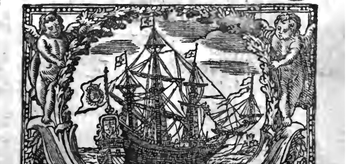
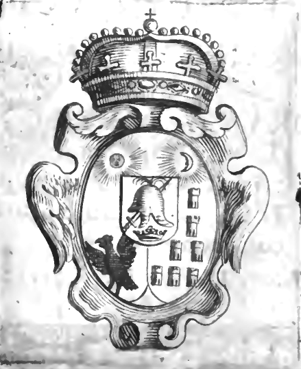
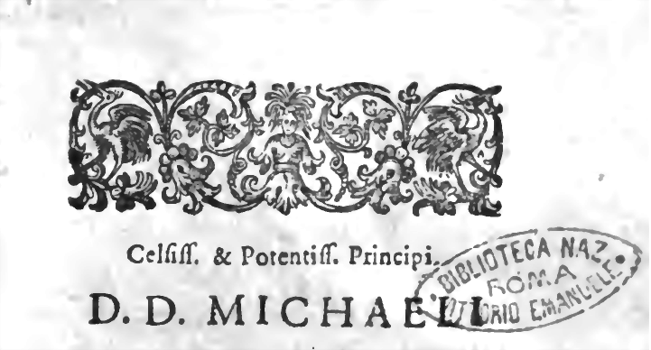
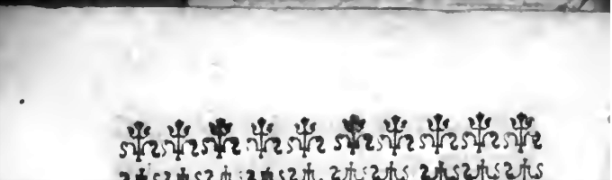
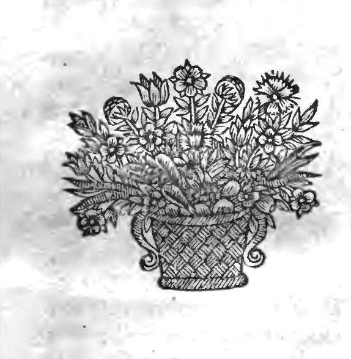
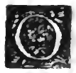
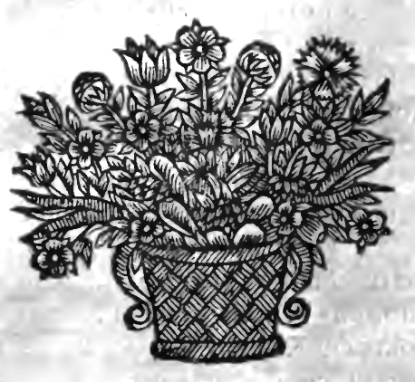
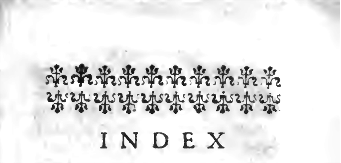

<!-- PAGE 001 -->

---

<!-- PAGE 002 -->
7
9-D
35
6
2 H
51
3570
7.-9.

---

<!-- PAGE 003 -->

---

<!-- PAGE 004 -->
XXI·c·ii

---

<!-- PAGE 005 -->
Fernando Immers Vaz  
ORIGINES,  
ET  
OCCASVS  
TRANSYLVANORVM.

---

<!-- PAGE 006 -->
ORIGINES
ET
OCCASUS
TRANSLATIONEM

---

<!-- PAGE 007 -->
ORIGINES,
ET OCCASVS
TRANSYLVANORVM SEV
ERVTAE NATIONES
Transsylvaniae, earumque ultimi temporis Revolutions,
Historica narratione brevi et comprehensa.
Autore LAURENTIO TOPPELTINO de Medgyes.
LVGDVNI,
Sumpt. HOR. BOISSAT, & GEORG. REMEVS,
Anno M. DC. LXVII.
BISIGNORUM ROMA VITTRICIO EMANUELE
REGIA BIBLIOTHECA

---

<!-- PAGE 008 -->
D. Jando P.-sps - In favor  
Comprada quié - el mero Pa  
San Juan de Prueba  
Aprebó el 6 en el año 1830  
No sé qué se lea

---

<!-- PAGE 009 -->
Celiff. & Potentiff. Principi.
D.D. MICHAELLI
APAFI,
D.G. PRINCIPI
TRANSYLVANIAE
PARTIVM REGNI
Hungariae Domino, Siculo-
rum Comiti, &c. Domino
Dom. meo Clementissimo,
Gloriam aternā & Triumphos!
Voties mecum volvo
proximorum annorum
revolutiones Transsylvaniae,
& horreo,& miror; Recedit
a 3
BIBLIOTECA NAZIONALE ROMA R. EMANUELE

---

<!-- PAGE 010 -->
in feipsam anima mea , fi  
fummm lufstitiam, redeúnt-  
que ijdem spiritus mihi, si  
DEI immenſam misericor-  
diam,contemplor. Postquam  
feilcer vniuerſus peccaffet  
populus, exarfit furor Omni-  
potentis,commouitque Prin-  
cipes numerare fubditos , &  
obluiiſci munerus ac lubrica  
Sedis fuæ ; ( Neque enim in-  
felicem illam terram vt pri-  
uati propugnatis, fed veluti  
vlterioris Christiani Orbis  
conducti Heroës,quibus ma-  
ximâ Dei Providentiâ conti-  
git iſtorum terminûm custo-  
dia. ) Ira Domini temperario  
bello Patriam noſtram viris  
exhaustit ; emaſculatam ciui-  
libus armis confudit ; arma-  
uit Principem contra Princi-  
pemp ;

---

<!-- PAGE 011 -->
pem; Principes aduersis Re-  
gnum concitavit; Regnum  
cum Principe suo commisit;  
Pateres in filios; feruos contra  
Dominos; fratrem in fratres,  
& plerunque familias in vis-  
cera fauire permisit; omnes  
omnium facultates occupan-  
ti dedit; quod à spoliis super-  
fuit,incendo fustulit; è stra-  
ge reduces captivos tradidit;  
fae in hostium castris vendi-  
didit Transsyluanum vinum  
pro fumibulo tabacchi, aut  
pro flagello vno aut scutica  
quâ vrgerentur ceteri; &  
quam cuntta, qua pati pote-  
rant, fe perpellos crederent  
Transsyluani, passi sunt Pe-  
stem, magnum arumnum  
præmium. Postquam autem  
misferus est Dominus super  
ā 4

---

<!-- PAGE 012 -->
afflictione, dixit Angelo percutienti populum : Sufficit ; nunc continue manum tuam. Stantimque Sol divina misericordia dix ortus est, mirabiliter extincti ignes , mitigati crudeles, fractae sunt factiones , reuocata à mortuis diu sepulta PAX. Quando nimirú Deus, providáque & confultissima Statuum Electio , TE , Clementiffime Domine, non modo merentem , fed & necessarium confituerunt Principem : Ferro & flammis permiftam Patria extemplo confolatus es, & pependi in tanta tempestate quietem. Interijlet jam frata Transylvania , nî vigilantis Dei beneficio in illa tempora referuatis , sufflaminatis calamitatum

---

<!-- PAGE 013 -->
tatum curribus, erexisses collapsām, oppressamque & extrema spirante fulsisse. Quibus intentum, Clementissime Domine, lata civium laniena tantum non ipsum te, absorbit. Plusque tunc potuit Constantia & benignitas Tua, quam potentissima hostium arma; Gratia & humanitas Tua plus componit in diffidentium animis, quam ingens antecessorum Principum vis & astutia; Ipse etiam sapiens, idemque potens Turca, dixit, non semper phlebotomia morbos, mortúque civiles sopiri. Pictate, clementiam, lenitatem, gratiam, benignitate, raro exemplo Principatum affero visti. Nì porrò rebus multa despera-

---

<!-- PAGE 014 -->
tione fessis Te auxiliatorem
accommodabis, extremo ge-
mitu ipfas sub onere expira-
turas nullus dubito. Quia
paterno affectu etiamnum
foues & Patriam amas, ama-
ris maximè ; ita vt ex illis
Principibus vnum multi Te
dicant, qui tutò & fine peri-
culo in cuivsvis subditi gre-
mio fomnum capiunt.Vnam
eámque grauem difficulta-
tem, qua restat, vinces ; &
inuenies modú fatiandi auu-
ritiam impiam Portæ femper
aperta , ex Repub. macie at-
tenuatâ ac ad imam inopiam,
per praterita tempora , re-
dacta ; 'Si scilicet illi prohi-
beantur plurimum emere,
qui nihil vendunt ; & ven-
dere edoceantur qui femper
emunt.

---

<!-- PAGE 015 -->
emunt. Sed hac, Sapientissime Princeps, elaboratori perfusionem non indigent,
dum superfunct, Magnifici,
Spectabiles, Fortes, Generofii,
Docti, Bethlenij, Bamfij,
Capij, Beldij, Hallerij &c. quę magna lumina Aulam intimã Clementissimi Principis unanimitate sua nunquam inobfurabunt: quin imò, Viri Maximi, concordes, vt per Dei gratiam sunt, Celsitudinem Tuà inexpugnabili mu- ro cingent, Patriam defendet, erigéntque dignissimum æternae Tuae memoriae obelisicum. Veniam mereri finas hominem liberum & libera- liter educatum, quòd publicâ hac Epistola fassus est, quæ privatim sentit; cuius de Pa-
6

---

<!-- PAGE 016 -->
tria bene merendi studium  
ita ardens fuit, ut maluerit, si alterum eligendum foret,  
temeritatis, quam ingratitudinis, argui; qui, cum Tullio, verissime affirmare potest,  
eos demum fuisse annos vere vivisse & viuere velle, quos in praeciarum aliquod Patriae commodum vel ornamentum consumpsit impendéque.  
Libellum autem istum, qui magis praemittitur illis quae parantur, quam completus editur,  
in finum Celtudinis Tuae deuoluo; supplex & intimè oro, illum clementer amplexare;  
potenter defende, & Author em eius gratiâ non indignum rere.  
Praterquam enim, quod omnium literatorum communes hostes,

---

<!-- PAGE 017 -->
ftes , inuidia , maleuolentia,
& calumniā , bonam men-
tem inuadunt , quidam in
Transfluyuania ( magnorum
ingeniorum fepultura ) libe-
riuscule & licenter extrin-
guunt , quod excitare mul-
tis præmiis alij conantur.
Quia scilicet rudes sunt,
faâ cenfurâ doctos finiles
ipfis futuros inepta perfua-
fione credunt : Et quum
per pudorem eis nocere ali-
ter non pollunt , exules in
Patria finiint ; dum attritis
facultatibus , quas vel do-
mi, : vel longis peregrina-
tionibus , & magnis libro-
rum impendiis affixerant;ip-
fos in contemptum pertra-
hant ,ac , heu ! tolemni per-
fecutione literatos , optimè
bono.

---

<!-- PAGE 018 -->
bono Patria educatos, adigant ejurare studia, pudere & pænitere professionis.  
Verum, num ista gloriosa & è Repub. sint, iudicabitur, quando Deus & Clementissimus Princeps rationem exigit ab istis ingeniorum tortoribus. Qui certè doctissimus ipse, minimè feret libidinem ignaumorum in dedecus & summum opprobrium præstantissimi ordinis; neque obliterari & dehonestari forribus permittet Catalogum, in quem primus nomen dedit: nam earundem rerum fames erit, quarum nos hodie premunt fustidia. DEVS Ter.Opt. Max. qui Regnum periculum lo so loco situm, periculoffis mis

---

<!-- PAGE 019 -->
mis temporibus Celstitudini Vestra credidit, Spiritu suo Constantia, Fortitudinis, & Sapientia Vobis vestrisque successoribus addit ! Dabam Lugduni Gallorum Anno M. DC. LXVII. Id. Maij.

CELSITVDINIS VV.

Humillimus,subditus

L. TOPPELTINVS de Medgyes.

LECTVRIS

---

<!-- PAGE 020 -->
**LECTVRIS S. P. D.**

A N T I Q V I T A S omnis omne antiquum credebat max-  
imum ; Majorum suorum tem-  
pora fingebat aurea , sua secu-  
la arbitrata ferrea : Quia sci-  
licet recentia à Deis , propiùs  
etiam ad ipsos accedebant ;  
vel , quia praesentium censura  
penè naturalis est ; sicuti vete-  
rum defensio habetur religiosa.  
Non tám laudabant antiqui in  
homine virtutem, quam illam  
sum factis antiquorum compa-  
rabant : Que adulatio etiam  
Deos in societates humanas tra-  
xit :

---

<!-- PAGE 021 -->
xit : Vitiorum autem ultima execratio , si fuerant inaudita.
Certe , hodie in multa diuersitate ingeniorum mira confusio est, Esse nihil, quod antiquum non est :
Nam nobis Nobiles ignobilissimi sunt , si suis met virtutibus emergunt ; soli generosi qui è lumbris Nimbroti deducuntur ;
Doctissimi viri rudes audiunt , quia non vixerunt Ciceronis, aut auo Quintiliani; vel si non componunt volumina centum.
Martyres hodie nāli amplius , quia non Tiberius aut Diocletianus, sed alij ipsos angustant occiduntque.
Neque Imperia aut bella sat magna sunt , si non Oriens jungitur Occidenti.
Sed jam neque Nationes honeste sunt, ni constet à Barbaris ipsas oriundas.

---

<!-- PAGE 022 -->
das.Vnde,quemadmodumsum-
mis conatibus veteres annixi
Sunt eremere suos Majores ; Ro-
manos enim non puduit Au-
thores suos à Lupa lactatos
scribere : antequam verò hant
originem ederent , & physicè
& Historicè verissimum erat ,
rapaces admódum & insatia-
biles dictos Romanos fuisse in
Subigendo Orbe, & multùm à
nutrice imbibisse in prauidi-
cium humana natura : Con-
tentio etiam Ægyptiorum cum
Scythis de antiquitate sua,
apud Iustinam,pervotabilisest:
Ita nostra secula non modo gen-
tium Origines & propagines
antiquorum', sed omnes ferè
abortus privataraminsuperfa-
miliarum in lucem traxerunt.
Ego breui libello Clarissimam
Patriam

---

<!-- PAGE 023 -->
Patriam meam, cum suis Originibus & aliquot antiquitatibus, in gratiam Gallorum & vicinorum Hispanorum, cupidis profero. Ea inquam, quae curiosa mea adolescensia collegit rat, non in futurum publicum, sed in ulterioris atatis solamen, quâ sape accersimus per compendia qua in vasto Authorum prato ociosâ lectione paravimus. Adjunxi ad preces Amicorum, sub Titulo Occasuum, Revolutiones Transsyluaniae ultimi temporis, historica narratione conceptas, continuatáisque: illas ipsas quae ante aliquot annos in peregrinationibus meis exciderant. Scripsi tenui & elogio humili: sape verbis Authorum vsus sum, ubi testibus magis quam cerebello opus

---

<!-- PAGE 024 -->
opus erat ; brevitatem sequor,
qualemin similibus optare imp-
se ; naufeamus enim ad codices
in quibus plurimum verborum
est, rerum parum. Vale,& frue-
re istis , benigne Lector , non
carpe.
NOBILI

---

<!-- PAGE 025 -->
## NOBILI AVTHORI.  
### GRATVLATORIVM.  

D Ecebalii truncus, Traja-  
ni æterna columna,  
Pontis & eiusdem vestigia  
cæca sub vndis,  
Hæc tria nos capiunt : capit  
& tua scriprio doctas  
Toppeltine deas : quæ  
fummo è vertice Pindi,  
Danubij ad ripas tibi verè  
patria amanti  
Decernunt statuam, altâ suf-  
fultante columnâ ,  
In qua sculpantur , libro quæ  
promis in isto.  
Quis vero pontem instaura-  
bit ? vt abque perido  
Te demirentur populi, mire-  
tur & ipse

---

<!-- PAGE 026 -->
Turca , nihil solitus mirari.
O, si ille refurgat
Magnanimus vefter Mona-
chus, cui magna patrare
Ludus erat, quid non sperari
poffit ab ipso !
A tous - tant qu'on voit de Grands,
Qui pour gagner leur auoine
Se prezentent sur les rangs,
Il leur donneroit le moine.
I. H.
IN

---

<!-- PAGE 027 -->
IN THE FIRST EDITION OF
AN ALBUM OF
LOVER.
TRIBALLA.
TROMBONIA.
MADRIGAL

---

<!-- PAGE 028 -->
MADRIGAL,

Sur le même sujet.

CE que la docte Antiquité  
Nous a laissé de remarquable;  
Ce que l'Histoire a raconté  
De solide & de veritable:  
Ce qu'en tant de differens lieux,  
Vn long & penible voyage  
A remarqué de curieux,  
Se trouve dans ce rare Ouvrage,  
Encor, Le&teur judicieux,  
Si tu veux y jetter les yeux,  
En trouveras-tu davanitage.  

Par le meme.

I . . I . . H ORIGINVM

---

<!-- PAGE 029 -->
ORIGINVM  
TRANSYLVANORVM  
CAPVT PRIMVM.  

De varia & multiplici Transsylvanorum, apud Historicos, commemoratione.  

NCONSTANTIAE omnia subfunt : Aetiones etiam humanae, (quibus nil incertius ) tot mundi temporibus inuolutae , vicissitudini subfint neesse est. Huius faculi qua facies ? Certè incognita praecedenti ; Hoc iterum antelapsis minimè quadrat ; Neque futurum istis respondet. Vt res variant A

---

<!-- PAGE 030 -->
2 Originum Transsylvanor.
subinde, ac cum ipsis sua nomina :
sic Gentium & Regnum appellatio-
niones, vel ipsa corrunt antiqui-
rate. TRANSYLVANIA, & ve-
teres eius indigenae , tot ferè nomi-
na habent, quot Scriptoris: Sin-
guli, parum abest, de illis prodi-
dêre diuersâ ; incertum ignorantia
vel æmulatione : Enimverò veteres
plerique ignorantiâ magis quam
ingenij malignitate de induetria,
falli sunt,& fecellerunt.Vnde etiam
Flau. Iosephus contra Appionem,
Iudeæ gentis antiquitatem proba-
tur,non esse mirum, ait, si Gra-
corum prifci nullam Iudaeorum
mentionem fecerint,cum vel vici-
nia illis ignota fuerit. Nam Gallos
& Hispanos, adeo Graci ignorarunt , vt Ephorus, accuratissimus
alioqui Scriptor, Hispaniam, vr-
bem vnam esse putauerit. Antiqui
Historici, in mutandis.confunden-'
dive nominibus, præcipites,fæpe
Lectorem suspendant. Igitur (cum
Amm. Marcell. l.27. c.3. loquor)
Parcimus

---

<!-- PAGE 031 -->
Caput I.  
3  
Parcimus opinioni magnorum Auctorum , quos toties in contradictionibus deprehendimus , de ijs tantum , quae veritati magis consentanea videntur, in praesentiarum dicturi.  
Transfluyani olim veniebant generali nomine Scytharum. Trebell: Poll. in Gall. Vocabantur Gothi , ibid. Getæ , Dion in Domit. Daci; idem in Trajan. Dacia mediterranea, Amm. Marcell. l.16.c.6.& 9. Dacia Ripensis, Iustinian.in Novell. 11. & 131.cap.3. Victophali , & Theruingi, Eutrop. lib.8. Illyricum, Močha, Aurel. Vopisc. in Aur. cap.11. Pannones, Bosphori accola, Thracia vicini, Barbari, Borani, Carpi, Zos. in Valer. & Gal. Peucini, Trutungi, Austreg-ethi, Sigipesdes, Heruli.Trebell.l ol. in Claud. Iaziges,Matanafstx, Cariot lib.4.& 5. Chron. Thauro Scythx, Zon. in Iohann. Zim. Marcomanni Quadi.Iul. Capir. in Maxim. Pan-nodaci, Laonic.Chalcocond.de reb.  
A 2

---

<!-- PAGE 032 -->
4 Originum Transsyluan.
Turc. lib. 5. Thaifali, Paul. Diac. in  
Grat. Valent. 11. & Theod. VII. Aur.  
Vid. in Grat. & Theod. Ró. in Const.  
Gothi, Hypogothi, Gepidi & Vandi,  
P. Diac. in Theod. II. Gantunni  
Flau. Vopisc. in Probo. Amm. lib. 3 I.  
Septemcastranres. Phillip. Melanchton.  
Frid. Taub. ad 2. Georg. Virg.  
Comani, Nic. Chon. de Imper. Manuel.  
Comn. lib. 5. Ardeli, Laon.  
Chalcocond. lib. 7 de reb. Turc.  

Ad postremum haud dubiè referri debet  
deriuatio vocis Hungaricæ Erdely,  
quo nomine Transsyluania venit.  
Patria, inquit Chalcocond. Iohannis fuit  
Choniata (hodie Hunnyad) Ardeli, id est,  
Transsyluaniae, oppidum; Cum autem bellum arderet inter Pannones &  
Germanos, magna militaria edebat opera.  
Vbi præfentia sua defiderabatur statim approperans fortissimè præliabatur.  
Postea congregatis ad cum aliis plurimis,vbi-que Illustres apparebat. Eapropter  
Ardeli Regionis Princeps, Pannonum

---

<!-- PAGE 033 -->
# Caput I. §

num concilio decretus est; Cui regionis cum imperaret, Sabatinum interfecit, eiusque exercitum in fugam vertit. Hinc etiam vocabulum Transfluvania enatum conjecto. Hungaris namque Provincia ista idiomate suo vocabatur Erdely, Scriptoribus paulò alter, Ardeli. Quum autem regionem istam Sylua & Alpes ab Hungaria distinguunt, & in Hungarica lingua, Erdô, syluam significat, Provinciae ista Hungari rectè nominant Transfluvianam; eò quod ibi degentibus omnino transfluviana erat. Similis appellatio orta est in Belgio, vbi Transifulana Provincia dicitur, quaæ trans-Ifalam sita terminos notiores demonstrat. Sic Transfalpinam Valachiam vocamus, quia nobis ea trans alpes adeunda. Ant. Bonfinius,primus vt ego noui , Transfluvaniae vocabulum vfrurpauit , quem veluti Principem Historiarum Hungaricaliu,

A 3

---

<!-- PAGE 034 -->
6 Originum Transsylvan.  
plerique sequuntur scriptores, cò-  
que jam liberè vitimur.  

CAPVT II.  
Antiqui termini Transsylvaniae.  

A Mbitio degeneris humani ge-  
nersis infinita , defin tos Reg-  
norum regionúmque terminos nef-  
cit. Nil tutum à potente vicino.  
Omni jurium vis est origo ; Vi  
transferuntur, vi cessant imperla.  
Præscriptione nostra fint oporter;  
heus malæ fidei possefor ! speciola  
jura habes. Injurias occupare do-  
mus & crepta libertatis, quot ge-  
mitibus ccolo mittis ? Mitre , qua-  
fo , vnà memoriam parentum, qui-  
bus primò hæc præda tua ceffet.  
Me puder hæreditatis. Quia igitur  
terrariu termini illi sunt duntaxar,  
quos victoris & potentis industrius,  
aut victi & oppreffi , figit ignavia,  
nostræ Transsyluaniae fines nullos  
pono

---

<!-- PAGE 035 -->
# Caput II.
7

pono expositorus falem, quid de  
illis Antiquitas.  

Eutropius lib.8. Nerva, ait, successit Vlpius Trajanus uatus in Hispania ; Is Daciam Decebalo vi&to subegit , Provincia trans Danubium facta,in his agris quos nunc Thaifali tenent, & Vi&tophali , & Therningi habent. Ea provincia decies centena millia passuum in circuitu tenet.Sext. Ruff. breviar. Trajanus Dacos sub Rege Decebalo vicit, & Daciam trans Danubium in solo Barbarico Provinciaem fecit , qua in circuitu decies centena millia passuum habit.Iornandes lib.1.de Reg. & temp. success. eadem confirmat. Procul dubio felici ano Dacia adhafurent Mo&sa ,Pamonia superior ,Sarmatia pars, Moldavia, Malachia & Twacie fines. Hodie miselli tantum non in unicu cogimur oppidulum.

A 4

---

<!-- PAGE 036 -->
8 Originum Transsylvan.  
---  
## CAPVT III.  
De reliquiis Gothorum, seu Dacis, quos hodie Saxones vocamus.  

A Thanasius Kircherus, post ipsum Erichius & alij multi sunt opinati, Saxones in Transylvania Historia (insigni fabula.) Hamlenfi ortum fui debere. Fabula ferè est talis: Quum anno octogesimo quarto supra millesimum & ducentefimum in oppido Germaniae Hamlenfi murum ingens copia prodirer, effeque ab ipris tutum nihil & haud leue ciujus immineret periculum; Tubicen, (Sathanam fuisse ferunt) qui miris modulationibus sciiebar mira, operam suam locandam oppidantis promittit, mox urbe mures fidibus suis & canru educit, & in proximo illos amne

---

<!-- PAGE 037 -->
# Caput III. 9

anne suffocat. Quo perfecto mer-cedem stipulatam postulanti Ham-lenfes negabant;Eapropter injurias vlturus , dum ifti facris operantur , tibicinio fua non exiguum puerorum numerum colligit, ac moderato recedfu in propinquum montem Kopp en ipfos deducit. At-que exinde pueri Hamlenfium non apparueré amplius.Hos iam fupter terram in Transfflyuaniam dedu-cros dedifle , ajunt, originem no-ft ris Saxonibus. Probar e conatur hanc fuaam originem Kircherus; Chronica,inquens,Transflyuaniae testantur,circa annum 1284. diem Ioannis & Pauli ,in Transfflyuania ignorae linguae pueros decrepente vifos, qui & ibi fede m figentes lin-guam fuam ita promouerint , vt in hunc diem Transfflyuani non alia quam Germanico Saxonica loquá-tur. Addunt, veteres Hamlenfes in rei memoriam emendauiiffe sua té-pora, fcriphifleque. Anno post exi-tum puerúm noftro rum. His nugis A 9

---

<!-- PAGE 038 -->
## 10. Originum Transsylvan.
omnem penè Europam induxerant ad figmenta ista credenda, antequá Martinus Schookius & fabulam Hamlenfem , & iktorum circa Transsylvanorum originé orta deliria , publico scripso confutasset. Schookius, inter alia contra Eri-chium : Ne vero, inffice, cenfeatur hostis generis humani, bofco pueros secum abripuffe ad sedes infernales, nova fabula pro statuiminanda principali fabula est excogitata,quasi scilicet fidem facientibus annalibus Transsylvanicos, pueri hi in extremum Europa angustum , sint abducti , quod ibidem circa hoc tempus derepente ignota lingua pueri apparuerint. Ita cenfet cum pluribus Kircherus: in medio autem rem relinquuit Erichius. At , cedo illi Annales, qui hoc referant. Certam eft in media Transsilvania recepta at huc hodie effe vsum linguæ Saxonicæ, ac-multos ibi inueniri, qui originem fuam referant ad Saxones fue Germanos. Quis verò dixerit,eos oriundos eiffe hisce pueris.

---

<!-- PAGE 039 -->
# Caput III

pueris, à Diabolo per tam longum
spatium tranfuectis ? Patauij ad S.
Laurentium sequens inscriptio le-
gitur , quam ferè extinétam ego
lcgere non potui. Valentino Granio,
alias Bacfort , è Transsylvania Saxo-
num Germania coloma oriundo , quem
fidibus nolo plane & infusato artifi-
cio canentem audiens atas nostra , vt
alterum Orpheum admirata obstupuit.
Objyt Anno M. D. LXXVI. Idib.
Aug.vixit annos LXIX. Natio Ger-
manica vanimis, & test.exec. P.
Quis credat integrum nationem
fruistra fuiffe , cum hoc populari
fuio Epitaphium statueret, eique
non venifle in mentem,hunc Saxo-
nem origine Hamlenfem fuiffe ? Vt
coloniarum subfidio regiones re-
motiffmæ jam olim côjuncta fue-
runt, & idiomata per quam diftin-
da, transplantata, imo ultra maria
quoque promotâ, omnino è Saxo-
nia non procul admidum distante,
quidam, incertum r amen quo tem-
pore in Transsylvaniâm proximám-
A 6

---

<!-- PAGE 040 -->
# 12 Originum Transsylvan.

que Hungariam demigrare potuerunt. Equidem miror Athan. Kircherum, magnum alioquin in litteris virum, tanti erroris authorem perhiberi: Dum Chronicon illius axii de Transsyluania nullum reperitur; quin imo in secretori Regni nostri scrinio (id Captalan vocamus) summo nostro dolore defideratur. Quid igitur vetat etiam Hierofolymis dari mendaces. Ipsam praterca fabulam Hamlenfem nemo fanus credit, quam eam boni Historici omiserint. Vide, infra, copiam Diplomatis Andreae Regis Hungariae Saxonibus ipsis in Transsyluania datum. Vbi animaduertes id actum esse anno Christiano 1224. Fabulam autem hanc anno 1282 demum natam, vt referrt Kirchcrus. Atque sic deprehendes, fecundum Erichium, pueros iftos Hamlenfes, in Transsyluania veniffe (ego credo, apud inferos detenti sunt, quia non licet per centrum terrae spatium ire) sexaginta annis post primigelia

---

<!-- PAGE 041 -->
**Caput III**
13

uilegia Andreæ Regis Saxonibus collata; atque adeo dediisse originem illis qui dudum ibi fuerant. Iter hoc ipse nouerit Erichius, facem praeferente Kirchero. Ego interim miror quod nusquam nisi istis duobus apparuerint hi pueri, & pueriles fabula refutatione digna fuerint.

Antonius Bonfinius Rer. Hungar. Dec.1. lib.9. Saxones istos arbitratur à Carolo Magno in Transsylvaniam transplantatos. Verba eius sunt: Sed ut Saxorum vires honestiis extenuarentur, multa quoque ex his in Daciam, Pannoniam, diversáque regiones deducta à Carolo Magno colonia, quarum adducta innumerant Sarmatiam, ulteriorémque Daciam incolunt. Suffragatur huic Gisfel. Busbequ. Epist.4. leg.Turc. Cis & Transalpianas scilicet Saxones, à Carolo Magno in Transsylvaniã, vfque ad Tauricam Cherfoneum traductos fuiffe. Arider P.Manutius in deser.Transf. Carolus Magnus, ait,

---

<!-- PAGE 042 -->
14 Originum Transylvania.  
ait Saxones toties rebellantes partem in Daciam traduxit, unde origo  
civitatibus Saxonum in Transylvania.  
Vid. etiam Christoph. Forstn. not. lib.4. Ann. Corn.Tac.f.3 06. Milli alii Bonfinium affertionis antelig-  
nanum fecuti sunt parum de anti-  
quioribus monumentis folliciti.  

Est autem altum huic rei filétium apud Historicos, adeóque facilè  
istae authoritates grauioribus au-  
thoritatibus refellit possunt. Magi-  
nus in Geograph. sub Transylvania,  
probát, ante Carolum Magnum in  
hac Provincia Saxones fuisse. Idem  
fensit Blondno Historicus. I. Liphus  
qui omném degustauerat antiqui-  
tatem lib.1. Magn.Rom.c.vlt. Caro-  
lus Magnus ait, Saxones sapè rebel-  
lantes , translatione in Belgicas Pro-  
vincias domuit. Idem confirmát A-  
mil. de reb. gest. Franc. Si igitur in  
Belgium abacti Saxones , quis af-  
firmare aufit in Transylvania  
cofdom deductos. Cario Chron.1.4.  
Qua verà, ait, deductis ex Saxonia  
colonys

---

<!-- PAGE 043 -->
## Caput III. 15  

colonijs à Carolo in Daciam, feruntur,  
fabulosa sunt.  

Tertia & speciosior opinio earum est, qui vel Saxones fuisse egressi in Daciam, & Pannoniam superiorem deuenisse, vel Germanos, devictis & expulsis Hunnis, regionis fertilitate retentos esse, atque hinc, eadem ferè linguâ ipfos vti. Iterum commenti primas est Bonfinius toties sibi contrarius; Eius afecla Thuanus l.2. Hist. Idem, infit ifte, Saxones Orientem versus veteres fines egreffi, Borussos & Transsylvanos, qui hodie appellantur, Germanicè loqui docerunt. Sed fides toties deprehensi Bonfinij & clamatis Thuani conjectura parum in hoc proposito est attendenda.  

Conjiciunt alii cum Alberto Huttero, ( Is erat vir generosissimus simul & doctissimus; Doçtos enim Regios Iudices, Repub. Cibinienfis quondam fibi præferri studuit, ) in Oratione coram Sigifmundo.

---

<!-- PAGE 044 -->
16 Originum Transffyluan.
mundi Battorio de Somlio-Alba Juliae ann. 1591 mens. Jun.habitâ, Saxones, regnante Geyfa in Trans- fyluaniam deductos;quia videlicet dictum Regem strenue auxiliari- bus copis iuviisent, Tartaróque, qui & Transsylvaniam occupaua- rant omnem, & grauiissime jam infultarent Hungaris , ex ipsis partibus abegissent ; demum pro gratitudine Geyfam Saxonibus Daciam contuliisse ferunt. Quia prima Priuilegia & antiquiora Rex iste, Saxonibus dedidit.Verùm induci non possum vt credam probabiliori etiam conjecturæ , si eam fugiunt Historiae.

Ex priuilegiis claudicanter ad- modum gentium originem colli- gas. Sequitur exemplar Immuni- tatum Andreae Regis , Saxonica Nationi; per Transsylvaniam col- latorum : [ In nomine S.Trinitatis & indiuiduæ vnitatis, Andreas, Dei gratiâ Hungariae , Dalmaciae , Croatiae, Ramae, Seruiæ , Galiciae,
Ludo

---

<!-- PAGE 045 -->
**Caput III.**
17

Ludomiriæque Rex in perpetuum.
Sicut ad Regalem pertineret dignitatem, superorum contumaciam potenter opprimere; Sic etiam Regiam decer benignitatem oppressiones humilium misericorditer subleuare, & fidelium metiri familiarum, & unicuique fecundum sua propria merita, retributionis gratiam impertiri. Accedentes itaqe fideles nostri Teuronicī, ultra Tráfyluanī vinuerunt ad pedes nostræ Majestatis, humiliter nobis con- querentes, sua quaestionem suppli citer nobis monstraerunt, quòd penitus à sua libertate, quà donati fuertant à pijlīmo Rege Geyſa,ano nostro, excidissent, nisi super eos Majestas Regia oculos solitæ pietatis nostræ aperiret, vnde prx nimia paupertate nullum Majestati Regiæ feruitium poterat impertiri. Nos igitur justis eorum querimoniis aure solitæ pietatis inclinantes, ad praesentiam posterúmque noticiam volumus deucire, quòd nos

---

<!-- PAGE 046 -->
# 18 Originum Transsylvan.
nes Antecedentum nostrorum piis veligis inhrentes , pictatis moti vificibus , pristinam eis reddimus hberatem . Ita tamen quod vni- verfus populus incipiens à Varofs visque ad Bura't cum terra Siculo- rum, terra Sebus, & tetra Daraus, vas et populus , & sub vno Indi- ce ceafcatut , omnibus Comitati- bus, præter Cibinienfum, cessan- tubus radicitis . Comes verò qui- cenque fuit Cibiniensis nullum præfumat statuere in prædictis Co- mitatibus, nisi sit infra eos residens, & ipsum Populi eligant , qui me- lius videtur expedire. Nec etiam in Comitatu Cibinienfi aliquis audeat comparare pecunia ; Ad lucrum vero nostrae Cameræ quing— marcas argenti darr nutim : null quemliber minos excl' h

---

<!-- PAGE 047 -->
# Caput III.  
19  

quod pecuniam, quam nobis soluerentur, seu dignoscantur, cum nulllo alio pondere, nisi cum marca argentea, quam piissima recordationis Pater noster Bela eisdem constituit, scilicet quintum dimidium fertorum Cibinicens ponderi, cum Colonienli denario, hi difcrepent in statra, soluerentur. Nuncii vero quos Regia Majestas ad Dicam colligendam statuerit, singulis diebus, quibus ibi moram fecerint, tres lotrones pro eorum expensis soluerent nō recusent. Milites verò quingenti intra Regnum & regni expeditionem deputentur ; extra vero Regnum cer- - Rex in propria persona

---

<!-- PAGE 048 -->
20 Originum Transsylvan.
eligant, & electos repraesentent, & de omni jure Ecclesiastico, secundum antiquam consuetudinem, eis respondeant. Volumus etiam firmiter præcipimus, quatenus illos nullus iudicet, nisi nos, vel Comes Cibinienis, quem nos eis loco & tempore constituemus. Si vero coram quoquunque Iudice remanerint, tantummodo iudicium ordinarium reddere teneantur. Nec eos etiam aliquis ad præsentiam nostram citare præsumet, nisi causa coram suo Iudice non possit terminari.
Prater supra dicta, sylvam Blacorum & Biffenorum cum aquis vns communes exercendo, cum prædictis scilicet Blacis & Billenis eisdem contulimus, vt præfatâ gaudentes libertate, nulli inde feruire teneantur. Infuper eidem conceffimus, quod vinicum figillum habeant, quod apud nos & Magnates nostrs evidenter cognoscatur. Si vero aliquis eorum aliquem conuenire

---

<!-- PAGE 049 -->
Caput. III. 21

uenire in causa pecuniali, coram
Iudice non possit vii testibus, nisi
personis infra terminos curum cō-
stitutis, ipsos ab omni iurisdicio- ne penitus eximentes, falésque mi-
nutos; secundum antiquam liber-
tatem, circa festum Georgij octo
diebus circa festum D.Regis Ste-
phani, & circa festum B.Martini
similiter octo diebus, omnibus li-
berè recipiendos concedimus,quod
nullus Tributariorum nec ascen-
dendo nec descendendo præsumat
impedire eos; Syluam verò, cum
omnibus appēdicibus suis & aqua- rum vfas,cum suis meatibus, quæ
ad folium Regis spectant donatio-
nem, omnibus tam pauperibus quā
diuitibus liberè concedimus exer-
cendos. Volumus criam, & Regia
authoritate præcipimus, vt, nullus
de Iubbagionibus nostris Villam,
vel prædium aliquod à Regia Ma- jestate audefat postulare: si verò ali-
quis postulauerit, indulta eis pore-
state à nobis,contradicant. Statui- mus

---

<!-- PAGE 050 -->
22 Originum Transsylvan.
mus insuper dictis fidelibus, cum
cum ad expeditionem ad ipsos nos
venire contigerit, tres decensibus
tantum solvere ad nostros vos tenentur. Si vero Vayuoda ad Regalem verilitatem ad ipfos vel per-
terram ipsorum transmittetur, duos decensibus, unum in introitu, et alterum in exitu, solvere non recedant. Adiicimus etiam supradictis liberatibus, quod mercatores eorum, ubique voluerint, in regno nostro, libere & sine tributo vadant & revirtantur, efficaciter jus suum, Regiae Maiestatis intuitu, probantes. Omnia etiam forma ipsorum, sine tributis, praecipimus observari. Ut autem haec, quae antea dicta sunt, firmiter & incondus permaneant in posterum, presentem paginam duplicis fili nostri munimine fecimus roborari.
Dato anno ab incarnatione Domini, Millesimo Ducentesimo Vigesimo-Quarto, Regni autem nostri, vigesimo primo.]
Quam

---

<!-- PAGE 051 -->
# Caput III. 23

Quam nihil hæc omnia ad originem Saxonum faciant vel me tacentes poterit animaduerti ; Et forum ista Privilegia nondum vide- rant, qui nobis ea opponereant.

Idem Albertus Huterus, in eadem Oratione , hanc Nationem à Sacis deriuare videtur , certâ gente vetustissima , Herodoti, Strabonis, & Ptolemaei autoritate subnixum ; Hanc suam opinionem docetam fuisse arguit Oratio Alexandri Magni apud Curtium lib.6. c.3. Is, Sogdiani, inquit, Daha, Massagetae, Saçe, eiusdem Nationis sunt. Sed quid vetat , si Saci cognominati sunt aliquot Dacorum populi,modo , vt Curtius innuit , ipsos eiusdem Nationis fuisse confert. Etiam Vincentius Beluacensis , Spec.Hist. l. 30. cap.87. Saxorum gentem stringit , quæ à Tartaris fuerunt angustata. Verba eius sunt : Plurimis itaque terris in servitutem eorum redactis , quadam viriliter restiterunt eos , India nimis magna & pars Alanorum,

---

<!-- PAGE 052 -->
24 Originum Transsylvani.
Alanorum, & quaedam magna pars
Kittorum et gentes Saxorum: Sed quū
duodecimo denum feculo Chri-
stiano hāc acta fuerint , & propo-
litum nostrum remotorioris fit inda-
ginis, Originem almæ huius Na-
tionalis, altiūs paulō accerferemus.
Sunt autem , vt mea fert opinio,
Gens ista , veteres Daci , seu reli-
quiāx Gothorum. Semel noto, Da-
cos Getas , & Gothos , pro iisdem
haberi. Dion in Dom. & Trajan.
Iul.Capitol.in Maximin. El.Spart.
in Anton.Carac.Iordanes , OlauS,
& Ioan. Magn. D. Girolam. Can.
nell.tau.de nom.e luog. antiq. piu
ofc. di C.Tac. Quią
I. A vocabulo Daci fue Deci
ad Detzen, Decen,fue Detsehen fa-
cilis lapfus : Ita enim Saxones
Transsylvani fe vocant. Germanos
autem appellant Mueser, (quam di-
ctionem à Gallico Monsieur , deri-
uamus ) quod nunquam fecillent
in contemptum fuorum Majorum.
II. Quią à prima Germanorum
inno

---

<!-- PAGE 053 -->
Caput III. 25

innote scentia ab inuicem populi fuère distincti. Corn. Tacitus primum de Germanis Historicus de sit.
mor.& pop. Ger. Germanos, ait, à Dacis mutuo metu & montibus separari.

III. Quia secundum aliquos Germani omnes, adeóque ipsi Saxones, à Dacis seu Transsyluanis descendunt : Germanicus scriptor Petrus Bertzius Comm. ver. Germ.
lib.1.c.2. Germani, inquit,nobilissimi Europa Populi à Dacis originem habent,Hispnia quoque praecipua nobilitas Gothici sanguinis ortum iactat.

Iam vero nec Hispanos Proceres pudet fe ad Gothos Majores referre ( vt Iacobus Zieglerus contra Stunica refert,generisque claritudinem inde reperere. Ideóque in Concil. Toletano 5.art.3. statuitur,neminem in Regia dignitatis factigium eligendum esse , quem Gothicae gentis nobilitas ad hunc honorem non traxerit. Sed ad rem : Samofcius in MSS.Orig.Hung.Ger- B

---

<!-- PAGE 054 -->
26 Originum Transsylvan.
manos ait, Gothorum fuisse stirpem , & Gothos Germanicè locutos fuisse certius est quàm vt osten- di debeat , id quod ne ipsi quidem Germanorum docti inficias eunt. Iustus Lipsius probat l. 2.cap.6.lec.t. antiq. Germanos antea Barbaros , demum ab Augusto per urbes primum distributos,opera potissimum Tiberij. At Daci nostri quantò innote scientia sua iis antiqiores ? Tantum igitur abest , ut Transsylvani filii Gothi, à Germanis Saxonibus deriventur , quin contrarium , uti ostenfum est , vero fit familiae. Quia

IV. Corruptela linguae Italicae
à Gothis & Longobardis ineecta,
nostrum Dacorum est idioma.

V. Quia in Transsylvania principua veterum Dacorum fede , aut.
Hungari, aut Valachi, aut Szekhe- lyj , aut Saxones sunt Gothorum
reliquiae; non autem tres illae nationes aduenae antiqui Daci esse pof- funt ; vnde ultima eius sit originis neceße

---

<!-- PAGE 055 -->
# Caput III. 27

necesse est. Si colonia Romana ad nostra vſque tempora durat , pro-babilius , labente illorum imperio, reliquias Gothorum superessē ho-die in Transsylvania ; qui omnium primi, si Historicis credendum est, hanc mundi plagam tenuère. Illi verò Scythia oriundi aut Trajani arbitrio huc deducti , & mōx Adriani volūntate, destructo mira-bili pōte Danubij, reuocati fuerint. His nostris argumentis prae cursat Chron.Carion.lib.4.de reb.gest.Car. M. verba sunt : Quæ vero deductis ex Saxonia colonis à Carolo M. in Daciam , quæ nunc Transsylvania est feruntur, fabulosa sunt ; Transsylva-nos enim Dacorum & veterum Gotho-rum reliquias esse non dubito : quibus accessiffe concio Pannonia superioris colonos Germanos, quando pulsi ab Hunnis & Auaris nouas sedes quasi- uerunt. Magin. in Geogr. sub Trans. Aduerte , extra Transsylvaniam Pan-noniam accolas Germanos, & diuersum à Saxonibus dicta Transsyluania lin- B 2

---

<!-- PAGE 056 -->
28 Originum Transylvaniae.  
qua Germaniae idioma loqui, & sine incertum vix intelligibile. Philip. Melanchthon. Dacos fuisse censit quos  
nunc Septemcastrae appellamus,  
cui respondet Germanicum Siebenburgen. Martinus Zeillerus relatus.  
var.epist. appositè : Ichinolt Schier glauben das die Gothones nicht weit-von  
Siebenburgen gewohnet haben, da noch betten Gotben; das ist, Deutschen Sivd.  
Nostræ opinionis fuit etiam Lazarus Soranza in Ottom. part. 3. c.86.  
p.147. Verba eius sunt : Sono senza  
dubio i Tràsfilutani stimati de più bellicosì popoli de gli antichi Daci , tanto  
temuti da Romani, ch' havendo vinto  
gli eserciti di Domitiano furono Sfor-  
zati effi Romani di pagar loro Tributo  
sotto lo Stesso' Domitia, sotto Nerona,  
è nell' principio dell' imperio di Trajano, acciocche a lor danni non passaro il Dambo; lo sanno molto ben  
i Turchi per le rotte, c'hanno più volte bamute dal Coruine, da due Battori, e  
finalmente da questo terzo, c'oggidi guerreggia con essi; Id est: Habentur procul

---

<!-- PAGE 057 -->
# Caput III. 29

procul dubio Transyluani pro bel- licosissimiis Europea populis : iisti cum Moldauis & Valachis sunt antiqui Daci , tantopere à Roma- nis formidati , & qui profigato Domitianian.Exercitu coege're diCtos Romanos , vt tempore Domitianian, Nervia,& principio Trajani,tributa fubi perfoluerent : ne trajecto Danubio damna illis inferrent; Probè norunt Turci quantaes cla- des accepterint à Coruino , à duc- bus Bathoriis , & demum à terrio, qui hodie cum ipsis bella gerit. Non diffensi etiam D. Girolam Canin. nell. Tau. de nom. & lugu. antich. pin oscur. di Tac. Daci , i me- defini che i Geti, tennero per loro abi- tazione tutto quel paese, che b oggi racchiude tutta la Transyluania , la Valachia e la Moldauia . Hoc est. Daci, feu , Gethae regionem incos- luerunt omnem , quam hodie com- pletuntur Transflyuania Valachia & Moldauia.

Gothorú autem originem Ioa-

B 3

---

<!-- PAGE 058 -->
# 30 Originum Transsyluan.

ne Magnus trahit à Magogo Noachi nepote, & magnam Gothorum Regum profapiam contextit, qui omnem Euxini maris plagam,Pannonias, Daciam universam & circumjacentes regiones occupaverunt, inhabitauerintque. Sozomenus Gothoru patriam, trans Istrum ponit lib.4.cap.37. Iam etiam his antiquiores Plinius , Strabo , Dionythus, Ptolomaeus, aliique qui de Getis & Dacis multa, nobiscum fentient. Sub Valente tandem Imperatore Gothi ab Hunnis vieti fugatique mari Baltlici partes petierunt.Reliquiae autem ipforum Gothorum , ad hunc v fque diem in Dacia pristina nobilitate orbati vivimus obscuri. Non igitur Gothi adeo obscena derivationis sunt,ac Samofcius in Orig.Hung. nobis affinxit :Gothi , inquiens, nominis etymon ex Albico Sigismundi Cafaris, & Regis Hungar. Medico ac postea Archiepiscopo Prageni designato,cuius & Bonfinius & Pius Pontifex

---

<!-- PAGE 059 -->
# Caput III. 31

Pontifex in Chronico Polonorum meminerant. Is in libello quem inscriptit de complcxionibus gentiùs, scribit,Gothos ob aduentum Hun- norum , panico quasi terrore per- cullos , derepente Pannonia pos- fessione cessisse, ac Illyrium versus iter intendiffse : móxque eos per vestigia Hunni infecuti , ad Danu- bij trajectum sœda strage afficisse; & quia nulllo virium periculo fa- cto, holti aduentanti turpi ignauia terga vertisfent, quoſcunque viuos prælio coeperant , hac infamia no- tasse, vt fæmoralia feu campestria quae Hunnis Gothia ( gadgya) vo- cantur , natibus detracta , ac cras- fore excremento oblita,qua quan- doque pauore percitis laxata aluo vel inuitis effluunt , capicibus cap- tiuis involuerent, vt, qua antea narium erant,oris effent postea ve- lanina. Ita tum bello,tum ignomi- nia , belli clade grauiore attriti ex Patrio Hunnorum verbo,Gothi sint postea militari irrisione appellari.

R 4

---

<!-- PAGE 060 -->
32 Originum Transsylvan.  
Et hoc est, pergit ille, quod Dominicus Niger, Scythiam Asiaticam  
veterem Gothorum Patriam, etiam  
nunc ab incolis patria lingua Sargatia, dici testatur, à stercore & fœmoralī compōsitā dictiōne. Sed  
hanc calumniantium cateruam cōtemnimus.  

---  

CAPVT IV.  
De Hungaris & Hunnis:  

H Vngari, Scythæ,Vnni,Hunni, Leuci, Albani, Auarī, Vṅgti, Turci, Pacinaces, Pannones, pro- miscuē apud Historicos reperien- tur. Proc.de bell.Goth.Amm.l.31. P.Diac.in Grat.Zon.in Const.Leon. f.Idem in Neceph. Phoc.Laonic. Calc.l.2.Blond.Dec.2l.2.  

Originis Hungarorum receptior opinio eorūm est, qui ab Hunnis Scythica gente, ipsos deducunt, (Bonf.Dec.l.ll.) profectis in Panno

---

<!-- PAGE 061 -->
# Caput IV.
33

Pannoniam ab ea parte Scythiæ,
quae Iuhtra appellatur, quae regio
hodie tributaria est Magno Ruthenorum Ducī; vbi etiam hodie indigenas Hungaricè loqui dicuntur.
Faber primus author huius affirmationis perhibetur. Post istum Michouius Polonus , qui male colligit ipsam ex Turocio; Michouium & Sigismundum Baronem fecutus est Ioannes Aubanus Bohemus in libro de moribus gent. Vnde postmodùm certatim incauti scripores eandem arripuère, ex incerta scilicet aliorum relatione sua narrationi fidem adstruentes ; Ita ab vno in alias atque alias manauit vt follet opinio. Leonclausius quo in his arcana vis videatur acutius cernere, veteres Iuhriæ indigenas , eadem adhuc cum Hungaris lingua vti diuinauit.
Verior autem mihi videtur sententia illorum qui Asii oriundos arbitrantur Vngaros. Id à doctiffimis viris confesfu omnium pene:
B ⁵

---

<!-- PAGE 062 -->
34 Originum Transsyluan.

Historicorum approbatum est. In hanc rem Ioannes Samofscius in
Mss.Orig. Hung.Nec de Hungaro-
rum ,ait, Asiatica Patria litem ante-
bac quisquam, vetuti de re minime con-
trouersa, mouere ausus est , prater
Mathiam Michonium, qui Critici
persona indutus futili temperitate in
Septentrionis nescio quas voragines gē-
tis Vngarica primordia instruit.Hun-
ni,Vnni, fue, Chuni, ab Mageris
diuerfi, vicini tamen, populi fuere,
Plinio testante. Quibus ita consti-
tutis illud potro luculentius confi-
derandum est ;Vngaros fue Maga-
res ex Albania quidem ortos, & in
Europam progreflos,fed ex Orien-
tis penitioribus partibus oriundos
elle , idque confensus antiquorum,
historia, domestica popularifque
fides, adeoque veritas ipsa fuader.
Huc Turocios, huc Bonfnius ( ex
An. Sylu.) & Prior vtrifque Mar-
cus,Vngarorūm Origines referunt:
Vngari è Perfidis Indiaeque finiti-
mis , fcnfim in Euxini littora pro-
cesillle.

---

<!-- PAGE 063 -->
# Caput IV  
35  

cellisle. Ita vt Herodotus lib.4. Cimmerios,Bosphoranos, ubi nuper imis fœdibus Hunnorum fides fuerit , ulteriora Asia aliquando tenuisse scribit; Verùm à Scythis interioribus pullos magis occidua tandem perierunt. Nec Hunni & Vngati, cum adhuc Asia interiores plagae incolabant , Graecis Romanisque noti erant. Ideoque aetate Plinius fama tantum & auditione accipientur. Verùm vbi propius Europam venissent, plus fatis innotuerunt. Diximus paullo ante Magaros populos , qui haud dubie Magares sunt , ad Indiæ citeriora collocari à Plinio lib.6.c.20. Huic Plinianæ descriptioni confentit Sinarum Indiæ populorum topographia,qui ultra Gangem positi, defertas terras Orum versus & Meridiem habent ex Ptolemaei delineatione. Qui dum in extremis Asia finibus ignoti deliterint,hocce seculo & praecedenti, quibus in Orbis terrarum partibus perlustrant- B 6

---

<!-- PAGE 064 -->
36 Originum Transsylwan.
dis, nihil fibi reliqui ad summam
dil gentiam humana industria fecit,
editus de ijs libellus est Chinaram
titulo,vbi mirabilis gentis folertia,
ritúque ab Hungaris diuerfi def-
cribuntur. Narratur istic, Chini
populos esse finitis, qui etiam-
num vocentur Megori ; Ingens in-
quit , & ipsi armorumque gloria in-
clytum regnum possident, quarum Me-
tropolis est Samarcanda : Hi à nullis
nationibus in scrututem redacti dicun-
tur. Hac de China Author. Qua
si vera sunt non est dubium , quin
hi Megori Pliniani sint Megari,ip-
forúmque Hungarorum Majores :
Nam Hungarico vocabulo hodie
fe vocant Magiaros. Porro Samar-
canda Ptolomæo Sarmagana, Ariä
regionis in Asia Vrbis est.Vrbs Sog-
dianae regionis Arriano & Curtio.
Eam Asia partem Tamerlanes &
nunc Tarrarorum multiplex Natio
ocupat.Hic & illud addere libuit,
quòd Samozcius in Mss.Or.Hung..
adfert : Proximis annis ad Amura-
them

---

<!-- PAGE 065 -->
## Caput IV.  
37  

them Turcarum Imperatorem, ex vete illa Magarum Patria Legatum Constantinopolin venisse, à fide dignis, & quorum authoritas in conspicuo est accepti. Is gratiam atque amicitiam publicè privati- que regi ac regno petiturus, tam honorificè à Turcarum Tyranno acceptus fuiffe traditur, ac si perpetua deuinctus confuetudine, non vt ad familiaritatem Imperatoris se applicaturus, fed ab hoc inuitatus Rex illorum esse videretur. Is vbi Europæum Vngarum,ibi effe cog- nouiiffet (aderat autem à Cæsare Rudolpho ad Turcam missus magna quidam vir prudentia & virtutis) ad se inuitatum comiter Patrio fermone, quem vt Orator Cæfa- reus intelligerer allocurus est, ac vltto citroque habitu colloquio, Audio, inquit ille, vos alienigena- rum quorundam contubernio pro- miscuè permisceri. Cum Orator Cæfareus annuntiet, ita quandoque vfut solitum venire. Tum ille,Hæc, inquit,

---

<!-- PAGE 066 -->
38 Originum Transsylvan.  
inquit , est ratio, quod Martia illa  
indoles,qua quondam toti Europae  
& Asiae terrori fustis,fen sim in vo-  
bis exoleuerit, externoque hosti  
pradex facti estis. Nos vero abori-  
gines vestri,vt arbitror,ita generis  
nostri profapiam tuemur,vt exteror-  
rum affinitatem ad nos corriuari,  
ex veteres gentis instituto capitale  
censeamus.Vnde fit vt aperis bar-  
barique septa gentibus, vetus illa  
& intaminata natio , fuitmet ipso-  
rum viribus quantumuis infectos  
hostes sustinere ab omni suo va-  
leat. Dicebat prater ea, fe minime  
Legatum de pace aut foedere con-  
ciliando esse ad Imperatorem Tur-  
carum missun , quippe cujus arma  
neutiqua ad eas oras adhuc pene-  
traffent , omniaque illa essent a pe-  
riculo & difcrimine vacua : Sed vt,  
quae juste causa necessefudinis ef-  
fent,notitia & familiaritate in ean-  
dem amicitiam , ille Magaru Rex,  
se cum hoc Imperatore aggrega-  
turus effet. In gratiam curioforum  
adducam

---

<!-- PAGE 067 -->
# Caput IV.  
39  

adducam locum Amm.l.31.vbi ele- gátiffimè antiquos Hunnos depin- xit. [ Hunnorum autem gens, mo- numentis veteribus leuiter notâ, vltra paludes Môeticas glacialem Oceanum accolens , omnem mod um feritat is excedit,Vbi quoniam ab ip s i nascendi primi tias infan- tum ferro fulcantur altius gena, vt pilorum vigor tempes tiuus emer- gens, corrugatis cicatricibus hebe- tetur ; fene scunt imberbes absque vlla venustate , spadonibus fimiles. Compactis omnes firmisque mem-bris & opimis ceruicibus prodi- giosè deformes & pandi,vt bipedes exiftimes bestias, vel quales in cō- marginandis pontibus effig iati fti- pites dolantur incomptè in homi- num figuras : fic & in sua vita vif f unt aper i , vt neque igni neque fa poratis indige ant cib is, fed radi- cibus herbarum agre stium & femi- cruda cuiu svis pecoris carne vef- cantur , quam inter femora sua & equorum terga subfertam fotu ca- lefaciant

---

<!-- PAGE 068 -->
40 Originum Transsyluan.  
fabricant brevi. Aedificiis nullis unquam testi, sed haec velut ab vul communi discreta sepulchra declinant: nec enim apud eos vel arundine fastigiatum reperire tugurium potest. Sed vagi montes peragrandes et silvas, pruinas, famem, festimque perferre ab incunabulis affuiscunt. Peregrae testa, nisi maxima adigente necessitate non subeunt: Nec enim apud eos fecuros excitimant esse sub textis. Indumentis operiuntur lineis, vel ex pellibus silvefftrium murum confarcinatis. Nec alia illis domestica vestis est, alia forensis; sed femel obsoleti coloris tunicas collo inferta non ante deponitur, aut mutatur, quam diuturna carie in pannulos defluxit defructata. Galeris incuruis capita tegunt, hyrsuta crura coriis munientes hoedinis. Eorumque calcei formulis nullis aptati, vetant incedere greffibus liberis; qua causa ad pedestres parum accommodati sunt pugnas. Verum equis

---

<!-- PAGE 069 -->

---

<!-- PAGE 070 -->
## 42 Originum Transsylvan.
Dixerunt bellatores, quod procul millibus telis, acutis ossibus pro spicula acume arte mira coagmentatis, sed distincti, cominus ferro sine respectu confligunt, hostesque, dum mucronum noxias obsernant, contortis laciniis illigant, vt laqueatis refidentium membris equitant vel gradiendi adiant facultatem. Nemo apud eos arat, nec fugit aliquando continu git. Omnes enim sine pedibus fixi, absque lari vel lege aut ritu stabili dispalantur, femper fugientium filiales, cum carpentis in quibus habitant. Vbi conjuges ex villis vestimenta contexunt, & coeunt cum maritis & pariunt, & ad uique puber tatem nutriunt pueros. Nullif que apud eos interrogatus, responder e, unde oritur, porest, alibi conceptus, natu sque procul & longius educatus. Per inducias infidi, inconstantes, ad omnem auram incendentes, spei noua per quam mobiles, totum furori incitatisimo tribuentes.

---

<!-- PAGE 071 -->
Caput IV. 43  
buentes.Inconfultorum animalium  
ritu, quid honestum inhonestumve  
fit penitus ignorantes. Flexiloqui & obscuri. Nullius religionis vel superstitionis reverentia aliquando difficti. Aurì cupidine immenso flagrantes. Adeo permutabiles & irasci faciles, vt eodem aliquotics die à sociis nullò irritante fâpe defiscant,itidémque propitientur, nemine leniente. Hoc expeditum indomitúmque hominum genus, extrema cupiditate prædandi auidi- tate flagrans immani, per rapinas finitimorum grassatum , & cædes, ad vjque Achajam peruenit.] Vid. etiam Iustin. l. 2. Adeo verum , vt est apud Agell. l. 13. c. 2. itidem effe in hominum ingenii, quod est in pomis,quæ dura & acerba nascun- tur, post fiunt miria & iucunda ; Sed qua gigauntur statim victa & molli a , atque in principi uent vuiida, non matura mox sunt sed patria. Hac atate nostros Hungar ros videmus auita feritatis iam melcios,

---

<!-- PAGE 072 -->
44 Originum Transsylvan.
seficios, multúmque ciules. Laon.
Chal.l. 2. ait , Quanam Vngarorum
origo sit dicere non possuum. Praterea
quum fibi dederint istud nomen,sicque
appellentur ab Italis,non decorum fore
ratus sum,si aliud ijs imposuerò nomen.
De Etymologia vocabuli Húgarici
Magyar,vid. P.Diac. in Anafst. c.5.
Alij Vngaros nomen inde fortitos
ferunt vel quod aduentus fui prin-
cipcic ita dicti, ( Blond. Dec.2.l.2.)
vel quod Angariam nominatà post
Hunnorum internecionem à Ca-
rolo M. & Ludouico eius fratre ip-
sís illatum. Quod autem Zonara
Turcos & Hungaros pro vna na-
tionone in sua Historia vfurpat , non
fatis capio. In Const.L.fil.Turci, ait
( quos Vngros nominamus ) alias Ro-
manas provincias incurfare solisti , ad
tempus quieti fuerunt. Idem in Ni-
ceph.Phoc.Turcis autem , Vngris fci-
licet , Thraciam vastantibus', Nice-
phorus Phoca Bulgaria Principi scrip-
sit , ne illos Istrum transfire pateretur,
& Romanas provincias infestare.Idem
in

---

<!-- PAGE 073 -->
Caput IV. & V. 45  
in Const.Monomach.Sunt autem Tur-  
ci gens Hunnica populoissima & libe-  
ra Caucafarum montium septentrionale  
latus accolens. Tantum de Originibus Hungarorum.  

---  

CAPVT V.  
De Siculis , Scythis Transsylua-  
nis, seu Szek-helyjs.  
SIngularem & ab Hungaris di-  
uerfam Nationem multi autho-  
res finxerunt , quam Hungarice  
vocamus Szekebly,Dacice Zeckeli;  
Eodem errore irrepfit vocabulum  
Siculus ; sed frustra : Sunt enim  
eiufdem Originis cum ceteris Vn-  
garis. Quoties mihi ab Hispanis  
dictum memini ; Quid , malum,  
Transsyluanis cum Sicilia ? Nam  
Siculi apud bonos Author es incolę-  
fust Regni Siciliae, qui hodie His-  
panii subfunt.Quod autem in Da-  
cia

---

<!-- PAGE 074 -->
46 Originum Transsylvan.
cīæ Comitīis Siculi išti Transsylvania à ceteris Hungaris dīscernuntur, ratio talis ferē est:Post primam Hunnorum eruptionem, indignante fato pullis è Pannonia Scythis, quædam ipsorum pars in extremum Transsylvaniae angulum confugêre, quem etiamnum hodie tenent, (Vide Chron.Albert.Moln. in calce Diction. Hung. postrem. editi p.m.336.) & apud Dacos delituerunt, ac nomen suum publicare non aui à sedibus regionis, id est , Distričtu, se appellari voluerunt, & Szek-belyi (Hungarico vocabulo) sunt nominati,à sedium videlicet, vel distričtūs occupatio-ne. Vnde Siculi dictio est orta. Vide Magin. l.sæpèc. Aliquot postea claspsis annis , Daci nostrīam fuis moribus nec quicquam diuerfos, sibi ipsos adiungebant. Exinde pari fortuna & casibus sunt vti , ad secundam vfque Hunnorum eruptionem, quà Pannonias recuperatas Hunni habitare coeperunt, quas etiam

---

<!-- PAGE 075 -->
# Caput V. 47

etiamnum hodie propugnant. Iltis etiam Transflyuania ceſlit, qui Provinciaem per Praefectos Vayuodas administrare folebant. Vayuodas non pauci Nobilium comitabantur, ac omnes demum regionis amocitate detenti, fedem figere in Dacia non dubitaucrunt. Auulsâ denique ab Hungaris Provincia, Transflyuania, praeter Principem, Hungarorum, Szek-helyorum, Dacorum, statuum concilio Transslyuaniam administrari placuit.

---

# CAPVT VI.
## De Valachis sive Oleahis.

Valachos à Duce Flacco nominatos quidam affuerant, præeunte Anea Syluio, ac post ipsum aliis non paucis additipulantibus. Id potissimum ex Ouidij Nafonis verficulis probant. Epist. Pont. lib. 4.

Præfuit

---

<!-- PAGE 076 -->
48 OriginumTransssyluan.
Praefuit bis Gracine locis modo
Flaccus, & illo
Ripa ferax Istri sub Duce tuta
fuit.
Hic tenuit Mæsas gentes in pace
fideli;
Hic arcu fisos terruit ense Getas.
Etymon deduci potest ab Hunga-
rico Oláh, & verticem principalis
literæ O , à Notariis & Typogra-
phis corrup tum cenferi , atque hic
Vlahorum nomen ortum. Hunga-
ris Valachus Oldh , Italus dictitur
Olafz. Stephanus Samofc ius in
Mff. Or. Vng. credidit à Græcis
Scriptoribus Valachia nomen ma-
nauiffe : Nam cum ij in medio af-
pirationone careant nisi quam confo-
nantes φ, χ, & θ , faciunt, inde fa-
ctum fit vt Valah , nomen pro-
prium genuinúmque gentis ex-
prefuri òναλάχοσ per χ, in medio
fcriberent, à quibus tandem Lati-
ni Valachos acceperint , id videre
fit in aliis quoque, vt μιχαιθ, fcri-
bunt Græci , quod Latinis Hebræa
origine

---

<!-- PAGE 077 -->
# Caput VI.
49
originem Michaël , per simplex h,
pronunciandum fuerat. Id Hunga-
rii rectè imitantur vocabulo Mihh-
ly. Alij à Blachis nomen adeptos
affirmant, qui tempore Alexij Cō-
nenii à Johanne ipso rum Duce noue
Romae Imperatoribus damna haud
exigua inferebant. Nic. Chon.de
reb. gest. Alex. Comn. l.2. Atque
hinc vernacula nostra lingua Da-
cica ipsos d'Block, appellamus. Vi-
de append. ad Havth. Hyst. Orient.
cap.5. Valachos iislos etiam non ra-
rò Triballos vocant , Leoncl. rer.
Turc. lib.1. Saepi etiam Bulgarios,
Zon. in Constant. Pog.& Cap.Vn-
de Prassobij (vt Laon loquitur) seu
Coronenfes etiamnum hodie sub-
vrbia à Valachis habitata v.sant ,
d'Belgeruy. Alij Valachos quasi Vu-
lachos (gallica pronúciatione Val-
lashos) id est Italos dici, cum La-
zar. Zoranz. in Ottom. part.2.p.m.
103. exiltimant. Magin. in Geogr.
Diuerfa ab his Carionis est opinio
Chron.lib.4. l ub Ilaac.Ang.Is Ilaa-
C

---

<!-- PAGE 078 -->
50 Originum Transsylyuan.
cius,inft.in Valachos quos & Bla-
chos nominant Graeci Scriptores,
nous defectionibus Imperium de-
trectantes, aliquoties infeliciter
mouit : insignibus enim cladibus
repulsus est. Primum autem,quan-
tum ego memint nominantur Va-
lachi in hac Hiftoria, quorum no-
men quo tempore, aut quando
gens ipfa, intra Tyram & Itrum,
regione confederit, certo non scio.
De Origine ergo gentis mihi vide-
tur non esse abfumile vero, quod
Imperators Orientis partim poft
summotos inde, partim poft exci-
fos Gothos, agros illlos veteri more
diftribuerint veteranis militibus,&.
vt ftipendia his exfoluerent, .& vt
per eos à finibus Imperij ex ea par-
te arcerent tumultuantes Sarmatas.
Inter illos plurimos fuiffe Roma-
nos, lingua argumento eft, qua ex
latina.eft deprauata. Ab his Roma-
nis profectum eft Valachorum no-
men , vicinis in Transffyluania Go-
this authoribus,qui Italos Germa- 
nica

---

<!-- PAGE 079 -->
# Caput VI.
51

nica confietudine Vallios nomina-
runt, consentancum est. Nam quod
à Flacco quodam eorum Præfecto
nomen tractum esse nonnulli fin-
guunt, fabulosum est prorsus. Lao-
nic. lib.2. Valachorum lingua ; ait.
similis Italorum lingua : adeo tamen
corrupta ac differens , ut difficilter
Itali queant intelligere , qua istorum
verbis pronunciatur.

Recte Cario est opinatus Vala-
chos fragmina esse militiae Roma-
nae ; Quod autem Græcis Impera-
toribus in statuiminandi hic Ro-
manis idem tribuit ineruditum est:
Alexi enim Comneni temporius
caterorumque Imperatorum By-
zantinorum , Romanus miles in
Italia detinebat ir, opprimebatur-
que, aut Barbaris, Gothis, Longo-
bardis , parebat , ac Pontificibus.
Dicunt igitur omnes nobiscum ex
Dion. in vit. Trajan. Dacia videli-
cet Imperium tenente Decebalo,
Trajanus Romanorum Imperator
hicce regionibus bellum inferens,

C 2

---

<!-- PAGE 080 -->
52 Originum Transsylwan.
duplici expeditione victor euaſtit;
& quo melius gens (vt Tacitus l.3.
H.:st.de nostris) nuncquam fida, fa-
ciliuſque femel capra in officio
contineretur, colonia Spectabili il-
luc deducta eam perdumuit, hoc
est, Romanos ad Daciam habitan-
dam colendamue misit. A tque iſto-
rum Romanorum reliquias effe
Valachos,& Moldauos certum est.
Eutrop.l.8.in V.Adrian. Idem,aít,
de Dacis facere conatum ( id eſt,
reuo care exercitus ) amici deter-
ruerunt, ne multi ciues Romani
Barbaris traderentur , propterea
quod Trajanus victa Dacia ex toto
orbe Romanorum infinitas co-
pias hominū transftulerat, ad agros
& vrbes colendas. Dacia enim diu-
turno bello Decebali viris fuerat
exhauſta. Hodie viles tantum Va-
lachi noſtri ferui in Transsyluania
fuperfunr, in vicinia aurem poten-
tes Vayuodas Lunam adorantes
habent. Quia scilicet, ( Flau.Vop.
in D. Aur.) quum vastatum Illyri- 
cum

---

<!-- PAGE 081 -->
Caput VI. 53

cum & Mœsiam deperditam vide-
ret, Provinciam trans Danubium
Daciam à Trajano constitutam sublato exercitu Provincialibus reli-
quit, desperans eam posse retineri:
abductosque ex ea populos , in
Mœsiam collocavit, appellauitque
Mœsiam Daciâ, quae nunc duas Mœ-
sias dividit. Ex ipsis facile colliges
florem coloniae Daciæ evocatum,
remainisse autem ibi feces & ma-
nipulos forum. Iohannes Samof-
cius negat Valachos Romanorum
cognatos esse, Nec enim , ei fideim
facit opinio Valachos nostrates Ira-
larum coloniarum residuas reli-
quias esse, ob eam causam penes
hos, ut potui Italorum gentiles, prif-
cam illam & gentiliciam Romano-
rum linguam remainisse. Nam Ga-
lienus Imperator, ubi de Dacia re-
tinenda spem omnem abjecitser,
colonias , quas illuc Trajanus de-
duxerat, trans Danubium in Moë-
siam Thraciæ vicinam transfulisse
scribitur , Dacia proferus cessisse.
C 3

---

<!-- PAGE 082 -->
# 54 Originum Transsylvan.

Quo factum est, aut porro, ut Daci latino fermonem tunc imbuti, Romanorum quidem jugum excusserint, linguam vero, quam vix iam pene ducentorum annorum spatium, quo Romani Dacias possederunt, vernaculae fecerint, retinuerint, qua potterea in has attribiligenes degenerauerit, non apud hos tantum, sed ipsos Gallos, Italos, & Hispanicos, proflus, ut ha Nationes non jam habeant veterem illam indigenam, sed Romanorum supposititiam, eamque fordisfme corruptam linguam. Sicut autem Galli & Hispani non fuerunt Natione Itali, ita neque Valachi: etiamli omnes hi Romanae lingua stipulas adhuc circumferant. Sed ridicula magis est Samois consequentia quam vera; Affinia illa tria Regna ab ii- dem Barbaris corr upta facile in corruptelis suis conveniunt; At quo modo Daci antiquiffimo idiomate fes lingua refutato Romanâ linguâ imbuti sint, non capio. Illud -

---

<!-- PAGE 083 -->
Caput VI. 55  
Illud certò scio; quòd etiamnum hodie nostri Valachi se vocitant Rumun, id est Romanos.  

Appendicis loco, pauca à me observata de Cyngaris infami progenie, qui per Transsylvaniam sunt frequenti timi, addam. Ipsorum Origines & progreflus videri pos- sunt apud. Philip.Camer.bor.subci-. Cent.1.& Cent.2.cap.75.Bodin.l.5.  

de repub. Majok.in dieb.Caric. Ann.  

Bojor.Auentio, & alibi, qua loca transcribere piget. Daci Transsylv- uani ipsos vocamus, d'Faroner, id est Pharaones. Apud nos Christia- nos se esse factitant, sequunturque Gracorum ferè religionem; Adeo tamen in doctrina de Deo rudes,vx examinati fuis responfionibus fiunt impij. Eft in Historia: Quidam Cyngarus filium hbi natum misit ad nostras scholas; Is singulari in- dulto receptus in literis profecit nonnihil; Accidit autem vt iste im- pronifa morte fuorum popularioru- rum speo falleret & parentibus. C 4

---

<!-- PAGE 084 -->
56. Originum Transsylvan.
fuis multi luctus causain reliqueret. Zingari mox Magistratus & Sacerdotcs adeunt supplicatum, Qioniam studiosus iste artium liberalium fatto suo functus est co- fuceto nostro ritu solemnitáteque communi contumulandum petierunt: Postquam autem Zingari proposuiffent sua postulata, interrogati à Sacerdotibus, An crederét suum Popularem refurrecturum die nouissimo? Quid malum, responderunt, expostulatoris? cadaver exsangue denud refugere? refurget nostra opinione, quando equus nuperime à nobis excoriatus refurrecturus est. Cyngari religiosos habent nulllos. Infantes in caupona facris suis initiant, quem actum necariè Baptifmum vocant. Sàpe vxores ducunt vix pubertate egref- fi, quas iterum leui de causa repudiabant. Adco fecundi sunt, ut non fine rifu afpicias feliciffimas ma- tres liberis septras, veluti fstripatas gallinas pullis. Quum autem turpiflima

---

<!-- PAGE 085 -->
Caput VI. 57  
pilLmæ sint corum fœmina & om-  
nis sexus naturali nigredine horri-  
bilis valde auerfantur contemnun-  
turque à populis Transsylvanæ,  
nullō prorsus confortio vel fami-  
liaritate ipsos dignantes. Incedunt viliffimo habitu ; juvenes femini-  
di, pueri & minores plerumque se-  
quuntur parentes,eos solùm vesti-  
mento quœm abipsis , & à natura  
acceperunt. Miserè vicissitent multi  
sub tentoriis perpetuo, multi se ci-  
uitatibus & pagis applicant. Vidimi-  
mus curiosi tres familias circulo  
quindecim passu se suffásque pos-  
fessiones ( numeramus etiam l'or-  
cos qui sub eodem tecto degebant)  
& quicquid viginti annis ingrato  
laboré meruerunt, comprehens. esse,  
atque in eo Palatio in multas  
generationes se explicauisse. Fabri-  
li arte ferè vicissitant, præter com-  
moda quæ capiunt è miris fallendi  
artificiiis. Irracundi sunt ad stupor-  
em , verfuti, agiles, superbi, gar-  
ruli, ebrïofi, fures, mendaces, pra-  
C 5

---

<!-- PAGE 086 -->
58 Originum Transsyluan.
cipites, discordes ac in jurgiis infani. Habent in veneratione antiquas familias, quas ips vocant Vayuodales. Exinde eligunt Duces, quos ingenti vociferatione corruptos tribus vicibus efferunt exaltánt- que, qua inaugaratione commonne- funt meminisse fe Præfectos. Simili ritu Duciffas suas creant. Penes ridiculos ists Vayuodas potestatis in fuos parum est. Quidam ipforum custodit privilegia olim à Bathoriis Principibus ipsi collata. His cautum esse ajunt. Graui rœnae tos fubess, qui innocentes iniuria afficiunt. Certè confuetudine nostrà receptum est, quo idem iustitia forum, actionumve civilium procellus nobis cum agnoscant. Habent etiam viles familias & abominabiles; ab'ipsmet Zingaris contemptas; Vnde per viuuttam Transsylvanian Carnifices sunt, horrendi, crudeles, tetri, & impij. Isti Zingari Carnifices incredibilem ac per vli teriom orbem Christianum infuetum.

---

<!-- PAGE 087 -->
Caput VI.  
59  

infuetum, torturæ modum introduxerunt. Criminaliter convictos vel per semiplenas probationes suspēctos malefactores tradunt in manus iustori; Qui ignes construunt prompti, folles admonuent eisque latis auris recipiunt reddúntque caetera instrumenta etiam exponunt, forcipes nimirum, virgas ferreas & laminas , facem pice impexam &c. Postea sternunt ieremem diutino carcere maceratum, paulo ferri futura tragœdia attonitum, ac totis fenis vagum, malefactor em, eum- que ita terræ assignant explicántque vt omnes artus eluxent ; mox ftil- licidio igneo hominem irrigant flammis ubique resina pertinaciter inhærrentibus ; deinde forcipe candenti musculos paffim comprehenden-t ; etiam virgas ferreas admo- uent per ignem rutilantes, fumante vndique & cruciat us vix sustinent patient e. Propterea merito apud nos infames sunt: Zingari , quos obulj nec falutamus nec aliud ho-  

C 6

---

<!-- PAGE 088 -->
60 Originum Transsyluan.
noris genus eis exhibemus;Nomen
ipforum odiosum in honestos per
iram effusum, infamat.

---

CAPVT VII.

De lingua & Literis Dacorum,
seu Saxonum in Trans-
syluania.

Vt bestias corporum habitudo distinguit, aes penna designant, provnt natura tintæ vel garulae nomina sibi affumpsère ; Ira Deus hominem ab homine suis differit linguïs, & eandem agnoscenates quodammodo cognatos esse voluit. Obscurum autem est ,& multa difficultate involutum, an deuexò aucto ,quâ vtimur, lingua, nostrùm fit antecessorum,nun necij priscæ ,hodie peregrinis intertextam , & antiquis ferè ignotam introduxerimus ; aut veterum nomencla

---

<!-- PAGE 089 -->
Caput VII. 61
menclatura quando corrupta est
irrepfitque alia. Etiam de Scriptu-
ris & literis gentium differere, ori-
ginem indagare,& quando & quâ-
d: u receptas ficire, vt operofum iu-
candum est. De Transylvaniais ego
breuite referam quod opinor, haud agrè laturus quod doctores
adiacent aut feliciori genio affe-
quentur. Antiqui Historici Daco-
rum linguam nulla parte attigerunt,
vel quod eam neceibant aut negli-
gebant , vel quod illam posteritati
tradere cohiebat inuidia : Nemo enim ignorat quantis conatibus
per totum or bem Latinam Gra-
camve linguas, suppreffis aliis,
vcteres introduxerint ; Neque in
obscuro est quam neglecta fuerint
Barbarorum ( qui illis temporibus
illiterati erant ) linguae , tanquam
mentis erigendae inutiles , & pro-
pter commercia mutua rara. Quæ
namque commercia nostrum ma-
jorun ? Cædes & latrocinia. Qui
diuinarum humanarum rerum
Doctores :

---

<!-- PAGE 090 -->
**62 Originum Transsyluan.**

Doctorēs Mars & Pharetra. Latuit igitur diu Dacorum lingua; tamen multus jam audiam, nullus tamen videam , Gothica Mff. quas passim per Europam , quam integro ferè decennio perlustrō , afferrari qui dam afferunt. Gothi , Majores nostrī, negarunt literas difcendas esse ijs, qui inter enes & hattas versari aliquando deberent. Macrobr.l.I. de bell. Goth. Iidem Gothi magnum librorum numerum, cum jam jam ignem subjeeturī effent, intactum reliquerunt ; quod illis studiis hostēs fuos imbellēs factōs crederent.

Vnde mirum non est, ad instar nostrūm Moschouitarum , si Gothica lingua scripturāque parum nota fuerit. Præterea fine mixtione & intermerata lingua (vt Lipl. Epist. Ccnt.3. ad Bolg.ep.44.) feruari non poruit, & mentem qui per volumina temporum, per vallta haec terrar um mittet , inuenict à prima illa confusione linguarum,facris libris expressa infinitum,caldem mutatiff variiffe,

---

<!-- PAGE 091 -->
Caput VII. 63  
variabile,multiplicasse,vt gentes ho-  
minum confusae mixtaque inter se  
fuerunt, & iterum propagatax. Da-  
corum lingua insuper non latinis,  
neque Gracis literis exprimi se  
pallá, propriis etiam characteri-  
bus antiquitus, vti otensum est,  
definita , vix potuit ab Historicis  
describi.Vnde Dacicu m Idiom a &  
hodiernum Saxonum in Transflyl-  
uania linguam nemo mortalium ad  
hunc visque dicem scripfit,sicuti ne-  
que Gallica lingua pronunciatio-  
nem ; sed cum caeteris Europaeis in  
latin as cogimur angustias. Recen-  
tiores Germanico-Saxonica Dacos  
in Transflyuania loqui, memoria  
produunt , id etiam hodie creditur.  
Verum obseruauit id non fatis ve-  
rum esse. Quia antequam Saxones  
Germani innoreferent,Dacia Po-  
pulos aliquia lingua vfos certum  
est' ; & multis feculis nos Paci  
Germanos antiquitate ( antiquira-  
rem dico maturiorem populorum  
innorefcntiam) superamus; Quo-  
modo

---

<!-- PAGE 092 -->
64 Originum Transsylvan.  
modo igitur ab ipsis mutuata probabimus linguam? Quis etiam auderet affere Dacos femel receptam linguam cum alia ipsi incognita permutasse. Verisimilius est posteriores à prioribus congruentiam linguarum haufisse, adeoque Saxones & Germanos à Dacis, non contra Dacos à Germanis; quoniam negare non pollimus has linguas inter se cognatas esse. Suffragatur etiam nobis Iustus Lipius Ep. Cent. 3 ad Belgas. Ep. 44 ex Roderico Toletono. Teutonia, ait, Dacia, Norregia, Suetia, Flandria & Anglia, viccam habent linguam, licet idiomatibus dignoscantur. Idem refert foedus Caroli Magni & Ludouici Pij, fratrum, quod circa annum Christianum octingentesimum patii effent:Carolus Teudisfa lingua eade verba,que Ludouicus Gallicè dixerat, testatus est: In godes minna iinduites Xpānes folches ind unsver behder gealdnfsi von tefeme tage fra mordefso Fram so mirgot gueuz ei indi madb

---

<!-- PAGE 093 -->
# Caput VII. 65  

madh furgebit so bald ibris an minnam  
bruber scal inthi wba Zermig sofo  
madno induit laherem in nothe, is mit  
bing nega gango the minam vuillori imo  
fe scaden vwehren. Mihi fanè videtur  
scriputura 1sta Daciae simplicitati  
longe comuenientior, quam arguto  
huius feculi Germanifmo ; Et an-  
tequam scriberetur (Taciti auo il-  
literati erant omnes Germani;apud  
ipfos etiam Romanos nullæ omnin-  
no fuère literæ ad finem vsque belli  
Punici secundi , id est, anno vrbis  
cond. 540.) non abfirmili dialeto  
Transflyluanos feu Dacos locutos,  
& post hos etiam Germanos, opio-  
nor. Quia nimirum Germanica de-  
mum tempore Caroli Magni, id  
est , anno Christiano ostigenteffi-  
mo, scribi coepit; ita latinis cha-  
raeteribus, quibus in vniuerfum  
Europæi vitimur, pronunciatio illa  
vetus venire non potuit ; verùm in  
præsentem scribendi commodita-  
tem detorta , adeo Germanis pla-  
cuit, vr, & loquelam omnem ad  
scriptio

---

<!-- PAGE 094 -->
# 66 Originum Transsylvan.

Scriptores dirigent, & antiqua linguam veluti barbaram rejecerent,

auferanturque. Id quod ipsi etiamnum hodie haeret. Daci autem tardè à Germanis literas didicereunt, quum antea bellica fortitudini officere crederentur. Hinc jam Daci in Transslyuania Germanice scribimus, mire nostram inde dialectum elicientes; Germanicam interim linguam male intelligimus, intelligi etiam ab ipsis vix possimus, propter corruptelam Hungaricam. Notaui in ista Saxonica Transslyuana vocabula Gallica, Italica, Hispanica, Anglica, (quale est vocabulum Vueln) Turcica, & Tartarica, quale est dictio Han, quae etiam Germanos fugit: Nam Han fùe Chan & Cham vox est Tartarica, & significat Dominum. Hayth. Arm. in Hist. Orien. pag.m.16. Vide etiam Append. Hayth.cap.6. Translata est ad Præfectos annona primò militibus duntaxat erogandx. Et nomen & rem

---

<!-- PAGE 095 -->
## Caput VIII. 67

rem multi in Transylvania reci-
nuerunt ; gratis apud Præfatum
illum diuerti epulantur , quoquo
ipse inter miseros Dacos iter . Qua
liberalitas ? Cætera vide Tom.XL.
lacrymar. Saxonic pag.1500. No-
tetur : In sinu Dei centum volumi-
nibus comprehensae sunt calamitati-
tes bis miserum meorum Popula-
rium . Inuenio etiam apud Vinc.
Belrac. Spec.Hist l.3 2.cap.28. hi-
mile , & forsan istorum abusuum
originem ; Is , quum anno, inquit,
Christiano i 245. Turci & Tartari
fædus inter se pangerent , mira il-
lis . contigit inæqualitas : prater
quam enim quod Turci Tartaris
restiterite tributarij, cautum est, vt
per totam Turquiam providere tur
nuncis Tattaricis omnino in equi-
turis, in muneribus, in victualibus,
eundo morando ac redeundo. Pro-
babile est cæteris subactis Provin-
ciis idem imperitaffes hos Tartaros,
adeóque etiam Transflyuanis , de
quibus anno 1242. & vniuersa
penc

---

<!-- PAGE 096 -->
68 Originum Transsylvan.
pene Hungaria triumfos agebant, in symbolum feruitatis injunxiffe vt curfores exciperent hospitio , conuiuio, liberalitate , equorum subministratione, & nullis non gratuitis humanitatï officiis. Han apud Tartaros etiam Ludicem fig- nificat ; Thuan. Hift. lib.67. Sunt & in oppidis, inquit, Tartaricus Ha- noioti vulgo appellati, qui jus inter 'Nobiles Mursõs vulgo vocatos dicunt. Certè in Transslyuania per Dacos feu Saxones in pagis Oppidisque Hani isti suprema judices sunt; Vnde multùm in mea opiniono confirmatus sum.

---

CAPVT VIII.
De lingua & literis Hungarorum.

L Inguua Hungarica ab omnium Lfinicimis nimium diuerfa est, Bonfin. rer. Hung. Dec. i. lib. i. & Scythica.

---

<!-- PAGE 097 -->
## Caput VIII.  
69  

Scythica. Recte etiam scribit Laon. de reb. Turc. lib. 2. Ungaros videlicet, lingua vti peculiaris, quae nihil commercij cum Germanorum Polonorum aliisque lingujs, habere deprehenditur. Expertus eadem confirmo; in confessione Anglorum, Ita- lorum, Polonorum, Hispanorum, Germanorum & Gallicorum, miscentem me fermonem cum nostris, obstupuerunt tot linguarum periti ob miram eius singularitatem. Animaduerti tamen in ea Italicas voculas, vt: Golyos Hung. Strumofus; Italis struma dicitur Golya. Ligo, Ital. la Zappa, Hung. edgy Kappa. Hispanicas etiam notant I, vt Quierer, Hispanis est velle, cui respondet Hungarianicum illud Kérem petendi significatum. Hebraicum Derec. id est, via trita, Hungar. deregh, vt. Sunt praeterea Sarmatica non pauca etiam Latina, quibus nunc non immoramus. Turicca autem lingua, quoad primitium & nomenclaturam vicinior, vt in San- fon.

---

<!-- PAGE 098 -->
70 Originum Transsylvan.
Iohannis Historiae pallidissime obscurata. Compendiosissima & elegantissima Hungarorum lingua est, & altissimos conceptus habet, altiores exoticos in suam transferre apta. Eam Latinis scribunt literis, utunturque,
praeter Romanam confluentem frequentibus K, & Y, Antequam Christianis castris accederer, scriptus ipso nulla legimus. Hungaris Alberti Molnari memoria immortalis esto & sancta, qui & politoris lingua publicus Author, & Sacri Codicis primus traductor erat. Hodie nobilissima lingua adeo temptatur, ut prater aliquot cantunculas & factis opitulantes commentariolos posteritas à suis nihil fit habitura. Saltem nostri temporis Tragedias conscriberent, erit,
si non est, celo qui memoriam & Gratias, mittet.
De Szek-heliis nihil addam,
quam illud Magini, in Georg. sub Transf. ubi afferit in Bibliotheca Florentina supereffe librum Scythicus

---

<!-- PAGE 099 -->
CXXVIII  
**A CHAPTER**  
## CHAPTER VI  

Vi Valida to the world of the theory... [content]

---

<!-- PAGE 100 -->
72 Originum Transsylvan.  
lingua. Exsitmo, antequam Dante,  
Boccatus & Petrarcha ex Barba-  
rís mis Longobardorum , Gallo-  
rumve, & familiaris Latinis fermonis reliquiis, nouam hanc Italo-  
rum elegantem & pene Diuinam,  
compoſuiffent, Valachicam Italiec  
lingua, per omnia similem fuiffe.  
Diu me offendit,quod Gallica cor-  
ruptela Valachi parum habent , & eius loco mere Latinis vntuntur :  
Longobardorum autem voces ob-  
feruant; quum ante istorum irrup  
tionem in Italiam, recentis am-  
plius annis in Daciā commigra-  
uerint. Id autem non poſsum fati  
mirari, quando & quemodo refu-  
tatis auitis Latinis, Rufficas literas  
didicerunt ; Quæ vltioribus Eu-  
ropaeis parum nota est , habétque  
literarum figuras diuerfas & fin-  
gulares, licèt Graci non rarò ipfos  
peculatus postulent; Poteſtatem vt  
plurimum debet Orientalibus, quā  
tamen ita diffimulat, vt fuum au-  
thorem cognoscere non velit. Cy-  
rilica,

---

<!-- PAGE 101 -->
## Caput IX. 73

rilica, Boſnenſis, Sarmatica anti-qua , Moſchovitarum & Vala-chorum literae sunt communes. Quas Adamus Bohoriz Vitteberga Anno octogesimo quarto supra millemium & quingentesimum complexus, publico prælo exhibuit. Quia artifices effigendi typi defunt , nomina faltem & potestates istarum literarum subjici. Eas, à Gabriele Nùne viro egregio, qui Constantinum Vayuodani Anno 1658. in suo exilio pro scrifa comitabatur, didici esse vndequadráginta :

| Left                  | Right |
|-----------------------|-------|
| As                    | A     |
| Bga, fue butch,       | B     |
| Vedil, fue Vie de ,   | V     |
| Glågu ele fiue glagole, | G     |
| Dobro                 | D     |
| Ieštu                 | E     |
| Sinite, feu szn uete  | Sh    |
| Selö, aliàs Zalo      | Z     |
| Zime                  | Dz    |
| Ifchu, fue ishe       | Y     |

---

<!-- PAGE 102 -->
74 Originum Transsylvan.
| Left                          | Right                 |
|-------------------------------|-----------------------|
| I, iue Iota                   | I                     |
| Kako                          | K                     |
| Ludi                          | L                     |
| Mislite                       | M                     |
| Nasch, feu nasli              | N                     |
| Xi                            | X                     |
| On                            | O                     |
| Pokoi                         | P                     |
| Rezzi                         | R                     |
| Slono                         | S                     |
| Turdu                         | T                     |
| Vk                            | Vgh.                  |
| V                             | V                     |
| Turtafeu Tern.                | Th.                   |
| Phita                         | Ø                     |
| Phier, iue hir                | ch Gr.λ.              |
| Ier                           | E. long & finale.     |
| Ire                           | E. breve.             |
| Ot                            | Gr.                   |
| O                             | oh,                   |
| Tfi                           | tfi,                  |
| Tsfero                        | tsh.                  |
| Shzà, feu scha.               | dfcha.                |
| Schtin.                       | fchth.                |
| Icte                          | cht.                  |

---

<!-- PAGE 103 -->
# Caput IX.  
75  
nihil significat, & in fine tantum additur.  

- Ie  
- Ia  
- Xufsa  
- Puffa  
- Dschke  
- V  

u. Gallic.  

---  

# CAPVT X.  

Daci , seu Saxones in Transffyl- vania antiquissimi.  

Nterest scire , ubi mixta gentes terram colunt vnam, quam prior sedem occupauit , aut majorum suorum virtutibus comparata accepit ; quae item violenter vel precariò , se illis ingessit : Ali- quid enim juris ipsa antiquitate sibi vendicat proiectior, licuti po- sterior sedes aliena conscientia hoc- piti parere humano.Vi quoque sum- matis vel oppressis , vt fortuna  

D 2

---

<!-- PAGE 104 -->
76 Originum Transsyluan.
deefstita superetes numinum, ipfos vlciscendi causa. Quis adeo cond- ducta felicitatis est , vt qua fecit,
pati non possit ? Ioannes Magnus in suorum Populariorum Historia,
Gothos in Scandia Infula, fue ,
Scandinauia , statim p.:t diluvium extitisse scribit. Amm.Marcel.l.27.
& confensus omnium Chronogr- phorum , Dacos in Transsyluania Hunnis esse antiquiores : Quia an-
te annos ultimi temporis trecen-
tos , & Septuaginta nullus neque
in Dacia neque in Pannonia Hun-
nus. Daci vero ante Christum na-
tum quadrangentis amplius annis,
terras istas reuuere. Philippus quo-
que Macedo (teste Iornande) Parer
Alexandri M. cum Gothis amici-
tiam copulans , Medopam Gothilae
filiam Regis accepit vxorem , vt
tali affinitate roboratus, Macedo-
num Regna firmaret. Subijcit Ior-
nand. Daciam dico antiquam , quam
nunc Gepidarum Populi possidere nos-
untur ; Qua Patria in conspectu Moesia

---

<!-- PAGE 105 -->
## Caput X. 77  
Moësia sita trans Danubium, corona montium cingitur, duos tantum habens accessus. P.Diâc. in Grat.Valent.II.  
& Theodor.Sext.Aur.Vi&.in eod.  

Quem, inquietant, Imperator aduer-tisset, Thraciam Daciámque tanquam genitales terras posiderentibus Gothis,  
extremum omni R.Imperio periculum insistere &c. Quid clarus ? Quid aperitus? quam Daciam natale foliù effe Gothis.  

Dacos in hac mundi plaga alias gentes praecipue nul-  
quam prodidit est. Idem ex Co-lumna Trajana manifestum fuit, quae Romae maxima vidimus admiratione.  

Ea, quam certa præclaráque de nobis referat, obiter hic stringenda venit. Post Domitianam cladem Decebalus Rex Daciae seu Transsylvaniae Romanis formidolosus,  
pacem sibi multo aucto ab Imperatore contribuendo pactus est. Vincit tamen ab exercitu R.po-tuit et, nisi commentitio suo trium-phо Domitianus, futuras expeditiones sustuliffet.  

D 3

---

<!-- PAGE 106 -->
78 Originum Transffyuan.
Accipiebant ab Orbis Domino, tributum Daci viginti ferè annis.
Trajanus autem rerum potitus,
tanto Imperio & Imperatori indignum ratus, aliena ignania suam
deferuere virtutem, & redempta demum pace Romanos frui. Idcirco Patrum Conflio, Dacis bellum,
pro pecunia nunciat, infert, & victor domat ipfos.
Quo feliciter perfecto in laudem Trajani S.P.Q.R.
Columnam marmoream immenfae structuræ, (est alta 128. pedum;
gradus in cochlide habet 184. fenestellas 43. ampla provt stupenda
molis proportio requirit) erigendam decreuit, cuius in superficieem sculptores omnem bellorum Daciscorum Historiam exprimerent; id quod etiam miro artificio praefitère.
Columnam istam primo membranis celeberrimi Roma Pictores,
deuide sculptores sumptibus Philippi II. Hispaniarum Regis ac
opera F. Alphonfi Ciaconi typographia benedicio, centum & undetriginta.

---

<!-- PAGE 107 -->
## Caput X. & XI.
79  

detrigiſta tabulis, nobis exhibuère.  
Sed præfenti rei reddendus fermo: Patet, inquam, Daciæ antiquitatis  
prærogatia ex Cizc. Col. Tr. interpr.n.1. & pramiſs. §5.n.243. Ex  
Dione Nic.in V.t.Trajan.& Domit.  
Exordium secundi demum feculi  
Christiani, Daciæ feruitutis ini-  
tium fuit ; Quae interualla hinc ad  
Hunnorum vſque eruptionem,qua  
Pannonias, & ipsam Daciam occu-  
pauerunt. Vid. Marcell.1.27..c.4.  
de Iudicibus Gothorum.  

---  

## CAPVT XI.  
De rasura , seu transura Trans-  
sylvanorum.  

FOrmam commendámus cultu,  
veluti vitia corporum regumen-  
tis ; vt quidque Populus fēs fuis  
moribus adaptat,itā exornari vult,  
ramerī maxime deturpet.Vnde paf-  

D 4

---

<!-- PAGE 108 -->
80  Originum Transsilvan.  
sim per Orbem mira gentium differentias in comarum & barbarum  
alendi flui, ac defuetudine; Ea  
hodie Orientales à præcipuis Europaeis Occidentalibus distinguuntur:  
dum illi rariss capitibus & promissis barbis; isti vero hirsuti, barbæ  
tamen indignantes,incedunt. Antiquius autem est vel natura perdo-,  
cente nutritre capillos, quam diuel-  
lere , ac injuris celi & defor-  
nitati patère. Hoc etiam à Gracis  
probatum ficitio, qui feruilem rationem,  
eam mancipijs propriam fecerunt: quoniam (vt Plut. in V.Ly-  
curg. & Cælius Rhodig.) pulchros  
coma decentiores vederent, deformes vero terribiliores,  
ac magis formidabiles. Etiam jubati Leones,  
vt Homerus ait , infuper & Tigri-  
des terribiliores visuntur ceteris  
animalibus, eo exuto ornamento.  
Arbitratus est Aristoteles r. Rber.  
id videri libertatis argumentum:  
nec enim comatum facile feruile  
cupus subire , aut illiberalem ar-  
tem

---

<!-- PAGE 109 -->
Caput XI.  
8r  

tem admittere. Vnde etiam Colerus alicubi :  
Hicne Achilles est? mihi inquit.  
Imò eius frater, innuit illa me altera:  
Ergo Mecastor pulcher est, inquit mihi,  
Et liberalis. Vide, casarius quam decet.  

Invenitur nihilominus contrarius etiam Graecorum mos; Plutarchus. In vita Thesae Tempore, inquit, Origenis Atheniensium consuetudo irreperit, ut pueritiam exeruientes, Delpkos profecti crinem Deo consecrarent. Accedens illuc Thesens sinciput tantum totondit;  
Quod de Abantibus Homerus scribit, qui primi hac confura vti perhibentur, non ab Arabibus ita ducti neque imitatione Myforum, (quos Hungari imitantur:) fedi.  
ne apprehendere ipsos crinibus hos fes poscent: quod scilicet etiam Alexander Macedo sensi, qui, viderentur, Ducibus praecipit;  
quod promptissime in conflictibus:  

D 5.

---

<!-- PAGE 110 -->
**82 Originum Transsylvan.**

aliquis iis poter prehendi. Romani placuit abradi & cucurbitis infar , caluitatem mentiri; Apud ipfos studium alenda comae feruorum pœna erat, vri nostrī Turci retinuerunt; licet Græcerum affecla & imitatrixes Roma non defuerint, ſæpius à Magno vita Magistro Seneca reprehensi. Idem testantur Statua , Poetae & SS. CC. Hinc feruos ille libertatis appententi—mus apud Comicum, in Amph.

— faciat Iupiter !

Ut ego hodie raso capite calvus ca- piam pileum.

Præxebant autem munditionem & cranij duritie : Aluentem enim jubam , neque sudoribus, nec frequentissimis lauacis, neque exercitiis conuenire aiebant. Sic legimus ab A.Seneca Ep.5. Lucilium dehortatum,non se hominum confuetudine excerperet,aut squalido cultu emendandos homines auererter , intonsum denique caput & negligentiōem barbam detineret.

Cranium

---

<!-- PAGE 111 -->
# Caput XI.  
**83**  

Cranium etiam mirè obfirmatur  
auta subinde nova,quam denti cri-  
nes excludent; Non fine stupore  
obseruamus, Transsyluanos hyber-  
nis temporibus bene tonfos , ali-  
quot horis nudi caput perdurare,  
ambiente intensissimo frigore , &  
lacrymas exprimente ; imo lugen-  
tes Valàchi, pileos vel inter niues  
repudiant;neque tamen vllus hinc  
ill:s morbus aut malum.  

Veteres Daci, vt ex typis Co-  
lumnæ Trajanæ manifestum fit,  
barbis prolixis, & comâ leuitur  
nouaculâ, vel forcipe collo adap-  
tatâ,incedebant. Idem in Statua  
Decebali, qua etiamnum hodie  
prostat Albæ Iuliae,videretur,nifi  
capite 'aulfo mancam illam mihi  
mea commonstraffer atas.Adeo in-  
curia Patrum ,nostraque in restau-  
randis antiquitatibus,eisqre inda-  
gandis cespit, vt sponte nobis  
nostri memoria furrripientes, vi-  
xiffe aliquando sciri non velimus.  
Irrumpentibus postmodum in Pà~  

D 6

---

<!-- PAGE 112 -->
84 Originum Transsylvan.
nomiam Hunnis , Daci & capillos
& barbas posufère. Attila tamen
flata intonfa visitur. Refert P.
Diac.in Justin. Auares gentem Pà-
noniâx fecundae comatos, Constan-
tinopoli visos. Anno, inquiens, vi-
gesimo primo Impery Justiniani ingre-
sa est gens Bizantium incipinata , co-
rum qui dicuntur Avaues, & tota Ci-
nitas cucurrat ad visionem eorum,tan-
quam qui nuncquam viderint cinfmodi
gentem : habeant enim retrofrum co-
mas prolixas valde , atque perplexas
juttas prandei: reliquis vero vesti-
tus corum finilis erat ceterorum Hun-
xorum.Seculo nostri,temporis deci-
mo quarto Hungari, & Transsyl-
vani à vicinis caearic distingue-
bantur. Laon. Calc. lib.7. Postero
die , sunt verba , consertis manibus
multitudine hostium obryti, decem &
septem millia Pannonum casi sunt ;
Tucarum quatuor millia ; nam facile
numerari & dignosci paterant ab imi-
cem .cum Tarsi omnes sint circumcis!
Praterca Pannones admoddum decen-

---

<!-- PAGE 113 -->
# Caput XI. 85

ter capillos nutriunt : Turci vero ra-  
duntur ,relititis circa tempora capill.  

Postquam verò VladislauS Sarmata  
Hungariae Regno potiretur , raho  
caputum, excepto vertice, introd u-  
eta creditur. Atque hinc Transfyl-  
uani & Hungari tondi volumus,  
retentis barbis promissis ; quas  
præcindere rarum est viris proou-  
ctioribus, ac coniugatis; ficuti ca-  
libes myftace florentia labra , ge-  
stant , mento nouacula planato ; nî  
publica officia ipsos grandaeuis ad-  
ijcient. Peruetutam esse hanc con-  
fuetutinem discimus ex Niceph..  

Chron. Turcis etiam multis jam  
feculis vltatam , ex Leoncl. in V.,  
Vrchangasi. Imò facramenti vim  
habet, si barba prehenfa aliquid:  
Turca vuli promissum. Præterea  
miror,quod Transfyluani-duplicem-  
tondendi modum à Romanis ac-  
ceptum retinent ; dum aut preffius  
ad cutem, vel paulò longius à cute,  
interposito pettine tendent. Schie-  
ren illum., hunc vero Koluyen ,Daci.  
vocamus..

---

<!-- PAGE 114 -->
86 Originum Transsylvan.
vocamus. Id elegantissimè Plautus
exprèsit in Capt. Att. 2.Sc. 2.v.18.
Nunc senex est in tonstrina, nunc
jam cultros attinet
Ne id quidem inuolucre inycere
voluit vestem,vt ne inquinet
Sed vtrum striitimne attonsum
dicam esse, an per peclinem
Nefcio.
Per petinem Turci nolunt tondi;
capitis prætexentes munditiem,
semper strictim raduntur. Quia,vt
Sanfouinus lib.2.Hist.Turc. referr,
ita ipsi præcepit Mahomethus;
quum scilicet instarent fui, Chri-
stianos propter vinum quo vteren- tur effe ipsi longe fortiores , res-
pondille feritur , tricico bene cofto,
si corpora alere, & rafò capite ve-
lint incedere , similes vel toleran-
tiores Christianis eaufuros : Om-
nes enim vires in capillos ascende- te. Neque adeo rudè superstitio- num aliœquin absurdus Author.
Solis inter Dacos Clericis Sa-
xonicis vlitatum alere comam,
&udioft;

---

<!-- PAGE 115 -->
# Caput XI.
87

studiosi etiam bonarum artium vit- nam libros voluerunt, dum fracta defluenteque per annulos Cæsare gratum fibi aspectum conciliantes amatum sunt. Quia nimisrum facris praeunt aut praefaturi, ideo folem- ne capillum ad longitudinem vf- que nutrire? Profellio id quidem non fert; licet non ignorauerim, Leu.2 r.19. facerdotibus prohibibi- tum fuiffe capita radere; erat enim ad certos casus illius aei restri- ctum. Nilolominus antiquis tem- poribus hic mos etar fanaticorum, vt capillum funderent. Scal. Tur- neb. lib.11.cap.10.Religionis cau- fa diuinaculi capillum promitte- bant.Non- ad Virg. In Columna quoque Trajana Pueri, facris ope- rantes, comati pinguntur. Ante- quam à Catholicis Romaniflis di- stingueremur, Ecclehaftici in Trá- fyluania, tantùm abefst vt comati inferuierint facris, quin tonfura beneficiorum janua & omnium or- dinum lacorum certa initiatio habita

---

<!-- PAGE 116 -->
88 Originum Transsyluan.
habita est;idque in symbolum ej-
rationis rerum secularium. Saccer
etiam Codex præcipit positis capil-
lis ipsos ministrare debe re templis
& aris. Ezech.44. Imo viris in
vniuerfum videtur interdictum. 1.
Cor.11. Hinc Ius Canon. feuerè
animaduertit in rituum i f torum
contempores. Decret. Greg. l.3.
tom.1.cap.4. & 5.de vir. & hon.Cler.
ex Concil. Carthagin.4.c.44. Si quis,
sunt verba,ex clericis comam relaxa-
uerit , anathema sit. Ibid. cap.5.ex
Concil. Triburien. Clericus negue co-
mam nutrit aut nque barbam. Item c.7.-
Clerici qui comam nutriunt & bar-
bam,etiam inuiti à suis Archidiaconis
& Superioribus tondeantur.Ex Conci-
lio Lateranensi.

CAP.XII.

---

<!-- PAGE 117 -->
# Caput XIII. 89

---

## CAPVT XII.

### De re vestiaria & amicitu Daci-corum seu Saxonum in Transylvania.

V Eteres viri Daci ve- stibantur Tab- fulis tunicis manicatis, & per 1. laxitatem rugosis, non tamen infra genua prolixis ; cineturà ad vmbilicum ducta, quae substrieta in pli- cas.colligebat vestimentum ventris ineptum. Romæ atque in omni Latio viris hic habitus erat indecorus. Agell.l.7.cap. 12. & Cic.Orat. 20. Catilinae, eiusque affeclis objicit tunicam manu·leatam , vt pote Romanis ciubus indignam. Tunici- cis Daci superjecère pallium militare per dorfa & finistrum latus ad poplites vfque dependulum, fibulâ clauiculae dextra suspendendum , quo libetius tuitrice dextra munia sua obirent;

---

<!-- PAGE 118 -->
90 Originum Transsyluan.  
obirent; subligaculis item lumborum ad talos demissis, femori & furæ decenter adaptatis vfos, ex Columna Traiana , unde hunc typum deprovimus, fit manifestum. Soleati calcei pedem tegbant ad extrema tibia. Capitis regmen perangustum gestabat, longifculum tamen, quo etiam aures cooperiri potuissent. Nū auté imam tunicā, quâ nostra fecula (camisio) vtuntur habuerint obscurum est; ipsam neque in statua Decebali,  
neque in dicta Columna Traiana typis obferuare potui ob laxum vestimentī genus suprapictum.  

Tab. Dacarum feminarum habitus olim  
(Alph. Ciac. in expl. Col. Traiana,  
vtr.bell. Dacici.num.165.f.26.) tuncica fuit manicata, sinosa, succicerta, & usque ad talos demissa, super quam lacenas induebant Romanorum togis parum absimiles; velamen autem capitis lineum tegmen fuit vita alligatum , & versus humeros vel dorsum pendens. Ornamentum profecto quod gratian,

---

<!-- PAGE 119 -->
**Caput XIII.**  
101  

remus, cum pueris virgis variandi.  
Præcinguntur Dacæ post zonam,  
ventrali linteo, quod ab umbilico  
demittitur ad pedes usque; linteo  
dixi? Dixissim. verius rallo: nam  
limpidis oculis sapè femora con-  
spicia possunt. Ventrale hoc boni  
authores vocant semicinctum. Ihid.  
Orig.l. 19.cap.33. Cincetius, ait, est  
lata zona; minus lata semicinctum,  
Vide Turneb.Aduerf.lib.14.cap.5.  
Petronius in S.t.sua fubi semicin-  
ctio necem meditatibus eſt. Manife-  
ftum etiam fir ex Att.Apoft.c.19.  
v.12.vbi semicinctia Pauli, agro-  
tis impofta perhibentur. Mechani-  
ci quoque semicinctoris vuntur,v t  
Fabriſerrarij,doliarij,futores,&  
qui similiun sunt operarum. Hos  
Plautus in Aulul.Att.3.sc.6.v.42,  
eleganter Semi-zonarios appellat.  
Dacice n' Shūrtz.Amiciuntur etiam  
fæmina Dacœ amiculis striatis &  
rugosis ex panno nigro vel subtri-  
liori materia,vel ex ouillis aut le-  
porinis pellibus 2. confarcinatis,

---

<!-- PAGE 120 -->
# 92 Originum Transsylvan.
## Tab.
Prima est linea , cutim à collo,
### 5.
ad inguina ambiens peramplè mani  
cicata ; éstque receptrix humorum  
fordidorum , ideoque bis hebdo-  
madatim mutatur;Cánabinis & li-  
naceis maiores nostrî induebantur;  
jam pertenues Asiâ adsciscuntur  
materiæ. Secunda tunica est pan-  
nea , stricta per corpus & brachia  
fingulos fere artus arctans,ad vlf-  
que media crura , non fatis proli-  
xa ; lacerti fibulis, feu peronibus,  
si cum Eustathio locquamur,(Com-  
bia vocat Cæl. Rhodig. concor-  
dante Hungarico gomb.) inclu-  
duntur , vt etiam venter fæpè pin-  
guedinem vix continens fuá. Oues-  
nostri non sufficiunt nec artifices ;  
Belgium, Anglia, & Italia, pan-  
num nobis suppeditant ; Forfan-  
quia non arcet frigus aut ætum  
propria mercés; fed sola exotica  
mangonio nitida , & per multa  
maria allata. Adeo peregrina nobis  
placuiffe videri volumus, vt publi-  
cas vitilitates periclitari malimus,  
quam

---

<!-- PAGE 121 -->
Caput XII.  
93  

quam privatis detrimentis & luxui  
certis frænis officij; quin imo ad  
nouas subinde inuentiones subt-  
līlissima ingenia vrgemus, in nostrā  
scilicet perniciem & exhauftę crum-  
mena. Nulla colorum mistura no-  
bis est incognita , tingi qua cupi-  
mus & fucari. Pullata vestis fer-  
uos decer, pultos fuerque fortis  
ignaros etiam cornu. Supra hanc  
tunicam medium hominem cingūt  
reticulos bombicinis mīra arte ela-  
boratis, aut chordis infinitorum  
ordinum.Phauorinus ap.Gell.I 16.  
cap.3. Scythas , air, vt famem lon-  
gius tolerant , faciis ventrem ftri-  
ctissime circumligare. Ea ventris  
compressione esfuritionem posse de-  
pelli creditum est. Fluxè Daci fuc-  
cinēti sunt, & tamen fe esfuirre  
non diffimulant. Est autem cinctus  
iste virorum antiquiffimus quo  
corpora infra petus comprehen-  
sos legimus omnis ætatis homines.  
Puerotū cincticulos ftrinxit.Plaut.  
in Bacchid. In Colum. Trajan. in-  
uenio

---

<!-- PAGE 122 -->
94. Originum Transsylvan.
uenio viros cinctos, loco tunica;
quod ipsum nauticos remigeros
Venetos in pugnis publicis facere
obseruauit, qui vmbilicum late cin-
gunt concurrúntque coeteroquin
nudi; Hos lufus ad Pontem S. Bar-
bara Venetiis quum spectarem,
miratus sum multitudinem qua-
draginta millium. Turci cinguntur
duplici cinctura; simplici, qua striin-
guntur , splendida , qua ornantur.
Vide Sanfou. Hift.Turc.II.

Tab. Tertia Dacorum Tunica superi-
rior, mediæ per omnia similis, nisi
effet laxior demissiórue ; hæc vt
plurimum vulpinis , ouillis , fera-
rum etiam aliarum , pellibus sub-
ducitur; quâ ætate & hyeme iuxta
vuntur,in tutamen panni, quo
ipsa tunica constat. Memini quin-
quaginta annos vnam tunicam du-
rare, ac attaourum vestitum pro-
nepotibus inferuisse ; Ista tunica
decenter fibulata est;nonnunquam
fibulae caudata holoferic & auro
inter texta , longo ordine pectus &
ventrem

---

<!-- PAGE 123 -->
# Caput XIII.
95

ventrē distinguishant, ornantque. Manica vix ultra mediū cubitū extenditur, cuius extremis media lūnam inferunt, ad contrahenda commodē brachia; dextram manicam solemnē est non farcire lacerto, sed humero suspenderē tot luporum ac vulpium terga. Tibialia femoralibus cohārent, & contingua à pu- be & lumbis ad talos vfque stritim dimittuntur, vt veterum Dacorum subligacula. Calceamenti genus cum Turcis, Polonis &c. commune habent; vnde etiam Turcis vocatur CXiζme; ambit autem pedem & crus vnuerfum, estque ad calcem soleatum ferro; & haud incommodē tentipellium dici potest. Hinc si stratam faxis viam agminatim Transfluviani terunt, strepidum equis ferocibus parem edunt, & nescio quid, generosi greffibus fonoris ad aures peregrini appellant. Calcei isti sunt lutei,rubeli,a ut nigri coloris,splendididi infuper ac nitidi. Capita Daci tegunt

---

<!-- PAGE 124 -->
96 Originum Transffyliuan.
tegunt pileis non turritis, fed pannēs oblongis; ea parte qua in frontem, tempora & occiput pileus ille definit, replicatur obductūrque Zibellinis pellibus ; vnde maximum viris acquiritur ornamentum.

Tab. Fceminæ Dacorú vestiuntur interula scu tunicca lineá striatim manuleatâ; huic adjiciút exomidas humerotenuis exertis brachii. Materia textū eft omnīs generis, Ciliciū, metaxa, florilentus pannus , vndulatum subfericum &c. Strias aliquot ad spinam dorfi tunicæ fartores imprimunt; in imo summōque vestimenti affuitur fimbria fericea villofā, cuius extremitates ambiant limbi aurei vel bombicini. Exomis ista frictè adaptatur costis pectorque ; deinde pyramidaliter fé diffundit, éftque in imo fluxa duodecim circiter cubitis: fimbriâ ornatur , vbi definit itidem fericea villofa , circulari , & limbis ornatur, elaborati limis. Ultima hæc lacinia, ipsís dicta, d'r Schuis, flexuosa &

---

<!-- PAGE 125 -->
Capit XIII. 97

& in se remeabilis ad modum flu-
minis, antiquis perulsitata fuit , va-
rijj , vt apud Transyl. & purpurei
coloris : Quo trahi poteft illud Vir-
gilij V. En.v.250.

Victori chlamydem auratam,quam
plurima circun

Purpura Meandro duplici Meli-
bæa cucurrit.

Elegantiſsimè Maro currere tran-
sultit ad artificium Sartorium.
Hunc tortuosum limbum exprēfit etiam Statius:
At tibi Maonio fertur circumflua
limbo
Pro meritis, Admete, chlamys.
Et Ouidius alicubi :
—— quam limbus obibat
Aurens.

Habent præterea fœminæ colobia
lintea, ( Dacicè d'r Këdl. ) ex byffo
fæpè vel carbafò confuta, vndique
rugosa, finuofa & ampla. Veterum
Dacarum hæc vestis est propria.
Tab. Column. Traet. 35. num. 166.

Catacylsta auté mammillaris (Da-
E

---

<!-- PAGE 126 -->
98 Originum Transsyluan.
cicè d'r Kéi{) qua vruntur æstate,
licet pulicum venationi non parum
inferuiat , veluti verenda reuelans
matronis est indigna. Cincta ince-
dunt Daca reticulis bombicinis,fe-
pc etiam zona fericea nigra,bullis
argenteis ornata , qualem gestant
nobiles Veneti , tempore brutalni.
Imitantur zona ista ab Argentarijs
ductili argento , qui attenuatum
metallum veluri fila mirè implicát
contorquéntque demum viperinis
exuuis fimile textum edunt, Daci-
cè vocamus , n' Maunz ; Affigitur
huic operi bullarum semiorbicula-
rium fev turritù , gemmis ac vnio-
nibus refertiffimarum decorus or-
do , iusc ( vt cum Apul.de Af.aux.
l.6. loquar ) multts fibulis aureis
inocularatur, stellis veluri relucenri-
bus ? vbi definir, anneftuntur fibu-
la ex solido auro vel argento to-
reumaticè fulæ , Dacicè , d'Sinikl.
Strabo lib.7. & post ipsum Auen-
tinus lib.5. Gothicas foeminas tra-
dunt incinctas fuiffe zonis aeneis,
nudas

---

<!-- PAGE 127 -->
# Caput XIII.
99

nudis pedibus , canis capillis lin-  
teáque cynica , & alba veste ami-  
ctas , sacrificia ritibus quibufdam  
peregiſse. Balthea huc cingula mi-  
litaris veterum eiusdem formae  
fuille com pertum habeo:Haud du-  
biè hoc ipsûm innuit Virg. 12.  
En. vers.273, &seq.

— teritur qua subtulis aluo  
Balteus, & laterum juncturas fibu-  
la mor det.

Idé i. En.v.495. in deſcriptione  
Amazonum , à quibus forfan no-  
stra feminae cingula ista mutuatae  
funt :

— medius in millibus ardet  
Aurea subne tens exserta cingula  
mamma  
Bellatrix.

Matronæ pauperes viliori exor-  
nantur materia argen tum aurumue  
mentiente. Antiquos etiam crys-  
talinis bullis (Dacicè d' Spōgn) vfōs  
ait Calpurnius in Bacolic :  
Alternat vitreas lateralis cingula  
bullas.

E 2

---

<!-- PAGE 128 -->
100 Originum Transsylvan.

Tab.
6. Cæterùm nequaquam silentio premenda alia bulla est, quâ veluti fabulâ nostra femina Dacæ pre-munt papillas , Dacicè et hiëstn ; precioса supra modú & sumptuorior cæteris partibus mundi muliebris. Videmus enim in solido auro vel inaurato argento, `gemmatas turres, grandinem adamantinam, circundata margaritis anta , ex-preffas vrbes, aniuntia omnis generis efficta , viridarii lapillis verficoloribus corufcans, & quicq- uid folertia artificium valuit ornatus & quaftus causa. Quondam bullā ista Insigne fui triumphantium , quam in cordis figura , ante pectus antiqui annexiff e in collum leguntur ; Macro b. Post in vfun puerorum celfit Germ, Val.ad Virg. 12 . En. De triumphis ipfa vide-rint vxores , nos de fultibus proui-deamus, atque fic verberibus,quia verbis non pollunt cohiberi, tineas ærarrij dehortemus. A pueris id habent; sunt igitur,nî pueriliter deliremus,

---

<!-- PAGE 129 -->
Caput XIII. 101  
remus, cum pueris virgis variandi.  
Præcinguntur Dacæ post zonam,  
ventrali linteō , quod ab umbilico  
demittitur ad pedes usque ; linteō  
dixi ? dixisse verius rallo : nam  
limpidis oculis fere femora con-  
spici pollent. Ventrale hoc boni  
authorēs vocant semicinctum.Ibid.  
Orig.L.19.cap.33.Cincitus , ait , est  
lata zona ; minus lata semicinctum,  
Vide Turneb.Aduerf.lib.14.cap.5.  
Petronius in Sxt.suo fibi semicin-  
ctio necem meditatus est. Manife-  
stum etiam fit ex Att.Apost.c.19.  
v.12.vbi semicinctia Pauli, agro-  
tis imposita perhibentur. Mechani-  
ci quoque semicinctiis utuntur,vt  
Fabriserrarij , doliarij , futores , &  
qui funilium sunt operarum. Hos  
Plautus in Aulul.Act.3.sc.6.v.42,  
elegantèr Semi-zonarios appellat.  
Dacicè ν'Shūrtz.Amiciuntur etiam  
fœminæ Dacæ amiculis friaris &  
rugofis ex panno nigro vel subti-  
liori materia, vel ex ouillis aut ls-  
porinis pellibus , confarcinatis,  
E 3

---

<!-- PAGE 130 -->
102 Originum Transffyluan.
Dacicè n° Kirshn. Etiam apud Romanos in pelle lanata nova nupta confidere moris erat, vt monuit Meurgius & Turnebus. Pedis indumentum calceus est coriaceus , caprina vtplurimùm pelle constans ; is extrefcit à planta peraltè, ut crit fāmōra possent immitti, nisi in plis cas ornatissimas collectus , furis duntaxat vinciedis aptaretur. Carbonarij coloris sunt aut rubei , mitidi , splendídique. Calceamenti genus hoc valde vetustum est , & antiquorum cothurni.Virg.1.Æn. ψ.342.
Purpureóque alte furas vincire ca-thyrno.
Amabant enim mulieres, ut etiam Transffyluanax, calceatum purpurei seu rubri coloris.Vnde Perf.Sat.5.
——— solcà , puer , objurgabare ra-brà.
Et Maro Ecolog.7. connenienter : Punico stabis,furas euin,eta cothurne.
Hinc veteres per elegantiam ridere calceos dixerunt,vt Lucr. lhb.4.

---

<!-- PAGE 131 -->
# Caput XIII.
103
— & pulchra in pedibus Sicyonia ridens;
Fiebat enim foliarum genus nobile & venustum Sicyon, urbe Achaja. Cic. I. de Orat. Socraten inducit: Sed ut si mibi calcos Sicyonios attuleris, non viterer, quamuis effent kabiles & api ad pedem; quia non effent viriles. Lucill.
Et pedibus lanam Sicyonia demit bonesta.
Gifanuís confert illud Liuij Terent.
Et jam purpureo furas include cothurno.
Iuuenes nostri nulla re magis in amores rapiuntur, quam Sicyoniis istis, quæ Praffobij feu Coronaè perbellè fùnt; vident námqve fuas columbas incidere pictis ungibus. Laurentius Ramirez Hispan. ad Martial.lib.3.cap.20. in Salmanticensi tractu & Hispanià ferè uniuersa rusticas feminas cothurnis delectare refert, & facilitate suum ma currcrre. In choreis ductas non
E 4

---

<!-- PAGE 132 -->
104 Originum Transfflyuan.  
modo faltant nostra jugæ fed volant. Rustibus Transsylvanicis forst hæfit fordidior; Vtuntur cothurnis inconcinnius , feu ,( cum Ouidio loquimur )  
— vagus in laxa pes sibi pelle natat.  
Idcm Sidon. expreßit : Laxo pes ratet altus in cothurno.  
Hætenus de habitu fœminico promiscuè : Distinguuntur autem à nuptis virgines capitis solùm orname ntento : Virgines capillo passio; matronæ suis peplis. Illæ congregant crines in conum duplicem, tortulis innecctentes lacinas bom- bicinas ; vtrinque postmodum crititam viperam reflectunt & per verticem capita cingunt. Quod à Græcis ad nos derivatum est , qui rutulos istos ophiisim vocabant; quòd serpentum modo in spiram effent conuoluti. Rediminunt capi- ta Puella nostrae corollis nigris fer- riceis villosis ; ditorres , argenteis, inauratis , gemmis & vinionibus exornatas.

---

<!-- PAGE 133 -->
# Caput XII.
105

exornatis. De Corollis veterum videre. possunt Lipp. lect. antiqu. 3.  
Caufab. ad Perf. Sat.2.

Dacæ conjugata bifacculo tempora onerant, (farcimina referre hoc ornementum) forsan vt vlterior structura, de qua mox dicturi sumus, acubus bullatis affigi pos-  
fit ; vel, ut inualescence luxu, so-  
bole crinium spissa carentes, aliunde tumorem sibi acquirerent. Sac-cellis isti & colligati crines operiuntur reticulis, seu vittis. Verficoloribus, circuitus aureos superne habitib  
bus ; ita demum fyndone & byslo, alii etiam tenuissimis velis araneorum telis rarioribus, Per-  
fiâ, Aegyptio , & Arabia aductis,  
totum caput obnubunt, exerta so-la facie. Felicissimam mercaturam Græci & Orientales hinc perci-piunt; patrimonia nostra expillando vagantur impunè , verfantúrque media inter Regni arcana. Iacobus Armenius Perfa, qui in ista negotiatione confereat aliquando fe-  
B E 5

---

<!-- PAGE 134 -->
106 Originum Transsylvan.
cretor mihi fallus est, inmensos se in Transsyluania thesauros lucratum esse. Capitis hoc ornamentum Tartaris etiam vltatum refert Vincentius Beluacensis, Specl. Hist. lib. 30. Tarrarea, ait, autem mulieres turpissima sunt, vxorata quidem omnes super capita sua deferunt caistrium longitudinis unius pedis ac fere dimidij, undique rotundum, & in parte superiori latuus , cooperatum & ornatum undique serico , vel famite, atque margaritis & monilibus circumdatum , oculis panorum infixis deuper ad decorem. Tab. 7. turi Valacha & Claudiopolitanae, Vicissim rotuids fimpliciffimi&que Peplis deturpantur pulcherrima ccronenfe. Mos autem iste matro-narum inuoluundi capita licio lan neo antiquissimus est : omnes enim fonsa apud veteres dum sociabantur viris , &o emniter nubere, hoc est , velare capita solebant , provt apud Transsyluanos Dacos vfuue- nit; Vt scilicet fe maritis obnoxias perpetuo

---

<!-- PAGE 135 -->
Caput XIII. 107  
perpetuo futuras intelligerent, ac proinde humilitatem præstarent;  
Ambrosius de Patriarchi id pudoris gratia factitatum scribit. Vide Cal., Rhodig. Illustre infuper huius rei exemplum protulit Moles Gen. 24. v. 65. Et etiam alia calanctica croco tincta nouarum nuptarum in Dacia, quam Shluger vocant; Veteribus flameum dictum, tegmen luteum, quo nouæ nuptæ velabatur. Martial, Epigr.79.  
Flamea texturae sponse.  
Martianus Capell.  
Flamea virgineum qua obnubere saeta pudorem.  
Tribull.  
Flamáque conjugo vincula porter amor.  
E6

---

<!-- PAGE 136 -->
108 Originum Transsylvana.

CAPVT XIII.

De habitu Hungarorum.

Tab. 8.

A Mictus Hungarorum non pro-lice hic explicandus; est enim idem fere ac per omnia familiae habitui Dacorum ; Gaudent tamen breviore tunicis, eisque tempore hyberno non sine penitentia.
Quando Superiorem tunicam suspendunt ad humerum , & propendulam gerunt exerto brachio dextro, non temere fit : antiquos enim togas suas & lacinas perinde gestasse legimus , & addipulantur omnes statua & Poetæ : Plautus humeri laeuis & exhibitionis dextrae meminit in Mil. gloriōs. act.4. sc. 4. v. 43.
Palliolum habens ferrugineum — (nam is colos thalassicus!)
Id erit connexum in humero lauo exhibulato brachio.

Vestitum

---

<!-- PAGE 137 -->
# Caput XIII
Page 109

Vestitum Hunnorum veterum à quibus originem Hungari trahunt, descripsimus supra, cum ex Ann. Marcell. de ipsius verba facerēmus; cuius in supplementum confuli poterit etiam Iustin. lib.2.

Fœminarum Vngarorum Nobilium mundus bene superbus est; fed quia recens, gallicissans & Germanissans,tacendus; Animadverti Virgines cincinnos crinium & tutulos, quos Romanae ad verticem conuoluuebant, occipiti applicare: Adijce: Partem faciei, labra cum primis & nares, velis tegunt, mutuata forfan à Romanis in signum pudicitiae, ne, (vt Tac. 1.13. Ann.) aspectuum fatient amatoribus. Credo id hiri ad aurae malignitatem excludendam. Turcæ operatâ facie in publica prodeunt. Sanfou, & Schueig. in Istrin.

# CAP. XIV

---

<!-- PAGE 138 -->
110 Originum Transsyluan.  
---  
CAPVT XIV.  
De Habitu Valachorum in  
Transsyluania.  

Tab. V Alachi communiter braccha- ti, egregiè nos antiquitatis admonent ; quondam totus orbis septentrionalis endromibus vreba- tur. Unde Mart. Sordida, sed gelido non aspernanda Decembri Dona , peregrina mittimus endro- mida.  
De Geris Ouidius :  
Pelibus & sutas arcenent mala frigo- ra bracchis.  
Capita pilcis tegunt gaufapinis,  
(Dacicè n’ Katz-Kugl.) quo regu- mento exteris adco barbari viden- tur, vr in fabulas abierint. Habent vile calceamenti genus; inuoluunt plantam lacoris , deinde crudo co- rio

---

<!-- PAGE 139 -->
Caput XIV. III  
rio volam, pedisque digitos obdu-  
cunt, & funiculis demum aut fidib-  
bus adaptata colligant. Veterum  
Romanorum, majorum florum,  
erant hi calcei milites,qui (Alph.  
Ciac. in expl.Col.Tr.num.31.) tere-  
tibus habenis astricti in cancelli  
formam pēdibus necebeant. Ro-  
mani tamen nullis involucris vhi  
funt ; quod elegantissime expressit  
Agell. n. Att.l.13.cap.10. Omnia,  
inquitens,fermeid genus quibvs plan-  
tarum calces tanlen in fine teguntur,  
catera prope nuda& teretibus habenis  
vintEta sunt soleas dixerunt. Mulices  
Valachorū exomi endromide ami-  
ciuntur; aliisque fislybus, & capita  
obnubunt ignobiliori linteo. Puel-  
la ipsorum corollis & floriferis fer-  
tis vuntur.  

CAP. XV.

---

<!-- PAGE 140 -->
112 Originum Transsylvan.
—
**CAPVT XV.**
*Circa solemnitates funerum.*

D Acis in Trausyluania folem-
ne est, fatu fluo perfunctos,
magno comitatu domo educere ad contumulandos humi ; dixi contumulandos ; quia tumulus super-
struitur sepulchrhis, fictuti olim ter-
ra coaceruari confuecerat apud antiquos. Ordo funebrium pom-
parum haud ineptus est ; prae-
dent enim cantores & Sacrificuli cadauer & feretrum; sequuntur ordinatim ceteri longa ferie ; Id L. Apuleius sua etate factum meminit in As.aux.lib.4. vbi Philip.
Beroald.Comm. no incongrua tradidit proposito : Psyche, ait, respe-
xit ad veram pompam funebrem , in qua, more prisco , procedit funus , bo-
mines sequuntur: quais post ipsun de-
functum

---

<!-- PAGE 141 -->
Caput XV. 113  
functum morituris; à quibus dicebatur:  
Vale , nos te sequemur. Hinc exe-  
quias dici autumat Donatus. Can-  
tores nostri imitantur antiquos,  
qui funeribus etiam tibias præmi-  
sère, vt Ouid.prodidit, Fast.6.  
Cantabat moestis tibia funeribus.  
Et Stat. in Thebaid.  
Cum signum luctus cornu graue jun-  
git admissa  
Tib:a, cui teneros suetum producere  
manes.  
Olim in Nobiliorum funeribus tu-  
bâ cantitatam refert Turneb. Huc  
pertinetillud Matth.cap.9.vbi Do-  
minus nofter I.C. in exequiis cu-  
jusdam Principis ,inuenit & turbam  
tumultuantem. Neque Sacrificuli in  
Transflyuania temere funeribus  
interfunt : Appian.éni, (in Syllaæ  
funere) praeceabant,ait,Sacerdotum  
collegia. Præterea à nostris Dacis  
fumptuofe amiciuntur cadauera,  
& lectulis asportantur & feretris  
patentibus.Plaut.  
Faciam ego hedie te superbum nisi.  
hinc abis.  
Super

---

<!-- PAGE 142 -->
114. Originum Transsylvan.
Superbum hic mortuum interpretatur Nonius, quia apud antiquos tunc potissimum splendidiore habitu efferantur etiam pauperes.
Muliercula Dacorum, funera Parentum, liberorum, maritům, caterorúmqve cognatorum incredibili ejulatu sequentur, laudes defuncti miris fetibus stringunt, ac, dum affertatur cadaver (læpe triduo) composita oratione veluti conceptis verbis omnem hominis vitam ingenti vociferatione declamat. Concurfus hic sceminarum fit magnus, & propérant omnes officij specie ad auditorium sua professionis, vt in formulís lamentatorii erudiátur, discántque proicere manus, corrugare frontem, immergere oculos, fundere lacrymas & diftorris labiis figere oscula. Nec defunt dehortationes intemperantiſsimo luctus. In raucedinem læpe delabuntur; quam etiam fingunt, quae copiam dicendi non habent. Vidimus nihilofecius generofas

---

<!-- PAGE 143 -->
Caput XV. 115

nerosas matronas non raro lacrimas suppressisse. Sunt ista inter praeclara antiquitatum referenda.  
Romanorum feminae per similia oratione defunctis parentabant. Tac.  
Ann. 1., Nero multò post extinto  
Maximo (dubium an quaesta morte)  
auditos in funere eius Martiagemitus  
semel incufantes, quod canfa exitu marito fuisset. Lamenta & femineos  
vultus istos lignum vocabant veteres, quem ll. 1 2.tabb, apud Cic. 2.  
do ll. fablatuum legimus: Milliariis;  
funt verba, genas ne rudunto, nevé  
lefsumfuneris ergo habento: Ianabant  
quippe genas & faciem, vt innuit  
de Anna Didus forore, loquens  
Virg. 4. cEm. y.672.  
Andyt ex animis trepidoque exterrita cursus;  
Vnguisbus ora soror fcdans & pe  
Etorapugnis,  
Per medios ruít de morientem nomine clamat.  
Terent. in Andr. att. 1 sc. I.  
Qua sum mihi lamentari prater  
cateras

---

<!-- PAGE 144 -->
116 Originum Transsyluan.
cateras visa est.
Idem.
— fletur interea hae soror.
In Phrygia Præcis vebantur,quæ
crant mulieres conductitiae, quæ
ex aliorum animo mortuos ad fe
nihil pertinentes, cum mercede de-
flebant, naniámque agebant ad ti-
biam. Hinc Papin. in Epic.Parr.
Et Pharios aliâ fieta pictate dolores
Migdoniósque plorant & non sua
funera ploran.
Varro l.4.de vit.pop. Rom. Ibi, in-
quit, à muliere qua optima voce esset,
Pergama laudari, dein de naniam can-
tari solitam ad tibiam, & ad fides co-
rum, qui ludis Troicis curfista fent.
Nonnullis Transsyluaniae locis
obtinuit confuetudo landabilis,
qua cauetur , ne intra septa urbis,
sepeliantur cadauera mortuorum.
Idem ll.1 2.tabb. cautum erat, refe-
rente Tullio, lib. 2.de ll.
Transsyluanii cadauera floribus
& odoriferis herbis conspergimus;
ab antiquis procul dubio ad nos
deriuatum

---

<!-- PAGE 145 -->
## Caput XV.
117
deriuatum est. Virg.4.C.Eu.V.506.  
Intenditque locum fertis & fronde coronat Funereâ.  

Tumulos etiam sepulchrorum floribus Daci conspergimus : Veteres quorum felicitatem plus quam humanam volebant videre, dicebant de viuis quidem ex eorum vestigiis flores nasci : vel terram sponte sua in illorum honorem flores producere : de mortuis autem, ex eorum tumulis fucaeolentes quoque flores erumpere : Quæ sententia ex veteri more sunt orta, aspergendi flores honoris causa & favoris. Ita Perf. Sat. 2.  

— quicquid calcauerit hic ro-  
sa est.  

Prudenti° ctia de prifcis Christian.  
Nos tecta fovebimus offa  
Viglis, & fronde frequenti,  
Titulimque & frigida saxe  
Liquido spargemus odore.  

Et B.Hieronymus in Epist. ad Pam-  
machium : Ceteri riii super tumulos  
conjugum

---

<!-- PAGE 146 -->
118 Originum Transsylvan.
conjugum spargunt violas , rosas , lilia,
floresque purpureos , & dolorem pe tto
ris his officijs consolantur.

Affigitur Hungarorū sepulchris
pilus seu con⁰.Apud Hispanos olim
mos erat,tot numero verucula feu
hastas figere, quot quique hostes
interemerat ; Simillima olim Bri-
tanni fecisse dicuntur,vt Alexandri,
Achillis clypeo , hasta , sepulchro
confectis erectiores fierent. Et
enim in mortuorum sepulchrıs vi- tae quaedam historia.

---
CAPVT XVI.
Circa ritus Conuivialcs.
Tranffyluanis, cum antiquis,
duplex mensa est : vna epula-
rum,altera potionum. Prima men- sa mediocritas,reprehensionem ef-
fugit ; secunda meretur execratio- nem. Omnis enim familiaritas à
Baccho

---

<!-- PAGE 147 -->
## Caput XVI. 119
Baccho confirmatur; quem Deum præsidem societatum & cunctorum penè cogreflluum arbitramur.
Magnorum virorum meminisse vel amicos feciffe, eft, præsente m vel absentem pocolo & propinatione onerare honoraréque. Ratio autem bibendi in salutem amicorum ab antiquis est; discinus hoc ex Dione, qui tradidit in multa copia honorem Augusti etiam hoc decreto , vt per genium eius vulgo iurarent, & in conuuiis omnibus pro salute eius libarent. Vid. Plin. Panegyr. Trajan. Hinc in Transylvania, vt etiam apud Germ. obtinuit vt in commessaionibus Principum & Aulicorum saluti ac fortunæ, plenis gratulentur calicibus; his caffibus fuis sibi obligant potatores. Antiqum est & ab Horat. defcr.
Vultis seneri me quoque sumere Parcem Falerni ? dicat Opuntia Frater Megilla, quo beatas Vulnere : qua pereat sagitta.
Et

---

<!-- PAGE 148 -->
120 Originum Transsylvuan.
Et dilicium illud Poëta Tibullus :
Sed bene Messallam,sua quisque ad
pocula dicat ,
Nomen & absentes singula verba
fonant.
Quin & illum vfurpabant antiqui
vt in honorem amici aut amicæ tot
cyathos biberent, quot litera.ın
eo nomine effeunt.Martial :
Nenia sex cyathis ,sepsem Justina
bibatur.
Iust.Lipf.dial.10l.5.Poliorcet. Li-
bationem in mensa dixit esse hono-
ris indicem tam Romanis quam
etiam prifcis Græcis perfamilia-,
rem ; quibus mos fuerit Diis pri-
mum libare, eorúmqe honori pri-
mum bibere; tum etiam beneficis
in fe aut amicos. Atque hoc esse
Græco more bibere Afc onius prætendit 3.in Verr.Est,inquit,Grecus
mos cum merum cyathis libant', salu-
tantes primo Deos, deinde amicos suos
nominat a : nam toties merum bibunt,
quoties & Deos & charos suos nomi-
natim vocant. Quin etiam eo ventú ,
lib.20.

---

<!-- PAGE 149 -->
## Caput XVI. 121

lib.20. Scribit Athénæus, vt disci- puli Præceptoribus suis bene pre- cati libarent. Signanter ad propo- situm nostrū Taubm. comm. Plaut.

Veterum libatio simplex erat & gustatio , apud nos vero balneum. est non potio : infundimur & per- fundimur hodie, atque adeo con- fundimur ; dūmqve aliena faluti libamus nostram limamus & lædi- mus. Et fæpe fit vt apud eiusmodi balncatores jus brutorum nullis precibus impetrari possit. Sed hac infania combibonum vetus est, & eam præter alias graphicè descrip- fit olim è nostris D. Ambrofius de Hel. & jej. cap.3. Sine mensura bibitur ad mensuram, & is cæteris praevaleat qui aut gula aut dolo (quid ? h dolio) straut, aut vicis componatores? Qua tamen gloria est (Sen. Epist.83.) capre multum ? Cum penes te palma fuerit , & propi- nationes tuas strecti somno ac vomitan- tes recusauerint; quum superest toti conimio fureris, cum omnes viscera vir-

F

---

<!-- PAGE 150 -->
122 Originans Transsylvuan.
tute magnifica; Ō nemo tam vini capax fuerit, vincris à dolio. Innocentius III.Summus Pont.in Concil.
Gener. mores hocce damnauit;
quod etiam Gregor. Iuri Canon.
lib.3.tom.1.cap.14. inferuit. Locus,
ramethi Ecclesiacos folum appellat, perinfignis est: A crapula Ō ebr ietate omnes clerici diligenter abstineant: unde Ō vinum sibi temperent; Ū se vino: nec ad bibendum quispiam incitetur: cum ebrietas Ū mentis inducat exilium Ū libidinis promocet incendium. Unde illum absun penitus decernimus abolendum,
quo in quibusdam partibus ad portas aquales; suo modo se obligant potatores: Ū ille iudicio talium plus landatur, qui plures inebrtat, Ū calices forcundiores exhaurit. Si quis antem super his se culpabilem exhibucrit, nisi à Superiore communitus satisfecerit, ab officio vel beneficio suspenderat. Notabile est, quod in Gallia ebroshi teftes esse non pollint; Hac lex fi nobis effct recepta, difficillima foret

---

<!-- PAGE 151 -->
# Caput XVI  
123  

ret productio testium in Transylv-ania;etiam Germani bene bibunt,nisi quos morbi temperantes fac-ciant.  

Orandi ante mensam confuctu-do creditur 'Christianis' fere propria ; sed ipsa etiam ab antiquis translata fertur, qui menas statuis Deorum exornare solebant. Promouentur autem reète à dextris pocula : vt enim in veneracione Deorum dextrouosum circumagigi folent ; ita in hac quasi facra hym-poii , moris fuit pateram olim in dextrum circumferre. Auson.Ep.9.  

Vt solitum, quoties dextra innita-tio mensae  

Solicitatio lenem comi sermone Lyaiu.  

Denique in mentem milhi venit remulenta fraternitas nostrum ebrionis foruni ? iciunt isti fecus amicitia femisopiti , ac se vocant fratres adoptitos, adde.ineptios. Siquti res ipsa Christianis hominis incongrua ; ita obsccena etiam origina est. Erant enim apud antiquos  

F 2

---

<!-- PAGE 152 -->
124 Originum Transsylvan.
Frater & Soror inter lafciau & eroticca, vt puellae cos quibuscum
solitae effent, & (vt cum Lipa to-
quar) quibus dare confueissent,
Fratres vocarent: & contra ama-
tores, fumam comparem cum qua
caput limarent, fororem:Vnde Ti-
bulliana illa:
Hac ribi vir quondam nunc frater
cafta Naara
Mitrin, vt accipias munera pa-
rna rogat:
Teque suis jurat caram magis
esse medullis;
Sine sibi conjux sine futura
soror;
Petronius etiam in amoccisfimis
Satyris: Si non fatisfidis faeminam or-
natam & hoc an.10, primum expertam
virum,concilio tibi, ô Iumenis Sororem.
Habes & tu quidem fratrem; (Gy-
thonem puerum) neque enim me pi-
quit querere,sed quid prohibebet& foro-
rem adoptare eode gradu venia. Hinc
manauit postmodum vt amici ipfi
fe appellarint Fratres; Qui in
Declam.

---

<!-- PAGE 153 -->
Caput XVI. 125  
Declam. 321. Certe quoties blandiri volumus his qui esse amici videntur , nulla adulatio præcedere vitra hoc nomen potest, quam vt fratres vocemus.  

Transthyluani bibimus etiam ad clangorem tuba & intonium cu-  
julvis instrumenti musicis;quod sua  
atate Tartaros factitalle meminit  
M.Paul.Vener. Irin. Tart.lib.2. Et  
cum Imperator, ait, scyphum lecut vt  
bibat , omnes circumstantes citharaedi,  
& musicorum instrumentorum lufores,  
chordas tangunt & suavissimam edunt  
melodiam. Tartaricos Principes nō-  
nifi ad symphoniae cantum bibifle,  
docet Spec. Hist. Vincent. lib.321  
cap.22. & Irin.Monteuil.Angl.  

F 3.

---

<!-- PAGE 154 -->
# 126 Originum Transsylvan.

## CAPVT XVII.

### De crysta & pennis Hungarorum.

Est in moribus Hungarûm nostorum pileo affigere pennis Accipitris, Aquilæ, Milui, aut cujusvis auiculae rapacis alam. Iuvenes cumprimis hocce ornamento miré superbiunt. Id autem à Turcis didicerunt ; Turci hoc ipsum accepère à Tartaris. Lazar. Soranz. Ottom. par. 2 p. 99. Costumano, verba sunt, i Turchi di portar simili perne in capo ; sequendo il costume de Tartari, che passò à Turchi, da poiche Zingi Han , che non bene è chiamato d'alcuni Cangio , fu serbato in vita da un gufo. percicche essendo questo vccello volato sopra alcuni arbocelli , sotto à quali stana nascoflo Zingi per timor de nemici, cke lo sequivano, fu creduto da

---

<!-- PAGE 155 -->
# Caput XVII. 127

da loro, ch’ iui non vi potesse essere al-  
cuxo, picche vi stava come sicuro : onde  
i.Tartari,dice Haytone Hift.Orient.  
cap.16. te gono detto vcello in tanta  
reuerenza, che chi pòte hauer all’ hora  
delle sue penne si tempe felice, è gli al-  
tri tutti poi di mano in mano ne sono  
andati portado di simili sopra la testa,  
in memoria di cotal fatto,e per riuerè-  
za. Hoc est : Solent Turci perfumi-  
les pennas gerere in capitc, fecuti  
mores Tatarorum ; Postquam vi-  
delicer Zingi Han , quem perpe-  
rám nonnulli Changium vocant,  
bubonis beneficio retentus eff et in  
vivis; quoniam bubo aus infidens  
vigtultis, sub quibus forte latebat  
Zingi Han per timorem & metum  
hostium fc persequuntium , reddi-  
derat fecuros maleuosos istos ; ne-  
que enim arbitrabantur bubonem  
male testi hominis praesentiam ita  
patienter laturam : Vnde Tartari,  
referente Haythone,dic tam aui cu-  
lam ita venerantur , vt felices se  
prädident fi pennis dictæ suis ca-  

F 4

---

<!-- PAGE 156 -->
128 Originum Transsyluan.
pita exornare polfluunt ; atque pau-
latim hac consuetudo affigendi pennas quorumuis avium valde in-
nualuit, propter facti memoriam re-
uerentiámv Princips.

---

CAPVT XVIII.

Milites Transsyluani luporum exuvius ornati.

Tab. io. A Vdaciores nostrę militiæ for-
titudinem mentiuntur ferinis pellibus , quas dorfo sufpenfas in terrorem hostium circumferre fol-
lent. Id ex antiquitate retinent: Prifcis enim temporibus Heroes tali cultu gauis legimus, vt apud Virgiliun 2.En.§72 de codem habitu gloriatur Aenas.
Veste super fuluique infetnor pelle Leonis.
Non raro à Ducibus nostris pro-
pter facinora egregia equites mu-
nerantur

---

<!-- PAGE 157 -->
Caput XVIII. & XIX. 129  
nerantur honorantúrque pellibus ferarum ; provt antiquitus vluue-  
niebat, Marone iridem testante, lib.9. En.§.306.  
Dat Nisfo Mresthens pellem, hor-  
rentisque leonis  
Exuvias : galeam fidus permutat Alethes.  
Corn.Tac. lib.2. Hïst.circa caſum Galbæ, Nec minus , air,sanum spe-  
Etaculum erant ipsi , tergis ferarum & ingentibus telis horrentes. In typis etiam Columnae Trajanae milites Romani hoc cultu videntur infig-  
nes tab.6.n.47--  

——— ——————  

CAPVT XIX.  
De furca infami.  
FVres rerum minutarum, in scor-  
to etiam deprehensi, damnantur in Transfyluania ad furcam infa-  
mem ; Iki inter fissuram ligni, (lari duas spithamas, longi septem) col-

---

<!-- PAGE 158 -->
**APRIL XX**

- Some partial text  
- Another fragmented entry  

P...

---

<!-- PAGE 159 -->
## Caput XX.  
131  

cipis insignia referentem corrigiā ad collum suspendunt ; qua nota  
celeriter discurrunt , & deficiens  
jumentum obvio quouis alio per-  
mutandi privilegia habent , alun-  
túrque gratias , ubique publici boni  
caufa. Hunc morem Tartarorum  
effe retulit Marc.Paul.Venet.Itin.  
l. 1 c.4. Ipse verò, ait, Magnus Cham  
tabulam auream signo regali sculptam  
& insignitam , iuxta impery sui con-  
suetudinem illis tradi iubet,quam com-  
meatus loco secum per totum eius im-  
pèrium deferentes , ubique à Provin-  
ciarùm & civitatùm restoribus per lo-  
ca discriminosa salui deducerentur ,  
atque expensas ab eisdem recipièrent,  
& quacunque tandem re opus in itinere  
kabèrent, illis Imperatoris nomine sup-  
peditarént.  

F 6

---

<!-- PAGE 160 -->
**Magnificis & Generosissimis**  
*Dn. Dn.*  

Iohanni  
Volffgango  
Gregorio  
NICOLAO  
Paulo  
Alexi }  
Bethlen, de Keresd & Kis Bun.  

Paulo  
Iohanni }  
Haller de Haller-stein , Com.  
Transflylu.  

Johan.Sigifm.  
Ioh.Vilebald.  
Ioh.Christoph.  
Tobix Gabrieli  
Iuft. Lazaro }  
Haller de Haller-stein Patric.  
Norimberg.  

d.d.  
L.T.

---

<!-- PAGE 161 -->
133

**APPENDIX.**

*Revolutions sen occasus Trans-syluanorum.*

Mne bellum affeCtui ope- ratur rebellio.CunCta mur- di incendia & calamitates. riulo deducuntur isto; nulla non humani generis pernicios huiusce infelicis est originis. Rationi nam- que vix polita lex est, quodd ipsa meditatur jura la bentibus. DeviCtâ primùm ratione, pòst soluti mor- talibus bella denunciant affectas.. Ita, miselli, quo non ferimur pore- statis nostra cafu ? Postquam au- tem porrectas virtus vicem obti- nuit, non mirum , fi impotentia rä- tionis , in opprimendis minus po- tentioribus-, curiose follicitamur. Et enim superbia vires nacta im- mensis:

---

<!-- PAGE 162 -->
134. Revolutiones seu occasus  
mensis flagrare gloriam cupiditati-  
bus, nihil non aufera, donec supe-  
riorem vel parem se sciuerit. Hinc  
manant primò contemptus & odia,  
pōst injuriāe, mox controversiāe, ac  
demum inopia iudicium , atque  
adeo non obscura belli rudimenta;  
Armis decernat nesciſse est, qui co-  
petenti caret iudice. Bella (verum  
est) nunquam non perniciosā, ea-  
dem tamen vberem laepe materiam  
magnae praebeant virtuti : Bis nam-  
que temperans eſt, qui in tanta af-  
fectuum poteſtaate sibi temperat ;  
Contentus vxore cuius haud diffi-  
cultter caſt is eft; belliger autem  
abstinentiā clarior erit. Quum mi-  
litibus nostris, (s.h. neetis nominis  
militia colluvies facinoroforum  
hominum capax ) vitia & excessus  
sunt periculorum folata. Virtutem  
igitur non auferunt belli , verùm  
faciule praecluarae sunt occas-  
iones. Non exped it in eâdem fem-  
per hærere virtute; contingit enim  
tenacius iustitia intentis, injustiti-  
ma

---

<!-- PAGE 163 -->
Transsylvanorum.  
135  
ma clementia obliuio ; Amicitia  
item perpetua leges bellicae offi-  
ciunt fortitudini. Vtque molli ef-  
foeminantur homines educatione ,  
(casuri primus gradus est Imperij  
negligens Principum institutio ) &  
aduerfis probati demuf verè viri cé-  
fentur. Ita tantisper otio diuinitus  
puniri motales cxiftimo,dum cas  
fes futurae nechtuntur feruitatis ; è  
contrario fortes mutua dignari  
exercitatione , ne gratis videantur  
liberi : Vnicum enim est libertatis  
prætium , fanguis , quo & compa-  
ratur & polfidetur. Nostrri æui  
Principes Rerumpublicarum, item  
& ciuitatum Christianarum regu-  
li, quique ifts subfunt, omnem vi-  
tam mercatura ac literis locant ;  
Soli mortaliai Turci primam ar-  
morum curam habent,hoc vnicum  
ferte agentes , literas vr rëipub.pe-  
ftem(Liciniun imitantur,qui fyn-  
boli loco id ipfum vfurpabat )  
auerfantur , ne amore ac deliciis  
studiorum irretiti , tyrannidis fuæ  
negligerent

---

<!-- PAGE 164 -->
## 136 Resolutiones seu occasus  
negligerent adminicula ; totum id  
ferro & flammâ vno mene mercantur,quod multis conquisiimus  
annis,felici quidem mercaturâ, sed  
qua vix fecis scribi poteft oculis.  
Neque spe fiâ falli eius imperia  
magnitudinis possident, quae nemo  
regum sperare valer. Sed habeant  
hua illi principia, nos glorioforem  
vita finem,quem sequimur,tandem  
obtinebimus. Inter tot autem cru-  
delitatis ac fæuitiae monumenta,in  
omni temporum memoria,nullum  
neque miserius neque ærumnoffus  
est , Transslyuania ac Vngaria re-  
volutionibus. Transslyuania nam-  
que , vetus Dacia, fuas quondam  
recta regibus , omnes illius plagæ  
Dominos magnitudine rerum ge-  
storum superavit; cunctis fui felicis  
æui populis , Romam vfque,  
bellipotentior, magna vel fecit vel  
eueritis imperia , cuius amicitiam  
non inepte mundi pondus dixiffes,  
quo vel'trahi, vel remitri Principes.  
confueffcnt. Et vs vaico comple-  
tar,

---

<!-- PAGE 165 -->
Transsylvanorum. 137  
atar , quod paucis scribi nequit,  
perricines Scythę,& Scytharum po-  
fteri Hunni, feroces Daci, & Da-  
corum cognati Gothi, quicquid  
vltra Mæotidem & Afiá habitabile  
erat, vinueram Africam, & Euro-  
pa præcipuas nonne fuis subjecere  
jusfibus regiones? Quem Impera-  
torum ad has vsque temporum fe-  
ces Dacico-Transflyuania virtus  
inexcercitatum reliquit ? Florentif-  
fims populi Romani temporibus,  
Domitianum Imperatorem annuo  
Daci mulctauere tributo, malè ta-  
men & ipsi pòst à Trajano Cæare  
mulEtati sunt, qui duplici expedi-  
tione è regno prouinciam fecit. Et  
extat adhuc Romæ Columna Tra-  
jana; incorruptârum, quæ ibi pro-  
fant, antiquitatum opri ma testis,  
quam vix præ lacrymis non ita pri-  
dem intuebamus, quod in nihilum  
redacti periculofores Dominorum  
Orbis hostes & æmuli, prædurâ  
anc premuntur feruitute. Hunga-  
rui etiam, Sarmatas, Dalmatas, Ira-  
los,

---

<!-- PAGE 166 -->
138 Revolutiones seu occasus  
los.Gallos & Germanos olim sub-  
jugauêre , & historiâ præclarum est ,  
Germanos Vngarorum tribu-  
tarios fuiffe aliquando,quos tamen Henricus Auceps memorabili cla-  
de deucit represtique. Veram jam amiffa est Vngaria pace magis ,  
quâm bello , & portiuncula , qua restat , Angaria (eò quod perpetuo agitur angore )  
re&ius diceretur. Quo autem pacto regiones istæ cò miseriarum deuenent,quibus au-  
thoribus perierint , & quomodo à Turcis debellata sint & subjugate,  
brei narratione , clara tamen & liberâ, expediâm.  

Annum circiter trecentesimum octogésimum tertium supra mil-  
lenium , Ludouicus Vngariæ Rex Transsyluania populis,Moldauis,  
Valachis , Transalpinis , Moeha vtriufque gentibus ,  
Dalmatis , & Sclavis longe latéque imperitabat, confobrino ipsius,  
vel, vt aliij vol-  
unt, fratre, Andrea, Apulia regnum tenente ; quem paulò pot vxor

---

<!-- PAGE 167 -->
Transsylvanorum. 139  
vxot Ioanna,vt totius obfceno in-  
dulgeret genio , per Italos amato-  
res necari iustit.Quo præstrii nun-  
cio Ludouicus,multorúmque agri  
Neapolitani Procerum literis,haud  
difficilè perfuafus,vltricem in per-  
duelles illos fufcepit expedirio-  
nem.Eâ aurem felicitate rem geré-  
bat , vt, profigata Ioannâ, primo  
eiws afpectu reluctantes Italos di-  
cto fecerit audientes. Deleuit mox  
obstinatos,clementiffimév in hor-  
rendi facinoris au6tores animad-  
uertert. Quum pacatæ res præsen-  
tiam eius amplius non defiderarét,  
reditum parat ; relieto ibi Stephano,Vayuoda Transsyluanio,alti fpi-  
ritus virò , cum validis equitum  
peditúmque copiis , vt regnum il-  
lud ab Vngaria remotum , & de-  
fendi & in officio cõmode cōtineri  
poffir. Abfente Ludouico, aliús fe  
regio opponébat præfidio Ludoui-  
cus,Tatentinus videlicet, qui cum  
Ioanna fecundum iniérar matri-  
monium , & recuperanda dignita-  
tis

---

<!-- PAGE 168 -->
140 Revolutiones seu occasus  
tis causā nullum non mouebat lapidem. At iniusta Transfluyani prudentia, & incredibilis in Regem suum fides, facilē impetrum ipsorum sustinuit. Clementis tandem septimi hujus nominis, Maximi Pontificis intercessione, bellum hoc fōpitum est. Iisdem temporibus Franciscus Carrarius, Patauiinus Princeps, amicitiam Regis & auxilia demeritus, Venetis negotium faecit, Duce praefertim Stephano suprà memorato; ad Riuoaltum vique primus mortalium penetrasse fertur. Magnam hominum opinionem sibi Vayuoda pererit, pōtque tot pericula & labores, prāmia non exigua expectabat; Verūm, fecus ac sperauerat, Rex omne ei abdicauit imperium, quōd alienam in regno potestatem periculosam sibi futuram iudicaret. In eius locum furrogatus est Nicolaus Beci filius. Transfluyanus tamethī non mediocriter Ludouici confufus ingratitudine, rem tantisper dimmulauit,

---

<!-- PAGE 169 -->
Transsylvanorum. 141  
diffumulauit, dum fato suo Rex defungereitur. Voto tandem potitus fuo, Mariam Reginam, Ludouici filiam, Sigismundo Bohemia Regi desponsata, folio turbandam statuit. Præcipuos Hungariae Proceres ad suas pertrahit partes, qui beneficiorum defuncti Regis immemorres, mulieris regimen abominabantur, & misso Zagabriense Antiisti-te, Carolum paruum Andreae Apuliae regis filium prolixâ oratione inducunt, vt ad capessendum aui-tum Hungariae regnum veniret; Accepit oblata Carolus, & non contemptenda manu Budam versus contendit. Nec Maria cum amicis, Nicolao Garà præsertim, regni Palatino, fuis rebus deerant. Verùm Stephanus Vayuoda Transsylvanus injuriam vlturus antiquam, rejectâ Reginâ, Carlo regnum tradit. Breue autem (vt solent violenta) adepti gaudium erat imperij, quippe Palatinus per Blasium Forgats noui Regis caput ingenti macherá findere

---

<!-- PAGE 170 -->
142 Revolutiones seu occasus  
Sic cum evocato Pragâ Sigismundo, Regina in integrum restitutur, hostes vel caduntur. vel in gratiam recipiuntur,  
aut profligantur. Stephanus cum suis suetatoribus, extremis compulsi, ad Bajazetem, Turcarum regem, tabellarios mittit, cláque de filiæ nuptiis agit, ca quidem conditione, ver generum, ad ejiciendum Pannonia regno Sigismundi,  
opibus & auxiliaribus copiis juuaret. Rem per internuncios eo deduxit, sub spe affinitatis oblatæ,  
quam tantopere profanus ille Barbarus appetebat, nonnullas Turcarum legiones, ad labefactandas Sigismundi vires, inter Sauum & Drauum induxerit, vnde magna Ungariae appendicibus calamitas infebatur. Atque hic primus est Turcarum inferioris Pannoniae ingressus, non minus Ungaris, quam Graecis,  
nisi improvisa Stephani caedes anteuerisset, exitio futurus.  
Sic, igitur, uno errore & Graecia  
&

---

<!-- PAGE 171 -->
Transsylvanorum. 143  
& Vngaria periēre;ista quidem incautior, quòd funestis vicinorum cuentibus doceri noluerit; illa verō imprudentior, quòd ciuilibus fuis confusionibus auxiliaria infu- per Turcarum arma addiderit,nef- cia , in euocantem (vt Florentinus ait ) alienae potentiae copias , nun- quam non esse perniciosas : quan- doquidem iis fractis, cuerfum ; vi- ctricibus , captiuum te lenties. Si- gismundus postea Rex, vt Bajaze- tis componet infolentiam , justo in eum proficiscitur exercitu,tame- ritate autem quorumdam mercena- riorum Burgundiæ militum,intem- petiuè hortes aggredientium , in- ferior euafit, & castris exutus,cum paucis fugā falutem inuenit.  

Albertus primus Austriae do- mus Vngariae Rex,Sigismundi suc- cessor , memorabile contra Turcas nihil egit ; Mors eius fuc liberis, tamet hi grauidam reliquerit Elifa- bethá , cruentiffmū ciuille Vngaris est operata bellū;Hinc orti súr Hu- gari

---

<!-- PAGE 172 -->
144 Revolutiones seu occasus  
Gari Germanici. Quidam enim Procerum, quos inter Dux erat Ioannes Hunnyiades Corvinus, & Nicolaus Vilachi, incerto puerperio diffisi, Ladislaum, Casimiri Poloniae regis fratrem, cuocandum arbitrantur. Quidam vero dilationem rei vrgent. At obtinuit pars prior, & splendidam decernunt Legationem, quae Ladislao Regni offerret habenas. Nondum Cracoviam missi venerant, quem felicis Reginae partus nuncium habuerè, & à præcipuis Elisabetha affeclis, Ladislaoo Gara , Banato , Iohanne Philippo , Corago , Andrea Both, & Henrico Thamasij, Vayuodae filio, abrogatione susceptri muneres, reuoocantur. Aduersa autem parte animati, tantæ rem opinionis hiniunt, & Polonum Budam deducunt. Inter ipfa mix inaugurandi solemnia Reginae & pupilli fautores hostiliter quasdam regni provincias ingreffi, Ioannem Hunnyiadem & Nicolaum Vilachi , ( qui compefcendæ

---

<!-- PAGE 173 -->
Transsylvanorum.  
145  
compescenda seditionis causâ illuc profecti erant) offendunt ; he atris ibi pugna,& multo fanguiine inclinantur illi, palantesque cæs fugatique , regijs præda sunt amicis.  
Amutates Turcarum Rex,qui primus Ianizerorum ordinem , maximo nostro malo,inuentatur,cx minutis Vngárorum armis occasione nacta, Albam obsedit,vrbem Panoniae haud postremam,virtute ra men præsidij, & Ioannis Ragulini viribus vniuerso feré amillo exercitu,repullus est.  
Maximam opum Turca hominúmque perpellus ja eturam repetitâ expeditione,qua cunque licet parte,Vngaria Regnum incursat; & tantisper fierô & flammis graffatui,dum Ioannes Hunnyiades Corvinus , locorum præfectus,instru tâ acie obuiam ei processit, vnóque impetu infestij mium protruit hostem.Non exigua res ista Córvinu peperit momenta, quod jam formidabilis non modò intra fines coercendo sed cladibus  
G

---

<!-- PAGE 174 -->
146 Revolutiones seu occasus  
etiam afficiendo Turcam repressit. Neque Amurathes fuis defuit,  
quod Ilaachum, callidissimum & multae audaciae hominem virtuti  
illius opposuerit, qui cedere Christiano inglorium esse ratus, perpetuis Ungaros exercuit velitationibus.  
Similiter Mezethus, rei belligica clarissimus, e Mochia (quam,  
deuicto Georgio Despota, Turcae ceperant) erumpens Transylvaniae  
multis legionibus inuadit,  
incendio & direptionibus cuncta complet.  
Ioannes, auditto illius ad-  
mentu, in provinciam properat, at  
in tanta militum trepidatione ne-  
que cogere copias, neque inhibere  
validiffimos hostes poterat. Ad Al-  
bam tandem Iulian confugit, vbi  
cum Georgio Lepen Episcopo, de  
liberanda patria consultatur, &  
placuit, tumultuario exercitu for-  
tuna periculum facere. Iam Turcae  
appropiquabant, qui lustrata maxi-  
mâ regionis parte, praeda tam  
hominum quam bonorum onusti,  
cunctan

---

<!-- PAGE 175 -->
Transsylvanorum. 147  
Cum Antonius iter faciebant. Quum Ioannes cum Pontifice ex urbe quorum verterunt praeter incendia & ejulatus nihil prospectarent, misera pietateque ad pugnam fucendi , Turcis (tametsi temere occurrebant se verum intelligebant, pulcherrime tamen mori, quam provincialium caedes, & calamitates tolerare , maluit) obuiam prodeunt. Incauti praes nimiis spectatores neque celeribus prae missis equitibus, quadrato agmine, ad Diui versus Emérici villam perveniunt. Callidius rem Mezetibus egerat, in proximas , quae circumfidebant, conuales , equitatum dimiserat , infidias item clandestinas intenderat, quam ad infidiarum loca peruenisse Vngaros , in contruallibus deleficentes fenfident, ex improviso confurgunt, ingentem in eos impetum faciunt, quem tympanis ac clamoribus iuxta augent. Ioannes & Episcopus , visâ circum 101.. .2 G 2

---

<!-- PAGE 176 -->
148 Revolutiones seu occasus  
- multitudine, conlternati; retrò fugant rapiunt. Contrà illi à tergo instant, affequitos capiant, aut obturcant. Pontifex, cum palan-  
tes fugerent omnes, pari fe perni-  
citate scruale contendit, dùnque  
transilire rium conatut, equo ex-  
cussus ab impente interficitur hoste. Turci hac victoria animo-  
siores, in omnem pallin at tem  
impunè saujunt. Corvinus mità  
celeritate Transsylvaniam cruento  
enfe perlustrat, militem ex pagis  
oppidisque cogit, Seckhelios ar-  
ma suimere iuber; Turcam deinde,  
populata provinciâ infolentiùs ab-  
euntrem, tumultuario exercitu in-  
fequitur, vt vicunque tempus,  
locúsque occasionem obtulerit,ho-  
stem interceptiat. Mox, vbi Meze-  
tho nunciatvr, Joannen cum in-  
genti multitudine non procul sub-  
fecqui, hac illum nuncio respon-  
diffe ferunt: Veniat, inquit, & opulentiorém, quam antea victo-  
riam relinquat. Intererat rebus  
explorator

---

<!-- PAGE 177 -->
Transsylvanorum. 149

explorator Transsylvanus, & quaecunque subinde Mezetethus de incundo cum hoste praelio decernebat, subaudiebat: imperauerat potiffimum suis Turca, vt in ipsis pugna primordiils sin solum Ioanmem incumberent, quo sublato, facillé Duciis casu perterritos vinci posse existimans. Quin hac explorator auscultasser se clam subduxit, ad Dominum recurrens rerum suos omnium admonuit, atque illud imprimis; vt subi Vayvoda praecaueret, quando sym bola: fat explorata congruaqué ipsius & equi, hostis haberet, id peculiare negocium veteranæ esse mandatum legioni. Ed eutus Ioannes, præsentancum & salutare coepit confilium. Erat sibi miles quidam, è Kemenia nobilitate editus, cui nomen erat Simon, Coruino perfimilis, alioquin vir fortis & impiger. Cum hoc equum armáque commutat, & in validiffimo statuit equitatu. Suppositus pro Corvino. G 3

---

<!-- PAGE 178 -->
150 Revolutions seu occasus  
Simon periculum non detrectar, & deliberato fato pro Domino interire non recular. Mox præcedentem ille hostem sequitur,& ubique conferenda manus occasioné quarit: Dum hîc vixinque deceretatur, Turca spectata fortitudinis ex composto Simonem, Corvina armáferentem, circumveniunt , at cata- phractorum obfirmatum equitatu, haud facile attingunt ; quare penes ipsum multi occubuerunt. Demum vir Ducis peragerent manda- ta, causis qui Simonis rubeantur latera , tandem pro Imperatore suppositum equitem inteteciant. Interea Corvinius finos hortatur nuraentes confirmat,discursans militis: stenui & prudentissimi Ducis,vâ, muriere fungitur. Mezethus cum filio & copiis superstitibus , in rabiem verfos homines ,( vt ipse dicebat) vincere defperans , abjectis armis terga vertunt, in fuga scelc- rati ad vnum ferè caduntur, adeò vt vix cladis nuncium Amurathes habuerit.

---

<!-- PAGE 179 -->
Transsylvanorum. 151  
habuerit. Pari felicitate Ioannes ad Portam ferream , Vascapo Ungarum dictitur , insignem illam victoriam (de qua saepe maiores meos narrasse, velut in somnio, reminiscor) à Sciabadin Basla, extortit.  
Non ita multò post Vladislaus, Ungariae Rex, Ducis fortunâ iniuratus & à Juliano, Apostolicae fœdis Legato, & à Georgio Despota , Moesia regulo hibi perluaderi passus, pacato præserrim Ungariae regno morte Elisabetha Regina, exercitus , quos exercitariillos habebat, coegerit, recuperandarum aliquot provinciarum causâ ; ingenti lic apparatu Hungarum præmittit qui cœsis reli stere ausis multa oppida & pagos à Turcis recep ir. Tandem ad Hæmum montem peruentum, quem nec Corvina vir-tus superare poruit : harentes ibi sæpiùs cum hoste confixère , & nisi rigor hyemis obstitisset , in Thraciam penetrantes Ungari, Turcas maturius Europâ populissent. G. 4:

---

<!-- PAGE 180 -->
152 Revolutiones seu occasus  
In hac expeditione plus octies pugnatum est, cum Caranbo praefertim, fortissimo Duce, qui demum in Coruini potestatem venierat, captus à gregario milite, cum niue deceptus in locum incidiff er, quo se explicare non potuit. Depota Caranbum quadragenis aurei millibus à Ioanne ademit, clam fortunae hominis miseratus.  

Eum tandem exitum haec arma habuerunt, ut Vladislavus, fauente bruma humana necessitati aliquid tribuendum rat us, cum vniuerso se exercitu receperit; maximâ quidem difficultate; quippe frequentes Turcarum infultus iter prohibebant. Incre didibile dictu, quantà latitiâ aduentu Regis, Buda refon narit. Sparsa rantorum successuum fama totius Europae Legati,Veneti præcipue, Genuenses, Pontificij congratulationum Regi prodicere, adhortantes, ut felicitatem capta continuaret, non defuturas Italiae opes, auxilia naualia, quibus Hellefontus

---

<!-- PAGE 181 -->
Transsylvanorum. 153

lespontus Turcis ocluderetur,nec-  
que Gracos, quos summa virgret  
necessitas ,antiquae virtutis imme-  
mores fore. Accestit Defpotat re-  
petendi Regni desiderium, qui vri-  
lem quoque sibi vrgebat expeditio-  
nein. Rex; missis Legatis, promilla.  
petit, armáque majóra , quâs vn-  
quam antea, parat.

Amurathes autem Turcarú Rex,  
dum aduerfus fe conjurarare Euro-  
pam-videret , & in Asia Carmani vi-  
res non mediaciter formidatat, ma-  
ximum fue genti periculum im.  
minere conijicit, adeoque pacis co-  
filia tractanda censt. Legatos ita-  
que ad Vladislauum mittit , qui de  
Carambi liberatione agerent, & di-  
ffimulato metu , apud Defpotam  
pacis mentionem callidé facerent.

Neque enim dubitatbar Barbatus  
iste , Defpotam ( cuius liberos in  
captivitate habebat ) præbiturum  
aures illis, obiátà præfer tim prifti-  
nae dignitatis occasionen. Spe sua  
nequaquam falsus est Turca : ab-

G 5

---

<!-- PAGE 182 -->
I·34 Revolutiones seu occasus  
legati namque quam imperata exe-  
quuntur , non contemptit.Despota,  
Amurarathis postulata : & commu-  
nicato cum Corvino consilio haud,  
difficillè Regi perfuasit, vt pacis  
conditiones admitteret. Sic vtrin-  
que isto fœdere,Turci omnia Moc-  
fia loca , educitis illinc præsidijs,  
Vngaris restituêre. Dum autem in  
excquendis pacis conditionibus  
occupantur ısti, affertuntur literae à  
Græcis , qui , noui fœderis nescij;  
maturare orabant, fe quotidie pa-  
ratos :stare , piaque expeditionis  
focios continuò expectare nuncia+  
bant , absente cumprimis Amura+  
thic , qui, ad coërcendum Carma-  
num, in Afiam trajeçerat. Idem fe»  
tè claffis Italicas : quae jam in Hel-  
lesponto ex compofito navigabat,  
percbar. Perlectis in Senatu literis,  
erubuerunt omnes; ietíquid fœde-  
ris penituit. Viden's hoc Julianus:  
Cardinalis , Pontifìcius Legatus ,  
infigni oratione, vt crat facundiffi»  
mvs Regem .& Proceres confola—  
sur

---

<!-- PAGE 183 -->
Transsylvanorum. 155  
tur bono animo sint, juber, hac  
omnia se diu praeidisse Corvini-  
tamen sapientia, ac authoritate, &  
Despotis commiseratione, ne Regi-  
no ac liberis, intercessione ftaa, in-  
felix careret , victum prohitetur.  
Sacramenti vincula, cum Turcis  
paulo ante compacts, rumpi debe-  
re , tanquam infidelium , qui autu  
fuo foedere. Christianae Societatis  
Sanctum violassent ; non potuisse  
Vngaros, inconfulitis fratribus,  
Turcis pacem dare, adeoque jura-  
menta injuste praesita omni iure  
esse irrita, libi, vt lacorum perito,  
credent : Properarent igitur &  
reparato. quantocius exercitu in:  
Thracia cum sociis se vnirent, an-  
tequam tanti commissi errores rut-  
mor eulgareretur.  
His & aliis,excultissimo feruto  
ne quem transcriberet superede-  
mus , Vngaros , excitauit , vt vno  
ore , mori fe potius , quam Chri-  
stianis tantaque occasioni deesse,  
deorercint. Cogitur extrepto exet  

G 6

---

<!-- PAGE 184 -->
156 Revolutiones seu occasus  
citus, & præmissio, pro more, Ioan-  
ne Coruino , Rex Vladislaua cum cæteris in Thraciam proficiscitur.  
In itinere Dracul , Vayvoda Vala-  
chiae Transalpinae , obviam Regi  
proceffit , admiratus eius auda-  
ciam, quod exiguo admodum exer-  
citutu Turcas inuaderet , venari tan-  
tis copiis hostes solere subijcit , ac demum' ' vt le recipere,t fuader ; Sed vrgentibus fati falutare Vay-  
voda consflium Iuliani oris licen-  
tia haud difficillè repressit ; Iuncto tandem , cum quatuor equitum millibus, filio, Regem dimifst.  

Amurathes auditâ Vngarorum perfidîa , qua potest celerritate ex Asia in Europam redit , ingentem multitudinem in vnum conuocat, & Vladislaum , ad Varnam castra metantem , memorabili clade ca-  
dit, vii Rex ipse Vngariae inter confertiffimos hostes , cum multis Christianorum millibus, nuncquam fœdera , ( quaecunque ) violanda est. vltimo docuère spiritu. Oppo- tiic

---

<!-- PAGE 185 -->
# Transsylvanorum. 157

tuit una Iulianus, tantum facinoris auctor. Ferunt Amurathem, cum fuos ab Ungaris primo impetu pro- fligatos percepsilient, de promptis fe e sinu codicem initi fancti exderis, & explicando intentis in coelum oculis. Hæc sunt (dixitffe ingemi- nans) IESV CHRISTE, foedera quae Christiani tui mecum percus- sere, per numen tuum sancte jurâ- runt, perfide suum Deum abnegá- runt. Nunc, Christie, si Deus es; (vt ajunt illi nôfque hallucinamur) tuas, meas etiam, injurias, te qux- fo, vilificare: & his, qui sanctum tuum nomen nondum agnouerunt; violatæ fidei pœnas offende. Cor- vinus cum non paucis Valachis, quem Regem causum esse accepit- fer, desperatis rebus, fugâ hbi con- fuluit, vt supereffet, qui stragem Ungarorum vilificeretur. Sequenti anno, qui erat quadragenisus quintus supra millesimum & qua- dringentésimum, de noto Rege eligendo in Ungaria agitatut', & vno

---

<!-- PAGE 186 -->
158 Revolutiones seu occasus  
vno omnium suffragio Ladislaus,  
posthumus Alberti filius , Rex de-  
claratur, qui annum tunc quin-  
tum agebat. Quum Regno autem.  
per ætatem effet immaturus , Cor-  
vini prudentia summa rerum com-  
mittitur. Is, elapso biennio, Amu-  
rathem noua molientem cum duo-  
bus & viginti millibus aggrellus  
est; Verum ille, præteriarum fi-  
duciâ victoriarum , primo impetu  
Vngaros strauit.  
· Paucos post annos Amurathes  
grauii morbo correptus Adriano-  
poli diem obiit ; Cui Mahumetes:  
filius ex Ottomanorum genere fe-  
primus, in Regno fucessit; Patre:  
Majorbúfque fuis , animi magni-  
tudine, ingenij feritate , confilip  
calliditate, & rerum gestarum glo-  
riâ , longè præstantior. Tertio fuì  
Regni anno Bizantium , feu Con-  
stantinopolim , bimestri obsidione  
expugnar ; cuitis excidij nuncie:  
Christianos valde confesternatos e-  
fe, quem audiuisset altiores longò  
spiritus.

---

<!-- PAGE 187 -->
Transsilvanorum. 159
spiritus concepit ; Graecorum ita:
Imperio elatus Vngariae etiam me-
ditatur feruitatem. Per Mosiam
profectus cum centum. & quin-
quaginta millibus, Albam Gia-
cam , munitissimam Pannoniae Vr-
bem, cingit. Corvino autem , Ca-
pisfrano , Michaele Szilagio, Cor-
uini auunculo , Ladislaeo Canisa,
& Sebastiano Rosgondio , strenue
defendentibus, omnem penè ami-
fum exercitu m. Soluta obsidione,
Corynus longò intolerabilique la-
bore & cura defatigatus, in actu-
tem incidit febrem , quâ paucis
diebus absumptus est. Turcae post,
praeceptù belli mole in Italos &
Peclas versà, vt totius Vngari bel-
lis affuerent civilibus , multo-
rum annorum quiete Pannonias
beàrunt. Anno octogesimo supra milles-
mum & quadringentesimum, Mal-
thias Corvinus Vngariae Rex , Bo-
hemicis. Austriacisque rebus im-
plicitus , studium in Turcas non
mediocriter

531

---

<!-- PAGE 188 -->
160 Revolutiones seu occasus  
mediocriter remisit. Quibus de causis Veneti, & Sixtus Pont.Max.  
quotannem in hoc bellum ad centum millium aureorum summam  
hactenus oblatam, derogarunt; Præerat iisdem temporibus Trans-  
fyluaniae Stephanus Bathori, quam  
Ali-Bechus ingenti exercitu invasit, ope tamen Pauli Kinisij The-  
mesvarienis Præfecti , incredibili  
frage in prato panico , ad 6000.  
Turcarum occidit. Anno millesimo quingentesimo decimio quarto ,  
Vngaria multa infestina habebat mala ; seditio namque oriebatur  
haud exigua inter Nobiles & vul-  
gum, occasione.Thoma Cardina-  
lis , Apostolicae sedis Legati , qui  
vstroque conjunxerant , vt totis vi-  
ribus Turcarum coerceretur re-  
meritas. Is cruciatum nominabat exer-  
citum ; ita enim vestes ligna-  
bantur , pollicitus in remissiorem  
criminum potestate Papali , atque  
sic totam ferè Vngariam in vnum coegit exercitum. Rustici vero ant

---

<!-- PAGE 189 -->
Ptolemy was born at Alexandria in Egypt.  
His father was a Greek astronomer and mathematician named Menelaus.  
He studied under Euclid in Alexandria for several years.  
In his youth, he traveled to Greece where he met the great philosopher Aristotle.  
Ptolemy's most famous work is the Almagest, which compiled astronomical observations from various cultures across the ancient world.

---

<!-- PAGE 190 -->
162 Reolutiones seu occasus
dilacarent, atque digluciant. Ille
mirâ constantiâ, neque gemitum
edere, neque in miserabili mortis
genere quicquâ horrecere, vnum
tandum deprecari, ne infontem Lu-
catium, quem ipse renitentem ad
id bellum perduxisset, his crucia-
tibus dignum existimarent. Postre-
mò, laniatis membriis, quum diu-
tius grauiSSimos dolores vel imma-
ni spiritu sustinere non posser, ex-
tractis visceribus, exenterant, in
fructa fecant, atque ahenis & ve-
rubus coctum, commedendum
militibus apponunt. Eos vero, ta-
libus fatiatos epulis, cum Lucatio
omnibus suppliciis dilaceratos in-
terficiunt.
Non ita multo pòst temporis in-
teruallo Solymanus Turcarú Imp.
contemptâ Ludouici Vngariae Re-
gis juventute, belli consilia aduer-
tus Pannonias tractat, & pace cum
Perfis pacât, omnem armorum vim
et dirigit. Ludouicus, tanto bellii
impar apparatu, continuò Principes-

---

<!-- PAGE 191 -->
**Transsylvanorum. 163**

pro Christianis per internuncios in  
funditum folicitat; proprijs fall-  
tem commodi rationibus ad opem  
ei præstandam permouerentur, ne,  
adepto Hungariae Regno, aditus  
Christiani nominis hosti in reli-  
quas Europæ provincias pateret.  
horratur. At Solymanus, de proli-  
xis Ungarorum Orationibus, quas  
in Senatu Veneto, & apud Chri-  
stianos Reges declamarent,certior,  
subicit, &, dum illi modestia pug-  
nant infuseferisque consultatione-  
bus, passim decinentur, innumerâ  
fectè multitudine imperum facit,vr.;:  
antequam Ioannis Zapolyj Sceput-  
fienis Vayvoda Transsyluanii co-  
pitas suis ille jungret; ad prælium  
conferendum & necessariam cogere  
defensionem. Neque falsus opi-  
nione, audaces & temerarios Un-  
garos, ad Moharium memorabili  
clade, cum Rege suo & præcipua  
nobilitate, cecidit. His actis,Ioan-  
nes Sce pul us (Comiratus iste Zips  
hodie dicitur.) è Transsyluania, cu-  
jus.

---

<!-- PAGE 192 -->
164 Revolutiones seu occasus  

jus praefecturam gerebat, cuius  
in illis copiis, ut Rege suo opem ferre  
et, ferò in Pannoniam venit, non obscurè Ludouici morte & magno  
suo commodo laetatus, adspirare  
Regni fastigia capire; quando ipse, nullà extante Regia prole, inter Proceres Hungaros effe clarissimus,  
& propter victoriam de agrestibus olim partam illustriis haberetur.  
Itaque valido prudentique ingenio vir, creatus in spem potiundi regni, fingulos Proceres diligentter praefant, obtectaturque ne proximi mis Comitii Hungarici nominis decus prodere vellent, si vetustilimae dignitas imperium et exter-  
nae atque inimica gentis nomen traduci paterentur, debere Hungaros probè meminisse, quantas cla-  
des superioribus acceperint temporibus, quum externi languinis Reges sibi accerferent, & aduerfus Turcas inauspicata corum sequentur signa; fatis praeclaro documento esse posse elapsorum temporum.

---

<!-- PAGE 193 -->
Transsylvanorum. 165

rum calamitates, quas vel Sigil-
mundus Bohemius,vel superior La-
dislaus Sarmata ad Nicopolium fe-
mel, atque iterum ad Columba-
tium, & ad Varnam demum infe-
llicer cuin hoste barbaro demi-
cantes, Pannonii importarint;
quando ca detrimenta, qua vel
longâ Ladislai ignauia,vel hac du-
dum infelicis filij temeritate eue-ne-
rint, subiicimus, memorare dispu-
dear: Sed quo militaris disciplina
gloriáque Vngaricæ virtutis penè
tota interiilse cre di poffit.Superell
profeftò Proceres antiqui fanguinis
Pannonici, adeoque Imperio digniffima
ftirpis, qui generofos spiritus gerant,
atque animos re-
fituenda Publica dignitatia, &
tuendo Regno pares, qui in hoc
publico luetu confilia fortia,arque
arma expedita injuictis animis pro-
ferant. Inter quos ( aiebat ) vfque
adco demiffi vel heberis ingenij
numerati nolim, vel, fi me non-
nulli clariores honore naturalium ar-

---

<!-- PAGE 194 -->
166 Revolutiones seu occasus  
que opibus antecedere videantur, ut me regendo Regno, administrandi. et bello quemquam virtute meliorem fore confitear.  

Multis id genus perluasionibus ita Proceres demeretur , ut , post- quam Ludovici cadaver, Cetrichi armigeri indicio , repertum , & è Mohatiana palude Albam Regalem fuisse relatum, celebratis exequis , magno omnium applausu Regni Hungariae obtinerit habenas. Eius praecipui amici erant Stephanus Verberius , Paulus Artandus , Georgius Pelcheniens , Nicolaus Gleffa & Ianus Döcia. Interca Ferdinandus in Bohemia, cum nonnullis Hungariae regulis, comitis erat occupatus. Is ex veteri controversia, quae inter Mathia Corvinum Hungariae Regem & Federicum Caesarum , proatum , agitata fierat ; speciosa hereditatis jura proferebat,duncta feliciter à Ladislai morte , qui Praga in ipsa nuptiarum celebritate , veneno sublaus, ambitione

---

<!-- PAGE 195 -->
Transsylvanorum. 167
ambitione Georgij Poggibraccij,
ferebatur ; veniffe tempus , quo
Ferdinandus Bohemiæ auCtus Re-
gno, & Caroli V. fratris opibus
subnixus,nec oblitus sui iuris,Pan-
noniam non iniquâ ratione repetet-
er , Austriaco fanguini , adeoque
Abbi,ab Alberti Principis memoria,
debitam . Verùm 'Vngari semper
fucellionis hæreditariq nomé exe-
crati, antequam ritè proferrentur,
hæc omnia facile confutabant ; ip-
fos etiam adhuc in Aha multum
habere juris , à Scythis auítà gente
deriuati, pudere tamen aliquot fe-
culis extinétum infan imperandi
libidine repetere , fatìs facètë ref-
pondebant; meritóque ob id fufpe-
ctos fe Reges habuiffe, qui tanto-
pere multis occupandis studuerint
Regnis. Ferdinandum sequebantur
non pauci Vngarorùm , qui Ioan-
nisis inuidentes fortunæ, collatis vi-
ribus contra cum `arma capiant;
Erant autem præcipui Patria ferui-
tuts auctores, Stephanus Bathori,
Valentius

---

<!-- PAGE 196 -->
168 Revolutiones seu occasus  
Valentius Turocius , Stephanus Maylarus , Ianus Sala, Gaspar Se-  
redius, Balthasar Pamphilus & Fe-  
renrius Gnarus; his accexit Paulus Bachitus genere Triballus,vir exi-  
miè bello fortis. Iunctis tandem Ferdinandi copiis , rectà Budam  
contenduntur , Ioannes Rex istorum aduentu graviiter permotus, vtpote  
qui, nutante adhuc novo imperio,  
nullis non circumueniebatur diffi-  
cultatibus, & nequaquam numero  
longè superiorem Buda hostem ex-  
pectandum statuit , hortaturque  
Duces, vt cedenti, & adueritis for-  
tunaæ fatibus vela dare coacto,  
adesse velent. Eius discessu cogni-  
to, Ferdinandus sine vulnere regia  
potitur , mox instantibus eius Du-  
cibus Ioannis exercitus cedit fu-  
gatque.Sic obtante nemine Regni  
administros deligit: Hi fuère Ste-  
phanus Bathori, qui cum lumma poteftate Prorex est creatus, cui collega addebatur Paulus Strigo-  
nienis Antistes, Berethfallium au-  
tem

---

<!-- PAGE 197 -->
Transsylvanorum. 169

tem Epistolarum magistrum renunciavit, Alexin Turfonem exario praefecit. Ioannes in exilium actus Hieronymum Lascchius, virum inter Sarmatas ab illustri nobilitate, eruditaeque virtutis nomine clarissimum, adit.

Is tanti hospitis occasione latus nihil antiquius habitur, quam vt Regem in cas amissi regni calamitates praecepitatum accuratissime recrearet, pollicereturque ei, in spem recuperanda dignitatis, opes suas ac ingenium in omni actione humanarum rerum valde mirificum. Sigismundus Rex Poloniae, tametsi Lascchi erga regem cxulem hospitalitate liberalitateque fueric fautor & promotor , amicitiam tamen adducti hominis diffimulare videbatur.

Quum vero integrum feré mendum colloquendo traxissent, Lascchus excello solertique ingenio gravissimarum rerum confilia agitare & finire folitus , poltrémò ad H

---

<!-- PAGE 198 -->
170 Renolutiones seu oecasus  
id descendent, vt,ab vno tantum So-  
lymano matūram openem adficiōis &  
perditis rebus sperandum,cenferet,  
arbitrareturque generosissimum eun-  
dem & longè maximum regem,  
supplicis & e,eati preces minime  
neglecturum, si ipso miserante  
supleuantéque , restitutus foret,  
tanto benecicio se clientem factum  
ex autoritate Ottomanici nomi-  
nis regnaturum profitteretur. Intel-  
ligerebat figuident Lachus à tanto  
clarissimique animi Imperatore,  
non Regna, quae illi abundè su-  
perellevant,nec facile enumerari po-  
sent, postquam, magnam terrarum  
orbis partem imperio complect-re-  
tur , sed magnificentissima laudis  
gloriam peti, qua pro infta Oriente-  
ris Regum animis ambitione, eum  
impensè oblectari didicerat. Hoc  
erat confidium , vr vlu appaurit,  
Ioanni maxime falutare & hon-  
estum hi expulsi atque exulantis co-  
ditionem refpiceres. Deliberato ita  
negocio, Lachus , qui ( vt decreti  
crat

---

<!-- PAGE 199 -->
# Transsythianorum. 171

erat author) famam tantaque rei laudem vel maxime arrogabat, fus cumprimis confusus asturia, & Hebraei primi Veserij Aula Constantinopolitanæ, aliorumque qui apud Imperatorem gratia valebant, amicitia fictus, quam anteà Ora toris munere fanctus, cum illis contraxerat, Legatione subcepta Byzantium contendit. Sigismund non modo euntem nov detentalle, sed iuvit etiam diplomate, ferunt. Itaque Iolonius emendo itinere, preciosus Lustibrium & Hebraeum statim corrupit munecibus, ut fideliter causam suam apud Solymanum agerent. Petebat Lašchus, ut Ioannes Ferdinandi Principis iniuria, & quorumdam Hungarorum perfidia Regno pulsus, Pannoniae Rex & Ottomanici nominis beneficiarius appellaretur; ideoque Turcis s armis in Regnum reduceretur, ficuti proprium effet Ottomana ditionis, postquam iure belli, adjudicante fortuna, ab H 2

---

<!-- PAGE 200 -->

---

<!-- PAGE 201 -->
Transsylvianorum.  
173  

His de causis eum tota inducia-  
rum ac amicitiae mutare indignum  
videri, sèque eo esse animo, vt con-  
tumeliam, quam acciperit, proboe  
vindicandam ducar, indictoque  
bello rurfus subrPannoniam omni-  
no reperendam ; tantis autem fe  
copiis eam expeditionem susceptu-  
rum, vt Ferdinandum vel intra No-  
ricos fines sit inauarus ; Proinde  
ei omnem belli cladem pro indu-  
ciis , arque amicitia denunciatet,  
properaque Bizantio excedere ma-  
turarer.  

Adulto vere, Solymanus, vt di-  
xerat, exequitur, ingenti multitu-  
dine coacta in Ungariam praeclif-  
citur. Ioannes Rex, quanto maxi-  
me potuit honestissimo Vngaro-  
rim Procerum comitatu septus, ip-  
so Lajcho comite , ad Solymanum  
prope Belgradum venit, vt honoris  
causa in gratiam clientelamque  
sufcipientem praesens agnofceret,  
tutela rem eius dextram exofcula-  
retur, atque eum, vt promilla prae-  
H 3

---

<!-- PAGE 202 -->

---

<!-- PAGE 203 -->
Transylvanorum.  
175  

quem Prathium sis semper beneficatio & charitas divina excelsa clementia,  
per cuius bonam gratiam, & suorum quator familiarium doctorum & magnorum Secretariorum Ebrockiz, Vicer, Ofrean & Allydo, quibus benignis & excellens Deus, per suam infinitam clementiam, sit semper laetus & contentus, & omnipotentis Dei & omnium Sinctorum & beatorum spirituum ipsum laudantium: quorum concessione & gratia Ego Sultan Solymanus Schyak, Cazar Caçarm. Dei gratia gloriosus, magnus & imitissimus Imperator Constantinopolitanus, Rex regnum, dator coronarum, umbraculum Dei super terram, dominator magni Maris, & inferioris Europa, Syria, Arabia, Indea, Cananae, & Galilea, & Phonicis, Alexandria & Aegypti, & magni Chayris, & Athiopia Media & Lybia, & Lancha, Indici & rubri maris, & Regni Hierosolymitani, Samarie & Maris Tyberiadus & Damasci & Alepij, & magna Antiochia, Mesopotamia Chaldea & H 4.

---

<!-- PAGE 204 -->
176 Revolutiones seu occasus magna Babylonia cum majore & minore Armenia, Parthia, Persia, Hybernia-Georgiana, Maris Caspii, Trapezantia, Taurisie, Cappadocia, Cafarea, Pamphilia, Cilicia & Tharfis, Caranania, Amasia Paphlagonica, Lydia, Phrygia, Bythinia, & magna Civitatibus Nicae, Nicomedia, magna Calcedonia, totius magna Anatolia, Gracia, Thrace, & magna Romanis, Macedonia, Tkeffalia, Peloponnesi, Corinthi, Cherfonei, Albane, Bonna, Bulgaria Valachia, Moldania Scythia & Tartaria, & multarum aliarum infinitarum Provinciarum Regorum, & Imperiorum acquisitarum vi& armis, & virtute bellica, nostra, fulminantis franea à nostris predecessorbis, Imperatore Machumete Schyak & à filio suo Sultano Selymo Schyak nostro beneficato Patre, ad regicum, quorum immensa & excell. Clementia & beauificatio Divina, cum animabus & Spiritibus ipsorum in semperernum sit: Vobis Serenissimo Iocani, Dei gratia Regi.

---

<!-- PAGE 205 -->
Transsylvanorum.  
177  
Regi Hungariae, Croatiae, Dalmatiae, Moraniae, &c.  

Ego prefatus Sultanus Solymanus Schyak Imperator Turcarum iniectis-  
fimus, juro ad omnipotentiam Dei altissimi omnipotentis sanctitatem splendorem, et bonitatem divinitatis sua,  
ad firmamentum Coli, Solem, Lunam, Stellas, Terram & superficiem terrae, ac ad Regnum & sanctissimum Machomeium, Proaunum, Auum, Patrem, Matrem ac Panem meum, gladium, animan et vitam meam ac omnium Bozermanorum circumcisiorum salutem quod te; fratre meu juratum, Ioainem videlicet Regem quaque necessitate non dereliquam si eriam omnia Imperia Regna, & postestates meae viniuerunt possundarentur, annihilantirque, ac remanerem folum vel unicó fultem circumcisio Bozorman vocato, sue cum duokus, tribus aut ad summum quatuor personis & fultem tum istis oblier & tenear re requirere & perquirere, tibique ea dicam; Hic adsum ego pariatu, fr  

H s

---

<!-- PAGE 206 -->
178 Resolutiones seu occasus  
quid me velis, praesto sum ad omnia sibi gratificari; & si promissioni mea non satisfacerem: ex tunc ira summæ Dei, & eius justitia, supra meum veniat caput, & me totum disperdat; & quicquid corpus meum attingeret, altissimus Deus omnia in petram convertat, ac firmamentum terra me ambulantem non suferat; sed terra ipsa in duas partes dividitur, ac me totum corpore & animâ meâ dehiscat atque absorbeat. Atque hoc iuramentum omnibus Transylvanis Principibus Turci per literas miserunt, & vocant Athname; quod amplius facere hodie inficias eunt. His ita gestis recta Budam versus contendunt, quam exiguo negotio recepère; quod Germani viso ingenti bellico apparatu, statim in arcem, deferâ cuitate; ad Nadasiuum confugerint, cumque deditioni contradicentem in vincula conijicientes, faci conditione salutis, cumta illis commiserunt. Captà sic urbe & arce, Imperator Regem sedi fuæ

---

<!-- PAGE 207 -->
# Transylvanorum. 179

qua restructis; ipse .stratis in iterére  
rechiste autem , Viennam exercitus  
ducit,quam per mensem nullon armorum genere oppugnat. Virtute  
tamen præfidij, Comitis prafcer tim Nicolai à Salinis, Urbs ista strenue defenfa, feruatur. Appro-  
pinquante hyeme , Solymanus fe recipiens, Ioannem Regem cum fuis Proceribus accerfit. Diadema  
regium, & alia ornamenta regalia,  
proferri jubet , inque spectabili ac solemni consessu Turcarum illi di-  
xille fettur : Amice & frater;quan-  
doquidem in tua calamitate ad me  
& meam opem , post Deum con-  
fugere voluisti, ego quoque intel-  
lecta justa tuâ causâ , in patroci-  
nium meum fufceperim ; promovente coatus vtriufque nofrum  
Deo, ea, qua pro te agenda fufce-  
peram, peracta funt ; cp in manus  
tuas & potestatem tuam arcem;  
Budimeque vrbem & totum Vngá-  
riaz Regnum hodie frado, & te Re-  
gem Hungariæ declaro & pronun-

---

<!-- PAGE 208 -->
# 180 Revolutiones seu occasus

cio: Vobis autem Proceres Ungari denuncio, ut huius Regi vestro litis obediientes, eiúsque imperio fideli- ter obsequamini; si fi feceritis; habebitis me amicum. Si minus, mea famae fauier in vos; Tu vero, amice Rex, Dei & beneficiorum meorum memor esto. Hic habes diademum, hic reliqua omnia ornamenta regia, quibus et tu, et hæredes tuos, feliciter in futurum venantur! His diebus, Aloisius Grithi, Andrea Venetiarum Ducis filium, cum aliis equitum alis in subsidio Regis relinquunt, ipse cum cæteris opibus praeda domum revertitur. Ferdinandus cognito Turcarum diffesso, cum adhæreribus Vagari refugant animos, & in ipsa regia Ioannem, cum Gritho, Emerico Cibac, Gregorio Pelthieny, Stephano Verbetes, Simone literato, Athinay, obsident; Thomas autem Nadady, Ioannis Zerechis, Franciscus Capolnai, Cazzon Vayvoda; & Ioannis Banffí, aliorumque continua.

---

<!-- PAGE 209 -->
Transsylvanorum. 181  
einuâ fide, VVilhelmus Baro à Ro-  
gendorff, supremus Germanorum  
Capiraneus, perteritus, obfidic-  
nem soluit. Multo, tempestate istà,  
Ungari fanguine inuicem graffa-  
bantur , provt occasio immanitati  
fauere , & exitium minori aduerse  
videbatur parti. Tandé inter vtrof-  
que Reges , exterorum Principum  
intercessione, in has conuentum est  
conditiones : Vt Ioannes superites  
ad obitum vfque regno potiretur ;  
Post eius obitum Ferdinandus, aut  
vnus ex filiis suis, succeederet ; Si  
Ioannes filium post se relinquere-  
t , illi omnes arcés pateranas, vt hæres  
eius , vna cum Transsyluania, red-  
deret. Vim paci prædicta fecit no-  
ua Ferdinandi machinatio, qui Bal-  
thafare Bamffio de Thalloez in  
Transsyluania Vayvodam designa-  
to, hostiliter Provinciam illam ag-  
gredi mandat ; Forte , quod Gli-  
thum auro corruptum fuis fauere  
partibus intempediuus intellexif-  
fet. Acceptâ re , Ioannes , per Go-  
thardum

---

<!-- PAGE 210 -->
182 Revolutiones seu occasus  
thardum Cun , Bansij conatus re-  
prellit. Dum porro Rex Transyl-  
uaniae rebus incumbit, iterum Fer-  
dinandus duplici exercitu impe-  
tum facere jubet: Ioannem Cocia-  
nerum in Sclauonia , Leonhardum  
Velsch in Sepulso , arma circum-  
ferre mittit. Ioannes Rex Fratri  
Georgio Martinusio Heremita,Pe-  
tro Pereny & Francisco Bebec re-  
lïstendi illis dat negocium ; qui ali-  
quandiu prope civitatem Eperies  
hostes obfidione cinxere , demum  
incepta defecti egregiae militia vi-  
ros in fuga amisferunt, inter quos  
Nicolaus Bathori de Gagy , Ioan-  
nes Kukedi ; & Ioannes Cornis pe-  
riere. Denuo ferunt ambos Reges  
reconciliatos esse , & occulte cum  
Moldauia & Valachia Principibus  
in Solymanum conjurasse ; quod,  
vt vix probabile , ita neque ego fa-  
cile crediderim.Rex nulllo non ad-  
uerstati genere exercitatus, qui-  
tique jam studiosus de matrimo-  
nio incundo confuskat ; missisque  
Legatis,

---

<!-- PAGE 211 -->
**Transsilvanotum. 183**

Legatis, Stephano Broderico & Verbeisso, Isabellam, Sigismundi regis Poloniae filiam, in conjugem petit, & obtinet. Sponsa à Broderico, Petro Pereny, & Stephano Hómonnai, in Ungaria Albam regiam; splendidißimo comitatu deducta, ceremonias nuptiales & inaugurationem ibi tégalem accepit.

Dum hic instrumenta intonant musica. Mars in Transsylvania (Stephano Maylath & Emerico Cibac provinciae Præfectis authoribus) de novo Ioanni facessit negotium. Etenim imperata pecuniam Transsilvani recufantes Régī fe oppofuerant. Quapropter relidatà Budæ grauidâ Reginā, ad compescendam hominum perfidiám, justo exercitu illuc proficiscitur, ubi statim Provinciales, quos facti pœnituit, in gratiam recipiuntur. Maylatus autem in arce Fagaras (quâ munitor in Transsylvania non est) obfellus, Ferdinandi expectat auxiliares

---

<!-- PAGE 212 -->
184. Revolutiones seu occasus  
lières copias, quas per Nadasdium  
affinem ille promiserat. Inter oppugnandum Ioannes Rex in oppido Szaffebes grauissimo decumbit  
morbo, læto tamen ibidem nuncio  
felicis Reginae partus recreatus, liberalius in conuiuiio indulget mer-o (alij volunt propter subortam  
inter duos Nobiles controversiam  
irâ correptum fuisse) in febrem incidit malignam , quâ paucos post  
diem extinétus est. Quum vita finem aduenisse conspiceret, filium testamento reliquit hredé; Georgius Martinulfum, Varadinensem Antistitem, propter eximiam fidem,  
& Petrum Vicchiúm, fangvine fibi conjuunctum Tutorēs instituit, obtestatusque est fingulos Proceres, per antiquum Vngarici nominis decus, vt fui languis potius, quâm exterinâ atque inimica gentis Régem in Lannonia regnare paterentur ; Futurum enim esse , ut Solymannus Regni tutelam fulciperet , si ad eum Legati propète mitte.

---

<!-- PAGE 213 -->
Transsylvanorum. 185  
mitterentur; qui puerum ex eius  
authoritate regnaturum, paterna  
conditione - reciperent. Suppressa  
est tantisper mortis Regis, dum cum  
Maylathe transigitur. Antequam e  
Transsylvania moverent Ungari,  
Legationem ad Solymanum decernunt, quam Joannes Exechius &  
Stephanus Verbetius,fideliter per-  
egere. Ferdinandus, interim bel-  
lum parans,Nicolaun Salinam ad  
Reginam mittit', qui tabulas novissimi foederis proferat,hortetur  
eam,vt regno decedat,quod re-  
centi pactione alieni juris eliber fac-  
ctum;Concessum puerum Ferdin-  
andum Scepusianam prouinciam  
&ipsoque Reginae peramplos  
reditus,& quicquid in dotale no-  
men obueniret.Quod si ea legiti-  
mi foederis obliuisci vellet,ei tum  
opportune denunciarer; non defu-  
tura Austriacis arma,'quibus regi-  
num fuitn repetere.Budex Salima  
agre impetravit a Tutoribus.Reg-  
niique administris,vt ad Reginam.  
admitte

---

<!-- PAGE 214 -->
186 Revolutiones seu occasus  
admitteretur; cumque multo verbōrum honore mandata exposuit  
fer, respondit illa: Eam effe fortunam lexus, ac ætatis sua, ut orbata rege conjuge, ac diuturnis animi doloribus perturbata, neque fusci- pere neque terminare confulium queat, quum in re longe grauissima Sigismundum Patrem omnino confulendum existimet; quod f. spacium ac idoneum tempus dene- getur, atque armis agendum pu- tent, Egregiam certè laudem non ferent, inquir, Cæsar & Ferdinandum, si viduam actu consumptam, & vagientem in culis puerum op- pugnatum aduenierint. Ferdinandus re perceptra illico Leonardū Velsch copijs abunde instruetum in Ungaria mittit, qui arc es expugnando & hostes profligando, suis il- lam addiceret partibus. Interea Solymanus, qui ius suum ac beneficium defendere, sua dig- nitatis esse statuerebat, immensa fibi gloriae futurum rebatur; si, ostèntato

---

<!-- PAGE 215 -->
TranSylvanorum. 187
tato pictatis studio,viduam puppil-
lúmque in tanta calamitate prote-
geret. Itaque aduocatis Legatis,
tribúsque purpuratis affistentibus,
fe eo animo Ioanni regnum concef-
hirat dixit, vt ad liberōs eius trans-
mittretur,tamdiúque posteri eius
Ætirpis Pannoniae regno potirentur,
quamdiiu accepti beneficij memo-
riam retinerebant. Proinde ad decla-
randam liberalitatis fuae constan-
tiam se arma sumpturnum, datu-
rumque operam, ne Germani ho-
stes illati belli exitu lætarentur,
tradirique demú Legatis dona,pue-
ro Regi deferenda, firmata amicici-
tia, suscepereque tutela insignia,
purpuream auro intexto regalis
cultús togam, & clypeum elabora-
to vmbone rotundum , ferream
item clavam aureo manubrio, & incuruum gemmatâ vaginâ gladii.
Exinde Vtrepho Mahometique
præfectis,sueriffimè perscriptit,vt
extemplo eductis copiis Reginae
opem ferre maturarent , nec vlla

---

<!-- PAGE 216 -->
188 Revolutiones seu occasus  
aduersae hyemis excutatione vententur: quod si tarditate aut negligentia detrimentum acciperet, ipsos continuo capite pecias daturos. Iisdem temporibus Ferdinandi Legati Bizantium venerunt, vt eadem conditione, qua Ioannes obtinerat, Ungariae Regnum a Solymano peterent; verùm in carcere conjecti responsum habebant: Ultimo supplicio dignos esse, qui, ludificantes Majestate Imperatoris, gratiam flagitarent, quum interim impudenter in Pannonia Reginam hostilitati aggrederentur. Germani de Turcarum adueritu decretoque certiores, receptui canunt. Simulac istos difficill. Ile accipiunt; ite- rum,Rochandulpho Duce,reddeunt,& Budam usque penetrant,cunque graui cingunt obsidione.Quo nuncio iratusSolymanus expeditionem longè maximam aduerfus factios parat Vngaros,& præmiffis vicinis praefectis(qui obsidion praefecerant)cum innumeris feré copiis

---

<!-- PAGE 217 -->
Transsylvanorum. 189  
copiis cito subsequitur itinere;Antequam autem Vngalix attingeret ille fines , inlignis accipit victoriam nuncium, quâ Rochandulphus cum 20000. Hungarorum & Germanorum ad interencionem ferè castris Budam pervenit. Nam tantá celeritate contenderat , vt Prætorianæ cohortes, præter eorum disciplina consuetudinem, festinantis equitatus curfum adæquare cogetentur. Cupicbat enim interesse prælio , neque Augusto mense volebat excludi, qui mensium omnium , occulto quodam auspicio , fibique cumprimis & Selymo Patri militia felicifimus exitiffet. Confedit autem in aduersâ ad Budam veterem regione , offenfus odore cadauerum. Mox Regi puero. ( quem Stephananum Vngari nominarant) dona misit, phaleratos equos tres eximia pulchritudinis, frænis habentisque aureis,& gemmatis ephippiis exornatos,

---

<!-- PAGE 218 -->
190 Revolutiones seu ossasus  
natos , totidémque ex auro textrili régales vestés ; similitér pro cuius-  
vis dignitate Vngaris Proceribus preciola numera dare iustit.  

Legati humaniter à Regina po-  
stulârunt , vt puerum Regem cum  
Proceribus in castra mittere omni-  
que dubitatione depósitâ, cuncta  
sibi ac filio secunda atque felicia  
sperare veller; Eà enim magnitu-  
dine animi esse Solymanum , qui  
Reges omnes non modò potentia  
fortunáque, sed pictate ac iustitia  
superet, vt puerum, quem femel  
paterno iure tutela sua ac amicitia  
dignum omnino defendendum suf-  
cererit, comprobante demum vi-  
ctoriâ, non modò conferuatum ve-  
lit , sed amplioribus antiqui Reg-  
ni spaciis adaugendum exitimet.  

Proinde cupere regiam prolem co-  
ram intueri , agnosceréque pater-  
nam indolem, infantémque de ma-  
nu amplexandum tradere liberis  
fuis, vt benè auspiciatis renouate  
tutela initiis perpetuo renoire cum  
Ottomannis

---

<!-- PAGE 219 -->
Transsylvanorum. 191  
Ottomannis firma adeoque im-  
mortalis amicitia fundamenta ja-  
cerentur : ipsam vero filia nuris-  
que loco incolumi dignitate sem-  
per habiturum, quod cam autem fecus ac amanter cuperet , non in-  
uiseret; prohiberi eo humanitas  
officio antiquis Ottomanorum in-  
stitutis, quibus principes suos ad  
alienas mulieres in alienis textis  
intrare vetuissent. Porro Solyma-  
num non vsque adeo temperantia  
ac honesti decoris esse oblitum , vt  
socij benevolentissimiique Regis fi-  
liam candémque beneficiarij ac  
amici Regis nuper vxorem , & in  
fimilem regiz fortuna Majestatem  
crescents pueri matrem atate for-  
máque florentem , in castra atque  
adèo in intimum tabernaculum ad-  
mitti patereetur, ne integrum eius  
pud citiz nomen , quod in Reginis  
vnicâ & perillustrij curâ effet tué-  
dum , vllis inuolucret suspicioni-  
bus. Ad ea tan en Regina, non oc-  
culto metu teneros fenfus in ma-  
terno

---

<!-- PAGE 220 -->
192 Revolutiones seu occasus  
terno affectu facile confundente,  
perplexe admodum respondit, fed  
monente demum obstantéque  
Georgio Martiniusio, ne dubitantis  
suspicionem leui & nihil profuturâ  
cunstatione Barbarorum animis  
inijeceret, puerum regalibus cre-  
pundiiis exornatum, carpentóque  
auraro impolitum, cum nutrice  
lectiissimisque matronis in castra  
misit comitantibus cunctis ferè  
Proceribus, quibus dona Legati  
detulerant.  
Excepe aduentantem progres-  
fa aliquantum è castris honoris  
causâ ornatiffima turma equitum;  
illarum in tabernaculum Solyman-  
nus humaniter inspexit; perblande  
cum nutrice collocutus ; liberros  
fuos, qui aderant, complecti atque  
exosculari late vagientem iuflat,  
certo amoris pignore obligantes,  
quem beneficiarium atq; amicum,  
quem pariter adolescet , effent  
habituri. Ceterum Solymanus, quī  
Hungari Proccres cum Purpuratis  
pranderent,

---

<!-- PAGE 221 -->
# Transsylvanorum

193

pranderent, certos Duces, quibus antea negotium dederat per simulationem visenda urbibus, immissis cohortibus Sabatinam portam occupare justit, atque adeo tacite ac dissimulanter, ut nec custos factis otiosus. commerciantis turbæ spectātor, porta aditus aliena potestate factum sentire. Occupatis celeriter plateis, & quoque & nullam tumultu edito Praetorianorum praefectus per regiones pronunciare juvavit; ut Budenses omni timore depofito, limine se continere maturéque, si vitam ac libertatem ac denique fortunas incolumes vellent, arma traderenr. Tum vero Solymanus, ubi renunciatum est, pacato & nihil resistentente populo, urbem in manu effe puerum, quamquam nox incumberebret, ad Reginam remisit, retentis apud se Proceribus. At Regina, ubi urbem ferio, doloque occupatam, & stoceres retentos in castris videt, metu & dolore perturbata, suplices li-

---

<!-- PAGE 222 -->
194 Revolutiones seu occasus  
bellos ad Solymmanum perscribit. Orat vt fidei datae , quam recentis bus mandatis prolixè ac humaniti te confirmarit , & denique pristinae fua lentitatis & clementiae obliuisc ci nolit : ideoque Proceres , ob egregiam fidem fortémque opera, de fe,Turcicoque nomine beneme- rritos, incolumes remittat. Exinde per quatuor dies de Pannoniæ Regno apud Solymmanum , pugnantibus fententiis , disputatum ferunt: Mahumeres & Cuftréphy patum inter fe diuerfi, puerum regia pro- lis, Principésque gentis,Bizantium abducendos censebant, committendam autem Budam Præfecto, non tam acris , quam moderato prudentique ingenio, qui molliter imperando indulgendiéque Hun- garorum animos feruitutis metu liberaret , conferuatisque omnium fortunís paulatim ferendo iugo af- fuefaccer. At Roftanes, ingenio melior, at- que eò quod , vri gener , femiore gratiâ

---

<!-- PAGE 223 -->
Transsilvanorum. 195  
gratiâ valebat, ab omni vel cupiditate vel adulationis suspicione remotus , totius deliberationis fummani ad decus reuocabat , quem diceret , longè maximo & summo Principi , qui nullo vnquam dedecore nominis famam onerasset , nil omnino esse turpius, quàm contra jus aquum suscepta antea ruitela ac defensionis , parte demum victoriâ, fœmina pariter ac infantī puerō fidem sefelliſse. Ex aduerso Mahometes Belgrádienſis , qui Iahaoglis vocabatur , nunquam nisi peracerbus in nostrum nomen & maxime truculentus leniora confilia vehementer improbat.  
Is rogatus sententiam, scio, inquit , Solymanē , quem postremo loco sententia dicitur , diffidentis nomen inuidiæ expostitum videri, neque proinde fieri posse , quam plane diffientiam , quīt oratio mea vestris auribus ac animis grauis molestaque sit , sed non recuso vel arrogantis nomen , modò maligni-I 2

---

<!-- PAGE 224 -->
196 Revolutiones seu occasus
tatis & ignorantia notam deuitem,
dum ea recolo, quae ex vtu praesentium rerum tuas commodis tuae
que amplitudini mirificè conducant. Concedi enim aliquod atatis mea, &, si dicere liceat, etiam rebus gestis, jure postulo: quam bellando dimicandoque in Pannonia
Fenex factus, ea de statu atque opibus huius Regni, ingenio'sque hominum dicerem, quae prolata in medium magno vtu esse possint, ut de hac re qua decreri poenitentiām non recipit, rectissimè statuat. 
Quinquies per hos viginti annos in Pannoniam armatus venisti, & ego non obscuros omnino, aut Dux aut miles; omnibus non modo bellis, fed proliis interfui, putto, ut vindic- cares injurias, imperij fines proferres, & denique optimâ pace potiterè: quae certa esse non potest nisi armis & victoriâ paretur. Itaque Belgradum, infame domicilium, afylumque latronum immanium, & quondam funesto nostorum conaribus

---

<!-- PAGE 225 -->
Transsylvanorum. 197

nativus nobilitatum, fortiter ex-pugnaasti, quum inde Hungari per inducias , Patre tuo Parthichis occupato bellis, Mæforum & Illyri-corum fines impunè vexauissent. Eoſdem porro quintum post annum' quòd nefariâ crudelitate ,& deterrimo supplicij genere Legatos nostrós interfecerint, vnà acie cum Rege ipso trucidasti , Budáque potitus, vt præclarum magnitudinis animi tui, vel remotissimis nostri nominis hostibus, specimen dare-tur,delegisti ex reliquis profigatae gentis, quem diademate proterius ornares, non regio quidem ortum fanguine , & nullò hercle alio merito cognitum, quàm quòd dudùm & privatus & publicus hostis exti- terat, cùm validiffimas contra te è Transsylvania educens copias, fratrem, virum ipso fortiorerem, nostró gladio interféctum amissit. Exortus est demum novus hostis Rex Noricus, qui Hungarum beneficio tuo regnante expelleret,atque ita

I 3

---

<!-- PAGE 226 -->
198 Revolutiones seu occasus
aduerfus Germanos tertium bellum fusccepisti , vixque adeo vehemens, ut redactus statim Rege, fugatisque hostibus, non modo Vienneae mœnibus, sed interiori etiam Germaniae terrorem intuleris ; At,
biennio vix dum exacto; idem Rex neque pacem pati , neque bellum ferre solitus , quam præsentibus Caroli , fratrius opibus inniteretur,
Budámque nostro defendere præfidio frustra oppugnasset, te iterum excuiit, injurias cædibus ac incendiis vindicantem, quòd tua dignitas esse statuebas , cum tueri armis, quem inufratâ liberalitate Regem effecer as, maxíméque optares, cum duobus fratribus, de Occidentis Imperio,nobili pugnâ edita, decertare. Sed illi, cum vrendo valstandóque auita eorum regna percurreres , aduentantis frenitum non tul erunt : fecutáque demum pax est inter Hungarum & Germanum, te indul gente, probanté- que,. quam aduerlus Perfas ire pro reares.

---

<!-- PAGE 227 -->
Transsylvanorum. 199  
properares. Sed eam Germanus ita fregit, ut nisi ego, ad Exechium deleto ingenti eius exercitu , perfidiam opportune vindicafsem, tu omnino Babylone accerfendus viderere : ficuti modo Bizantio, multis itinerum superatis incommodis aduolasti, vr nobis maturam ferres opem , daréque supremae operam , ficati plane sperauerim, vt rebus firmiffime in Pannonia constitu ras, tot laborum ac sumptuum incommoda, pro alieno commodo, quinquies suscepta finiantur ; nisi, vri video aliquos optare,nunquam tibi tutelam hac pupilli & viduae cenfes dimittendam,infiniti scilicet: laboris ac periculi plenam, cui par precium non fit , ea gloria species, qua animo tuo excello honestique femper decoris auido, ab his , vti arbitrator , nimis sapientibus obtentitur : Verùm hanc, vti plane rudis, sapientiam glorîa redundantem nô intelligio, quæ in ipso curfu victoria neruos elidit , nec in castris à  

I 4

---

<!-- PAGE 228 -->
200 Revolutiones seu occasus  
peritis imperatoribus numquam admittitur: quod fit, ut te Majoribus tuis, qui duodeviginti Regna in hoc imperium contulerunt, quum feliciorem omnino cupiam,sapientem tiorem esse nolim: quid enim inficientius dici potest, quam semper! esse ultum? hoc est, aliena curante, sua omnia salutem opes,dignitate,in discremento saepillime de- nocare? Satis fecisti, ut arbitror, & cumulatè quidem, officio pietatis & fidei, atque etiam gloriae, si ea potius mansuetudine,clementia, lenitate, quàm iniusto confilij ro- bore, pertinacique vigore militaris animi comparerunt. His enim instrumentis ardens semper & iniusta virtus Ottomanos prouexit & extulit: illa autem, ut mihi videntur, adumbra te laudis imagines otioforum & defidum Regum animos delecent, armatis certe numquam Majoribus tuis, nisi post debellatos hostes, triumphoque aetos,ac erepta trophaea,placuerunt. Sed

---

<!-- PAGE 229 -->
# Transsylvanorum.
201
Sed hæc arbitrio iudicióque tuo, cui majora ingenia concedunt, tribuantur. Ego certè, si bellorum causas, & non incerta rerum momenta longè prospicio , eam minimè, quam animi libido fuader , confisq rationem sequer , cum ipsa , qua cunctis rebus dominatur, & me vehementer vrget, multò meliorem necessitatem offendant. Ante omnia Hungari, vt ipfs minimè confidamus, præclare nos admonent, quam rapinis, transfiguis, atque perfdiâ infames inter se diffidentiant,nec eorum exules defint , qui Germanos concitent , & continenter bellum gerant : Reginae& pueri opes infirmæ , quæ tantæ esse non possunt,vt præpotentem propinquíque hostem sustineant; Necesse ergo erit, alienum regnum nostris tueri auxiliis, quæ minor a iusto exercitu, sine magno nostro discrimine detrimentóque adduci nequeunt. Magnis portò ; vti sollemus, peditatut,tormenis, clafféque

I: 5

---

<!-- PAGE 230 -->
202 Revolutiones seu occasus  
instruatis exercitibus singulos per annos , tanti irineris & laboris ex-  
peditionem suficere, extremae dementia opus videtur. Neque enim ex Ottomanici nominis dignitate putauerim, quotannis ad plorantis petentisque opem feminae precies, commoucri, nili arma fusinere, quam inferre, vtilius atque nobil-  
lius putes. Itaque cenfeo,hoc Regnum ,vt iure belli toties captum defensumque, more majorum in provinciam redigendum,Reginam Patri remittendam , puerum alen-  
dum Bizantiij intra septa regia, nostrisque legibus imbuentá; Pro-  
ceres necandos, cuertendáqueorum arcés , ac ex omni regione fa-  
milias insignes, quæ ferociores spi-ritus gerant,in Asia traducendas: reliquam potro multitudinem,quê agros colat, atque vrbes inhabitet, impofitis praeidiiis, conferuandam. Hoc vno figuidem decreto , So-  
lymane, & Hungari se perdomitos intelligent,& Germani, nili temere vtique

---

<!-- PAGE 231 -->
Transsylvanorum. 203

vtique ac infeliciter de Styria & Austria dimicare velint, Pannoniae finibus abstinebunt. At Solymanus eo temperamento decreto editum edidit, vt lingulorum sententias apposite moderatus, parem omnino viam securitatis simul, ac dignitatis, tene re videretur. Budam enim Turcico præsidio custodiendam censet, Reginámque obiter moner, vt aequo animo verbe atque arce excedere velit, ipsam enim cum puer o vultra Tybiscum in Lippe, Transsylvaniae & circumjacentibus populis regnaturam, regione admodum pacata, atque opulentâ, &, quod non mediocri etiam folatio esse possit, Sigismundi Patris finibus propinqua, donec Stephanus puer ( qui Ioannes Sigismundus post dictus est) agnoscendo regno feliciter adolecat, eodem porro cum tutor es atque nutrices habiturum.

Vichiú quoque Themesvarien sis præfectura Sanzachum maxime illustrem atque potentem fore,

i...

I 6

---

<!-- PAGE 232 -->
204 Revolutiones seu occasus
Verbetium verò fenum , vt legum
totius Regni,urbanarúmque rerum
peritiffimum, Budæ Vngaris jus
dicturum : fe verò daturum comi-
tes ex prætoriani alis , currúsque
& Sarcinaria jumenta, quibus mú-
dus muliebris, gazáque omnis re-
gia in Lippam auc herentur. Itaque
Reginá vel cum lachrymis & taci-
to gemitu , tyranni perfidiam dete-
ftata , fed tum necessitati diffimu-
lanter cedens , arce atque vrb e ex-
cessit : ea à Barbaris,impôsitâ lege,
vt tormenta ænea, & quicquid mi-
litaris infrum enti armamentarii
inerat , & commeatus omnino in
horreis,relinqueret. Proceres quo-
que vnà profecti sunt : qui tametfi
pracerbo rerum cuentu triftes in-
cedebant , receptá tamen libertate
falutéque,de qua per triduum def-
perarant,per quam effusè lataban-
tur. Transfyluani cum multis cir-
cum comitatibus, concedente De-
mum Solymano,in Stepháni pueri
Regis nomen , inclinatis animis,
juraerunt;

---

<!-- PAGE 233 -->
Transsylvanorum. 205

jurauerunt; quod iustum mitéque Imperium Ioannis, patris, in ea Prouincia, per triginti ferme annos fuiffe, meminissent, tuleréque fæpè dona puerò, fidéique pignora, quú Isabella mater cum Georgio, Vichioque tutoribus Lippa confedisfit. Multa adhuc hodie Isabella Regina, & Stephani (qui tandem Ioannes Sigismundus dictus est) in Transsyluania superunt diploma-ta , cumpirimis apud Saxones (hos ego veteres Dacos, & reliquias Gothorum voco) qui immunitatibus & privilegiis omnes alias nationes superant.

Dum hæc ita sunt, Ferdinandus de fuorum clade certior factus, & valde de solitis Turcarum excursionibus sibi merens, ad injiciendam Solymano moram, Legatum, Nicolaum Salmam Budam misit, Tulêre munera, excelsum Germanico more ex auro puculum , lectiffimis exornatum gemmis, eruditæque infuper admirationis arsgenteam.

---

<!-- PAGE 234 -->
206 Revolutiones seu occasus
genteam machinam , in qua non horarum modò spacia , sed errant- ium etiam fyderum motus , ment-
struique folis ac lunæ coitus , exa-
dillimâ ratione monstrabantur, intus scilicet dentatis rotis ponderi-
búisque admirabili momento,vel in multum æuum minutiffimas tem-
porum mensuras dispensantibus ; quum inter celeres tardósqve or- bes , in tam vario inæqualique po-
lorum ordine , audaci quadam fu-
premi motoris æmulatione cuncta congruent. Ea à peritiffmis A-
stronomis excogitata perfectáque, Maximiliani Cæfaris fuiffe diceba-
tur', cuius ingenium nobili femper studio , nec deterrente vnquam fumptu,rara atque admiranda con-
cupuit.

Quod donum Solymano non mediocriter placuit ³ea enim inge- nij subtilitate fit, vr non modo facris literis , quibus superftitionis fuæ leges continentur , effet erudi- tus , sed Astronomia, Cosmogra-
phia

---

<!-- PAGE 235 -->
**Transsylvanorum. 207**

phia præfertim, curiosè operam daret, Hammonie medico perdocente. Peteabant Legati, vt Pannonia regnum Ferdinando concederet; Tributum enim, sicuti Ioannes pendere consuetum, quotannis fe pensum policebatur. Solymanus, jucundo vultu laudatis munerebus, biduo post per Rostanem respondit, ultimam hanc esse pacis ac amicitia conditionem, vt Ferdinandus urbes, oppida, arcæ quae in ditione Ludouici Regis (hunc occiderat Solymanus; adeóque fui iuris regnum esse factum contendebat) antea fuissent, continuò redderet, ac imposferum Pannonia finibus abstinere: fe verò, qui toties bello lacesstitus graues sumptus immensofque labores subiecit, leui pœna contentum fore; cam effe, vt ad conferuandum iniustæ Majestatis decus, Austriæ tributum imponeret; tum verò initâ amicitia folemne fædus percuffurum. Quod si ea conditione grauaurentur, obi- téque

---

<!-- PAGE 236 -->
208 Revolutiones seu occasus  
térque bellum quàm pacem mal- lent, fe annixurum continuis ar- mis, vt Pannoniæ regno ademppto, Austrias vastando regiones abunde vindicaret. Sic Solymanus rem in medio relinquis & autumni tê- pefstare impeditus , fedem impera- toriam repetit.  

Inter ea Lippe, quum Georgius Martinus , fprets reliquis Pro- ceribus in publica administratione, ingenio suo vertetur , in suspicio- nem Regina venit affectati Regni: Itaque crebra inter eos discordiâ, vitrique perniciosâ, atque imprimis Christiano nomine ; & quò facius reconciliati, eo suspectior alter al- teri : tandem post repetitas recon- ciliationes, quàm fub rege pupillo, popularium gratiam aucupatus , fensim ad fe omne potestate con- traxisset , eo defperationis matrem adegit, vturfus à Solymano con- tra Georgium , qual cum Ferdinando in necem filij & ipfus au- thoritatem confilia agitantem , au- xilia

---

<!-- PAGE 237 -->
Transsylvanorum. 209
xilia petierit. Mature tamen per
amicos res inter ipso§ est sopoita.
Verum non diu concordia inter
Reginam & Georgium fletit, qui,
quod fe imparem Turcica potent-
tiæ cerneret , à quâ parata auxilia
ad .Reginae nutus videbat, clâm
cum Ferdinando agere coepit : Nec
deerant rationes, quibus homo an-
cipitis animi fideem fuam Ferdi-
nando approbarer , & , nihil fe ab
officio & munere alienum facere,
oftenderet : id enim agere fe , vt
Ioannis , munificentiffimi Domini
ac bene meriti de fe Patroni , filio
& Reip. simul Christianæ confu-
lat, quae ambo impotentis & suf-
piciosi animi fœmina perditum eat,
dum publicæ administrationis om-
nino rudis ad leues quoque ru-
musculos & suspicioses, statim
auxiliares Turcas cucot , qui , vt
Budam , olim , fic ceteras harum
regionum vrbes & arces paulatim
in potestatem, amicitiae specie, re-
dacturi sint, fortunamque ipfus ac
filij pellum daturi.

---

<!-- PAGE 238 -->
**210 Revolutiones seu occasus**

Igitur sic optimè utrique consultum videri, fi Regina, filij nomine, Ferdinando Regnum cedat, compensatione idoneâ accepta, vt olim inter Ioannem & ipsum convenerat: ita enim fore, vt pueri, multis iniuriis in illa atare obnoxij, incerta fortuna in tuto collectur, nec religionis causa prodatur traditio Regno, quod irrupentibus Turcis sit oppositum, in manus potentissimi Principis, qui fuis & fuorum viribus communem Christiani orbis limitem contra commnunem hostem tuetaur. Ferdinandum, tameth hominem suspectum haberet, tamen ne videretur ram pulchram rerum furarum in Panonia stabiliendarum occasionem prætermißfe, Georgio gratias agit; & , vt in tam laudabili proposto perfueret, hortatur: atque interim, dum majora auxilia submittat, mille equites Hungarios cum quadrimestri stipendio ac machinis bellis cis aliquot cò præire jubet. Quibus de

---

<!-- PAGE 239 -->
Transsylvanorum.  
211  

de rebus mox Caesarem fratrem certior eum facit, & artis bellica virum rerumque Politicarum præstantem, Ioannem Baptistam Castaldum, Hispanum, ab ipso obtinet. In Viennae aliquid de belli rationibus,& Georgij ingenio,quo cum præcipue sibi futura res erat, cum Ferdinando egit,cognitis provisisque, quae necessaria erant ad Georgium continuatis itineribus properat.  

4 Isabella interim Regina Comitia Agnaterij (Transsilvania oppidum est haud obscurum) indicit, in quibus ope amicorum, Georgio ob nimiam potentiam infestorum, se consecuram sperabat, vt illi imperium obrogaretur ; cui rei homo fagax , qui tunc Varadini erat, vt præveniret, datis ad amicos literis statim eò profiscisci statuit, vt præsentia luà Regina consilia disturbaret; móxque eius adventu comitia solvuntur. Regina, quodd Georgij präsentiam aut metueret,

---

<!-- PAGE 240 -->
212 Revolusiones seu occasus  
aut non ferret, Albam Iuliam fecer-  
dente. Georgius apertus jam Pu-  
pilli Regis hostis, vrbes oppugnare  
fecum Varadino adductis copiis  
incipit ; Castaldus etiam prouin-  
ciam ingreffus Claudiopolim cum  
exercitu venit.  

Huius'aduentu Georgius,quam  
territam Reginam scieret, ipsam  
conuenit,vt erroris fui admonitam  
ad componendum cum Ferdinan-  
do hortaretur. Claudio poli , indi-  
ctis denuo comitis, Castaldus in  
Regni confilio , coram Georgio  
caterisque proceribus , aduentus  
fui causas exponit , vt videlicet,  
cum Regina de conditionibus, jam  
antea Ioanni, eius marito, oblatis,  
ageret.  

Ex erant , vt Regina filij nomi-  
ne Transsyluaniam, quam Turcicae  
potentiae impar tueri non pofferet,  
in rei Christianae commodum, Ferdi-  
nando cederet , & compensationis  
locO Euboriz& Radispori j , in  
Quadis , Principatibus , quorum  
annus

---

<!-- PAGE 241 -->
# Transsylvanorum  
213  

annus reditus 25000 aureorum conficeret, potiretur, arctiorisque amicitiae causâ Ioannam Ferdinandi filiam, in vxorem, cum centum aureorum millium dote, acciperet; aes omne alienum, à Patri & Matre ipsius contractum diffusueretur, 5000. aureorum, que Isabella dotis nomine relictui deberent, à Ferdinando penderentur,&quovsque omnia praestarentur , pigoris loco Caffovia,primaria in circum- vicina regione civitas, Regina & filio ad habitandum concederetur. In has códitiones affientente Georgio, Regina, odio potiùs ipsius, cuius omnino fe jugo eximere cupiebat, quàm voluntate, conuenir, fidem Caftaldi fecuta hominis verfuti, qui nihil non promittere Ferdinandi nomine paratus venerat, vr Regiam Transflyuaniae Imperio dejceret, & Provinciam in Austriacorum potestate redigere t; cuius rei postea eam,quamuis ferius pænituit.  

Rebus

---

<!-- PAGE 242 -->
214 Revolutiones seu occasus  
Rebus ita peractis Isabella,jinter Georgium & Castaldum media in-  
cedens, cum filio ad cenobium quod octo ab urbe miliaribus Ita-  
licis aberat(non ita pridem à Tar-  
taris funditus est destructum ) me-  
morabili oratione puerum Regem  
affatur : Quando Tua , inquiens,  
aut mea potius fortuna non tulit, vt Regno Paterno ,  
legibus & iure gentium tibi delato, vti frui polles,  
fatorum iniq uitatem, quae nulla vi nostrâ, aut humanâ industria cor-  
rigi poteft , aquo animo feramus,  
necesse est ; & in his rerum angu-  
ftis, id eligendum, quod, si minus vitile possit videri ,  
( quid enim est tanti, quod Regno queat rependi?) at tutius certe tibi ,  
& Reipubl. Christianae futurum cōducibilis:  
in ea siquidem etate constitutus es,  
in qua optimè de te confuluiffe ij cenfendi sunt ,  
qui quauis ratione omnibus ferè iniuriis obnoxium caput à periculo præsenti liberaverunt. Itaque quam fupra statem &

---

<!-- PAGE 243 -->
**Transsylvanorum. 215**

& vires tuas huius Provinciae contra Turcarum potentiam defensio polita sit , non ægè ferre debes , si , quod opibus propriis tueri nequís , potentiōri Principi tuendum tradas ; à cuius amicitia tantùm gratia. ac favoris sperare impofterum pones , quantum ingrati laboris ac molestiæ , & parens tuus , & , post obitūm eius, vterque nostrum per- tult.

Nam Turcarum amicitiam, ( id enim ingenuè agnoscō,necque errorem fateri pudet , ) potentiōrem quam fideliorem hactenus experti sumus, & dum praeatis rebus proficere nos putamus,rempub.Christianam, nosque ipsos , qui illius pars sumus , in extremum discrimen adduximus : Igitur, quod nomini Christiano conducibile, tibi verò gloriōsum ac tutum, mihi felix fortunatúmque fit, hæc insignia (quibus Reges Vngariæ inauginantur')in manus tuas , Caftalde, trado, vt ca ad Ferdinádum quàm- primum

---

<!-- PAGE 244 -->

---

<!-- PAGE 245 -->
Transsylvanorum. 217  
propter angustias viarum inter fylias de curru descendere coegeretur,  
dum auriga currum traduceret, ipsa verò in Transsylvaniam respiciens,  
pristini culminis, è quo deciderat, memor, altum cotde fulpiriun duxiffe dicitur,& cum aliud non posset literata femina, inscripto arbori nomini hæc addidiffle,  
SIC FATA VOLVNT; eóque relicto justo doloris monumento,turfus currum confecendit, & institutum iter perfequitur. Georgius, verdiscefi Regineæ lætus, fic de bello  
Turcico, quod imminetbat, anxius,  
in duerfas cogitationes rapiebatur , cúmque cum qui tributum, à  
Transsylvanis Tureæ pendi solitù ,  
in Viuariana arce à se extructâ honorificè excipendum cura flet, ipse eò quamprimum profectus est , & partim diffi mulatis , partim excu- faris, quæ acta fuerant, culpâ omni artificiosis in Reginam deriuatá,  
rei inuidiam à se amoliebat ur, vt dum Tucrics faueré fe partibus  
K

---

<!-- PAGE 246 -->
218 Revolutiones seu octavus  
fingit, pristinam fidei opinionem apud eos tueretur, sicque belli incendia, quantum in fe effert, à patria auerteret. Quod fecus eius inimici interpretati. occasionem appulerunt consilia in eius perniciem agitandi. At Solymanus Transfyluaniae defectione, perceptrà,Budenfi Præfecto , Stephano : Moldauiae Principi , & vicinis passim Ducibus, imperat, vt continuò, arreptis armis , perfidiam hominum vindicarent.  

Illi fideliter jussibus Imperatoris parentes, exercitus cogunt,& arcus non paucas atque jam etiam Lippam capiunt. Transfyluani numero exercitu illis se opponunt, móxque amilla recipiunt. Dum in co sunt,Ferdinandus literis Castaldo mandat,ut Georgium,qui clan- delstina aduerfus se consilia agitaret,vel in potestate redigeret, vel, si aliter non poffet , de medio tollendum curaret. Nec mora , Ca- staldus dato negocio Pallavicino &

---

<!-- PAGE 247 -->
Transilvanorum. 219  
& Marco Antonio Ferrario (Castaldo ab epistolis erat) impigerè mandata exequitur; & Georgium obtruncari. Quo nuncio Sekheliij Agaropoli perrerit, tantum non in Castaldi caput conjuraverunt. Variā potuit cum Turcis vicissitudine bella gerebantur. Ferdinandus, vt Provincialium annos démerére-tur, Andreaam Batorii, Transilvaniae Vayuodam confituit.  

Interea frequentia Reginae postulata, conditionumque committillius Regni praestationem, Ferdinandus promissionibus duntaxat rependit; ynde illa, quod se ludificari cerneret, clāin agebat cum Provinciae Regulis, Germanorum, ac praecipue Castaldi, imperium exofis; vt filius in Regnum restitucretur, incitante ambitiofam fœminam, ante alios, Mirce, inferioris Moesiae reguluo, qui suam operam ulterro politicus, etiam secreto Solymánium, Regina nomine, de auxilis follici-tauerat. Dum & à Germanis, & à K 2

---

<!-- PAGE 248 -->
210 Revolutiones seu occasus
Turcis, Transylvania male multatur, Regni Proceres, Legatione ad Ferdinandum decretâ, ut libi de pace cum Turcis agere liceret, im- petrauerant. Id se adfecuturos sperabunt interuentu Halis cubicula-rij. Conditiones exdem propositae, quæ à Ioanne Rege præstabatur; sed additum à Ferdinando, ut honestiores conditiones obteriri possent, ut recenter captæ arcex refti-tuerentur. Hæc à Proceribus acta, non nominato Ferdinando, aut Castaldo, quod co maxime dignitatem eius flagellare existimarent. Suscepit negotium Halis & intra octiduum, responsum se relatum, spondet.

Interim Agoropoli, (vulgo Varatheli) conuentus agitur, quò et ipse Halis, mox, redit, & longè diuersum ab ordinum expectatione ac voto responsum à Solymano ad-tulit. Mandabat Imperator, ver, qua-doquidem Georgius, immani morte præceptus, Germanos Daciâ pel- lere

---

<!-- PAGE 249 -->
Transsylvanorum.
21I

lere non potuerit , ipsi pro fide & obsequio , quod sibi deberent, imperata facerent, & restituto in Regnum Ioanne Sigismundo, Ioannis filio,eandem tranquillitatem,& securitatem, quam anteà sub Ioanne demortuo experti sint, à patrocinio suo ac gratiâ expectarent; quod vt commodius exequii possint, Achameti purpurato negotium dedifle, ve confiscatio valido exercitu,coactiisque ex Gracia ac vicinis præfecturas ad ducenta vsque hominum millia , expeditionem fuci-piat; infuper ad Tattarorum Principem , & Valachiae & Moldaviae Vayuodas scripiffe, vt vires suas cum Achamete coniungerent : Pa- reant igitur, si libertatem , dignitatem , fortunáque faluas velint; Sin, spreta ipsius authoritate & imperio concordes cum hostibus mancant & imperium detrectent, sibi perfuadant inobedientiae prænam præto fore : fe enim ( quum facramento fidem Deo religiose K. 3.

---

<!-- PAGE 250 -->
# 2.3.8 Review of Recent Studies

- Finding one
- Finding two

| Year | Name |
|------|-------|
| 2020 | Study |

---

<!-- PAGE 251 -->
Transsylvanorum. 223  
se periculo conjurationis Proce-  
rum, à quibus cum Hispanis fuis  
opprimi debuerat, homo providus  
subducere. Quo facto vinereta  
Tránssyluánia statim sub Iabellae  
jurà concessit, qua, indictis Cibi-  
nium Comitis ex Ordinum confi-  
lio res in Provincia ordinauit. Sed  
eam latitiam fecuta peftsis, qua,  
biennium integrum per eas regio-  
nes crudeliter grássata, partim ini-  
minuit, partim, quia bellum inte-  
rea geri non poterat, res noui Re-  
gis stabilivit. Restituta in Regnum  
Transsylvaniæ Iabellaa cum filio,  
animum applicuit ad conciliandos  
fibi Proceres. In Aulam Ottoma-  
nicam, vt amissam fidem redimeret  
& nouos patrocinantes Bassas cor-  
rumpere, misit quetannis Constan-  
tinopolim décem aureorum millia  
amicis suis distribuenda. Qua bene-  
volentia in importunum excreta  
uit triburum. Amiserat enim , vt  
diximus , per insidias Castaldi  
Georgium Cardinalém "; Hic eff  

102  
K 4

---

<!-- PAGE 252 -->
224 Revolutiones seu octafus
ille magnus Monachus qui mira
felicitate in tanta tempestate Trá-
syluaniam feruauit ; dum eam , à
Solymanno captam , promitteret
Ferdinando , possidente illam Fer-
dinando , traderet eandem Turcis;
summa vir prudentia amulis con-
tinuo bello commifis , aliquod li-
bertatis genus fingere volens , do-
cuit, inter duas maximas Potentias
sufpectum magis quam apertam
pectus debere illos gerere, qui pel-
lem suam controuerfam animad-
vertunt ; & simul ac libertatem ab
alterutro fentiunt atreptam , cri-
pientdam offerendam effe alijo , an-
tequam vni omiifis occafionibus
manus vinciendaes dederint. Idem
Georgius Martinufus , qui fuerat
Frater Eremita Min. Vayuodalem
poreftatem primus inclinauit, præ-
cipuum Imperij vim in Proceres
transf erens, ster nente illi viam Ste-
phanon Maylato. Poët mortem Ila-
bellæ,Rex Ioannes fecundus.quum
per atatem adminiftrare Regnum
non.

---

<!-- PAGE 253 -->
Transsylvanorum. 225

non potest, placuit ipsi & Staribus,

eligere duodecim Consiliarios è tribus Nationibus quaternos , Repub.

moderaturos.Unde maximum momentum Statuum votis & Cardinalis Georgij consiliis , accexit.

Ioannes. Rex paulatim amicis,

quos Pater eius fecerat, amissis, in:

folita iuventute , non vfquequa-

que felix fuit. In folâ Turcica tu-

tela acquiefcens Christianis Prin-

cipibus ita se faciebat iniufum', vt

par conjugium ex dignitate sua

non inueniret, & Repub. Veneto-

rum illum repudiaret , quando ex

Patricio ordine , ( Publico nomine:

ad exemplum Regum Cypria )

comparem in matrimonium per Legatos petéret ; Multi ajunt ip-

sum Medico Stankario. Doctoris Aftiana religioni addiftum fuisse.

Aeternâ memoria dignus est laboricus in componendis religioniflarum diffidiis, multos Articulos (leges fundamentales) reliquit, qui- bus Romano-Catholica , Caluini

K 5

---

<!-- PAGE 254 -->
226 Revolutiones seu occasus
ffica, Lutherano-Euangelica, & Photiniana seu Unitaria, toleran-
dae religionis imperantur. Hac bali etiamnum hodie nostra stat concordia. Objet non fine suppi-
cione veneni in Transflyuania, Rex exul ab incunabulis sine prole. Oc-
casionem dedit Regnicolis vr ex hæreditaria Regum Hungariæ Pro-
vinciâ, Regnum facerent liberum & aulsum. Post Ioannem ad fafces
euectus est Stephanus Bathori, qui primus Principis titulum in Transflyuania gefcit, meruitque
Coronam Polonicam. Huiic & Fra-
tri Christophoro suffecit Sigif-
mundus Bathori receffit à confliis fuorum antecessorom, (qui admo-
dum, pacate Dacias sub auspiciis Turcicis tenuerant) & Imperatori Romano vendere, aut cum alio
Principatu Transflyuaniam com-
mutare imprudenti perfusione co-
gitatbat, in alternas tandem poeni-
tentias recasus, cecidit ex gratia amborum Imperatorum, ac post-
quam:

---

<!-- PAGE 255 -->
Transsylvanorum. 227  
quam multas calamitates incon-  
stantia sua in Patriam iuexisseret,  
mortuus est quaestio morte. Success-  
it ei Frater Andreas Bathori Car-  
dinalis, plus per artificia quam le-  
gitima electione. Ideoque Ottom-  
anus eius exercitum per Michaē-  
lem Vayvodam Valachiae propè  
Cibinium attruit, ipse per confu-  
sionem in Regno suo aliquot die-  
bus vagus occisus est à pastoribus  
ouium. Anno huius sœculi septimo  
eligitur in Transylvania Principe  
Sigitmundus Rakotzi, qui in li-  
mine regimenis sui fastidire cœpit  
natum fub laborem, ac fine amicis  
immensæ imperandi difficultatis  
pertæsus, demum ei aduerfanti &  
Principalem dignitatem ambienti,  
fecerunt concessit, retentis in com-  
pensatione. Comitatibus Patakien-  
ti, & Machouienli, cum pertinen-  
tiis; excediturque Transylvania, in-  
gentibus thefauris, quos breui tem-  
pore cortasferat, in suas ditiones  
ablati; Ita Gabriel Bathori à Ra-  

K. 6.

---

<!-- PAGE 256 -->
228. Revolutiones seu occasus  
kotzio Statibus Turcisque commendatus recipitur confirmaturque.  
Iuvenis iste Princeps aperte gloriabatur, se per artes Politicas feminam Rakotzium delusiisse, ac vanis minis Regni faeces ei extorisse. Quum multa tribueret ingenio, primò in confidentiam fui, dein in solutipudoris sentinam delapsus passim Magnatum matrimonia inuolauit, violauitque virginitates nobilissimarum puellarum; ad speciosam formae feminas expugnandas fuos habuit emissarios; adeo vt viles etiam rustici Princepe iter faciente, in tempia aut loca munitiora filias suas absconditum irent; quod, quum ad aureas suas appelleret, effusu cachinno sibi gratulatus est, sanctum aebit, vt erubuerit. Cibinium mil tali ciibus somni antibus dolo cepit, vnde viros, quos numero fuorum superauerat eiecit urb,e impic retentis ipforum voxribus ad abufum; Fœminaæ enim Cibinienfium amantur vt bene pallidæ;

---

<!-- PAGE 257 -->
Transsylvanorum. 219

Lidæ. Increparribus illum Theologis, prætextuit injurias Andreae Bathori , quem acie fusum Cibinienses intra mœnia recipere recusaverant, Clemens, inquiens , vindicata genus est, propter defertum & trucidatum Fratrem multiplicare urbem. Quum autem Proceres diuina humanáque in Patria confundi viderent, conceptis in illum odiiis ad Portam Otramanicam questum mittunt; quo percepit indicias metuens, Varadinum fecerit, ubi extra arcem recreandi animi causa carpentō vectus paulo post à Duobus Nobilibus est interfectus. Arque hic ignobili clausula nobilis-famam & Illustrem Bathoriorum familiam finijt.

Huic suffectus est in Imperio Bethlen Gabor (Hungarismus prænomen nomini postponit) Princeps magnanimus & felix, qui terror-em & exercitū ad Vienna vfque moenia duxit, quum Turcarum indulto Bohemis: fidei fun cognatis opem ferret.

---

<!-- PAGE 258 -->
230. Revolutiones seu octasus ferret, ac Hungariae Regnum Austriacis eriperet, refituererque gloriosis proficiscique conditionibus. Pacati vir ingenij defescendit vnde multi malunt deijs: Obiit anno vigesimo nono summo Regnicolari dolo. Post aliquot contentiones Medgyeffini, Catharina Principes domus Brandenburgica confignauit Regnum Stephano Bethlen, defuncti Principis fratri, Qui & eximia pietate suffragia Statuum,& ingenti erga Turcas fide’, confirmationem, diu meruerat. At ingenuitatem faum caterea ambitioforum (simplicitatem rata) contemptit; Ipse etiam in finu ferpentem deprehendens, sprecuit magis, in tanta hominum perfidia, quam projectifices, & fine languine Rakotzios admisit. Saepe illum dixiffe ferunt, Poentiuille Aforicas ranas, quodd: pro trabe Rege fragitaffent in paludes’angué. Itaque Georgius Rakotzi, qui sub Gabriele Bethlenio Dux fuerat haude obfeirns, ac ex parte

---

<!-- PAGE 259 -->
Transsylvanorum. 231  
parte Hungariae valde potens, principaliter obtinuit ritum inaurationis.  

Regnum fuit mira dexteritate auferens est , ingenti aliquantum periculo suspendus, dum in eo se confirmaret ; Fuit, fugit, & in perpetuos carceribus inclusi suas dignitatis praecipuos authorum, ingrata quidem gratitudine, sed optimo suis res stabilendi consilio. Expeditiones in gratiam Protestantium in Hungaria egregie finit , vililitatis confecutus parum ; odium Ferdinandi sibi confitiuit ingens,quod filium suum successorem opprimebat, commendauitque ob id Bizantij; armauit affectus suos prospero euto;modestiam sibi naturalem ad contrarios fines coegit ; ut jam non obruere anhelaret Corona Poloniae ; propter detentum à Suecis Ferdinandum etiam sperare. Anno quadragente octavo tot periculosis meditationibus in melancholiam demeritus, (hanc frequentissima vexatione dispellabat) expiravit.  

Ei mortuus est.

---

<!-- PAGE 260 -->

---

<!-- PAGE 261 -->
Transsylvanorum. 233  
rolo Gustaoo Rege coniunxit;Vbi,  
quod fecir scribent Poloni ; quod  
passus est Transsyluani centrum an-  
nis lugebunt. Præcipua Daciæ No-  
bilitatis deuenit in compeles ænif-  
simorum Tartarorum , quibus Po-  
loni & Cozaki ipsos tradiderant.  
Rakozius cum paucis lectissimis  
vix Tartarorum manus claplus à  
Polono Duco vitam & libertatem  
multis precibus & indecora pa-  
ttione obtinuit. Transsyluaniam  
redux inuenit eam viduum , lacry-  
mantem , confusam, & quod erat  
maximum Turcarum indignatio-  
nem, qui Statibus repudiandum  
Rakotziun imperabant ; quibus  
se explicare defperans , supprestit  
dolores & affensit in Francisci Re-  
dei noui Principis electione. Quod  
iterum retrectans Medgyefhini coë-  
gigit Status à cæptis defiltere ac se  
Principem coli; Hinc orta ardens  
Turcarum ira vindicáque ! hinc  
bella civilia atrocinima ac discor-  
dia! dum alij Patriam,alij amarent  
Principem.

---

<!-- PAGE 262 -->
234 Revolutiones seu occasus  
Principem, quidam c communi miseria sortem & fortunam sperarent; Ita mirum non est, si rebus in hunc modum confusi, inenarrabiles ruinae eucerint , imo maximè mirum quomodo extrema afflictione deuolui potuerint. Igitur Turci vt Transfyluanos dicto facerent audiendentes , post multas minas à Rokotzio & eius amicis contemptas, cum octoginta millibus Tartarorum, Anno quinquagésimo octauo; per Valachiam irrupunt , caede, incendio , praeda , maximam Provinciae partem deuastant, urbes taxant, & , quod maxime deploandum, quadraginta millia Transfyluanorum in aternam captivitatem abducunt. Postquam autem Achatius Barczai & Ioannes Lutch Tartaris occurriffent ; supplicatum ; deficient ab internecione afflieta gens, paratos esse Regnicolas imperata facere ; ita deflexerunt à Patria inauditas rrumnas. Ibiique nominatus in 'Principem' Barczaius,

---

<!-- PAGE 263 -->
**Transsylvanorum. 235**

Barczaius, & absente Rakotzio,
qui appellelnte periculo in Hunga-
riam profugerat , à Statibus etiam
eligitur ratihabeturque.Rakotzius
inglorium ratus pati in fede sua,
eum qui Patri eius in vili ministe-
rio fuerat, Barczao illusit, & re-
cessis Turcis aperto marte illum
perfecutus est; Vicissim ifte audax
& in Turcarum tutela certus , &,
vt aicbat, legitima electionis con-
scientia innocens, vbi posset, Ra-
kozianis oberrat. Quum autem
Barczaius Princeps in exhausta Pa-
tia justos exercitus alere non vel-
let, ac eapropter infolens Rakoz-
zius vanè multas victorias sibi pro-
mittens, hostem suum fundere non
poſset , ac in tanta hominum expe-
ctatione cepta nunquam deferere
nisi mortuus constituislet, decreuit
aggreedi Barczaium infidiiis. At ifte
re intellecta cum mile quingentis
Genizaris & præcipua nobilitate
fuarum partium in Cibinum vr-
bem

---

<!-- PAGE 264 -->
236 Revolutions seu occasus  
bem munitissimam se includunt.  
Quam extemplo Rakorzius obsidio- me stricta cinxit ; vt,expugnata vr-be , ac sperabat , & hostes suos in compendio trucidaret, & inexpug-nabilem belli fedem, si in fuas ma- nus deueniret, magno animo tene-ret. Cibinienfes ob infperatam rem attoniti , & parum præparati ad alendos tot hospites , quæ in arbi-trio ipsorum amplius non erant, maluissent prauisa.Tamen Amplif-simi senatus confilio, præcipue vi-gilantiissimi prudentiffimique Con-sulis Andreae Melcteri de Verth, industria,(cuius virtures gener ego per modestiam aliis stringendas re-linquo ) ciiium etiam fortitudine, ingenti constantiâ , tanto periculo se explicauerunt; quod à sapienti- bus erat desperatum ; dum intra mœnia haberent mille quingentos hostes naturales Turcas , foris aut- tem ingentem coronam famelico- rum Hayducorum ; totam infuper Transyl

---

<!-- PAGE 265 -->
## Transsylvanorum. 237

Transsyluania infensam; quae agrè
ferebat Genizeros Cibinium ad-
missos, cuius pollcisonc (vti def-
peratis omnia facilta sunt ) toti
Transsyluaniae jugum imponi po- 
tuiffet. Dum ad Cibinium sex men-
tes hæreret Rakotzius, misfus est
Szcysi Balba cum exercitatissimus
Turcis liberatum obsidione fratres
ac Barczajum Principem ; quo ap- 
propinquante Rakotzius nocte ob-
siddionem foluit & hosti aduentanti
ad Claudio politim occurrir, confr-
tòque praelio atroci postqua egregiè
aliquandiu pugnasset , inclina- 
tus clade magna amissic exercitum,
ipse vulneratus , Varadinum dedu- 
ctus , post aliquot dies extinctus
est. Ferunt ante mortem, quoniam
irreconciliabilem feniffset Portam
Ottomanicam, Filium Franciscum
comendauisse tutela Leopoldi Im-
perators; Qvo subolfacto, Turcæ,
ad leues suppiciones prompti , cre- 
diderunt Varadinum arcem ab Au- 
Ariacs

---

<!-- PAGE 266 -->
238 Revolutions seu occasus
Atriacis occupatum iri ; imo pre-
textu dixta turelaæ plures discepta-
tiones oriturae, adeóque confessim
contractis copiis arcem illum, stre-
nuë à Transfluyuanis defensam, de-
mùm dedicatione capiunt. Barczaus
mortem & oppressionem Rakotziana
non diu felix inuenit æmulum Ioá-
nem Kemeny. Is nuper vinculis è
Tartaria liberatus, obtinuit in sub-
fidium sui viginti Germanorú mil-
lia , Duce Comite Montecuculi ; Transfluyuanos prolixis Epistolis, vt
erat facundus, cum adjuncto Caf-
zonio optimo dicendi magistro,in-
duxit, quo credent totum orbem
Christianum stare à partibus fuis
&. Turcis indixiffe bellum facrum
tot feculis optatum. Ideoque Prin-
ceps electus est Bistricij, postquam
Barczajus infelix Diadema amplius
ferre non multum contendere.
Paulo post ad colloquium inuita-
tus Barczajus Princeps in itinere
ex composto foorum inimicorum
setope

---

<!-- PAGE 267 -->
Transsylvanorum. 239
Scloperto & gladiis in fructa discerptus miser perit. Interim Turca,
obsecuatis bene Germanis, ( qui magnis itineribus verfus Transsyl-
vaniam ascendeabant, non ita pugnatum aut aperto proelio confli- &c.
copias quantocytus conguunt & Duce Ali Baffla cum Septuaginta armatorum millibus in
Provinciam festinant : Nam Kemenius Cibinienfum aliarumque
Ciuitatum liberarum, aureas demulcebat, rogabat, imperabat, & minis infstabar, praedia Germanica recipereent ; quod facile futurum dixerat Viennae; cùm propter suam,
Authoritatem, quam viginti fere annis 'Aula Transsylvanicae Primas habuisset inter
ipfos maximam , tìm propter cognationem Germanorum, quos in
vribus istis Dacicis non eius modo, sed Optimates factos laepiffi-
mè

---

<!-- PAGE 268 -->
# Section 2.0

- Key Concepts
- Method Details

| Feature | Data |
|---------|------|
| A       | 10   |
| B       | 20   |

---

<!-- PAGE 269 -->
## Transylvanorum. 241

cognoscitur, consilia tractabat; quemque unicum fuisse expeditionis hinc esse callide ajebat. Status habitans deliberationem in castris Turcarum eligunt sibi Illustriusimum Dn. Dn. Michaelem Aparfi, Principem certe Pium , Magnanimum, & felicem, qui etiamnum hodie gloriosè Transsylvaniam gubernat. Ali Baffa taxata Transsilvania & duplicato tributo, quum hostes fuisse evanuissent, se in Hungariam recepit; Nam Comes Montecuculi audiens creatum novum Principem & studia Procerum divisa , Viennam versus , optimo certè consilio, tendebat, pauci s fori felicitis apud Principem Ioannem Kemeny , qui, dum ista fierent cum amicis per aulia montium vagus, Imperialium copiarum regressus agere ferebat. Absentiâ Turcarum denuò animatus ad persequendum opprimendúmve novum & legitimum Principem in Transsylvaniam reuolat:quum au- L

---

<!-- PAGE 270 -->
242 Orig.Seu occasus Trans.
tem haud procul à Schesburgo
certatur , Kemenius cum non pâuci s in pugna occisus, Principatum,
quem nondum habuerat, ei reddidit, cui debebat.

INDEX

---

<!-- PAGE 271 -->
# INDEX

*Rerum memorabilium.*

**A**

- *A Ctionum humanarum incon-stantia.* pag.1
- *Acharius Barczaï, Princeps Transfyluan.* 234
- *Affectuum rebellio bella mouet.* 133
- *Albertus Hutterus doctiffimus Iudex Regius Cibin.* 15
- *Albertus Hung.Rex.* 143
- *Ali Baffa in Transylvania venit.* 239
- *Ali Baffa noui Principis electionem vrget.* 240
- *Ambitio.* 6
- *Amiculae Striatæ Dacarum.* 101
- *Amurathes Rex Turcarum Albam fructra obsedid.* 145

---

<!-- PAGE 272 -->
# Index rerum

- Amurathes Hungariae Regnum incursat. 145  
- Amurathes callidissimè pacem facit. 154  
- Amurathes ad Varnam Hungaros fundit. 157  
- Amurathis oratio ad Christum Salvatorem D.N. 157  
- Andreas Bathori. 227  
- Andreas Bathori occiditur ab ouium pastoribus. 227  
- Andreas Meltzer de VErth, Confu Cibinienfis. 236  
- Apáfi Mihaly, Princeps. 241  
- Athname Turcarum. 178  
- Antiqui miro studio Latinas Graecas literas introduxerunt. 60  
- Athanafius Kircherus facem praeferit Pueris Hamlenfibus. 13  

B  

- B Arbororum lingua & litera parum notæ. 61  
- Baiazetes victor. 143  
- Barczaius per Turcarum tutelam audax.

---

<!-- PAGE 273 -->
# Memorabilium

- audax. 235
- Barczajus Cibinijsfe includit. 235
- Barczaius Princps interficitur. 238
- Bethlen Gabor felicissimus Princeps. 229
- Bella fære paci præferenda. 134
- Bulla Dacarum. 90

## C

- CAlcei Dacorum antiqui. 90
- Calcamentum. 95
- Cataclista mammillaris. 97
- Calanctica Dacarum. 107
- Carolus Rex Neapol. occiditur in Hung. 141
- Carambus Turca capitur. 152
- Caftaldus Hispanus in Transsylvu. venit. 212
- Caftaldi copiae in Transsylvu. rebelles. 222
- Caftaldus inglorius è Transsylvuan. redit. 222
- Catharina Princeps. 230
- Cibinium obsefsum à Rakotzio. 236

## L

- L 3

---

<!-- PAGE 274 -->
# Index rerum

| Term | Reference |
|------|-----------|
| obfidionis causā. | ibid. |
| Cibiniensium difficultates. | 236 |
| Cibiniensium constantiā, fortitudo & prūdentiā. | ibid. |
| Claudiopolis. | 240 |
| Comes Montecuculi in Transylvaniam ascendit. | 238 |
| Christophorus Batthori. | 226 |
| Christianorum Legati Vladislao gratulantur. | 152 |
| Clemens VII. Pont.Max. | 140 |
| Coniuviales ritus. | 118 |
| Crīsta Hungarōrum. | 126 |
| Curforū Transylvaniā nota. | 130 |
| Colobia Dacarum. | 97 |
| Clerici Dacorum capillos fundunt. | 87 |
| Cinctura. | 93 |
| Columna Trajana stringitur. | 78 |
| Cyngari pseudo-Chrīstiani. | 55 |
| Cyngarōrum opinio de refurrectione mortuorūm. | 56 |
| Eorumdem actus nefarij circa Baptistum. | 56 |
| Impuberes ducunt vxores. | 56 |
| Fœcundi sunt. | ibid. |

---

<!-- PAGE 275 -->
# Memorabilium

- Quia turpissimi, cōtemnūtur. 57
- Ipforum habitus & vestimenta. ibid.
- Vita degenda modus Cyngarorum. 57
- Studia ipforum & ingenia. 57
- Cyngarorum Duces & Ducissa. 58
- Soli Cyngari Carnifices sunt in Transfluyania. 58
- Cyngari introduxerunt horrendum torturæ modum. 59
- Cyngari sunt infames. 60

## D

- Dacia antiquae termini. 6
- Dacia amplitude. 7
- Daci-Saxones à Germanis lingua different. 27
- Daci Germanicis literis scribunt. 66
- Daci Germanicam linguam male pronunciant. 66
- Dacorum antiquitas. 75.77
- Decebuli statua in Transfluyu. 83
- Decebalus Rex à Trajano victus. 51

L. 4

---

<!-- PAGE 276 -->
**Index rerum**

Daci potentissimi. 137  
Drácul Vayuoda Valáchia diffua-  
der Vladislao bellum cóntra A-  
murathem. 156  

**E**  
Clefastici Dacorum capillos promittunt. 87  
Elisabetha Alberti relicta Regno ejicitur. 144  
Elisabetha per amitos de Régno contendit. 144  
Exuuii: ferinis milites mentiuuntur fortitudinem. 128  
Endromis. 110  
Exomis Dacarum. 96  
Erdely vocis derivatio. 4  
Erichius viam nouit subterraneam in Dacias. 13  

**F**  
Abula Hamlenfis. 8  
Fabula Hamlenfis refutata. 10  
Ferdinandus I. successionem ptæ-  
tendit

---

<!-- PAGE 277 -->
Memorabiliu.  
tendit in Hungaria. 167  
Ferdin.andus fructra Solymani ami-  
citiam ambit. 172  
Fagaras obfceditur. 183  
Franciscus Redei princeps. 233  
Funerum solemnitates. 102  
Furca. 129  
Fabula obscoena de Gothis. 31  

G  
Gabriel Batthori. 228  
eius ingenium & vita. 228  
occiditur propè Varadinum. 229  
Georgius Martinus Ferdinandi partes sequi se fingit. 209  
Georgius Patriam Transsylu fer-  
uare volens se peffundat. 218  
Georgij Martinus Cardinalis fuma ma fapientia. 224  
Georg. Martinus à Càftaldo ad  
Ferd. mandata trucidatus. 239  
Germani à Dacis populi distincti. 25  
Germani à Dacis crundi. ibid.  
Germani sub Augusto demum per...

---

<!-- PAGE 278 -->
# Index verum

- vrbes distributī. 26  
- Gothorum Origo. 30  
- Gothi amūfi. 62  
- Gothi libris ignem supponunt. 62  
- Germani à Dacis linguam habent, non Daci à Germanis. 64  
- Antiqua Germanorum lingua. 64  
- Germanica lingua primum scribitur sub Carolo M. 65  
- Germani Taciti suos omnes illit- rati. ibid.  
- Georgius Szekelij Dux rebellant- tium Rusticorum. 161  
- Georgius Desporta. 146  
- Nicol.Gara Hung.Palatinus. 143  
- Georgius Lepen Episcopus in præ- lium defcendit. 146  
- equo excusfus occiditur. ibid.  
- Georgius I. Rakorzi,Princeps.229  
- Eius dexteritas & ars in stabiliendo Regno. 231  
- Suis expeditionibus bellicis red- dit fe odiosum. 231  
- Sperat Regalem dignitatem à Polonis. ibid.  
- Eius obitus. 235  
- Georg...

---

<!-- PAGE 279 -->
# Memorabilium

- Georgius II. Rakotzi, Princeps infelix. 232
- Moldauis bellum infert. 232
- Mathiæ Vayuoda auxiliā submittit. ibid.
- In Poloniam tendit. 232
- Perdit exercitum & præcipuam Nobilitatem. 233
- A Turcis repudiatur. ibid.
- Dat causas belli atrocissimi. 233
- Varadini objijt. 237
- Barczajum perfecquitus. 235
- Gothardus Cun. 182

## H

- Amlensis fabulă. 13
- Han vocabulum Tartaricum. 66
- Habitus Dacarum fecm. antiquo. 90
- Habitus Saxonum in Transylvania nostri temporis. 92
- Habitus Dacaru fœm. nostr. temp. 96
- Habitus Dacarum nuptarum. 105
- Habitus Dacarum virginum. 104

L 6

---

<!-- PAGE 280 -->
**Index rerum**

- Hungari foedifragi. 155
- Hungaros pœnitent pacis. 154
- Hungari discordes pugnant. 145
- Hungari Germanici. 143
- Hungaria & Graecia communi cr-rore perière. 142
- Historici variant. 1
- Historici ignorantia falli, malitia rarò fecellerunt. 2
- Historici Principes Hungariae. 34
- Hungari & Hunni ab Histor. variè cognominati. 32
- Hungari vocantur Turci à Zonara Hift. 44
- Hungarorum Origo communior. 32
- Hungarorum Origo verior. 33
- Hungari vernaculo vocabulo veniunt Magiari. 35
- Europaei & Asiatici Hungari in lingua conuen. 37
- Hungari civiles. 43
- Hungarorum lingua & literae. 69
- Hungari quando scribere coeperunt. 70
- Hungarorum rafura. 85
- Hunni

---

<!-- PAGE 281 -->
# Memorabilium

- Hunni Aša oriundi. 35  
- Hunni antiqui elegantissime ab Amm.de scr. 39  
- Hispani nobilitatem suam à Gothis deducunt. 25  

## I Ohannes Scepusius de Zapolya,

Vayuoda Transsyl. 161  
Ioannes Scepusius cadit Georgium Szekheli.  
excruciandum tradit rebelles. 161  
Ioannes Scepusius Coronam Hug. ambit. 164  
Rex. Hung. eligitur. 166  
eius amici praecipui. ibid.  
Iohannes Rex profligatus exulatum it in Polonia. 169  
Iohannes Rex , Solimani auxilium implorat. 171  
Iohannes Rex & Ferdinandus continentunt. 182  
Iohannes Rex in Transsylu. objit. 184  
ultima eius Oratio ad Proceres: 184  
Ioan

---

<!-- PAGE 282 -->
# Index rerum

- Ioannes II. Rex. 225
- Inuiisus Christianis Principibus. ibid.
- Refutatus à Venetis. 225
- Reliquit multas leges fundam, 225
- Eius obitus. 226
- Ioannes Corvinus Amurathis exercitum proterit. ibid.
- Iaacus callidissimus Turca. 146
- Ioh.Cornis. 182
- Iohannes I. Isabellam ducit vxorem. 183
- Isabella Oratio ad Salmam Oratorum Ferd. 186
- Isabella cum filio Hungariae Regno exuta. 203
- In Transylvania regnare incipit. 205
- Isabellæ suspicioses contra Geor. Martinum. 208
- Isabella Transylvania tradit Ferdinando. 213
- Eius Oratio ad filium, & Castaldum. 214
- Isabella ægrè Transylvania discedit.

---

<!-- PAGE 283 -->
# Memorabilium.

- dit. *217*
- Isabella cum filio in Regnum re-stituta. *223*
- Mittit Bizantium donaria. *ibid.*
- Iohan.Lutsch cum collega Patriam præsentibus periculis liberant. *234*
- Johannes Kemeny, Princeps. *237*
- Fructra vrribus Transfylv.com-mendat præsidia Germ. *239*
- Eius obitus. *242*
- Iuramenti forma Turc.Imper. *175*

## L

- Adiflaus Alberti filius Hung. Rex. *158*
- Lafchus Ioannis Confiliarior. *169*
- Ladislaus Hung.Rex. *143*
- Lingua sine mixtione esse non pos-funt. *62*
- Lingua Dacica ab antiquorib.Histor.Scribi haud potuit. *63*
- Eam hodie male existimant esse Saxonic0-Germanicam. *63.*
  & 27
- Litera Dacorum. *60*
- Lingua

---

<!-- PAGE 284 -->
# Index rerum

Lingua Dacorum in Transylvania. 60  
Ludouicus Tarentinus. 139  
Ludouicus Hungariae Rex victus interficitur. 163  
Libertatis praeium linguas est. 135  

## M  

Aria Hungariae Regina defondata Sigismundo. 141  
Maria Regina in Hungaria Regnum restituta.  
142  
Mahumetes Constantinopolim capit.  
158  
Mahumetes obfedit Albam Graecam.  
159  
Matthias Corvinus Rex Hungariæ.  
133  
Mahometis Belgradensis Oratio notabilis ad Solimanum. 195  
196  
Mezethus Turca.  
146  
Megari Hunnorum majores. 34  
Mirce Desporta Mœfia fuit Ilabellæ.  
219  

## O

---

<!-- PAGE 285 -->
# Memorabilium

## O
- Ocidentales hirfuti. *82*
- Origo Saxonú in Transflylu. *8*
- Origo Hungarorum. *32.33*
- Oriëntales raduntur. *72*

## P
- Pax peffundedit Hungarian. *138*
- Pileus Dacorum antiqu. *90*
- Pilei Transflyluan. nostri temporis. *25*
- Privilegia Nationis Saxonicae in Transflylu.

## R
- Evolutiones Transflyluan. *133*
- Religiones receptae in Trans-flyluania. *125*
- Rakotzi Princeps. *230*
- Rakotzi Georg. II. *232*
- Rafura Transflyluanorum. *79*
- Romaní

---

<!-- PAGE 286 -->
# Index to the Numerical  

- S 1. 902186  
- S 3. 471585  
- S 5. 198185  
- S 7. 124058  
- S 9. 786354

---

<!-- PAGE 287 -->
Memorabilium.

Solimanus Hungaros cum Rege suo stravit. 163  
In tutelam suscipit Iohannem I. 172  
Ferdinando bellum nunciat. 173  
In Hungariam magno exercitu proficiscitur. 173  
Iohannem Regem consolatur. 174  
Quid iurauerit Iohanni. 175  
176  
Restituit Iohannem Regno. 179  
Eius Oratio ad Iohan. & Proceres Hungaros. 179  
Obfidet fructra Viennam. ibid.  
Infantem Regem & Isabellam in tutelam recipit. 186  
Ferdinandi exercitus delet. 189  
Confultat de Regno Hungariae. 194  
Szeidi Bassa Rakotzium vincit. 234  
T  
Ibialis Transylvanorum. 95  
Tartari in pace compellunt homines

---

<!-- PAGE 288 -->

---

<!-- PAGE 289 -->
# Memorabilium.  
Daci. 28  
Trajanus vicit Decebalum. 51  

## V  
VAlentinus Græuius Patauij objit. 11  
eius Epitaph. ibid.  
Valachi vnde oriundi. 47.48  
Valachiorum coloniā reliquīae funt. 52  
Valachi hodie se vocant Romanos. 55  
Veneti remigēri pugnant. 94  
Valāchorum habitus. 110  
Vienna Austriæ à Solymanno frustra obfessa. 179  
Vladislāus Budæ Rex inauguratur. 144  
Turcas inuadit. 151. Interficitur. 157  

## Z  
ZAgabrienīs Antiftes. 141  

FINIS.

---

<!-- PAGE 290 -->
# ERRATA
Pag.28.Germaniæ l.Germanicæ,
p.28. Ichiuolte l.ich volte , p.28.
Transfilutani, l.Transflyluani, p.28.
Nerna , l.Nerua , p.34. instruft, l.intrufit , p.47.Olcahis,l.Olahiṣ,
p.55. locæ ,l.loca , p.57. quem l.quod, p.62. quas l.quæ p.67. Bcl-rac l.Beluac,
p.85.Confuetutinem, l.confuetudinem, p.93. officij l. offici,p.97.Tract.
l.Trajan. p.104. Rutfibus l.Rusticis , p.115. femel l. fement,
p.117. tententia l.senten-tiae , p.120. beneficis l. benefcis,
p.122.vincbris l.vinceris.

---

<!-- PAGE 291 -->

---

<!-- PAGE 292 -->
BIBLIOTECA NAZIONALE ROMA
DARIO EMANUELE

---

<!-- PAGE 293 -->
ILLUSTRATION_BBOX: 1%,3%,25%,96%

---

<!-- PAGE 294 -->

---

<!-- PAGE 295 -->

---

<!-- PAGE 296 -->
BIBLIOTECA NAZIONALE ROMA

---

<!-- PAGE 297 -->

---

<!-- PAGE 298 -->
BIBLIOTECA NAZIONALE  
R.T.M.  
A.FERROTTA

---

<!-- PAGE 299 -->

---

<!-- PAGE 300 -->
BIBLIOTECA NAT  
RCMA  
SÃO PAULO EM MINEI

---

<!-- PAGE 301 -->

---

<!-- PAGE 302 -->
BIBLIOTECA NACIONAL DE RIO

---

<!-- PAGE 303 -->

---

<!-- PAGE 304 -->
BIBLIOTECA NAZ  
ROMA  
MITTEUR EMANUELE

---

<!-- PAGE 305 -->

---

<!-- PAGE 306 -->
د

---

<!-- PAGE 307 -->

---

<!-- PAGE 308 -->

---

<!-- PAGE 309 -->

---

<!-- PAGE 310 -->

---

